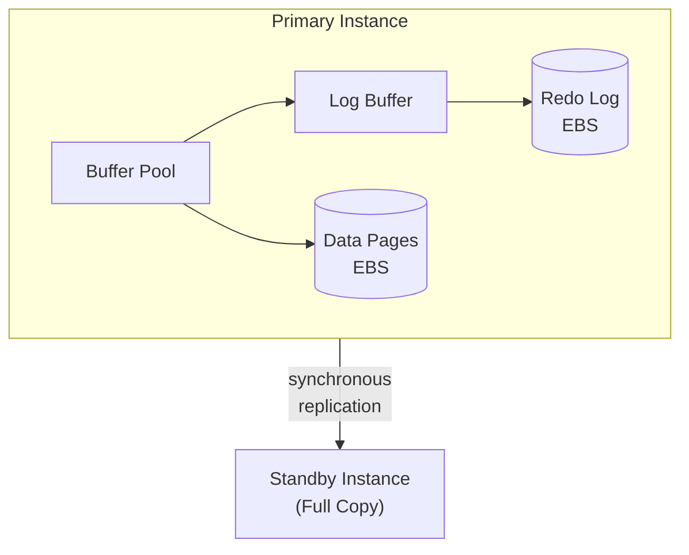
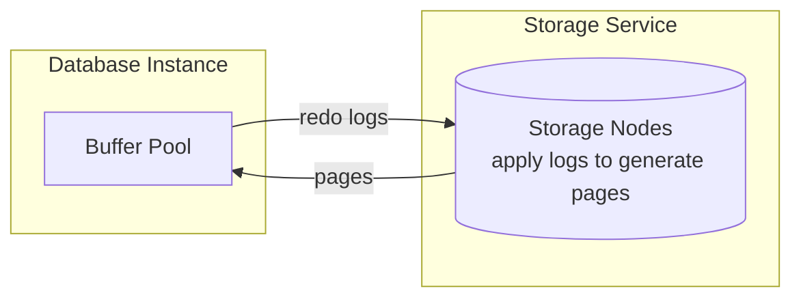
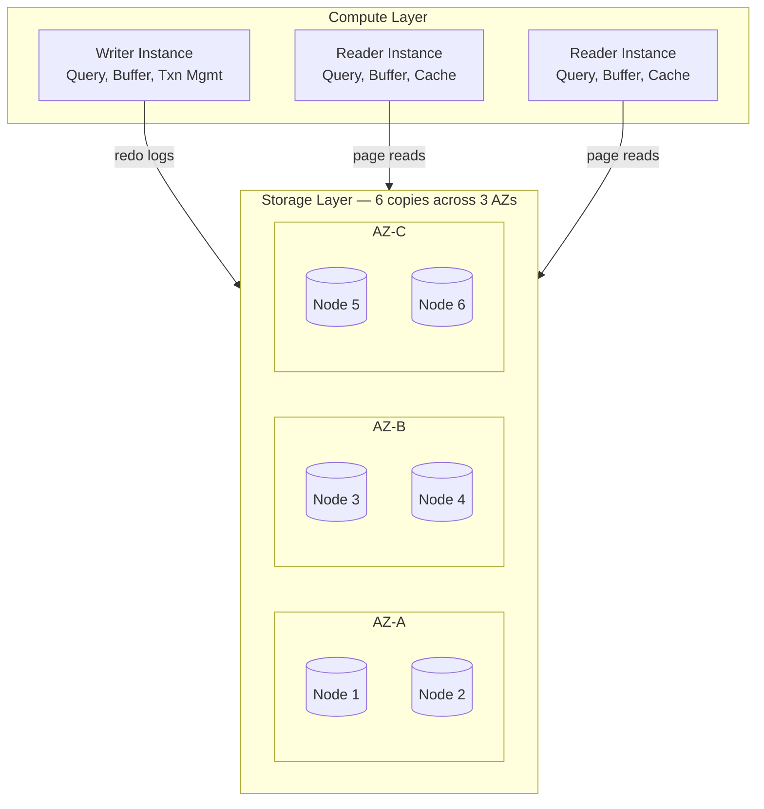
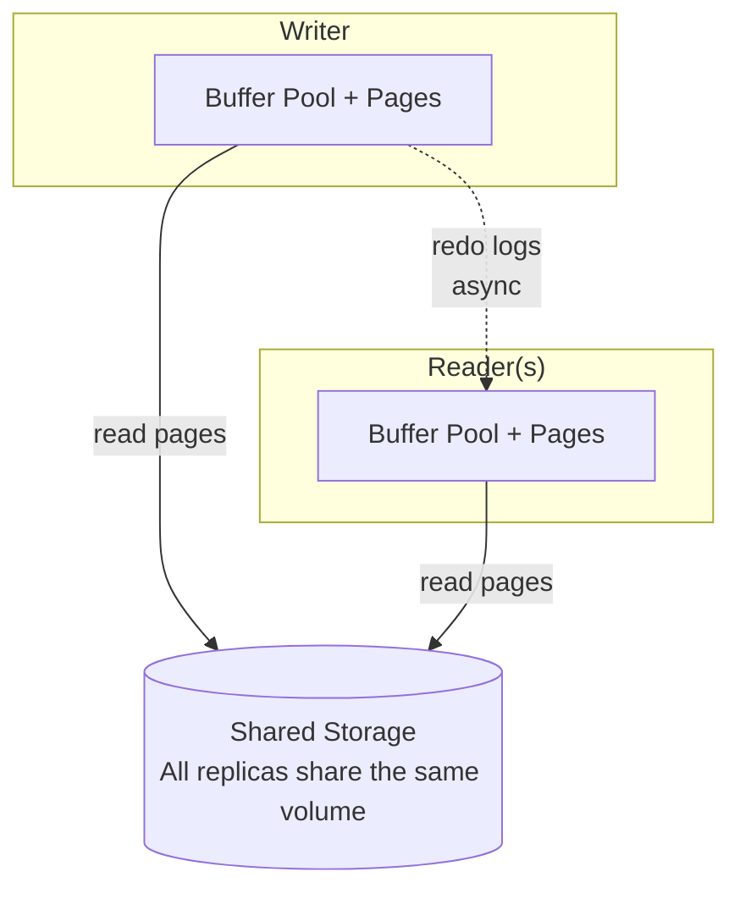

# Amazon Aurora: Design Considerations for High Throughput Cloud-Native Relational Databases

## Paper Overview

- **Title**: Amazon Aurora: Design Considerations for High Throughput Cloud-Native Relational Databases
- **Authors**: Alexandre Verbitski et al. (Amazon Web Services)
- **Published**: SIGMOD 2017
- **Context**: AWS needed a cloud-native relational database with high availability

## TL;DR

Aurora is a cloud-native relational database that provides:
- **Log-is-the-database** architecture separating compute and storage
- **6-way replication** across 3 availability zones
- **Quorum-based I/O** for durability without consensus overhead
- **Near-instant crash recovery** through parallel, on-demand redo

## Problem Statement

### Traditional Database Limitations in the Cloud



> **Problems:** 1) Network I/O amplification (4x for mirrored EBS). 2) Synchronous replication adds latency. 3) Crash recovery replays entire redo log. 4) Failover takes minutes.

### Aurora's Insight



> **"The log is the database."** Traditional: Write pages + Write logs (2x writes). Aurora: Write logs only (storage applies them).
> **Benefits:** Network traffic reduced to just redo logs. Storage handles durability and replication. Crash recovery is just storage reconstruction.

## Architecture

### Overall System Design



### Storage Segmentation

```
┌─────────────────────────────────────────────────────────────────┐
│                   Storage Segmentation                          │
├─────────────────────────────────────────────────────────────────┤
│                                                                  │
│  Database Volume (up to 128 TB)                                 │
│  ┌──────────────────────────────────────────────────────────┐   │
│  │                                                           │   │
│  │  Segment 1 (10GB)    Segment 2 (10GB)    Segment N       │   │
│  │  ┌────────────────┐  ┌────────────────┐  ┌────────────┐  │   │
│  │  │                │  │                │  │            │  │   │
│  │  │  6 replicas    │  │  6 replicas    │  │ 6 replicas │  │   │
│  │  │  across 3 AZs  │  │  across 3 AZs  │  │            │  │   │
│  │  │                │  │                │  │            │  │   │
│  │  └────────────────┘  └────────────────┘  └────────────┘  │   │
│  │                                                           │   │
│  └──────────────────────────────────────────────────────────┘   │
│                                                                  │
│  Protection Groups (PGs):                                       │
│  ┌──────────────────────────────────────────────────────────┐   │
│  │  Each segment forms a Protection Group                   │   │
│  │  - 6 storage nodes per PG                                │   │
│  │  - 2 nodes per Availability Zone                         │   │
│  │  - Independent failure domain                            │   │
│  └──────────────────────────────────────────────────────────┘   │
│                                                                  │
│  Benefits:                                                      │
│  - Parallel repair (10GB takes ~10 seconds)                     │
│  - Blast radius limited to 10GB segment                         │
│  - Background repair doesn't affect foreground operations       │
│                                                                  │
└─────────────────────────────────────────────────────────────────┘
```

## Quorum-Based I/O

### Write and Read Quorums

```python
class AuroraQuorum:
    """Aurora's quorum-based replication."""
    
    def __init__(self):
        self.replicas = 6     # Total copies
        self.write_quorum = 4 # Vw
        self.read_quorum = 3  # Vr
        
        # Vw + Vr > V (4 + 3 > 6) ensures overlap
        # Vw > V/2 (4 > 3) ensures no conflicting writes
    
    def write(self, log_record) -> bool:
        """
        Write log record to storage.
        
        Must reach write quorum (4/6) to acknowledge.
        """
        acks = 0
        futures = []
        
        for storage_node in self.get_nodes_for_segment(log_record.segment):
            future = storage_node.write_async(log_record)
            futures.append(future)
        
        # Wait for write quorum
        for future in futures:
            try:
                future.wait(timeout=50)  # 50ms
                acks += 1
                if acks >= self.write_quorum:
                    return True
            except Timeout:
                continue
        
        return acks >= self.write_quorum
    
    def read(self, page_id) -> Page:
        """
        Read page from storage.
        
        Only need read quorum (3/6) - but actually
        Aurora optimizes to read from single node!
        """
        # In practice, Aurora tracks which nodes are current
        # and reads from a single up-to-date node
        node = self.get_current_node(page_id)
        return node.read_page(page_id)


class QuorumProperties:
    """
    Aurora's quorum guarantees.
    
    With V=6, Vw=4, Vr=3:
    - Survives loss of entire AZ (2 nodes) + 1 additional node
    - Writes complete with any 4 nodes available
    - Reads complete with any 3 nodes available
    """
    
    def can_write_with_az_failure(self) -> bool:
        """
        AZ failure = 2 nodes down
        Remaining = 4 nodes
        Write quorum = 4
        Can still write!
        """
        return True
    
    def can_read_with_az_plus_one_failure(self) -> bool:
        """
        AZ + 1 failure = 3 nodes down
        Remaining = 3 nodes
        Read quorum = 3
        Can still read!
        """
        return True
    
    def write_read_overlap(self) -> bool:
        """
        Any read quorum overlaps with any write quorum.
        
        Vw + Vr = 4 + 3 = 7 > 6
        Guarantees at least 1 node has latest write.
        """
        return True
```

### Durability Model

```
┌─────────────────────────────────────────────────────────────────┐
│                  Aurora Durability Model                        │
├─────────────────────────────────────────────────────────────────┤
│                                                                  │
│  Failure Scenarios:                                             │
│                                                                  │
│  Scenario 1: Single Node Failure                                │
│  ┌─────────────────────────────────────────────────────────┐    │
│  │  AZ-A        AZ-B        AZ-C                           │    │
│  │  [1] [X]     [3] [4]     [5] [6]                        │    │
│  │                                                          │    │
│  │  5 nodes up, can read (3) and write (4) ✓               │    │
│  └─────────────────────────────────────────────────────────┘    │
│                                                                  │
│  Scenario 2: AZ Failure                                         │
│  ┌─────────────────────────────────────────────────────────┐    │
│  │  AZ-A        AZ-B        AZ-C                           │    │
│  │  [X] [X]     [3] [4]     [5] [6]                        │    │
│  │                                                          │    │
│  │  4 nodes up, can read (3) and write (4) ✓               │    │
│  └─────────────────────────────────────────────────────────┘    │
│                                                                  │
│  Scenario 3: AZ + 1 Failure                                     │
│  ┌─────────────────────────────────────────────────────────┐    │
│  │  AZ-A        AZ-B        AZ-C                           │    │
│  │  [X] [X]     [X] [4]     [5] [6]                        │    │
│  │                                                          │    │
│  │  3 nodes up, can read (3), cannot write ✗               │    │
│  │  (Read-only mode until repair)                          │    │
│  └─────────────────────────────────────────────────────────┘    │
│                                                                  │
│  Repair:                                                        │
│  ┌─────────────────────────────────────────────────────────┐    │
│  │  - 10GB segment repairs in ~10 seconds                  │    │
│  │  - Background gossip-based repair                       │    │
│  │  - MTTF of double failure ≈ extremely low               │    │
│  └─────────────────────────────────────────────────────────┘    │
│                                                                  │
└─────────────────────────────────────────────────────────────────┘
```

## Log Processing

### Log Shipping Architecture

```python
class AuroraLogShipping:
    """Aurora's log-based replication."""
    
    def __init__(self):
        self.current_lsn = 0  # Log Sequence Number
        self.commit_lsn = 0   # Last committed
        self.durable_lsn = 0  # Durable in storage
    
    def process_transaction(self, transaction):
        """
        Process transaction and ship logs.
        
        Only redo logs are shipped - not pages!
        """
        log_records = []
        
        for operation in transaction.operations:
            # Generate redo log record
            log_record = LogRecord(
                lsn=self._next_lsn(),
                transaction_id=transaction.id,
                page_id=operation.page_id,
                redo_data=operation.redo_data
            )
            log_records.append(log_record)
        
        # Ship to storage (in parallel across segments)
        futures = {}
        for record in log_records:
            segment = self._get_segment(record.page_id)
            if segment not in futures:
                futures[segment] = []
            futures[segment].append(
                self._ship_to_segment(segment, record)
            )
        
        # Wait for all segments to acknowledge
        for segment, segment_futures in futures.items():
            for future in segment_futures:
                future.wait()
        
        # Transaction is durable when all logs acknowledged
        self.durable_lsn = max(r.lsn for r in log_records)
        
        return True
    
    def _ship_to_segment(self, segment, log_record):
        """
        Ship log record to storage segment.
        
        Storage will:
        1. Persist log record
        2. Add to pending queue
        3. Eventually apply to generate page
        """
        return segment.write_log_async(log_record)


class StorageNode:
    """Aurora storage node operations."""
    
    def __init__(self):
        self.log_records = []
        self.pages = {}
        self.pending_queue = []
    
    def write_log(self, log_record) -> bool:
        """
        Receive and persist log record.
        
        This is the ONLY write from compute!
        """
        # Persist to local storage (SSD)
        self._persist_log(log_record)
        
        # Add to pending queue for page materialization
        self.pending_queue.append(log_record)
        
        # Acknowledge immediately - no blocking
        return True
    
    def read_page(self, page_id) -> Page:
        """
        Read page, applying pending logs if needed.
        
        Redo application happens on READ, not WRITE.
        """
        # Get base page
        page = self.pages.get(page_id)
        if page is None:
            page = Page.empty(page_id)
        
        # Apply any pending log records for this page
        pending_for_page = [
            r for r in self.pending_queue 
            if r.page_id == page_id
        ]
        
        for record in sorted(pending_for_page, key=lambda r: r.lsn):
            page = self._apply_redo(page, record)
        
        return page
    
    def background_coalesce(self):
        """
        Background process to apply logs to pages.
        
        Reduces work on read path.
        """
        while True:
            # Group pending records by page
            by_page = defaultdict(list)
            for record in self.pending_queue:
                by_page[record.page_id].append(record)
            
            # Apply and persist pages
            for page_id, records in by_page.items():
                page = self.pages.get(page_id, Page.empty(page_id))
                for record in sorted(records, key=lambda r: r.lsn):
                    page = self._apply_redo(page, record)
                
                self.pages[page_id] = page
                
                # Remove applied records
                max_lsn = max(r.lsn for r in records)
                self.pending_queue = [
                    r for r in self.pending_queue
                    if r.page_id != page_id or r.lsn > max_lsn
                ]
            
            time.sleep(1)  # Run every second
```

### Network I/O Reduction

```
┌─────────────────────────────────────────────────────────────────┐
│              Network I/O Comparison                             │
├─────────────────────────────────────────────────────────────────┤
│                                                                  │
│  Traditional MySQL with EBS Mirroring:                          │
│  ┌─────────────────────────────────────────────────────────┐    │
│  │                                                          │    │
│  │  Per Transaction Write:                                  │    │
│  │  1. Redo log (primary EBS)          → 1 network I/O     │    │
│  │  2. Redo log (mirror EBS)           → 1 network I/O     │    │
│  │  3. Binlog (primary EBS)            → 1 network I/O     │    │
│  │  4. Binlog (mirror EBS)             → 1 network I/O     │    │
│  │  5. Data page (primary EBS)         → 1 network I/O     │    │
│  │  6. Data page (mirror EBS)          → 1 network I/O     │    │
│  │  7. Double-write buffer             → 1 network I/O     │    │
│  │  8. FRM files                       → 1 network I/O     │    │
│  │                                                          │    │
│  │  Total: ~8 network round trips, synchronous             │    │
│  └─────────────────────────────────────────────────────────┘    │
│                                                                  │
│  Aurora:                                                        │
│  ┌─────────────────────────────────────────────────────────┐    │
│  │                                                          │    │
│  │  Per Transaction Write:                                  │    │
│  │  1. Redo log to storage nodes       → 1 network I/O     │    │
│  │     (sent in parallel to 6 nodes)                       │    │
│  │                                                          │    │
│  │  Total: 1 network round trip (parallel to 6 nodes)      │    │
│  │                                                          │    │
│  │  No data pages, no binlog, no double-write buffer!      │    │
│  └─────────────────────────────────────────────────────────┘    │
│                                                                  │
│  Result: 35x reduction in I/O per transaction                   │
│                                                                  │
└─────────────────────────────────────────────────────────────────┘
```

## Recovery and Failover

### Crash Recovery

```python
class AuroraRecovery:
    """
    Aurora crash recovery - near instant.
    
    Key insight: Recovery is just establishing
    consistency point, not replaying logs.
    """
    
    def recover_after_crash(self):
        """
        Crash recovery process.
        
        Traditional: Replay entire redo log (minutes to hours)
        Aurora: Find highest durable LSN (seconds)
        """
        # Step 1: Find Volume Durable LSN (VDL)
        vdl = self._find_volume_durable_lsn()
        
        # Step 2: Truncate any logs beyond VDL
        self._truncate_incomplete_logs(vdl)
        
        # Step 3: Ready to serve!
        # Pages are reconstructed on-demand during reads
        return vdl
    
    def _find_volume_durable_lsn(self) -> int:
        """
        Find highest LSN durable across all segments.
        
        Query each segment for its highest complete LSN.
        VDL = min of all segment's highest complete LSN.
        """
        segment_lsns = []
        
        for segment in self.segments:
            # Each segment knows its highest complete LSN
            # (based on quorum writes)
            highest = segment.get_highest_complete_lsn()
            segment_lsns.append(highest)
        
        # VDL is the min - guarantees all prior logs are durable
        return min(segment_lsns)
    
    def _reconstruct_page_on_demand(self, page_id) -> Page:
        """
        Reconstruct page when first accessed.
        
        Storage has all the logs needed.
        """
        segment = self._get_segment(page_id)
        return segment.read_page(page_id)  # Applies pending logs


class FastFailover:
    """Aurora fast failover mechanism."""
    
    def __init__(self):
        self.writer = None
        self.readers = []
        self.failover_time = 0
    
    def perform_failover(self, new_writer):
        """
        Failover to new writer.
        
        Steps:
        1. Detect failure (typically via health checks)
        2. Promote reader to writer
        3. Update DNS
        
        Total time: ~30 seconds
        """
        start = time.time()
        
        # Step 1: Detect failure
        if not self._is_writer_healthy():
            # Step 2: Promote reader
            new_writer = self._select_best_reader()
            
            # Reader has most of buffer pool already!
            # Just needs to:
            # - Establish write capability
            # - Catch up any missing logs
            new_writer.become_writer()
            
            # Step 3: Update DNS
            self._update_dns(new_writer)
        
        self.failover_time = time.time() - start
        # Typically < 30 seconds
    
    def _select_best_reader(self):
        """
        Select reader with most up-to-date buffer pool.
        
        Reader replicas continuously apply redo logs,
        so they're nearly current with writer.
        """
        best = None
        highest_lsn = 0
        
        for reader in self.readers:
            if reader.current_lsn > highest_lsn:
                highest_lsn = reader.current_lsn
                best = reader
        
        return best
```

## Read Replicas

### Replica Architecture



> **Replica Lag:** Typically less than 20ms (log shipping latency). No data copying between writer and readers.

### Replica Log Application

```python
class AuroraReplica:
    """Aurora read replica implementation."""
    
    def __init__(self, storage):
        self.storage = storage
        self.buffer_pool = BufferPool()
        self.current_lsn = 0
        self.log_queue = []
    
    def receive_log_record(self, log_record):
        """
        Receive redo log from writer.
        
        Sent asynchronously for low overhead.
        """
        self.log_queue.append(log_record)
        
        # Apply to buffer pool if page is cached
        if log_record.page_id in self.buffer_pool:
            self._apply_to_buffer_pool(log_record)
    
    def _apply_to_buffer_pool(self, log_record):
        """
        Apply log record to cached page.
        
        Keeps buffer pool consistent with writer.
        """
        page = self.buffer_pool.get(log_record.page_id)
        
        # Check if this log is newer than page
        if log_record.lsn > page.lsn:
            # Apply redo to page
            new_page = self._apply_redo(page, log_record)
            self.buffer_pool.put(log_record.page_id, new_page)
        
        self.current_lsn = max(self.current_lsn, log_record.lsn)
    
    def read_page(self, page_id) -> Page:
        """
        Read page for query.
        
        Check buffer pool first, then storage.
        """
        if page_id in self.buffer_pool:
            return self.buffer_pool.get(page_id)
        
        # Read from shared storage
        # Storage applies any pending logs automatically
        page = self.storage.read_page(page_id)
        
        # Apply any pending logs in our queue
        for record in self.log_queue:
            if record.page_id == page_id and record.lsn > page.lsn:
                page = self._apply_redo(page, record)
        
        self.buffer_pool.put(page_id, page)
        return page
    
    def get_replica_lag(self) -> float:
        """
        Get replica lag in seconds.
        
        Typically < 20ms due to async log shipping.
        """
        if not self.log_queue:
            return 0
        
        oldest = min(r.timestamp for r in self.log_queue)
        return time.time() - oldest
```

## Storage Gossip and Repair

### Gossip Protocol

```python
class StorageGossip:
    """
    Aurora storage gossip for repair.
    
    Storage nodes constantly gossip to detect
    and repair missing data.
    """
    
    def __init__(self, node_id: int, peers: list):
        self.node_id = node_id
        self.peers = peers
        self.log_records = {}  # lsn -> LogRecord
        self.gaps = []
    
    def gossip_round(self):
        """
        One round of gossip with peers.
        
        Exchange information about what logs we have.
        """
        for peer in self.peers:
            # Send our highest LSN
            their_info = peer.exchange_info(
                my_highest_lsn=self.get_highest_lsn(),
                my_gaps=self.gaps
            )
            
            # Fill gaps from peer
            for gap in self.gaps:
                if peer.has_logs(gap.start, gap.end):
                    missing = peer.get_logs(gap.start, gap.end)
                    self._fill_gap(missing)
            
            # Provide logs to peer if they're missing
            for gap in their_info.gaps:
                if self.has_logs(gap.start, gap.end):
                    logs = self.get_logs(gap.start, gap.end)
                    peer.receive_repair_logs(logs)
    
    def detect_gaps(self):
        """
        Detect gaps in log sequence.
        
        Gaps occur when some writes didn't reach us.
        """
        self.gaps = []
        lsns = sorted(self.log_records.keys())
        
        for i in range(len(lsns) - 1):
            if lsns[i+1] - lsns[i] > 1:
                self.gaps.append(Gap(
                    start=lsns[i] + 1,
                    end=lsns[i+1] - 1
                ))
    
    def _fill_gap(self, logs: list):
        """Fill gap with received logs."""
        for log in logs:
            self.log_records[log.lsn] = log
        
        # Re-detect gaps
        self.detect_gaps()


class SegmentRepair:
    """
    Fast segment repair after node failure.
    
    10GB segment can be repaired in ~10 seconds.
    """
    
    def repair_segment(self, failed_node, segment_id):
        """
        Repair segment by copying from healthy nodes.
        
        Parallel copy from multiple sources.
        """
        # Find healthy nodes with this segment
        healthy_nodes = self.get_healthy_nodes(segment_id)
        
        # Divide segment into chunks
        chunks = self.divide_into_chunks(segment_id, num_chunks=100)
        
        # Parallel copy from different nodes
        futures = []
        for i, chunk in enumerate(chunks):
            source = healthy_nodes[i % len(healthy_nodes)]
            future = self.copy_chunk_async(source, chunk)
            futures.append(future)
        
        # Wait for all chunks
        for future in futures:
            future.wait()
        
        # Verify integrity
        self.verify_segment(segment_id)
```

## Performance

### Key Metrics

```
┌─────────────────────────────────────────────────────────────────┐
│                   Aurora Performance                            │
├─────────────────────────────────────────────────────────────────┤
│                                                                  │
│  Throughput:                                                    │
│  ┌─────────────────────────────────────────────────────────┐    │
│  │  5x throughput of MySQL on same hardware                │    │
│  │  Up to 200K writes/sec on r4.16xlarge                   │    │
│  └─────────────────────────────────────────────────────────┘    │
│                                                                  │
│  Latency:                                                       │
│  ┌─────────────────────────────────────────────────────────┐    │
│  │  Commit latency: 4-6ms (vs 20ms for traditional)        │    │
│  │  Replica lag: <20ms typically                           │    │
│  └─────────────────────────────────────────────────────────┘    │
│                                                                  │
│  Recovery:                                                      │
│  ┌─────────────────────────────────────────────────────────┐    │
│  │  Crash recovery: Seconds (vs minutes/hours)             │    │
│  │  Failover: ~30 seconds                                  │    │
│  │  Segment repair: ~10 seconds for 10GB                   │    │
│  └─────────────────────────────────────────────────────────┘    │
│                                                                  │
│  Storage:                                                       │
│  ┌─────────────────────────────────────────────────────────┐    │
│  │  Max size: 128 TB                                       │    │
│  │  Automatic scaling (10GB increments)                    │    │
│  │  6-way replication included                             │    │
│  └─────────────────────────────────────────────────────────┘    │
│                                                                  │
│  Cost:                                                          │
│  ┌─────────────────────────────────────────────────────────┐    │
│  │  1/10th cost of traditional enterprise databases        │    │
│  │  Pay for storage used, not provisioned                  │    │
│  └─────────────────────────────────────────────────────────┘    │
│                                                                  │
└─────────────────────────────────────────────────────────────────┘
```

## Influence and Legacy

### Impact on Cloud Databases

```
┌──────────────────────────────────────────────────────────────┐
│                    Aurora's Influence                        │
├──────────────────────────────────────────────────────────────┤
│                                                               │
│  Innovations:                                                │
│  ┌─────────────────────────────────────────────────────┐     │
│  │  - Log-is-the-database architecture                 │     │
│  │  - Separation of compute and storage                │     │
│  │  - Push redo application to storage                 │     │
│  │  - Cloud-native durability model                    │     │
│  └─────────────────────────────────────────────────────┘     │
│                                                               │
│  Inspired:                                                   │
│  ┌─────────────────────────────────────────────────────┐     │
│  │  - Azure SQL Hyperscale                             │     │
│  │  - Google AlloyDB                                   │     │
│  │  - Snowflake (similar compute/storage separation)   │     │
│  │  - PolarDB (Alibaba)                                │     │
│  └─────────────────────────────────────────────────────┘     │
│                                                               │
│  Key Lesson:                                                 │
│  ┌─────────────────────────────────────────────────────┐     │
│  │  Traditional database architecture doesn't fit      │     │
│  │  the cloud. Redesigning storage layer enables       │     │
│  │  dramatic improvements in durability, performance,  │     │
│  │  and cost.                                          │     │
│  └─────────────────────────────────────────────────────┘     │
│                                                               │
└──────────────────────────────────────────────────────────────┘
```

## Key Takeaways

1. **Log is the database**: Ship logs, not pages - 35x I/O reduction
2. **Separate compute and storage**: Independent scaling and failure domains
3. **Quorum writes, single reads**: 4/6 write quorum, optimized read path
4. **Segment for repairability**: 10GB segments repair in seconds
5. **Push work to storage**: Redo application happens on read, not write
6. **Near-instant recovery**: Just find consistency point, don't replay
7. **Shared storage for replicas**: No data copying, sub-20ms lag
