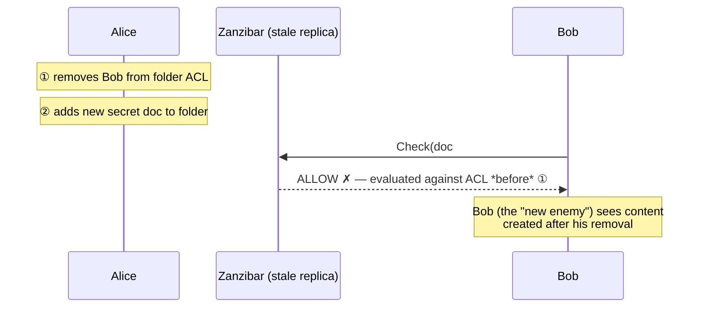
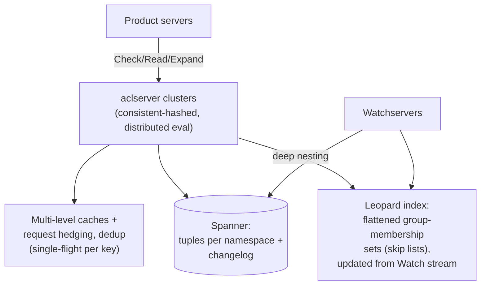

# Zanzibar: Google's Consistent, Global Authorization System

## Paper Overview

- **Title**: Zanzibar: Google's Consistent, Global Authorization System
- **Authors**: Ruoming Pang, Ramón Cáceres, Mike Burrows, et al. (Google)
- **Published**: USENIX ATC 2019
- **Context**: One authorization system for Calendar, Cloud, Drive, Maps, Photos, YouTube — trillions of ACLs, millions of QPS, with a correctness requirement no cache may violate

## TL;DR

Zanzibar stores permissions as **relation tuples** (`object#relation@user`) in Spanner and answers "can user U do R on object O?" as a graph reachability problem, configured per-application by **userset rewrite rules** (owner ⊆ editor ⊆ viewer, parent-folder inheritance). Its deepest contribution is consistency: the **new-enemy problem** — stale ACL reads letting a just-revoked user see new content — is prevented with **zookies**, snapshot tokens that pin content versions to ACL versions, exploiting Spanner's TrueTime ordering. The serving architecture (aggressive caching + the **Leopard** index for deeply nested groups) delivers ~10ms p95 at millions of QPS and five-nines availability over three years. Every modern ReBAC system — SpiceDB, OpenFGA, Ory Keto — is an implementation of this paper.

---

## The Problem

Every Google product needs the same primitive — *is this principal allowed to act on this resource?* — evaluated on **every request**, against permissions that users edit constantly, with sharing semantics that cross product boundaries (a Doc shared via Drive to a Group, embedded in Calendar). Building authorization per-product yields N inconsistent engines and zero interoperability. The requirements that make a unified service hard:

1. **Correctness with ordering guarantees** — respect the causal order of permission changes (the crux; see below).
2. **Flexibility** — Drive's folder inheritance, YouTube's public/unlisted/private, Cloud IAM's roles, all in one data model.
3. **Low latency at high scale** — authorization sits on the critical path of *everything*; the paper reports >2 trillion tuples and ~10M peak QPS (checks dominated by *reads*: ~99% of traffic).
4. **Availability** — if authz is down, everything is down: 99.999% observed over 3 years.

---

## Data Model: Tuples + Rewrites

```
⟨tuple⟩ ::= ⟨object⟩ '#' ⟨relation⟩ '@' ⟨user⟩
object  ::= namespace ':' object_id
user    ::= user_id | userset            (userset = object#relation — the nesting trick)

doc:readme#owner@user:10
doc:readme#parent@folder:specs
folder:specs#viewer@group:eng#member     ← "members of group:eng", not a single user
```

Allowing a tuple's user field to be another **userset** is what makes groups-in-groups and folder trees natural — the ACL graph references itself. Per-namespace **userset rewrite rules** then define computed relations:

```yaml
relation: viewer
rewrite:
  union:
    - this: {}                                  # direct viewer tuples
    - computed_userset: {relation: editor}      # editors are viewers
    - tuple_to_userset:                         # inherit from parent folder
        tupleset: {relation: parent}
        computed_userset: {relation: viewer}
```

A `Check(doc:readme#viewer@user:bob)` is a recursive evaluation of this expression tree — direct lookup ∪ editor-check ∪ (find parents → check their viewers) — i.e., pointer-chasing through a distributed graph. The API surface is small and has become the de facto ReBAC standard: **Check**, **Read/Write** (tuples, with optimistic concurrency per object), **Expand** (the full effective userset, for audit), **Watch** (a change stream for downstream indexes — [CDC](../13-data-pipelines/04-change-data-capture.md) for permissions).

---

## The New-Enemy Problem and Zookies

The paper's sharpest idea. With replicated, cached ACLs, two stale-read interleavings break security:



(The mirror case: save content, then *tighten* the ACL — the new ACL must govern the old content.) The fix is not "always read fresh" (that forfeits caching and the latency budget); it's **bounded, *content-aware* staleness**:

- Every ACL write commits at a TrueTime timestamp in Spanner ([Spanner](./04-spanner.md) provides external consistency — the causal order between Alice's two actions is preserved in timestamps).
- When a client stores content, it asks Zanzibar for a **zookie** — an opaque token encoding the current snapshot — and persists it *with the content*.
- Every `Check` for that content carries its zookie: *evaluate at a snapshot ≥ this timestamp*. Replicas may serve from cache **if** their snapshot is fresh enough; otherwise they read through.

Result: caches and replicas everywhere, yet no check ever uses an ACL older than the content it protects. The generalizable lesson for any authz (or cache) design: **revocation-sensitive reads need a freshness floor, and the floor should travel with the data it protects** ([Authorization at Scale](../10-security/07-authorization-patterns.md), [Consistency Models](../01-foundations/04-consistency-models.md)).

---

## Serving Architecture



Details that carry to any read-heavy, correctness-critical service:

- **Distributed evaluation with cache-aware routing:** a Check fans out subproblems across aclservers consistent-hashed by (object, relation), so hot subproblems (e.g., "is U in group:eng?") hit the same server's cache; in-flight identical subchecks are deduplicated (single-flight). Hot-spot mitigation, [hedged reads](../06-scaling/10-retries-timeouts-hedging.md) against slow Spanner replicas, and lock tables against thundering herds do the rest.
- **Leopard** handles the pathological case: deeply nested groups would mean unbounded recursive fan-out, so group-membership reachability is **precomputed** into flattened sets (transitive closure, maintained incrementally from the Watch stream within seconds) and intersected at query time — the same materialize-the-expensive-path move as a [reverse index for list-filtering](../10-security/07-authorization-patterns.md).
- **Hot standby reads:** latency-critical checks issue a second request to another replica after a short delay — tail-latency engineering straight from [The Tail at Scale](../06-scaling/10-retries-timeouts-hedging.md).
- Performance reported: ~10M QPS peak, p50 ~3ms / p95 ~10ms for checks, 99.999% availability — numbers achieved *with* the zookie consistency guarantee, which is the point.

---

## Influence on System Design

- **ReBAC became the default model for sharing-shaped permissions**, and the open-source ecosystem (SpiceDB, OpenFGA, Ory Keto, Permify) implements this paper's API almost verbatim — tuples, rewrites, zookie-equivalents (SpiceDB's ZedTokens), Watch streams.
- **Authorization as infrastructure:** the paper legitimized pulling authz out of N applications into one consistent, observable service with a latency SLO — the [PDP/PEP architecture](../10-security/07-authorization-patterns.md) at planetary scale.
- **Consistency tokens as a pattern:** "carry a snapshot token with the data it governs" generalizes beyond authz — read-your-writes session tokens, [CDC](../13-data-pipelines/04-change-data-capture.md) watermarks, and cache-freshness floors are the same shape.
- Built **on** Spanner's TrueTime rather than re-deriving ordering — a reminder that externally consistent storage is a substrate other guarantees can be cheaply built upon ([Spanner](./04-spanner.md)).

## References

- [Zanzibar: Google's Consistent, Global Authorization System (USENIX ATC '19)](https://www.usenix.org/conference/atc19/presentation/pang)
- [Spanner: Google's Globally-Distributed Database](./04-spanner.md) — the storage and TrueTime substrate
- [SpiceDB](https://authzed.com/docs) / [OpenFGA](https://openfga.dev/docs) — open-source implementations, with annotated-paper commentary
- [Authorization at Scale](../10-security/07-authorization-patterns.md) — the practitioner companion to this paper
