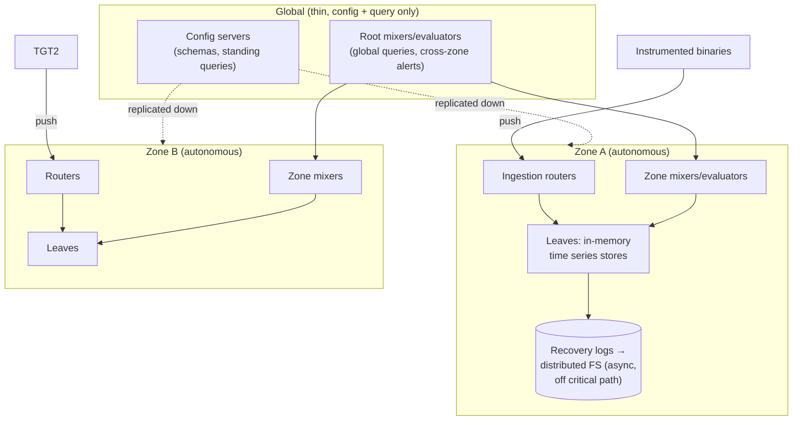

# Monarch: Google's Planet-Scale In-Memory Time Series Database

## Paper Overview

- **Title**: Monarch: Google's Planet-Scale In-Memory Time Series Database
- **Authors**: Colin Adams, Luis Alonso, Benjamin Atkin, et al. (Google)
- **Published**: VLDB 2020
- **Context**: The successor to Borgmon (the system Prometheus reimplements); monitoring for all of Google — including monitoring's own dependencies

## TL;DR

Monarch is the rare database that **deliberately chooses availability over consistency and memory over durable storage**, because its workload is monitoring: during an outage is exactly when you need your metrics, and a monitoring system that depends on the infrastructure it monitors (persistent storage, global consensus) fails *with* it. The design: a **regionalized architecture** (autonomous zones that keep working in isolation) with a thin global query/config plane; **push-based** collection into in-memory leaf stores; a **rich typed data model** whose killer feature is first-class **distribution (histogram) values** with exemplars; and queries that execute as a tree, **pushed down** to where the data lives, with aggregation at every level. Reported scale: ~950TB in RAM across ~400K tasks, terabytes of ingest per second — and the lessons (zonal autonomy, pushdown, pre-aggregation, histograms-as-values) shaped every serious metrics platform since.

---

## The Problem: Monitoring Can't Share Fate

Borgmon (Google's first-generation metrics system, ~2003) pioneered pull-based collection, a metrics query language, and alerting rules — the lineage Prometheus made public. But it pushed operational burden onto every team (running and sharding your own Borgmon), and its successor had a harder constraint than scale:

> A monitoring system must have **fewer dependencies than the systems it monitors**, and must remain useful precisely when those systems are failing.

That single requirement drives every unusual choice in the paper:

| Conventional DB instinct | Monarch's choice | Why |
|---|---|---|
| Durable writes (WAL, replicated disk) | **In-memory**, logs written *off* the critical path for recovery | Storage stack (itself monitored by Monarch) can't be a write dependency ([WAL](../03-storage-engines/04-write-ahead-logging.md) inverted) |
| Strong consistency, global coordination | **Per-zone autonomy**, eventual global views | A partition must not blind a region's monitoring ([CAP](../01-foundations/03-cap-theorem.md): this is an AP system on purpose) |
| Normalize, store raw, aggregate at query | **Aggregate during collection and ingest** | Query-time aggregation over raw planet-scale data is unpayable |
| Pull-based scraping (Borgmon/Prometheus) | **Push** from instrumented targets | Pull requires the monitor to track and reach every target — discovery and network dependencies that fail during incidents |

---

## Architecture: Autonomous Zones, Thin Global Plane

- **Leaves** hold time series in RAM, sharded by a **lexicographic range partition** of the target key (cluster/job/task...) — range-sharding keeps a job's tasks colocated, which makes the dominant query shape ("this service in this zone") local and cheap ([Partitioning Strategies](../02-distributed-databases/05-partitioning-strategies.md)).
- **Zonal autonomy:** each zone ingests, stores, evaluates alerts, and serves queries independently. The global layer adds cross-zone queries and configuration distribution; if it's unreachable, zones keep monitoring and alerting. This is [cell-based thinking](../06-scaling/11-cell-based-architecture.md) applied to observability — blast radius of a zone, with monitoring's special twist that *the alerting path stays inside the zone*.
- **Recovery logs, not WALs:** writes are acknowledged from memory; logs flow asynchronously to distributed storage purely for restart recovery, and the system tolerates log unavailability. Durability is sacrificed knowingly — losing a few seconds of metrics is acceptable; being unable to ingest during a storage incident is not.

## Data Model: Typed Series and First-Class Histograms

Monarch series are **schematized**: a target schema (the entity emitting — job, task, cluster) joined with a metric schema, with typed value columns. Two consequences outlived the paper:

1. **Distribution-typed values.** A single series point can be a *histogram* (bucketed distribution + count + sum, with **exemplars** linking buckets to example traces/RPCs). Recording latency as a distribution per (job, region) — rather than pre-computed percentile gauges — is what makes percentile math composable: you can aggregate histograms across tasks and *then* compute p99, whereas averaging per-task p99s is statistically meaningless. Every modern stack (Prometheus native histograms, OpenTelemetry exponential histograms) adopted this ([Metrics & Monitoring](../11-observability/02-metrics-monitoring.md)).
2. **Cardinality is managed by schema and aggregation, not hope.** High-cardinality keys (user IDs) are aggregated away at collection time via configured rollups; the system makes the [cardinality explosion](../11-observability/02-metrics-monitoring.md) a declared, budgeted decision.

## Query Execution: Pushdown All the Way Down

Queries (relational-ish pipelines: filter → align → join → group) execute as a **tree mirroring the storage hierarchy**: root mixers fan out to zone mixers, which fan out to leaves; **every level evaluates as much of the query as it can** — filtering and partial aggregation happen *at the leaves*, so what crosses the network is pre-reduced. Add **field hints indexes** (compact bloom-ish indexes of which fields/values exist where) to prune fan-out, and planet-scale queries touch only the leaves that matter. **Standing queries** (the alerting workload — the same query every N seconds) are pushed down even harder: evaluated continuously at zone or leaf level, so alerting latency and availability don't depend on the global plane at all.

The general lessons, applicable far beyond metrics: *move computation to data* ([the same argument as MapReduce](./01-mapreduce.md)), *pre-aggregate the queries you know you'll run*, and *make the always-on workload (alerts) structurally cheaper than the ad-hoc one*.

---

## Influence on System Design

- **The AP-monitoring argument is now orthodoxy:** regional autonomy with eventually-consistent global views is how serious observability platforms structure themselves; "your monitoring must not share fate with your serving stack" is a design-review question this paper armed ([SLOs & Error Budgets](../11-observability/05-slos-error-budgets.md) depend on the metrics pipeline surviving the incident).
- **Push vs pull stopped being religious:** Monarch documented *why* planetary scale + fate-sharing concerns favor push with in-process buffering, while pull remains excellent at cluster scale (Prometheus). OTel's collector-push pipeline is the industry's middle path.
- **Histograms with exemplars** became the standard latency representation, finally connecting metrics to traces ([Distributed Tracing](../11-observability/01-distributed-tracing.md)).
- The leaf/mixer pushdown tree is recognizably the ancestor of every modern metrics/OLAP federation layer (Thanos/Mimir/M3 all rhyme with it).

## References

- [Monarch: Google's Planet-Scale In-Memory Time Series Database (VLDB 2020)](https://www.vldb.org/pvldb/vol13/p3181-adams.pdf)
- [SRE Book, ch. 10: Practical Alerting from Time-Series Data](https://sre.google/sre-book/practical-alerting/) — the Borgmon ancestry
- [Prometheus](https://prometheus.io/docs/introduction/overview/) — the open-source Borgmon lineage, for contrast
- [Metrics & Monitoring](../11-observability/02-metrics-monitoring.md) and [Alerting](../11-observability/04-alerting.md) — the practitioner companions
