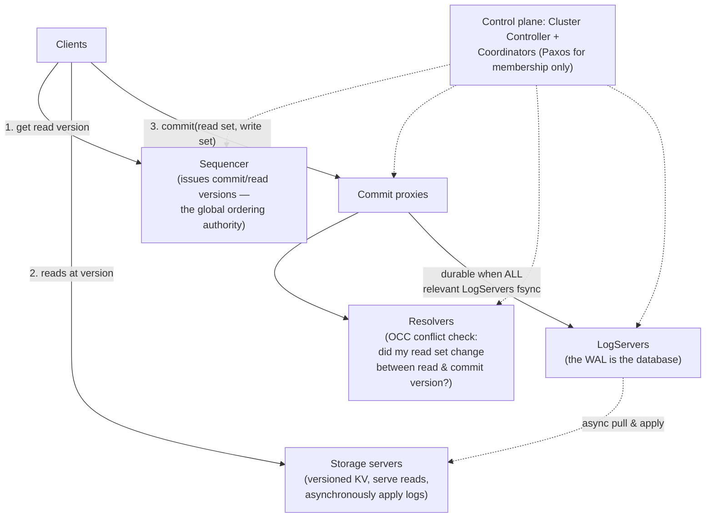
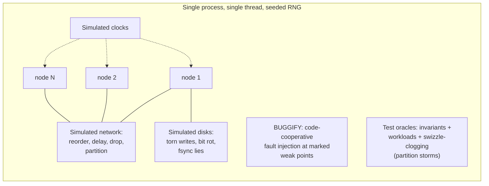

# FoundationDB: A Distributed, Unbundled, Transactional Key-Value Store

## Paper Overview

- **Title**: FoundationDB: A Distributed Unbundled Transactional Key Value Store
- **Authors**: Jingyu Zhou, Meng Xu, Alexander Shraer, et al. (Apple, Snowflake, and the FoundationDB community)
- **Published**: ACM SIGMOD 2021 (the system dates to 2009; open-sourced 2018)
- **Context**: The strictly-serializable KV core under Apple's CloudKit, Snowflake's metadata, and (a fork of) DynamoDB-class workloads — famous less for its data model than for *how it's tested*

## TL;DR

FoundationDB makes two bets that both paid off. **Architecture:** an *unbundled* design that separates the transaction system (in-memory MVCC + optimistic concurrency control), the log system (the durability truth), and the storage system (async replicas of the logs) — so each scales and recovers independently, and the "database" is really a transactional substrate on which **layers** (record, document, queue, graph) build richer models. **Methodology:** the entire distributed system runs deterministically inside a **simulation** — one process, simulated network/disks/clocks, relentless fault injection — so weeks of concentrated disaster testing run per night, bugs reproduce from a seed, and the team famously trusts the database more than the machines under it. The simulation idea has been at least as influential as the database: it seeded the deterministic-simulation-testing movement (Antithesis, TigerBeetle's VOPR, "DST" as a discipline).

---

## Architecture: Unbundle the Database

A monolithic database couples query processing, concurrency control, logging, and storage in one process. FDB pulls them apart into independently scalable roles:

- **Transactions:** strict serializability via MVCC reads + OCC writes. A client reads at a snapshot version, then submits read+write sets; **resolvers** reject the commit if any read key changed after the read version (lock-free, abort-and-retry — [the optimistic school](../01-foundations/02-isolation-levels.md)). Costs accepted honestly: transactions are capped (~5s, 10MB) because long transactions explode OCC conflict windows and MVCC retention.
- **Consensus is quarantined.** Paxos appears only in the control plane (membership/coordination); the *data path* uses the sequencer for ordering and synchronous log replication for durability — fewer round trips than consensus-per-commit, at the price of a more intricate recovery dance ([Consensus Algorithms](../02-distributed-databases/08-consensus-algorithms.md) used surgically, not everywhere).
- **Fail fast, recover fast:** any transaction-system failure triggers a full, *cheap* reconstruction of the transaction subsystem (new sequencer/proxies/resolvers, logs recovered) in seconds — recovery is a first-class designed path, not an exception handler. Meanwhile storage servers keep serving reads. This "crash-and-restructure beats limp-along" instinct shows up everywhere the [metastable-failure literature](../06-scaling/10-retries-timeouts-hedging.md) later formalized.
- **Layers:** the core exposes ordered KV + transactions, nothing else — no query language, no schema. Richer models (Apple's Record Layer with protobuf schemas and indexes; document, queue, graph layers) are *stateless libraries* whose every operation compiles to transactions. Unbundling the data model from the transactional substrate is the same move the [lakehouse](../13-data-pipelines/05-lakehouse-table-formats.md) made for analytics — and it's why one well-tested core can safely power many products.

---

## The Real Contribution: Deterministic Simulation Testing

FDB was built *simulation-first*: before the database existed, the team built **Flow** (C++ extended with async/actor primitives) so that the entire system — every node, the network between them, disks, clocks — runs as deterministic coroutines in **one OS process**:

What this buys, and why it changed minds:

- **Reproducibility:** every run is a function of a random seed. A failure found after a billion simulated events replays *exactly* — the single most painful property of distributed-systems debugging, solved by construction.
- **Time compression:** simulated time runs as fast as the CPU allows; quiet waits cost nothing. The paper's framing: years of "unlucky" production scenarios — cascading partitions during recovery during disk corruption — are exercised nightly.
- **Cooperative fault injection (`BUGGIFY`):** the code itself marks its scary corners ("what if this buffer flushes early?"), and simulation triggers them with probability — adversarial testing with insider knowledge, far sharper than black-box chaos ([chaos engineering's](../15-deployment/05-disaster-recovery.md) precision-guided cousin).
- **Culture:** new engineers break the simulator before touching production; protocol changes ship with new test oracles. The team's stated experience — production bugs found by users are *rare*, and most "database bugs" turn out to be hardware lying — inverted the usual trust relationship, motivating end-to-end checksums against the machines themselves.

The honest limits, also documented: simulation can't catch performance regressions (only correctness), depends on the fidelity of its fault models, and requires the discipline of *all* nondeterminism flowing through the simulator (no naked threads, no raw syscalls) — a constraint that shaped Flow and that successors (TigerBeetle's Zig VOPR, Antithesis's hypervisor-level determinism, FrostDB/RisingWave-style DST suites) each solve their own way.

---

## Influence on System Design

- **DST became a movement.** "Can your distributed system replay any failure from a seed?" is now a serious interview question for infrastructure teams; Antithesis productized the idea for systems not written simulation-first.
- **Unbundling as a template:** compute/log/storage separation with the log as the source of truth reappears in cloud-native databases everywhere ([Aurora](./09-aurora.md) made the same bet from a different direction: "the log is the database").
- **OCC at scale, with honest limits:** FDB demonstrated strict serializability with bounded transactions and explicit hot-key/conflict trade-offs — the design vocabulary later systems use to explain *their* choices ([Distributed Transactions](../02-distributed-databases/07-distributed-transactions.md)).
- **Layers legitimized "database as substrate":** CloudKit, Snowflake metadata, and the Record Layer showed that one ferociously tested transactional core plus stateless model layers beats N bespoke storage engines — an organizational lesson as much as a technical one.

## References

- [FoundationDB: A Distributed Unbundled Transactional Key Value Store (SIGMOD '21)](https://www.foundationdb.org/files/fdb-paper.pdf)
- [FoundationDB testing documentation & Flow](https://apple.github.io/foundationdb/testing.html) — the simulation framework, firsthand
- [FoundationDB Record Layer (SIGMOD '19)](https://www.foundationdb.org/files/record-layer-paper.pdf) — layers in practice at CloudKit scale
- ["Testing Distributed Systems w/ Deterministic Simulation" (Will Wilson, Strange Loop)](https://www.youtube.com/watch?v=4fFDFbi3toc) — the talk that spread the idea
- [Aurora](./09-aurora.md) and [Spanner](./04-spanner.md) — sibling answers to "where should the log and the clock live?"
