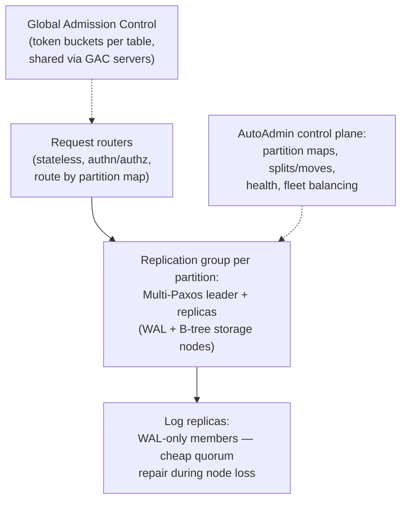

# Amazon DynamoDB (2022): Predictability as the Product

## Paper Overview

- **Title**: Amazon DynamoDB: A Scalable, Predictably Performant, and Fully Managed NoSQL Database Service
- **Authors**: Mostafa Elhemali, Niall Gallagher, et al. (Amazon)
- **Published**: USENIX ATC 2022
- **Context**: Fifteen years after the 2007 Dynamo paper — and a near-total philosophical reversal. The service that runs Amazon retail, Alexa, and hundreds of thousands of customer tables explains what a decade of multi-tenant operation taught

## TL;DR

The 2022 paper's quiet bombshell: **DynamoDB is not Dynamo**. The leaderless, eventually-consistent, gossip-based design of [the 2007 paper](./02-dynamo.md) was abandoned — operationally too sharp-edged — in favor of **Multi-Paxos-led replication groups per partition**, strong consistency on offer, and a control plane that does the hard work. The paper's actual thesis is one word: **predictability**. A multi-tenant database's product is not peak performance but *consistent single-digit-millisecond latency at any scale*, which demands: admission control evolved from per-partition allocations to **global admission control** (because static per-partition splits punish skew), automatic **split-for-consumption** driven by observed heat, **on-demand** mode that removes capacity math from customers entirely, and durability treated as a continuous *verification* problem (checksums everywhere, continuous restore testing, formal methods — TLA+ — on the protocols). It is the best public account of what "fully managed" costs the people who manage it.

---

## From Dynamo (2007) to DynamoDB (2022)

| | Dynamo 2007 | DynamoDB 2022 |
|---|---|---|
| Replication | Leaderless, sloppy quorums, hinted handoff | **Multi-Paxos leader per replication group** |
| Consistency | Eventual; vector clocks, app-side merge | Strong or eventual *by request flag*; no conflicts to merge |
| Membership | Gossip, peer-to-peer | Central control plane (AutoAdmin) |
| Operability | Each team runs its own ring | One fully managed multi-tenant fleet |
| Conflict story | Shopping-cart merge ([Conflict Resolution](../02-distributed-databases/04-conflict-resolution.md)) | Single-writer per partition ([Leader Election](../02-distributed-databases/09-leader-election.md)) |

The retreat from leaderless is the lesson: eventual consistency pushed merge complexity onto every application team, and operating gossip-based rings per service didn't scale *organizationally*. A leader per partition group plus a real control plane traded peak-theoretical availability for something customers value more — comprehensibility and uniform behavior ([Single-Leader Replication](../02-distributed-databases/01-single-leader-replication.md) winning on operational grounds).

### Architecture in one diagram

Two details worth stealing: **log replicas** (acceptors that store only the recent WAL, no B-tree) let a replication group restore its durability quorum in seconds rather than the minutes a full storage copy takes — distinguishing *durability repair* (urgent, cheap) from *capacity repair* (slow, background). And request routers consult a **partition map** kept by the control plane — the [thin-router pattern](../06-scaling/11-cell-based-architecture.md) at database scale.

---

## The Heart of the Paper: Admission Control vs. Skew

DynamoDB sells provisioned throughput (RCUs/WCUs). The naive implementation — divide a table's capacity statically among its partitions — produced the service's worst customer pain, and the paper narrates the fix in stages:

1. **Static per-partition allocation** (original): a table with 10K WCU across 10 partitions gives each 1K. Real traffic is skewed and time-varying ([hot keys](../02-distributed-databases/05-partitioning-strategies.md)), so customers were throttled *below* their paid capacity — and splitting a hot partition made it worse (capacity divided again: **throughput dilution**).
2. **Bursting + adaptive capacity:** let partitions tap unused headroom on their node (burst), and re-allocate a table's budget toward its hot partitions reactively. Better, still laggy.
3. **Global Admission Control (GAC):** the table's budget lives in a *logically central* token bucket (GAC service); request routers maintain local sub-buckets refilled from it. Admission becomes table-level and immediate — a partition is no longer a capacity unit at all, only a placement unit. Node-level token buckets remain as the backstop protecting co-tenants.
4. **Split for consumption:** partitions split based on *observed access heat* (not just size), with key-distribution-aware split points — and the system declines to split when it wouldn't help (single hot item, access already spanning the keyspace).
5. **On-demand:** with GAC + heat-driven splitting in place, capacity planning itself becomes deletable for customers — the system observes, pre-provisions headroom, and bills per request.

The arc generalizes to every multi-tenant system: **static partitioned budgets always lose to skew; admission control wants to be global, enforcement local** ([Rate Limiting](../06-scaling/05-rate-limiting.md), [Multi-Tenancy](../06-scaling/12-multi-tenancy.md) — this is the noisy-neighbor problem solved at AWS scale).

## Durability and Correctness as Continuous Processes

- **Checksums on everything** (every log entry, message, archive object); WALs archived to S3 ([3-2-1 thinking](../15-deployment/05-disaster-recovery.md)) before truncation.
- **Continuous verification:** archived data is *re-read and re-verified* against live replicas as an always-on background process — the paper's stance is that durability isn't a property you have but an activity you do ([restore testing](../15-deployment/05-disaster-recovery.md), institutionalized).
- **Formal methods:** core replication/recovery protocols specified in TLA+ and model-checked; the authors credit it with catching subtle bugs pre-production and — as important — making changes *safe to evolve*. Paired with failure-injection testing for the implementation gap the spec can't see.
- **Gray failure handling:** routers and replicas cross-check each other's connectivity before acting on "leader is down" suspicions, damping the false-failover churn that [gray failures](../01-foundations/06-failure-modes.md) otherwise cause.
- **Static stability:** during Availability-Zone outages, the data plane continues on cached partition maps and existing leases without needing the control plane — the same [static stability doctrine](../06-scaling/09-multi-region-architecture.md) AWS preaches, practiced by its flagship database.

---

## Influence on System Design

- **"Predictability over peak"** became the stated design goal of serious multi-tenant platforms — p99 *uniformity* at any scale is the product, and burst/adaptive/global admission control is the standard escalation path this paper documented.
- **The leaderless retreat** reframed the 2007 paper: Dynamo's ideas (consistent hashing, quorums, merge semantics) remain foundational *concepts*, but the operational verdict — coordination via leaders plus a strong control plane is easier to run honestly — is now the default for managed databases.
- **Durability-as-verification** (continuous checksum audits, restore drills, formal specs) moved from exotic to expected in infrastructure engineering culture.
- Together with [Aurora](./09-aurora.md) and [FoundationDB](./13-foundationdb.md), it completes the modern triptych: separate the log, quarantine consensus, and make the control plane — not the data plane — carry the cleverness.

## References

- [Amazon DynamoDB: A Scalable, Predictably Performant, and Fully Managed NoSQL Database Service (USENIX ATC '22)](https://www.usenix.org/conference/atc22/presentation/elhemali)
- [Dynamo: Amazon's Highly Available Key-value Store (2007)](./02-dynamo.md) — the ancestor, and the contrast that makes this paper interesting
- [How Amazon web services uses formal methods (CACM 2015)](https://cacm.acm.org/research/how-amazon-web-services-uses-formal-methods/) — the TLA+ practice behind §6
- [Cell-Based Architecture](../06-scaling/11-cell-based-architecture.md) and [Multi-Tenancy](../06-scaling/12-multi-tenancy.md) — the patterns this paper's admission-control story exemplifies
