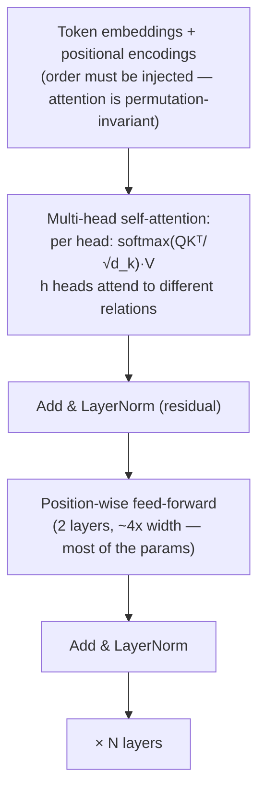

# Attention Is All You Need: The Transformer

## Paper Overview

- **Title**: Attention Is All You Need
- **Authors**: Ashish Vaswani, Noam Shazeer, Niki Parmar, Jakob Uszkoreit, Llion Jones, Aidan Gomez, Łukasz Kaiser, Illia Polosukhin (Google Brain / Research)
- **Published**: NeurIPS 2017
- **Context**: Proposed for machine translation; became the substrate of essentially all modern AI — and therefore of two sections of this fieldbook

## TL;DR

The Transformer removed recurrence from sequence models and replaced it with **self-attention**: every token computes its representation by directly attending to every other token, in parallel. That one move traded an O(n) *sequential* dependency for an O(n²) *parallelizable* computation — exactly the trade GPUs wanted — and unlocked the scaling era: bigger models, bigger data, predictable returns (scaling laws). For a systems audience, the paper matters because its architecture *is* today's workload: the *n²* attention term and the per-token **KV cache** dictate why [LLM serving](../16-llm-systems/05-llm-infrastructure.md) is memory-bandwidth-bound, why prefill and decode are different regimes, why context windows cost what they cost, and why a decade of systems work (FlashAttention, PagedAttention, MQA/GQA, MoE) is essentially a campaign against this paper's two cost terms.

---

## What It Replaced, and Why That Mattered to Hardware

Pre-2017 sequence models (RNNs/LSTMs) processed tokens **one at a time** — step t needs step t−1's hidden state. That serial chain caps GPU utilization regardless of model size, and information from distant tokens must survive a long chain of state updates (vanishing context). The Transformer's bet:

| | RNN/LSTM | Transformer |
|---|---|---|
| Long-range dependency path | O(n) steps of state decay | O(1) — direct attention edge |
| Training parallelism over sequence | None (sequential) | Full (every position at once) |
| Cost per layer | O(n·d²) | O(n²·d) attention + O(n·d²) FFN |
| Hardware fit | Poor (dependent ops) | Excellent (dense matmuls) |

The paper's deepest insight is **hardware-shaped**: an asymptotically *worse* sequence cost (n²) won because it converts into dense matrix multiplications that saturate accelerators. Architecture–hardware co-fit beats FLOP counting — a lesson that has repeated through the whole accelerator era.

## The Mechanism in One Pass

Each token projects into a **query** (what am I looking for?), **key** (what do I contain?), and **value** (what do I contribute?). Attention weights = softmax of all query·key similarities; the output mixes values accordingly. Multiple **heads** run this in parallel subspaces (syntax here, coreference there); residual connections and normalization make 100+-layer stacks trainable. The original was an encoder-decoder for translation; the lineage that conquered everything is the **decoder-only** variant (GPT-style): predict the next token with causally-masked attention, which makes every position a training example and the objective embarrassingly self-supervised.

## Why This Paper Is a *Systems* Paper in 2026

Every operational property of LLM infrastructure traces to the architecture:

- **Prefill vs decode asymmetry.** Processing the prompt is one big parallel matmul pass (compute-bound); generating runs the *whole stack once per output token* (memory-bandwidth-bound, sequential again — autoregression reintroduced the serial chain, but only at inference). This is the two-regime split that [disaggregated serving](../16-llm-systems/05-llm-infrastructure.md) exists to exploit.
- **The KV cache is the paper's data structure made operational.** Causal attention lets each generated token reuse all previous keys/values — caching them avoids quadratic re-computation but costs `layers × heads × d × 2 × seq_len` per sequence: the memory object that PagedAttention virtualizes, prefix caching shares, MQA/GQA shrink (fewer K/V heads), and [context-management](../16-llm-systems/08-context-management.md) budgets exist to contain.
- **Context length pricing is the n² + cache term.** Long-context features, prompt-caching discounts, and "lost in the middle" behavior are all downstream of how attention cost and memory scale with sequence length; FlashAttention's contribution was IO-aware *exact* attention (tiling to keep the n² intermediate out of HBM) — a systems fix, not a model change.
- **Scaling laws made capacity planning possible.** Because the architecture scales smoothly, loss vs (params, data, compute) became predictable (Kaplan et al.'s scaling laws, then Chinchilla's compute-optimal correction) — turning model training into an engineering discipline with budgets, and inference fleets into [unit-economics problems](../11-observability/06-finops-cost-engineering.md).
- **The FFN is where the parameters live**, which is why Mixture-of-Experts (Shazeer's other 2017 idea) sparsifies *that* — modern MoE serving (expert parallelism, all-to-all routing) is attention's sibling cost-battle.
- Even the **agentic stack** inherits its shape: tokens-in/tokens-out autoregression is why [harness engineering](../16-llm-systems/09-harness-engineering.md) obsesses over context budgets, append-only prompts, and cache-friendly prefixes.

---

## Influence on System Design

- **One architecture, every modality:** language (GPT/Claude/Gemini lineages), vision (ViT), audio, code, protein folding — the consolidation onto a single workload is *why* an entire hardware-software stack (accelerators, serving engines, attention kernels) could co-evolve around it.
- **It created the workload class this book's [LLM Systems](../16-llm-systems/01-agent-fundamentals.md) section covers** — the first new first-class datacenter workload since web serving and MapReduce-style analytics, with its own storage hierarchy (HBM/KV/prefix caches), schedulers (continuous batching), and failure modes.
- **The bitter-lesson vindication:** general architecture + scale + data beat task-specific cleverness; the paper is the strongest single data point for designing systems that *ride* compute curves rather than fight them.
- Eight authors, one citation count north of anything else this century — and the most consequential sentence remains the title's claim that the previously-auxiliary mechanism was, alone, *enough*.

## References

- [Attention Is All You Need (NeurIPS 2017)](https://arxiv.org/abs/1706.03762)
- [The Illustrated Transformer](https://jalammar.github.io/illustrated-transformer/) — Jay Alammar; the canonical visual walkthrough
- [FlashAttention](https://arxiv.org/abs/2205.14135) and [Efficient Memory Management for LLM Serving with PagedAttention](https://arxiv.org/abs/2309.06180) — the systems campaign against the n² and KV terms
- [Scaling Laws for Neural Language Models](https://arxiv.org/abs/2001.08361) / [Training Compute-Optimal LLMs (Chinchilla)](https://arxiv.org/abs/2203.15556)
- [LLM Infrastructure](../16-llm-systems/05-llm-infrastructure.md) — where this paper's cost terms become your pager
