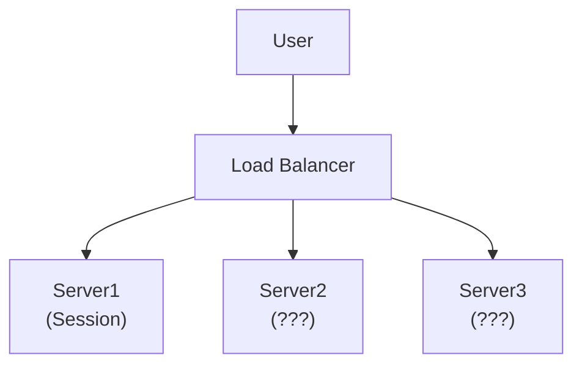
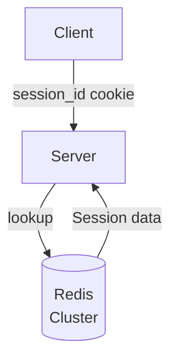
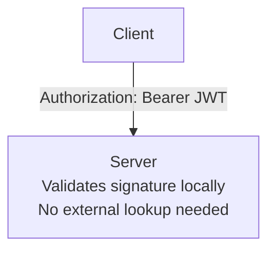
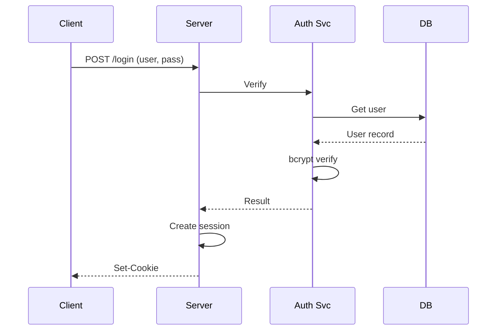
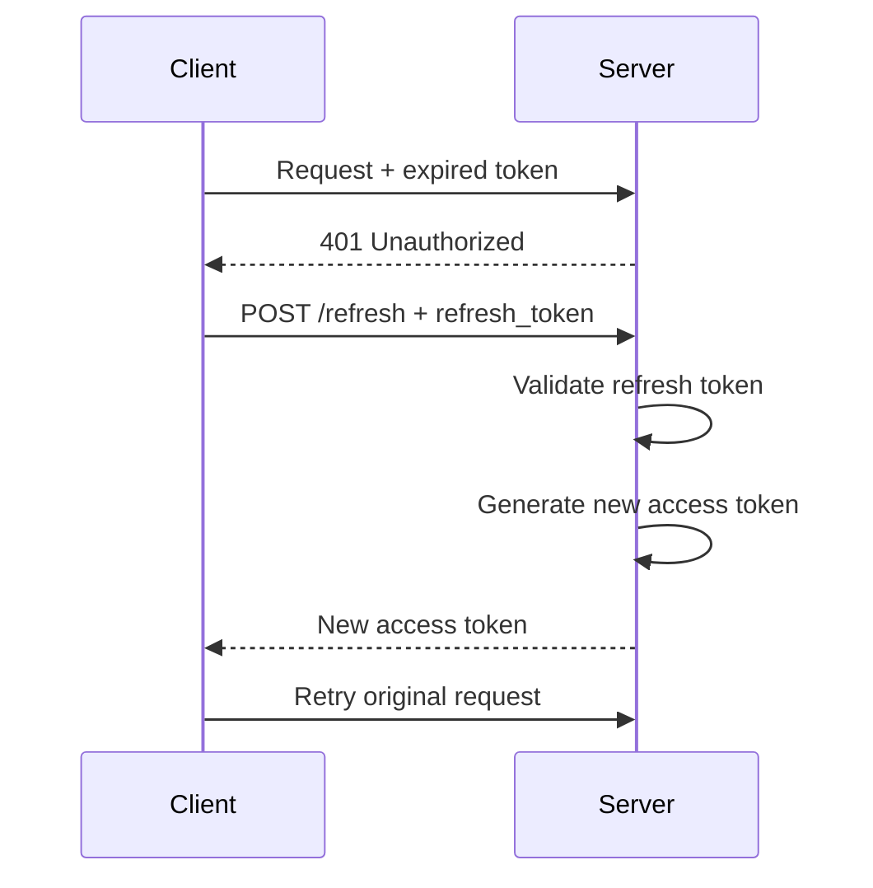

# Authentication Fundamentals

## TL;DR

Authentication verifies identity ("who are you?"). The challenge in distributed systems is doing this securely without sharing credentials everywhere, while handling session management at scale.

---

## The Problem Authentication Solves

In a monolithic application, authentication is simple:

```
1. User sends username + password
2. Server checks against database
3. Server creates session, stores in memory
4. Server returns session cookie
5. Subsequent requests include cookie
```

In distributed systems, this breaks down:



```
Problem: Session created on Server1, but next
request goes to Server2 which has no session
```

---

## Session Management Strategies

### Strategy 1: Sticky Sessions

Load balancer routes all requests from same user to same server.

```
Implementation: Hash(user_id) → server

Pros:
- Simple implementation
- No shared state needed

Cons:
- Uneven load distribution
- Server failure loses all sessions
- Horizontal scaling is difficult
```

### Strategy 2: Centralized Session Store

All servers share a session store (Redis, Memcached).



```python
# Session lookup on every request
def authenticate_request(request):
    session_id = request.cookies.get('session_id')
    if not session_id:
        return None
    
    # Hit Redis for every authenticated request
    session_data = redis.get(f"session:{session_id}")
    if not session_data:
        return None
    
    return json.loads(session_data)
```

**Trade-offs:**
- Pro: Any server can handle any request
- Con: Redis becomes single point of failure
- Con: Added latency for every request
- Con: Redis must scale with request rate, not user count

### Strategy 3: Stateless Tokens (JWT)

Encode session data in the token itself. Server validates without storage lookup.



**Trade-offs:**
- Pro: No session storage needed
- Pro: Scales infinitely
- Con: Cannot revoke tokens before expiry
- Con: Token size increases with claims

---

## Password Storage

### Never Store Plain Passwords

```python
# WRONG - attacker dumps database, gets all passwords
password_hash = hashlib.sha256(password).hexdigest()

# WRONG - rainbow table attack
password_hash = hashlib.sha256(password + "static_salt").hexdigest()

# CORRECT - unique salt per user, slow hash function
import bcrypt
password_hash = bcrypt.hashpw(password.encode(), bcrypt.gensalt(rounds=12))
```

### Why Bcrypt/Argon2?

1. **Salted**: Each hash includes random salt
2. **Slow**: Configurable work factor
3. **CPU-intensive**: Resists GPU attacks (Argon2 is also memory-hard)

```python
# Verification
def verify_password(stored_hash, provided_password):
    return bcrypt.checkpw(
        provided_password.encode(),
        stored_hash.encode()
    )
```

### Work Factor Selection

| Work Factor | Time per Hash | Attempts/sec (attacker) |
|-------------|---------------|-------------------------|
| 10          | ~100ms        | 10                      |
| 12          | ~400ms        | 2.5                     |
| 14          | ~1.6s         | 0.6                     |

Choose factor that takes 250-500ms on your hardware.

---

## Multi-Factor Authentication (MFA)

### Something You Know + Something You Have

```
Factor 1: Password (knowledge)
Factor 2: One of:
  - TOTP code from authenticator app (possession)
  - SMS code (possession) - weaker, SIM swap attacks
  - Hardware key like YubiKey (possession)
  - Biometric (inherence)
```

### TOTP Implementation

```python
import pyotp
import time

# Setup: Generate secret, show QR code to user
secret = pyotp.random_base32()  # Store encrypted in DB
totp = pyotp.TOTP(secret)
provisioning_uri = totp.provisioning_uri(
    name="user@example.com",
    issuer_name="MyApp"
)
# Convert provisioning_uri to QR code for user to scan

# Verification
def verify_totp(user_secret, provided_code):
    totp = pyotp.TOTP(user_secret)
    # valid_window allows for clock drift
    return totp.verify(provided_code, valid_window=1)
```

### TOTP Internals

```
TOTP = HMAC-SHA1(secret, floor(time / 30))

Time:    1704067200  1704067230  1704067260
Code:    847293      159462      738291
         ◄─── 30s ──►◄─── 30s ──►
```

---

## Brute Force Protection

### Rate Limiting

```python
from redis import Redis
import time

def check_login_rate_limit(username, ip_address):
    redis = Redis()
    
    # Rate limit by username (prevents credential stuffing)
    user_key = f"login_attempts:user:{username}"
    user_attempts = redis.incr(user_key)
    redis.expire(user_key, 900)  # 15 minute window
    
    # Rate limit by IP (prevents distributed attacks)
    ip_key = f"login_attempts:ip:{ip_address}"
    ip_attempts = redis.incr(ip_key)
    redis.expire(ip_key, 3600)  # 1 hour window
    
    if user_attempts > 5:
        return False, "Too many attempts for this account"
    if ip_attempts > 20:
        return False, "Too many attempts from this IP"
    
    return True, None
```

### Progressive Delays

```python
def get_delay_after_failures(failure_count):
    """Exponential backoff with jitter"""
    if failure_count < 3:
        return 0
    
    base_delay = min(2 ** (failure_count - 2), 300)  # Max 5 minutes
    jitter = random.uniform(0, base_delay * 0.1)
    return base_delay + jitter
```

### Account Lockout

```
Attempt 1-3: Normal
Attempt 4-5: CAPTCHA required
Attempt 6-10: 15-minute soft lock
Attempt 11+: Account locked, email notification
```

---

## Credential Stuffing Defense

Attackers use breached password databases to try credentials on other sites.

### Detection Signals

```python
def calculate_risk_score(request, user):
    score = 0
    
    # New device
    if not is_known_device(user, request.device_fingerprint):
        score += 30
    
    # Unusual location
    if not is_usual_location(user, request.ip_address):
        score += 25
    
    # Unusual time
    if not is_usual_time(user, datetime.now()):
        score += 15
    
    # Failed attempts recently
    score += min(get_recent_failures(user) * 10, 30)
    
    return score

def handle_login(request, user, password_valid):
    risk_score = calculate_risk_score(request, user)
    
    if password_valid:
        if risk_score > 50:
            # Require step-up authentication
            return require_mfa(user)
        return success()
    else:
        if risk_score > 70:
            # Likely automated attack
            return temporary_block()
        return invalid_credentials()
```

### Have I Been Pwned Integration

```python
import hashlib
import requests

def is_password_breached(password):
    """Check against Have I Been Pwned API (k-anonymity)"""
    sha1 = hashlib.sha1(password.encode()).hexdigest().upper()
    prefix, suffix = sha1[:5], sha1[5:]
    
    # Send only prefix to API
    response = requests.get(
        f"https://api.pwnedpasswords.com/range/{prefix}"
    )
    
    # Check if our suffix is in results
    for line in response.text.splitlines():
        hash_suffix, count = line.split(':')
        if hash_suffix == suffix:
            return True, int(count)
    
    return False, 0
```

---

## Session Security

### Secure Cookie Attributes

```python
response.set_cookie(
    'session_id',
    value=session_id,
    httponly=True,     # Not accessible via JavaScript
    secure=True,       # Only sent over HTTPS
    samesite='Lax',    # CSRF protection
    max_age=86400,     # 24 hours
    domain='.example.com',
    path='/'
)
```

### Session Fixation Prevention

```python
def login(user, password):
    if not verify_password(user, password):
        return error()
    
    # CRITICAL: Generate new session ID after authentication
    # Prevents attacker from setting session ID before login
    old_session_id = request.cookies.get('session_id')
    new_session_id = generate_secure_session_id()
    
    if old_session_id:
        redis.delete(f"session:{old_session_id}")
    
    redis.setex(
        f"session:{new_session_id}",
        86400,
        json.dumps({'user_id': user.id})
    )
    
    return response.set_cookie('session_id', new_session_id)
```

### Session Hijacking Prevention

```python
def validate_session(request):
    session = get_session(request)
    if not session:
        return None
    
    # Validate fingerprint hasn't changed
    current_fingerprint = generate_fingerprint(request)
    if session['fingerprint'] != current_fingerprint:
        # Possible session hijacking
        invalidate_session(session['id'])
        log_security_event('session_fingerprint_mismatch', session)
        return None
    
    return session

def generate_fingerprint(request):
    """Create fingerprint from stable request attributes"""
    components = [
        request.headers.get('User-Agent', ''),
        request.headers.get('Accept-Language', ''),
        # Don't include IP - changes with mobile/VPN
    ]
    return hashlib.sha256('|'.join(components).encode()).hexdigest()[:16]
```

---

## Authentication Flows

### Standard Login Flow



### Token Refresh Flow

```
Access Token:  Short-lived (15 min)
Refresh Token: Long-lived (7 days), stored securely
```



---

## Single Sign-On (SSO) Overview

### Why SSO?

```
Without SSO:
User has credentials for: Email, CRM, HR System, Wiki, etc.
- Password fatigue → weak passwords
- Admin nightmare → provision/deprovision everywhere

With SSO:
User has one identity, accesses all systems
- One strong password + MFA
- Central access control
- Single audit log
```

### SSO Protocols

| Protocol | Use Case | Token Format |
|----------|----------|--------------|
| SAML 2.0 | Enterprise, legacy | XML |
| OAuth 2.0 | API authorization | JSON (JWT) |
| OpenID Connect | Modern authentication | JWT |
| LDAP/Kerberos | Internal/on-prem | Tickets |

---

## Trade-offs Summary

| Approach | Scalability | Revocation | Complexity |
|----------|-------------|------------|------------|
| Server Sessions | Low (sticky) | Instant | Low |
| Centralized Store | Medium | Instant | Medium |
| Stateless Tokens | High | Difficult | Medium |
| Hybrid (short JWT + refresh) | High | Near-instant | High |

---

## Security Checklist

```
□ Passwords hashed with bcrypt/Argon2 (cost factor ≥ 12)
□ HTTPS everywhere (HSTS enabled)
□ Secure cookie attributes (HttpOnly, Secure, SameSite)
□ Session regeneration on authentication state change
□ Rate limiting on authentication endpoints
□ Account lockout after failed attempts
□ MFA available (ideally required)
□ Breached password detection
□ Session timeout and absolute expiry
□ Audit logging of authentication events
```

---

## Session Management at Scale

The strategies above cover the basics, but production systems face deeper challenges when managing millions of concurrent sessions across distributed infrastructure.

### Stateful Sessions: Server-Side Session Store

In a stateful model, the server holds all session data. The client only carries an opaque session ID (typically in a cookie). This gives the server full control over session lifecycle.

**Redis as session store — key design:**

```
Key:    session:{session_id}
Value:  {"user_id": "u_abc", "roles": ["admin"], "ip": "10.0.1.5", "created_at": 1710000000}
TTL:    1800  (30 minutes — sliding expiration)
```

On every authenticated request, the server performs `GET session:{session_id}` and resets the TTL if the session is still valid. This sliding window means idle sessions expire, but active sessions stay alive.

**Sticky sessions via load balancer** work by hashing a cookie or IP to pin a user to a specific backend. AWS ALB uses `AWSALB` cookie; NGINX uses `ip_hash` or `hash $cookie_session_id`. The risk: if that backend goes down, the session is lost. Sticky sessions are a crutch — prefer a shared store.

**Distributed session store with Redis Cluster:**

- Partition sessions across Redis Cluster nodes using hash slots
- Key format `session:{session_id}` naturally distributes across slots
- Set TTL equal to your session timeout (e.g., 1800s for 30 min)
- Use `SET ... EX` (atomic set-with-expiry) to avoid orphaned keys
- Monitor memory usage: 1 million sessions at ~1 KB each ≈ 1 GB

### Stateless Sessions: JWT-Based

In a stateless model, the token itself carries all claims. No server-side storage, no Redis lookup. The server validates the signature and checks `exp` — that's it.

**The revocation problem:** you cannot invalidate a JWT before it expires. If a user logs out or an admin revokes access, the token remains valid until `exp`. Mitigations include short expiry windows and token deny-lists (which reintroduce state).

### Hybrid: Short-Lived JWT + Refresh Token in DB

This is the production-grade pattern most teams converge on:

```
Access Token (JWT):   15-minute expiry, stateless validation
Refresh Token:        7-day expiry, stored in database, revocable
```

- Access token is verified locally (no DB hit on every request)
- Refresh token is checked against DB only during refresh (infrequent)
- Revocation: delete the refresh token row — access token dies within 15 min
- Refresh token rotation: issue a new refresh token on each use, invalidate the old one (detects token theft if the old one is reused)

### Session Fixation Attacks

**Attack flow:** the attacker obtains a valid session ID (e.g., from a URL parameter or by setting a cookie on a subdomain), tricks the victim into authenticating with that session ID, then hijacks the now-authenticated session.

**Prevention:** always regenerate the session ID immediately after successful authentication. Destroy the old session. This is a one-line fix that prevents an entire class of attacks. Most frameworks do this automatically if configured correctly — verify yours does.

**Additional defenses:**
- Reject session IDs that were not issued by the server
- Bind sessions to a client fingerprint (User-Agent + Accept-Language)
- Set `SameSite=Lax` or `Strict` on session cookies to limit cross-origin attacks

---

## Password Storage

> This section expands on the hashing fundamentals above with operational guidance for production systems.

### Hash Algorithm Selection

| Algorithm | Type | Memory-Hard | Recommended |
|-----------|------|-------------|-------------|
| MD5 | Fast hash | No | **Never** — ~10 billion hashes/sec on GPU |
| SHA-256 | Fast hash | No | **Never** — designed for speed, not passwords |
| bcrypt | Adaptive | No | **Yes** — cost factor 12+ (≈400ms) |
| scrypt | Adaptive | Yes | **Yes** — tunable CPU + memory cost |
| Argon2id | Adaptive | Yes | **Preferred** — winner of Password Hashing Competition |

**Why not MD5/SHA-256?** They are engineered to be fast. A modern GPU can compute billions of SHA-256 hashes per second. Password hashing must be deliberately slow to make brute force impractical.

### Salt and Pepper

**Salt** — a unique random value generated per user, stored alongside the hash in the database. Prevents rainbow table attacks and ensures identical passwords produce different hashes.

```
stored = "$argon2id$v=19$m=65536,t=3,p=4$<salt>$<hash>"
         ──────── algorithm params ──────  salt   hash
```

**Pepper** — an application-level secret (e.g., from environment variable or HSM), applied before hashing: `hash(pepper + password, salt)`. The pepper is NOT stored in the database. If the DB is compromised but the app server is not, the attacker cannot crack hashes without the pepper.

### Hash Algorithm Migration

When upgrading from bcrypt to Argon2id (or increasing cost factor), you cannot re-hash existing passwords because you don't have them. Strategy:

1. On next successful login, re-hash the plaintext password with the new algorithm
2. Store the new hash, mark the algorithm version in the user record
3. For users who never log in again, the old hash remains (still secure, just not optimal)

### Timing Attacks and Constant-Time Comparison

Naive string comparison (`==`) leaks information through timing differences — matching prefixes take longer. An attacker can deduce the hash byte by byte.

**Always use constant-time comparison** for hash verification:
- Python: `hmac.compare_digest(a, b)`
- Node.js: `crypto.timingSafeEqual(a, b)`
- Go: `subtle.ConstantTimeCompare(a, b)`

Established libraries (bcrypt, Argon2) handle this internally, but if you ever compare tokens or hashes manually, use the constant-time variant.

---

## Multi-Factor Authentication (MFA)

> This section expands on the MFA fundamentals above with protocol details, factor comparison, and recovery considerations.

### The Three Factor Categories

| Factor | Type | Examples |
|--------|------|----------|
| Something you **know** | Knowledge | Password, PIN, security questions |
| Something you **have** | Possession | Phone (TOTP), hardware key (FIDO2), smart card |
| Something you **are** | Inherence | Fingerprint, face recognition, iris scan |

True MFA requires factors from at least **two different categories**. Two passwords is not MFA. A password + TOTP code is.

### TOTP Deep Dive (RFC 6238)

TOTP generates a 6-digit code from a shared secret and the current time:

```
code = HMAC-SHA1(shared_secret, floor(unix_time / 30)) mod 10^6
```

- **Shared secret**: generated at enrollment, stored encrypted in DB, shown to user as QR code
- **Time step**: 30 seconds (configurable, but 30s is the standard)
- **Clock drift tolerance**: accept codes from `T-1`, `T`, `T+1` (±30s window)
- **Replay prevention**: track the last used time step per user; reject codes from the same or earlier step

**Weakness:** TOTP is phishable. An attacker running a real-time proxy can capture and replay the code before it expires.

### FIDO2 / WebAuthn

FIDO2 (WebAuthn + CTAP2) uses **public key cryptography** — no shared secret between client and server.

```
Registration:  Browser generates key pair → public key sent to server
Authentication: Server sends challenge → device signs with private key → server verifies
```

- **Phishing-resistant**: the signature is bound to the origin (domain), so a phishing site on a different domain cannot replay it
- **No shared secret**: even if the server is breached, there is nothing to steal
- **Device-bound**: private key never leaves the authenticator (YubiKey, Touch ID, Windows Hello)

### SMS OTP: The Weakest Factor

SMS-based OTP is vulnerable to:
- **SIM swap attacks**: attacker social-engineers the carrier to port the victim's number
- **SS7 interception**: protocol-level interception of SMS messages
- **Malware**: SMS-stealing malware on the device

Use SMS OTP only as a fallback when no stronger factor is available. NIST SP 800-63B deprecated SMS as a preferred authenticator.

### Backup Codes and Recovery

Backup codes are pre-generated single-use codes (typically 8-10 codes, 8+ characters each) shown to the user at MFA enrollment.

**Storage:** hash each backup code (bcrypt) before storing. When the user submits one, hash and compare. Mark used codes as consumed.

**Recovery flow is the weakest link.** If an attacker can bypass MFA through a recovery flow (e.g., calling support, answering security questions), MFA provides no security. Harden recovery:
- Require government ID verification for MFA reset
- Enforce a mandatory waiting period (24-48 hours) with email notification
- Log and alert on all MFA reset requests
- Never allow support staff to disable MFA over the phone without identity verification

---

## Authentication Anti-Patterns

These are the most common mistakes that undermine authentication security in production systems.

### Rolling Your Own Crypto

Do not implement password hashing, token signing, or session management from scratch. Use established, audited libraries:
- **Node.js**: passport.js, bcrypt, jose
- **Python**: Django's auth module, Flask-Login, passlib
- **Java**: Spring Security, JJWT
- **Go**: golang.org/x/crypto/bcrypt, gorilla/sessions

Custom implementations almost always have subtle bugs: timing leaks, weak randomness, incorrect padding.

### Storing Sessions in Local Memory

```python
# Anti-pattern: in-process session store
sessions = {}  # Lost on restart, not shared across instances
```

This fails in any multi-instance deployment. Sessions vanish on deploy, and requests routed to a different instance get 401s. Use Redis, Memcached, or a database-backed session store.

### Long-Lived Access Tokens

An access token valid for 30 days means a stolen token gives the attacker 30 days of access. Keep access tokens short-lived (15 minutes or less). Use refresh tokens for session continuity.

### No Rate Limiting on Login Endpoints

Without rate limiting, an attacker can attempt millions of credential combinations. This enables:
- **Credential stuffing**: trying breached username/password pairs at scale
- **Brute force**: exhaustively trying passwords for a known username

Rate limit by both username and IP address. See the [Brute Force Protection](#brute-force-protection) section above.

### Trusting Client-Side Validation

Client-side checks (JavaScript form validation, disabled buttons, hidden fields) are trivially bypassed. Every authentication decision must be validated on the server:
- Password complexity → enforce server-side
- MFA code verification → always server-side
- Role/permission checks → never rely on client state
- Session validity → validate on every request, server-side

### Leaking Information in Error Messages

```
# Anti-pattern: reveals whether the username exists
"No account found with email user@example.com"
"Incorrect password for user@example.com"

# Correct: generic message regardless of failure reason
"Invalid email or password"
```

Specific error messages let attackers enumerate valid usernames. Always return the same error for invalid username and invalid password.

---

## References

- [OWASP Authentication Cheat Sheet](https://cheatsheetseries.owasp.org/cheatsheets/Authentication_Cheat_Sheet.html)
- [NIST Digital Identity Guidelines (SP 800-63)](https://pages.nist.gov/800-63-3/)
- [Have I Been Pwned API](https://haveibeenpwned.com/API/v3)
- [RFC 6238: TOTP](https://datatracker.ietf.org/doc/html/rfc6238)
