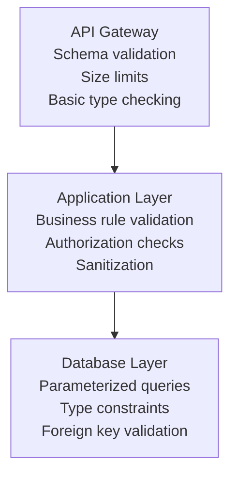
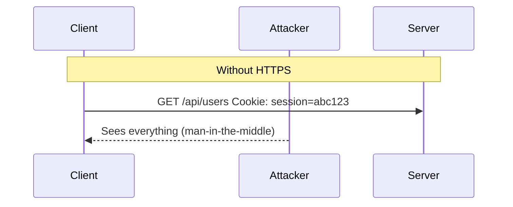

# API Security

## TL;DR

API security requires defense in depth: authentication identifies callers, authorization controls access, input validation prevents injection, rate limiting stops abuse, and encryption protects data in transit. No single measure is sufficient.

---

## API Authentication Methods

### API Keys

Simple bearer tokens for identifying applications.

```
Request:
GET /api/data
X-API-Key: sk_live_abc123xyz

Or in query parameter (less secure):
GET /api/data?api_key=sk_live_abc123xyz
```

**Implementation:**

```python
import secrets
import hashlib

def generate_api_key():
    """Generate a new API key"""
    # Prefix helps identify key type (like Stripe's sk_live_)
    prefix = "sk_live_"
    random_part = secrets.token_urlsafe(32)
    return prefix + random_part

def hash_api_key(api_key):
    """Hash for storage - never store plain API keys"""
    return hashlib.sha256(api_key.encode()).hexdigest()

# Storage
api_key = generate_api_key()  # Give to customer once
key_hash = hash_api_key(api_key)  # Store in database

# Validation
def validate_api_key(provided_key):
    provided_hash = hash_api_key(provided_key)
    stored_hash = db.get_key_hash(provided_key[:12])  # Lookup by prefix
    return secrets.compare_digest(provided_hash, stored_hash)
```

**Best Practices:**

```
□ Hash keys before storage (like passwords)
□ Use prefixes for key identification (pk_, sk_)
□ Support key rotation (multiple active keys)
□ Log key usage for audit
□ Set expiration dates
□ Scope keys to specific permissions
```

### API Key vs. OAuth Token

| Aspect | API Key | OAuth Token |
|--------|---------|-------------|
| Identifies | Application | User + Application |
| Issued by | You | Authorization server |
| Revocation | Manual | Standard flow |
| Expiration | Typically long/none | Short-lived |
| Use case | Server-to-server | User-delegated access |

---

## Request Signing (HMAC)

For high-security APIs, sign requests to prevent tampering.

```
Signature = HMAC-SHA256(secret_key, string_to_sign)

string_to_sign = HTTP_METHOD + "\n" +
                 PATH + "\n" +
                 QUERY_STRING + "\n" +
                 HEADERS + "\n" +
                 TIMESTAMP + "\n" +
                 BODY_HASH
```

### Implementation

```python
import hmac
import hashlib
import time

def sign_request(method, path, body, api_secret):
    timestamp = str(int(time.time()))
    body_hash = hashlib.sha256(body.encode() if body else b'').hexdigest()
    
    string_to_sign = f"{method}\n{path}\n{timestamp}\n{body_hash}"
    
    signature = hmac.new(
        api_secret.encode(),
        string_to_sign.encode(),
        hashlib.sha256
    ).hexdigest()
    
    return {
        'X-Timestamp': timestamp,
        'X-Signature': signature
    }

def verify_signature(request, api_secret):
    timestamp = request.headers.get('X-Timestamp')
    provided_signature = request.headers.get('X-Signature')
    
    # Check timestamp freshness (prevent replay attacks)
    if abs(int(timestamp) - time.time()) > 300:  # 5 minute window
        return False
    
    body_hash = hashlib.sha256(request.body or b'').hexdigest()
    string_to_sign = f"{request.method}\n{request.path}\n{timestamp}\n{body_hash}"
    
    expected_signature = hmac.new(
        api_secret.encode(),
        string_to_sign.encode(),
        hashlib.sha256
    ).hexdigest()
    
    return hmac.compare_digest(provided_signature, expected_signature)
```

### AWS Signature Version 4

AWS uses a sophisticated signing process:

```
CanonicalRequest =
    HTTPMethod + '\n' +
    CanonicalURI + '\n' +
    CanonicalQueryString + '\n' +
    CanonicalHeaders + '\n' +
    SignedHeaders + '\n' +
    HexEncode(Hash(Payload))

StringToSign =
    Algorithm + '\n' +
    RequestDateTime + '\n' +
    CredentialScope + '\n' +
    HexEncode(Hash(CanonicalRequest))

Signature = HMAC-SHA256(SigningKey, StringToSign)
```

---

## Input Validation

### Validation Layers



### Schema Validation

```python
from pydantic import BaseModel, Field, validator
from typing import Optional
import re

class CreateUserRequest(BaseModel):
    email: str = Field(..., max_length=255)
    username: str = Field(..., min_length=3, max_length=50)
    age: Optional[int] = Field(None, ge=0, le=150)
    
    @validator('email')
    def validate_email(cls, v):
        if not re.match(r'^[\w\.-]+@[\w\.-]+\.\w+$', v):
            raise ValueError('Invalid email format')
        return v.lower()
    
    @validator('username')
    def validate_username(cls, v):
        if not re.match(r'^[a-zA-Z0-9_]+$', v):
            raise ValueError('Username can only contain alphanumeric and underscore')
        return v

# Usage
@app.post('/users')
def create_user(request: CreateUserRequest):
    # request is already validated
    pass
```

### SQL Injection Prevention

```python
# VULNERABLE - string concatenation
def get_user(username):
    query = f"SELECT * FROM users WHERE username = '{username}'"
    return db.execute(query)
    
# Attack: username = "'; DROP TABLE users; --"

# SAFE - parameterized query
def get_user(username):
    query = "SELECT * FROM users WHERE username = %s"
    return db.execute(query, (username,))
```

### NoSQL Injection Prevention

```python
# VULNERABLE - MongoDB
def find_user(query):
    return db.users.find(query)  # query comes from user input
    
# Attack: query = {"$gt": ""}  returns all users

# SAFE - explicit field validation
def find_user(username):
    if not isinstance(username, str):
        raise ValueError("Invalid username type")
    return db.users.find_one({"username": username})
```

### Command Injection Prevention

```python
import subprocess
import shlex

# VULNERABLE
def ping(host):
    return subprocess.call(f"ping -c 1 {host}", shell=True)
    
# Attack: host = "google.com; rm -rf /"

# SAFE - use list arguments, avoid shell=True
def ping(host):
    # Validate host format first
    if not re.match(r'^[a-zA-Z0-9.-]+$', host):
        raise ValueError("Invalid host format")
    return subprocess.call(["ping", "-c", "1", host])
```

---

## Authorization Patterns

### Role-Based Access Control (RBAC)

```python
ROLES = {
    'admin': ['read', 'write', 'delete', 'admin'],
    'editor': ['read', 'write'],
    'viewer': ['read']
}

def require_permission(permission):
    def decorator(f):
        @wraps(f)
        def decorated(*args, **kwargs):
            user_role = get_current_user().role
            if permission not in ROLES.get(user_role, []):
                return jsonify({'error': 'Forbidden'}), 403
            return f(*args, **kwargs)
        return decorated
    return decorator

@app.delete('/users/<id>')
@require_permission('delete')
def delete_user(id):
    pass
```

### Attribute-Based Access Control (ABAC)

More flexible than RBAC, considers context.

```python
def can_access_document(user, document, action):
    """
    Policy: User can edit if:
    - User is document owner, OR
    - User is in same department AND document is not confidential, OR
    - User has admin role
    """
    if user.role == 'admin':
        return True
    
    if document.owner_id == user.id:
        return True
    
    if action == 'read':
        if user.department == document.department and not document.confidential:
            return True
    
    return False

@app.put('/documents/<id>')
def update_document(id):
    document = get_document(id)
    user = get_current_user()
    
    if not can_access_document(user, document, 'write'):
        return jsonify({'error': 'Forbidden'}), 403
    
    # proceed with update
```

### Resource-Based Authorization

```python
# Check ownership or explicit permissions
def authorize_resource(user, resource_type, resource_id, action):
    # Check if user owns resource
    resource = get_resource(resource_type, resource_id)
    if resource.owner_id == user.id:
        return True
    
    # Check explicit permissions
    permission = db.query(
        "SELECT * FROM permissions WHERE user_id = %s AND resource_type = %s AND resource_id = %s AND action = %s",
        (user.id, resource_type, resource_id, action)
    )
    return permission is not None
```

---

## HTTPS and TLS

### Why HTTPS is Non-Negotiable



### TLS Configuration Best Practices

```nginx
# nginx configuration
server {
    listen 443 ssl http2;
    
    # Use modern TLS versions only
    ssl_protocols TLSv1.2 TLSv1.3;
    
    # Strong cipher suites
    ssl_ciphers ECDHE-ECDSA-AES128-GCM-SHA256:ECDHE-RSA-AES128-GCM-SHA256:ECDHE-ECDSA-AES256-GCM-SHA384:ECDHE-RSA-AES256-GCM-SHA384;
    ssl_prefer_server_ciphers off;
    
    # Enable HSTS
    add_header Strict-Transport-Security "max-age=63072000" always;
    
    # Certificate
    ssl_certificate /path/to/fullchain.pem;
    ssl_certificate_key /path/to/privkey.pem;
}
```

### Certificate Pinning (Mobile Apps)

```swift
// iOS - Pin to specific certificate
let pinnedCertificates: [SecCertificate] = loadPinnedCerts()

func urlSession(_ session: URLSession, 
                didReceive challenge: URLAuthenticationChallenge,
                completionHandler: @escaping (URLSession.AuthChallengeDisposition, URLCredential?) -> Void) {
    
    guard let serverTrust = challenge.protectionSpace.serverTrust,
          let certificate = SecTrustGetCertificateAtIndex(serverTrust, 0) else {
        completionHandler(.cancelAuthenticationChallenge, nil)
        return
    }
    
    let serverCertData = SecCertificateCopyData(certificate) as Data
    
    for pinnedCert in pinnedCertificates {
        let pinnedCertData = SecCertificateCopyData(pinnedCert) as Data
        if serverCertData == pinnedCertData {
            completionHandler(.useCredential, URLCredential(trust: serverTrust))
            return
        }
    }
    
    completionHandler(.cancelAuthenticationChallenge, nil)
}
```

---

## Rate Limiting for Security

### DDoS Mitigation

```python
from redis import Redis
import time

class RateLimiter:
    def __init__(self, redis_client):
        self.redis = redis_client
    
    def is_allowed(self, key, limit, window_seconds):
        """Sliding window rate limiter"""
        now = time.time()
        window_start = now - window_seconds
        
        pipe = self.redis.pipeline()
        
        # Remove old entries
        pipe.zremrangebyscore(key, 0, window_start)
        
        # Count current entries
        pipe.zcard(key)
        
        # Add current request
        pipe.zadd(key, {str(now): now})
        
        # Set expiry
        pipe.expire(key, window_seconds)
        
        results = pipe.execute()
        request_count = results[1]
        
        return request_count < limit

# Different limits for different scenarios
rate_limiter = RateLimiter(redis)

def check_rate_limits(request):
    ip = request.remote_addr
    user_id = get_user_id(request)
    
    # Global IP limit (DDoS protection)
    if not rate_limiter.is_allowed(f"ip:{ip}", 1000, 60):
        return False, "IP rate limit exceeded"
    
    # Per-user limit
    if user_id and not rate_limiter.is_allowed(f"user:{user_id}", 100, 60):
        return False, "User rate limit exceeded"
    
    # Sensitive endpoint limit (login)
    if request.path == '/login':
        if not rate_limiter.is_allowed(f"login:{ip}", 5, 300):
            return False, "Too many login attempts"
    
    return True, None
```

### Response Headers

```python
@app.after_request
def add_rate_limit_headers(response):
    response.headers['X-RateLimit-Limit'] = '100'
    response.headers['X-RateLimit-Remaining'] = str(get_remaining())
    response.headers['X-RateLimit-Reset'] = str(get_reset_time())
    return response

# On rate limit exceeded
@app.errorhandler(429)
def rate_limit_exceeded(e):
    return jsonify({
        'error': 'Rate limit exceeded',
        'retry_after': get_retry_after()
    }), 429, {'Retry-After': str(get_retry_after())}
```

---

## Security Headers

```python
@app.after_request
def add_security_headers(response):
    # Prevent clickjacking
    response.headers['X-Frame-Options'] = 'DENY'
    
    # XSS protection
    response.headers['X-Content-Type-Options'] = 'nosniff'
    response.headers['X-XSS-Protection'] = '1; mode=block'
    
    # Content Security Policy
    response.headers['Content-Security-Policy'] = "default-src 'self'"
    
    # HTTPS enforcement
    response.headers['Strict-Transport-Security'] = 'max-age=31536000; includeSubDomains'
    
    # Referrer policy
    response.headers['Referrer-Policy'] = 'strict-origin-when-cross-origin'
    
    return response
```

---

## CORS (Cross-Origin Resource Sharing)

### Misconfiguration Vulnerabilities

```python
# DANGEROUS - allows any origin
@app.after_request
def add_cors(response):
    response.headers['Access-Control-Allow-Origin'] = '*'
    response.headers['Access-Control-Allow-Credentials'] = 'true'  # VERY BAD with *
    return response

# DANGEROUS - reflecting origin without validation
@app.after_request
def add_cors(response):
    origin = request.headers.get('Origin')
    response.headers['Access-Control-Allow-Origin'] = origin  # Reflects any origin!
    return response
```

### Safe CORS Configuration

```python
ALLOWED_ORIGINS = [
    'https://myapp.com',
    'https://staging.myapp.com'
]

@app.after_request
def add_cors(response):
    origin = request.headers.get('Origin')
    
    if origin in ALLOWED_ORIGINS:
        response.headers['Access-Control-Allow-Origin'] = origin
        response.headers['Access-Control-Allow-Credentials'] = 'true'
        response.headers['Access-Control-Allow-Methods'] = 'GET, POST, PUT, DELETE, OPTIONS'
        response.headers['Access-Control-Allow-Headers'] = 'Content-Type, Authorization'
        response.headers['Access-Control-Max-Age'] = '86400'
    
    return response
```

---

## Logging and Audit

### Security Event Logging

```python
import logging
import json
from datetime import datetime

security_logger = logging.getLogger('security')

def log_security_event(event_type, details, request=None):
    event = {
        'timestamp': datetime.utcnow().isoformat(),
        'event_type': event_type,
        'details': details,
    }
    
    if request:
        event.update({
            'ip': request.remote_addr,
            'user_agent': request.headers.get('User-Agent'),
            'path': request.path,
            'method': request.method,
            'user_id': getattr(request, 'user_id', None)
        })
    
    security_logger.info(json.dumps(event))

# Usage
log_security_event('LOGIN_FAILED', {
    'username': username,
    'reason': 'invalid_password'
}, request)

log_security_event('PERMISSION_DENIED', {
    'resource': '/admin/users',
    'required_role': 'admin',
    'user_role': 'viewer'
}, request)

log_security_event('RATE_LIMIT_EXCEEDED', {
    'limit': 100,
    'window': 60
}, request)
```

### What to Log

```
Authentication:
□ Login attempts (success/failure)
□ Password changes
□ MFA enrollment/usage
□ API key creation/revocation
□ Session creation/termination

Authorization:
□ Permission denied events
□ Role changes
□ Access to sensitive resources

Security Events:
□ Rate limit triggers
□ Invalid input attempts
□ Suspicious patterns
□ Token validation failures

Audit Trail:
□ Data modifications (who, what, when)
□ Configuration changes
□ Admin actions
```

---

## API Versioning Security

### Don't Leave Old Versions Vulnerable

```
Common mistake:
- v1 has security vulnerability
- v2 fixes it
- v1 still active and vulnerable

Best practice:
- Apply security fixes to all supported versions
- Deprecate and sunset old versions with clear timeline
- Monitor for usage of deprecated versions
```

### Version Sunset Process

```
Month 1: Announce deprecation
         - Add Deprecation header
         - Documentation update
         - Email customers

Month 3: Warning responses
         - Log all v1 usage
         - Return Warning header

Month 6: Disable for new clients
         - Existing clients still work
         - New signups get v2 only

Month 9: Final shutdown
         - Return 410 Gone
         - Log attempts for follow-up
```

---

## Security Checklist

```
Authentication:
□ Use HTTPS for all endpoints
□ Implement proper session management
□ Hash API keys before storage
□ Use OAuth 2.0 for user-delegated access
□ Implement MFA for sensitive operations

Authorization:
□ Validate permissions on every request
□ Use least-privilege principle
□ Implement resource-level authorization
□ Audit authorization decisions

Input Validation:
□ Validate all input server-side
□ Use parameterized queries
□ Implement request size limits
□ Sanitize output to prevent XSS

Rate Limiting:
□ Implement per-IP and per-user limits
□ Stricter limits on sensitive endpoints
□ Return appropriate rate limit headers
□ Log rate limit events

Headers:
□ Enable HSTS
□ Set proper CORS policy
□ Add security headers (CSP, X-Frame-Options)
□ Configure proper cache headers

Logging:
□ Log authentication events
□ Log authorization failures
□ Implement audit trail
□ Monitor for anomalies
```

---

## References

- [OWASP API Security Top 10](https://owasp.org/www-project-api-security/)
- [OWASP REST Security Cheat Sheet](https://cheatsheetseries.owasp.org/cheatsheets/REST_Security_Cheat_Sheet.html)
- [RFC 6749: OAuth 2.0](https://datatracker.ietf.org/doc/html/rfc6749)
- [AWS Signature Version 4](https://docs.aws.amazon.com/general/latest/gr/signature-version-4.html)
- [Google Cloud API Security Best Practices](https://cloud.google.com/apis/design/security)
