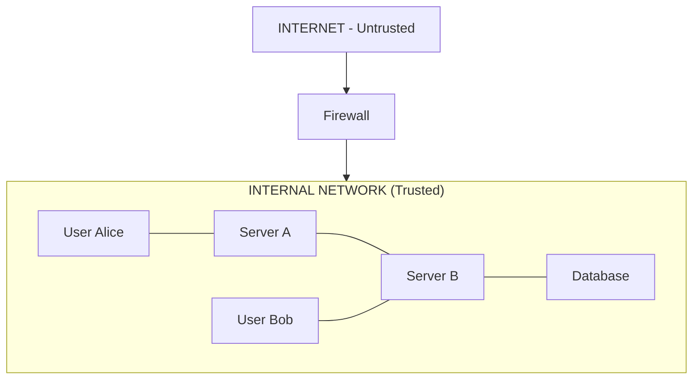
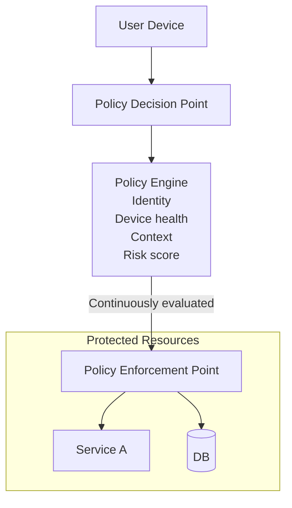
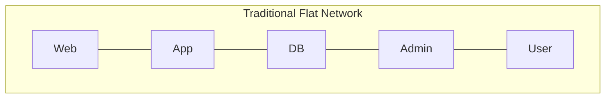
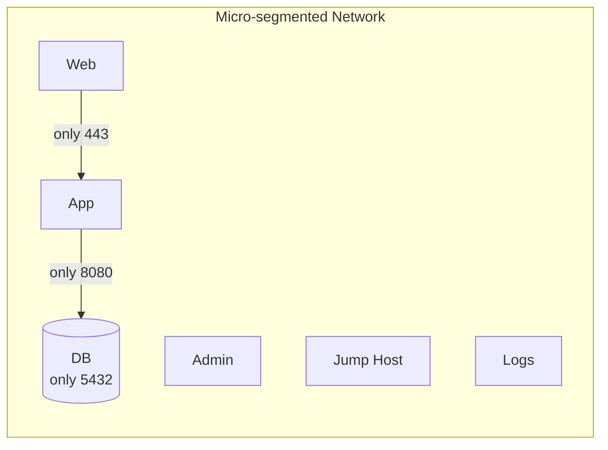
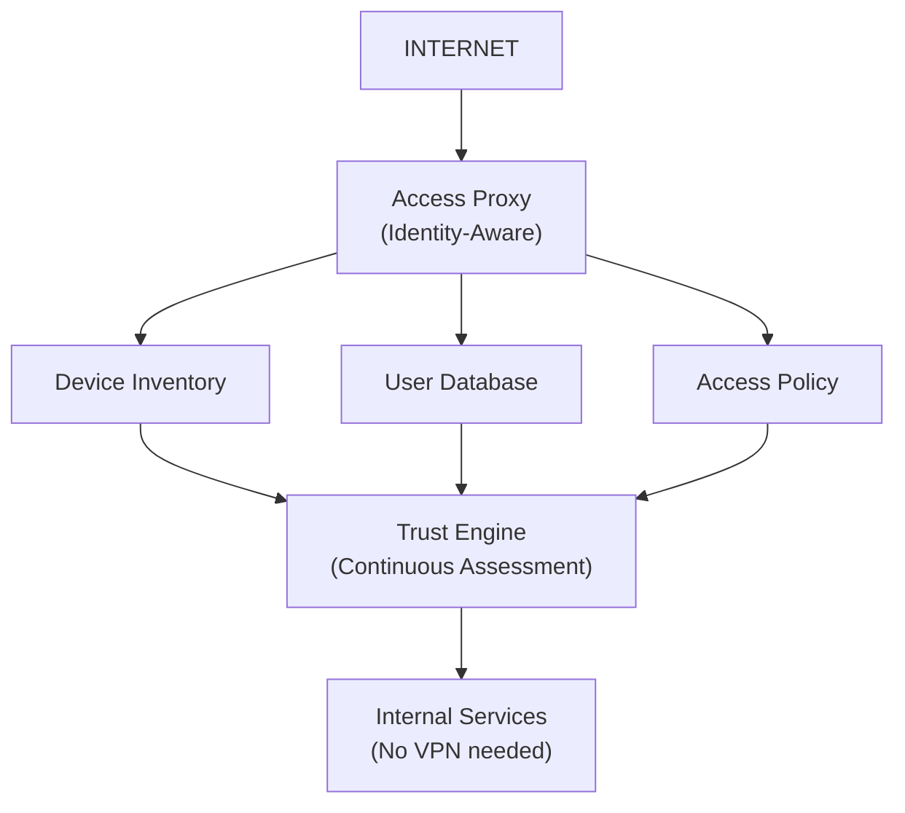

# Zero Trust Architecture

## TL;DR

Zero Trust replaces perimeter-based security ("trust the internal network") with "never trust, always verify." Every request is authenticated and authorized regardless of network location. Identity becomes the new perimeter.

---

## The Problem with Perimeter Security

### Traditional Model (Castle and Moat)



```
Problem: Once inside the perimeter, everything trusts everything
- Compromised laptop → access to all internal systems
- Lateral movement is trivial
- VPN = keys to the kingdom
```

### Why Perimeter Security Fails

1. **Cloud adoption**: Resources span multiple networks
2. **Remote work**: Users connect from anywhere
3. **BYOD**: Personal devices on corporate networks
4. **Supply chain attacks**: Trusted vendors compromised
5. **Insider threats**: Malicious or compromised insiders
6. **Sophisticated attackers**: Perimeter will eventually be breached

---

## Zero Trust Principles

### Core Tenets

```
1. Never Trust, Always Verify
   - No implicit trust based on network location
   - Every request is fully authenticated and authorized

2. Assume Breach
   - Design as if attackers are already inside
   - Minimize blast radius of any compromise

3. Least Privilege Access
   - Minimum permissions needed for the task
   - Just-in-time and just-enough access

4. Verify Explicitly
   - Use all available data points for decisions
   - Identity, device, location, behavior, data sensitivity
```

### Zero Trust Architecture



---

## Identity as the Perimeter

### Strong Identity Verification

```python
class ZeroTrustAuthenticator:
    def authenticate(self, request):
        # 1. Verify user identity
        user_identity = self.verify_user_identity(request)
        if not user_identity:
            return AuthResult.DENIED, "Invalid user credentials"
        
        # 2. Verify device identity and health
        device_identity = self.verify_device(request)
        if not device_identity.is_managed:
            return AuthResult.STEP_UP_REQUIRED, "Unmanaged device"
        
        if not device_identity.is_compliant:
            return AuthResult.DENIED, "Device not compliant"
        
        # 3. Check context (location, time, behavior)
        context = self.evaluate_context(request, user_identity)
        
        # 4. Calculate risk score
        risk_score = self.calculate_risk_score(
            user_identity, 
            device_identity, 
            context
        )
        
        # 5. Make access decision based on policy
        return self.policy_engine.evaluate(
            user_identity,
            device_identity,
            context,
            risk_score,
            request.resource
        )
```

### Device Trust

```
Device Trust Levels:

Level 0 - Unknown Device
├── No access to sensitive resources
├── Limited functionality
└── Prompted to enroll device

Level 1 - Known Device
├── Device registered
├── Basic security checks pass
└── Access to standard resources

Level 2 - Managed Device
├── MDM enrolled
├── Security policies enforced
├── Encryption verified
└── Access to sensitive resources

Level 3 - Compliant Device
├── All of Level 2
├── Up-to-date patches
├── No malware detected
├── Hardware attestation
└── Access to highly sensitive resources
```

### Device Health Checks

```python
class DeviceHealthChecker:
    def check_device_health(self, device):
        checks = {
            'os_version': self.check_os_version(device),
            'patch_level': self.check_patch_level(device),
            'encryption': self.check_disk_encryption(device),
            'firewall': self.check_firewall_enabled(device),
            'antivirus': self.check_antivirus_status(device),
            'jailbreak': self.check_not_jailbroken(device),
            'screen_lock': self.check_screen_lock(device),
        }
        
        # All checks must pass for compliant status
        is_compliant = all(checks.values())
        
        return DeviceHealthResult(
            is_compliant=is_compliant,
            checks=checks,
            last_checked=datetime.utcnow()
        )
```

---

## Micro-Segmentation

### Network Segmentation





```
Each segment has explicit allow rules, default deny
```

### Service-Level Segmentation

```yaml
# Service mesh policy (e.g., Istio)
apiVersion: security.istio.io/v1beta1
kind: AuthorizationPolicy
metadata:
  name: payment-service-policy
  namespace: production
spec:
  selector:
    matchLabels:
      app: payment-service
  rules:
  - from:
    - source:
        principals: ["cluster.local/ns/production/sa/order-service"]
    to:
    - operation:
        methods: ["POST"]
        paths: ["/api/v1/payments"]
  - from:
    - source:
        principals: ["cluster.local/ns/production/sa/admin-service"]
    to:
    - operation:
        methods: ["GET"]
        paths: ["/api/v1/payments/*"]
```

---

## Continuous Verification

### Session Reevaluation

```python
class ContinuousVerification:
    def __init__(self):
        self.verification_interval = 300  # 5 minutes
    
    async def monitor_session(self, session):
        while session.is_active:
            # Reevaluate trust factors
            current_risk = await self.evaluate_current_risk(session)
            
            if current_risk > session.allowed_risk_threshold:
                # Risk increased - take action
                if current_risk > CRITICAL_THRESHOLD:
                    await self.terminate_session(session)
                elif current_risk > HIGH_THRESHOLD:
                    await self.require_step_up_auth(session)
                else:
                    await self.reduce_permissions(session)
            
            await asyncio.sleep(self.verification_interval)
    
    async def evaluate_current_risk(self, session):
        factors = {
            'location_change': await self.check_location_anomaly(session),
            'behavior_anomaly': await self.check_behavior_anomaly(session),
            'device_health': await self.check_device_health(session.device),
            'threat_intel': await self.check_threat_intelligence(session),
            'time_anomaly': self.check_time_anomaly(session),
        }
        
        return self.calculate_composite_risk(factors)
```

### Behavior Analytics

```python
class UserBehaviorAnalytics:
    def analyze_request(self, user, request):
        baseline = self.get_user_baseline(user)
        
        anomalies = []
        
        # Location analysis
        if not self.is_typical_location(user, request.ip):
            anomalies.append(AnomalyType.UNUSUAL_LOCATION)
        
        # Time analysis
        if not self.is_typical_time(user, request.timestamp):
            anomalies.append(AnomalyType.UNUSUAL_TIME)
        
        # Access pattern analysis
        if self.is_unusual_resource_access(user, request.resource):
            anomalies.append(AnomalyType.UNUSUAL_RESOURCE)
        
        # Volume analysis
        if self.is_unusual_volume(user, request.timestamp):
            anomalies.append(AnomalyType.UNUSUAL_VOLUME)
        
        # Velocity analysis (impossible travel)
        if self.is_impossible_travel(user, request):
            anomalies.append(AnomalyType.IMPOSSIBLE_TRAVEL)
        
        return RiskAssessment(anomalies=anomalies)
    
    def is_impossible_travel(self, user, request):
        last_location = self.get_last_location(user)
        if not last_location:
            return False
        
        current_location = self.geolocate(request.ip)
        distance = self.calculate_distance(last_location, current_location)
        time_diff = request.timestamp - last_location.timestamp
        
        # Speed > 1000 km/h is physically impossible
        speed = distance / (time_diff.total_seconds() / 3600)
        return speed > 1000
```

---

## BeyondCorp Model (Google's Implementation)

### Architecture



### Key Components

```
1. Device Inventory
   - Every device has unique certificate
   - Device properties tracked centrally
   - Health status continuously updated

2. User/Group Database  
   - SSO integration
   - Group memberships
   - Job functions and access levels

3. Access Proxy
   - All access goes through proxy
   - Terminates TLS
   - Enforces authentication
   - Makes policy decisions

4. Access Control Engine
   - Combines all trust signals
   - Evaluates against policies
   - Returns allow/deny decisions

5. Trust Inference Pipeline
   - Continuously calculates trust levels
   - Incorporates threat intelligence
   - Updates in near-real-time
```

---

## Implementation Strategy

### Phase 1: Identify and Catalog

```
1. Identify all resources
   - Applications (internal and SaaS)
   - Data stores
   - Infrastructure
   - APIs

2. Catalog users and devices
   - User inventory
   - Device inventory
   - Service accounts

3. Map access patterns
   - Who accesses what
   - From where
   - How often

4. Classify data sensitivity
   - Public
   - Internal
   - Confidential
   - Restricted
```

### Phase 2: Strengthen Identity

```
1. Implement strong authentication
   - MFA everywhere
   - Passwordless where possible
   - Hardware security keys for privileged users

2. Deploy device trust
   - Device certificates
   - MDM/endpoint management
   - Device health attestation

3. Establish identity source of truth
   - Single identity provider
   - Unified directory
   - Automated provisioning/deprovisioning
```

### Phase 3: Micro-Segmentation

```
1. Segment networks
   - Define security zones
   - Implement network policies
   - Deploy next-gen firewalls

2. Implement service mesh
   - mTLS between services
   - Service-to-service authorization
   - Traffic encryption

3. Deploy application-level controls
   - Web application firewall
   - API gateway with auth
   - Database access controls
```

### Phase 4: Continuous Monitoring

```
1. Deploy SIEM
   - Aggregate security logs
   - Correlation rules
   - Alerting

2. Implement UEBA
   - Baseline normal behavior
   - Detect anomalies
   - Risk scoring

3. Automate response
   - Automated containment
   - Session termination
   - Access revocation
```

---

## Zero Trust for APIs

### API Gateway as Policy Enforcement Point

```python
class ZeroTrustAPIGateway:
    async def handle_request(self, request):
        # 1. Authenticate caller (user or service)
        identity = await self.authenticate(request)
        if not identity:
            return Response(401, "Authentication required")
        
        # 2. Validate device/client
        client_trust = await self.evaluate_client_trust(request)
        if client_trust.level < MINIMUM_TRUST_LEVEL:
            return Response(403, "Client trust level insufficient")
        
        # 3. Evaluate context
        context = await self.build_context(request, identity, client_trust)
        
        # 4. Check authorization
        authz_decision = await self.policy_engine.authorize(
            identity,
            request.resource,
            request.action,
            context
        )
        
        if not authz_decision.allowed:
            return Response(403, authz_decision.reason)
        
        # 5. Log for audit
        await self.audit_log.record(request, identity, authz_decision)
        
        # 6. Forward to backend
        response = await self.forward_to_backend(request, identity)
        
        # 7. Inspect response (DLP)
        await self.inspect_response(response, identity, context)
        
        return response
```

### Service-to-Service Authentication

```python
# Using SPIFFE/SPIRE for workload identity
class ServiceIdentity:
    def __init__(self, spire_client):
        self.spire = spire_client
    
    async def get_identity(self):
        # Workload gets identity from SPIRE agent
        svid = await self.spire.fetch_x509_svid()
        return svid
    
    async def call_service(self, target_service, request):
        # Get our identity
        svid = await self.get_identity()
        
        # Create mTLS connection
        ssl_context = ssl.create_default_context()
        ssl_context.load_cert_chain(
            certfile=svid.cert_chain,
            keyfile=svid.private_key
        )
        
        # Make request with mTLS
        async with aiohttp.ClientSession() as session:
            async with session.post(
                f"https://{target_service}/api",
                json=request,
                ssl=ssl_context
            ) as response:
                return await response.json()
```

---

## Challenges and Trade-offs

### Performance Impact

```
Challenge: Every request requires multiple checks
- Identity verification
- Device health check  
- Policy evaluation
- Context analysis

Mitigation:
- Cache trust decisions (with short TTL)
- Use efficient policy engines (e.g., OPA)
- Distribute policy enforcement points
- Asynchronous verification where acceptable
```

### User Experience

```
Challenge: Additional authentication friction

Mitigation:
- Risk-based authentication (step-up when needed)
- SSO reduces authentication prompts
- Passwordless authentication
- Transparent device authentication
- Remember trusted devices (within policy)
```

### Legacy Systems

```
Challenge: Older systems don't support modern auth

Mitigation:
- Place proxy/gateway in front
- Implement identity bridging
- Gradual migration plan
- Segment legacy systems more strictly
```

### Complexity

```
Challenge: Significant increase in system complexity

Mitigation:
- Incremental implementation
- Strong automation
- Comprehensive monitoring
- Clear documentation
- Training for ops teams
```

---

## Metrics and Monitoring

### Key Metrics

```python
class ZeroTrustMetrics:
    def __init__(self):
        self.metrics = {
            # Authentication metrics
            'auth_attempts': Counter(),
            'auth_failures': Counter(),
            'mfa_challenges': Counter(),
            
            # Authorization metrics
            'access_granted': Counter(),
            'access_denied': Counter(),
            'policy_violations': Counter(),
            
            # Device metrics
            'compliant_devices': Gauge(),
            'non_compliant_devices': Gauge(),
            'unknown_devices': Gauge(),
            
            # Risk metrics
            'high_risk_sessions': Gauge(),
            'anomaly_detections': Counter(),
            'session_terminations': Counter(),
            
            # Performance
            'policy_eval_latency': Histogram(),
            'auth_latency': Histogram(),
        }
```

### Dashboards

```
Zero Trust Dashboard:

  Access Overview (Last 24h)
  Granted: 45,231 (↑ 5%)  |  Denied: 1,247 (↓ 12%)  |  Step-up: 892 (↑ 23%)

  Device Compliance: 85% Compliant
  Risk Score Distribution: Low 75% | Medium 18% | High 7%
```

---

## References

- [NIST SP 800-207: Zero Trust Architecture](https://csrc.nist.gov/publications/detail/sp/800-207/final)
- [Google BeyondCorp Papers](https://cloud.google.com/beyondcorp)
- [Microsoft Zero Trust](https://www.microsoft.com/en-us/security/business/zero-trust)
- [CISA Zero Trust Maturity Model](https://www.cisa.gov/zero-trust-maturity-model)
- [Forrester Zero Trust Model](https://www.forrester.com/report/the-definition-of-modern-zero-trust/RES176317)
