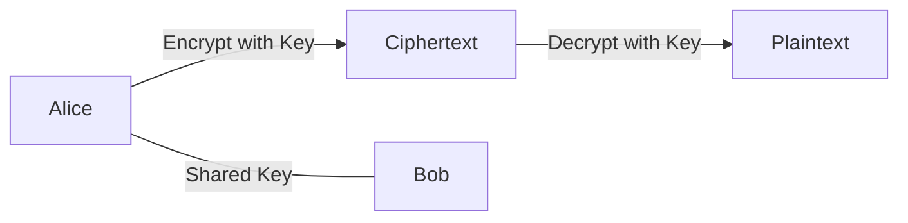
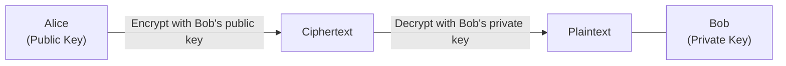
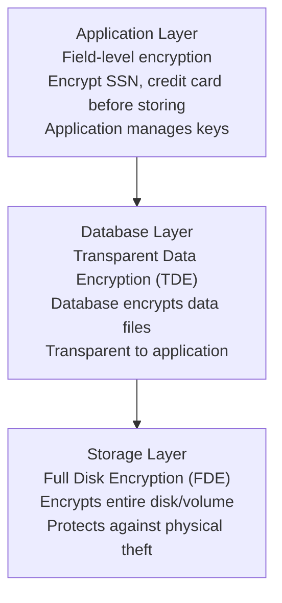
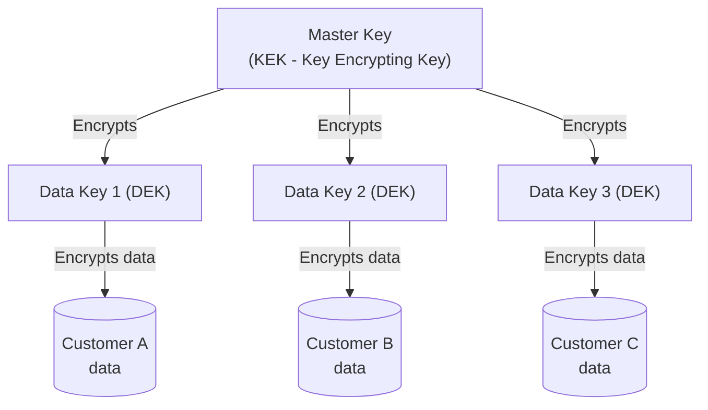
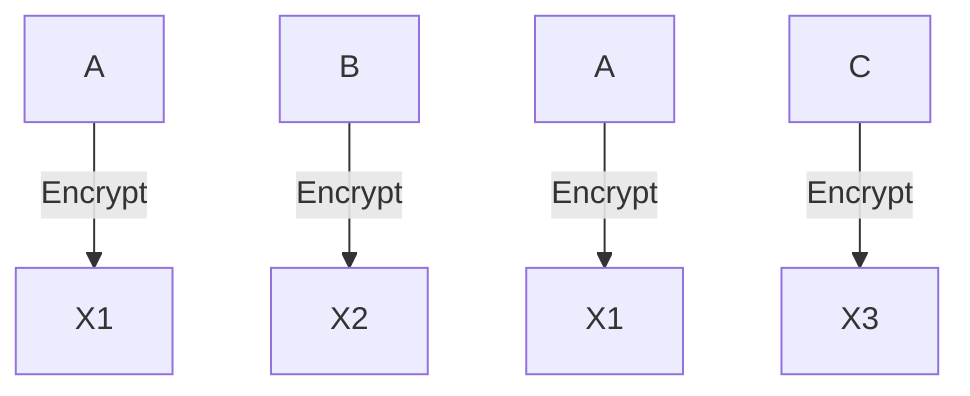

# Encryption Patterns

## TL;DR

Encryption protects data confidentiality. Use TLS for data in transit, AES-256 for data at rest, and understand key management is the hardest part. Encryption without proper key management is security theater.

---

## Encryption Fundamentals

### Symmetric vs. Asymmetric

```
Symmetric Encryption (AES):
- Same key encrypts and decrypts
- Fast, efficient for large data
- Challenge: How to share the key securely?
```



```
Asymmetric Encryption (RSA, ECC):
- Public key encrypts, private key decrypts
- Slower, used for key exchange and signatures
- Anyone can encrypt, only private key holder decrypts
```



### Hybrid Encryption (How TLS Works)

```
1. Asymmetric exchange of symmetric key
2. Symmetric encryption for actual data
```

```mermaid
sequenceDiagram
    participant Client
    participant Server

    Client->>Server: Request server cert
    Server-->>Client: Server public key
    Client->>Client: Generate random symmetric key
    Client->>Client: Encrypt with server's public key
    Client->>Server: Encrypted symmetric key
    Server->>Server: Decrypt with private key
    Client<-->Server: Symmetric encrypted data exchange
```

---

## Data in Transit (TLS)

### TLS 1.3 Handshake

```mermaid
sequenceDiagram
    participant Client
    participant Server

    Client->>Server: ClientHello (cipher suites, DH key share, versions)
    Server-->>Client: ServerHello (selected cipher, DH key share, certificate, Finished)
    Note over Client, Server: Both derive symmetric keys
    Client->>Server: Finished
    Client<-->Server: Encrypted Application Data
```

### TLS Configuration Best Practices

```python
import ssl

def create_secure_ssl_context():
    context = ssl.SSLContext(ssl.PROTOCOL_TLS_SERVER)
    
    # Minimum TLS 1.2, prefer 1.3
    context.minimum_version = ssl.TLSVersion.TLSv1_2
    context.maximum_version = ssl.TLSVersion.TLSv1_3
    
    # Strong cipher suites only
    context.set_ciphers(
        'ECDHE+AESGCM:DHE+AESGCM:ECDHE+CHACHA20:DHE+CHACHA20'
    )
    
    # Load certificate chain
    context.load_cert_chain(
        certfile='/path/to/cert.pem',
        keyfile='/path/to/key.pem'
    )
    
    # Enable certificate verification for client connections
    context.verify_mode = ssl.CERT_REQUIRED
    context.check_hostname = True
    
    return context
```

### mTLS (Mutual TLS)

Both client and server present certificates.

```mermaid
sequenceDiagram
    participant A as Service A<br/>(Cert + Key + CA)
    participant B as Service B<br/>(Cert + Key + CA)

    A->>B: 1. Present cert, verify B's cert
    B->>A: 2. Present cert, verify A's cert
    A<-->B: 3. Encrypted communication
```

```
Use cases:
- Service mesh (Istio, Linkerd)
- Zero trust architectures
- API security between trusted services
```

---

## Data at Rest

### Encryption Layers



### Application-Level Encryption

```python
from cryptography.fernet import Fernet
from cryptography.hazmat.primitives.ciphers.aead import AESGCM
import os

class FieldEncryption:
    """Encrypt sensitive fields before database storage"""
    
    def __init__(self, key: bytes):
        # AES-256 requires 32-byte key
        assert len(key) == 32
        self.aesgcm = AESGCM(key)
    
    def encrypt(self, plaintext: str) -> bytes:
        """Encrypt with random nonce"""
        nonce = os.urandom(12)  # 96-bit nonce for GCM
        ciphertext = self.aesgcm.encrypt(
            nonce,
            plaintext.encode(),
            associated_data=None
        )
        # Return nonce + ciphertext (need nonce for decryption)
        return nonce + ciphertext
    
    def decrypt(self, data: bytes) -> str:
        """Decrypt, extracting nonce from data"""
        nonce = data[:12]
        ciphertext = data[12:]
        plaintext = self.aesgcm.decrypt(
            nonce,
            ciphertext,
            associated_data=None
        )
        return plaintext.decode()

# Usage
encryption = FieldEncryption(key=os.urandom(32))

# Before storing
encrypted_ssn = encryption.encrypt("123-45-6789")
db.store(user_id, encrypted_ssn)

# When retrieving
encrypted_data = db.get(user_id)
ssn = encryption.decrypt(encrypted_data)
```

### Searchable Encryption

Problem: Can't search encrypted data without decrypting.

```python
# Approach 1: Deterministic encryption for exact match
import hashlib
import hmac

class SearchableEncryption:
    def __init__(self, search_key: bytes, encryption_key: bytes):
        self.search_key = search_key
        self.encryption = FieldEncryption(encryption_key)
    
    def store(self, plaintext: str):
        # Create searchable blind index
        blind_index = hmac.new(
            self.search_key,
            plaintext.lower().encode(),
            hashlib.sha256
        ).hexdigest()[:16]  # Truncate to limit leakage
        
        # Store encrypted value + blind index
        return {
            'encrypted': self.encryption.encrypt(plaintext),
            'search_index': blind_index
        }
    
    def search(self, search_term: str):
        # Generate same blind index
        blind_index = hmac.new(
            self.search_key,
            search_term.lower().encode(),
            hashlib.sha256
        ).hexdigest()[:16]
        
        # Search by blind index
        return db.find({'search_index': blind_index})

# Trade-off: Leaks equality (same plaintext = same index)
```

---

## Key Management

### Key Hierarchy



### Envelope Encryption

```python
class EnvelopeEncryption:
    """
    1. Generate unique data key for each encryption
    2. Encrypt data with data key
    3. Encrypt data key with master key
    4. Store encrypted data + encrypted data key
    """
    
    def __init__(self, kms_client):
        self.kms = kms_client
    
    def encrypt(self, plaintext: bytes, master_key_id: str) -> dict:
        # 1. Generate data key (KMS returns plaintext + encrypted versions)
        data_key_response = self.kms.generate_data_key(
            KeyId=master_key_id,
            KeySpec='AES_256'
        )
        
        plaintext_key = data_key_response['Plaintext']
        encrypted_key = data_key_response['CiphertextBlob']
        
        # 2. Encrypt data with plaintext key
        aesgcm = AESGCM(plaintext_key)
        nonce = os.urandom(12)
        ciphertext = aesgcm.encrypt(nonce, plaintext, None)
        
        # 3. Securely delete plaintext key from memory
        # (In practice, use secure memory handling)
        del plaintext_key
        
        # 4. Return encrypted data + encrypted key
        return {
            'ciphertext': nonce + ciphertext,
            'encrypted_data_key': encrypted_key
        }
    
    def decrypt(self, encrypted_bundle: dict) -> bytes:
        # 1. Decrypt data key using KMS
        data_key = self.kms.decrypt(
            CiphertextBlob=encrypted_bundle['encrypted_data_key']
        )['Plaintext']
        
        # 2. Decrypt data
        ciphertext = encrypted_bundle['ciphertext']
        nonce = ciphertext[:12]
        actual_ciphertext = ciphertext[12:]
        
        aesgcm = AESGCM(data_key)
        plaintext = aesgcm.decrypt(nonce, actual_ciphertext, None)
        
        del data_key
        return plaintext
```

### Key Rotation

```python
class KeyRotation:
    """
    Key rotation strategy:
    1. Generate new key version
    2. New encryptions use new key
    3. Old data still decryptable with old key
    4. Gradually re-encrypt old data
    5. Retire old key after all data migrated
    """
    
    def __init__(self, kms):
        self.kms = kms
    
    def rotate_master_key(self, key_id: str):
        # Create new key version (old version still usable)
        self.kms.rotate_key(KeyId=key_id)
    
    def re_encrypt_data(self, encrypted_bundle: dict, 
                        old_key_id: str, new_key_id: str) -> dict:
        # Decrypt with old key
        plaintext = self.decrypt(encrypted_bundle, old_key_id)
        
        # Encrypt with new key
        new_bundle = self.encrypt(plaintext, new_key_id)
        
        return new_bundle
    
    def batch_re_encrypt(self, table_name: str, 
                         old_key_id: str, new_key_id: str):
        """Re-encrypt table in batches"""
        cursor = None
        
        while True:
            # Get batch of records
            records, cursor = db.scan(
                table_name, 
                limit=100, 
                cursor=cursor
            )
            
            if not records:
                break
            
            for record in records:
                new_encrypted = self.re_encrypt_data(
                    record['encrypted_data'],
                    old_key_id,
                    new_key_id
                )
                
                db.update(
                    table_name,
                    record['id'],
                    {'encrypted_data': new_encrypted}
                )
```

---

## Cloud KMS Services

### AWS KMS

```python
import boto3

class AWSKMS:
    def __init__(self):
        self.client = boto3.client('kms')
    
    def create_key(self, description: str):
        response = self.client.create_key(
            Description=description,
            KeyUsage='ENCRYPT_DECRYPT',
            KeySpec='SYMMETRIC_DEFAULT',  # AES-256-GCM
            MultiRegion=False
        )
        return response['KeyMetadata']['KeyId']
    
    def encrypt(self, key_id: str, plaintext: bytes):
        response = self.client.encrypt(
            KeyId=key_id,
            Plaintext=plaintext,
            EncryptionAlgorithm='SYMMETRIC_DEFAULT'
        )
        return response['CiphertextBlob']
    
    def decrypt(self, ciphertext: bytes):
        response = self.client.decrypt(
            CiphertextBlob=ciphertext,
            EncryptionAlgorithm='SYMMETRIC_DEFAULT'
        )
        return response['Plaintext']
    
    def generate_data_key(self, key_id: str):
        """Generate data key for envelope encryption"""
        response = self.client.generate_data_key(
            KeyId=key_id,
            KeySpec='AES_256'
        )
        return {
            'plaintext': response['Plaintext'],
            'encrypted': response['CiphertextBlob']
        }
```

### HashiCorp Vault

```python
import hvac

class VaultEncryption:
    def __init__(self, vault_url: str, token: str):
        self.client = hvac.Client(url=vault_url, token=token)
    
    def encrypt(self, key_name: str, plaintext: str):
        """Use Vault's transit secrets engine"""
        response = self.client.secrets.transit.encrypt_data(
            name=key_name,
            plaintext=base64.b64encode(plaintext.encode()).decode()
        )
        return response['data']['ciphertext']
    
    def decrypt(self, key_name: str, ciphertext: str):
        response = self.client.secrets.transit.decrypt_data(
            name=key_name,
            ciphertext=ciphertext
        )
        return base64.b64decode(response['data']['plaintext']).decode()
    
    def rotate_key(self, key_name: str):
        """Rotate encryption key"""
        self.client.secrets.transit.rotate_key(name=key_name)
    
    def rewrap_data(self, key_name: str, ciphertext: str):
        """Re-encrypt with latest key version without exposing plaintext"""
        response = self.client.secrets.transit.rewrap_data(
            name=key_name,
            ciphertext=ciphertext
        )
        return response['data']['ciphertext']
```

---

## Hashing vs. Encryption

```
Encryption (Reversible):
- Plaintext ──[key]──► Ciphertext ──[key]──► Plaintext
- Use for: Data you need to read later

Hashing (One-way):
- Plaintext ──────────► Hash
- Cannot reverse: Hash ───X───► Plaintext
- Use for: Passwords, integrity verification

# Password storage
password_hash = bcrypt.hashpw(password, bcrypt.gensalt())

# Data integrity
file_hash = hashlib.sha256(file_content).hexdigest()
# Verify: recalculate hash and compare
```

### HMAC for Authentication

```python
import hmac
import hashlib

def create_signed_url(url: str, secret_key: bytes, expiry: int) -> str:
    """Create URL with HMAC signature"""
    message = f"{url}|{expiry}"
    signature = hmac.new(
        secret_key,
        message.encode(),
        hashlib.sha256
    ).hexdigest()
    
    return f"{url}?expires={expiry}&signature={signature}"

def verify_signed_url(url: str, secret_key: bytes) -> bool:
    """Verify URL signature"""
    # Parse URL and extract signature
    parsed = parse_url(url)
    provided_signature = parsed['signature']
    expiry = parsed['expires']
    base_url = parsed['base_url']
    
    # Check expiry
    if int(expiry) < time.time():
        return False
    
    # Verify signature
    message = f"{base_url}|{expiry}"
    expected_signature = hmac.new(
        secret_key,
        message.encode(),
        hashlib.sha256
    ).hexdigest()
    
    return hmac.compare_digest(provided_signature, expected_signature)
```

---

## Common Pitfalls

### 1. ECB Mode (Don't Use)



```
ECB: Same plaintext block = same ciphertext block!
Problem: Patterns in plaintext visible in ciphertext
Solution: Use GCM, CBC with random IV, or CTR mode
```

### 2. Reusing Nonces

```python
# CATASTROPHIC with GCM/CTR modes
key = os.urandom(32)
nonce = b'static_nonce'  # WRONG!

# If same nonce used twice with same key:
# XOR of ciphertexts = XOR of plaintexts
# This completely breaks confidentiality

# CORRECT: Always use random nonce
nonce = os.urandom(12)  # New random nonce per encryption
```

### 3. Not Authenticating Ciphertext

```python
# Encryption without authentication (vulnerable to tampering)
cipher = AES.new(key, AES.MODE_CBC, iv)
ciphertext = cipher.encrypt(plaintext)
# Attacker can flip bits in ciphertext!

# Use authenticated encryption (AES-GCM)
aesgcm = AESGCM(key)
ciphertext = aesgcm.encrypt(nonce, plaintext, associated_data)
# Tampering detected during decryption
```

### 4. Hardcoded Keys

```python
# NEVER do this
ENCRYPTION_KEY = "my-super-secret-key-12345"

# Load from secure source
ENCRYPTION_KEY = os.environ.get('ENCRYPTION_KEY')
# Or use KMS
ENCRYPTION_KEY = kms.get_key('production/encryption')
```

---

## Compliance Considerations

### PCI-DSS Requirements

```
For credit card data:
□ Use strong cryptography (AES-256)
□ Document key management procedures
□ Implement key rotation
□ Protect keys from unauthorized access
□ Maintain audit logs of key usage
□ Split knowledge for key custodians
```

### GDPR Requirements

```
For personal data:
□ Encryption as appropriate technical measure
□ Pseudonymization where possible
□ Consider encryption for data portability
□ Key management supports right to erasure
```

---

## Best Practices Checklist

```
Algorithm Selection:
□ AES-256-GCM for symmetric encryption
□ RSA-2048+ or ECC P-256+ for asymmetric
□ SHA-256 or SHA-3 for hashing
□ Argon2 or bcrypt for passwords

Key Management:
□ Use a KMS (cloud or Vault)
□ Implement key hierarchy
□ Automate key rotation
□ Never hardcode keys
□ Audit key access

Implementation:
□ Use authenticated encryption (GCM)
□ Never reuse nonces
□ Use cryptographic random number generator
□ Verify library is maintained and audited
□ Keep dependencies updated

Transit:
□ TLS 1.2+ only
□ Strong cipher suites
□ Certificate validation
□ HSTS enabled

At Rest:
□ Encrypt sensitive fields
□ Consider storage-layer encryption
□ Envelope encryption for scalability
□ Secure key storage separate from data
```

---

## References

- [OWASP Cryptographic Storage Cheat Sheet](https://cheatsheetseries.owasp.org/cheatsheets/Cryptographic_Storage_Cheat_Sheet.html)
- [NIST Cryptographic Standards](https://csrc.nist.gov/projects/cryptographic-standards-and-guidelines)
- [AWS KMS Best Practices](https://docs.aws.amazon.com/kms/latest/developerguide/best-practices.html)
- [HashiCorp Vault Documentation](https://www.vaultproject.io/docs)
- [Practical Cryptography for Developers](https://cryptobook.naktrace.com/)
