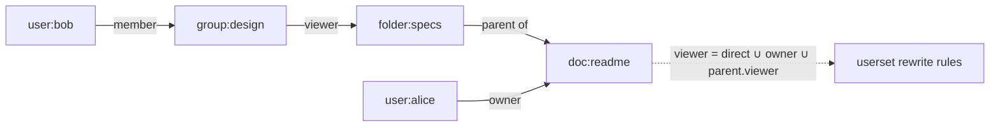
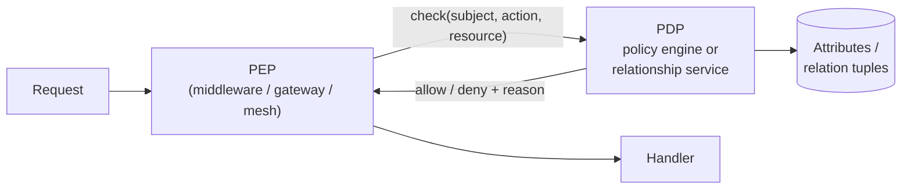

# Authorization at Scale

## TL;DR

Authentication answers *who you are*; authorization answers *what you may do* — and it runs on every request, so it is a latency-critical, correctness-critical distributed system of its own. The model progression: **RBAC** (roles → permissions) until role explosion, **ABAC** (policy over attributes) when context matters, **ReBAC** (permissions as graph relationships, Google's Zanzibar) when sharing and hierarchy define access — most real systems blend all three. Architecturally: centralize the *decision* (policy engine or relationship service), distribute the *enforcement* (in-process or sidecar PDP), and confront the two hard problems early — keeping authorization data in sync with application data (it's a [dual-write problem](../05-messaging/07-outbox-pattern.md)), and **list filtering** ("show me everything I can see"), which is a query-shaping problem no per-request check API solves.

---

## The Models

### RBAC: roles bundle permissions

Users get roles; roles carry permissions. Simple to reason about, audit-friendly, and where everyone correctly starts.

```sql
-- The entire model in three joins
SELECT 1 FROM user_roles ur
JOIN role_permissions rp ON ur.role_id = rp.role_id
WHERE ur.user_id = :user AND rp.permission = 'invoice:approve';
```

RBAC breaks via **role explosion**: when access depends on anything beyond job function — region, project, amount, tenant — you mint `invoice_approver_emea_under_10k` style roles combinatorially. Hundreds of roles later, nobody can answer "why does Alice have this?" RBAC's ceiling is reached when roles start encoding *attributes*.

### ABAC: policy over attributes

Decisions become predicates over subject, resource, action, and environment attributes:

```rego
# OPA / Rego
allow if {
    input.action == "approve"
    input.resource.type == "invoice"
    input.subject.department == input.resource.department
    input.resource.amount <= input.subject.approval_limit
    time.clock(time.now_ns())[0] >= 9   # business hours, if you must
}
```

Expressive and centralized — policy ships independently of code. The costs: every relevant attribute must be **available at decision time** (an attribute-fetching problem that dominates latency), and "who can access X?" becomes hard to answer — you can evaluate a policy forward, but inverting arbitrary predicates for audits is undecidable in general. Modern policy languages (Cedar, with formally analyzable semantics) constrain expressiveness deliberately to keep auditing tractable.

### ReBAC: permissions as relationships

When access derives from structure — *Alice can edit because she's in the design group, which is an editor of the project, which contains the doc* — model it as a graph. This is **Zanzibar**, the system behind Google Drive/Docs/Cloud sharing:

```
# Relation tuples: object#relation@subject
doc:readme#owner@user:alice
doc:readme#parent@folder:specs
folder:specs#viewer@group:design#member
group:design#member@user:bob
```



A check (`can bob view doc:readme?`) is a graph reachability query guided by **userset rewrite rules** per object type (e.g., `viewer = direct viewers ∪ editors ∪ parent folder's viewers`). Inheritance, groups-in-groups, and "share with team" fall out naturally — the things RBAC and ABAC encode awkwardly.

**The new-enemy problem.** Zanzibar's deepest contribution is about consistency, not graphs. Two orderings must never be violated: if you *remove* Bob then add a secret to the folder, Bob must not see the secret via a stale ACL replica; if you save content then narrow the ACL, the new ACL must apply to that content. Zanzibar solves this with snapshot tokens — **zookies**: content writes store the current ACL snapshot token, and checks evaluate at-least-as-fresh-as that token (built on Spanner's TrueTime — see [Spanner](../09-whitepapers/04-spanner.md)). The lesson generalizes to any authz cache you build: bounded staleness is fine for *adding* permissions, dangerous for *revocation* — tie revocation-sensitive checks to a freshness token, or accept and document the staleness window.

**Open-source descendants:** SpiceDB, OpenFGA, Ory Keto implement the Zanzibar model with zookie-equivalents; adopt one rather than growing a bespoke permissions graph inside your primary database.

### Choosing (really: layering)

| | RBAC | ABAC | ReBAC |
|---|---|---|---|
| Decides by | Role membership | Attribute predicates | Graph reachability |
| Sweet spot | Internal tools, coarse tiers | Context rules, compliance ("only from EU, only < $10k") | User-generated sharing, hierarchies, multi-tenant resources |
| Breaks via | Role explosion | Attribute sprawl, audit opacity | Operational complexity of a new stateful service |
| "Why allowed?" | Trivial | Hard | Path through graph (good) |
| "Who can see X?" | Easy | Hard | Reverse expansion (supported) |

Typical production blend: ReBAC for resource ownership/sharing, ABAC predicates layered for contextual constraints, RBAC surviving as convenient role-shaped relations (`org:acme#admin@user:alice`).

---

## Architecture: PDP, PEP, and the Latency Budget

Standard decomposition — **PEP** (enforcement point: where the request is allowed/denied), **PDP** (decision point: evaluates policy/graph), **PAP/PIP** (where policy and attribute data are managed):



Placement options, in rising latency order:

1. **In-process library** (embedded OPA/Cedar, local tuple cache): microseconds, but policy/data distribution becomes your problem.
2. **Sidecar PDP**: sub-millisecond localhost hop; policy distributed by control plane; the service-mesh-native choice ([Sidecar Pattern](../12-service-mesh/03-sidecar-pattern.md)).
3. **Central authz service**: one network hop (~1–5ms) on *every request* — must be engineered like a tier-0 dependency: aggressively cached, horizontally scaled, with explicit fail-open/fail-closed semantics per route (fail-closed for actions, often fail-open-with-logging for low-risk reads — decide deliberately, in writing).

Practical defaults: enforce coarse checks early (gateway: "is this user in this tenant at all?" — [API Gateway](../12-service-mesh/02-api-gateway.md)), fine-grained checks at the service (where resource context exists), and **never** scatter raw permission SQL across N services — that's the unauditable anti-pattern that authz systems exist to replace.

### Keeping authz data in sync

Relationship tuples mirror application state (`project_members` table ↔ `project#member` tuples) — a classic dual-write. Writing the app DB and the authz service separately *will* diverge. Use the [Outbox pattern](../05-messaging/07-outbox-pattern.md) or [CDC](../13-data-pipelines/04-change-data-capture.md) to derive tuple writes from committed application changes, monitor end-to-end lag, and remember the new-enemy rule: **revocations are the writes whose lag you alert on.**

### List filtering: the hard query

Per-object `check()` works for "open this doc." It does not work for "render Alice's inbox of the 40 docs she can see among 40 million." Three viable strategies:

| Strategy | How | Trade-off |
|---|---|---|
| **Pre-expansion (reverse index)** | Materialize `user → readable objects` (Zanzibar's Leopard index; SpiceDB/OpenFGA `lookup-resources`) | Freshness lag; index maintenance |
| **Query rewriting** | PDP returns a *filter* (set of IDs or SQL predicate) the DB applies — OPA partial evaluation, Postgres RLS | Predicate size limits; engine must support it |
| **Post-filtering** | Fetch then check each | Only for small result sets; pagination breaks (page 1 may filter to 3 items) |

Decide list-filtering strategy **before** committing to an authz service — it constrains the choice more than raw check latency does.

---

## Multi-Tenancy, Audit, and Operations

- **Tenant isolation is the outermost relation.** Model tenancy explicitly (`org:acme` as the root of every object's graph) and enforce it redundantly — authz layer *and* data layer (row-level security / tenant-scoped queries), because the cost of a cross-tenant leak justifies defense in depth.
- **Decision logs are a product requirement.** Every deny (and sampled allows) with subject/action/resource/policy-version/latency: this is your audit trail, your debugging tool ("why can't I see this?" tickets), and your anomaly-detection feed.
- **Policy is code:** versioned, reviewed, tested (table-driven allow/deny cases per policy, including *negative* tests for revocation), and rolled out progressively with a shadow mode — evaluate new policy alongside old, diff decisions, then cut over.
- **Watch the cache revocation window.** Measure and publish "max seconds a revoked permission can still succeed" as an SLO; security reviews will ask.

---

## References

- [Zanzibar: Google's Consistent, Global Authorization System](https://research.google/pubs/pub48190/) — tuples, userset rewrites, zookies, Leopard
- [Open Policy Agent](https://www.openpolicyagent.org/docs/latest/) and [Cedar](https://www.cedarpolicy.com/) — policy-as-code engines (ABAC)
- [SpiceDB](https://authzed.com/docs) / [OpenFGA](https://openfga.dev/docs) — production Zanzibar-model implementations
- [NIST RBAC](https://csrc.nist.gov/projects/role-based-access-control) and [NIST SP 800-162 (ABAC)](https://csrc.nist.gov/publications/detail/sp/800-162/final) — the formal models
- [Postgres Row-Level Security](https://www.postgresql.org/docs/current/ddl-rowsecurity.html) — query-rewriting enforcement in the database
