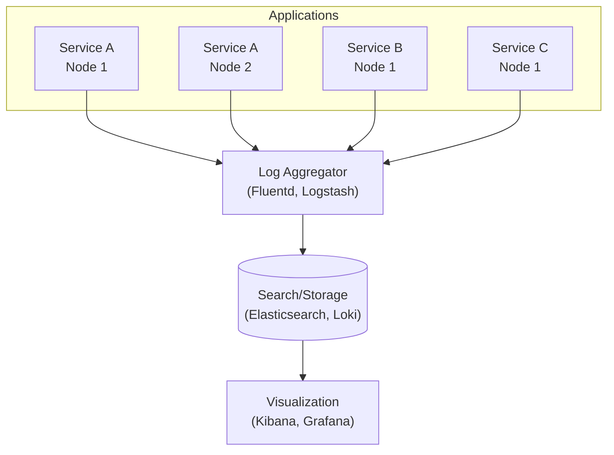
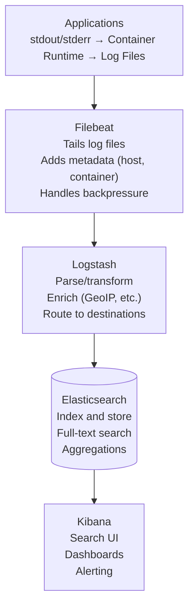
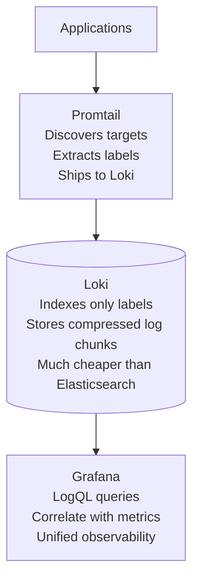
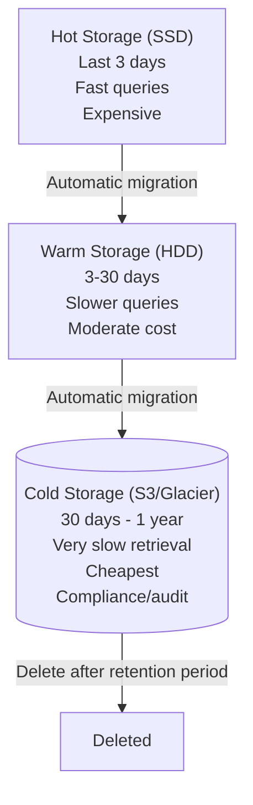

# Logging

## TL;DR

Logs are immutable, timestamped records of events. In distributed systems, centralized logging with structured data (JSON) enables searching across services. Log levels, correlation IDs, and thoughtful content make logs useful rather than noise.

---

## The Problem with Traditional Logging

### Before: Scattered Logs

```
Service A (Node 1): app.log
Service A (Node 2): app.log
Service B (Node 1): app.log
Service B (Node 2): app.log
...

To debug:
1. SSH into each server
2. grep through logs
3. Try to correlate timestamps manually
4. Miss logs from crashed containers

Problem: Doesn't scale, logs lost when containers die
```

### After: Centralized Logging



```
Now: Single pane of glass for all logs
```

---

## Structured Logging

### Unstructured vs. Structured

```
Unstructured:
2024-01-01 10:00:00 INFO Processing order 12345 for user john@example.com, total: $99.99

Problem: Parsing requires regex, inconsistent formats

Structured (JSON):
{
    "timestamp": "2024-01-01T10:00:00.000Z",
    "level": "INFO",
    "message": "Processing order",
    "service": "order-service",
    "order_id": "12345",
    "user_email": "john@example.com",
    "total": 99.99,
    "currency": "USD",
    "trace_id": "abc123",
    "span_id": "def456"
}

Benefits:
- Queryable fields (order_id=12345)
- Consistent parsing
- Correlation (trace_id)
- Aggregation (sum of totals)
```

### Python Structured Logging

```python
import structlog
import logging

# Configure structlog
structlog.configure(
    processors=[
        structlog.stdlib.filter_by_level,
        structlog.stdlib.add_logger_name,
        structlog.stdlib.add_log_level,
        structlog.stdlib.PositionalArgumentsFormatter(),
        structlog.processors.TimeStamper(fmt="iso"),
        structlog.processors.StackInfoRenderer(),
        structlog.processors.format_exc_info,
        structlog.processors.UnicodeDecoder(),
        structlog.processors.JSONRenderer()
    ],
    wrapper_class=structlog.stdlib.BoundLogger,
    context_class=dict,
    logger_factory=structlog.stdlib.LoggerFactory(),
)

logger = structlog.get_logger()

# Usage
logger.info(
    "order_processed",
    order_id="12345",
    user_id="user_789",
    total=99.99,
    items_count=3
)

# Output:
# {"event": "order_processed", "order_id": "12345", "user_id": "user_789", 
#  "total": 99.99, "items_count": 3, "level": "info", 
#  "timestamp": "2024-01-01T10:00:00.000000Z"}
```

### Context Binding

```python
# Bind context that applies to all subsequent logs
logger = logger.bind(
    service="order-service",
    environment="production",
    version="1.2.3"
)

# Request-scoped context
def handle_request(request):
    request_logger = logger.bind(
        request_id=request.id,
        user_id=request.user.id,
        trace_id=get_trace_id()
    )
    
    request_logger.info("request_started", path=request.path)
    
    try:
        result = process(request)
        request_logger.info("request_completed", status="success")
    except Exception as e:
        request_logger.error("request_failed", error=str(e), exc_info=True)
        raise
```

---

## Log Levels

### Standard Levels

```
TRACE   Extremely detailed, usually disabled in production
DEBUG   Diagnostic information for developers
INFO    Normal operation events
WARN    Potentially problematic situations
ERROR   Errors that don't stop the application
FATAL   Critical errors, application may terminate

Production typically: INFO and above
Development: DEBUG and above
Troubleshooting: Can dynamically enable DEBUG/TRACE
```

### When to Use Each Level

```python
# TRACE: Very verbose, typically disabled
logger.trace("entering_function", function="calculate_price", args=args)

# DEBUG: Useful for developers, too noisy for production
logger.debug("cache_lookup", key="user_123", hit=True)

# INFO: Normal business events
logger.info("order_created", order_id="123", total=99.99)
logger.info("user_logged_in", user_id="456")

# WARN: Something unexpected but handled
logger.warn("retry_attempt", attempt=2, max_attempts=3, reason="timeout")
logger.warn("deprecated_api_used", endpoint="/v1/users", suggested="/v2/users")

# ERROR: Something failed
logger.error("payment_failed", order_id="123", error="card_declined")
logger.error("database_connection_failed", host="db.example.com", exc_info=True)

# FATAL: Application cannot continue
logger.fatal("configuration_missing", required_key="DATABASE_URL")
```

### Dynamic Log Levels

```python
import os
import logging

def configure_logging():
    # Default level from environment
    default_level = os.environ.get('LOG_LEVEL', 'INFO')
    
    # Per-logger overrides
    logging.getLogger('sqlalchemy').setLevel('WARNING')  # Quiet ORM
    logging.getLogger('urllib3').setLevel('WARNING')     # Quiet HTTP client
    logging.getLogger('myapp.payments').setLevel('DEBUG') # Verbose for debugging

# Runtime level change (useful for debugging production)
def set_log_level(logger_name: str, level: str):
    logging.getLogger(logger_name).setLevel(level)
    logger.info("log_level_changed", logger=logger_name, new_level=level)
```

---

## Correlation and Context

### Request Correlation

```python
import uuid
from contextvars import ContextVar

# Request-scoped context
request_id_var: ContextVar[str] = ContextVar('request_id', default='')
user_id_var: ContextVar[str] = ContextVar('user_id', default='')

class CorrelationMiddleware:
    def __init__(self, app):
        self.app = app
    
    async def __call__(self, scope, receive, send):
        # Get or generate request ID
        request_id = scope.get('headers', {}).get(
            b'x-request-id', 
            str(uuid.uuid4()).encode()
        ).decode()
        
        # Set in context
        request_id_var.set(request_id)
        
        # Add to response headers
        async def send_wrapper(message):
            if message['type'] == 'http.response.start':
                headers = list(message.get('headers', []))
                headers.append((b'x-request-id', request_id.encode()))
                message['headers'] = headers
            await send(message)
        
        await self.app(scope, receive, send_wrapper)

# Logging processor that adds correlation
def add_correlation(logger, method_name, event_dict):
    event_dict['request_id'] = request_id_var.get()
    event_dict['user_id'] = user_id_var.get()
    return event_dict
```

### Trace Correlation

```python
from opentelemetry import trace

def add_trace_context(logger, method_name, event_dict):
    span = trace.get_current_span()
    if span:
        ctx = span.get_span_context()
        event_dict['trace_id'] = format(ctx.trace_id, '032x')
        event_dict['span_id'] = format(ctx.span_id, '016x')
    return event_dict

# Now logs can be correlated with traces:
# {"message": "Processing order", "trace_id": "abc123...", "span_id": "def456..."}
# Click trace_id in Kibana → Jump to Jaeger trace
```

---

## What to Log

### Do Log

```python
# Business events
logger.info("order_created", order_id=order.id, total=order.total)
logger.info("payment_processed", order_id=order.id, method="card")
logger.info("user_registered", user_id=user.id, source="organic")

# State changes
logger.info("order_status_changed", order_id=order.id, 
            from_status="pending", to_status="shipped")

# External calls (for debugging latency)
logger.info("external_api_call", 
            service="payment-gateway", 
            endpoint="/charge",
            duration_ms=245,
            status_code=200)

# Errors with context
logger.error("order_failed", 
             order_id=order.id,
             user_id=user.id,
             error_code="INSUFFICIENT_FUNDS",
             error_message=str(e))

# Security events
logger.info("login_success", user_id=user.id, ip=request.ip)
logger.warn("login_failed", username=username, ip=request.ip, reason="invalid_password")
logger.warn("permission_denied", user_id=user.id, resource="/admin", action="read")
```

### Don't Log

```python
# Sensitive data
logger.info("user_created", password=user.password)  # NEVER
logger.info("payment", credit_card=card_number)      # NEVER
logger.info("request", authorization_header=token)   # NEVER

# High-frequency noise
for item in items:  # Don't log inside hot loops
    logger.debug("processing_item", item_id=item.id)

# Redundant information
logger.info("Starting to process order")
logger.info("About to call payment service")
logger.info("Payment service responded")
logger.info("Finished processing order")
# Better: Single log with duration
logger.info("order_processed", order_id=order.id, duration_ms=150)
```

### Sensitive Data Handling

```python
import re

def redact_sensitive(event_dict):
    """Redact sensitive fields from logs"""
    sensitive_patterns = {
        'password': '***REDACTED***',
        'credit_card': lambda v: f"****{str(v)[-4:]}",
        'ssn': '***-**-****',
        'api_key': lambda v: f"{str(v)[:4]}...{str(v)[-4:]}",
    }
    
    for key, redactor in sensitive_patterns.items():
        if key in event_dict:
            if callable(redactor):
                event_dict[key] = redactor(event_dict[key])
            else:
                event_dict[key] = redactor
    
    # Also check nested dicts and lists
    return event_dict

# Configure as processor
structlog.configure(
    processors=[
        redact_sensitive,
        # ... other processors
    ]
)
```

---

## Log Aggregation Architecture

### ELK Stack (Elasticsearch, Logstash, Kibana)



### Grafana Loki (Lightweight Alternative)



```
Loki vs Elasticsearch:
- Loki: Lower cost, simpler, label-based queries
- Elasticsearch: Full-text search, more powerful queries
```

---

## Log Retention and Storage

### Tiered Storage



### Retention Policies

```yaml
# Elasticsearch ILM (Index Lifecycle Management)
{
  "policy": {
    "phases": {
      "hot": {
        "actions": {
          "rollover": {
            "max_size": "50GB",
            "max_age": "1d"
          }
        }
      },
      "warm": {
        "min_age": "3d",
        "actions": {
          "shrink": {"number_of_shards": 1},
          "forcemerge": {"max_num_segments": 1}
        }
      },
      "cold": {
        "min_age": "30d",
        "actions": {
          "freeze": {}
        }
      },
      "delete": {
        "min_age": "90d",
        "actions": {
          "delete": {}
        }
      }
    }
  }
}
```

---

## Querying Logs

### Elasticsearch Query Examples

```json
// Find errors for specific order
{
  "query": {
    "bool": {
      "must": [
        {"term": {"order_id": "12345"}},
        {"term": {"level": "error"}}
      ],
      "filter": {
        "range": {
          "@timestamp": {
            "gte": "now-1h"
          }
        }
      }
    }
  }
}

// Aggregate error counts by service
{
  "aggs": {
    "errors_by_service": {
      "terms": {"field": "service.keyword"},
      "aggs": {
        "error_count": {
          "filter": {"term": {"level": "error"}}
        }
      }
    }
  }
}
```

### LogQL (Loki) Examples

```logql
# All logs from order-service
{service="order-service"}

# Errors only
{service="order-service"} |= "error"

# JSON parsing and filtering
{service="order-service"} | json | level="error" | order_id="12345"

# Rate of errors
rate({service="order-service"} |= "error" [5m])

# Top error messages
{service="order-service"} | json | level="error" 
| line_format "{{.error_message}}"
| topk(10, sum by (error_message) (count_over_time([1h])))
```

---

## Best Practices

### Logging Checklist

```
Structure:
□ Use structured logging (JSON)
□ Consistent field names across services
□ Include timestamp in ISO 8601 format
□ Include log level

Context:
□ Include request/correlation ID
□ Include trace ID for distributed tracing
□ Include service name and version
□ Include relevant business context

Content:
□ Log business events (not just errors)
□ Log external service calls with duration
□ Don't log sensitive data
□ Use appropriate log levels

Operations:
□ Centralized log aggregation
□ Log retention policy defined
□ Alerting on error patterns
□ Regular log review/analysis
```

### Performance Considerations

```python
# Avoid string formatting when log won't be emitted
# BAD: String formatting happens regardless of level
logger.debug(f"Processing {len(items)} items: {items}")

# GOOD: Lazy evaluation
logger.debug("Processing items", count=len(items), items=items)

# Avoid logging in hot paths
# BAD
for i in range(1000000):
    logger.debug("iteration", i=i)

# GOOD: Log aggregates
logger.info("batch_completed", items_processed=1000000, duration_ms=500)

# Async logging for high throughput
import logging.handlers

handler = logging.handlers.QueueHandler(queue)
listener = logging.handlers.QueueListener(queue, actual_handler)
listener.start()
```

---

## References

- [The Twelve-Factor App - Logs](https://12factor.net/logs)
- [Structured Logging](https://www.structlog.org/)
- [ELK Stack Documentation](https://www.elastic.co/guide/index.html)
- [Grafana Loki](https://grafana.com/docs/loki/latest/)
- [Google SRE - Practical Alerting](https://sre.google/sre-book/practical-alerting/)
