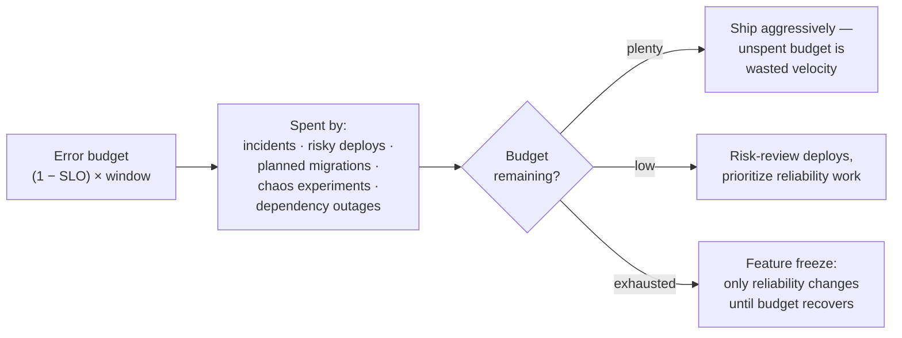

# SLOs and Error Budgets

## TL;DR

An **SLI** is a ratio of good events to total events; an **SLO** is the target that ratio must meet over a window ("99.9% of checkout requests succeed in < 500ms over 30 days"); the **error budget** is the complement — the quantified amount of failure you're *allowed* (0.1% ≈ 43 minutes per month) — and it converts reliability from an argument into a spendable resource: budget left, ship faster; budget burned, stabilize. Alert on **burn rate** (how fast the budget is being consumed) with multi-window rules instead of static thresholds, define SLOs per *user journey* rather than per microservice, and write the budget policy down before you need it. The failure mode is SLO theater: targets nobody enforces, measured where users aren't.

---

## SLIs: Measure What Users Experience

The SLI form that scales is a **ratio**: `good events / valid events`, expressed over a window. Designing one is three decisions:

**1. What's the event?** A request, a pipeline run, a written record, a session. Prefer events users care about — "checkout completed," not "pod healthy."

**2. What makes it good?** Availability: non-5xx (excluding client errors — a 404 on a bad URL is not your unreliability). Latency: *good = under threshold*, so latency becomes a ratio too — "% of requests < 500ms" — which composes with availability and avoids percentile-of-percentile traps. A useful refinement is two thresholds: 90% < 500ms *and* 99% < 2s, capturing both typical and tail experience.

**3. Where is it measured?** Each point trades fidelity for noise:

| Measurement point | Sees | Blind to | Noise |
|---|---|---|---|
| Client/RUM | True user experience | — | User networks, devices (high) |
| CDN / load balancer logs | Everything that reached you | DNS, client network | Low — **the default choice** |
| Service-side metrics | App behavior | LB failures, conn errors before the app | Low but optimistic |
| Synthetic probes | Full path, controlled | Real payload diversity | Very low; use to *complement* |

Load-balancer logs are the standard primary source: close enough to users, low noise, and they see requests your crashed service never counted ([Metrics & Monitoring](./02-metrics-monitoring.md)).

```promql
# Availability SLI over 30d, from LB metrics
sum(rate(lb_requests_total{route="checkout",code!~"5.."}[30d]))
/
sum(rate(lb_requests_total{route="checkout"}[30d]))

# Latency SLI: fraction of requests under 500ms
sum(rate(lb_request_duration_bucket{route="checkout",le="0.5"}[30d]))
/
sum(rate(lb_request_duration_count{route="checkout"}[30d]))
```

**SLIs for non-request systems.** Pipelines and async work need different shapes: **freshness** (% of windows where data age < X — e.g., "dashboard data < 30min old"), **completeness** (% of expected records that arrived), **correctness** (% of canary records that round-trip intact), and for queues, **time-to-process** as a ratio under threshold ([Data Pipelines](../13-data-pipelines/01-batch-processing.md)). LLM-era systems add quality SLIs — % of responses passing automated evals — same machinery, fuzzier "good" definition ([LLM Infrastructure](../16-llm-systems/05-llm-infrastructure.md)).

---

## SLOs: Choosing Targets

Work backwards from users, forwards from cost:

- **Backwards:** at what failure rate do users notice? Churn? A free dashboard and a payment API have different answers. Your historical performance is the honest starting point — set the first SLO slightly *below* current performance and tighten deliberately, rather than declaring an aspirational 99.99% you've never achieved.
- **Forwards:** each nine multiplies cost. The canonical table:

| Target | Downtime/month | Downtime/year | What it implies |
|---|---|---|---|
| 99% | 7.3 h | 3.65 days | Single region, business-hours ops |
| 99.9% | 43.8 min | 8.77 h | Redundancy, on-call, fast rollback |
| 99.95% | 21.9 min | 4.38 h | Multi-AZ, automated failover |
| 99.99% | 4.4 min | 52.6 min | No human in the recovery loop ([Multi-Region](../06-scaling/09-multi-region-architecture.md)) |
| 99.999% | 26 s | 5.3 min | Carrier-grade; almost nobody actually needs this |

Two structural rules. **SLO per user journey, not per microservice** — users experience checkout, not `cart-service`; 30 services each at 99.9% compound to ~97% for a journey touching all of them. Define 3–7 journey SLOs; let teams derive internal service targets *from* them (each dependency needs to be roughly 10× better than the journey target it serves). **Your SLO is capped by your dependencies** — promising 99.99% on top of a 99.9% database is fiction; either architect around the dependency or lower the promise.

And never promise 100%, including implicitly: a 100% target means any single error is an incident, no budget exists for change, and the rational engineering response is to stop deploying. SLO < 100% is what makes velocity *negotiated* instead of fought over. (External **SLAs** — contracts with refunds — sit looser than internal SLOs: you alert and act on the SLO so customers never see the SLA breached.)

---

## Error Budgets: Reliability as a Currency

Budget = `(1 − SLO) × volume over the window`. At 99.9% and 10M requests/month: 10,000 allowed failures. The budget reframes every reliability conversation:



**The budget policy is the point.** An SLO without agreed consequences is a dashboard. Write down, with engineering and product sign-off, *before* the first breach: what happens at 50% consumed (risk review), 100% (feature freeze, postmortems mandatory), who can grant exceptions, and what window resets it (rolling 30d means the freeze lifts gradually — preferable to calendar cliffs). Symmetrically: a team that *never* spends its budget is over-investing in reliability or under-shipping — unspent budget funds chaos drills, dependency upgrades, and region-evacuation tests.

---

## Burn-Rate Alerting

The wrong way to alert on SLOs: page when the 30-day SLI dips below target — by then the budget's gone and the page is a postmortem invitation. The right way: alert on **burn rate** — the multiple of sustainable consumption. Burn rate 1 spends exactly the budget over the window; burn rate 14.4 exhausts a 30-day budget in 2 days.

The multi-window, multi-burn-rate recipe (SRE Workbook) balances speed against flap:

| Severity | Burn rate | Long window | Short window | Budget gone in |
|---|---|---|---|---|
| Page | 14.4× | 1 h | 5 min | ~2 days |
| Page | 6× | 6 h | 30 min | ~5 days |
| Ticket | 1× | 3 d | 6 h | 30 days |

The short window stops alerting once the bleeding stops (no stale pages); the long window stops one bad minute from paging (no flaps):

```promql
# Page: 14.4x burn over 1h, still burning over 5m  (SLO 99.9 → error budget 0.001)
(
  1 - (sum(rate(req_total{route="checkout",code!~"5.."}[1h]))
       / sum(rate(req_total{route="checkout"}[1h])))
) > 14.4 * 0.001
and
(
  1 - (sum(rate(req_total{route="checkout",code!~"5.."}[5m]))
       / sum(rate(req_total{route="checkout"}[5m])))
) > 14.4 * 0.001
```

This typically replaces a zoo of per-symptom threshold alerts ("CPU > 80%", "error rate > 1%") with a handful of pages that, by construction, fire only when users are measurably hurt — cause-based dashboards stay for diagnosis, symptom-based SLO alerts decide *whether anyone wakes up* ([Alerting](./04-alerting.md)). Tools like Sloth and Pyrra generate these rule sets from a declarative SLO spec; OpenSLO offers a vendor-neutral format worth adopting before dashboards sprawl.

---

## Rollout and Anti-Patterns

A working adoption sequence: (1) pick the 2–3 journeys that define the product; (2) measure SLIs for a month *without* targets — learn your baseline; (3) set SLOs at slightly-below-baseline and wire burn-rate alerts; (4) adopt the budget policy with product sign-off; (5) review SLOs quarterly — targets follow user expectations, which move; (6) only then expand to internal services that the journey SLOs justify.

Failure modes to expect:

- **SLO theater** — targets exist, nothing changes when they breach. Root cause: no budget policy, or no product buy-in. An SLO without teeth is worse than none; it teaches the org that reliability numbers are decorative.
- **Per-service sprawl** — 200 SLOs, all green, users unhappy. Journeys first.
- **Gaming the SLI** — excluding inconvenient traffic, measuring after the LB drops, marking degraded responses "good." The SLI definition belongs in code review and audit scope.
- **Mean-based or uptime-based SLIs** — "the service was up" while serving 30s latency is the classic lie; ratios of good *events* don't have that gap.
- **Inherited 99.99%** — a target copied from a bigger company's blog, with none of the architecture it requires. The table above is a bill; check you intend to pay it.

---

## References

- [SRE Book, ch. 4: Service Level Objectives](https://sre.google/sre-book/service-level-objectives/) — the canon
- [SRE Workbook, ch. 2 & 5](https://sre.google/workbook/implementing-slos/) — implementing SLOs; multi-window multi-burn-rate alerting
- [OpenSLO](https://openslo.com/) — declarative SLO specification
- [Sloth](https://sloth.dev/) / [Pyrra](https://github.com/pyrra-dev/pyrra) — Prometheus SLO/burn-rate rule generators
- [Implementing Service Level Objectives](https://www.oreilly.com/library/view/implementing-service-level/9781492076803/) — Hidalgo; the book-length practitioner treatment
