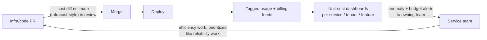

# FinOps and Cost Engineering

## TL;DR

Cloud moved infrastructure spend from a procurement decision to an engineering decision made implicitly, thousands of times a day, by whoever writes the code — FinOps is the discipline of making those decisions visible and deliberate. The practice: measure **unit economics** (cost per request, per tenant, per feature) rather than staring at the total bill; **allocate** spend via enforced tagging so every dollar has an owner; attack the levers in efficiency order — turn it off, right-size, tier the storage, mind the egress, *then* rate-optimize with commitments and spot; and wire cost into the engineering loop the way you wired latency: cost-diff estimates on infrastructure PRs, anomaly alerts within hours not at month-end, and per-tenant attribution feeding pricing decisions. Cost is just another operational signal — treat it with the same machinery as [SLOs](./05-slos-error-budgets.md), and remember the goal is not minimal spend but maximal *margin*: unspent efficiency, like unspent error budget, is wasted velocity.

---

## Unit Economics Beat Bill Watching

A monthly bill of $480K is uninterpretable — terrifying when revenue is flat, excellent when usage tripled. The signal lives in ratios:

```
unit cost   = spend attributable to a workload / units of value it produced
            = $ / 1K requests · $ / active tenant · $ / GB ingested ·
              $ / model training run · $ / 1M tokens served
```

Unit costs separate **growth** (bill up, unit cost flat — fine, that's success) from **regression** (unit cost up — something got less efficient) and make engineering trade-offs commensurable: "this cache tier costs $8K/month and cuts cost-per-request 22% while halving p99" is a sentence both finance and engineering can evaluate ([Caching](../04-caching/01-cache-strategies.md) decisions are FinOps decisions). Pick 3–5 unit metrics that mirror your [journey-level SLOs](./05-slos-error-budgets.md), trend them per service, and alert on their derivative.

### Allocation: every dollar needs an owner

Unit economics require knowing *which* spend belongs to *which* workload — the unglamorous foundation:

- **Tag at creation, enforce in CI:** team, service, environment, tenant-tier on every resource, validated by IaC policy (untagged = blocked at plan time, not lamented at month-end). [GitOps](../15-deployment/04-cicd-gitops.md) makes this enforceable because all resources flow through reviewed code.
- **Shared platforms need metering:** Kubernetes clusters, data platforms, and internal ML serving are one line on the bill but many consumers — allocate by *requested* resources (requests reserve capacity whether used or not; OpenCost-style allocation), and meter multi-tenant services per tenant (the same [tenant-tagged metrics](../06-scaling/12-multi-tenancy.md) you built for noisy-neighbor analysis double as the cost meter; whale-tenant gross margin is a number your pricing team needs).
- **Accept imperfection structurally:** shared costs (NAT, observability, support plans) get a published split rule (proportional to direct spend is fine). An 85%-allocated bill with clear ownership beats a 100%-allocated one nobody trusts.
- **Mind the feedback latency:** billing data lags hours-to-a-day; anomaly detection on *provider cost APIs + your own usage metrics* catches the runaway training job today instead of on the invoice ([Alerting](./04-alerting.md): cost anomalies page the owning team, scaled by burn rate — a 10×-normal hourly burn is an incident).

---

## The Levers, In Order

Efficiency before rates: optimizing the price of waste is still waste.

| # | Lever | Mechanism | Typical impact |
|---|---|---|---|
| 1 | **Turn it off** | Idle dev/staging nights+weekends, zombie resources (unattached volumes, idle LBs, forgotten snapshots), scale-to-zero for spiky internal tools | 10–30% of many bills is *nothing* |
| 2 | **Right-size** | Fit instances/requests to observed p95 usage, not founding-era guesses; one size class down ≈ −30–50% on that fleet | Continuous, automatable |
| 3 | **Storage lifecycle** | Hot → infrequent → archive policies; snapshot/log retention limits; compress + columnar ([Parquet](../13-data-pipelines/05-lakehouse-table-formats.md)) | Storage grows monotonically unless told otherwise |
| 4 | **Egress & topology** | Cross-AZ and cross-region traffic, NAT processing, internet egress — the silent line items. Co-locate chatty services; cache at the edge ([CDN](../06-scaling/04-cdn-architecture.md)); move compute to data, not data to compute | Often the most shocking audit finding |
| 5 | **Commitments** | Reserved/savings plans for the measured baseline (~60–80% coverage; review quarterly) | −30–60% on committed compute, zero code changes |
| 6 | **Spot/preemptible** | Interruption-tolerant work: batch, CI, stateless fleets with headroom, training with checkpoints — i.e., workloads you already made [idempotent and resumable](../01-foundations/08-idempotency.md) | −60–90% on eligible compute |
| 7 | **Architecture** | Tiered tenancy ([pool the long tail](../06-scaling/12-multi-tenancy.md)), batch over per-event processing where latency allows, async over sync chains, ARM/efficiency silicon | The compounding, slow lever |

Two notes on the table. **Commitments are a forecasting bet** — commit to the floor you're sure of, cover spikes on-demand/spot; over-commitment converts the discount into lock-in. **Spot is an architecture test**: if interruption with a 2-minute warning breaks the workload, that fragility was already a reliability bug ([Retries](../06-scaling/10-retries-timeouts-hedging.md), checkpointing) that spot merely prices.

### The LLM-era addendum

Token spend is the fastest-growing line on many 2026 bills, and it behaves like a utility: **cost per solved task** is the unit metric ([LLM Evaluation](../17-llm-systems/10-llm-evaluation.md)), and the levers have their own ranking — prompt-cache hit rate first, model tiering second, batch-tier routing for async work, output-length discipline, then provider negotiation ([LLM Infrastructure](../17-llm-systems/05-llm-infrastructure.md) and [Harness Engineering](../17-llm-systems/09-harness-engineering.md) cover the mechanics). The FinOps Foundation's scope extension to SaaS/AI spend reflects the same shift: the bill you can engineer is no longer only the IaaS bill.

---

## Wiring Cost Into the Engineering Loop

The cultural failure mode is cost-as-quarterly-cleanup: a heroic audit, 25% savings, regrowth within two quarters. The fix is the same as for quality and reliability — move the signal to where decisions happen:



- **Cost-diff on PRs:** infrastructure changes show their monthly delta in review, exactly like a bundle-size or coverage check. A reviewer who sees "+$4,200/mo" asks questions a month-end report never provokes.
- **Budgets as SLOs:** each service gets a unit-cost target and an absolute guardrail; breaches open tickets through the normal incident/error-budget machinery, not a finance email thread. (And symmetrically — chronically *under* target with slipping latency SLOs means you over-optimized; spend it.)
- **Showback before chargeback:** publish per-team dashboards first (visibility changes behavior on its own); move to internal billing only where incentives genuinely need teeth — chargeback wars over allocation rules can cost more attention than they save money.
- **Forecast architecture, not just trends:** the big cost events are step functions — a new feature, a tenant 10× the median, a region addition ([multi-region](../06-scaling/09-multi-region-architecture.md) roughly doubles infrastructure as a *planned* line item, not a surprise).
- **Make the efficient path the default path:** golden IaC modules with lifecycle policies, autoscaling, and right-sized defaults baked in beat any amount of after-the-fact policing — platform engineering is where FinOps compounds.

---

## Checklist

- [ ] 3–5 unit-cost metrics defined, trended per service, alerted on derivative
- [ ] Tagging enforced at IaC plan time; shared platforms metered (K8s by requests, multi-tenant services by tenant)
- [ ] Cost anomaly detection on hours-latency data, paging the owning team
- [ ] Idle/zombie sweep automated; right-sizing recommendations applied on a cadence
- [ ] Storage lifecycle + retention policies on every bucket, log group, and snapshot chain
- [ ] Egress/cross-AZ topology reviewed; chatty services co-located
- [ ] Commitments cover the measured baseline only; coverage reviewed quarterly
- [ ] Spot adopted for interruption-tolerant tiers (and the interruption-tolerance actually tested)
- [ ] Cost-diff visible on infra PRs; unit-cost budgets wired to the incident process
- [ ] Per-tenant cost attribution feeding pricing/margin decisions; LLM cost-per-solved-task tracked

---

## References

- [FinOps Foundation Framework](https://www.finops.org/framework/) — phases (inform/optimize/operate), personas, and the FOCUS billing-data standard
- [AWS Well-Architected: Cost Optimization Pillar](https://docs.aws.amazon.com/wellarchitected/latest/cost-optimization-pillar/welcome.html) — the lever catalog, provider-flavored
- [The Frugal Architect](https://thefrugalarchitect.com/) — Werner Vogels; cost as a nonfunctional requirement
- [OpenCost](https://opencost.io/) — Kubernetes cost allocation (the requests-vs-usage model)
- [Infracost](https://www.infracost.io/) — cost diffs in pull requests
