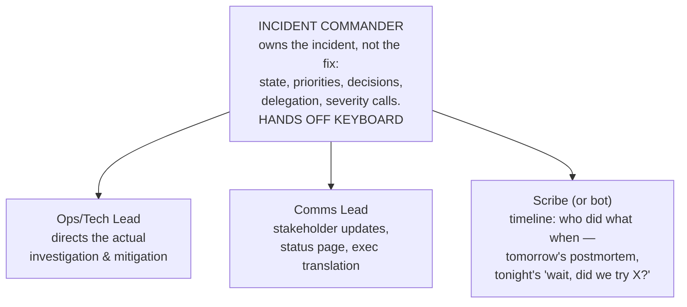

# Incident Management and Postmortems

## TL;DR

Incidents are not interruptions to the system — they *are* the system, operating in its other mode, and the response is something you design in calm and execute under adrenaline. The load-bearing pieces: a **severity matrix** everyone can apply in ten seconds (declare early, downgrade cheaply); **roles** that separate coordination from debugging — an Incident Commander who explicitly does *not* touch keyboards; a **mitigate-first doctrine** (rollback, flags off, shed load, fail over — stop the bleeding *before* understanding the wound); a **communication cadence** that buys engineers quiet by giving stakeholders predictability; and **blameless postmortems** whose output is tracked engineering work, not a document — because an action-item graveyard converts incidents from tuition into pure loss. On-call is the chronic counterpart: alert quality, pager-load budgets, and drills are what make the acute machinery work at 3 a.m. This article is the human half of [SLOs and error budgets](./05-slos-error-budgets.md); the machinery half without it is theater.

---

## Severity: Decide in Ten Seconds

The severity matrix exists to remove a decision from the worst possible moment. Make it crude and unambiguous:

| Sev | Criteria (any one suffices) | Response |
|---|---|---|
| **SEV1** | Core user journey down or [error budget](./05-slos-error-budgets.md) burning ≥ 14× · data loss/corruption suspected · security breach · revenue stopped | Page IC + responders now, 24/7. Exec comms. All-hands-on-deck allowed |
| **SEV2** | Journey degraded for many users · burn ≥ 6× · a region down with failover holding | Page on-call now. IC assigned. Status page if user-visible |
| **SEV3** | Minor degradation, workaround exists · single-tenant impact · redundancy lost (one more failure = SEV1) | Business hours. Ticket + owner |
| **SEV4** | Cosmetic, internal-only | Backlog |

Three rules that matter more than the table's exact contents: **declare early** — a false SEV2 costs twenty minutes of two people's time; a late one costs the outage's whole left tail (make "I'm declaring an incident" a celebrated act, never a punished one). **Downgrading is free and normal.** And **severity is impact, not effort** — a one-line config fix for a site-down is still a SEV1; tie the thresholds to your SLO burn rates so "is this an incident?" has a numerical answer.

## Roles: Coordination Is a Job, Not a Side Effect

Past ~30 minutes or ~3 responders, the hero model fails: the person deepest in the debugging is also fielding "any update?" pings, deciding on comms, and forgetting to try the rollback. Split it:

- **The IC coordinates and decides; they do not debug.** The moment the IC starts reading logs, nobody is running the incident. In small teams the same person may hold multiple hats — the point is the hats *exist* and are explicitly assigned ("I have IC").
- **One incident channel, one source of truth.** Decisions, state changes, and attempted actions go in-channel (the scribe/bot captures them); side-channel debugging is where mitigations get attempted twice and contradictory changes collide.
- **Handoffs are formal.** Long incidents rotate people (cognition degrades hard after a few hours); a handoff is a written summary — current state, what's tried, what's pending — not "you're up."
- Escalation is the IC's tool, not a failure: pulling in the database team or waking a director is a routine move with a low bar.

## Mitigate First, Diagnose Second

The instinct under pressure is to *understand* the problem. The discipline is to **make it stop hurting**, then understand at leisure. Keep a generic-mitigations list that responders try before they know the cause:

1. **Roll back the last change** — deploys, configs, flags ([the one-action rollback](../15-deployment/04-cicd-gitops.md) you drilled). The majority of incidents are change-induced; the timeline question "what changed in the last hour?" earns its keep.
2. **Flip the kill switches** — feature [flags](../15-deployment/02-feature-flags.md), the [retry kill switch](../06-scaling/10-retries-timeouts-hedging.md), expensive-feature degradation modes.
3. **Shed load / engage brownout** — protect the core journey by sacrificing the periphery ([rate limiting](../06-scaling/05-rate-limiting.md), [backpressure](../06-scaling/07-backpressure.md)).
4. **Fail over** — instance, AZ, [region](../06-scaling/09-multi-region-architecture.md) — per the drilled runbook.
5. **Scale up/out** — if the shape looks like capacity, buy time with hardware while you think ([the utilization curve](../01-foundations/10-capacity-planning.md) explains why a small overload looks like a catastrophe).

Two cautions wired into the doctrine: **don't destroy forensics** (snapshot a sick node before rebooting it if you can do so in seconds — but never let evidence-preservation outrank users) and **beware the second incident** — hasty mitigations under pressure (mass restarts, cache flushes that cause [stampedes](../04-caching/04-cache-stampede.md), failovers into under-provisioned capacity) cause a large share of compound outages. The runbook's job is to make the safe version of each mitigation the easy one.

## Communication: Predictability Buys Quiet

Uncommunicated incidents generate their own meta-incident: executives pinging engineers, support improvising answers, customers discovering it on social media first.

- **Cadence over content.** "Next update at :30" — and deliver *something* at :30 even if it's "still investigating, two leads." A reliable rhythm stops the pinging; a missed update restarts it.
- **Two audiences, two languages.** Internal: precise, technical, blame-free shorthand. External/status page: impact in user terms ("uploads failing for ~20% of users since 14:05 UTC"), what you're doing, when you'll update next — no root-cause speculation you'll retract later. Honest status pages compound trust; "all systems operational" during a visible outage compounds the opposite.
- **Templates beat improvisation.** Declaration, update, resolution, and "we're aware" macros, pre-written in calm. The comms lead fills blanks instead of drafting prose at 3 a.m.

## Postmortems: Where the Incident Pays Rent

The incident already cost you; the postmortem is how you collect. The cultural keystone is **blamelessness** — not as kindness, but as epistemics: people acted reasonably given what they knew (*local rationality*), so "why did Alice run that command?" is a dead end, while "why did the system make that command look safe, and the unsafe state invisible?" produces engineering. The moment postmortems assign blame, your incident reports become fiction, because self-preservation edits memory.

A postmortem that earns its meeting:

- **Timeline** (from the scribe/bot): detection → declaration → mitigation attempts → resolution, with timestamps. The gaps *are* the findings — 40 minutes between alert and declaration is an action item; so is "mitigation known at :15, executed at :55 awaiting an approval."
- **Impact in user and budget terms:** users affected, duration, requests failed, [error budget consumed](./05-slos-error-budgets.md), revenue if estimable. This is what calibrates severity thresholds and justifies the fixes.
- **Contributing factors, plural** — complex systems fail through aligned weaknesses, not single root causes. "Root cause: human error" is a banned phrase; the template should ask *what made the error possible, likely, and high-blast-radius*.
- **What went well / where we got lucky.** The luck list is the hidden gold: "the one engineer who knew the system happened to be awake" is a SEV1 scheduled for later.
- **Action items with owners, deadlines, and a tracking review.** This is where most programs die: the action-item graveyard. Counter-measures: cap items (3–5 that will actually happen beats 20 that won't), put them in the normal sprint process (not a side list), tag them to the error-budget policy (repeat incidents with unshipped action items = freeze justification), and review completion monthly as a first-class metric.
- **Share widely, store searchably.** A postmortem only read by its authors taught one team; the repository of them is the org's actual reliability curriculum — and the best onboarding reading you own.

## The Chronic Side: On-Call and Practice

The acute machinery assumes humans who are rested, practiced, and paged only for real things:

- **Alert quality is a standing review.** Every page maps to an SLO-relevant symptom and a runbook; every *un*actionable page gets deleted or demoted at a weekly review ([burn-rate alerting](./05-slos-error-budgets.md) did most of this structurally). Pager fatigue is how real SEV1s get slept through.
- **Pager load is a budgeted metric** — pages per shift tracked and bounded; sustained overage is an engineering-priorities problem, not a stamina problem. Rotations need enough people that on-call is sustainable (6–8 per rotation as a floor), with handoff notes between shifts.
- **Practice before it's real:** game days and chaos drills exercise the *systems* ([DR](../15-deployment/05-disaster-recovery.md)); **Wheel-of-Misfortune** exercises — replaying past incidents as tabletop scenarios with a junior responder driving — exercise the *people*. New on-callers shadow before they solo. The first time someone plays IC should not be a SEV1.
- **Production readiness reviews** close the loop forward: before a service ships, it demonstrates the checklist this article assumes — runbooks, dashboards, alerts wired to SLOs, rollback drilled, on-call assigned. Incidents are cheaper to prevent at review time than to manage at 3 a.m.

### Metrics that keep the program honest

Decompose MTTR — the aggregate hides everything: **time to detect** (monitoring quality), **time to declare** (culture), **time to mitigate** (the number that matters most — runbooks, kill switches, rollback speed), time to resolve. Track incident *frequency by contributing-factor class* (change-induced? capacity? dependency? — tells you where to invest), action-item completion rate, and pages-per-shift. Be suspicious of incentivizing "fewer incidents declared" — you'll get exactly that, and it will be a reporting change, not a reliability change.

---

## Checklist

- [ ] Severity matrix published, tied to SLO burn rates; declaring is one command/button and socially rewarded
- [ ] IC/ops/comms/scribe roles defined; IC-doesn't-debug is enforced; handoffs are written
- [ ] Generic mitigation list + kill switches exist and are drilled; rollback is one action
- [ ] Comms cadence + templates for internal and status page; honesty as policy
- [ ] Postmortems: blameless template, contributing-factors framing, luck list, ≤5 tracked action items in the sprint process, monthly completion review
- [ ] Alert review weekly; pager load budgeted; rotations sized humanely
- [ ] Wheel of Misfortune / game days on the calendar; new on-callers shadow first; PRR gate for new services
- [ ] MTTD/declare/mitigate decomposed and trended; incident classes drive investment

---

## References

- [Google SRE Book, ch. 12–15](https://sre.google/sre-book/effective-troubleshooting/) — emergency response, managing incidents, and the postmortem-culture chapter
- [SRE Workbook: Incident Response](https://sre.google/workbook/incident-response/) — the IC system worked through real examples
- [PagerDuty Incident Response Guide](https://response.pagerduty.com/) — the most complete public runbook for roles and comms, open-sourced
- [Blameless PostMortems and a Just Culture](https://www.etsy.com/codeascraft/blameless-postmortems/) — Allspaw; the founding argument
- [Howie: The Post-Incident Guide](https://www.jeli.io/howie/welcome) — modern incident-analysis practice beyond the template
- [incident.io's Incident Management Guide](https://incident.io/guide) — pragmatic, current operational detail
