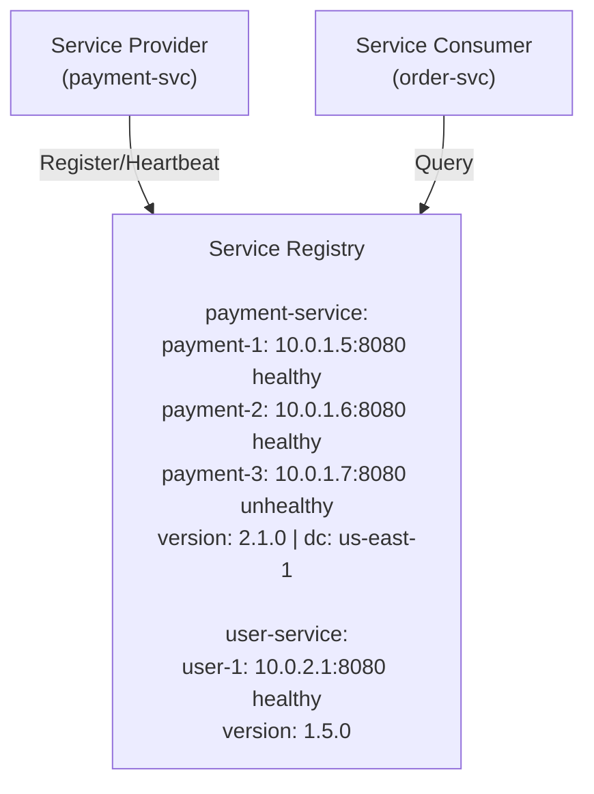
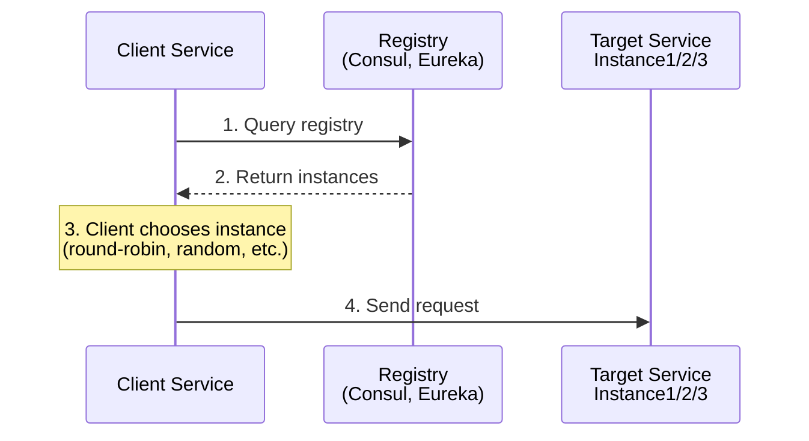
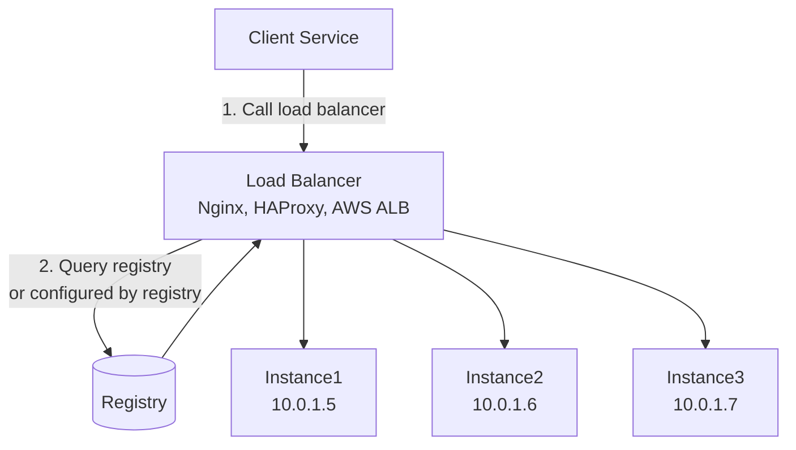
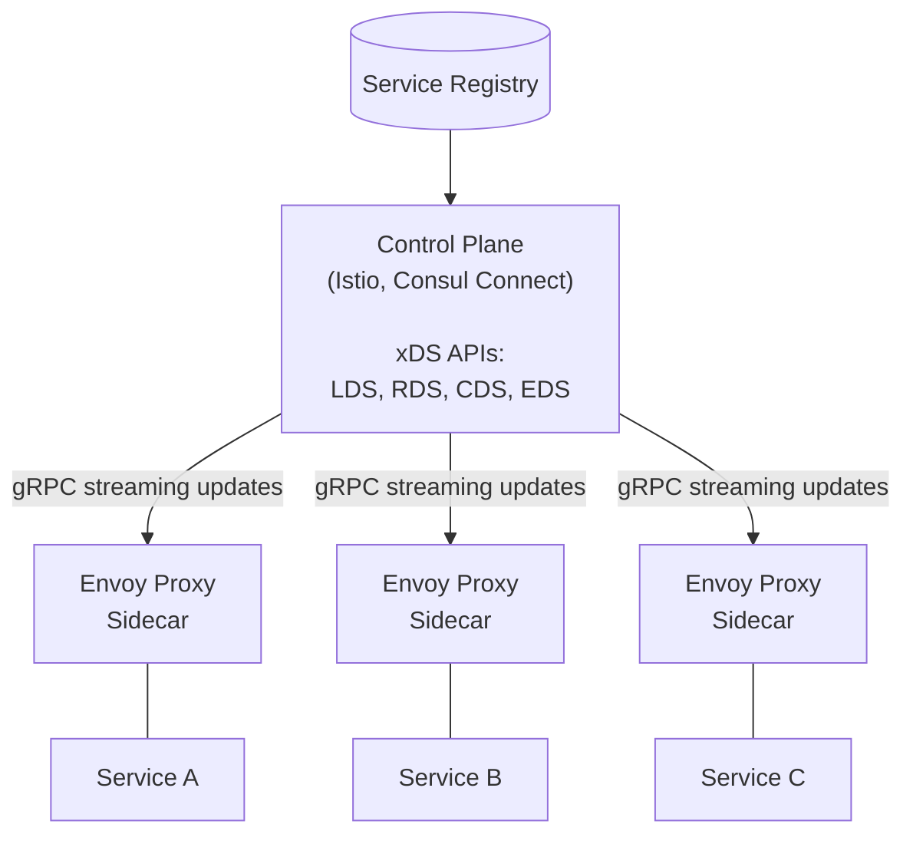

# Service Discovery

## TL;DR

Service discovery enables services to find and communicate with each other in dynamic environments where instances come and go. It replaces hardcoded IP addresses with a registry that tracks service locations. Two patterns dominate: client-side discovery (client queries registry) and server-side discovery (load balancer queries registry).

---

## The Problem Service Discovery Solves

### Static Configuration Doesn't Scale

```
Traditional approach:
┌─────────────────────────────────────────────────────┐
│  application.yml                                    │
│                                                     │
│  payment-service:                                   │
│    host: 10.0.1.5                                   │
│    port: 8080                                       │
│                                                     │
│  user-service:                                      │
│    host: 10.0.1.6                                   │
│    port: 8080                                       │
└─────────────────────────────────────────────────────┘

Problems:
- What if 10.0.1.5 goes down?
- What if we add a second payment-service instance?
- What if IPs change after restart?
- How do we update 50 services that depend on payment-service?
```

### Dynamic Environment Reality

```
In containers/cloud:
- Instances are ephemeral
- IPs assigned dynamically
- Scaling changes instance count
- Failures happen constantly

Monday 9:00 AM:
  payment-service: 10.0.1.5, 10.0.1.6 (2 instances)

Monday 9:15 AM (traffic spike, scale up):
  payment-service: 10.0.1.5, 10.0.1.6, 10.0.1.7, 10.0.1.8 (4 instances)

Monday 9:20 AM (instance fails):
  payment-service: 10.0.1.5, 10.0.1.7, 10.0.1.8 (3 instances, 10.0.1.6 gone)

Monday 10:00 AM (scale down):
  payment-service: 10.0.1.9 (1 new instance, all previous IPs gone!)
```

---

## Service Discovery Components



### Registration

```python
# Service registers itself on startup
class ServiceRegistration:
    def __init__(self, registry_client, service_config):
        self.registry = registry_client
        self.config = service_config
    
    def register(self):
        instance = ServiceInstance(
            service_id=self.config.service_name,
            instance_id=f"{self.config.service_name}-{uuid.uuid4()}",
            host=self.get_host(),
            port=self.config.port,
            metadata={
                'version': self.config.version,
                'datacenter': self.config.datacenter
            }
        )
        self.registry.register(instance)
        
        # Start heartbeat
        self.start_heartbeat(instance)
    
    def start_heartbeat(self, instance):
        """Send periodic heartbeats to maintain registration"""
        def heartbeat():
            while True:
                try:
                    self.registry.heartbeat(instance.instance_id)
                except Exception as e:
                    logger.error(f"Heartbeat failed: {e}")
                time.sleep(10)  # Every 10 seconds
        
        threading.Thread(target=heartbeat, daemon=True).start()
    
    def deregister(self):
        """Clean deregistration on shutdown"""
        self.registry.deregister(self.instance_id)
```

### Health Checking

```python
class HealthChecker:
    """Registry periodically checks instance health"""
    
    def check_instance(self, instance):
        try:
            response = requests.get(
                f"http://{instance.host}:{instance.port}/health",
                timeout=5
            )
            return response.status_code == 200
        except Exception:
            return False
    
    def run_health_checks(self):
        for service in self.registry.get_all_services():
            for instance in service.instances:
                healthy = self.check_instance(instance)
                
                if healthy:
                    instance.consecutive_failures = 0
                    instance.status = 'healthy'
                else:
                    instance.consecutive_failures += 1
                    
                    if instance.consecutive_failures >= 3:
                        instance.status = 'unhealthy'
                        # Remove from active instances
                        self.registry.mark_unhealthy(instance)
```

---

## Client-Side Discovery

Client queries registry and performs load balancing itself.



### Implementation

```python
class ClientSideDiscovery:
    def __init__(self, registry_client):
        self.registry = registry_client
        self.cache = {}
        self.cache_ttl = 30  # seconds
    
    def get_instance(self, service_name: str) -> ServiceInstance:
        instances = self.get_instances(service_name)
        if not instances:
            raise NoInstancesAvailable(service_name)
        
        # Round-robin load balancing
        return self.round_robin(service_name, instances)
    
    def get_instances(self, service_name: str) -> List[ServiceInstance]:
        # Check cache first
        cached = self.cache.get(service_name)
        if cached and cached['expires'] > time.time():
            return cached['instances']
        
        # Query registry
        instances = self.registry.get_instances(service_name)
        
        # Update cache
        self.cache[service_name] = {
            'instances': instances,
            'expires': time.time() + self.cache_ttl
        }
        
        return instances
    
    def round_robin(self, service_name: str, instances: List) -> ServiceInstance:
        if not hasattr(self, '_rr_index'):
            self._rr_index = {}
        
        index = self._rr_index.get(service_name, 0)
        instance = instances[index % len(instances)]
        self._rr_index[service_name] = index + 1
        
        return instance

# Usage
discovery = ClientSideDiscovery(consul_client)

def call_payment_service(order):
    instance = discovery.get_instance('payment-service')
    url = f"http://{instance.host}:{instance.port}/api/charge"
    return requests.post(url, json=order)
```

### Pros and Cons

```
Pros:
✓ Client has full control over load balancing
✓ Can implement sophisticated routing (sticky sessions, weighted)
✓ No extra hop through proxy
✓ Client can cache and handle failures

Cons:
✗ Load balancing logic in every client
✗ Must implement in every language
✗ Tight coupling to discovery mechanism
✗ More complex clients
```

---

## Server-Side Discovery

Load balancer queries registry; clients just call load balancer.



### Kubernetes Service Discovery

```yaml
# Kubernetes handles server-side discovery natively
apiVersion: v1
kind: Service
metadata:
  name: payment-service
spec:
  selector:
    app: payment
  ports:
    - port: 80
      targetPort: 8080
---
# Pods that match selector are automatically registered
apiVersion: apps/v1
kind: Deployment
metadata:
  name: payment
spec:
  replicas: 3
  selector:
    matchLabels:
      app: payment
  template:
    metadata:
      labels:
        app: payment
    spec:
      containers:
        - name: payment
          image: payment:latest
          ports:
            - containerPort: 8080
```

```python
# Client code is simple - just use the service name
import requests

def call_payment():
    # Kubernetes DNS resolves 'payment-service' to cluster IP
    # kube-proxy handles load balancing to pods
    response = requests.post(
        'http://payment-service/api/charge',
        json=data
    )
    return response
```

### Pros and Cons

```
Pros:
✓ Simple clients (just HTTP to known endpoint)
✓ Language agnostic
✓ Centralized load balancing logic
✓ Can add features (TLS termination, caching)

Cons:
✗ Additional network hop
✗ Load balancer is potential bottleneck
✗ Must be highly available
✗ Less flexible routing per-client
```

---

## DNS-Based Discovery

### Basic DNS Discovery

```
Traditional DNS:
payment-service.internal.company.com → 10.0.1.5

Problems:
- DNS TTL caching delays updates
- Returns single IP (or random from set)
- No health checking
- No metadata

Modern DNS Discovery (SRV records):
_payment._tcp.service.consul SRV 1 1 8080 payment-1.node.dc1.consul
_payment._tcp.service.consul SRV 1 1 8080 payment-2.node.dc1.consul

Includes:
- Priority
- Weight
- Port
- Instance hostname
```

### Consul DNS Interface

```python
import dns.resolver

def discover_via_dns(service_name: str) -> List[ServiceInstance]:
    # Query SRV records
    srv_records = dns.resolver.resolve(
        f'{service_name}.service.consul',
        'SRV'
    )
    
    instances = []
    for record in srv_records:
        # SRV record: priority weight port target
        instances.append(ServiceInstance(
            host=str(record.target).rstrip('.'),
            port=record.port,
            priority=record.priority,
            weight=record.weight
        ))
    
    return instances

# Also can query A records for simpler case
def get_service_ips(service_name: str) -> List[str]:
    a_records = dns.resolver.resolve(
        f'{service_name}.service.consul',
        'A'
    )
    return [str(r) for r in a_records]
```

---

## Service Registries

### Consul

```python
import consul

class ConsulServiceRegistry:
    def __init__(self, host='localhost', port=8500):
        self.consul = consul.Consul(host=host, port=port)
    
    def register(self, service_name: str, service_id: str, 
                 host: str, port: int, tags: List[str] = None):
        self.consul.agent.service.register(
            name=service_name,
            service_id=service_id,
            address=host,
            port=port,
            tags=tags or [],
            check=consul.Check.http(
                f'http://{host}:{port}/health',
                interval='10s',
                timeout='5s',
                deregister='1m'  # Auto-deregister if unhealthy for 1 min
            )
        )
    
    def deregister(self, service_id: str):
        self.consul.agent.service.deregister(service_id)
    
    def get_instances(self, service_name: str) -> List[dict]:
        _, services = self.consul.health.service(
            service_name,
            passing=True  # Only healthy instances
        )
        
        return [
            {
                'id': s['Service']['ID'],
                'host': s['Service']['Address'],
                'port': s['Service']['Port'],
                'tags': s['Service']['Tags']
            }
            for s in services
        ]
    
    def watch_service(self, service_name: str, callback):
        """Watch for changes to service instances"""
        index = None
        while True:
            index, services = self.consul.health.service(
                service_name,
                passing=True,
                index=index,  # Long poll - blocks until change
                wait='5m'
            )
            callback(services)
```

### Netflix Eureka

```python
import py_eureka_client.eureka_client as eureka_client

# Register service
eureka_client.init(
    eureka_server="http://eureka-server:8761/eureka",
    app_name="payment-service",
    instance_port=8080,
    instance_host="10.0.1.5"
)

# Discover services
def get_instances(service_name: str):
    app = eureka_client.get_application(service_name)
    return [
        {'host': instance.ipAddr, 'port': instance.port.port}
        for instance in app.instances
        if instance.status == 'UP'
    ]
```

### etcd

```python
import etcd3

class EtcdServiceRegistry:
    def __init__(self, host='localhost', port=2379):
        self.etcd = etcd3.client(host=host, port=port)
    
    def register(self, service_name: str, instance_id: str, 
                 host: str, port: int, ttl: int = 30):
        key = f'/services/{service_name}/{instance_id}'
        value = json.dumps({
            'host': host,
            'port': port,
            'registered_at': datetime.utcnow().isoformat()
        })
        
        # Create lease for TTL
        lease = self.etcd.lease(ttl)
        self.etcd.put(key, value, lease=lease)
        
        # Refresh lease periodically
        self._start_keepalive(lease)
    
    def get_instances(self, service_name: str) -> List[dict]:
        prefix = f'/services/{service_name}/'
        instances = []
        
        for value, metadata in self.etcd.get_prefix(prefix):
            instance = json.loads(value.decode())
            instances.append(instance)
        
        return instances
    
    def watch_service(self, service_name: str, callback):
        prefix = f'/services/{service_name}/'
        events_iterator, cancel = self.etcd.watch_prefix(prefix)
        
        for event in events_iterator:
            callback(event)
```

---

## Service Mesh Discovery

### Envoy and xDS



```yaml
# Envoy cluster configuration (from CDS)
clusters:
  - name: payment-service
    type: EDS
    eds_cluster_config:
      eds_config:
        api_config_source:
          api_type: GRPC
          grpc_services:
            - envoy_grpc:
                cluster_name: xds_cluster

# Endpoints (from EDS)
endpoints:
  - cluster_name: payment-service
    endpoints:
      - lb_endpoints:
          - endpoint:
              address:
                socket_address:
                  address: 10.0.1.5
                  port_value: 8080
          - endpoint:
              address:
                socket_address:
                  address: 10.0.1.6
                  port_value: 8080
```

---

## Best Practices

### Health Check Design

```python
@app.route('/health')
def health():
    """Shallow health check - is the process running?"""
    return {'status': 'healthy'}, 200

@app.route('/health/ready')
def readiness():
    """Deep health check - can we serve traffic?"""
    checks = {
        'database': check_database(),
        'cache': check_cache(),
        'dependencies': check_dependencies()
    }
    
    healthy = all(checks.values())
    status_code = 200 if healthy else 503
    
    return {'status': 'ready' if healthy else 'not ready', 'checks': checks}, status_code

@app.route('/health/live')
def liveness():
    """Is the process deadlocked or stuck?"""
    # Quick check, should always pass if process is running normally
    return {'status': 'alive'}, 200
```

### Graceful Shutdown

```python
import signal
import sys

class GracefulShutdown:
    def __init__(self, registry, server):
        self.registry = registry
        self.server = server
        signal.signal(signal.SIGTERM, self.handle_shutdown)
        signal.signal(signal.SIGINT, self.handle_shutdown)
    
    def handle_shutdown(self, signum, frame):
        logger.info("Shutdown signal received")
        
        # 1. Deregister from service registry
        logger.info("Deregistering from service registry")
        self.registry.deregister()
        
        # 2. Stop accepting new connections
        logger.info("Stopping new connections")
        self.server.stop_accepting()
        
        # 3. Wait for in-flight requests to complete
        logger.info("Waiting for in-flight requests")
        time.sleep(10)  # Grace period
        
        # 4. Shutdown
        logger.info("Shutting down")
        sys.exit(0)
```

### Cache Invalidation

```python
class ServiceDiscoveryCache:
    def __init__(self, registry, ttl=30, watch=True):
        self.registry = registry
        self.ttl = ttl
        self.cache = {}
        
        if watch:
            self.start_watch()
    
    def start_watch(self):
        """Watch for changes instead of polling"""
        def watch_loop():
            for service_name in self.cache.keys():
                self.registry.watch_service(
                    service_name,
                    callback=lambda instances: self.update_cache(
                        service_name, instances
                    )
                )
        
        threading.Thread(target=watch_loop, daemon=True).start()
    
    def update_cache(self, service_name, instances):
        self.cache[service_name] = {
            'instances': instances,
            'updated_at': time.time()
        }
```

---

## References

- [Consul Service Discovery](https://www.consul.io/docs/concepts/service-discovery)
- [Kubernetes Service Discovery](https://kubernetes.io/docs/concepts/services-networking/service/)
- [Netflix Eureka](https://github.com/Netflix/eureka/wiki)
- [Envoy xDS Protocol](https://www.envoyproxy.io/docs/envoy/latest/api-docs/xds_protocol)
- [Microservices Patterns - Service Discovery](https://microservices.io/patterns/service-registry.html)
