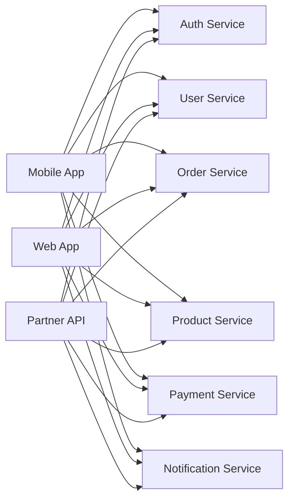
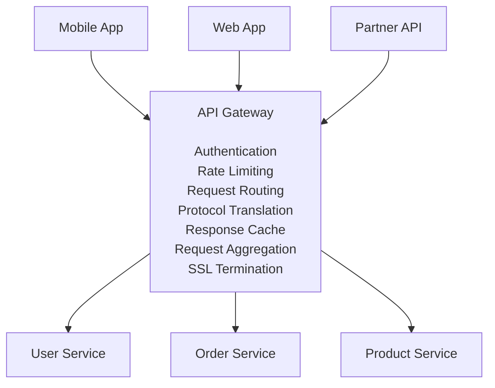
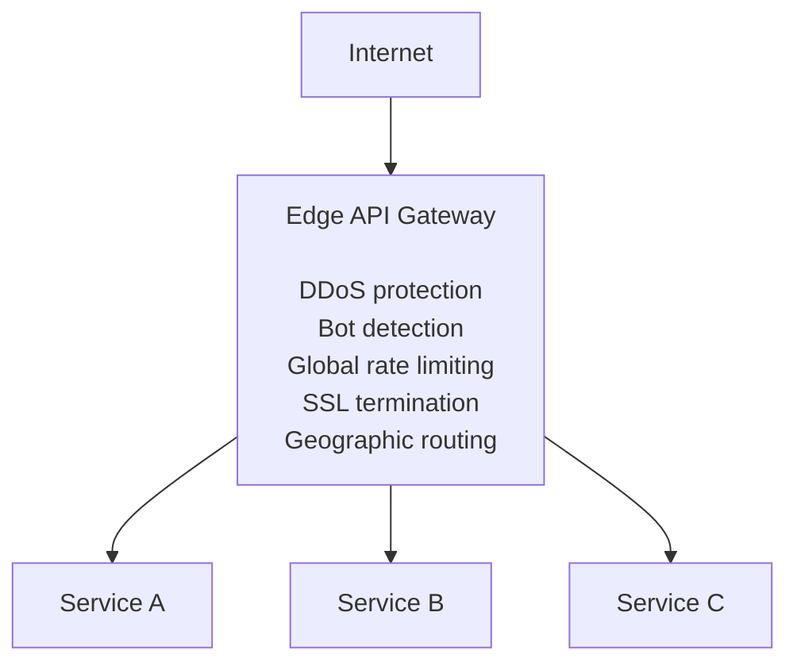
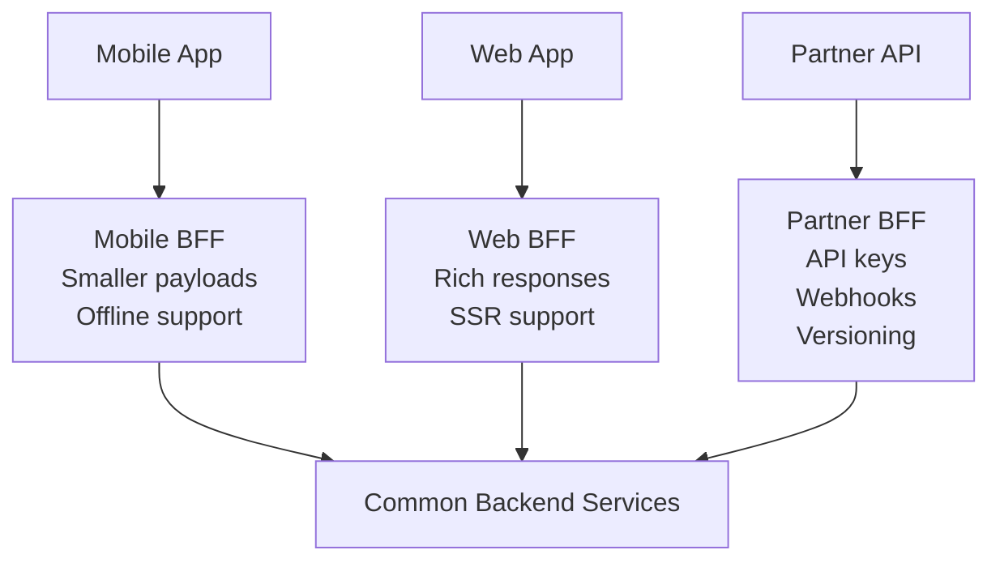
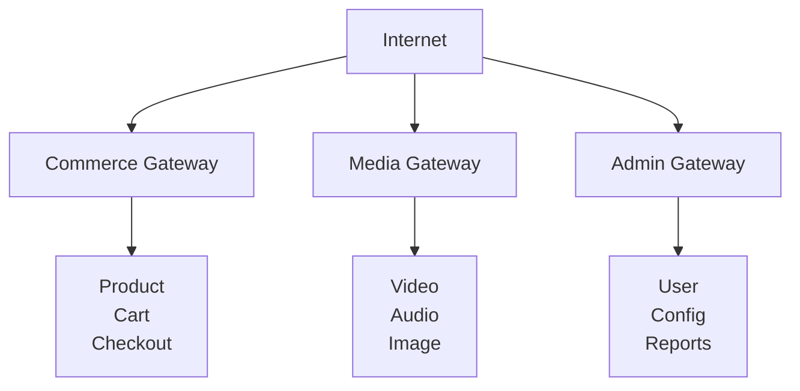

# API Gateway

## TL;DR

An API gateway is a single entry point for all client requests, handling cross-cutting concerns like authentication, rate limiting, and routing. It decouples clients from the internal microservices architecture, enabling independent evolution of both.

---

## The Problem API Gateways Solve

### Without API Gateway



```
Problems:
- Clients know about internal services
- Each service handles authentication
- No central rate limiting
- Chatty clients (many round trips)
- Difficult to change service structure
- CORS, SSL everywhere
```

### With API Gateway



---

## Core Capabilities

### Request Routing

```yaml
# Route configuration
routes:
  - path: /api/v1/users/**
    service: user-service
    methods: [GET, POST, PUT, DELETE]
    
  - path: /api/v1/orders/**
    service: order-service
    methods: [GET, POST]
    
  - path: /api/v1/products/**
    service: product-service
    strip_prefix: /api/v1  # Remove prefix before forwarding
    
  - path: /api/v2/users/**
    service: user-service-v2
    # Version routing
```

```python
class Router:
    def __init__(self, routes_config):
        self.routes = self.compile_routes(routes_config)
    
    def route(self, request):
        for route in self.routes:
            if self.matches(route, request):
                return self.forward(request, route)
        
        return Response(status=404, body={'error': 'Not found'})
    
    def matches(self, route, request):
        # Check path pattern
        if not route.pattern.match(request.path):
            return False
        
        # Check HTTP method
        if request.method not in route.methods:
            return False
        
        # Check headers (e.g., API version)
        if route.headers:
            for header, value in route.headers.items():
                if request.headers.get(header) != value:
                    return False
        
        return True
    
    def forward(self, request, route):
        target_url = self.build_target_url(request, route)
        return self.http_client.request(
            method=request.method,
            url=target_url,
            headers=self.filter_headers(request.headers),
            body=request.body
        )
```

### Authentication and Authorization

```python
class AuthenticationMiddleware:
    def __init__(self, auth_service):
        self.auth_service = auth_service
    
    async def process(self, request, next_handler):
        # Skip auth for public endpoints
        if self.is_public_endpoint(request.path):
            return await next_handler(request)
        
        # Extract token
        token = self.extract_token(request)
        if not token:
            return Response(401, {'error': 'Missing authentication'})
        
        # Validate token
        try:
            user_context = await self.auth_service.validate(token)
        except InvalidToken:
            return Response(401, {'error': 'Invalid token'})
        except ExpiredToken:
            return Response(401, {'error': 'Token expired'})
        
        # Add user context to request
        request.user = user_context
        
        # Check authorization
        if not self.is_authorized(request):
            return Response(403, {'error': 'Forbidden'})
        
        return await next_handler(request)
    
    def extract_token(self, request):
        auth_header = request.headers.get('Authorization', '')
        if auth_header.startswith('Bearer '):
            return auth_header[7:]
        return request.cookies.get('access_token')
    
    def is_authorized(self, request):
        # Check user permissions against route requirements
        required_permissions = self.get_required_permissions(request.path)
        return all(
            perm in request.user.permissions 
            for perm in required_permissions
        )
```

### Rate Limiting

```python
class RateLimitMiddleware:
    def __init__(self, redis, default_limits):
        self.redis = redis
        self.default_limits = default_limits
    
    async def process(self, request, next_handler):
        # Determine rate limit key
        key = self.get_rate_limit_key(request)
        limits = self.get_limits(request)
        
        # Check all applicable limits
        for limit in limits:
            allowed, retry_after = await self.check_limit(key, limit)
            if not allowed:
                return Response(
                    status=429,
                    headers={'Retry-After': str(retry_after)},
                    body={'error': 'Rate limit exceeded'}
                )
        
        # Add rate limit headers to response
        response = await next_handler(request)
        response.headers.update(await self.get_rate_limit_headers(key, limits))
        return response
    
    def get_rate_limit_key(self, request):
        # Different keys for different rate limit scopes
        if request.user:
            return f"user:{request.user.id}"
        elif request.api_key:
            return f"api_key:{request.api_key}"
        else:
            return f"ip:{request.client_ip}"
    
    def get_limits(self, request):
        # Different limits for different endpoints/users
        endpoint_limits = self.endpoint_limits.get(request.path, [])
        user_limits = self.get_user_limits(request.user) if request.user else []
        return endpoint_limits + user_limits + self.default_limits
```

### Request Aggregation (BFF Pattern)

```python
class RequestAggregator:
    """Aggregate multiple backend calls into single response"""
    
    async def get_dashboard(self, user_id: str) -> dict:
        # Parallel requests to multiple services
        user_task = asyncio.create_task(
            self.user_service.get_user(user_id)
        )
        orders_task = asyncio.create_task(
            self.order_service.get_recent_orders(user_id, limit=5)
        )
        notifications_task = asyncio.create_task(
            self.notification_service.get_unread(user_id)
        )
        recommendations_task = asyncio.create_task(
            self.recommendation_service.get_for_user(user_id)
        )
        
        # Wait for all with timeout
        results = await asyncio.gather(
            user_task,
            orders_task,
            notifications_task,
            recommendations_task,
            return_exceptions=True
        )
        
        # Build aggregated response
        user, orders, notifications, recommendations = results
        
        return {
            'user': user if not isinstance(user, Exception) else None,
            'recent_orders': orders if not isinstance(orders, Exception) else [],
            'notifications': notifications if not isinstance(notifications, Exception) else [],
            'recommendations': recommendations if not isinstance(recommendations, Exception) else []
        }
```

### Protocol Translation

```python
class ProtocolTranslator:
    """Translate between protocols (REST, gRPC, GraphQL)"""
    
    async def rest_to_grpc(self, request):
        # Convert REST request to gRPC
        grpc_request = self.build_grpc_request(
            request.path,
            request.method,
            request.body
        )
        
        # Call gRPC service
        response = await self.grpc_client.call(
            service=grpc_request.service,
            method=grpc_request.method,
            message=grpc_request.message
        )
        
        # Convert gRPC response to REST
        return self.grpc_to_rest_response(response)
    
    async def graphql_to_rest(self, graphql_query):
        # Parse GraphQL query
        parsed = parse_graphql(graphql_query)
        
        # Execute against REST backends
        results = {}
        for selection in parsed.selections:
            if selection.name == 'user':
                results['user'] = await self.user_service.get(
                    selection.arguments.get('id')
                )
            elif selection.name == 'orders':
                results['orders'] = await self.order_service.list(
                    user_id=selection.arguments.get('userId')
                )
        
        return results
```

---

## Gateway Patterns

### Edge Gateway

Single gateway for all external traffic.



### Backends for Frontends (BFF)

Dedicated gateway per client type.



```python
# Mobile BFF - optimized for bandwidth
class MobileBFF:
    async def get_product(self, product_id: str):
        product = await self.product_service.get(product_id)
        
        # Return minimal response for mobile
        return {
            'id': product.id,
            'name': product.name,
            'price': product.price,
            'thumbnail': product.images[0].thumbnail_url  # Small image only
        }

# Web BFF - optimized for rich experience
class WebBFF:
    async def get_product(self, product_id: str):
        product, reviews, related = await asyncio.gather(
            self.product_service.get(product_id),
            self.review_service.get_for_product(product_id),
            self.recommendation_service.get_related(product_id)
        )
        
        # Return rich response for web
        return {
            'id': product.id,
            'name': product.name,
            'description': product.full_description,
            'price': product.price,
            'images': [img.full_url for img in product.images],
            'specifications': product.specifications,
            'reviews': reviews[:10],
            'review_summary': self.summarize_reviews(reviews),
            'related_products': related[:8]
        }
```

### Gateway per Domain

Separate gateways for different business domains.



---

## Implementation Options

### Kong

```yaml
# kong.yml - declarative configuration
_format_version: "2.1"

services:
  - name: user-service
    url: http://user-service:8080
    routes:
      - name: users
        paths:
          - /api/v1/users
        methods:
          - GET
          - POST
    plugins:
      - name: rate-limiting
        config:
          minute: 100
          policy: local
      - name: jwt
        config:
          claims_to_verify:
            - exp

  - name: order-service
    url: http://order-service:8080
    routes:
      - name: orders
        paths:
          - /api/v1/orders

plugins:
  - name: correlation-id
    config:
      header_name: X-Correlation-ID
      generator: uuid
```

### AWS API Gateway

```yaml
# serverless.yml with API Gateway
service: my-api

provider:
  name: aws
  runtime: nodejs18.x

functions:
  getUsers:
    handler: handlers/users.get
    events:
      - http:
          path: users/{id}
          method: get
          authorizer:
            type: COGNITO_USER_POOLS
            authorizerId: 
              Ref: ApiGatewayAuthorizer
          throttling:
            maxRequestsPerSecond: 100
            maxConcurrentRequests: 50

resources:
  Resources:
    ApiGatewayAuthorizer:
      Type: AWS::ApiGateway::Authorizer
      Properties:
        AuthorizerResultTtlInSeconds: 300
        IdentitySource: method.request.header.Authorization
        Name: CognitoAuthorizer
        RestApiId:
          Ref: ApiGatewayRestApi
        Type: COGNITO_USER_POOLS
        ProviderARNs:
          - !GetAtt UserPool.Arn
```

### Nginx as API Gateway

```nginx
# nginx.conf
upstream user_service {
    server user-service-1:8080 weight=5;
    server user-service-2:8080 weight=5;
    keepalive 32;
}

upstream order_service {
    server order-service-1:8080;
    server order-service-2:8080;
    keepalive 32;
}

# Rate limiting zone
limit_req_zone $binary_remote_addr zone=api_limit:10m rate=10r/s;
limit_req_zone $http_x_api_key zone=api_key_limit:10m rate=100r/s;

server {
    listen 443 ssl http2;
    server_name api.example.com;
    
    ssl_certificate /etc/nginx/ssl/cert.pem;
    ssl_certificate_key /etc/nginx/ssl/key.pem;
    
    # Global rate limit
    limit_req zone=api_limit burst=20 nodelay;
    
    # Authentication subrequest
    location = /auth {
        internal;
        proxy_pass http://auth-service:8080/validate;
        proxy_pass_request_body off;
        proxy_set_header Content-Length "";
        proxy_set_header X-Original-URI $request_uri;
    }
    
    # User service routes
    location /api/v1/users {
        auth_request /auth;
        auth_request_set $user_id $upstream_http_x_user_id;
        
        proxy_set_header X-User-ID $user_id;
        proxy_pass http://user_service;
        
        # Caching
        proxy_cache api_cache;
        proxy_cache_valid 200 60s;
    }
    
    # Order service routes
    location /api/v1/orders {
        auth_request /auth;
        proxy_pass http://order_service;
    }
}
```

---

## Error Handling and Resilience

### Circuit Breaker

```python
class CircuitBreaker:
    def __init__(self, failure_threshold=5, recovery_timeout=30):
        self.failure_threshold = failure_threshold
        self.recovery_timeout = recovery_timeout
        self.failures = 0
        self.state = 'CLOSED'
        self.last_failure_time = None
    
    async def call(self, func, fallback=None):
        if self.state == 'OPEN':
            if self.should_attempt_recovery():
                self.state = 'HALF_OPEN'
            else:
                return fallback() if fallback else self.default_response()
        
        try:
            result = await func()
            self.on_success()
            return result
        except Exception as e:
            self.on_failure()
            if fallback:
                return fallback()
            raise
    
    def on_success(self):
        self.failures = 0
        self.state = 'CLOSED'
    
    def on_failure(self):
        self.failures += 1
        self.last_failure_time = time.time()
        
        if self.failures >= self.failure_threshold:
            self.state = 'OPEN'
    
    def should_attempt_recovery(self):
        return time.time() - self.last_failure_time > self.recovery_timeout
```

### Graceful Degradation

```python
class GatewayService:
    async def get_product_page(self, product_id: str):
        # Core data - must succeed
        product = await self.get_product_or_fail(product_id)
        
        # Non-critical data - degrade gracefully
        reviews = await self.get_reviews_or_empty(product_id)
        recommendations = await self.get_recommendations_or_empty(product_id)
        
        return {
            'product': product,
            'reviews': reviews,
            'recommendations': recommendations,
            '_degraded': reviews is None or recommendations is None
        }
    
    async def get_reviews_or_empty(self, product_id):
        try:
            return await asyncio.wait_for(
                self.review_service.get(product_id),
                timeout=2.0
            )
        except (asyncio.TimeoutError, ServiceUnavailable):
            logger.warning(f"Reviews unavailable for {product_id}")
            return []
    
    async def get_recommendations_or_empty(self, product_id):
        if self.recommendation_circuit.state == 'OPEN':
            return []
        
        try:
            return await self.recommendation_circuit.call(
                lambda: self.recommendation_service.get(product_id)
            )
        except Exception:
            return []
```

---

## Best Practices

### Gateway Should Not Contain Business Logic

```python
# BAD - Business logic in gateway
@gateway.route('/api/orders')
async def create_order(request):
    # Validate inventory
    for item in request.body['items']:
        stock = await inventory_service.check(item['product_id'])
        if stock < item['quantity']:
            return Response(400, {'error': 'Insufficient stock'})
    
    # Apply discounts
    total = calculate_total(request.body['items'])
    discount = await discount_service.get_applicable(request.user, total)
    final_total = total - discount
    
    # This is business logic that belongs in Order Service!

# GOOD - Gateway just routes
@gateway.route('/api/orders')
async def create_order(request):
    # Authentication (gateway concern)
    if not request.user:
        return Response(401)
    
    # Rate limiting (gateway concern)
    if await rate_limiter.is_exceeded(request.user):
        return Response(429)
    
    # Route to order service (business logic there)
    return await order_service.create(request.body, request.user)
```

### Versioning Strategy

```python
# URL versioning
/api/v1/users
/api/v2/users

# Header versioning
GET /api/users
Accept-Version: v1

# Implementation
class VersionRouter:
    def __init__(self):
        self.version_routes = {
            'v1': {'user-service': 'user-service-v1:8080'},
            'v2': {'user-service': 'user-service-v2:8080'}
        }
    
    def get_service_url(self, service, version):
        return self.version_routes.get(version, {}).get(service)
```

### Security Checklist

```
□ TLS/SSL everywhere (no HTTP)
□ Validate and sanitize all input
□ Authentication on all non-public routes
□ Rate limiting per user/IP/API key
□ Request size limits
□ Timeout all backend calls
□ Don't expose internal error details
□ Log security events
□ CORS properly configured
□ Security headers (HSTS, CSP, etc.)
```

---

## Trade-offs

| Aspect | Pro | Con |
|--------|-----|-----|
| Single entry point | Simplified client, central control | Single point of failure |
| Cross-cutting concerns | DRY, consistent | Complexity in gateway |
| Performance | Caching, aggregation | Additional network hop |
| Coupling | Clients decoupled from services | Gateway coupled to services |
| Development | Teams work independently | Gateway team bottleneck |

---

## References

- [API Gateway Pattern](https://microservices.io/patterns/apigateway.html)
- [Kong Documentation](https://docs.konghq.com/)
- [AWS API Gateway](https://docs.aws.amazon.com/apigateway/)
- [Netflix Zuul](https://github.com/Netflix/zuul)
- [Building Microservices - Sam Newman](https://www.oreilly.com/library/view/building-microservices-2nd/9781492034018/)
