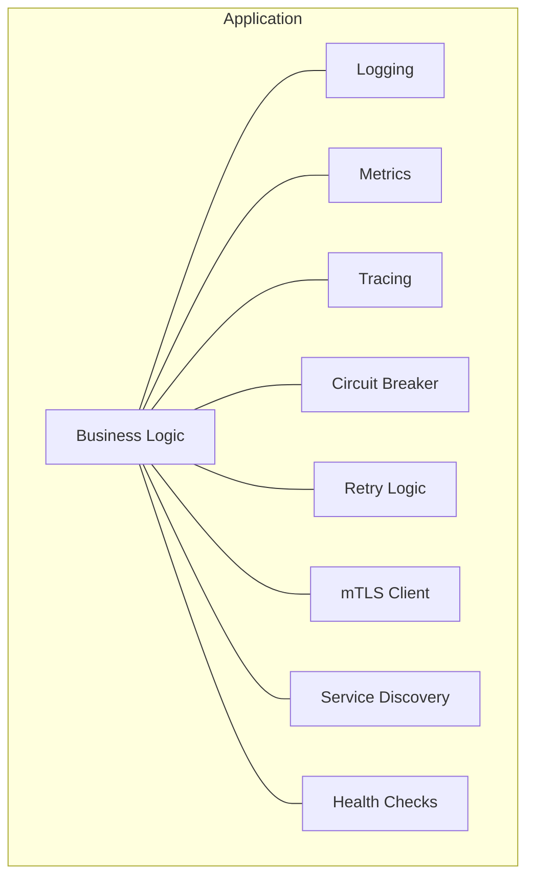
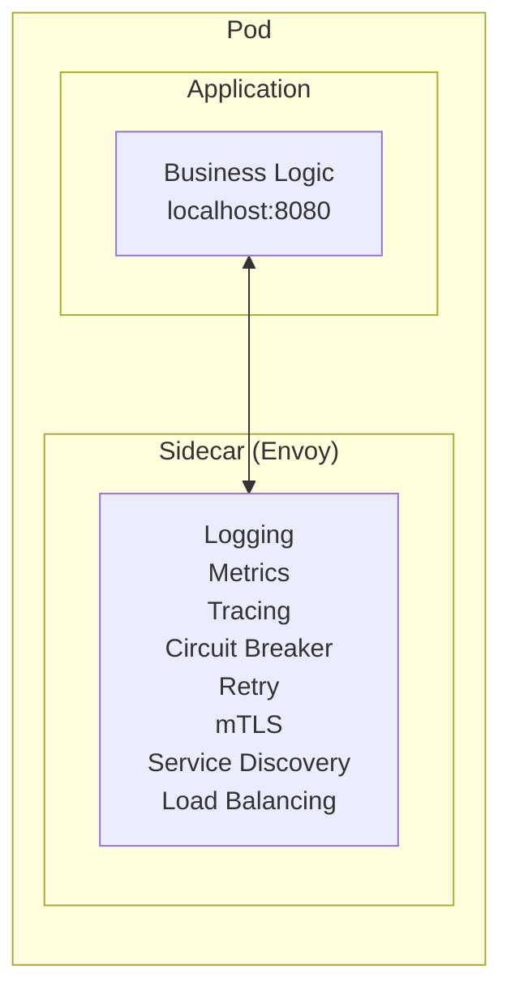
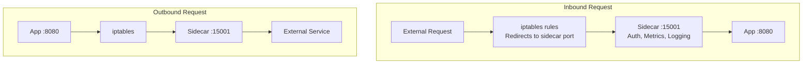

# Sidecar Pattern

## TL;DR

The sidecar pattern deploys helper components alongside application containers to handle cross-cutting concerns like networking, observability, and security. The application focuses on business logic while the sidecar handles infrastructure concerns. Service meshes like Istio and Linkerd implement this pattern at scale.

---

## The Problem Sidecars Solve

### Without Sidecars



```
Problems:
• Same code in every service
• Different implementations per language
• Business logic buried in infrastructure code
• Hard to update consistently
```

### With Sidecars



```
Benefits:
• Application code is clean
• Language agnostic
• Consistent infrastructure across services
• Independent updates
```

---

## How Sidecars Work

### Traffic Interception



### Kubernetes Pod Configuration

```yaml
apiVersion: v1
kind: Pod
metadata:
  name: my-service
  labels:
    app: my-service
spec:
  containers:
    # Application container
    - name: app
      image: my-service:latest
      ports:
        - containerPort: 8080
      env:
        - name: PORT
          value: "8080"
    
    # Sidecar container
    - name: envoy-sidecar
      image: envoyproxy/envoy:v1.28.0
      ports:
        - containerPort: 15001  # Inbound
        - containerPort: 15006  # Outbound
        - containerPort: 15090  # Prometheus metrics
      volumeMounts:
        - name: envoy-config
          mountPath: /etc/envoy
      args:
        - -c
        - /etc/envoy/envoy.yaml
  
  # Init container to set up iptables
  initContainers:
    - name: init-networking
      image: istio/proxyv2:latest
      securityContext:
        capabilities:
          add: ["NET_ADMIN"]
      command:
        - iptables
        - -t
        - nat
        - -A
        - PREROUTING
        - -p
        - tcp
        - --dport
        - "8080"
        - -j
        - REDIRECT
        - --to-port
        - "15001"
```

---

## Common Sidecar Use Cases

### 1. Service Mesh Proxy (Envoy, Linkerd-proxy)

```yaml
# Envoy sidecar configuration
static_resources:
  listeners:
    - name: inbound
      address:
        socket_address:
          address: 0.0.0.0
          port_value: 15001
      filter_chains:
        - filters:
            - name: envoy.filters.network.http_connection_manager
              typed_config:
                "@type": type.googleapis.com/envoy.extensions.filters.network.http_connection_manager.v3.HttpConnectionManager
                stat_prefix: inbound
                route_config:
                  name: local_route
                  virtual_hosts:
                    - name: local_service
                      domains: ["*"]
                      routes:
                        - match:
                            prefix: "/"
                          route:
                            cluster: local_app
                http_filters:
                  # Authentication
                  - name: envoy.filters.http.jwt_authn
                  # Rate limiting
                  - name: envoy.filters.http.ratelimit
                  # Router (must be last)
                  - name: envoy.filters.http.router

  clusters:
    - name: local_app
      connect_timeout: 0.25s
      type: STATIC
      load_assignment:
        cluster_name: local_app
        endpoints:
          - lb_endpoints:
              - endpoint:
                  address:
                    socket_address:
                      address: 127.0.0.1
                      port_value: 8080
```

### 2. Log Collection Sidecar

```yaml
apiVersion: v1
kind: Pod
metadata:
  name: app-with-logging
spec:
  containers:
    - name: app
      image: my-app:latest
      volumeMounts:
        - name: log-volume
          mountPath: /var/log/app
    
    # Fluentd sidecar for log collection
    - name: fluentd
      image: fluent/fluentd:v1.14
      volumeMounts:
        - name: log-volume
          mountPath: /var/log/app
          readOnly: true
        - name: fluentd-config
          mountPath: /fluentd/etc
      env:
        - name: FLUENT_ELASTICSEARCH_HOST
          value: "elasticsearch"
  
  volumes:
    - name: log-volume
      emptyDir: {}
    - name: fluentd-config
      configMap:
        name: fluentd-config
---
apiVersion: v1
kind: ConfigMap
metadata:
  name: fluentd-config
data:
  fluent.conf: |
    <source>
      @type tail
      path /var/log/app/*.log
      pos_file /var/log/app/app.log.pos
      tag app.logs
      <parse>
        @type json
      </parse>
    </source>
    
    <match app.**>
      @type elasticsearch
      host "#{ENV['FLUENT_ELASTICSEARCH_HOST']}"
      port 9200
      index_name app-logs
    </match>
```

### 3. Security Sidecar (Vault Agent)

```yaml
apiVersion: v1
kind: Pod
metadata:
  name: app-with-secrets
  annotations:
    vault.hashicorp.com/agent-inject: "true"
    vault.hashicorp.com/agent-inject-secret-db-creds: "database/creds/my-role"
    vault.hashicorp.com/role: "my-app-role"
spec:
  serviceAccountName: my-app
  containers:
    - name: app
      image: my-app:latest
      # Vault agent sidecar injects secrets as files
      volumeMounts:
        - name: vault-secrets
          mountPath: /vault/secrets
          readOnly: true

# Vault agent sidecar automatically:
# 1. Authenticates to Vault using service account
# 2. Fetches secrets
# 3. Writes to shared volume
# 4. Rotates secrets automatically
```

### 4. Configuration Sidecar

```yaml
apiVersion: v1
kind: Pod
metadata:
  name: app-with-config
spec:
  containers:
    - name: app
      image: my-app:latest
      volumeMounts:
        - name: config-volume
          mountPath: /etc/app/config
    
    # Config sync sidecar
    - name: config-sync
      image: config-sync:latest
      env:
        - name: CONFIG_SOURCE
          value: "consul://consul:8500/config/my-app"
        - name: SYNC_INTERVAL
          value: "30s"
      volumeMounts:
        - name: config-volume
          mountPath: /etc/app/config
  
  volumes:
    - name: config-volume
      emptyDir: {}
```

---

## Service Mesh Architecture

### Istio

```mermaid
graph TD
    subgraph Control Plane
        P["Pilot<br/>Service Discovery<br/>Traffic Management"]
        C["Citadel<br/>Certificate Management<br/>Identity"]
        G["Galley<br/>Configuration Management"]
    end

    subgraph Data Plane
        subgraph Envoy Sidecar
            SD2[Service Discovery]
            TR[Traffic Routing]
            MT[mTLS]
            OB[Observability]
        end
        APP[Application]
        Envoy Sidecar --- APP
    end

    P -->|xDS API| Envoy Sidecar
    C -->|Certificates| Envoy Sidecar
    G -->|Config| Envoy Sidecar
```

### Istio Traffic Management

```yaml
# Virtual Service - routing rules
apiVersion: networking.istio.io/v1beta1
kind: VirtualService
metadata:
  name: reviews
spec:
  hosts:
    - reviews
  http:
    # Route 90% to v1, 10% to v2 (canary)
    - route:
        - destination:
            host: reviews
            subset: v1
          weight: 90
        - destination:
            host: reviews
            subset: v2
          weight: 10
    
    # Timeout
    timeout: 10s
    
    # Retries
    retries:
      attempts: 3
      perTryTimeout: 2s
      retryOn: 5xx,reset

---
# Destination Rule - traffic policies
apiVersion: networking.istio.io/v1beta1
kind: DestinationRule
metadata:
  name: reviews
spec:
  host: reviews
  trafficPolicy:
    connectionPool:
      tcp:
        maxConnections: 100
      http:
        h2UpgradePolicy: UPGRADE
        http1MaxPendingRequests: 100
        http2MaxRequests: 1000
    
    # Circuit breaker
    outlierDetection:
      consecutive5xxErrors: 5
      interval: 30s
      baseEjectionTime: 30s
      maxEjectionPercent: 50
  
  subsets:
    - name: v1
      labels:
        version: v1
    - name: v2
      labels:
        version: v2
```

### mTLS Configuration

```yaml
# Peer Authentication - require mTLS
apiVersion: security.istio.io/v1beta1
kind: PeerAuthentication
metadata:
  name: default
  namespace: production
spec:
  mtls:
    mode: STRICT  # All traffic must be mTLS

---
# Authorization Policy - service-to-service access control
apiVersion: security.istio.io/v1beta1
kind: AuthorizationPolicy
metadata:
  name: payment-service-policy
  namespace: production
spec:
  selector:
    matchLabels:
      app: payment
  rules:
    - from:
        - source:
            principals:
              - "cluster.local/ns/production/sa/order-service"
              - "cluster.local/ns/production/sa/refund-service"
      to:
        - operation:
            methods: ["POST"]
            paths: ["/api/v1/charge", "/api/v1/refund"]
```

---

## Sidecar Injection

### Manual Injection

```yaml
# Add sidecar container manually
spec:
  containers:
    - name: app
      image: my-app:latest
    - name: envoy
      image: envoyproxy/envoy:latest
```

### Automatic Injection (Istio)

```yaml
# Enable namespace for auto-injection
apiVersion: v1
kind: Namespace
metadata:
  name: production
  labels:
    istio-injection: enabled

# All pods in this namespace get sidecar automatically
---
# Opt-out specific pod
apiVersion: v1
kind: Pod
metadata:
  name: no-sidecar-pod
  annotations:
    sidecar.istio.io/inject: "false"
```

### Mutating Webhook

```python
# Simplified sidecar injector webhook
from flask import Flask, request, jsonify
import base64
import json

app = Flask(__name__)

@app.route('/mutate', methods=['POST'])
def mutate():
    admission_review = request.json
    pod = admission_review['request']['object']
    
    # Check if injection should happen
    if should_inject(pod):
        patches = generate_sidecar_patches(pod)
        
        return jsonify({
            'apiVersion': 'admission.k8s.io/v1',
            'kind': 'AdmissionReview',
            'response': {
                'uid': admission_review['request']['uid'],
                'allowed': True,
                'patchType': 'JSONPatch',
                'patch': base64.b64encode(
                    json.dumps(patches).encode()
                ).decode()
            }
        })
    
    return jsonify({
        'apiVersion': 'admission.k8s.io/v1',
        'kind': 'AdmissionReview',
        'response': {
            'uid': admission_review['request']['uid'],
            'allowed': True
        }
    })

def generate_sidecar_patches(pod):
    return [
        {
            'op': 'add',
            'path': '/spec/containers/-',
            'value': {
                'name': 'envoy',
                'image': 'envoyproxy/envoy:latest',
                'ports': [{'containerPort': 15001}]
            }
        },
        {
            'op': 'add',
            'path': '/spec/initContainers',
            'value': [{
                'name': 'init-networking',
                'image': 'init-networking:latest',
                'securityContext': {'capabilities': {'add': ['NET_ADMIN']}}
            }]
        }
    ]
```

---

## Performance Considerations

### Latency Overhead

```
Without sidecar:
Client ──────────────────────────────────────► Service
         Single network hop (~1ms)

With sidecar:
Client ──► Sidecar ──► localhost ──► App ──► localhost ──► Sidecar ──► Service
           (~0.5ms)    (~0.1ms)              (~0.1ms)      (~0.5ms)
         
Total overhead: ~1-2ms per hop

For a request touching 5 services:
Without sidecar: 5ms network latency
With sidecar: 5ms + (5 * 2ms) = 15ms
```

### Resource Overhead

```yaml
# Sidecar resource requirements
containers:
  - name: envoy
    resources:
      requests:
        cpu: 100m
        memory: 128Mi
      limits:
        cpu: 500m
        memory: 256Mi

# For 100 pods, sidecar overhead:
# CPU: 10 cores requested, 50 cores limit
# Memory: 12.5 GB requested, 25 GB limit
```

### Optimization Strategies

```yaml
# 1. Tune buffer sizes
static_resources:
  clusters:
    - name: local_app
      per_connection_buffer_limit_bytes: 32768
      
# 2. Connection pooling
http_protocol_options:
  max_concurrent_streams: 100

# 3. Disable unnecessary features
tracing:
  enabled: false  # If not using tracing
  
# 4. Use native sidecar (Kubernetes 1.28+)
spec:
  initContainers:
    - name: envoy
      restartPolicy: Always  # Native sidecar
```

---

## Trade-offs

| Aspect | Pro | Con |
|--------|-----|-----|
| Separation of concerns | Clean application code | Operational complexity |
| Language agnostic | Same sidecar for all services | Resource overhead per pod |
| Consistent infrastructure | Uniform policies | Debugging complexity |
| Independent updates | Update sidecar without app | Version compatibility |
| Observability | Automatic metrics/tracing | Latency overhead |

---

## When to Use Sidecars

### Good Use Cases

```
✓ Service mesh (mTLS, traffic management)
✓ Observability (logging, metrics, tracing)
✓ Security (secret injection, authentication)
✓ Configuration management
✓ Legacy application modernization
```

### When to Avoid

```
✗ Simple applications (overhead not justified)
✗ Extremely latency-sensitive applications
✗ Resource-constrained environments
✗ When a library would suffice
✗ Single-language microservices (SDK might be better)
```

---

## References

- [Envoy Proxy Documentation](https://www.envoyproxy.io/docs/envoy/latest/)
- [Istio Documentation](https://istio.io/latest/docs/)
- [Linkerd Documentation](https://linkerd.io/2.14/overview/)
- [Kubernetes Sidecar Containers KEP](https://github.com/kubernetes/enhancements/tree/master/keps/sig-node/753-sidecar-containers)
- [Service Mesh Patterns](https://www.oreilly.com/library/view/service-mesh-patterns/9781492086444/)
