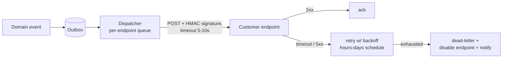

# API Design Patterns

## TL;DR

An API is a contract you'll honor for years, consumed by clients you don't control — design it as a product, not a database projection. The load-bearing patterns: model **resources** (nouns with lifecycle), not actions; return **structured errors** (RFC 9457 problem details) machines can branch on; paginate with **opaque cursors**, never offsets; accept **idempotency keys** on every unsafe operation; version by **addition first** and break only with explicit deprecation windows; use **gRPC** where you own both ends (internal service-to-service, streaming, codegen) and HTTP+JSON where you don't; and treat **webhooks** as a delivery system with signing, retries, and ordering caveats — not fire-and-forget HTTP. The grand unifier: every rule here exists because someone's client broke at 3 a.m.

---

## Resource Modeling

Model the domain as resources (nouns with identity and lifecycle) and use the uniform interface for their manipulation; reserve custom verbs for genuine state transitions that don't map to CRUD:

```
GET    /invoices                 list (filterable, paginated)
POST   /invoices                 create
GET    /invoices/{id}            fetch
PATCH  /invoices/{id}            partial update
DELETE /invoices/{id}            delete (or cancel — see below)

POST   /invoices/{id}:finalize   controlled state transition (custom method)
POST   /invoices/{id}:void       — better than PATCH {status: "void"} because
                                   transitions have rules, side effects, and auth
                                   that field-edits shouldn't smuggle past
```

Conventions that age well (largely codified in Google's AIPs and Stripe's API):

- **IDs are opaque strings, prefixed by type** (`inv_8a3f…`) — greppable in logs, self-describing in support tickets, and never assumed numeric or sequential by clients.
- **Soft state machines over booleans:** `status: draft|open|paid|void` beats four mutually-inconsistent flags. Publish the transition diagram; reject invalid transitions with a specific error code.
- **Relationships by reference + expansion:** return `customer: "cus_123"`, allow `?expand=customer` for the embedded form — bounded payloads by default, joins on request.
- **Timestamps in RFC 3339 UTC; money in integer minor units + currency.** Both forever.
- **Don't mirror your tables.** The API is the stable façade over a schema you must remain free to refactor ([Database Migrations](../15-deployment/03-database-migrations.md) assumes the API doesn't leak columns).

## Errors: Make Failure Programmable

Clients branch on errors more than on successes. Give them structure (RFC 9457 *Problem Details*), not prose:

```json
HTTP/1.1 422 Unprocessable Entity
Content-Type: application/problem+json

{
  "type": "https://api.example.com/errors/insufficient-funds",
  "title": "Insufficient funds",
  "status": 422,
  "detail": "Balance 4210 is less than requested amount 5000.",
  "instance": "/transfers/tr_9f2c",
  "balance": 4210,
  "request_id": "req_b1a8e0"
}
```

- **`type` is the machine contract** — stable URI per error class; clients switch on it, docs live behind it. `detail` is for humans and may change freely.
- Use the status code families honestly: 400 malformed, 401 unauthenticated, 403 unauthorized, 404 absent-or-hidden, 409 conflict (state machine said no), 422 semantically invalid, **429 with `Retry-After`**, 503 with `Retry-After` — your callers' [retry policies](../06-scaling/10-retries-timeouts-hedging.md) key off exactly these.
- **Always echo a `request_id`** and log it on both sides; it's the join key for every support conversation you'll ever have.
- Validation errors return **all** violations in one response, not one-per-round-trip.

## Pagination, Filtering, Long Operations

**Cursor pagination is the only kind that survives concurrent writes.** Offset pagination (`?page=7`) re-counts from zero on every request — O(n) deep in the set, and rows shift under the client, duplicating or skipping items mid-scroll:

```
GET /invoices?limit=100&starting_after=inv_8a3f
→ { "data": [...], "has_more": true, "next_cursor": "djE6aW52Xzhi..." }
```

The cursor encodes the position (`(created_at, id)` of the last row → keyset `WHERE (created_at, id) > (…)` against an index) but is **opaque to clients** — base64 it, version it, and you're free to change the underlying sort strategy later. Guarantee a **total order** (timestamp alone ties; always append the unique id).

Filtering: a small set of indexed, documented parameters beats a generic query language you'll regret securing. Sorting: explicit allowlist (`?sort=-created_at`).

**Long-running operations** return `202 Accepted` plus an operation resource to poll (`GET /operations/{id}` → `running|succeeded|failed` + result link) — or let clients register a webhook for completion. Never hold an HTTP connection open as a progress bar.

## Idempotency and Concurrency

Every unsafe operation accepts an **idempotency key**, because every client retries ([Retries](../06-scaling/10-retries-timeouts-hedging.md)) and "the response was lost" must not mean "charged twice":

```
POST /transfers
Idempotency-Key: 3c0a7e1b-...     ← client-generated per logical operation

server: first time  → execute, store (key → response)
        replay      → return stored response verbatim
        same key, different body → 422 (catches client bugs)
```

The full mechanics — atomic key-storage, TTLs, scope-per-endpoint — are in [Idempotency](../01-foundations/08-idempotency.md). For lost-update protection on writes, support **optimistic concurrency**: return `ETag`/version on reads, require `If-Match` on writes, reply `412 Precondition Failed` on staleness — far better than last-writer-wins on a shared resource.

## Versioning and Evolution

The cheapest version is the one you never ship. **Additive evolution** — new optional fields, new endpoints, new enum values — requires clients built to the robustness rule: *ignore unknown fields, tolerate unknown enum values*. State that rule in the contract; test clients against it.

When you must break:

- **Pick one versioning surface** — URL (`/v2/`, visible and cacheable) or header (date-pinned like Stripe's, which lets you ship many small breaking changes, each gated per-account) — and never mix.
- **Deprecation is a process, not a flag day:** announce, emit `Deprecation` + `Sunset` headers on old-version responses, *measure who's still calling* (per-key version metrics — you have these via the [API Gateway](./02-api-gateway.md)), nag the long tail, then turn down. The published window is the contract; 6–18 months is typical.
- **Translate at the edge, don't fork:** maintain one internal model; old versions are adapters over it (Stripe's version-modules approach). N parallel implementations rot in N ways.

## gRPC: When You Own Both Ends

For internal service-to-service traffic, gRPC + protobuf earns its place: typed contracts with codegen in every language, HTTP/2 multiplexing, deadline propagation built in, and native streaming (server-, client-, and bidirectional — covering most of what [WebSockets](../07-real-time/04-websockets.md) does between services). The mesh handles its load balancing and retries declaratively ([Sidecar Pattern](./03-sidecar-pattern.md)).

The contract discipline is proto **field-number hygiene**:

```protobuf
message Invoice {
  string id = 1;
  int64 amount_minor = 2;
  Status status = 3;
  reserved 4;  reserved "legacy_total";   // field 4 retired: never reuse the number

  enum Status {
    STATUS_UNSPECIFIED = 0;               // always define 0 = unknown
    DRAFT = 1; OPEN = 2; PAID = 3;
  }
}
```

Safe: adding fields, adding enum values (receivers must handle unknowns), renaming (names aren't on the wire). Breaking: changing a field's number or type, reusing a retired number — hence `reserved`. Enforce with `buf breaking` in CI, exactly like a schema registry gates [CDC events](../13-data-pipelines/04-change-data-capture.md). At the boundary to browsers and third parties, front gRPC with JSON transcoding or just ship REST — public gRPC is still the exception.

## Webhooks: APIs in Reverse

Webhooks invert the relationship — now *you* are the unreliable client calling *their* flaky server — so apply everything above in mirror image:



- **Sign every delivery** (HMAC over timestamp + payload, e.g. `t=...,v1=hex`); receivers verify with a shared secret and reject stale timestamps (replay defense). Publish receiver sample code — unverified webhooks are an account-takeover vector waiting.
- **Delivery is at-least-once and eventually out-of-order.** Retries with backoff over hours mean event N+1 can land before the retried N. Therefore: include event `id` (receivers dedupe) and `created` timestamp; receivers treat events as *signals to fetch current state*, not as state transfer — the **thin payload** pattern (`{"type": "invoice.paid", "id": "evt_...", "object": "inv_123"}` → receiver GETs the invoice) sidesteps both ordering and stale-data bugs.
- **Receivers must ack fast** (2xx within seconds, then process async) — and you must enforce timeouts, cap retries, dead-letter, and auto-disable persistently failing endpoints with notification ([Dead Letter Queues](../05-messaging/08-dead-letter-queues.md)).
- Source events from the [Outbox](../05-messaging/07-outbox-pattern.md) so a webhook is never emitted for a transaction that rolled back.
- Offer a **replay/list-events API** — receivers *will* lose events during their own incidents; `GET /events?after=...` turns that from a support ticket into self-service. (The Standard Webhooks spec packages most of these conventions.)

---

## Checklist

- [ ] Resources + explicit state transitions; opaque typed IDs; no table mirroring
- [ ] RFC 9457 errors with stable `type`, `request_id`, complete validation results
- [ ] Cursor pagination over a total order; opaque versioned cursors
- [ ] Idempotency keys on all unsafe methods; ETag/If-Match for lost-update protection
- [ ] Additive-first evolution; one versioning surface; Deprecation/Sunset + per-key version metrics before any turn-down
- [ ] gRPC internally with `buf breaking` CI gates; REST/JSON at the public edge
- [ ] Webhooks: HMAC-signed, outbox-sourced, retried with backoff, dedupe IDs, thin payloads, replay API, auto-disable + DLQ
- [ ] Rate limits visible (`429` + `Retry-After` + remaining-quota headers) ([Rate Limiting](../06-scaling/05-rate-limiting.md))

---

## References

- [RFC 9457: Problem Details for HTTP APIs](https://www.rfc-editor.org/rfc/rfc9457) — structured errors
- [Google API Improvement Proposals (AIPs)](https://google.aip.dev/) — the most complete public resource-design rulebook
- [Stripe: API versioning](https://stripe.com/blog/api-versioning) and [Designing robust and predictable APIs with idempotency](https://stripe.com/blog/idempotency)
- [Buf: breaking-change detection](https://buf.build/docs/breaking/overview) and [protobuf language guide](https://protobuf.dev/programming-guides/proto3/) — field-number hygiene
- [Standard Webhooks](https://www.standardwebhooks.com/) — signing, retries, and metadata conventions, specified
- GraphQL — a query-language API style to consider when clients need flexible projections; keep it as an API design choice, not a default architecture layer
