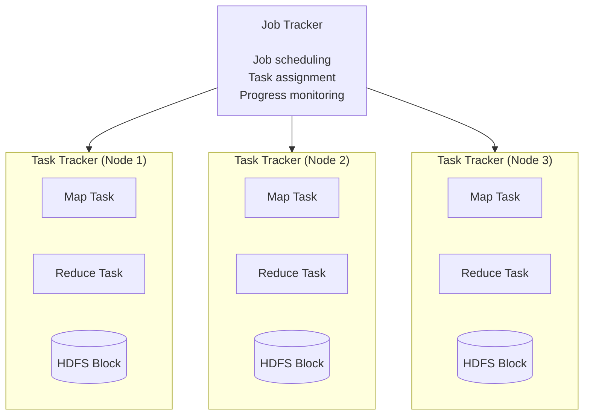
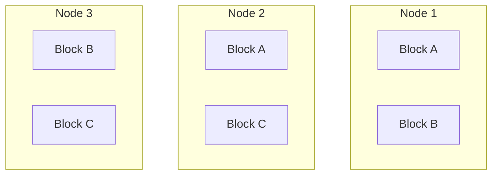
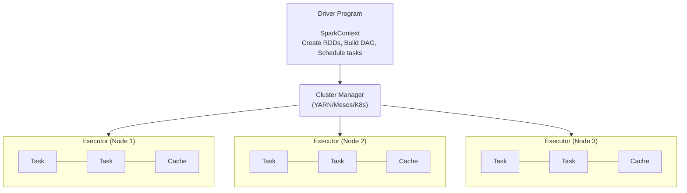
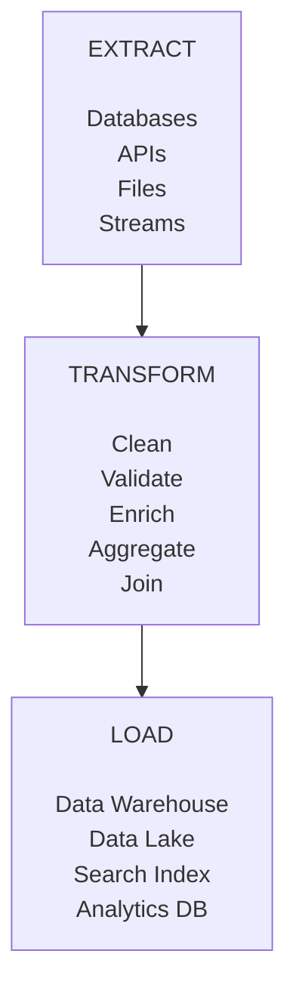
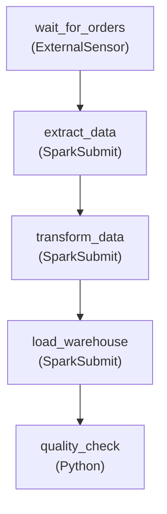

# Batch Processing

## TL;DR

Batch processing handles large volumes of data in scheduled jobs, optimizing for throughput over latency. MapReduce pioneered distributed batch processing; modern systems like Spark improve on it with in-memory computation. Choose batch when data completeness matters more than freshness.

---

## When to Use Batch Processing

```
Batch Processing:                    Stream Processing:
─────────────────                    ──────────────────
• Data completeness required         • Real-time insights needed
• High throughput priority           • Low latency priority
• Complex aggregations               • Simple transformations
• Historical analysis                • Event-driven actions
• Cost-effective compute             • Continuous processing

Examples:                            Examples:
• Daily reports                      • Fraud detection
• ETL pipelines                      • Live dashboards
• ML model training                  • Alerting
• Data warehouse loads               • Session tracking
```

---

## MapReduce Fundamentals

### The Programming Model

```
Input Data ──► Map ──► Shuffle ──► Reduce ──► Output

Map:     (k1, v1) → list[(k2, v2)]
Reduce:  (k2, list[v2]) → list[(k3, v3)]
```

### Word Count Example

```python
# Input: Collection of documents
# Output: Word frequency counts

def map(document_id, document_text):
    """Emit (word, 1) for each word"""
    for word in document_text.split():
        emit(word.lower(), 1)

def reduce(word, counts):
    """Sum all counts for a word"""
    emit(word, sum(counts))

# Execution flow:
# 
# Document 1: "hello world"
# Document 2: "hello hadoop"
# 
# Map output:
#   ("hello", 1), ("world", 1)
#   ("hello", 1), ("hadoop", 1)
# 
# Shuffle (group by key):
#   "hello" → [1, 1]
#   "world" → [1]
#   "hadoop" → [1]
# 
# Reduce output:
#   ("hello", 2), ("world", 1), ("hadoop", 1)
```

### MapReduce Architecture



### Data Locality



```
Principle: Move computation to data, not data to computation

Task scheduling preference:
1. Data-local:     Run on node that has the block (best)
2. Rack-local:     Run on same rack (network within rack is fast)
3. Off-rack:       Run anywhere (last resort)
```

---

## Apache Spark

### Why Spark Over MapReduce?

```
MapReduce limitations:
• Disk I/O between stages (slow)
• Only Map and Reduce primitives
• Verbose programming model
• No interactive queries

Spark improvements:
• In-memory computation (10-100x faster)
• Rich transformation API
• Lazy evaluation with optimization
• Interactive shell
• Same code for batch and streaming

Performance comparison (100TB sort):
MapReduce: 72 minutes, 2100 nodes
Spark:     23 minutes, 206 nodes
```

### RDD (Resilient Distributed Dataset)

```python
from pyspark import SparkContext

sc = SparkContext("local", "WordCount")

# Create RDD from file
text_file = sc.textFile("hdfs://path/to/file")

# Transformations (lazy - not executed yet)
words = text_file.flatMap(lambda line: line.split())
word_pairs = words.map(lambda word: (word, 1))
word_counts = word_pairs.reduceByKey(lambda a, b: a + b)

# Action (triggers execution)
results = word_counts.collect()

# Execution plan (DAG):
# textFile ──► flatMap ──► map ──► reduceByKey ──► collect
#                                                    │
#                              Narrow               Wide
#                              transforms           transform
#                              (no shuffle)         (shuffle)
```

### DataFrame API

```python
from pyspark.sql import SparkSession
from pyspark.sql.functions import col, sum, avg, window

spark = SparkSession.builder.appName("Analytics").getOrCreate()

# Read data
orders = spark.read.parquet("s3://bucket/orders/")
products = spark.read.parquet("s3://bucket/products/")

# Transformations
daily_revenue = (
    orders
    .filter(col("status") == "completed")
    .join(products, orders.product_id == products.id)
    .groupBy(
        window(col("created_at"), "1 day"),
        col("category")
    )
    .agg(
        sum("total").alias("revenue"),
        avg("total").alias("avg_order_value"),
        count("*").alias("order_count")
    )
    .orderBy("window", "category")
)

# Write output
daily_revenue.write.mode("overwrite").parquet("s3://bucket/reports/daily_revenue/")
```

### Spark Architecture



---

## ETL Pipeline Design

### Extract, Transform, Load



### Pipeline Implementation

```python
from pyspark.sql import SparkSession
from pyspark.sql.functions import *
from pyspark.sql.types import *

class SalesETLPipeline:
    def __init__(self, spark):
        self.spark = spark
    
    def extract(self, date):
        """Extract data from various sources"""
        
        # From database
        orders = (
            self.spark.read
            .format("jdbc")
            .option("url", "jdbc:postgresql://db/sales")
            .option("dbtable", f"(SELECT * FROM orders WHERE date = '{date}') t")
            .load()
        )
        
        # From API (stored as JSON)
        exchange_rates = (
            self.spark.read
            .json(f"s3://bucket/exchange_rates/{date}/*.json")
        )
        
        # From data lake
        products = self.spark.read.parquet("s3://bucket/products/")
        customers = self.spark.read.parquet("s3://bucket/customers/")
        
        return orders, exchange_rates, products, customers
    
    def transform(self, orders, exchange_rates, products, customers):
        """Apply business transformations"""
        
        # Data cleaning
        cleaned_orders = (
            orders
            .filter(col("total") > 0)
            .filter(col("status").isin(["completed", "shipped"]))
            .dropDuplicates(["order_id"])
            .withColumn("total", col("total").cast("decimal(10,2)"))
        )
        
        # Data enrichment
        enriched_orders = (
            cleaned_orders
            .join(products, "product_id")
            .join(customers, "customer_id")
            .join(
                exchange_rates,
                cleaned_orders.currency == exchange_rates.currency_code
            )
            .withColumn(
                "total_usd",
                col("total") / col("exchange_rate")
            )
        )
        
        # Aggregations
        daily_metrics = (
            enriched_orders
            .groupBy("date", "category", "region")
            .agg(
                sum("total_usd").alias("revenue"),
                count("*").alias("order_count"),
                countDistinct("customer_id").alias("unique_customers"),
                avg("total_usd").alias("avg_order_value")
            )
        )
        
        return enriched_orders, daily_metrics
    
    def load(self, enriched_orders, daily_metrics, date):
        """Load to destination"""
        
        # Detailed data to data lake (partitioned)
        (
            enriched_orders
            .write
            .mode("overwrite")
            .partitionBy("date")
            .parquet(f"s3://bucket/enriched_orders/date={date}/")
        )
        
        # Aggregates to data warehouse
        (
            daily_metrics
            .write
            .format("jdbc")
            .option("url", "jdbc:redshift://cluster/warehouse")
            .option("dbtable", "daily_sales_metrics")
            .mode("append")
            .save()
        )
    
    def run(self, date):
        """Execute full pipeline"""
        orders, rates, products, customers = self.extract(date)
        enriched, metrics = self.transform(orders, rates, products, customers)
        self.load(enriched, metrics, date)
```

---

## Orchestration

### Apache Airflow

```python
from airflow import DAG
from airflow.operators.python import PythonOperator
from airflow.providers.apache.spark.operators.spark_submit import SparkSubmitOperator
from airflow.sensors.external_task import ExternalTaskSensor
from datetime import datetime, timedelta

default_args = {
    'owner': 'data-team',
    'depends_on_past': True,
    'retries': 3,
    'retry_delay': timedelta(minutes=5),
    'email_on_failure': True,
    'email': ['data-team@company.com']
}

with DAG(
    'daily_sales_etl',
    default_args=default_args,
    schedule_interval='0 2 * * *',  # 2 AM daily
    start_date=datetime(2024, 1, 1),
    catchup=True,
    max_active_runs=1
) as dag:
    
    # Wait for upstream data
    wait_for_orders = ExternalTaskSensor(
        task_id='wait_for_orders_export',
        external_dag_id='orders_export',
        external_task_id='export_complete',
        timeout=3600
    )
    
    # Extract from sources
    extract_task = SparkSubmitOperator(
        task_id='extract_data',
        application='s3://jobs/extract.py',
        conf={'spark.executor.memory': '4g'},
        application_args=['--date', '{{ ds }}']
    )
    
    # Transform
    transform_task = SparkSubmitOperator(
        task_id='transform_data',
        application='s3://jobs/transform.py',
        conf={'spark.executor.memory': '8g'},
        application_args=['--date', '{{ ds }}']
    )
    
    # Load to warehouse
    load_task = SparkSubmitOperator(
        task_id='load_warehouse',
        application='s3://jobs/load.py',
        application_args=['--date', '{{ ds }}']
    )
    
    # Data quality checks
    quality_check = PythonOperator(
        task_id='data_quality_check',
        python_callable=run_quality_checks,
        op_kwargs={'date': '{{ ds }}'}
    )
    
    # Dependencies
    wait_for_orders >> extract_task >> transform_task >> load_task >> quality_check
```

### DAG Visualization



---

## Data Quality

### Validation Framework

```python
from great_expectations import DataContext
from pyspark.sql.functions import *

class DataQualityValidator:
    def __init__(self, spark):
        self.spark = spark
    
    def validate_orders(self, df, date):
        """Validate orders data quality"""
        
        results = {
            'date': date,
            'checks': [],
            'passed': True
        }
        
        # Check 1: No null primary keys
        null_ids = df.filter(col("order_id").isNull()).count()
        results['checks'].append({
            'name': 'no_null_primary_keys',
            'passed': null_ids == 0,
            'details': f'Found {null_ids} null order_ids'
        })
        
        # Check 2: Amounts are positive
        negative_amounts = df.filter(col("total") < 0).count()
        results['checks'].append({
            'name': 'positive_amounts',
            'passed': negative_amounts == 0,
            'details': f'Found {negative_amounts} negative amounts'
        })
        
        # Check 3: Dates are valid
        invalid_dates = df.filter(
            (col("created_at") > current_timestamp()) |
            (col("created_at") < "2020-01-01")
        ).count()
        results['checks'].append({
            'name': 'valid_dates',
            'passed': invalid_dates == 0,
            'details': f'Found {invalid_dates} invalid dates'
        })
        
        # Check 4: Referential integrity
        product_ids = df.select("product_id").distinct()
        products = self.spark.read.parquet("s3://bucket/products/")
        orphans = product_ids.subtract(
            products.select("id").withColumnRenamed("id", "product_id")
        ).count()
        results['checks'].append({
            'name': 'referential_integrity',
            'passed': orphans == 0,
            'details': f'Found {orphans} orphan product_ids'
        })
        
        # Check 5: Completeness - row count within expected range
        row_count = df.count()
        expected_min = 10000  # Based on historical data
        expected_max = 1000000
        results['checks'].append({
            'name': 'row_count_in_range',
            'passed': expected_min <= row_count <= expected_max,
            'details': f'Row count: {row_count}'
        })
        
        # Overall result
        results['passed'] = all(c['passed'] for c in results['checks'])
        
        return results
```

---

## Partitioning Strategies

### Time-Based Partitioning

```
s3://bucket/orders/
├── year=2024/
│   ├── month=01/
│   │   ├── day=01/
│   │   │   ├── part-00000.parquet
│   │   │   └── part-00001.parquet
│   │   └── day=02/
│   │       └── ...
│   └── month=02/
│       └── ...
└── year=2023/
    └── ...

Benefits:
• Query only relevant partitions
• Easy lifecycle management (delete old partitions)
• Natural data organization
```

```python
# Writing partitioned data
(
    orders
    .withColumn("year", year("created_at"))
    .withColumn("month", month("created_at"))
    .withColumn("day", dayofmonth("created_at"))
    .write
    .partitionBy("year", "month", "day")
    .parquet("s3://bucket/orders/")
)

# Reading with partition pruning
spark.read.parquet("s3://bucket/orders/") \
    .filter(col("year") == 2024) \
    .filter(col("month") == 1)
# Only reads year=2024/month=01/ partitions
```

### Hash Partitioning

```python
# Partition by hash of customer_id for even distribution
(
    orders
    .withColumn("partition", hash("customer_id") % 100)
    .write
    .partitionBy("partition")
    .parquet("s3://bucket/orders_by_customer/")
)
```

---

## Best Practices

### Performance Optimization

```python
# 1. Cache intermediate results used multiple times
enriched_orders = transform(raw_orders)
enriched_orders.cache()  # Keep in memory

daily_metrics = enriched_orders.groupBy("date").agg(...)
weekly_metrics = enriched_orders.groupBy(weekofyear("date")).agg(...)

# 2. Broadcast small tables in joins
from pyspark.sql.functions import broadcast

large_table.join(
    broadcast(small_lookup_table),  # < 10MB
    "key"
)

# 3. Avoid shuffles when possible
# BAD: Two shuffles
df.groupBy("key1").agg(...).groupBy("key2").agg(...)

# GOOD: Single shuffle
df.groupBy("key1", "key2").agg(...)

# 4. Use appropriate file formats
# Parquet: Column-oriented, great for analytics
# ORC: Similar to Parquet, better for Hive
# Avro: Row-oriented, good for write-heavy workloads
```

### Idempotent Pipelines

```python
# Pipeline should produce same output when run multiple times
def run_pipeline(date):
    output_path = f"s3://bucket/output/date={date}/"
    
    # Delete existing output (if any)
    delete_path(output_path)
    
    # Process
    result = process_data(date)
    
    # Write
    result.write.mode("overwrite").parquet(output_path)

# Now safe to re-run failed pipelines
```

---

## References

- [MapReduce Paper](https://research.google/pubs/pub62/)
- [Spark: Cluster Computing with Working Sets](https://www.usenix.org/legacy/event/hotcloud10/tech/full_papers/Zaharia.pdf)
- [Apache Spark Documentation](https://spark.apache.org/docs/latest/)
- [Apache Airflow Documentation](https://airflow.apache.org/docs/)
- [Designing Data-Intensive Applications - Chapter 10](https://dataintensive.net/)
