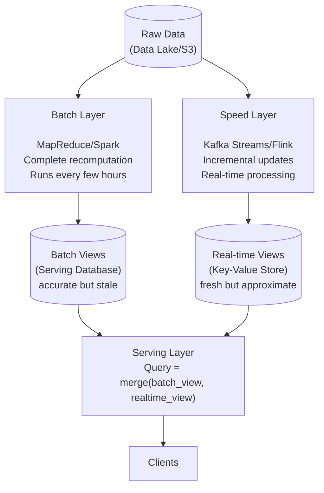
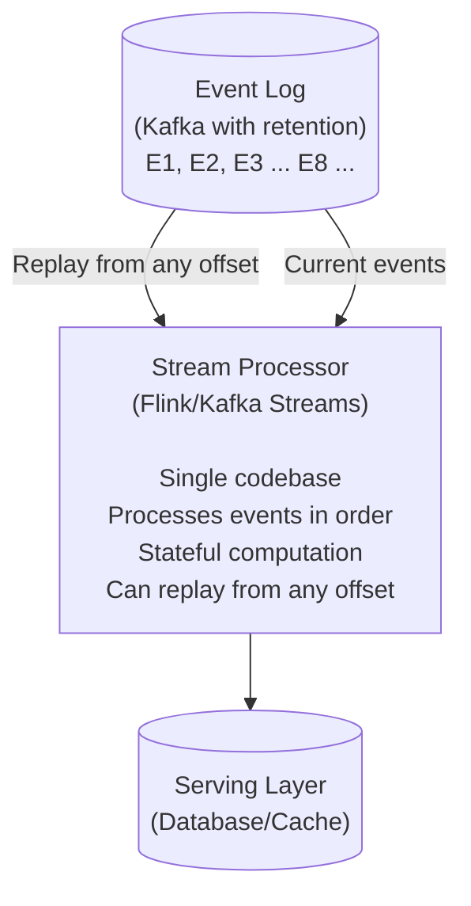
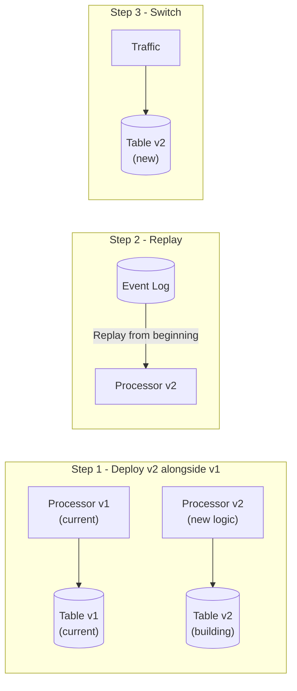

# Lambda and Kappa Architecture

## TL;DR

Lambda Architecture combines batch and stream processing for both accuracy and low latency - at the cost of maintaining two codebases. Kappa Architecture simplifies this to stream-only, using replay for reprocessing. Choose based on your accuracy requirements, operational capacity, and whether your logic can be unified.

---

## Lambda Architecture

### The Problem

```
Batch Processing:
✓ Accurate (complete data)
✓ Complex computations
✗ High latency (hours)

Stream Processing:
✓ Low latency (seconds)
✗ Approximate (incomplete data)
✗ Limited computations

Question: Can we have both accuracy AND low latency?
Answer: Lambda Architecture - run both in parallel
```

### Architecture Overview



### Implementation Example

```python
# Batch Layer (Spark)
class BatchProcessor:
    def run_daily(self, date):
        # Read all historical data
        events = spark.read.parquet(f"s3://data/events/")
        
        # Complete recomputation
        user_stats = (
            events
            .filter(col("date") <= date)
            .groupBy("user_id")
            .agg(
                count("*").alias("total_events"),
                sum("revenue").alias("total_revenue"),
                countDistinct("session_id").alias("total_sessions")
            )
        )
        
        # Write to batch serving layer
        user_stats.write.mode("overwrite").parquet(
            f"s3://batch-views/user_stats/date={date}/"
        )

# Speed Layer (Kafka Streams)
class SpeedProcessor:
    def process(self):
        events_stream = builder.stream("events")
        
        # Incremental updates (since last batch)
        user_stats = (
            events_stream
            .groupBy(lambda e: e.user_id)
            .aggregate(
                initializer=lambda: UserStats(),
                aggregator=lambda key, event, stats: stats.update(event)
            )
        )
        
        # Write to real-time serving layer
        user_stats.toStream().to("realtime-user-stats")

# Serving Layer
class QueryHandler:
    def get_user_stats(self, user_id):
        # Get batch view (accurate but stale)
        batch_stats = self.batch_store.get(user_id)
        
        # Get real-time view (fresh but incremental)
        realtime_stats = self.realtime_store.get(user_id)
        
        # Merge: batch provides base, real-time provides updates
        return self.merge(batch_stats, realtime_stats)
    
    def merge(self, batch, realtime):
        if realtime is None:
            return batch
        
        return UserStats(
            total_events=batch.total_events + realtime.events_since_batch,
            total_revenue=batch.total_revenue + realtime.revenue_since_batch,
            total_sessions=batch.total_sessions + realtime.sessions_since_batch
        )
```

### Lambda Architecture Trade-offs

```
Pros:
✓ Accurate results (batch layer is source of truth)
✓ Low latency (speed layer provides real-time)
✓ Fault tolerant (batch can recompute from raw data)
✓ Handles late data (batch incorporates everything)

Cons:
✗ Two codebases (batch + stream logic)
✗ Complex to maintain
✗ Results may be inconsistent during batch windows
✗ Operational overhead (two systems to monitor)
✗ Code divergence risk (batch and stream logic drift)
```

---

## Kappa Architecture

### The Simplification

```
Key Insight: If you can do everything in stream processing,
             why maintain two systems?

Lambda:  Raw Data ──► Batch Layer  ──► Batch Views ──┐
                 └──► Speed Layer ──► RT Views ─────┼──► Serving
                                                    │
Kappa:   Raw Data ──► Stream Layer ──► Views ───────┴──► Serving

Reprocessing in Kappa:
Instead of batch recompute, replay the stream from the beginning
```

### Architecture Overview



### Reprocessing Strategy



### Implementation Example

```python
# Single stream processor for all computation
class KappaProcessor:
    def __init__(self, kafka_bootstrap, starting_offset='earliest'):
        self.consumer = KafkaConsumer(
            'events',
            bootstrap_servers=kafka_bootstrap,
            auto_offset_reset=starting_offset
        )
    
    def process(self):
        state = {}  # In real system, use Flink state or RocksDB
        
        for message in self.consumer:
            event = deserialize(message.value)
            
            # Update state
            user_id = event['user_id']
            if user_id not in state:
                state[user_id] = UserStats()
            
            state[user_id].update(event)
            
            # Emit to output
            self.emit_to_serving(user_id, state[user_id])
    
    def reprocess(self):
        """Replay from beginning with new logic"""
        # Seek to beginning
        self.consumer.seek_to_beginning()
        
        # Clear output
        self.clear_serving_layer()
        
        # Reprocess all events
        self.process()

# Deployment for reprocessing
class KappaDeployment:
    def deploy_new_version(self, new_processor):
        # 1. Start new processor reading from beginning
        new_output = f"serving_v{new_version}"
        new_processor.start(output_table=new_output)
        
        # 2. Wait for catch-up
        while not new_processor.is_caught_up():
            time.sleep(60)
        
        # 3. Switch traffic
        self.update_routing(new_output)
        
        # 4. Cleanup old version
        old_processor.stop()
        self.delete_table(old_output)
```

### Kappa Architecture Trade-offs

```
Pros:
✓ Single codebase (simpler to maintain)
✓ Same logic for real-time and reprocessing
✓ Lower operational overhead
✓ Easier to reason about

Cons:
✗ Requires log retention (storage cost)
✗ Reprocessing time depends on log size
✗ Stream processing must handle all use cases
✗ May not be feasible for very complex batch computations
✗ Need to manage multiple versions during reprocessing
```

---

## Choosing Between Lambda and Kappa

### Decision Matrix

| Consideration | Lambda | Kappa |
|---|---|---|
| Team has batch AND stream expertise | Yes | |
| Team primarily knows streaming | | Yes |
| Complex aggregations (ML features) | Yes | |
| Simple aggregations (counts, sums) | | Yes |
| Need 100% accuracy | Yes | |
| Eventual consistency acceptable | | Yes |
| Operational simplicity priority | | Yes |
| Can retain all data in log | | Yes |
| Data volume makes retention costly | Yes | |
| Frequent reprocessing needed | Yes | |
| Reprocessing is rare | | Yes |

### Use Case Examples

```
Lambda Architecture good for:
─────────────────────────────
• Machine learning feature stores
  - Complex feature engineering
  - Need exact historical features for training
  
• Financial reconciliation
  - End-of-day accurate totals required
  - Real-time dashboards for monitoring

• Fraud detection with investigation
  - Real-time alerts (speed layer)
  - Detailed historical analysis (batch layer)


Kappa Architecture good for:
─────────────────────────────
• Real-time analytics dashboards
  - Counts, sums, averages
  - Eventually consistent is OK

• Event-driven microservices
  - Event sourcing
  - CQRS read models

• IoT data processing
  - Sensor aggregations
  - Alerting on thresholds

• User activity tracking
  - Session analysis
  - Real-time personalization
```

---

## Modern Alternatives

### Unified Batch and Stream (Apache Beam/Flink)

```python
# Apache Beam - same code for batch and stream
import apache_beam as beam

class CountEvents(beam.PTransform):
    def expand(self, events):
        return (
            events
            | 'Window' >> beam.WindowInto(beam.window.FixedWindows(60))
            | 'ExtractUser' >> beam.Map(lambda e: (e['user_id'], 1))
            | 'CountPerUser' >> beam.CombinePerKey(sum)
        )

# Run as batch
with beam.Pipeline(runner='DataflowRunner') as p:
    events = p | 'ReadBatch' >> beam.io.ReadFromParquet('gs://data/*.parquet')
    counts = events | CountEvents()
    counts | 'WriteBatch' >> beam.io.WriteToBigQuery('table')

# Run as stream - SAME TRANSFORM
with beam.Pipeline(runner='DataflowRunner', options=streaming_options) as p:
    events = p | 'ReadStream' >> beam.io.ReadFromPubSub(topic='events')
    counts = events | CountEvents()
    counts | 'WriteStream' >> beam.io.WriteToBigQuery('table')
```

### Delta Lake / Apache Iceberg

```python
# Delta Lake - unified batch and streaming
from delta.tables import DeltaTable

# Streaming writes
(
    spark.readStream
    .format("kafka")
    .load()
    .writeStream
    .format("delta")
    .outputMode("append")
    .start("s3://bucket/events")
)

# Batch reads (same table)
events = spark.read.format("delta").load("s3://bucket/events")

# Time travel (replay/reprocess)
events_yesterday = (
    spark.read
    .format("delta")
    .option("timestampAsOf", "2024-01-01")
    .load("s3://bucket/events")
)

# ACID transactions
# Updates, deletes, schema evolution
# No separate batch/speed layer needed
```

### Materialize / Streaming Databases

```sql
-- Materialize: Streaming SQL database
-- Define sources
CREATE SOURCE events FROM KAFKA BROKER 'localhost:9092' TOPIC 'events'
FORMAT AVRO USING SCHEMA REGISTRY 'http://localhost:8081';

-- Define materialized views (continuously updated)
CREATE MATERIALIZED VIEW user_stats AS
SELECT 
    user_id,
    COUNT(*) as total_events,
    SUM(revenue) as total_revenue,
    COUNT(DISTINCT session_id) as total_sessions
FROM events
GROUP BY user_id;

-- Query like a regular table (always fresh)
SELECT * FROM user_stats WHERE user_id = '123';

-- Indexes for fast lookups
CREATE INDEX user_stats_idx ON user_stats (user_id);
```

---

## Implementation Patterns

### Serving Layer Design

```python
class HybridServingLayer:
    """
    For Lambda: Merge batch and real-time views
    For Kappa: Serve from stream output directly
    """
    
    def __init__(self, architecture='kappa'):
        self.architecture = architecture
        self.batch_store = BatchStore()      # e.g., Cassandra
        self.realtime_store = RealtimeStore() # e.g., Redis
    
    def get(self, key):
        if self.architecture == 'kappa':
            # Single source of truth
            return self.realtime_store.get(key)
        
        # Lambda: merge views
        batch_value = self.batch_store.get(key)
        realtime_value = self.realtime_store.get(key)
        
        return self.merge(batch_value, realtime_value)
    
    def merge(self, batch, realtime):
        """
        Merge strategy depends on your data model:
        - Additive: Sum values (counts, totals)
        - Replacement: Take latest (current state)
        - Complex: Custom merge logic
        """
        if batch is None:
            return realtime
        if realtime is None:
            return batch
        
        # Example: additive merge
        return {
            'count': batch['count'] + realtime.get('count_delta', 0),
            'total': batch['total'] + realtime.get('total_delta', 0),
            'batch_timestamp': batch['timestamp'],
            'realtime_timestamp': realtime.get('timestamp')
        }
```

### Reprocessing Coordination

```python
class ReprocessingCoordinator:
    """Coordinate reprocessing in Kappa architecture"""
    
    def __init__(self, kafka_admin, serving_layer):
        self.kafka = kafka_admin
        self.serving = serving_layer
    
    def reprocess(self, new_processor_image):
        version = self.get_next_version()
        
        # 1. Create new consumer group
        new_group = f"processor-v{version}"
        
        # 2. Create new output table
        new_table = f"output_v{version}"
        self.serving.create_table(new_table)
        
        # 3. Deploy new processor
        processor = self.deploy(
            image=new_processor_image,
            consumer_group=new_group,
            output_table=new_table,
            starting_offset='earliest'
        )
        
        # 4. Monitor progress
        while True:
            lag = self.get_consumer_lag(new_group)
            if lag < LAG_THRESHOLD:
                break
            time.sleep(60)
        
        # 5. Switch traffic
        self.update_serving_pointer(new_table)
        
        # 6. Cleanup old version
        old_version = version - 1
        self.stop_processor(f"processor-v{old_version}")
        self.serving.drop_table(f"output_v{old_version}")
```

---

## References

- [Nathan Marz - Lambda Architecture](http://nathanmarz.com/blog/how-to-beat-the-cap-theorem.html)
- [Jay Kreps - Questioning the Lambda Architecture](https://www.oreilly.com/radar/questioning-the-lambda-architecture/)
- [Apache Kafka - Log Compaction](https://kafka.apache.org/documentation/#compaction)
- [Delta Lake Documentation](https://docs.delta.io/)
- [Materialize Documentation](https://materialize.com/docs/)
