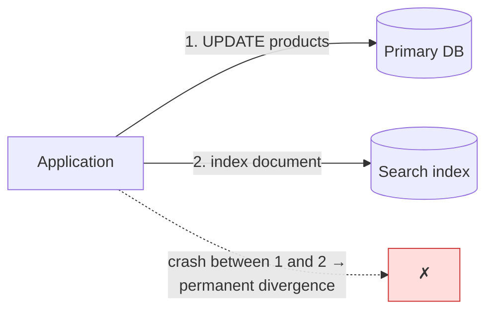
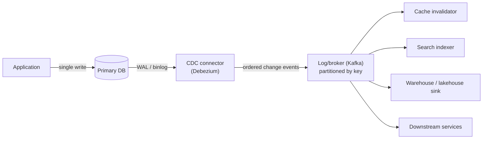

# Change Data Capture

## TL;DR

Change data capture (CDC) turns a database's replication log — MySQL binlog, Postgres WAL, Mongo oplog — into an ordered stream of row-change events that downstream systems consume: caches invalidate, search indexes update, warehouses sync, and services integrate without dual writes. Log-based CDC is strictly better than polling or triggers: complete (deletes included), low-overhead, and ordered. The semantics you get are **at-least-once delivery, ordered per key, eventually consistent downstream** — so consumers must be idempotent. The operational sharp edges are real: initial snapshots, schema evolution, and (on Postgres) replication-slot bloat that can fill your primary's disk. Use CDC to publish *state changes*; use the [Outbox pattern](../05-messaging/07-outbox-pattern.md) on top of it to publish *intent*.

---

## The Problem: Dual Writes

Every system eventually needs its database changes reflected elsewhere — cache, search index, warehouse, another service. The naive approach writes both places from application code:



No transaction spans both targets, so a crash, deploy, or partial failure between writes diverges them — silently and permanently. Retry logic helps the happy path and worsens the failure path (now you can double-apply). The fix is structural: **write once, to the database; derive everything else from its log.** The log is already ordered, already durable, and already records exactly what committed — CDC just makes it consumable.



This is Kleppmann's "turning the database inside out": the application's database becomes the authoritative head of a derivation pipeline, and every downstream copy is a materialized view that can be rebuilt from the stream.

---

## Capture Mechanisms

| Mechanism | How | Deletes? | Overhead | Ordering | Verdict |
|---|---|---|---|---|---|
| **Polling** (`WHERE updated_at > ?`) | Periodic query | ✗ (missed) | Query load; needs indexed timestamp | Weak (clock-based) | Only for tiny, append-mostly tables |
| **Triggers** | DB triggers write an audit table | ✓ | Inline cost on *every* write txn | ✓ | Operationally fragile; slows the primary |
| **Log-based** | Tail the replication log | ✓ | Near-zero on writes | ✓ per key | **The default** |

Log-based CDC reads what the database already produces for replication ([Single-Leader Replication](../02-distributed-databases/01-single-leader-replication.md)):

- **Postgres:** logical decoding from the WAL via a **replication slot** (plugin: `pgoutput`). Position = LSN.
- **MySQL:** row-based binlog; position = GTID / binlog offset.
- **MongoDB:** change streams over the oplog.

A change event carries before/after images plus provenance:

```json
{
  "op": "u",
  "before": {"id": 42, "price": 1999, "status": "active"},
  "after":  {"id": 42, "price": 1799, "status": "active"},
  "source": {"table": "products", "lsn": 901234567, "ts_ms": 1750000000000},
  "ts_ms": 1750000000123
}
```

Debezium is the de facto open-source implementation (connectors for Postgres/MySQL/Mongo/SQL Server/Oracle, running on Kafka Connect); cloud equivalents (DynamoDB Streams, Spanner change streams, BigQuery CDC ingestion) expose the same model. Netflix's DBLog and the original LinkedIn Databus papers document the architecture's lineage.

---

## Semantics: What Consumers Must Assume

1. **At-least-once.** Connector restarts re-deliver events from the last committed offset. Consumers are idempotent or deduplicate — applying events by primary key (upsert) is naturally idempotent; "increment counter on event" is not ([Delivery Guarantees](../05-messaging/04-delivery-guarantees.md), [Idempotency](../01-foundations/08-idempotency.md)).
2. **Ordered per key, not globally.** Partition the stream by primary key and all changes to row 42 arrive in order; changes to different rows interleave arbitrarily. Cross-row invariants ("order and its lines") need consumers that tolerate temporary inconsistency or events keyed by the aggregate root.
3. **Eventually consistent.** Downstream lags by capture + transport + apply time — typically sub-second, unboundedly more during incidents. Every consumer behind CDC must answer: *what breaks at 10 minutes of lag?* Monitor lag as a first-class SLI ([SLOs](../11-observability/05-slos-error-budgets.md): a freshness SLO).
4. **Transactions are flattened.** A 50-row transaction becomes 50 events (with shared transaction metadata). Consumers needing transactional boundaries must reassemble via that metadata — most shouldn't need to.

### Initial snapshot + streaming handoff

A new consumer needs current state *plus* changes — and the handoff must not lose or duplicate a window. The standard approach: record the log position, scan the table (chunked), then stream from the recorded position, deduplicating overlaps by key (snapshot reads and events reconcile because applying a row-change over a snapshot row by key is idempotent). Modern connectors (Debezium incremental snapshots / DBLog's interleaved chunks) run snapshot chunks *concurrently* with streaming, so re-snapshotting a 2TB table doesn't pause change delivery for hours. In Kafka, pairing this with **log compaction** on the change topic gives new consumers a self-serve bootstrap: the compacted topic *is* the snapshot (latest value per key) plus the live tail.

---

## Schema Evolution

The part that pages you. The connector emits events in whatever shape the table has *now*; every consumer downstream has opinions about that shape.

- Run schemas through a **registry** (Avro/Protobuf + compatibility rules) so incompatible changes are rejected at publish time, not discovered at 3 a.m. in the warehouse loader.
- Apply the same discipline as service APIs: **additive changes only** in place (new nullable columns); renames and type changes go expand → migrate → contract ([Database Migrations](../15-deployment/03-database-migrations.md)) so consumers never see a discontinuity.
- DDL events themselves are captured (Debezium emits schema-change topics) — sinks like warehouse loaders can auto-evolve target tables for additive cases; treat anything non-additive as a coordinated change with consumer owners.
- **Deletes need a representation:** a delete event (with `before` image) and, on compacted Kafka topics, a **tombstone** (null value) so compaction actually removes the key. Consumers that ignore deletes build immortal caches.

---

## CDC vs. Outbox: State vs. Intent

CDC publishes *what changed in tables* — `orders.status: 'pending' → 'paid'`. It does not say *why*; the business event ("PaymentCompleted, method=card, attempt=2") may be spread across rows or not stored at all. Raw CDC also couples consumers to your **table schema** — refactor a table, break three teams.

The resolution is layering, not choosing:

| | Raw CDC | Outbox via CDC |
|---|---|---|
| Event meaning | Row state changed | Business fact occurred |
| Contract | Your table schema (leaks) | Explicit event schema (designed) |
| Producer effort | Zero — tables are already there | Write event to outbox table in the same txn |
| Right for | Data replication: caches, indexes, warehouse sync | Inter-service integration, sagas, notifications |

Inside your boundary (your cache, your search index, your warehouse), consume raw CDC freely. Across team boundaries, write explicit events to an outbox table in the same transaction as the state change, and let CDC transport *that* — you get atomicity from the transaction, delivery from the log, and a contract you actually designed ([Outbox Pattern](../05-messaging/07-outbox-pattern.md), [Saga Pattern](../05-messaging/09-saga-pattern.md)).

---

## Operations

- **Postgres replication slots are a disk-full incident waiting.** A slot pins WAL until its consumer confirms it; a stalled connector pins WAL *forever*, and the primary's disk fills. Alert on `pg_replication_slots` retained bytes with a hard ceiling (and use `max_slot_wal_keep_size` as the airbag — the slot breaks before the database does).
- **Failovers move the goalposts.** Log positions are per-primary; promotion can invalidate slot state (Postgres logical slots historically didn't survive failover; newer versions sync slots to standbys — verify for *your* version). Have a tested re-snapshot procedure; it is your CDC disaster recovery.
- **Watch for these in monitoring:** connector lag (seconds and bytes), event throughput per table, snapshot progress, schema-registry compatibility failures, tombstone rates. Lag on the *orders* topic is a business metric.
- **Mind write amplification upstream:** every UPDATE becomes an event even if nothing meaningful changed (ORMs that rewrite whole rows). Filter no-op updates at the connector or consumers pay for them forever.
- **Backfills:** when a consumer's logic changes, rebuild its view by re-consuming from the compacted topic / re-snapshotting — never by hand-patching the derived store. Derived data you can't rebuild from the stream isn't derived; it's a second source of truth.

---

## References

- [Debezium documentation](https://debezium.io/documentation/) — connectors, incremental snapshots, outbox routing
- [Turning the database inside-out](https://martin.kleppmann.com/2015/03/04/turning-the-database-inside-out.html) — Kleppmann; the architectural argument
- [DBLog: A watermark-based change-data-capture framework](https://netflixtechblog.com/dblog-a-generic-change-data-capture-framework-69351fb9099b) — Netflix; interleaved snapshots
- [All Aboard the Databus!](https://dl.acm.org/doi/10.1145/2391229.2391247) — LinkedIn; the lineage paper
- [Postgres logical decoding](https://www.postgresql.org/docs/current/logicaldecoding.html) — slots, plugins, and their failure modes
- *Designing Data-Intensive Applications*, ch. 11 — derived data and stream-table duality
