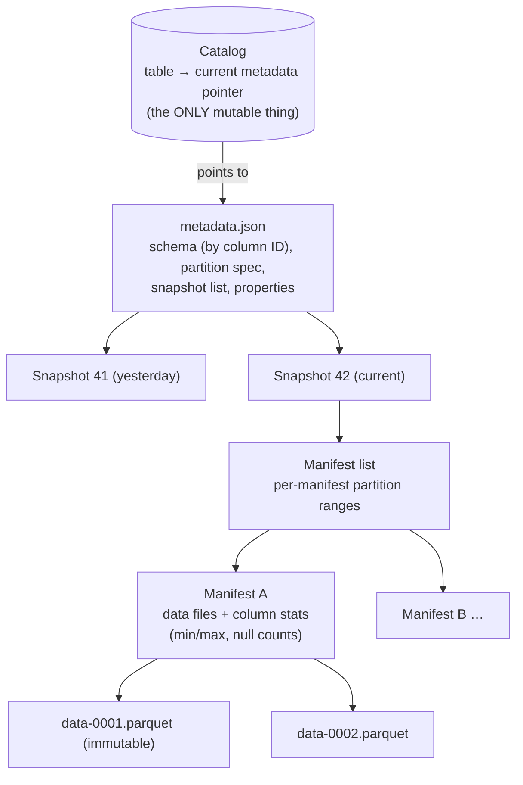
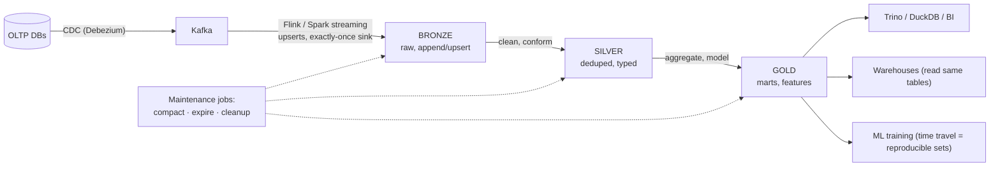

# Lakehouse and Open Table Formats

## TL;DR

The lakehouse collapses the two-copy world — a data lake for cheap storage plus a warehouse for reliable SQL — into one: **open table formats** (Apache Iceberg, Delta Lake, Apache Hudi) layer ACID transactions, schema evolution, time travel, and sane partitioning over plain Parquet files in [object storage](../03-storage-engines/08-object-storage.md), readable by every engine (Spark, Flink, Trino, DuckDB, and the warehouses themselves). The mechanism is a **metadata tree + atomic pointer swap**: data files are immutable; a commit is one compare-and-swap on the current-snapshot pointer in a **catalog** — which is why the catalog has become the new control point of the data platform. The operational truth nobody markets: tables need **maintenance** — compaction, snapshot expiry, orphan cleanup — as a first-class scheduled workload, or your lakehouse degrades back into the swamp it replaced.

---

## The Problem: Directories of Parquet Are Not Tables

The first-generation data lake was a directory convention: `s3://lake/events/date=2026-06-11/*.parquet`, schema-on-read, every engine for itself. It fails in predictable ways:

- **No atomic multi-file commits.** A job writing 500 files that dies at 300 leaves readers seeing half a dataset. "Commit by directory rename" doesn't exist on object stores ([no rename](../03-storage-engines/08-object-storage.md)).
- **No isolation.** Readers list files while writers add them — every report is potentially a phantom read.
- **Schema drift.** Producer adds a column; half the consumers crash, the other half silently read nulls.
- **Partition rigidity.** The directory layout *is* the partitioning; changing granularity (daily → hourly) means rewriting the world, and every analyst must know magic predicates (`WHERE date = ...`) or full-scan.
- **Small files.** Streaming ingestion drips thousands of KB-sized files; listing and opening them dominates query time.

The warehouse solved all of this decades ago — by owning the storage. Table formats solve it **without** owning the storage, which is the entire point: one copy of the data, many engines, no vendor's wall around your bytes.

---

## How Table Formats Work

Iceberg's structure (Delta and Hudi differ in vocabulary, not essence):

**A commit is a pointer swap.** A writer stages new immutable data files, writes new manifests and a new `metadata.json`, then performs one atomic **compare-and-swap** in the catalog: "if current == v41, set current → v42." Concurrent writers use optimistic concurrency — the loser re-checks for real conflicts (same files/partitions touched) and retries or aborts. That single CAS gives you:

- **ACID over object storage** — readers resolve the pointer once and see one consistent snapshot for their whole query (snapshot isolation; no half-written directories, ever).
- **Time travel & rollback** — old snapshots remain until expired: `SELECT ... FOR VERSION AS OF 41`, instant rollback by re-pointing, reproducible ML training sets and audits.
- **Schema evolution that's metadata-only** — columns tracked by **ID**, not name or position, so rename/add/drop/reorder/widen never rewrites data files and never resurrects a dropped column's bytes into a new column ([the expand/contract discipline](../15-deployment/03-database-migrations.md), enforced structurally).
- **Hidden partitioning & partition evolution** (Iceberg's signature) — the table stores transforms (`days(ts)`, `bucket(64, user_id)`); queries on raw columns (`WHERE ts > ...`) prune automatically without magic predicates, and the spec can change for *future* data without rewriting old files.
- **Statistics-driven pruning** — manifests carry min/max/null-count per column per file; planners skip whole files and manifests before touching Parquet footers. At scale this metadata pruning, not raw I/O, is where query performance lives.

### The formats, honestly

| | Iceberg | Delta Lake | Hudi |
|---|---|---|---|
| Origin / instinct | Netflix; spec-first, engine-neutral | Databricks; Spark-native, deepest Databricks polish | Uber; streaming upserts/CDC-first |
| Commit metadata | Snapshot tree + catalog CAS | `_delta_log/` ordered JSON + checkpoints | Timeline + file groups |
| Signature strengths | Hidden partitioning, partition evolution, REST catalog spec | Maturity in Spark ecosystem, UniForm interop | Record-level index, merge-on-read upsert latency |
| Streaming upserts | Good (MoR deletes, equality/position deletes) | Good | Strongest heritage |
| Ecosystem trajectory | The de facto neutral standard — warehouses (Snowflake, BigQuery, Redshift), Databricks (post-Tabular), and every query engine read/write it | Converging via UniForm (Delta tables exposing Iceberg metadata) | Healthy but narrower |

The 2024–2026 storyline is **convergence on Iceberg as the interchange layer** (Databricks acquiring Tabular; UniForm and Apache XTable translating metadata between formats). Choose by ecosystem gravity: greenfield multi-engine → Iceberg; deep Databricks → Delta (with UniForm); streaming-upsert-heavy heritage → evaluate Hudi. The data files are Parquet either way — the format war is a metadata war.

### Copy-on-write vs merge-on-read

Updates and deletes on immutable files come in two flavors: **copy-on-write** rewrites affected data files at commit time (slower writes, fastest reads — right for batch), while **merge-on-read** writes small delete/delta files that readers merge at query time (fast streaming writes, slower reads until compaction folds them in — right for CDC ingestion). Most real tables run MoR for ingest with scheduled compaction to CoW-like read performance — which leads directly to:

---

## Operations: Maintenance Is Not Optional

A lakehouse table is a living structure. Schedule, per table, as real pipelines with [SLOs](../11-observability/05-slos-error-budgets.md):

- **Compaction** — rewrite small files into ~128–512MB targets, fold merge-on-read deletes in, optionally re-sort/cluster (z-order) hot predicate columns. Streaming tables without compaction degrade within *days*.
- **Snapshot expiry** — time travel is storage; expire snapshots past your audit/reproducibility window or pay for every version forever.
- **Orphan file cleanup** — failed jobs leave staged files no snapshot references; sweep them (carefully — race windows with in-flight commits are the classic footgun).
- **Manifest rewriting** — metadata itself fragments under frequent commits.

And the architectural decision: **the catalog is the control point.** It's where the CAS lives, where access control attaches, and increasingly where governance happens (Polaris, Unity, Nessie — the last adding git-like branches/tags on tables: write to a branch, validate, fast-forward to main — [CI/CD for data](../15-deployment/04-cicd-gitops.md)). The REST catalog spec decoupled this from Hive's legacy; treat catalog choice with the seriousness you'd give a database choice, because migrating catalogs later is migrating *every table's commit root*.

### The pipeline shape

[CDC](./04-change-data-capture.md) into bronze ([streaming](./02-stream-processing.md) with exactly-once sinks via Iceberg/Delta transactional commits), medallion refinement, and every consumer — interactive SQL, warehouse, ML — reading the *same* governed tables. This is the [lambda/kappa](./03-lambda-kappa-architecture.md) debate dissolving: one storage layer serves both batch and streaming because commits are cheap and atomic.

### When the warehouse still wins

Sub-second interactive BI on hot data, heavy concurrent small queries, zero appetite for maintenance operations — a managed warehouse remains the right tool, and the modern ones read Iceberg anyway, which is exactly the point: the lakehouse decision is no longer *either/or*; it's "own your storage layer in an open format, and let warehouses be one of several compute engines over it."

---

## References

- [Lakehouse: A New Generation of Open Platforms that Unify Data Warehousing and Advanced Analytics](https://www.cidrdb.org/cidr2021/papers/cidr2021_paper17.pdf) — CIDR '21; the thesis paper
- [Apache Iceberg spec](https://iceberg.apache.org/spec/) — the metadata tree, precisely; and [the REST catalog spec](https://iceberg.apache.org/concepts/catalog/)
- [Delta Lake: High-Performance ACID Table Storage over Cloud Object Stores](https://www.vldb.org/pvldb/vol13/p3411-armbrust.pdf) — VLDB '20
- [Apache Hudi docs](https://hudi.apache.org/docs/overview) — merge-on-read and record-level indexing
- [Apache XTable](https://xtable.apache.org/) — cross-format metadata translation
- [Project Nessie](https://projectnessie.org/) — git-like semantics over Iceberg tables
