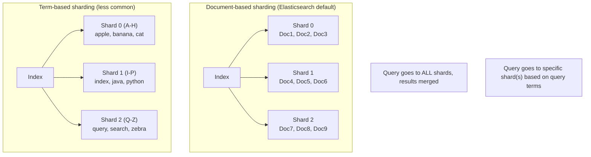
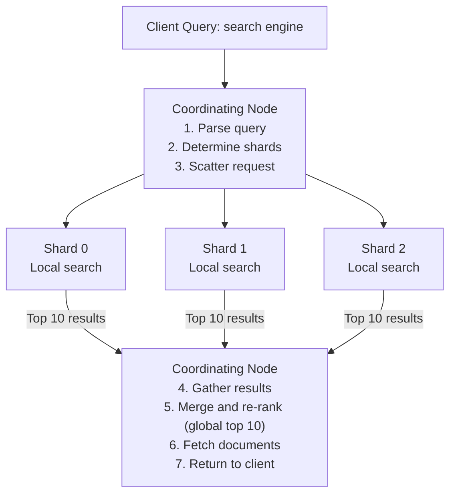

# Inverted Indexes

## TL;DR

An inverted index maps terms to the documents containing them, enabling fast full-text search. Instead of scanning every document, you look up the term and get all matching documents instantly. This is the foundation of search engines like Elasticsearch, Solr, and Lucene.

---

## The Problem Inverted Indexes Solve

### Forward Index (Traditional Database)

```
Document → Terms

┌─────────────────────────────────────────────────────────────┐
│ Doc1: "The quick brown fox jumps over the lazy dog"        │
│ Doc2: "The quick brown dog runs in the park"               │
│ Doc3: "A lazy cat sleeps on the couch"                     │
└─────────────────────────────────────────────────────────────┘

Query: Find documents containing "lazy"

Process:
1. Scan Doc1: "The quick brown fox..." → Contains "lazy"? YES
2. Scan Doc2: "The quick brown dog..." → Contains "lazy"? NO
3. Scan Doc3: "A lazy cat sleeps..."   → Contains "lazy"? YES

Time complexity: O(N × M) where N = documents, M = avg document length
For 1 billion documents: SLOW
```

### Inverted Index (Search Engine)

```
Term → Documents

┌─────────────────────────────────────────────────────────────┐
│ "lazy"  → [Doc1, Doc3]                                      │
│ "quick" → [Doc1, Doc2]                                      │
│ "brown" → [Doc1, Doc2]                                      │
│ "dog"   → [Doc1, Doc2]                                      │
│ "cat"   → [Doc3]                                            │
│ "fox"   → [Doc1]                                            │
│ ...                                                         │
└─────────────────────────────────────────────────────────────┘

Query: Find documents containing "lazy"

Process:
1. Look up "lazy" in index → [Doc1, Doc3]

Time complexity: O(1) lookup + O(k) where k = matching documents
For 1 billion documents: FAST
```

---

## Index Structure

### Basic Inverted Index

```
┌─────────────────────────────────────────────────────────────────┐
│                      INVERTED INDEX                              │
│                                                                 │
│  ┌─────────────┐     ┌──────────────────────────────────────┐  │
│  │  Dictionary │     │           Postings Lists             │  │
│  │   (Terms)   │     │                                      │  │
│  ├─────────────┤     ├──────────────────────────────────────┤  │
│  │ "apple"   ──┼────►│ [1, 5, 23, 45, 67, 89, ...]         │  │
│  │ "banana"  ──┼────►│ [2, 34, 56, 78, ...]                │  │
│  │ "cherry"  ──┼────►│ [3, 12, 45, ...]                    │  │
│  │ "date"    ──┼────►│ [7, 89, 234, ...]                   │  │
│  │ ...         │     │                                      │  │
│  └─────────────┘     └──────────────────────────────────────┘  │
│                                                                 │
│  Dictionary: B-tree or Hash table for O(1) or O(log n) lookup  │
│  Postings: Sorted document IDs for efficient intersection      │
└─────────────────────────────────────────────────────────────────┘
```

### Enhanced Postings List

```
Term: "search"

Simple posting: [1, 5, 23, 45]

Enhanced posting with positions (for phrase queries):
[
  (doc_id=1, positions=[5, 23, 89]),      # "search" appears at word 5, 23, 89
  (doc_id=5, positions=[12]),
  (doc_id=23, positions=[1, 45, 67]),
  (doc_id=45, positions=[33])
]

Enhanced posting with term frequency (for relevance scoring):
[
  (doc_id=1, tf=3, positions=[5, 23, 89]),
  (doc_id=5, tf=1, positions=[12]),
  (doc_id=23, tf=3, positions=[1, 45, 67]),
  (doc_id=45, tf=1, positions=[33])
]
```

---

## Index Construction

### Basic Algorithm

```python
from collections import defaultdict
import re

class InvertedIndex:
    def __init__(self):
        self.index = defaultdict(list)
        self.documents = {}
    
    def add_document(self, doc_id, text):
        # Store original document
        self.documents[doc_id] = text
        
        # Tokenize
        tokens = self.tokenize(text)
        
        # Build index
        for position, token in enumerate(tokens):
            # Normalize
            term = self.normalize(token)
            
            # Add to postings list
            self.index[term].append({
                'doc_id': doc_id,
                'position': position
            })
    
    def tokenize(self, text):
        """Split text into tokens"""
        return re.findall(r'\b\w+\b', text.lower())
    
    def normalize(self, token):
        """Normalize token (lowercase, stem, etc.)"""
        return token.lower()
    
    def search(self, query):
        """Search for documents containing query term"""
        term = self.normalize(query)
        postings = self.index.get(term, [])
        return [p['doc_id'] for p in postings]
```

### Scalable Index Construction (MapReduce)

```python
# Map phase: Emit (term, doc_id) pairs
def map(doc_id, document):
    tokens = tokenize(document)
    for position, token in enumerate(tokens):
        term = normalize(token)
        emit(term, (doc_id, position))

# Reduce phase: Build postings list for each term
def reduce(term, doc_positions):
    postings = sorted(doc_positions, key=lambda x: x[0])  # Sort by doc_id
    emit(term, postings)

# Example:
# Doc1: "the cat sat"
# Doc2: "the dog ran"
#
# Map output:
#   ("the", (1, 0)), ("cat", (1, 1)), ("sat", (1, 2))
#   ("the", (2, 0)), ("dog", (2, 1)), ("ran", (2, 2))
#
# Shuffle (group by key):
#   "the" → [(1, 0), (2, 0)]
#   "cat" → [(1, 1)]
#   ...
#
# Reduce output:
#   "the" → [(1, 0), (2, 0)]
#   "cat" → [(1, 1)]
```

---

## Query Processing

### Single Term Query

```python
def search_single_term(self, term):
    normalized = self.normalize(term)
    return self.index.get(normalized, [])

# Query: "lazy"
# Result: [Doc1, Doc3]
```

### Boolean Queries (AND, OR, NOT)

```python
def search_boolean(self, terms, operator='AND'):
    if not terms:
        return []
    
    # Get postings for first term
    result = set(self.search_single_term(terms[0]))
    
    for term in terms[1:]:
        term_docs = set(self.search_single_term(term))
        
        if operator == 'AND':
            result = result.intersection(term_docs)
        elif operator == 'OR':
            result = result.union(term_docs)
        elif operator == 'NOT':
            result = result.difference(term_docs)
    
    return list(result)

# Query: "quick AND brown"
# Postings: quick → [Doc1, Doc2], brown → [Doc1, Doc2]
# Result: [Doc1, Doc2]  (intersection)

# Query: "lazy OR quick"
# Postings: lazy → [Doc1, Doc3], quick → [Doc1, Doc2]
# Result: [Doc1, Doc2, Doc3]  (union)
```

### Phrase Queries

```python
def search_phrase(self, phrase):
    """Find documents where terms appear consecutively"""
    terms = self.tokenize(phrase)
    if not terms:
        return []
    
    # Get postings with positions
    postings = [self.get_postings_with_positions(t) for t in terms]
    
    # Find documents containing all terms
    candidate_docs = set.intersection(*[set(p.keys()) for p in postings])
    
    results = []
    for doc_id in candidate_docs:
        # Check if terms appear consecutively
        if self.terms_consecutive(doc_id, postings):
            results.append(doc_id)
    
    return results

def terms_consecutive(self, doc_id, postings):
    """Check if term positions are consecutive"""
    # Get positions for each term in this document
    positions_list = [p[doc_id] for p in postings]
    
    # Check if there's a sequence where positions differ by 1
    for start_pos in positions_list[0]:
        found = True
        current_pos = start_pos
        
        for positions in positions_list[1:]:
            current_pos += 1
            if current_pos not in positions:
                found = False
                break
        
        if found:
            return True
    
    return False

# Query: "quick brown"
# Doc1 positions: quick→[1], brown→[2]
# Positions differ by 1 → Match!
```

### Wildcard Queries

```python
# Permuterm Index for wildcard queries
# For term "hello": store h$ello, e$hellO, l$helo, l$hel, o$hell, $hello
# Query "hel*" → look up "$hel" (rotate until * is at end)

class PermutermIndex:
    def __init__(self):
        self.permuterm = {}  # permuterm → original term
    
    def add_term(self, term):
        term_with_marker = term + '$'
        for i in range(len(term_with_marker)):
            rotated = term_with_marker[i:] + term_with_marker[:i]
            self.permuterm[rotated] = term
    
    def search_wildcard(self, pattern):
        """Search for pattern with * wildcard"""
        # Rotate pattern until * is at the end
        pattern = pattern + '$'
        while not pattern.endswith('*'):
            pattern = pattern[-1] + pattern[:-1]
        
        # Remove * and search
        prefix = pattern[:-1]
        
        # Find all terms matching prefix
        matches = []
        for permuterm, term in self.permuterm.items():
            if permuterm.startswith(prefix):
                matches.append(term)
        
        return matches
```

---

## Index Compression

### Gap Encoding

```
Original posting list: [1, 5, 23, 45, 67, 89]
Gap encoded:          [1, 4, 18, 22, 22, 22]

First value stored as-is, subsequent values as difference from previous
1, 5-1=4, 23-5=18, 45-23=22, 67-45=22, 89-67=22

Benefits:
- Gaps are usually small numbers
- Small numbers compress better
```

### Variable Byte Encoding

```
Encode integers using variable number of bytes
High bit = 1 means more bytes follow

Number 5:     00000101 (1 byte)
Number 130:   10000001 00000010 (2 bytes)
              ↑        ↑
              continue  final

Savings for posting list [1, 5, 23, 45, 67, 89]:
Fixed 4-byte integers: 24 bytes
Variable byte encoded: 6 bytes (each gap fits in 1 byte)
```

### Posting List Compression Example

```python
class CompressedPostings:
    def compress(self, doc_ids):
        """Compress sorted doc IDs using gap encoding + variable byte"""
        if not doc_ids:
            return bytes()
        
        result = []
        prev = 0
        
        for doc_id in sorted(doc_ids):
            gap = doc_id - prev
            result.extend(self.encode_vbyte(gap))
            prev = doc_id
        
        return bytes(result)
    
    def encode_vbyte(self, n):
        """Variable byte encoding"""
        bytes_list = []
        while n >= 128:
            bytes_list.append((n & 0x7F) | 0x80)  # Set high bit
            n >>= 7
        bytes_list.append(n)  # Final byte (high bit = 0)
        return bytes_list
    
    def decompress(self, compressed):
        """Decompress back to doc IDs"""
        doc_ids = []
        current_doc = 0
        
        i = 0
        while i < len(compressed):
            gap, bytes_read = self.decode_vbyte(compressed, i)
            current_doc += gap
            doc_ids.append(current_doc)
            i += bytes_read
        
        return doc_ids
```

---

## Lucene Segment Architecture

### Segment Structure

```
┌─────────────────────────────────────────────────────────────────┐
│                         Lucene Index                             │
│                                                                 │
│  ┌───────────────┐ ┌───────────────┐ ┌───────────────┐         │
│  │   Segment 0   │ │   Segment 1   │ │   Segment 2   │         │
│  │   (immutable) │ │   (immutable) │ │   (immutable) │   ...   │
│  │               │ │               │ │               │         │
│  │ • Term Dict   │ │ • Term Dict   │ │ • Term Dict   │         │
│  │ • Postings    │ │ • Postings    │ │ • Postings    │         │
│  │ • Stored Flds │ │ • Stored Flds │ │ • Stored Flds │         │
│  │ • Doc Values  │ │ • Doc Values  │ │ • Doc Values  │         │
│  │ • Norms       │ │ • Norms       │ │ • Norms       │         │
│  └───────────────┘ └───────────────┘ └───────────────┘         │
│                                                                 │
│  Commits: List of segments to include in searches              │
│  Deletes: Bitmap of deleted docs per segment                   │
└─────────────────────────────────────────────────────────────────┘

Write path:
1. Documents buffered in memory
2. Flush to new segment when buffer full
3. Segments are immutable once written

Delete path:
1. Mark document as deleted in bitmap
2. Document still exists in segment
3. Filtered out during search
4. Removed during segment merge
```

### Segment Merging

```
Before merge:
┌────────┐ ┌────────┐ ┌────────┐ ┌────────┐ ┌────────┐
│ Seg 0  │ │ Seg 1  │ │ Seg 2  │ │ Seg 3  │ │ Seg 4  │
│ 100 docs│ │ 100 docs│ │ 100 docs│ │ 100 docs│ │ 100 docs│
└────────┘ └────────┘ └────────┘ └────────┘ └────────┘

Merge policy triggers (e.g., TieredMergePolicy):

After merge:
┌───────────────────────────────────────────┐ ┌────────┐
│              Segment 5                     │ │ Seg 4  │
│              400 docs                      │ │ 100 docs│
│     (merged from Seg 0-3, deletes purged) │ │        │
└───────────────────────────────────────────┘ └────────┘

Benefits of merging:
- Reclaim space from deleted docs
- Reduce number of segments to search
- Improve compression

Costs:
- I/O intensive
- Temporary disk space
```

---

## Distributed Indexing

### Sharding Strategies



### Query Execution



---

## Best Practices

### Index Design

```
1. Choose appropriate analyzers
   - Language-specific for text content
   - Keyword for exact match fields (IDs, status)
   
2. Map field types correctly
   - text: Full-text searchable
   - keyword: Exact match, aggregations
   - numeric: Range queries, sorting
   
3. Denormalize for search
   - Avoid joins at query time
   - Store related data together
   
4. Use doc values for sorting/aggregations
   - Column-oriented storage
   - Much faster than fielddata
```

### Query Optimization

```
1. Use filters for non-scoring criteria
   - Filters are cached
   - Don't contribute to relevance score
   
2. Limit returned fields
   - Only fetch what you need
   - Use _source filtering

3. Paginate with search_after, not offset
   - Offset requires computing all preceding results
   - search_after is O(1)

4. Use routing for related documents
   - Colocate documents that are searched together
   - Reduces fan-out to shards
```

---

## References

- [Introduction to Information Retrieval](https://nlp.stanford.edu/IR-book/)
- [Lucene Core Documentation](https://lucene.apache.org/core/)
- [Elasticsearch: The Definitive Guide](https://www.elastic.co/guide/en/elasticsearch/guide/current/index.html)
- [The Anatomy of a Large-Scale Search Engine](http://infolab.stanford.edu/~backrub/google.html)
