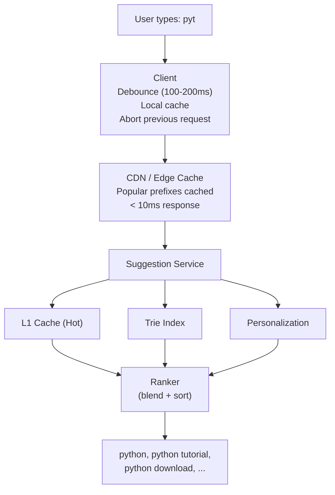
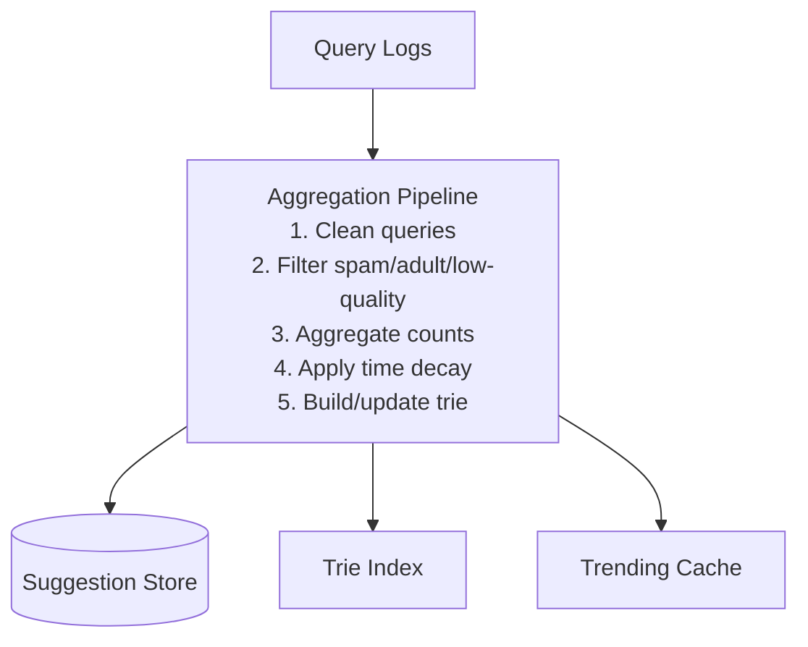
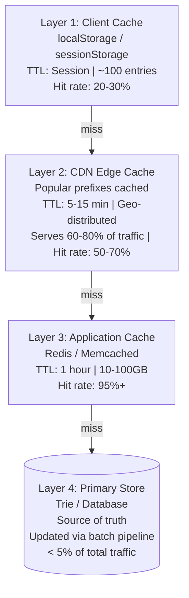

# Typeahead and Autocomplete

## TL;DR

Typeahead (autocomplete) provides real-time query suggestions as users type, improving search experience and guiding users to better queries. Key challenges include sub-50ms latency requirements, handling millions of queries, personalization, and trending content. Common implementations use tries, prefix trees, or precomputed suggestion lists with tiered caching.

---

## The Problem

### Why Typeahead Matters

```
┌─────────────────────────────────────────────────────────────────┐
│                    Value of Typeahead                            │
│                                                                 │
│   User Experience:                                              │
│   • Faster query entry (fewer keystrokes)                       │
│   • Spell correction ("pythn" → "python")                       │
│   • Query discovery (see what others search)                    │
│   • Reduced cognitive load                                      │
│                                                                 │
│   Business Value:                                               │
│   • Higher engagement (users search more)                       │
│   • Better conversions (guided to good queries)                 │
│   • Reduced zero-result searches                                │
│   • Opportunity for promotions/trending                         │
│                                                                 │
│   Typical Impact:                                               │
│   • 10-25% increase in searches                                 │
│   • 5-15% improvement in CTR                                    │
│   • Significant reduction in query abandonment                  │
└─────────────────────────────────────────────────────────────────┘
```

### Requirements

```
Functional Requirements:
• Suggest completions as user types
• Support prefix matching ("pyt" → "python")
• Rank suggestions by relevance/popularity
• Handle typos and corrections
• Personalize based on user history

Non-Functional Requirements:
• Latency: < 50ms p99 (perceived as instant)
• Scale: 100K+ QPS for large sites
• Freshness: Trending queries within minutes
• Availability: 99.99% (core user experience)
```

---

## System Architecture

### High-Level Design



### Data Flow



```
Update frequency:
• Full rebuild: Daily
• Incremental: Hourly
• Trending: Every few minutes
```

---

## Data Structures

### Trie (Prefix Tree)

```python
class TrieNode:
    def __init__(self):
        self.children = {}  # char → TrieNode
        self.is_end = False
        self.query = None  # Full query if is_end
        self.count = 0  # Popularity count
        self.top_suggestions = []  # Precomputed top K

class Trie:
    def __init__(self):
        self.root = TrieNode()
    
    def insert(self, query, count=1):
        """Insert a query with its popularity count"""
        node = self.root
        
        for char in query.lower():
            if char not in node.children:
                node.children[char] = TrieNode()
            node = node.children[char]
        
        node.is_end = True
        node.query = query
        node.count += count
    
    def search_prefix(self, prefix, limit=10):
        """Find all queries with given prefix"""
        node = self.root
        
        # Navigate to prefix node
        for char in prefix.lower():
            if char not in node.children:
                return []
            node = node.children[char]
        
        # If precomputed suggestions exist, return them
        if node.top_suggestions:
            return node.top_suggestions[:limit]
        
        # Otherwise, collect all completions
        results = []
        self._collect_suggestions(node, results)
        
        # Sort by count and return top K
        results.sort(key=lambda x: -x[1])
        return [q for q, _ in results[:limit]]
    
    def _collect_suggestions(self, node, results):
        """DFS to collect all suggestions under node"""
        if node.is_end:
            results.append((node.query, node.count))
        
        for child in node.children.values():
            self._collect_suggestions(child, results)
    
    def precompute_suggestions(self, k=10):
        """Precompute top-K suggestions for each node"""
        self._precompute_node(self.root, k)
    
    def _precompute_node(self, node, k):
        """Bottom-up precomputation"""
        # First, precompute children
        for child in node.children.values():
            self._precompute_node(child, k)
        
        # Collect suggestions from this subtree
        all_suggestions = []
        
        if node.is_end:
            all_suggestions.append((node.query, node.count))
        
        for child in node.children.values():
            all_suggestions.extend(
                (q, c) for q, c in zip(
                    child.top_suggestions,
                    [self._get_count(child, q) for q in child.top_suggestions]
                )
            )
        
        # Keep top K
        all_suggestions.sort(key=lambda x: -x[1])
        node.top_suggestions = [q for q, _ in all_suggestions[:k]]

# Usage
trie = Trie()
trie.insert("python", 100000)
trie.insert("python tutorial", 50000)
trie.insert("python download", 30000)
trie.insert("pytorch", 20000)

trie.precompute_suggestions(k=10)

print(trie.search_prefix("pyt"))
# ["python", "python tutorial", "python download", "pytorch"]
```

### Compressed Trie (Radix Tree)

```python
class RadixNode:
    """
    Radix tree compresses chains of single-child nodes
    
    Trie:                    Radix Tree:
        p                        python
        │                        /    \
        y                      (end)  (space)
        │                              │
        t                           tutorial
        │                              │
        h                            (end)
        │
        o
        │
        n
       / \
    (end) (space)
             │
             t
             │
             ...
    
    Benefits: Less memory, better cache locality
    """
    
    def __init__(self):
        self.children = {}  # prefix_string → RadixNode
        self.is_end = False
        self.query = None
        self.count = 0

class RadixTree:
    def __init__(self):
        self.root = RadixNode()
    
    def insert(self, query, count=1):
        node = self.root
        remaining = query.lower()
        
        while remaining:
            # Find matching child
            match_found = False
            for prefix, child in node.children.items():
                common_len = self._common_prefix_length(remaining, prefix)
                
                if common_len == 0:
                    continue
                
                match_found = True
                
                if common_len == len(prefix):
                    # Full match, continue down
                    node = child
                    remaining = remaining[common_len:]
                else:
                    # Partial match, need to split
                    self._split_node(node, prefix, common_len)
                    node = node.children[prefix[:common_len]]
                    remaining = remaining[common_len:]
                break
            
            if not match_found:
                # No match, create new node
                new_node = RadixNode()
                new_node.is_end = True
                new_node.query = query
                new_node.count = count
                node.children[remaining] = new_node
                return
        
        # Reached end of query
        node.is_end = True
        node.query = query
        node.count += count
    
    def _common_prefix_length(self, s1, s2):
        length = 0
        for c1, c2 in zip(s1, s2):
            if c1 != c2:
                break
            length += 1
        return length
    
    def _split_node(self, parent, prefix, split_pos):
        """Split a node at given position"""
        child = parent.children.pop(prefix)
        
        # Create intermediate node
        new_node = RadixNode()
        new_node.children[prefix[split_pos:]] = child
        
        parent.children[prefix[:split_pos]] = new_node
```

### Precomputed Suggestion Lists

```python
class PrecomputedSuggestions:
    """
    For very high QPS, precompute all suggestions
    
    Trade-off: More storage, faster lookups
    """
    
    def __init__(self, max_prefix_length=10, suggestions_per_prefix=10):
        self.max_prefix_length = max_prefix_length
        self.k = suggestions_per_prefix
        self.prefix_map = {}  # prefix → [(query, score), ...]
    
    def build(self, query_counts):
        """
        Build suggestion lists for all prefixes
        
        query_counts: dict of query → count
        """
        # Group queries by all their prefixes
        prefix_queries = defaultdict(list)
        
        for query, count in query_counts.items():
            query_lower = query.lower()
            for i in range(1, min(len(query_lower) + 1, self.max_prefix_length + 1)):
                prefix = query_lower[:i]
                prefix_queries[prefix].append((query, count))
        
        # Sort and keep top K for each prefix
        for prefix, queries in prefix_queries.items():
            queries.sort(key=lambda x: -x[1])
            self.prefix_map[prefix] = queries[:self.k]
    
    def get_suggestions(self, prefix):
        """O(1) lookup"""
        return self.prefix_map.get(prefix.lower(), [])
    
    def serialize(self, path):
        """Serialize for distribution"""
        with open(path, 'wb') as f:
            pickle.dump(self.prefix_map, f)
    
    @classmethod
    def load(cls, path):
        instance = cls()
        with open(path, 'rb') as f:
            instance.prefix_map = pickle.load(f)
        return instance

# Storage estimation
# 10M unique queries, avg 20 chars
# Max prefix length 10
# Each query appears in ~10 prefix lists
# ~100M entries × (20 bytes query + 8 bytes score) = ~3GB
```

---

## Ranking Suggestions

### Multi-Signal Ranking

```python
class SuggestionRanker:
    """
    Rank suggestions using multiple signals
    """
    
    def __init__(self, weights=None):
        self.weights = weights or {
            'popularity': 0.4,
            'freshness': 0.2,
            'user_affinity': 0.2,
            'exact_match': 0.1,
            'length_penalty': 0.1
        }
    
    def rank(self, prefix, candidates, user_context=None):
        """
        Rank candidates for given prefix
        """
        scored = []
        
        for query, base_count in candidates:
            score = 0
            
            # Popularity (log scale to prevent domination)
            score += self.weights['popularity'] * np.log1p(base_count)
            
            # Freshness (recent searches weighted higher)
            freshness = self.get_freshness_score(query)
            score += self.weights['freshness'] * freshness
            
            # User affinity (personalization)
            if user_context:
                affinity = self.get_user_affinity(query, user_context)
                score += self.weights['user_affinity'] * affinity
            
            # Exact prefix match bonus
            if query.lower().startswith(prefix.lower()):
                score += self.weights['exact_match']
            
            # Length penalty (prefer shorter, more general queries)
            length_penalty = 1.0 / (1 + len(query) * 0.05)
            score += self.weights['length_penalty'] * length_penalty
            
            scored.append((query, score))
        
        # Sort by score descending
        scored.sort(key=lambda x: -x[1])
        return [q for q, s in scored]
    
    def get_freshness_score(self, query):
        """Score based on recency of query popularity"""
        # Example: exponential decay over 7 days
        last_seen = self.query_recency.get(query, 7)  # days ago
        return np.exp(-last_seen / 3)  # Half-life of 3 days
    
    def get_user_affinity(self, query, user_context):
        """Personalized score based on user history"""
        # Check if user searched this before
        if query in user_context.recent_queries:
            return 1.0
        
        # Check topic similarity
        query_topics = self.get_query_topics(query)
        user_topics = user_context.interest_topics
        
        overlap = len(query_topics & user_topics)
        return overlap / (len(query_topics) + 1)
```

### Trending Boost

```python
class TrendingDetector:
    """
    Detect and boost trending queries
    """
    
    def __init__(self, window_minutes=60, threshold_multiplier=3):
        self.window = window_minutes
        self.threshold = threshold_multiplier
        self.query_history = defaultdict(list)  # query → [timestamps]
    
    def record_query(self, query, timestamp=None):
        """Record a query occurrence"""
        timestamp = timestamp or time.time()
        self.query_history[query].append(timestamp)
        
        # Trim old data
        cutoff = timestamp - self.window * 60
        self.query_history[query] = [
            t for t in self.query_history[query]
            if t > cutoff
        ]
    
    def get_trending_score(self, query):
        """
        Compare current rate to baseline
        
        trending_score > 1 means above baseline
        """
        current_count = len(self.query_history[query])
        baseline_count = self.get_baseline(query)
        
        if baseline_count == 0:
            return current_count  # New query
        
        return current_count / baseline_count
    
    def get_trending_queries(self, top_k=100):
        """Get top trending queries"""
        scores = []
        
        for query in self.query_history:
            score = self.get_trending_score(query)
            if score >= self.threshold:
                scores.append((query, score))
        
        scores.sort(key=lambda x: -x[1])
        return scores[:top_k]

# Integration with ranker
def boost_trending(candidates, trending_queries, boost_factor=2.0):
    """Boost trending queries in results"""
    trending_set = set(trending_queries)
    
    boosted = []
    for query, score in candidates:
        if query in trending_set:
            score *= boost_factor
        boosted.append((query, score))
    
    return boosted
```

---

## Handling Typos

### Fuzzy Matching

```python
class FuzzyMatcher:
    """
    Handle typos in typeahead queries
    """
    
    def __init__(self, vocabulary, max_edit_distance=2):
        self.vocabulary = vocabulary
        self.max_distance = max_edit_distance
        self.bk_tree = self.build_bk_tree(vocabulary)
    
    def get_corrections(self, query, limit=5):
        """
        Find similar queries within edit distance
        """
        candidates = self.bk_tree.search(query, self.max_distance)
        
        # Sort by edit distance, then by popularity
        candidates.sort(key=lambda x: (x[1], -self.vocabulary[x[0]]))
        
        return [c[0] for c in candidates[:limit]]
    
    def build_bk_tree(self, vocabulary):
        """Build BK-tree for efficient fuzzy search"""
        tree = BKTree(levenshtein_distance)
        for word in vocabulary:
            tree.add(word)
        return tree

def levenshtein_distance(s1, s2):
    """Classic edit distance"""
    if len(s1) < len(s2):
        return levenshtein_distance(s2, s1)
    
    if len(s2) == 0:
        return len(s1)
    
    prev_row = range(len(s2) + 1)
    
    for i, c1 in enumerate(s1):
        curr_row = [i + 1]
        for j, c2 in enumerate(s2):
            insertions = prev_row[j + 1] + 1
            deletions = curr_row[j] + 1
            substitutions = prev_row[j] + (c1 != c2)
            curr_row.append(min(insertions, deletions, substitutions))
        prev_row = curr_row
    
    return prev_row[-1]

class BKTree:
    """BK-Tree for efficient fuzzy matching"""
    
    def __init__(self, distance_func):
        self.distance = distance_func
        self.root = None
    
    def add(self, word):
        if self.root is None:
            self.root = (word, {})
            return
        
        node = self.root
        while True:
            d = self.distance(word, node[0])
            if d in node[1]:
                node = node[1][d]
            else:
                node[1][d] = (word, {})
                break
    
    def search(self, word, max_distance):
        """Find all words within max_distance"""
        if self.root is None:
            return []
        
        results = []
        candidates = [self.root]
        
        while candidates:
            node = candidates.pop()
            d = self.distance(word, node[0])
            
            if d <= max_distance:
                results.append((node[0], d))
            
            # Only explore children within range
            for dist, child in node[1].items():
                if abs(dist - d) <= max_distance:
                    candidates.append(child)
        
        return results
```

### Phonetic Matching

```python
import jellyfish

class PhoneticMatcher:
    """
    Match queries that sound similar
    
    "jon" should suggest "john"
    "kathy" should suggest "cathy"
    """
    
    def __init__(self, vocabulary):
        self.vocabulary = vocabulary
        self.soundex_index = self.build_soundex_index(vocabulary)
        self.metaphone_index = self.build_metaphone_index(vocabulary)
    
    def build_soundex_index(self, vocabulary):
        """Index by Soundex code"""
        index = defaultdict(list)
        for word in vocabulary:
            code = jellyfish.soundex(word)
            index[code].append(word)
        return index
    
    def build_metaphone_index(self, vocabulary):
        """Index by Double Metaphone"""
        index = defaultdict(list)
        for word in vocabulary:
            primary, secondary = jellyfish.metaphone(word), None
            index[primary].append(word)
            if secondary:
                index[secondary].append(word)
        return index
    
    def get_phonetic_matches(self, query, method='metaphone'):
        """Find phonetically similar queries"""
        if method == 'soundex':
            code = jellyfish.soundex(query)
            return self.soundex_index.get(code, [])
        else:
            code = jellyfish.metaphone(query)
            return self.metaphone_index.get(code, [])

# Example
vocabulary = {"john", "jon", "joan", "jane", "cathy", "kathy"}
matcher = PhoneticMatcher(vocabulary)

print(matcher.get_phonetic_matches("jon"))   # ["john", "jon", "joan"]
print(matcher.get_phonetic_matches("kathy")) # ["cathy", "kathy"]
```

---

## Personalization

### User-Based Suggestions

```python
class PersonalizedTypeahead:
    """
    Personalize suggestions based on user history
    """
    
    def __init__(self, global_trie):
        self.global_trie = global_trie
        self.user_histories = {}  # user_id → recent queries
    
    def get_suggestions(self, prefix, user_id, limit=10):
        """
        Blend global and personal suggestions
        """
        # Get global suggestions
        global_suggestions = self.global_trie.search_prefix(prefix, limit * 2)
        
        # Get personal suggestions
        personal_suggestions = self.get_personal_suggestions(prefix, user_id)
        
        # Blend results
        return self.blend_suggestions(
            global_suggestions,
            personal_suggestions,
            limit
        )
    
    def get_personal_suggestions(self, prefix, user_id):
        """Get suggestions from user's history"""
        if user_id not in self.user_histories:
            return []
        
        history = self.user_histories[user_id]
        prefix_lower = prefix.lower()
        
        matches = [
            (query, timestamp)
            for query, timestamp in history
            if query.lower().startswith(prefix_lower)
        ]
        
        # Sort by recency
        matches.sort(key=lambda x: -x[1])
        return [q for q, _ in matches]
    
    def blend_suggestions(self, global_list, personal_list, limit):
        """
        Interleave global and personal suggestions
        
        Strategy: Alternate, with personal getting priority
        """
        result = []
        seen = set()
        
        g_idx, p_idx = 0, 0
        
        while len(result) < limit:
            # Personal first (up to 30% of results)
            if p_idx < len(personal_list) and len(result) < limit * 0.3:
                query = personal_list[p_idx]
                p_idx += 1
                if query not in seen:
                    result.append(query)
                    seen.add(query)
                continue
            
            # Then global
            if g_idx < len(global_list):
                query = global_list[g_idx]
                g_idx += 1
                if query not in seen:
                    result.append(query)
                    seen.add(query)
            else:
                break
        
        return result
    
    def record_query(self, user_id, query):
        """Record user's query"""
        if user_id not in self.user_histories:
            self.user_histories[user_id] = []
        
        self.user_histories[user_id].append((query, time.time()))
        
        # Keep only recent history
        self.user_histories[user_id] = self.user_histories[user_id][-100:]
```

### Context-Aware Suggestions

```python
class ContextAwareTypeahead:
    """
    Adjust suggestions based on context
    """
    
    def __init__(self, suggestion_store):
        self.store = suggestion_store
        self.context_boosters = {}
    
    def get_suggestions(self, prefix, context):
        """
        Context includes:
        - Time of day
        - Day of week
        - User location
        - Device type
        - Current page/section
        """
        base_suggestions = self.store.get_suggestions(prefix)
        
        # Apply context-based boosting
        scored = []
        for query, base_score in base_suggestions:
            boost = self.calculate_context_boost(query, context)
            scored.append((query, base_score * boost))
        
        scored.sort(key=lambda x: -x[1])
        return [q for q, _ in scored]
    
    def calculate_context_boost(self, query, context):
        """Calculate boost based on context signals"""
        boost = 1.0
        
        # Time-based boost (e.g., "breakfast" in morning)
        hour = context.get('hour', 12)
        time_affinities = self.get_time_affinities(query)
        if hour in time_affinities:
            boost *= time_affinities[hour]
        
        # Location-based boost
        location = context.get('location')
        if location:
            location_affinity = self.get_location_affinity(query, location)
            boost *= location_affinity
        
        # Device-based boost (e.g., apps on mobile)
        device = context.get('device', 'desktop')
        if device == 'mobile' and self.is_mobile_friendly(query):
            boost *= 1.2
        
        # Section-based boost
        section = context.get('section')
        if section and self.matches_section(query, section):
            boost *= 1.5
        
        return boost

# Example context
context = {
    'hour': 8,  # Morning
    'day': 'monday',
    'location': 'new_york',
    'device': 'mobile',
    'section': 'food'
}

# "coffee near me" would get boosted in morning, mobile, food section
```

---

## Scaling

### Caching Strategy



### Sharding

```python
class ShardedTypeahead:
    """
    Shard suggestions by prefix for horizontal scaling
    """
    
    def __init__(self, num_shards=16):
        self.num_shards = num_shards
        self.shards = [Trie() for _ in range(num_shards)]
    
    def get_shard(self, prefix):
        """Determine shard from prefix"""
        # Shard by first character
        if not prefix:
            return 0
        
        first_char = prefix[0].lower()
        if first_char.isalpha():
            return ord(first_char) - ord('a') % self.num_shards
        elif first_char.isdigit():
            return int(first_char) % self.num_shards
        else:
            return hash(first_char) % self.num_shards
    
    def get_suggestions(self, prefix):
        """Route to appropriate shard"""
        shard_id = self.get_shard(prefix)
        return self.shards[shard_id].search_prefix(prefix)
    
    def insert(self, query, count):
        """Insert into appropriate shard"""
        if not query:
            return
        
        shard_id = self.get_shard(query)
        self.shards[shard_id].insert(query, count)

# Distributed deployment
class DistributedTypeahead:
    """
    Multi-node deployment with consistent hashing
    """
    
    def __init__(self, nodes):
        self.ring = ConsistentHashRing(nodes)
    
    async def get_suggestions(self, prefix):
        """Route to node owning this prefix"""
        node = self.ring.get_node(prefix)
        return await node.get_suggestions(prefix)
```

### Batch Updates

```python
class TypeaheadUpdater:
    """
    Batch update pipeline for typeahead data
    """
    
    def __init__(self, suggestion_store):
        self.store = suggestion_store
    
    def run_daily_update(self, query_logs_path):
        """
        Full rebuild of suggestion data
        """
        # Step 1: Aggregate query counts
        query_counts = self.aggregate_queries(query_logs_path)
        
        # Step 2: Filter low-quality queries
        filtered = self.filter_queries(query_counts)
        
        # Step 3: Build new trie
        new_trie = Trie()
        for query, count in filtered.items():
            new_trie.insert(query, count)
        
        # Step 4: Precompute suggestions
        new_trie.precompute_suggestions(k=10)
        
        # Step 5: Atomic swap
        self.store.swap_trie(new_trie)
        
        # Step 6: Warm caches
        self.warm_caches()
    
    def aggregate_queries(self, logs_path):
        """Aggregate query counts with time decay"""
        counts = defaultdict(float)
        
        for log_file in glob.glob(f"{logs_path}/*.log"):
            file_date = self.extract_date(log_file)
            decay = self.calculate_decay(file_date)
            
            for query, count in self.parse_log(log_file):
                counts[query] += count * decay
        
        return counts
    
    def calculate_decay(self, log_date):
        """Exponential decay for older logs"""
        days_ago = (datetime.now() - log_date).days
        return math.exp(-days_ago / 30)  # 30-day half-life
    
    def filter_queries(self, query_counts):
        """Remove low-quality queries"""
        filtered = {}
        
        for query, count in query_counts.items():
            # Minimum count threshold
            if count < 10:
                continue
            
            # Length constraints
            if len(query) < 2 or len(query) > 100:
                continue
            
            # Content filtering
            if self.is_spam(query) or self.is_adult(query):
                continue
            
            # Normalize
            normalized = self.normalize_query(query)
            
            filtered[normalized] = max(filtered.get(normalized, 0), count)
        
        return filtered
    
    def warm_caches(self):
        """Pre-populate caches with popular prefixes"""
        popular_prefixes = self.get_popular_prefixes(top_k=10000)
        
        for prefix in popular_prefixes:
            suggestions = self.store.get_suggestions(prefix)
            self.cache.set(f"suggest:{prefix}", suggestions, ttl=3600)
```

---

## Client Implementation

### Debouncing and Cancellation

```javascript
class TypeaheadClient {
    constructor(endpoint, options = {}) {
        this.endpoint = endpoint;
        this.debounceMs = options.debounceMs || 150;
        this.minChars = options.minChars || 2;
        this.cache = new Map();
        this.pendingRequest = null;
        this.debounceTimer = null;
    }
    
    async getSuggestions(prefix) {
        // Clear any pending debounce
        if (this.debounceTimer) {
            clearTimeout(this.debounceTimer);
        }
        
        // Minimum characters check
        if (prefix.length < this.minChars) {
            return [];
        }
        
        // Check cache first
        if (this.cache.has(prefix)) {
            return this.cache.get(prefix);
        }
        
        // Debounce the request
        return new Promise((resolve, reject) => {
            this.debounceTimer = setTimeout(async () => {
                try {
                    // Cancel any pending request
                    if (this.pendingRequest) {
                        this.pendingRequest.abort();
                    }
                    
                    // Create new request with AbortController
                    const controller = new AbortController();
                    this.pendingRequest = controller;
                    
                    const response = await fetch(
                        `${this.endpoint}?q=${encodeURIComponent(prefix)}`,
                        { signal: controller.signal }
                    );
                    
                    const suggestions = await response.json();
                    
                    // Cache the result
                    this.cache.set(prefix, suggestions);
                    
                    // Also cache intermediate prefixes
                    this.cacheIntermediatePrefixes(prefix, suggestions);
                    
                    resolve(suggestions);
                } catch (error) {
                    if (error.name === 'AbortError') {
                        // Request was cancelled, not an error
                        resolve([]);
                    } else {
                        reject(error);
                    }
                }
            }, this.debounceMs);
        });
    }
    
    cacheIntermediatePrefixes(prefix, suggestions) {
        // If we have suggestions for "python", we can infer suggestions
        // for "pytho", "pyth", etc.
        for (let i = this.minChars; i < prefix.length; i++) {
            const shorter = prefix.substring(0, i);
            if (!this.cache.has(shorter)) {
                // Filter suggestions that match shorter prefix
                const filtered = suggestions.filter(s => 
                    s.toLowerCase().startsWith(shorter.toLowerCase())
                );
                this.cache.set(shorter, filtered);
            }
        }
    }
}

// Usage
const typeahead = new TypeaheadClient('/api/suggest', {
    debounceMs: 150,
    minChars: 2
});

searchInput.addEventListener('input', async (e) => {
    const suggestions = await typeahead.getSuggestions(e.target.value);
    renderSuggestions(suggestions);
});
```

### Accessibility

```html
<!-- Accessible typeahead markup -->
<div class="typeahead-container">
    <label for="search-input" class="sr-only">Search</label>
    <input 
        type="text"
        id="search-input"
        role="combobox"
        aria-expanded="false"
        aria-autocomplete="list"
        aria-controls="suggestions-list"
        aria-activedescendant=""
        autocomplete="off"
    />
    
    <ul 
        id="suggestions-list"
        role="listbox"
        aria-label="Search suggestions"
        hidden
    >
        <!-- Suggestions inserted dynamically -->
        <li role="option" id="suggestion-0" aria-selected="false">
            python tutorial
        </li>
        <li role="option" id="suggestion-1" aria-selected="false">
            python download
        </li>
    </ul>
</div>

<script>
class AccessibleTypeahead {
    constructor(input, listbox) {
        this.input = input;
        this.listbox = listbox;
        this.selectedIndex = -1;
        
        this.setupKeyboardNavigation();
    }
    
    setupKeyboardNavigation() {
        this.input.addEventListener('keydown', (e) => {
            const options = this.listbox.querySelectorAll('[role="option"]');
            
            switch(e.key) {
                case 'ArrowDown':
                    e.preventDefault();
                    this.selectedIndex = Math.min(
                        this.selectedIndex + 1, 
                        options.length - 1
                    );
                    this.updateSelection(options);
                    break;
                    
                case 'ArrowUp':
                    e.preventDefault();
                    this.selectedIndex = Math.max(this.selectedIndex - 1, -1);
                    this.updateSelection(options);
                    break;
                    
                case 'Enter':
                    if (this.selectedIndex >= 0) {
                        e.preventDefault();
                        this.selectOption(options[this.selectedIndex]);
                    }
                    break;
                    
                case 'Escape':
                    this.close();
                    break;
            }
        });
    }
    
    updateSelection(options) {
        options.forEach((opt, i) => {
            opt.setAttribute('aria-selected', i === this.selectedIndex);
        });
        
        if (this.selectedIndex >= 0) {
            this.input.setAttribute(
                'aria-activedescendant', 
                options[this.selectedIndex].id
            );
            options[this.selectedIndex].scrollIntoView({ block: 'nearest' });
        } else {
            this.input.removeAttribute('aria-activedescendant');
        }
    }
    
    showSuggestions(suggestions) {
        this.listbox.innerHTML = suggestions.map((s, i) => `
            <li role="option" id="suggestion-${i}" aria-selected="false">
                ${this.highlightMatch(s, this.input.value)}
            </li>
        `).join('');
        
        this.listbox.hidden = false;
        this.input.setAttribute('aria-expanded', 'true');
        this.selectedIndex = -1;
    }
    
    highlightMatch(suggestion, query) {
        const regex = new RegExp(`(${escapeRegex(query)})`, 'gi');
        return suggestion.replace(regex, '<mark>$1</mark>');
    }
}
</script>
```

---

## Best Practices

```
Data Quality:
□ Filter spam, adult, and low-quality queries
□ Normalize queries (lowercase, trim, dedupe)
□ Apply time decay to favor recent queries
□ Handle multi-language content appropriately

Performance:
□ Target < 50ms p99 latency
□ Implement multi-layer caching
□ Use precomputed suggestion lists for hot prefixes
□ Debounce client requests (150-200ms)

User Experience:
□ Start suggesting after 2-3 characters
□ Show 5-10 suggestions max
□ Highlight matching portion of suggestions
□ Support keyboard navigation
□ Handle typos gracefully

Personalization:
□ Blend user history with global suggestions
□ Respect user privacy (anonymize, TTL)
□ Don't over-personalize (maintain discovery)
□ Allow users to clear history

Monitoring:
□ Track suggestion CTR by position
□ Monitor zero-suggestion rate
□ Alert on latency degradation
□ A/B test ranking changes
```

---

## References

- [How We Built Prefixy](https://engineering.linkedin.com/blog/2018/09/how-we-built-prefixy--a-scalable-prefix-index-for-real-time-sug)
- [Autocomplete System Design](https://www.youtube.com/watch?v=us0qySiUsGU) - System Design Interview
- [Trie Data Structure](https://en.wikipedia.org/wiki/Trie)
- [Google Suggest: A Study of Query Completion](https://research.google/pubs/pub36497/)
- [Fast and Space-Efficient Prefix Search](https://www.cs.cmu.edu/~dga/papers/fastprefix-sosp2017.pdf)
