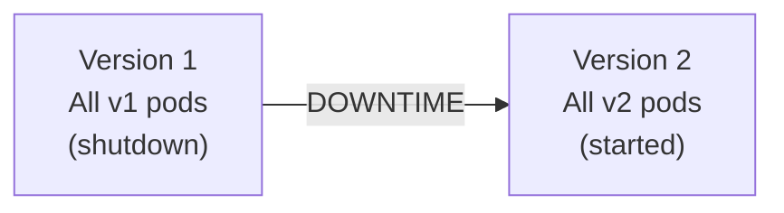
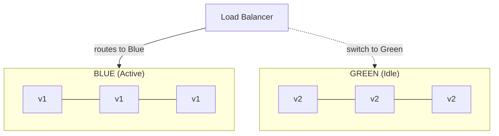
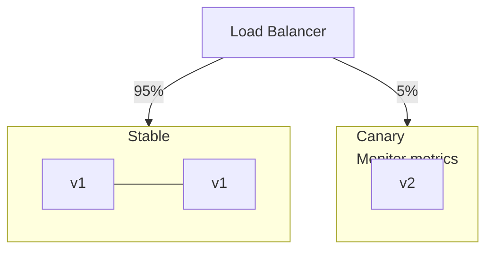
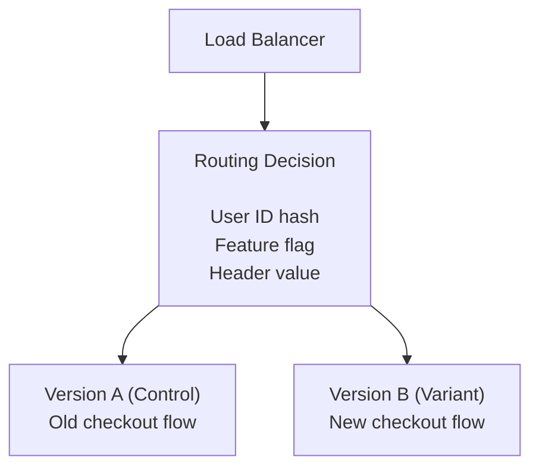
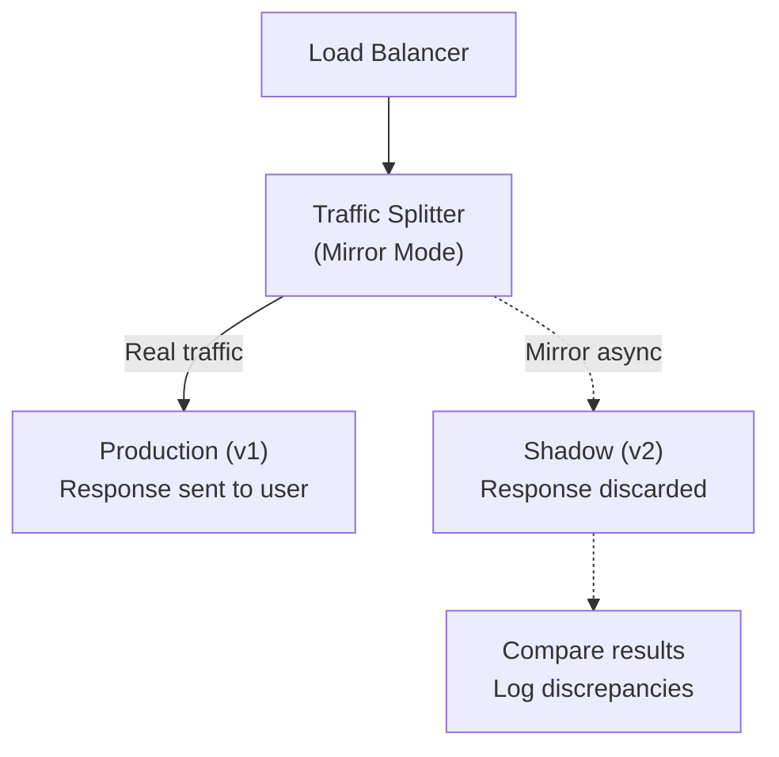

# Deployment Strategies

## TL;DR

Deployment strategies manage how new versions of software are released. Blue-green provides instant rollback, canary reduces blast radius, rolling updates minimize resource usage. Choose based on your tolerance for risk, resource constraints, and rollback requirements.

---

## The Deployment Challenge

```
Deploying software is risky:
- New code might have bugs
- Dependencies might behave differently
- Scale might reveal problems
- User behavior might be unexpected

Goals of safe deployment:
✓ Minimize blast radius (affected users)
✓ Enable fast rollback
✓ Maintain availability during deploy
✓ Validate in production before full rollout
```

---

## Recreate (Big Bang)

### How It Works



```yaml
# Kubernetes Recreate Strategy
apiVersion: apps/v1
kind: Deployment
metadata:
  name: my-app
spec:
  replicas: 3
  strategy:
    type: Recreate
  template:
    spec:
      containers:
        - name: app
          image: my-app:v2
```

### Trade-offs

```
Pros:
✓ Simple
✓ Clean state (no version mixing)
✓ Good for stateful apps that can't run multiple versions

Cons:
✗ Downtime during deployment
✗ No gradual rollout
✗ No easy rollback (must redeploy v1)

Use when:
- Development/staging environments
- Scheduled maintenance windows acceptable
- Database migrations requiring single version
```

---

## Rolling Update

### How It Works

```
Time T1: ██ v1  ██ v1  ██ v1  ░░ --  ░░ --
Time T2: ██ v1  ██ v1  ██ v2  ░░ --  ░░ --
Time T3: ██ v1  ██ v2  ██ v2  ░░ --  ░░ --
Time T4: ██ v2  ██ v2  ██ v2  ░░ --  ░░ --

Gradual replacement:
- New pods created
- Old pods terminated
- Traffic shifts naturally
```

```yaml
# Kubernetes Rolling Update (default)
apiVersion: apps/v1
kind: Deployment
metadata:
  name: my-app
spec:
  replicas: 5
  strategy:
    type: RollingUpdate
    rollingUpdate:
      maxSurge: 1        # Max pods above desired count
      maxUnavailable: 1  # Max pods below desired count
  template:
    spec:
      containers:
        - name: app
          image: my-app:v2
          readinessProbe:  # Critical for rolling updates!
            httpGet:
              path: /health
              port: 8080
            initialDelaySeconds: 5
            periodSeconds: 5
```

### Rollout Progress

```
$ kubectl rollout status deployment/my-app
Waiting for deployment "my-app" rollout to finish: 2 out of 5 new replicas have been updated...
Waiting for deployment "my-app" rollout to finish: 3 out of 5 new replicas have been updated...
Waiting for deployment "my-app" rollout to finish: 4 out of 5 new replicas have been updated...
Waiting for deployment "my-app" rollout to finish: 5 out of 5 new replicas have been updated...
deployment "my-app" successfully rolled out

# Rollback if issues
$ kubectl rollout undo deployment/my-app
```

### Trade-offs

```
Pros:
✓ Zero downtime
✓ Gradual rollout
✓ Resource efficient
✓ Built into Kubernetes

Cons:
✗ v1 and v2 run simultaneously
✗ Rollback takes time (another rolling update)
✗ Long deployment time for many replicas
✗ No traffic control (random distribution)

Use when:
- Application tolerates multiple versions running
- Standard web services
- No need for traffic control
```

---

## Blue-Green Deployment

### How It Works



```
Switch: Move LB to point to Green
Rollback: Switch LB back to Blue (instant)
```

### Kubernetes Implementation

```yaml
# Blue deployment
apiVersion: apps/v1
kind: Deployment
metadata:
  name: my-app-blue
spec:
  replicas: 3
  selector:
    matchLabels:
      app: my-app
      version: blue
  template:
    metadata:
      labels:
        app: my-app
        version: blue
    spec:
      containers:
        - name: app
          image: my-app:v1
---
# Green deployment  
apiVersion: apps/v1
kind: Deployment
metadata:
  name: my-app-green
spec:
  replicas: 3
  selector:
    matchLabels:
      app: my-app
      version: green
  template:
    metadata:
      labels:
        app: my-app
        version: green
    spec:
      containers:
        - name: app
          image: my-app:v2
---
# Service (switch by changing selector)
apiVersion: v1
kind: Service
metadata:
  name: my-app
spec:
  selector:
    app: my-app
    version: blue  # Change to 'green' to switch
  ports:
    - port: 80
      targetPort: 8080
```

### Switch Script

```bash
#!/bin/bash

# switch-traffic.sh
CURRENT=$(kubectl get svc my-app -o jsonpath='{.spec.selector.version}')
NEW_VERSION=${1:-$([ "$CURRENT" = "blue" ] && echo "green" || echo "blue")}

echo "Current version: $CURRENT"
echo "Switching to: $NEW_VERSION"

# Ensure new version is healthy
kubectl rollout status deployment/my-app-$NEW_VERSION

# Switch traffic
kubectl patch svc my-app -p "{\"spec\":{\"selector\":{\"version\":\"$NEW_VERSION\"}}}"

echo "Traffic switched to $NEW_VERSION"
```

### Trade-offs

```
Pros:
✓ Instant rollback (switch back)
✓ Easy to test new version before switch
✓ Clean cut-over (no version mixing)
✓ Predictable deployment time

Cons:
✗ Double infrastructure cost
✗ State synchronization (databases)
✗ Long-running connections may break
✗ No gradual traffic shift

Use when:
- Instant rollback is critical
- You can afford double resources
- Application doesn't tolerate version mixing
- Testing in production environment needed
```

---

## Canary Deployment

### How It Works



```
Progression:
5% → 10% → 25% → 50% → 100%
(if metrics look good at each stage)
```

### Istio Traffic Splitting

```yaml
# DestinationRule - Define subsets
apiVersion: networking.istio.io/v1beta1
kind: DestinationRule
metadata:
  name: my-app
spec:
  host: my-app
  subsets:
    - name: stable
      labels:
        version: v1
    - name: canary
      labels:
        version: v2
---
# VirtualService - Traffic split
apiVersion: networking.istio.io/v1beta1
kind: VirtualService
metadata:
  name: my-app
spec:
  hosts:
    - my-app
  http:
    - route:
        - destination:
            host: my-app
            subset: stable
          weight: 95
        - destination:
            host: my-app
            subset: canary
          weight: 5
```

### Automated Canary with Flagger

```yaml
apiVersion: flagger.app/v1beta1
kind: Canary
metadata:
  name: my-app
spec:
  targetRef:
    apiVersion: apps/v1
    kind: Deployment
    name: my-app
  service:
    port: 80
  analysis:
    interval: 1m
    threshold: 5
    maxWeight: 50
    stepWeight: 10
    metrics:
      - name: request-success-rate
        thresholdRange:
          min: 99
        interval: 1m
      - name: request-duration
        thresholdRange:
          max: 500
        interval: 1m
    webhooks:
      - name: load-test
        url: http://flagger-loadtester/
        timeout: 5s
        metadata:
          cmd: "hey -z 1m -q 10 -c 2 http://my-app-canary/"
```

### Canary Metrics to Monitor

```python
# Key metrics for canary analysis
canary_metrics = {
    # Success rate
    'error_rate': {
        'query': 'sum(rate(http_requests_total{status=~"5.."}[5m])) / sum(rate(http_requests_total[5m]))',
        'threshold': 0.01  # <1% errors
    },
    
    # Latency
    'p99_latency': {
        'query': 'histogram_quantile(0.99, rate(http_request_duration_seconds_bucket[5m]))',
        'threshold': 0.5  # <500ms
    },
    
    # Saturation
    'cpu_usage': {
        'query': 'avg(rate(container_cpu_usage_seconds_total{pod=~"my-app-canary.*"}[5m]))',
        'threshold': 0.8  # <80%
    },
    
    # Business metrics
    'conversion_rate': {
        'query': 'sum(rate(orders_completed_total[5m])) / sum(rate(checkout_started_total[5m]))',
        'threshold': 0.03  # Similar to baseline
    }
}

def should_promote_canary(metrics):
    for name, config in canary_metrics.items():
        value = query_prometheus(config['query'])
        if value > config['threshold']:
            return False, f"{name} exceeded threshold: {value} > {config['threshold']}"
    return True, "All metrics healthy"
```

### Trade-offs

```
Pros:
✓ Minimal blast radius
✓ Real production traffic testing
✓ Gradual rollout with validation
✓ Easy rollback (shift traffic back)
✓ Can automate promotion/rollback

Cons:
✗ Complex traffic routing setup
✗ Requires good observability
✗ Longer deployment time
✗ v1 and v2 run simultaneously
✗ State handling complexity

Use when:
- High risk changes
- Good observability in place
- Can tolerate longer deployment time
- Need to validate with real traffic
```

---

## A/B Testing Deployment

### How It Works



```
Purpose: Measure which version performs better
(conversion rate, engagement, etc.)
```

### Route by Header/Cookie

```yaml
# Istio VirtualService with header-based routing
apiVersion: networking.istio.io/v1beta1
kind: VirtualService
metadata:
  name: my-app
spec:
  hosts:
    - my-app
  http:
    # Route users with specific header to variant
    - match:
        - headers:
            x-experiment-group:
              exact: "variant-b"
      route:
        - destination:
            host: my-app
            subset: version-b
    
    # Default to control
    - route:
        - destination:
            host: my-app
            subset: version-a
```

### Sticky Sessions for Consistency

```python
# Application-level A/B routing
import hashlib

def get_experiment_variant(user_id: str, experiment: str) -> str:
    """
    Deterministic assignment based on user ID
    Same user always gets same variant
    """
    hash_input = f"{user_id}:{experiment}"
    hash_value = int(hashlib.md5(hash_input.encode()).hexdigest(), 16)
    
    # 50/50 split
    if hash_value % 100 < 50:
        return "control"
    else:
        return "variant"

# Track in analytics
def track_experiment_exposure(user_id: str, experiment: str, variant: str):
    analytics.track(
        user_id=user_id,
        event="experiment_exposure",
        properties={
            "experiment": experiment,
            "variant": variant
        }
    )
```

---

## Shadow Deployment

### How It Works



### Istio Mirror Configuration

```yaml
apiVersion: networking.istio.io/v1beta1
kind: VirtualService
metadata:
  name: my-app
spec:
  hosts:
    - my-app
  http:
    - route:
        - destination:
            host: my-app
            subset: v1
      mirror:
        host: my-app
        subset: v2
      mirrorPercentage:
        value: 100.0  # Mirror 100% of traffic
```

### Compare Shadow Results

```python
class ShadowComparator:
    def __init__(self):
        self.discrepancies = []
    
    def compare(self, production_response, shadow_response, request):
        if production_response.status_code != shadow_response.status_code:
            self.log_discrepancy(
                type="status_code",
                request=request,
                production=production_response.status_code,
                shadow=shadow_response.status_code
            )
        
        # Compare response bodies (ignoring timestamps, etc.)
        prod_body = self.normalize(production_response.json())
        shadow_body = self.normalize(shadow_response.json())
        
        if prod_body != shadow_body:
            diff = self.compute_diff(prod_body, shadow_body)
            self.log_discrepancy(
                type="response_body",
                request=request,
                diff=diff
            )
        
        # Compare latency
        latency_diff = shadow_response.elapsed - production_response.elapsed
        if abs(latency_diff.total_seconds()) > 0.5:  # >500ms difference
            self.log_discrepancy(
                type="latency",
                request=request,
                production_ms=production_response.elapsed.total_seconds() * 1000,
                shadow_ms=shadow_response.elapsed.total_seconds() * 1000
            )
```

### Trade-offs

```
Pros:
✓ Zero risk to users (shadow responses discarded)
✓ Real production traffic
✓ Can compare behavior before switch
✓ Good for validating refactors

Cons:
✗ Double compute cost
✗ Side effects (writes) must be handled carefully
✗ Doesn't test actual user experience
✗ Complex comparison logic

Use when:
- Major refactoring
- Validating performance
- Testing with real traffic patterns
- Write operations can be made idempotent/isolated
```

---

## Deployment Strategy Comparison

| Strategy | Downtime | Rollback | Risk | Cost |
|---|---|---|---|---|
| Recreate | Yes | Slow | High | Low |
| Rolling Update | No | Medium | Medium | Low |
| Blue-Green | No | Instant | Medium | High |
| Canary | No | Fast | Low | Medium |
| Shadow | No | N/A | None | High |

```
Choose based on:
1. Risk tolerance
2. Available resources
3. Required rollback speed
4. Observability maturity
5. Traffic routing capabilities
```

---

## References

- [Kubernetes Deployment Strategies](https://kubernetes.io/docs/concepts/workloads/controllers/deployment/)
- [Istio Traffic Management](https://istio.io/latest/docs/concepts/traffic-management/)
- [Flagger Progressive Delivery](https://flagger.app/)
- [Martin Fowler - Blue Green Deployment](https://martinfowler.com/bliki/BlueGreenDeployment.html)
- [Canary Releases - Danilo Sato](https://martinfowler.com/bliki/CanaryRelease.html)
