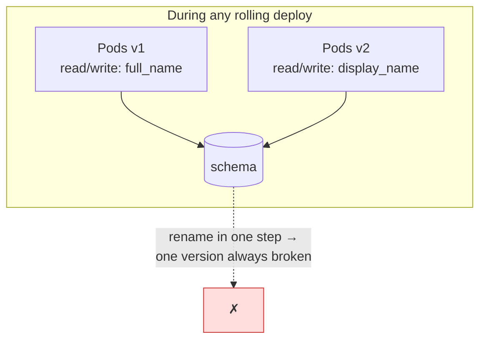
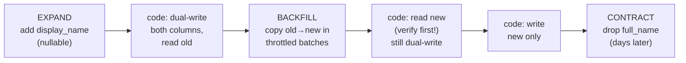

# Database Schema Migrations

## TL;DR

Schema changes are deployments — the riskiest kind, because they're stateful, often lock-taking, and rarely reversible. Two rules generate every safe migration: **(1)** never couple a schema change and a code change in one step — every schema version must work with both the previous and next code version (N−1 compatibility), because deploys are rolling and rollbacks happen; **(2)** decompose every breaking change into **expand → migrate → contract**: add the new shape alongside the old, dual-write and backfill, switch reads, then remove the old shape only after verification. Use online-DDL mechanics (`CREATE INDEX CONCURRENTLY`, `NOT VALID` constraints, gh-ost) on large tables, run backfills as throttled idempotent batch jobs, lint migrations in CI, and plan to **roll forward** — down-migrations that drop data are a fiction.

---

## Why Naive Migrations Cause Outages

`ALTER TABLE` looks innocent in development (1,000 rows) and takes a lock in production (1,000,000,000 rows). Two distinct failure classes:

**Locking.** DDL generally needs (briefly or for the duration) an exclusive lock. Even "instant" DDL in Postgres must *acquire* the `ACCESS EXCLUSIVE` lock — and if it queues behind one long-running query, every subsequent query queues behind *it*: a one-millisecond change causes a multi-minute outage. Always run DDL with `lock_timeout` (e.g., 2s) and retry, so a contended lock attempt fails fast instead of stalling the world.

**Version skew.** Deploys are rolling: for minutes (or, with canaries, hours) old code and new code run simultaneously against one schema — and a rollback can extend that to days. Rename a column in one step and the old pods crash instantly:



Hence the contract: **schema change N must be compatible with code versions N−1 and N.** Which immediately forbids, as single steps: renaming columns/tables, changing column types, adding `NOT NULL` to existing columns, dropping anything still referenced. All of those become multi-step dances.

### Operation safety reference

| Operation | Postgres | MySQL (8.0/InnoDB) |
|---|---|---|
| Add nullable column (no default rewrite) | ✅ instant | ✅ instant |
| Add column + volatile default | ✅ (11+: no rewrite) | ⚠️ often rewrite |
| Create index | ⚠️ use `CONCURRENTLY` | ✅ inplace (still I/O-heavy) |
| Add FK / CHECK constraint | ⚠️ use `NOT VALID` + `VALIDATE` | ⚠️ full scan |
| Add `NOT NULL` | ⚠️ via `CHECK NOT VALID` route | ⚠️ inplace, locks under load |
| Change column type / PK type | ❌ expand-contract | ❌ expand-contract or gh-ost |
| Rename column/table | ❌ expand-contract (metadata-fast but breaks N−1 code) | same |
| Drop column | ⚠️ only as the contract step | same |

(Tools like `strong_migrations` and `squawk` encode exactly this table as CI lint rules — adopt one rather than relying on memory.)

---

## Expand → Migrate → Contract

The universal recipe, shown for the canonical hard case — renaming `full_name` to `display_name` on a hot table:



1. **Expand (schema):** `ALTER TABLE users ADD COLUMN display_name text;` — additive, instant, invisible to v1 code.
2. **Dual-write (code deploy):** writes populate both columns; reads still use the old one. Crucially, this step is fully rollback-safe.
3. **Backfill (data job):** copy historical rows — see below. New writes are already correct via dual-write, so the backfill only chases history.
4. **Verify:** count mismatches (`WHERE full_name IS DISTINCT FROM display_name`), checksum samples, and ideally **shadow-read** — read both, compare, log diffs, serve the old value. Zero diffs for a representative window is the gate.
5. **Switch reads (code deploy):** read the new column; keep dual-writing so rollback to step 4 remains trivial.
6. **Write new only (code deploy):** stop touching the old column.
7. **Contract (schema):** drop the old column — *days later*, after you're certain no rollback will need it, and after checking nothing else reads it (views, reports, [CDC consumers](../13-data-pipelines/04-change-data-capture.md) — the dropped column disappears from the change stream too).

Every step is individually deployable, individually reversible (until contract), and N−1 compatible. The same skeleton handles type changes (including the infamous `int → bigint` primary-key migration: new column, dual-write, backfill, swap with a brief rename transaction), table splits, and moving data between databases — only the dual-write/dual-read plumbing varies. Feature flags pair naturally with the read-switch step ([Feature Flags](./02-feature-flags.md)): flip reads gradually, compare error rates, revert instantly.

### Backfills at scale

A backfill is a batch job with a database in the blast radius. Requirements:

```python
def backfill(batch_size=2000, max_replica_lag_s=5):
    last_id = checkpoint.load()                      # resumable
    while True:
        rows = db.execute("""
            UPDATE users SET display_name = full_name
            WHERE id > %s AND id <= %s AND display_name IS NULL
            RETURNING max(id)""", last_id, last_id + batch_size)
        if rows.empty: break
        last_id = rows.max_id
        checkpoint.save(last_id)                     # idempotent restarts
        while replica_lag() > max_replica_lag_s:     # throttle on real signals
            time.sleep(1)
```

- **Batch by primary-key range** (not OFFSET), keep transactions short, commit per batch.
- **Throttle on observed health** — replica lag, p99 latency — not a fixed sleep. The job should be the first thing to slow down, not your users. ([Backpressure](../06-scaling/07-backpressure.md))
- **Idempotent + checkpointed:** the `IS NULL` guard makes re-runs safe; the checkpoint makes restarts cheap. Long backfills *will* be interrupted.
- For billion-row tables, run the backfill as a proper [batch pipeline](../13-data-pipelines/01-batch-processing.md) and budget days, not minutes. Boring is the goal.

---

## Online DDL Mechanics

When the operation itself rewrites a big table, use the non-blocking machinery:

**Postgres.**
- `CREATE INDEX CONCURRENTLY` — builds without blocking writes (slower; can't run in a transaction; on failure leaves an `INVALID` index to drop and retry).
- Constraints in two phases: `ALTER TABLE ... ADD CONSTRAINT ... NOT VALID` (instant — enforces for new writes only), then `VALIDATE CONSTRAINT` (full scan with only a light lock). The supported route to `NOT NULL` on a big table goes through a `NOT VALID` check constraint.
- Wrap all DDL in `SET lock_timeout = '2s'` + retry loops.

**MySQL.**
- InnoDB online DDL (`ALGORITHM=INPLACE/INSTANT`) covers many cases, but still object-level and I/O-bound on huge tables.
- **gh-ost** (GitHub) does the general case externally: create a ghost table with the new schema, copy rows in batches, apply ongoing changes by **tailing the binlog** (no triggers — unlike `pt-online-schema-change`, which uses triggers and adds write overhead), then atomically swap names. Pausable, throttleable on replica lag, and rehearsable.

The managed-platform versions of this (PlanetScale deploy requests, et al.) are the same ghost-table mechanics productized — with the addition of *revertible* schema changes, which is the direction of travel.

---

## Migrations in the Delivery Pipeline

- **Migrations are code:** versioned files (Flyway/Alembic/golang-migrate/Rails), applied by automation with an advisory lock so two deploys can't race ([CI/CD & GitOps](./04-cicd-gitops.md)), recorded in a schema-history table. No human runs DDL in prod by hand.
- **Order of operations:** expand-phase migrations apply *before* the code that uses them rolls out; contract-phase migrations apply *after* the code that stops using the old shape is fully rolled out **and you've decided you won't roll back past it**. Automate the first; gate the second on a human.
- **Lint in CI:** reject unsafe operations (the table above) mechanically — `squawk`, `strong_migrations`, or custom rules. Add a CI check that every migration runs against a realistic-size dataset clone or at minimum `EXPLAIN`s its locks.
- **Plan to roll forward.** Auto-generated down-migrations either lose data (`DROP COLUMN` undone how?) or lie. Treat "down" as: ship a new forward migration that restores compatibility. The expand/contract discipline is what makes this safe — at every point, the *previous* code version still works, which is the only rollback that matters.
- **Don't mix DML and DDL** in one migration file: schema steps are fast and lock-sensitive; data steps are slow and throttle-sensitive. Different tools, different supervision.

---

## Checklist

- [ ] Every migration is N−1 compatible (old code runs against new schema)
- [ ] Breaking changes decomposed into expand → migrate → contract, each step separately deployed
- [ ] `lock_timeout` + retry on all DDL; `CONCURRENTLY` / `NOT VALID` / gh-ost for big tables
- [ ] Backfills: PK-range batched, idempotent, checkpointed, throttled on replica lag
- [ ] Verification gate (counts/checksums/shadow reads) before read-switch; flags for gradual cutover
- [ ] Contract step delayed past the rollback horizon; downstream readers (views, CDC, reports) checked
- [ ] CI lints migrations for unsafe operations; apply is automated and serialized
- [ ] Rollback story = roll forward; tested on a clone, not believed on faith

---

## References

- [gh-ost](https://github.com/github/gh-ost) — GitHub's triggerless online schema change; the design doc is a masterclass
- [pt-online-schema-change](https://docs.percona.com/percona-toolkit/pt-online-schema-change.html) — the trigger-based predecessor
- [strong_migrations](https://github.com/ankane/strong_migrations) / [squawk](https://github.com/sbdchd/squawk) — unsafe-operation linters encoding the rules above
- [PostgreSQL: lock levels of DDL](https://www.postgresql.org/docs/current/explicit-locking.html) and [Braintree: PostgreSQL migrations without downtime](https://medium.com/paypal-tech/postgresql-at-scale-database-schema-changes-without-downtime-20d3749ed680)
- [Evolutionary Database Design](https://martinfowler.com/articles/evodb.html) — Fowler & Sadalage; expand/contract origins
