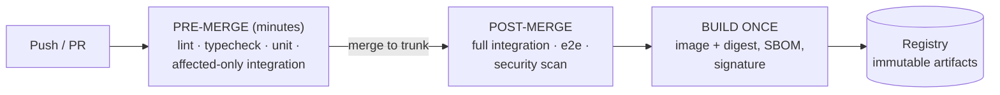
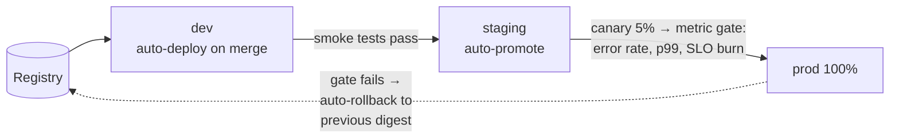
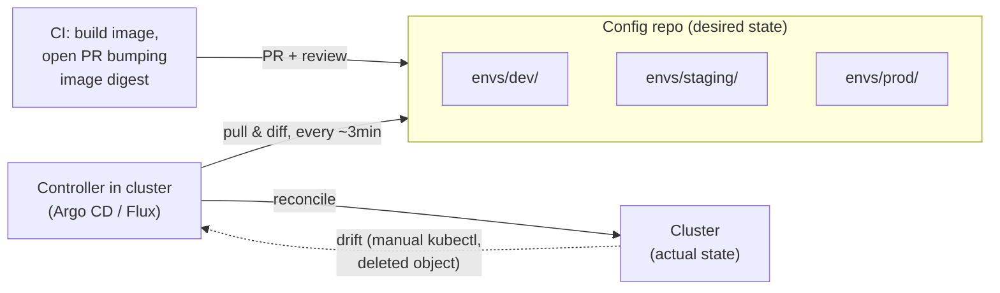

# CI/CD and GitOps

## TL;DR

CI/CD is the system that turns commits into running software with humans reviewing rather than executing. **CI**: trunk-based development with fast, deterministic checks that keep main always releasable. **CD**: build an immutable artifact once, promote that *same artifact* through environments, and verify each promotion with automated gates (canary metrics, smoke tests) — deploys are routine precisely in proportion to how boring they are. **GitOps** is the operating model for the deploy half: the desired state of every environment lives declaratively in git, and in-cluster controllers (Argo CD, Flux) continuously *reconcile* reality toward it — pull, not push — giving you audit-by-PR, drift detection, and rollback-by-revert. Measure the whole machine with the DORA four; the metrics move together because they share one root cause: batch size.

---

## CI: Keeping Trunk Releasable

**Trunk-based development is the substrate.** Short-lived branches (hours–days) merged into a single trunk, with incomplete features hidden behind [feature flags](./02-feature-flags.md) rather than long-lived branches. Long branches are inventory: integration risk accruing interest. Everything else in this article works dramatically better when batch size is small — that's not culture talk, it's queueing theory.

**The pipeline is a latency budget.** Pre-merge checks gate human workflow, so they get minutes: lint, types, unit tests, and integration tests *scoped to affected targets* (Bazel/Nx/Turborepo-style graph-aware selection in monorepos). The expensive battery (full e2e, soak, deep scans) runs post-merge — failures there block *release*, not *merge*, and page the merge author. Two properties are non-negotiable:

- **Deterministic:** hermetic builds (pinned dependencies, locked toolchains, no network surprises), tests without shared mutable state. A flaky suite is worse than a missing one — it trains engineers to click retry, which is to say, to ignore the alarm. Quarantine flakes mechanically (auto-file, auto-disable, burn-down list) instead of letting them rot trust.
- **Fast:** target < 10 minutes pre-merge. Past that, engineers batch changes, and batch size is the enemy.

**Build once, promote everywhere.** The artifact (container image, addressed by **digest**, never by mutable tag) is built exactly once and promoted unchanged through dev → staging → prod. Rebuilding per environment means staging verified a different binary than prod runs. Attach provenance at build time — SBOM and a signature (Sigstore/cosign) — and have clusters admit only signed digests; that single control closes most artifact-tampering paths.

---

## CD: Promotion with Verification

Deployment is release *mechanics*; the strategies themselves (blue-green, canary, rolling) are covered in [Deployment Strategies](./01-deployment-strategies.md), and `deploy ≠ release` — flags decouple exposure from rollout ([Feature Flags](./02-feature-flags.md)). What CD adds is the **promotion pipeline**:

- **Gates are metrics, not meetings.** A canary analysis comparing error rate, latency, and saturation against the stable cohort (Argo Rollouts / Flagger automate this) replaces the change-advisory-board theater. Human approval, where required, is a *recorded gate in the pipeline* — not a side channel.
- **Rollback is the same mechanism as roll-forward:** repoint to the previous digest. It must be one action, drilled, and not require the CI system to be healthy (artifacts already exist). The corollary discipline: [database migrations](./03-database-migrations.md) follow expand/contract so the previous code version always runs — otherwise "rollback" is a word, not a capability.
- **Order of operations** for stateful changes: expand-phase migrations → code rollout → (much later) contract-phase migrations. Encode it in the pipeline, don't rely on memory.
- **Environments are promotion stages, not snowflakes.** The delta between staging and prod should be config (URLs, scale, secrets), never topology. Every "works in staging" incident is a diff between those environments that nobody had written down.

---

## GitOps: Reconciliation, Not Scripts

Push-style CD (pipeline runs `kubectl apply`/`terraform apply` at the cluster) works, but leaves three gaps: the CI system holds god-credentials to prod, nothing detects out-of-band drift, and "what's running where?" is answered by archaeology. GitOps inverts the flow:

Four properties define it (per OpenGitOps): desired state is **declarative**, **versioned and immutable** in git, **pulled automatically** by agents, and **continuously reconciled**. The consequences:

- **Audit and rollback by git.** Every change to any environment is a commit with an author, a review, and a revert button. Rollback = `git revert` + reconcile — the same path as any change, so it's always rehearsed.
- **Drift detection.** A hand-edited deployment, a deleted ConfigMap — the controller sees actual ≠ desired and corrects (or alerts, your choice per resource). Manual `kubectl` in prod stops being a silent fork of reality.
- **Credential inversion.** The cluster pulls; CI never holds prod credentials. The controller needs read access to git and the registry — a far smaller blast radius than a Jenkins box that can `apply` anything anywhere.
- **Disaster recovery for free-ish:** a cluster rebuilt from scratch converges to the repo's declared state. (Free-ish: stateful data still needs [its own DR](../06-scaling/09-multi-region-architecture.md).)

### Repo layout and the questions everyone asks

- **App repo vs. config repo: separate them.** App CI ends by opening a PR against the config repo that bumps an image digest. Mixing them retriggers app CI on config changes and tangles permissions.
- **Environments = directories, not branches.** `envs/{dev,staging,prod}/` with shared base + per-env overlays (Kustomize/Helm). Environment *branches* invite cherry-pick drift and merge archaeology; promotion should be a file change you can diff, automated by the pipeline (Kargo-style promotion tooling, or a bot PR).
- **Secrets never go in git in plaintext.** Two workable models: encrypted-in-git (SealedSecrets, SOPS — secrets travel the same audited path) or reference-in-git (External Secrets Operator pulling from Vault/cloud secret managers — git holds only pointers). Pick one; ad-hoc mixes leak.
- **Scale pattern:** app-of-apps / ApplicationSets to stamp the same app across many clusters/regions; the config repo becomes the inventory of everything running, which is exactly what you want it to be.

GitOps applies beyond Kubernetes — Terraform plan/apply driven from PRs (Atlantis-style) is the same model for infrastructure; the principle is *git is the interface, controllers are the executors*.

---

## Measuring the Machine: DORA

Four metrics, measured from the pipeline itself, not surveys:

| Metric | Elite-ish reference | What actually moves it |
|---|---|---|
| Deployment frequency | On-demand, many/day | Small batches, trunk-based, automated gates |
| Lead time (commit → prod) | < 1 hour–1 day | Pipeline latency, no manual handoffs |
| Change failure rate | ~5–15% | Canary gates, test trust, flags |
| Time to restore | < 1 hour | One-action rollback, drilled; flags as kill switches |

The pairs move together — speed and stability are *not* a trade-off; both improve as batch size shrinks and verification automates. That's the empirical core of the DORA research and the actual argument for this entire architecture. Track them per service, trend them, and treat a regressing lead time as a production incident for the platform team.

---

## Anti-Patterns

- **Environment branches** (`develop` → `staging` → `master` merges) — drift, cherry-pick archaeology, and a merge ritual that adds risk while feeling like control.
- **The snowflake CI box** — a hand-configured Jenkins with prod credentials and undocumented plugins: simultaneously your biggest security exposure and your least reproducible system. Pipeline definitions belong in the repo; runners are cattle.
- **Rebuilding artifacts per environment** — staging verified a binary prod never runs.
- **Manual prod `kubectl` as standard practice** — every such edit is unaudited drift the next deploy silently reverts (or worse, doesn't).
- **A staging environment nobody trusts** — if staging is permanently red or wildly unlike prod, teams route around it and your gate is decorative. Fix or delete it.
- **100% test-pass theater over flaky suites** — retry-until-green is a slower way of having no tests.
- **Approval gates as the only safety** — a human clicking "approve" verifies authority, not behavior. Metric gates verify behavior.

---

## References

- [Accelerate / DORA research](https://dora.dev/) — the evidence base for the speed-and-stability claim
- *Continuous Delivery* — Humble & Farley; the foundational text
- [Trunk-Based Development](https://trunkbaseddevelopment.com/)
- [OpenGitOps principles](https://opengitops.dev/) — the four-property definition
- [Argo CD](https://argo-cd.readthedocs.io/) / [Flux](https://fluxcd.io/docs/) — reconciliation controllers; [Argo Rollouts](https://argoproj.github.io/rollouts/) / [Flagger](https://flagger.app/) — automated canary analysis
- [Sigstore](https://www.sigstore.dev/) and [SLSA](https://slsa.dev/) — artifact signing and supply-chain levels
