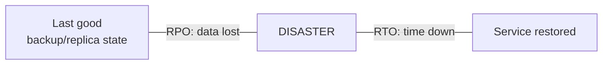
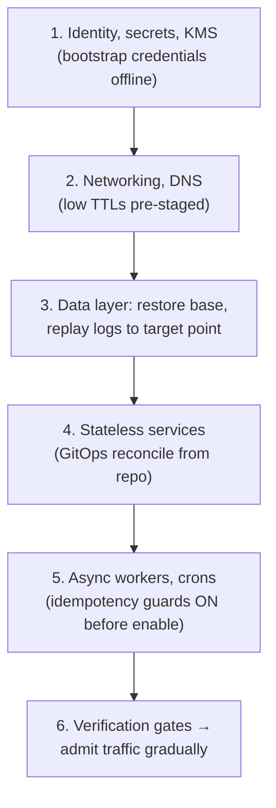

# Disaster Recovery

## TL;DR

High availability survives component failure; **disaster recovery survives correlated failure** — region loss, ransomware, an operator's `DROP TABLE`, or a bad deploy that quietly corrupted data for six days. The discipline: classify systems into tiers with explicit **RPO** (data you may lose) and **RTO** (time you may be down); choose a DR strategy per tier (backup-and-restore → pilot light → warm standby → multi-site active-active); follow **3-2-1 with immutability** for backups (replication is *not* backup — it faithfully replicates the corruption); and treat **restore as the product**: an untested backup is a hope, a tested restore is a capability. The failure mode that bites mature teams isn't missing backups — it's logical corruption that replicated everywhere instantly, discovered after every "redundant" copy already agrees on the wrong data. Point-in-time recovery and delayed replicas are the only defenses for that class.

---

## What You're Actually Defending Against

| Threat | HA helps? | What actually saves you |
|---|---|---|
| Disk/node/AZ failure | ✅ that's HA's job | Replication, multi-AZ ([Failure Modes](../01-foundations/06-failure-modes.md)) |
| Region outage | ❌ | Cross-region standby + drilled failover ([Multi-Region](../06-scaling/09-multi-region-architecture.md)) |
| Operator error (`DELETE` without `WHERE`) | ❌ — replicas apply it in ms | PITR, delayed replica, soft-delete windows |
| Bad deploy corrupting data over days | ❌ | PITR + the ability to *find* when corruption began |
| Ransomware / account compromise | ❌ — attackers delete backups first | Immutable, separately-controlled backup copies |
| Deleted cloud account / billing failure / provider exit | ❌ | Off-account, ideally off-provider copy |

The pattern in the right column: **HA mechanisms share fate with the failure; DR mechanisms must not.** Synchronous replication is precisely a machine for making every copy agree — including agreeing on the corruption. DR is the set of copies and procedures that are *isolated in time* (snapshots, PITR), *in control plane* (separate account/credentials), or *in space* (region, provider).

## RPO and RTO: The Two Numbers Everything Follows From

Set them **per tier, by business decision, before the incident** — they are the requirements from which every architecture and budget choice derives:

| Tier | Example | RPO | RTO | Strategy that fits |
|---|---|---|---|---|
| 0 — revenue/ledger | Payments, auth | ~0–1 min | minutes | Warm standby or active-active; sync or near-sync replication + PITR |
| 1 — core product | Main app DB | ≤ 15 min | ≤ 1–4 h | Continuous log archiving + warm standby |
| 2 — supporting | Analytics, search indexes | ≤ 24 h | ≤ 24 h | Nightly backup; rebuild from sources ([derived data is re-derivable](../13-data-pipelines/04-change-data-capture.md)) |
| 3 — rebuildable | Caches, scratch | n/a | best effort | Don't back up; rebuild |

Two honesty checks. First, **RPO is bounded by replication/backup transport**, not intent — "RPO 5 minutes" with hourly snapshots is fiction; you need continuous WAL/binlog archiving. Second, **RTO is bounded by restore *throughput***: restoring 20 TB at 500 MB/s is ~11 hours before you've replayed a single log — measure your actual restore speed, because that number, not the backup schedule, is usually what breaks the promise.

## Backups That Survive the Disaster

**3-2-1, modernized:** ≥3 copies, on ≥2 distinct systems, ≥1 *immutable and under different credentials*. The last clause is the ransomware-era addition — attackers (and angry ex-employees, and your own buggy cleanup scripts) delete backups first, so at least one copy must be physically un-deletable even by your own admin credentials: object-lock/WORM retention, a separate restricted account, or offline/air-gapped storage ([Object Storage](../03-storage-engines/08-object-storage.md) versioning + object lock is the standard implementation).

The mechanics per layer:

- **Snapshots** (volume/database): fast, incremental, great RTO — but stored adjacent to the source; copy them cross-account/cross-region or they share the account's fate.
- **Continuous log archiving** (Postgres WAL / MySQL binlog → object storage): the enabler of **point-in-time recovery** — restore the last base backup, replay logs to any second. This is your only precise weapon against logical corruption: replay to `14:02:51`, *just before* the bad deploy ([Write-Ahead Logging](../03-storage-engines/04-write-ahead-logging.md) doing double duty).
- **A delayed replica** (applying changes on a 1–6 h lag) is PITR with an RTO of minutes for the operator-error class — the `DROP TABLE` hasn't reached it yet; promote and cherry-pick.
- **Logical backups/exports** (dumps, Parquet exports): slowest, but engine-version-independent and the only kind that survives "the database product itself is the problem" — keep periodic ones for tier-0 data.
- **Don't forget the non-database state:** object stores (versioning + replication ≠ backup against deliberate deletion — add lock), configuration/IaC (in git — [GitOps](./04-cicd-gitops.md) makes infra restorable by definition), secrets (escrowed, since the secret manager may be inside the blast radius), DNS zones, and the [CI/CD system itself](./04-cicd-gitops.md) — you will need to deploy during recovery.
- **Encrypt backups; escrow the keys separately.** A backup encrypted by a KMS key that died with the account is a brick. Key escrow is part of the backup, and per-tenant crypto-shredding interacts here ([Multi-Tenancy](../06-scaling/12-multi-tenancy.md)): deleting a tenant's key must not orphan your *other* tenants' restores.

## Restore Is the Product

Nobody wants backups; everyone wants restores. Engineering the restore path:

**Verify continuously, not annually.** Automate a pipeline that restores last night's backup to an isolated environment, runs integrity checks (row counts vs source, checksums, application smoke tests), records **restore duration as a tracked metric**, and alerts on failure — backup success logs are worthless; *restore* success is the signal ([SLOs](../11-observability/05-slos-error-budgets.md) on the DR process itself). GitLab's 2017 incident is the canonical lesson: five backup mechanisms configured, zero working when needed — discovered during the disaster.

**Plan the dependency order.** A full-environment restore has a topology, and circular dependencies (the secret store needs the database; the database needs secrets) must be broken *in advance* with bootstrap paths:

**Decide the recovery point deliberately under corruption.** Restoring to "latest" restores the corruption. The runbook needs a *find-the-divergence* procedure (audit logs, [CDC streams](../13-data-pipelines/04-change-data-capture.md) as forensic timeline, business reconciliation reports) — and an answer for the agonizing trade: data written *after* the corruption point is lost on restore, so tier-0 systems pair PITR with an [event log/outbox](../05-messaging/07-outbox-pattern.md) from which post-corruption legitimate writes can be selectively replayed.

**Runbooks must survive the disaster too:** stored where the disaster can't reach (printed for the worst tier, mirrored off-provider), with named roles, decision criteria ("declare disaster if X for Y minutes" — ambiguity at 3 a.m. costs the first hour), and communication templates.

**Drill on a calendar.** Quarterly tier-0 restore drills and at least annual full game days (region evacuation, ransomware tabletop, "restore with the primary cloud account locked"). Every drill produces a timed result against RTO and a fix list. Teams that drill find expired credentials and undocumented dependencies in the drill; teams that don't, find them in the incident — same discovery, different stakes.

---

## Checklist

- [ ] Every system has a tier with written RPO/RTO, signed off by the business
- [ ] Backup transport matches RPO (continuous log archiving for minutes-level RPO)
- [ ] 3-2-1 with ≥1 immutable copy under separate credentials (object lock / separate account)
- [ ] PITR proven (restore + replay to an arbitrary timestamp, timed); delayed replica for tier-0 operator-error coverage
- [ ] Restore throughput measured; RTO promises derived from it, not from optimism
- [ ] Automated daily restore-verification pipeline with integrity checks and alerting
- [ ] Non-DB state covered: object storage, IaC/config, secrets + key escrow, DNS, CI/CD
- [ ] Dependency-ordered restoration runbook; bootstrap paths for circular deps; runbooks accessible during the disaster
- [ ] Corruption playbook: find-divergence procedure + selective post-corruption replay story
- [ ] Drills scheduled and timed: quarterly tier-0 restores, annual game day; findings tracked to closure

---

## References

- [Google SRE Book, ch. 26: Data Integrity](https://sre.google/sre-book/data-integrity/) — defense in depth for data; the 24 failure modes
- [GitLab database incident postmortem (2017)](https://about.gitlab.com/blog/2017/02/10/postmortem-of-database-outage-of-january-31/) — the restore-verification lesson, in public
- [AWS: Disaster Recovery of Workloads (whitepaper)](https://docs.aws.amazon.com/whitepapers/latest/disaster-recovery-workloads-on-aws/disaster-recovery-workloads-on-aws.html) — the four-strategy spectrum
- [Backblaze: the 3-2-1 backup strategy](https://www.backblaze.com/blog/the-3-2-1-backup-strategy/) — and its immutability-era updates
- [PostgreSQL: continuous archiving and PITR](https://www.postgresql.org/docs/current/continuous-archiving.html)
