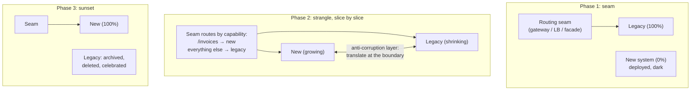

# Migration Strategies: Strangler Fig and System Replacement

## TL;DR

Replacing a running system is the most common shape of senior engineering work, and the rule is: **never big-bang**. Risk in a rewrite accumulates with time-without-feedback, so every viable strategy is a way of shipping the replacement in slices that carry production traffic early. The toolkit: **strangler fig** (put a routing seam in front, move one slice at a time, shrink the legacy until it's gone), **branch by abstraction** (the same move inside one codebase, behind an interface and a [flag](./02-feature-flags.md)), and **dual-run/shadow verification** (run both, diff the outputs, let data — not confidence — authorize cutover; mind the side effects). Data ownership during the transition follows [expand/contract](./03-database-migrations.md) with a single writer per phase. Rollback must equal a routing change until the explicitly named point of no return. And the part everyone skips: **sunset discipline** — a migration is done when the old system is *deleted*, not when the new one works; "97% migrated forever" is the default outcome unless someone owns the burn-down.

---

## Why Big-Bang Rewrites Fail

The rewrite fantasy: freeze features, build clean for 18 months, switch over one weekend. The mechanics of why it fails are predictable enough to be a law:

- **Feedback starvation.** Risk grows with every week the new system carries no production traffic. The legacy system *is* the spec — decades of edge cases, browser quirks, and "that one tenant's CSV format" live only in its code paths, and you discover them at cutover, all at once.
- **The moving target.** The business won't actually freeze; the legacy keeps changing while you chase it, and the rewrite needs feature parity with a system that's still growing.
- **Second-system effect.** The rewrite accumulates every deferred dream, arriving later and heavier.
- **One-way door.** A weekend cutover has no incremental rollback — it's the largest possible change with the smallest possible undo.

Every pattern below is the same therapy applied at different layers: **shrink the batch size of the migration** until each step is boring ([the same argument as CI/CD](./04-cicd-gitops.md) — batch size is the risk).

## Strangler Fig

Named for the fig that grows around a tree until the tree is gone. Mechanics:

1. **Establish the seam first** — an [API gateway](../12-service-mesh/02-api-gateway.md), load balancer rule set, or facade service through which *all* traffic flows. The seam is the migration's control plane: per-route, per-tenant, per-percentage steering, instant rollback. No seam, no strangler.
2. **Pick slices by risk × independence, not importance.** First slice: something read-mostly, low-blast-radius, and weakly coupled (a reporting endpoint, a settings page) — its job is to prove the *pipeline* (seam, deploy, observability, rollback), not to deliver value. Then proceed by capability, saving the write-heavy, invariant-dense core for last, when the machinery is drilled.
3. **Build an anti-corruption layer** where new and legacy must interoperate mid-flight — explicit translation at the boundary, so the legacy's data model doesn't colonize the new system (the whole point was to escape it).
4. **Intercept events, not just requests:** if the legacy is fed by queues/batch jobs, the seam must cover those entry points too — the HTTP router everyone remembers; the nightly cron nobody does.
5. **Run the migration as a product:** a burn-down of capabilities with owners and dates, traffic-share dashboards per slice, and a standing rule that *new features land in the new system only* — otherwise the legacy keeps growing at one end while you strangle the other.

## Branch by Abstraction

The strangler move when there's no network seam — replacing a subsystem *inside* a deployed codebase (an ORM, a storage layer, a rendering engine) without a long-lived branch:

1. Carve an **interface** over the old implementation; mechanically route all call sites through it (pure refactor, zero behavior change, shippable continuously).
2. Build the new implementation behind the same interface, in `main`, dark ([trunk-based](./04-cicd-gitops.md) — the abstraction *is* the branch).
3. Switch per call site / per cohort with a [feature flag](./02-feature-flags.md); compare; ramp.
4. Delete the old implementation *and then the abstraction itself* if it no longer earns its keep.

The discipline this buys: the codebase compiles and ships at every commit during a months-long replacement, and "rollback" is a flag flip — versus the merge-from-hell of a six-month `rewrite-v2` branch.

## Dual-Run and Shadow Verification

Confidence should come from diffs, not vibes. Three intensities:

| Mode | Mechanics | Catches |
|---|---|---|
| **Shadow (dark) reads** | Mirror traffic to the new system; discard its responses; diff against legacy's | Correctness gaps, perf under real load — at zero user risk |
| **Dual-run compare** (Scientist-style) | Run both *in the request path*, serve legacy, record mismatches | Same, plus exact per-request forensics; adds latency — sample it |
| **Dual-write** | Writes go to both stores during data migration | Keeps the new store warm and verifiable pre-cutover ([expand/contract](./03-database-migrations.md)) |

The cardinal rule: **shadowed execution must not double side effects.** Mirroring a request that sends email, charges a card, or emits events means doing it twice — the shadow path needs stubbed effectors, an isolated sink, or [idempotency keys shared with the primary](../01-foundations/08-idempotency.md). (This is the same machinery as [open-loop load testing](../01-foundations/10-capacity-planning.md) — replayed production traffic with the side effects defused.)

Operate the diff like an SLO: mismatch rate per slice, triaged daily; the cutover gate is a *sustained* near-zero diff on real traffic (with known, documented benign diffs — timestamps, ordering — explicitly filtered, not hand-waved). GitHub's Scientist library named this practice; Shopify's storefront migration ran a verifier comparing old/new renderings pixel-for-request until parity was proven, then ramped.

## The Data Plane During Migration

Code routes per-request; data has memory — this is where migrations actually get hard:

- **One writer per phase.** At any moment, exactly one system owns writes for a given record; the other follows (dual-write from the owner, or [CDC](../13-data-pipelines/04-change-data-capture.md) replication). Two masters during a migration is a [conflict-resolution problem](../02-distributed-databases/04-conflict-resolution.md) you volunteered for.
- The standard sequence is the [expand/contract playbook](./03-database-migrations.md) at system scale: new store shadows (backfill + ongoing sync) → verify (counts, checksums, reconciliation reports) → flip reads → flip writes (with reverse-sync running, so rollback stays possible) → retire reverse-sync only past the point of no return.
- **Name the point of no return** explicitly (the moment new-system writes exist that the legacy cannot represent — the migration's [pivot transaction](../05-messaging/09-saga-pattern.md)). Before it, rollback is routing; after it, rollback is itself a migration. Schedule it consciously, late, and after a soak.
- **Tenant-by-tenant beats percentage ramps** for stateful migrations ([multi-tenancy](../06-scaling/12-multi-tenancy.md)): a tenant's whole dataset moves together, reconciliation has a clean boundary, and your design-partner tenants go first by agreement.

## Sunset Discipline

Migrations don't fail at the start; they dissolve at the end — the team disbands at 95% and the company runs *two* systems forever (paying double infra, double on-call, double security surface, and the legacy now has no owner). Counter-measures:

- **Define done as deletion:** traffic = 0, data archived per [DR/retention policy](./05-disaster-recovery.md), code deleted, infra torn down, runbooks/docs updated, dashboards removed. Not before.
- The last 5% (the weird tenants, the cron from 2019, the endpoint only finance uses in Q4) needs an explicit decision per item: migrate, replace with something simpler, or formally kill with stakeholder sign-off. Unowned remainders are how "temporary" becomes architecture.
- **Make the legacy hostile to growth** during the long tail: feature-freeze enforced in CI (changes to legacy paths require an exception label), deprecation warnings on its APIs with [Sunset headers and per-caller metrics](../12-service-mesh/04-api-design-patterns.md) — you cannot turn off what you cannot enumerate the callers of.
- Track and publish the burn-down monthly. What leadership sees gets finished.

### When a rewrite *is* right

Strangling assumes the legacy can keep running and be sliced. Genuine rewrite territory: the platform is dying under you (EOL runtime, unmaintainable stack with no hiring pool), the core model is wrong in a way every slice would inherit, or the system is small enough that a rewrite is a quarter, not a year. Even then: build the new system to production quality on a *subset* of traffic first (one region, one tenant tier — a strangler at coarser grain), and keep the diffing harness. The pattern isn't optional; only the slice size is.

---

## Checklist

- [ ] Seam established before any slice moves; per-route/per-tenant steering + instant rollback proven
- [ ] First slice chosen to derisk the *machinery*; new features frozen out of the legacy
- [ ] Anti-corruption layer at every new↔legacy boundary; queue/cron entry points covered, not just HTTP
- [ ] Shadow/dual-run diffing in place, side effects defused, mismatch rate tracked as the cutover gate
- [ ] Data: single writer per phase, backfill + reconciliation, reverse-sync until the named point of no return
- [ ] Rollback = routing change, rehearsed, until PONR; PONR scheduled deliberately after soak
- [ ] Sunset = deletion, with burn-down, owners, legacy growth-freeze, and caller enumeration before turn-down

---

## References

- [Strangler Fig Application](https://martinfowler.com/bliki/StranglerFigApplication.html) and [Branch by Abstraction](https://martinfowler.com/bliki/BranchByAbstraction.html) — Fowler; the canonical write-ups
- [GitHub Scientist](https://github.com/github/scientist) — dual-run experimentation as a library, with the side-effect caveats
- [Stripe: Online migrations at scale](https://stripe.com/blog/online-migrations) — the four-phase dual-write playbook
- [Shopify: How we rebuilt the storefront renderer](https://shopify.engineering/how-shopify-reduced-storefront-response-times-rewrite) — verifier-gated replacement at scale
- [Things You Should Never Do, Part I](https://www.joelonsoftware.com/2000/04/06/things-you-should-never-do-part-i/) — Spolsky; the case against the big bang, still undefeated
- *Monolith to Microservices* (Sam Newman) — the full pattern catalog around the strangler
