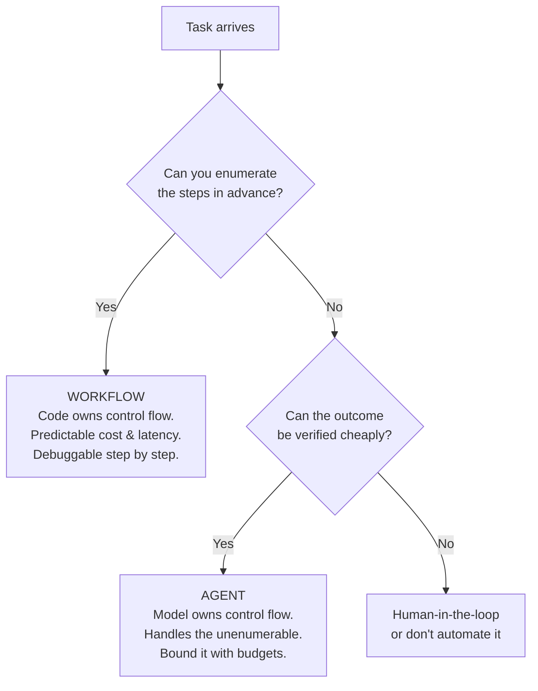
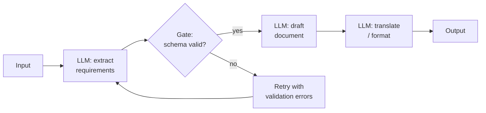
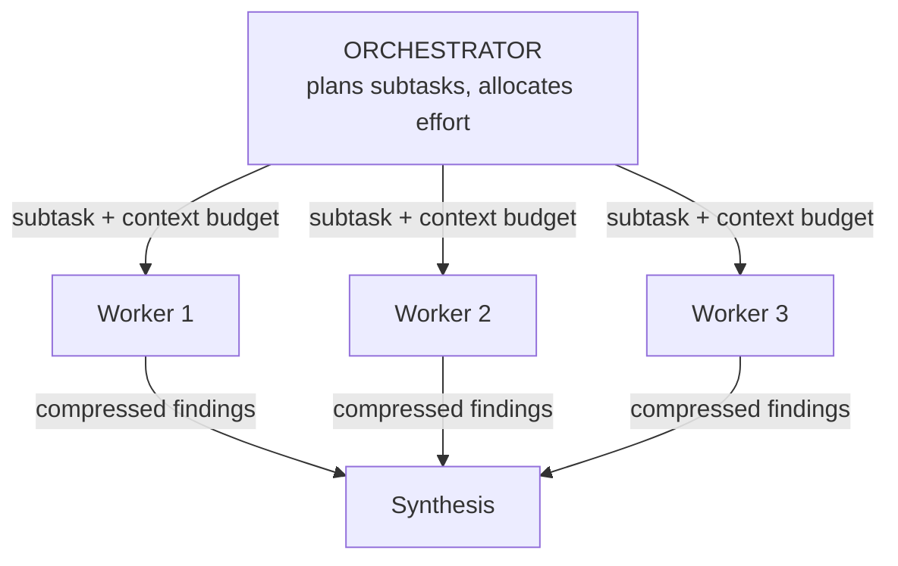
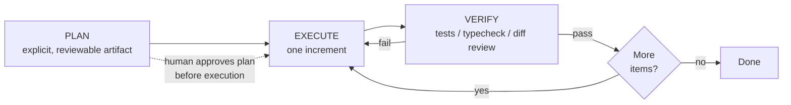

# Agent Orchestration Patterns

## TL;DR

Orchestration is how you structure LLM calls and control flow. The fundamental split: **workflows** (your code decides the steps, the model fills them in) versus **agents** (the model decides the steps). Production systems should use the simplest pattern that meets the bar — chaining, routing, parallelization, orchestrator–workers, evaluator–optimizer — and graduate to an autonomous loop only for open-ended tasks with verifiable outcomes. Reasoning models internalized most 2023-era prompt scaffolds (Chain-of-Thought, Tree-of-Thought, self-consistency); the modern levers are thinking budgets, plan–execute–verify structure, subagent context isolation, and durable execution.

---

## Workflows vs. Agents



This distinction (popularized by Anthropic's *Building Effective Agents*) is the most useful one in the field. Workflows trade flexibility for predictability — when you know the steps, encoding them in code is strictly better than asking a model to rediscover them on every request. Agents trade predictability for reach. The most common architecture mistake of the past two years was building an agent (or a multi-agent system) where a three-step workflow would do.

A useful corollary: **autonomy is a dial, not a binary.** The same task can ship as a workflow with one agentic step inside it, or as an agent constrained by a workflow-shaped plan. Move the dial toward autonomy only when evals show the rigid version failing on real inputs.

---

## Workflow Patterns

### Prompt Chaining

Decompose a task into a fixed sequence where each call consumes the previous call's output. Add programmatic **gates** between steps — cheap checks that catch derailment early instead of letting errors compound.



```python
async def marketing_chain(brief: str) -> str:
    outline = await llm(f"Extract a structured outline from this brief:\n{brief}",
                        response_format=Outline)          # typed gate: pydantic validation
    if len(outline.sections) < 3:
        outline = await llm(f"Outline too thin ({len(outline.sections)} sections). "
                            f"Expand to 4-6:\n{outline.model_dump_json()}",
                            response_format=Outline)
    draft = await llm(f"Write copy for each section:\n{outline.model_dump_json()}")
    return await llm(f"Edit for tone and tighten by 20%:\n{draft}")
```

Use when: the decomposition is stable and each step has a checkable contract. The gates are the point — a chain without validation is just a slower single prompt.

### Routing

Classify the input, then dispatch to a specialized prompt, toolset, or model. Routing is also the standard **cost-tiering** mechanism: send the easy 80% to a small fast model, escalate the hard 20%.

```python
ROUTES = {
    "refund":    {"model": SMALL, "system": REFUND_PROMPT,  "tools": [refund_lookup]},
    "technical": {"model": LARGE, "system": DEBUG_PROMPT,   "tools": [search_docs, run_repro]},
    "general":   {"model": SMALL, "system": GENERAL_PROMPT, "tools": []},
}

async def handle(ticket: str) -> str:
    route = await llm(f"Classify this ticket: {ticket}",
                      response_format=Route, model=SMALL)
    cfg = ROUTES[route.category]
    return await run(cfg, ticket)
```

Use when: inputs cluster into categories with different optimal handling. Keep the classifier's label set small and mutually exclusive; route "unknown" to the most capable path, not the cheapest.

### Parallelization

Two distinct forms:

- **Sectioning** — split independent subtasks, run concurrently, merge. (Review a PR for security, performance, and style in three parallel calls.)
- **Voting** — run the *same* task N times, aggregate. Majority vote for classification; union for issue-finding; best-of-N with a grader for generation. This is the production descendant of self-consistency: you pay N× for a reliability bump where it matters.

```python
findings = await asyncio.gather(
    llm(SECURITY_REVIEW + diff),
    llm(PERF_REVIEW + diff),
    llm(STYLE_REVIEW + diff),
)                                   # sectioning

verdicts = await asyncio.gather(*[
    llm(f"Does this diff introduce a breaking API change? yes/no + evidence:\n{diff}")
    for _ in range(5)
])                                  # voting: flag if ≥2 say yes
```

Use when: subtasks are independent (sectioning) or single-shot reliability is below the bar and verification is hard (voting). Latency ≈ the slowest branch instead of the sum.

### Orchestrator–Workers

A capable model decomposes the task *at runtime* and dispatches subtasks to worker calls (often cheaper models, or parallel instances), then synthesizes. Unlike sectioning, the subtasks aren't known in advance — the decomposition is itself model output. This is the backbone pattern of deep-research systems and most production "multi-agent" deployments; the full treatment, including context-sharing economics, is in [Multi-Agent Systems](./03-multi-agent-systems.md).



### Evaluator–Optimizer

One call generates; another grades against explicit criteria and returns actionable feedback; loop until pass or budget exhausted. This works when evaluation is genuinely easier than generation — translation nuance, search-result relevance, matching a style guide.

```python
async def refine(task: str, max_rounds: int = 3) -> str:
    draft = await llm(task)
    for _ in range(max_rounds):
        review = await llm(f"Grade against the rubric. PASS or revisions needed.\n"
                           f"Rubric:\n{RUBRIC}\n\nDraft:\n{draft}",
                           response_format=Review)
        if review.verdict == "PASS":
            break
        draft = await llm(f"Revise. Address every point.\n"
                          f"Feedback:\n{review.feedback}\n\nDraft:\n{draft}")
    return draft
```

Caution: an LLM grader without ground truth drifts toward leniency, and generator/grader pairs from the same model family share blind spots. Anchor the rubric with objective checks (length, schema, banned claims, citation presence) wherever possible.

---

## The Agent Loop

When steps can't be enumerated, hand control flow to the model: tools in a loop, environment feedback each turn, harness-enforced budgets. The mechanics live in [Agent Fundamentals](./01-agent-fundamentals.md); what matters here is the macro-structure that makes loops reliable.

### Plan–Execute–Verify

The dominant macro-pattern for agentic work. Make the agent externalize a plan *as an artifact* (a markdown checklist, a TODO list the harness renders), execute against it, and verify each increment against ground truth before moving on.



Why it works:

- The plan is a **checkpoint for humans** — reviewing a plan costs seconds; reviewing a 2,000-line surprise diff costs an afternoon.
- The plan **survives compaction** — after a context reset, the agent re-reads its own plan and continues; goal drift drops sharply.
- Verification per increment stops error compounding (the 98%-per-step problem) at the increment boundary.

Plan-and-Execute as a *rigid* pattern (plan once, execute blindly) failed; the version that won keeps the plan live — the agent updates it as reality pushes back.

### Subagent Delegation

Spawning a fresh agent for a subtask is primarily a **context-isolation** move, not a parallelism move. A subagent can burn 200K tokens grepping through a codebase and return a 2K-token answer; the orchestrator's context stays clean. Delegate when the subtask is self-contained and its intermediate state is noise to the parent; don't delegate tightly-coupled work — each handoff loses unwritten context, and subagents that each "see only slices" of a shared artifact produce incoherent results.

### Long-Horizon Loops: Compaction and Memory

For tasks longer than one context window, the harness owns continuity:

- **Compaction** — summarize the transcript (decisions, file paths, constraints, open items), restart the loop with summary + recent turns.
- **File-based state** — the agent maintains `plan.md` / `notes.md`; the loop survives process restarts, not just context resets.
- **One-writer rule** — a long-running agent session should be the only writer to its workspace; concurrent mutation invalidates its world model.

### Durable Execution

Agent loops in production are long-running, stateful, failure-prone processes — the same problem shape as payment workflows, and the same solution applies: durable execution engines (Temporal-style) that persist each step, replay on crash, and resume from the last checkpoint. Tool calls become activities with retry policies; human approvals become signals; "the pod died at turn 37" stops being a lost task. If you're not adopting an engine, you still need its invariants: every turn persisted, every tool idempotent or compensatable, resume-from-checkpoint tested.

---

## What Reasoning Models Changed

The 2023 orchestration canon — ReAct, Chain-of-Thought, Tree-of-Thought, self-consistency, Reflexion — was a set of *prompt-level workarounds* for models that couldn't deliberate. RL-trained reasoning models (the o-series, DeepSeek-R1, Claude's extended thinking, Gemini's thinking modes) internalized that deliberation: the model explores, backtracks, and self-corrects inside its thinking tokens, and you buy more of it with a **thinking-budget parameter** instead of prompt scaffolding. Test-time compute became a dial.

| 2023 pattern | What it did | Where it went |
|---|---|---|
| ReAct (`Thought:/Action:` text) | Interleaved reasoning + tool use via parsed text | Native tool calling + interleaved thinking. The *idea* won; the prompt format died. |
| Chain-of-Thought ("think step by step") | Elicited intermediate reasoning | Internalized by reasoning RL. Still useful on small/non-reasoning models, and for *auditable* reasoning you must log. |
| Self-consistency (sample N, vote) | Reliability via diversity | Survives as the voting form of parallelization — applied at the *task* level where verification is hard. |
| Tree-of-Thought (explicit search) | Explored alternative reasoning paths | Internalized (models backtrack in-thought). Explicit search survives in domains with cheap programmatic evaluators (game states, formal proofs). |
| Reflexion (verbal self-critique across retries) | Learning from failed episodes | Survives as plan–execute–verify with *real* verifier feedback instead of self-generated critique — and as RL training data on the provider side. |

Practical guidance:

- **Don't stack scaffolds on reasoning models.** Forcing a hand-written CoT format on a model with native thinking typically wastes tokens and can degrade quality. Set the budget, state the goal and constraints, give it tools.
- **Match budget to verifiability.** High thinking budget for one-shot, hard-to-verify decisions (architecture, migration plans); low budget for tight tool loops where the environment gives feedback every few seconds anyway.
- **Scaffolds still earn their keep** on small models (cost tiering), in regulated settings where reasoning must be externalized and stored, and for structured aggregation (voting) where you need statistical confidence rather than one model's conviction.

---

## Pattern Selection

| Pattern | Control flow | Cost profile | Reach | Use when |
|---|---|---|---|---|
| Single call + good prompt | — | 1× | Low | Always try first |
| Prompt chaining | Code | n× sequential | Low | Stable decomposition, checkable steps |
| Routing | Code | ~1× + classifier | Low | Heterogeneous inputs, cost tiering |
| Parallel: sectioning | Code | n× concurrent | Medium | Independent subtasks |
| Parallel: voting | Code | n× concurrent | Medium | Reliability below bar, weak verifiers |
| Orchestrator–workers | Model plans, code executes | Variable | High | Unpredictable decomposition (research, search) |
| Evaluator–optimizer | Code loop | 2–6× | Medium | Grading easier than generating |
| Agent loop | Model | Unbounded — budget it | Highest | Open-ended, verifiable, tool-rich tasks |

Composition is the norm: a router in front, an agent loop for the hard branch, plan–execute–verify inside the loop, a voting step at the end for the release gate. Compose patterns the way you compose functions — each addition must pay for itself in eval results, not vibes. Every layer adds latency, cost, and a new way to fail silently.

---

## Failure Modes to Design Against

- **Scaffold ossification.** A workflow tuned around last year's model becomes a ceiling on this year's. Re-run the "do we still need this step?" eval at every model upgrade; the best orchestration code is the code you get to delete.
- **Grader drift.** LLM judges anchor to surface features (length, confidence) — calibrate against a labeled set; alarm when judge-vs-human agreement drops.
- **Silent loop divergence.** Agents that retry the same failing action with cosmetic variations. Detect repeated tool-call signatures in the harness and force a strategy change or escalate.
- **Budget-free autonomy.** Every loop needs max-turns, token, wall-clock, and spend ceilings, set from eval p95s — not from optimism.
- **Coordination without shared state.** Parallel workers writing to the same artifact produce merge conflicts in semantics, not just in git. Partition by ownership (see [Multi-Agent Systems](./03-multi-agent-systems.md)).

---

## References

- [Building Effective Agents](https://www.anthropic.com/research/building-effective-agents) — Anthropic; the workflow/agent taxonomy this article follows
- [DeepSeek-R1: Incentivizing Reasoning Capability in LLMs via Reinforcement Learning](https://arxiv.org/abs/2501.12948) — how reasoning got internalized
- [ReAct: Synergizing Reasoning and Acting](https://arxiv.org/abs/2210.03629), [Tree of Thoughts](https://arxiv.org/abs/2305.10601), [Reflexion](https://arxiv.org/abs/2303.11366), [Self-Consistency](https://arxiv.org/abs/2203.11171) — the historical scaffolds and what they taught the field
- [How We Built Our Multi-Agent Research System](https://www.anthropic.com/engineering/built-multi-agent-research-system) — orchestrator–workers at production scale
- [Don't Build Multi-Agents](https://cognition.ai/blog/dont-build-multi-agents) — Cognition; the context-sharing counterargument
- [Temporal](https://temporal.io/) — durable execution for long-running workflows
