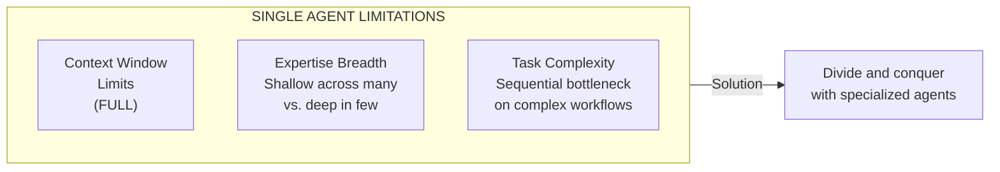
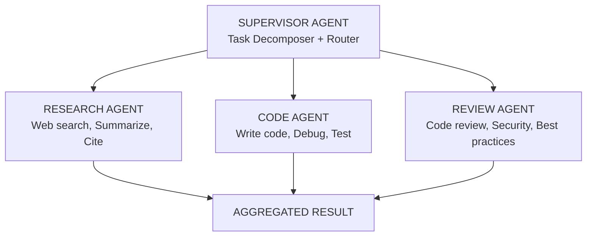
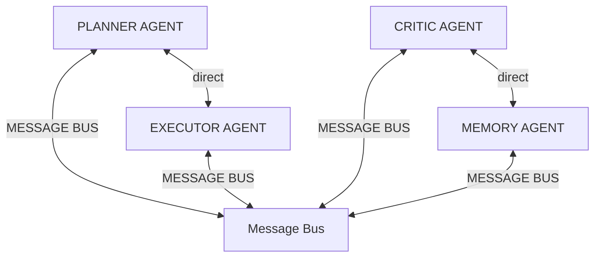
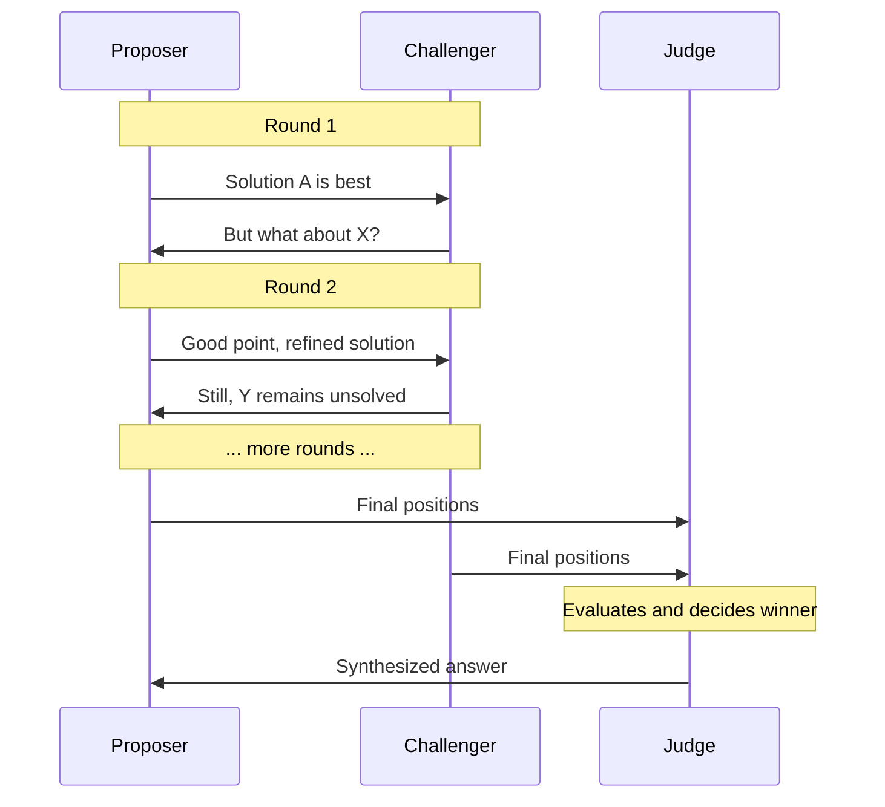
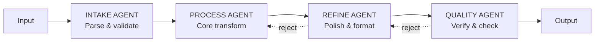
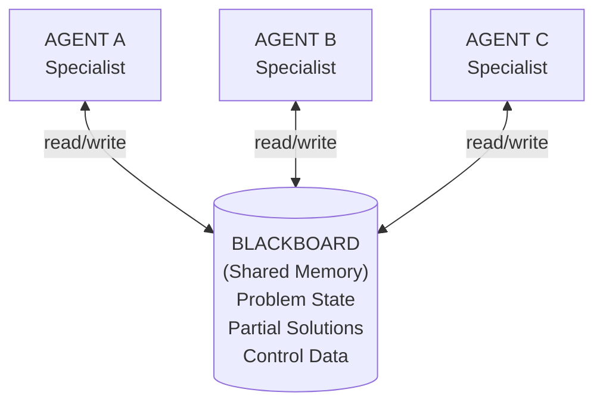

# Multi-Agent Systems

## TL;DR

Multi-agent systems coordinate multiple specialized LLM agents to solve complex tasks that exceed single-agent capabilities. Key patterns include hierarchical orchestration (supervisor agents), peer-to-peer collaboration, debate/adversarial systems, and assembly line pipelines. Success depends on clear role definitions, structured communication protocols, state management, and conflict resolution strategies.

---

## The Problem with Single Agents

Single agents hit fundamental limits when facing complex, multi-faceted tasks:



---

## Multi-Agent Architecture Patterns

### Pattern 1: Hierarchical (Supervisor) Architecture

A supervisor agent coordinates specialized worker agents:



```python
from typing import Literal
from pydantic import BaseModel
import asyncio

class TaskAssignment(BaseModel):
    """Supervisor's decision on task routing."""
    agent: Literal["researcher", "coder", "reviewer", "done"]
    task_description: str
    context: str
    priority: int = 1

class SupervisorAgent:
    """Coordinates specialized worker agents."""
    
    def __init__(self, llm_client):
        self.llm = llm_client
        self.workers = {
            "researcher": ResearchAgent(llm_client),
            "coder": CodeAgent(llm_client),
            "reviewer": ReviewAgent(llm_client),
        }
        self.conversation_history = []
        self.task_results = {}
    
    async def run(self, user_request: str, max_iterations: int = 10) -> str:
        """Main orchestration loop."""
        self.conversation_history.append({
            "role": "user",
            "content": user_request
        })
        
        for iteration in range(max_iterations):
            # Supervisor decides next action
            assignment = await self._decide_next_action()
            
            if assignment.agent == "done":
                return await self._synthesize_final_response()
            
            # Delegate to appropriate worker
            worker = self.workers[assignment.agent]
            result = await worker.execute(
                task=assignment.task_description,
                context=assignment.context,
                previous_results=self.task_results
            )
            
            # Track results
            self.task_results[f"{assignment.agent}_{iteration}"] = result
            self.conversation_history.append({
                "role": "assistant",
                "content": f"[{assignment.agent}]: {result.summary}"
            })
        
        return await self._synthesize_final_response()
    
    async def _decide_next_action(self) -> TaskAssignment:
        """Supervisor LLM decides which agent to invoke next."""
        system_prompt = """You are a supervisor coordinating a team of agents:
        - researcher: Gathers information, searches web, analyzes documents
        - coder: Writes, debugs, and tests code
        - reviewer: Reviews code for quality, security, best practices
        - done: All tasks complete, ready to deliver final response
        
        Based on the conversation and completed tasks, decide the next action.
        Return a JSON with: agent, task_description, context, priority"""
        
        response = await self.llm.generate(
            system=system_prompt,
            messages=self.conversation_history,
            response_format=TaskAssignment
        )
        return response
    
    async def _synthesize_final_response(self) -> str:
        """Combine all worker results into coherent response."""
        synthesis_prompt = f"""Synthesize the following agent outputs into 
        a coherent final response:
        
        {self.task_results}
        
        Original request: {self.conversation_history[0]['content']}
        """
        return await self.llm.generate(synthesis_prompt)


class ResearchAgent:
    """Specialized agent for research tasks."""
    
    def __init__(self, llm_client):
        self.llm = llm_client
        self.tools = [WebSearchTool(), DocumentAnalyzer(), CitationManager()]
    
    async def execute(self, task: str, context: str, previous_results: dict):
        system_prompt = """You are a research specialist. Your capabilities:
        - Search the web for current information
        - Analyze and summarize documents
        - Provide properly cited sources
        
        Be thorough but concise. Always cite sources."""
        
        # ReAct loop for research
        return await self._react_loop(system_prompt, task, context)
```

### Pattern 2: Peer-to-Peer Collaboration

Agents communicate directly without central coordination:



Each agent can: broadcast messages to all, send direct messages, request help, vote on decisions

```python
import asyncio
from dataclasses import dataclass
from typing import Optional
from enum import Enum

class MessageType(Enum):
    REQUEST = "request"
    RESPONSE = "response"
    BROADCAST = "broadcast"
    VOTE_REQUEST = "vote_request"
    VOTE = "vote"

@dataclass
class AgentMessage:
    sender: str
    recipient: Optional[str]  # None = broadcast
    message_type: MessageType
    content: dict
    correlation_id: str

class MessageBus:
    """Central message broker for agent communication."""
    
    def __init__(self):
        self.subscribers: dict[str, asyncio.Queue] = {}
        self.message_history: list[AgentMessage] = []
    
    def register(self, agent_id: str) -> asyncio.Queue:
        """Register an agent to receive messages."""
        queue = asyncio.Queue()
        self.subscribers[agent_id] = queue
        return queue
    
    async def publish(self, message: AgentMessage):
        """Publish a message to appropriate recipients."""
        self.message_history.append(message)
        
        if message.recipient is None:
            # Broadcast to all except sender
            for agent_id, queue in self.subscribers.items():
                if agent_id != message.sender:
                    await queue.put(message)
        else:
            # Direct message
            if message.recipient in self.subscribers:
                await self.subscribers[message.recipient].put(message)


class PeerAgent:
    """Base class for peer-to-peer agents."""
    
    def __init__(self, agent_id: str, role: str, llm_client, message_bus: MessageBus):
        self.agent_id = agent_id
        self.role = role
        self.llm = llm_client
        self.bus = message_bus
        self.inbox = message_bus.register(agent_id)
        self.pending_requests: dict[str, asyncio.Future] = {}
    
    async def run(self):
        """Main agent loop - process incoming messages."""
        while True:
            message = await self.inbox.get()
            asyncio.create_task(self._handle_message(message))
    
    async def _handle_message(self, message: AgentMessage):
        """Process incoming message based on type."""
        if message.message_type == MessageType.REQUEST:
            response = await self._process_request(message)
            await self.send(
                recipient=message.sender,
                message_type=MessageType.RESPONSE,
                content=response,
                correlation_id=message.correlation_id
            )
        elif message.message_type == MessageType.RESPONSE:
            if message.correlation_id in self.pending_requests:
                self.pending_requests[message.correlation_id].set_result(message)
        elif message.message_type == MessageType.BROADCAST:
            await self._handle_broadcast(message)
    
    async def request(self, recipient: str, content: dict, timeout: float = 30) -> dict:
        """Send request and wait for response."""
        correlation_id = str(uuid.uuid4())
        future = asyncio.Future()
        self.pending_requests[correlation_id] = future
        
        await self.send(recipient, MessageType.REQUEST, content, correlation_id)
        
        try:
            response = await asyncio.wait_for(future, timeout)
            return response.content
        finally:
            del self.pending_requests[correlation_id]
    
    async def broadcast(self, content: dict):
        """Broadcast message to all agents."""
        await self.send(None, MessageType.BROADCAST, content, str(uuid.uuid4()))


class PlannerAgent(PeerAgent):
    """Plans and coordinates task execution."""
    
    async def _process_request(self, message: AgentMessage) -> dict:
        if message.content.get("action") == "create_plan":
            plan = await self._create_plan(message.content["task"])
            
            # Broadcast plan for feedback
            await self.broadcast({
                "action": "plan_proposal",
                "plan": plan,
                "request_feedback": True
            })
            
            return {"status": "plan_created", "plan": plan}
    
    async def _create_plan(self, task: str) -> list[dict]:
        response = await self.llm.generate(
            system="You are a planning specialist. Break down tasks into steps.",
            prompt=f"Create a plan for: {task}"
        )
        return response


class CriticAgent(PeerAgent):
    """Reviews and critiques other agents' outputs."""
    
    async def _handle_broadcast(self, message: AgentMessage):
        if message.content.get("action") == "plan_proposal":
            critique = await self._critique_plan(message.content["plan"])
            
            # Send critique back to planner
            await self.send(
                recipient=message.sender,
                message_type=MessageType.RESPONSE,
                content={"critique": critique},
                correlation_id=message.correlation_id
            )
```

### Pattern 3: Debate / Adversarial Pattern

Multiple agents debate to improve output quality:



```python
class DebateSystem:
    """Implements adversarial debate between agents."""
    
    def __init__(self, llm_client, num_rounds: int = 3):
        self.llm = llm_client
        self.num_rounds = num_rounds
        self.proposer = DebateAgent("proposer", "advocate", llm_client)
        self.challenger = DebateAgent("challenger", "critic", llm_client)
        self.judge = JudgeAgent(llm_client)
    
    async def debate(self, topic: str) -> dict:
        """Run a full debate on a topic."""
        debate_history = []
        
        # Initial proposal
        proposal = await self.proposer.make_argument(
            topic=topic,
            role="proposer",
            history=[]
        )
        debate_history.append({"agent": "proposer", "argument": proposal})
        
        # Debate rounds
        for round_num in range(self.num_rounds):
            # Challenger responds
            challenge = await self.challenger.make_argument(
                topic=topic,
                role="challenger",
                history=debate_history
            )
            debate_history.append({"agent": "challenger", "argument": challenge})
            
            # Proposer responds
            response = await self.proposer.make_argument(
                topic=topic,
                role="proposer",
                history=debate_history
            )
            debate_history.append({"agent": "proposer", "argument": response})
        
        # Judge decides
        verdict = await self.judge.evaluate(topic, debate_history)
        
        return {
            "debate_history": debate_history,
            "verdict": verdict,
            "final_answer": verdict["synthesized_answer"]
        }


class DebateAgent:
    """Agent that participates in debates."""
    
    ROLE_PROMPTS = {
        "proposer": """You are advocating for your position. 
        Make strong arguments, address counterpoints, and defend your stance.
        Be persuasive but intellectually honest.""",
        
        "challenger": """You are challenging the proposal.
        Find weaknesses, ask probing questions, propose alternatives.
        Be critical but constructive."""
    }
    
    async def make_argument(self, topic: str, role: str, history: list) -> str:
        formatted_history = "\n".join([
            f"{h['agent']}: {h['argument']}" for h in history
        ])
        
        response = await self.llm.generate(
            system=self.ROLE_PROMPTS[role],
            prompt=f"""Topic: {topic}
            
            Debate so far:
            {formatted_history}
            
            Make your next argument (2-3 paragraphs):"""
        )
        return response


class JudgeAgent:
    """Evaluates debate and synthesizes final answer."""
    
    async def evaluate(self, topic: str, history: list) -> dict:
        formatted = "\n".join([f"{h['agent']}: {h['argument']}" for h in history])
        
        response = await self.llm.generate(
            system="""You are an impartial judge evaluating a debate.
            Consider the strength of arguments, evidence provided, and logical consistency.
            Synthesize the best elements from both sides into a final answer.""",
            prompt=f"""Topic: {topic}
            
            Full debate:
            {formatted}
            
            Provide:
            1. Analysis of each side's strongest points
            2. Weaknesses in each position  
            3. Your synthesized final answer combining the best insights""",
            response_format=JudgeVerdict
        )
        return response
```

### Pattern 4: Assembly Line (Pipeline)

Sequential processing with specialized stages:



Each stage: has specific responsibility, can reject/return to previous stage, adds metadata for next stage

```python
from abc import ABC, abstractmethod
from dataclasses import dataclass, field

@dataclass
class PipelineContext:
    """Carries data through the pipeline."""
    original_input: str
    current_data: any
    stage_outputs: dict = field(default_factory=dict)
    metadata: dict = field(default_factory=dict)
    errors: list = field(default_factory=list)

class PipelineStage(ABC):
    """Base class for pipeline stages."""
    
    @abstractmethod
    async def process(self, context: PipelineContext) -> PipelineContext:
        pass
    
    @abstractmethod
    def can_process(self, context: PipelineContext) -> bool:
        pass


class CodeGenerationPipeline:
    """Assembly line for code generation."""
    
    def __init__(self, llm_client):
        self.stages = [
            RequirementsAgent(llm_client),
            ArchitectureAgent(llm_client),
            ImplementationAgent(llm_client),
            TestingAgent(llm_client),
            ReviewAgent(llm_client),
        ]
    
    async def run(self, user_request: str) -> PipelineContext:
        context = PipelineContext(
            original_input=user_request,
            current_data=user_request
        )
        
        for stage in self.stages:
            if not stage.can_process(context):
                context.errors.append(f"Stage {stage.__class__.__name__} cannot process")
                break
            
            context = await stage.process(context)
            context.stage_outputs[stage.__class__.__name__] = context.current_data
            
            # Check for stage failures
            if context.metadata.get("stage_failed"):
                # Optionally retry or route to error handling
                break
        
        return context


class RequirementsAgent(PipelineStage):
    """Extracts and clarifies requirements."""
    
    def __init__(self, llm_client):
        self.llm = llm_client
    
    def can_process(self, context: PipelineContext) -> bool:
        return isinstance(context.current_data, str)
    
    async def process(self, context: PipelineContext) -> PipelineContext:
        response = await self.llm.generate(
            system="""Extract structured requirements from the user request.
            Identify: functional requirements, non-functional requirements,
            constraints, and ambiguities that need clarification.""",
            prompt=context.current_data,
            response_format=Requirements
        )
        
        context.current_data = response
        context.metadata["requirements_extracted"] = True
        return context


class ArchitectureAgent(PipelineStage):
    """Designs system architecture based on requirements."""
    
    async def process(self, context: PipelineContext) -> PipelineContext:
        requirements = context.current_data
        
        response = await self.llm.generate(
            system="""Design a system architecture based on requirements.
            Include: components, interfaces, data flow, and technology choices.""",
            prompt=f"Requirements: {requirements}",
            response_format=Architecture
        )
        
        context.current_data = response
        context.metadata["architecture_designed"] = True
        return context
```

---

## Communication Protocols

### Structured Message Format

```python
from pydantic import BaseModel
from datetime import datetime
from typing import Optional, Any

class AgentMessage(BaseModel):
    """Standardized message format for agent communication."""
    
    # Routing
    message_id: str
    correlation_id: Optional[str] = None  # For request-response pairing
    sender_id: str
    recipient_id: Optional[str] = None  # None = broadcast
    
    # Timing
    timestamp: datetime
    ttl_seconds: Optional[int] = None
    
    # Content
    message_type: str  # "request", "response", "event", "command"
    action: str        # Specific action requested
    payload: dict[str, Any]
    
    # Context
    conversation_id: str
    parent_message_id: Optional[str] = None
    
    # Metadata
    priority: int = 5  # 1-10, higher = more urgent
    require_ack: bool = False


class ConversationProtocol:
    """Manages structured conversations between agents."""
    
    def __init__(self):
        self.conversations: dict[str, list[AgentMessage]] = {}
    
    def start_conversation(self, initiator: str, topic: str) -> str:
        """Start a new conversation thread."""
        conv_id = str(uuid.uuid4())
        self.conversations[conv_id] = []
        return conv_id
    
    def add_message(self, message: AgentMessage):
        """Add message to conversation history."""
        if message.conversation_id in self.conversations:
            self.conversations[message.conversation_id].append(message)
    
    def get_context(self, conversation_id: str, max_messages: int = 10) -> list:
        """Get recent conversation context."""
        return self.conversations.get(conversation_id, [])[-max_messages:]
```

### Shared Memory / Blackboard Pattern



```python
from typing import Optional
import asyncio
from datetime import datetime

class Blackboard:
    """Shared memory space for multi-agent collaboration."""
    
    def __init__(self):
        self._state: dict[str, Any] = {}
        self._locks: dict[str, asyncio.Lock] = {}
        self._subscribers: dict[str, list[callable]] = {}
        self._history: list[dict] = []
    
    async def read(self, key: str) -> Optional[Any]:
        """Read value from blackboard."""
        return self._state.get(key)
    
    async def write(self, key: str, value: Any, writer_id: str):
        """Write value to blackboard with locking."""
        if key not in self._locks:
            self._locks[key] = asyncio.Lock()
        
        async with self._locks[key]:
            old_value = self._state.get(key)
            self._state[key] = value
            
            # Record history
            self._history.append({
                "timestamp": datetime.now(),
                "key": key,
                "old_value": old_value,
                "new_value": value,
                "writer": writer_id
            })
            
            # Notify subscribers
            await self._notify(key, value, writer_id)
    
    def subscribe(self, key: str, callback: callable):
        """Subscribe to changes on a key."""
        if key not in self._subscribers:
            self._subscribers[key] = []
        self._subscribers[key].append(callback)
    
    async def _notify(self, key: str, value: Any, writer_id: str):
        """Notify all subscribers of a change."""
        for callback in self._subscribers.get(key, []):
            await callback(key, value, writer_id)


class BlackboardAgent:
    """Agent that collaborates via blackboard."""
    
    def __init__(self, agent_id: str, blackboard: Blackboard, llm_client):
        self.agent_id = agent_id
        self.blackboard = blackboard
        self.llm = llm_client
        
        # Subscribe to relevant keys
        blackboard.subscribe("problem_state", self.on_state_change)
        blackboard.subscribe("help_requests", self.on_help_request)
    
    async def on_state_change(self, key: str, value: Any, writer_id: str):
        """React to problem state changes."""
        if writer_id == self.agent_id:
            return  # Ignore own writes
        
        # Check if we can contribute
        contribution = await self._evaluate_contribution(value)
        if contribution:
            current = await self.blackboard.read("partial_solutions") or []
            current.append({
                "agent": self.agent_id,
                "contribution": contribution
            })
            await self.blackboard.write("partial_solutions", current, self.agent_id)
    
    async def _evaluate_contribution(self, state: dict) -> Optional[dict]:
        """Determine if agent can contribute to current state."""
        response = await self.llm.generate(
            system=f"You are a specialist in {self.specialty}. "
                   "Evaluate if you can contribute to solving this problem.",
            prompt=f"Current state: {state}\n\nCan you contribute? If so, what?"
        )
        return response if response.get("can_contribute") else None
```

---

## State Management

### Distributed State with Event Sourcing

```python
from dataclasses import dataclass
from typing import List
from datetime import datetime
import json

@dataclass
class AgentEvent:
    """Immutable event representing a state change."""
    event_id: str
    agent_id: str
    event_type: str
    payload: dict
    timestamp: datetime
    version: int

class EventStore:
    """Persistent store for agent events."""
    
    def __init__(self, storage_backend):
        self.storage = storage_backend
        self.subscribers: list[callable] = []
    
    async def append(self, event: AgentEvent):
        """Append event to store."""
        await self.storage.save(event)
        
        # Notify subscribers
        for subscriber in self.subscribers:
            await subscriber(event)
    
    async def get_events(
        self, 
        agent_id: str = None,
        event_type: str = None,
        since: datetime = None
    ) -> List[AgentEvent]:
        """Query events with filters."""
        return await self.storage.query(agent_id, event_type, since)
    
    async def rebuild_state(self, agent_id: str) -> dict:
        """Rebuild agent state from events."""
        events = await self.get_events(agent_id=agent_id)
        state = {}
        
        for event in events:
            state = self._apply_event(state, event)
        
        return state
    
    def _apply_event(self, state: dict, event: AgentEvent) -> dict:
        """Apply event to state (reducer pattern)."""
        if event.event_type == "task_started":
            state["current_task"] = event.payload["task"]
            state["status"] = "working"
        elif event.event_type == "task_completed":
            state["completed_tasks"] = state.get("completed_tasks", [])
            state["completed_tasks"].append(event.payload)
            state["status"] = "idle"
        elif event.event_type == "error_occurred":
            state["last_error"] = event.payload
            state["status"] = "error"
        
        return state


class StatefulAgent:
    """Agent with event-sourced state management."""
    
    def __init__(self, agent_id: str, event_store: EventStore, llm_client):
        self.agent_id = agent_id
        self.event_store = event_store
        self.llm = llm_client
        self._state = None
    
    async def initialize(self):
        """Rebuild state from event history."""
        self._state = await self.event_store.rebuild_state(self.agent_id)
    
    async def execute_task(self, task: dict):
        """Execute task with state tracking."""
        # Emit start event
        await self._emit_event("task_started", {"task": task})
        
        try:
            result = await self._do_work(task)
            await self._emit_event("task_completed", {
                "task": task,
                "result": result
            })
            return result
        except Exception as e:
            await self._emit_event("error_occurred", {
                "task": task,
                "error": str(e)
            })
            raise
    
    async def _emit_event(self, event_type: str, payload: dict):
        """Emit and persist an event."""
        event = AgentEvent(
            event_id=str(uuid.uuid4()),
            agent_id=self.agent_id,
            event_type=event_type,
            payload=payload,
            timestamp=datetime.now(),
            version=len(await self.event_store.get_events(self.agent_id)) + 1
        )
        await self.event_store.append(event)
        
        # Update local state
        self._state = self.event_store._apply_event(self._state, event)
```

---

## Conflict Resolution

### Voting and Consensus

```python
from enum import Enum
from collections import Counter

class VotingStrategy(Enum):
    MAJORITY = "majority"
    UNANIMOUS = "unanimous"
    WEIGHTED = "weighted"
    RANKED_CHOICE = "ranked_choice"

class ConflictResolver:
    """Resolves conflicts between agent outputs."""
    
    def __init__(self, strategy: VotingStrategy = VotingStrategy.MAJORITY):
        self.strategy = strategy
    
    async def resolve(
        self, 
        question: str,
        agent_responses: dict[str, Any],
        weights: dict[str, float] = None
    ) -> dict:
        """Resolve conflicting agent responses."""
        
        if self.strategy == VotingStrategy.MAJORITY:
            return self._majority_vote(agent_responses)
        elif self.strategy == VotingStrategy.WEIGHTED:
            return self._weighted_vote(agent_responses, weights)
        elif self.strategy == VotingStrategy.RANKED_CHOICE:
            return await self._ranked_choice(agent_responses)
    
    def _majority_vote(self, responses: dict[str, Any]) -> dict:
        """Simple majority voting."""
        # Normalize responses for comparison
        normalized = {k: self._normalize(v) for k, v in responses.items()}
        
        # Count votes
        vote_counts = Counter(normalized.values())
        winner = vote_counts.most_common(1)[0]
        
        # Find original response
        for agent_id, response in responses.items():
            if self._normalize(response) == winner[0]:
                return {
                    "decision": response,
                    "method": "majority_vote",
                    "vote_count": winner[1],
                    "total_votes": len(responses),
                    "winning_agent": agent_id
                }
    
    def _weighted_vote(
        self, 
        responses: dict[str, Any], 
        weights: dict[str, float]
    ) -> dict:
        """Weighted voting based on agent expertise/reliability."""
        scores = {}
        
        for agent_id, response in responses.items():
            normalized = self._normalize(response)
            weight = weights.get(agent_id, 1.0)
            
            if normalized not in scores:
                scores[normalized] = {"score": 0, "response": response, "voters": []}
            
            scores[normalized]["score"] += weight
            scores[normalized]["voters"].append(agent_id)
        
        # Find highest scored response
        winner = max(scores.values(), key=lambda x: x["score"])
        
        return {
            "decision": winner["response"],
            "method": "weighted_vote",
            "score": winner["score"],
            "voters": winner["voters"]
        }
    
    async def _ranked_choice(self, responses: dict[str, Any]) -> dict:
        """Ranked choice voting with elimination rounds."""
        # Each agent ranks all responses (including their own)
        # Simulate by having an LLM rank them
        pass
    
    def _normalize(self, response: Any) -> str:
        """Normalize response for comparison."""
        if isinstance(response, dict):
            return json.dumps(response, sort_keys=True)
        return str(response).lower().strip()


class ConsensusBuilder:
    """Builds consensus through iterative refinement."""
    
    def __init__(self, llm_client, max_rounds: int = 3):
        self.llm = llm_client
        self.max_rounds = max_rounds
    
    async def build_consensus(
        self,
        topic: str,
        agent_positions: dict[str, str]
    ) -> dict:
        """Iteratively build consensus among agents."""
        
        positions = agent_positions.copy()
        
        for round_num in range(self.max_rounds):
            # Check if consensus reached
            if self._is_consensus(positions):
                return {
                    "consensus": True,
                    "rounds": round_num + 1,
                    "final_position": list(positions.values())[0]
                }
            
            # Each agent considers others' positions
            new_positions = {}
            for agent_id, position in positions.items():
                others = {k: v for k, v in positions.items() if k != agent_id}
                
                revised = await self._revise_position(
                    agent_id, position, others, topic
                )
                new_positions[agent_id] = revised
            
            positions = new_positions
        
        # No full consensus - find common ground
        return {
            "consensus": False,
            "rounds": self.max_rounds,
            "final_positions": positions,
            "common_ground": await self._find_common_ground(positions, topic)
        }
    
    async def _revise_position(
        self, 
        agent_id: str, 
        position: str, 
        others: dict, 
        topic: str
    ) -> str:
        """Agent revises position considering others' views."""
        response = await self.llm.generate(
            system=f"You are agent {agent_id}. Consider other perspectives "
                   "and revise your position if you find merit in their arguments. "
                   "Maintain your position if you believe you are correct.",
            prompt=f"""Topic: {topic}
            
            Your current position: {position}
            
            Other agents' positions:
            {json.dumps(others, indent=2)}
            
            Provide your revised position (or reaffirm your current one):"""
        )
        return response
```

---

## Real-World Example: Software Development Team

```python
class SoftwareDevTeam:
    """Multi-agent system simulating a software development team."""
    
    def __init__(self, llm_client):
        self.llm = llm_client
        self.message_bus = MessageBus()
        self.blackboard = Blackboard()
        self.event_store = EventStore(InMemoryStorage())
        
        # Create specialized agents
        self.agents = {
            "product_manager": ProductManagerAgent(
                "pm", self.message_bus, self.blackboard, llm_client
            ),
            "architect": ArchitectAgent(
                "arch", self.message_bus, self.blackboard, llm_client
            ),
            "developer": DeveloperAgent(
                "dev", self.message_bus, self.blackboard, llm_client
            ),
            "qa": QAAgent(
                "qa", self.message_bus, self.blackboard, llm_client
            ),
            "tech_writer": TechWriterAgent(
                "docs", self.message_bus, self.blackboard, llm_client
            ),
        }
        
        self.supervisor = TeamLeadAgent(
            "lead", self.agents, self.message_bus, llm_client
        )
    
    async def develop_feature(self, feature_request: str) -> dict:
        """Complete feature development lifecycle."""
        
        # Phase 1: Requirements
        await self.blackboard.write(
            "feature_request", 
            feature_request, 
            "system"
        )
        
        requirements = await self.supervisor.delegate(
            agent="product_manager",
            task="analyze_requirements",
            input=feature_request
        )
        await self.blackboard.write("requirements", requirements, "pm")
        
        # Phase 2: Architecture
        architecture = await self.supervisor.delegate(
            agent="architect",
            task="design_architecture",
            input=requirements
        )
        
        # Review architecture with debate
        debate = DebateSystem(self.llm)
        refined_arch = await debate.debate(
            topic=f"Review architecture: {architecture}"
        )
        await self.blackboard.write("architecture", refined_arch, "arch")
        
        # Phase 3: Implementation
        implementation = await self.supervisor.delegate(
            agent="developer",
            task="implement",
            input={"requirements": requirements, "architecture": refined_arch}
        )
        
        # Phase 4: Testing
        test_results = await self.supervisor.delegate(
            agent="qa",
            task="test",
            input=implementation
        )
        
        # Iterate if tests fail
        while not test_results["all_passed"]:
            fixes = await self.supervisor.delegate(
                agent="developer",
                task="fix_bugs",
                input=test_results["failures"]
            )
            test_results = await self.supervisor.delegate(
                agent="qa",
                task="test",
                input=fixes
            )
        
        # Phase 5: Documentation
        docs = await self.supervisor.delegate(
            agent="tech_writer",
            task="document",
            input={"code": implementation, "architecture": refined_arch}
        )
        
        return {
            "requirements": requirements,
            "architecture": refined_arch,
            "implementation": implementation,
            "tests": test_results,
            "documentation": docs
        }
```

---

## Trade-offs

| Approach | Pros | Cons |
|----------|------|------|
| **Hierarchical** | Clear control, easier debugging | Single point of failure, bottleneck |
| **Peer-to-Peer** | Resilient, flexible | Complex coordination, potential chaos |
| **Debate** | Higher quality outputs | Slow, expensive (multiple LLM calls) |
| **Pipeline** | Simple, predictable | Rigid, no backtracking |
| **Blackboard** | Flexible collaboration | Race conditions, complexity |

### When to Use Multi-Agent Systems

**Good fit:**
- Complex tasks requiring diverse expertise
- Tasks benefiting from multiple perspectives
- Long-running workflows with distinct phases
- Scenarios requiring checks and balances

**Poor fit:**
- Simple, single-step tasks
- Latency-critical applications
- Cost-sensitive environments
- Tasks requiring strong consistency

---

## References

- [AutoGen: Enabling Next-Gen LLM Applications](https://arxiv.org/abs/2308.08155) - Microsoft Research
- [CAMEL: Communicative Agents for Mind Exploration](https://arxiv.org/abs/2303.17760)
- [MetaGPT: Multi-Agent Framework](https://arxiv.org/abs/2308.00352)
- [Multi-Agent Debate Improves LLM Reasoning](https://arxiv.org/abs/2305.14325)
- [LangGraph Documentation](https://langchain-ai.github.io/langgraph/)
- [CrewAI Framework](https://github.com/joaomdmoura/crewAI)
