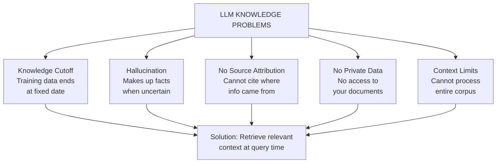
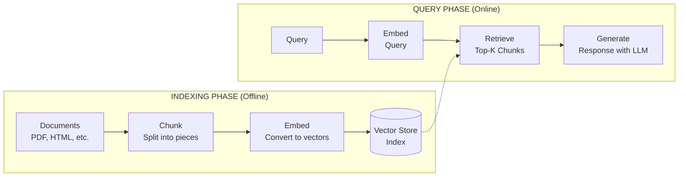
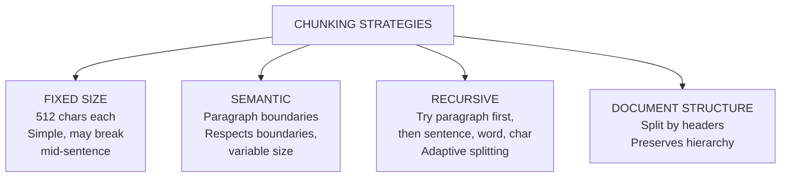
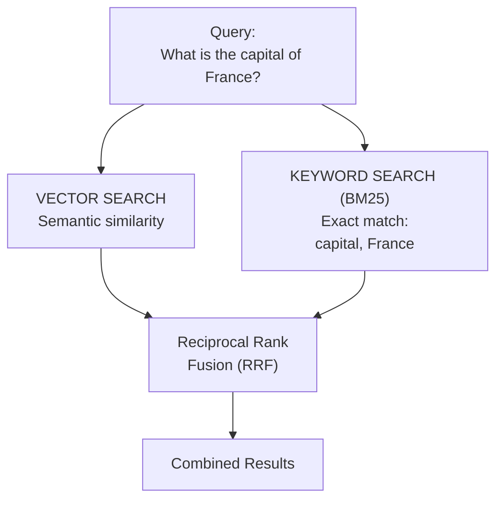
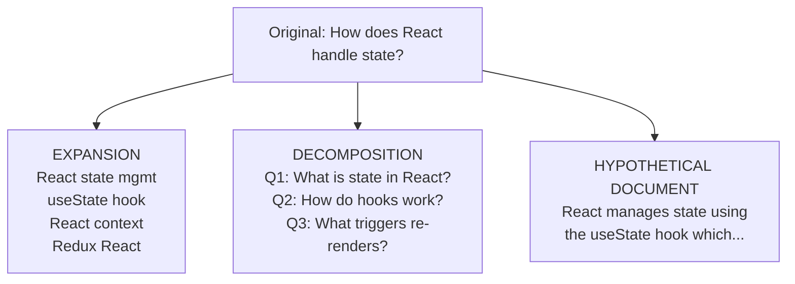
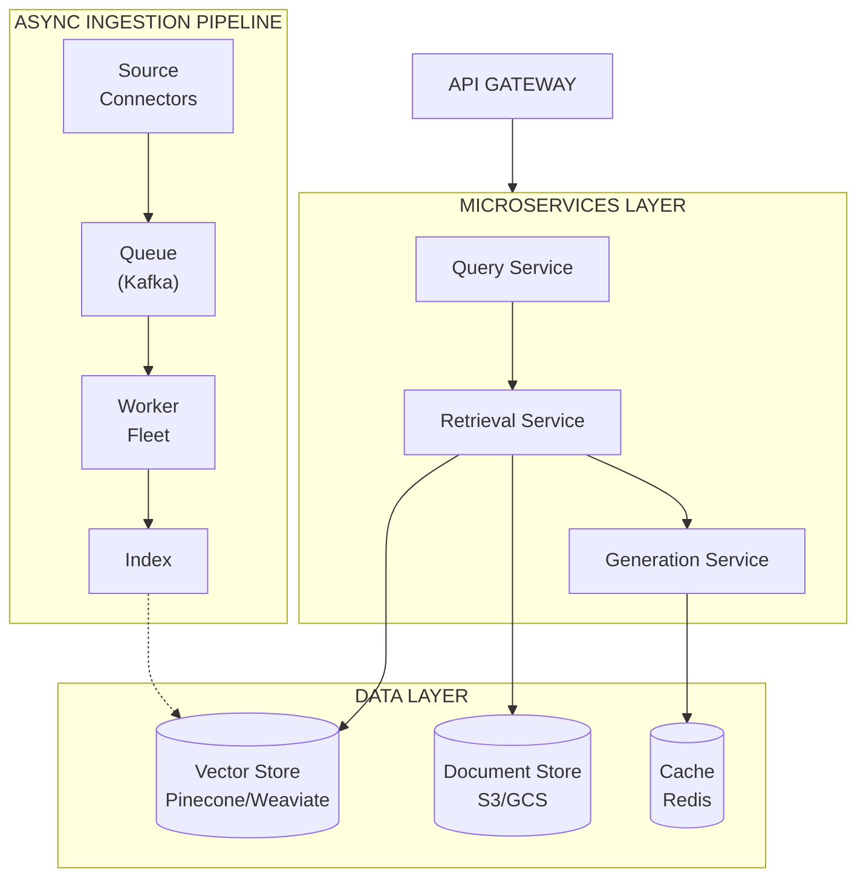

# Retrieval Augmented Generation (RAG) Patterns

## TL;DR

RAG enhances LLM responses by retrieving relevant context from external knowledge bases before generation. Key components include document ingestion (chunking, embedding), retrieval (vector search, hybrid search), and generation (context injection, citation). Advanced patterns include iterative retrieval, query transformation, re-ranking, and agentic RAG. Success depends on chunking strategy, embedding model selection, and retrieval quality metrics.

---

## The Problem: LLM Knowledge Limitations



---

## Basic RAG Architecture



```python
from dataclasses import dataclass
from typing import List, Optional
import numpy as np

@dataclass
class Document:
    """Represents a source document."""
    id: str
    content: str
    metadata: dict  # source, title, date, etc.

@dataclass  
class Chunk:
    """A piece of a document."""
    id: str
    document_id: str
    content: str
    embedding: Optional[List[float]] = None
    metadata: dict = None

@dataclass
class RetrievalResult:
    """Retrieved chunk with score."""
    chunk: Chunk
    score: float
    
class BasicRAGPipeline:
    """Simple RAG implementation."""
    
    def __init__(
        self, 
        embedding_model,
        vector_store,
        llm_client,
        chunk_size: int = 512,
        chunk_overlap: int = 50,
        top_k: int = 5
    ):
        self.embedder = embedding_model
        self.vector_store = vector_store
        self.llm = llm_client
        self.chunk_size = chunk_size
        self.chunk_overlap = chunk_overlap
        self.top_k = top_k
    
    # --- Indexing Phase ---
    
    async def ingest_documents(self, documents: List[Document]):
        """Process and index documents."""
        all_chunks = []
        
        for doc in documents:
            # Split into chunks
            chunks = self._chunk_document(doc)
            
            # Generate embeddings
            texts = [c.content for c in chunks]
            embeddings = await self.embedder.embed_batch(texts)
            
            for chunk, embedding in zip(chunks, embeddings):
                chunk.embedding = embedding
                all_chunks.append(chunk)
        
        # Store in vector database
        await self.vector_store.upsert(all_chunks)
    
    def _chunk_document(self, doc: Document) -> List[Chunk]:
        """Split document into overlapping chunks."""
        text = doc.content
        chunks = []
        start = 0
        chunk_idx = 0
        
        while start < len(text):
            end = start + self.chunk_size
            chunk_text = text[start:end]
            
            chunks.append(Chunk(
                id=f"{doc.id}_chunk_{chunk_idx}",
                document_id=doc.id,
                content=chunk_text,
                metadata={**doc.metadata, "chunk_index": chunk_idx}
            ))
            
            start += self.chunk_size - self.chunk_overlap
            chunk_idx += 1
        
        return chunks
    
    # --- Query Phase ---
    
    async def query(self, question: str) -> str:
        """Answer question using RAG."""
        # 1. Embed query
        query_embedding = await self.embedder.embed(question)
        
        # 2. Retrieve relevant chunks
        results = await self.vector_store.search(
            query_embedding, 
            top_k=self.top_k
        )
        
        # 3. Build context
        context = self._build_context(results)
        
        # 4. Generate response
        response = await self._generate(question, context)
        
        return response
    
    def _build_context(self, results: List[RetrievalResult]) -> str:
        """Format retrieved chunks as context."""
        context_parts = []
        for i, result in enumerate(results):
            source = result.chunk.metadata.get("source", "Unknown")
            context_parts.append(
                f"[{i+1}] (Source: {source})\n{result.chunk.content}"
            )
        return "\n\n".join(context_parts)
    
    async def _generate(self, question: str, context: str) -> str:
        """Generate answer with context."""
        prompt = f"""Answer the question based on the provided context. 
If the context doesn't contain relevant information, say so.
Cite sources using [1], [2], etc.

Context:
{context}

Question: {question}

Answer:"""
        
        return await self.llm.generate(prompt)
```

---

## Chunking Strategies

### Strategy Comparison



```python
from abc import ABC, abstractmethod
import re
from typing import List

class ChunkingStrategy(ABC):
    @abstractmethod
    def chunk(self, text: str, metadata: dict) -> List[Chunk]:
        pass

class FixedSizeChunker(ChunkingStrategy):
    """Simple fixed-size chunking with overlap."""
    
    def __init__(self, chunk_size: int = 512, overlap: int = 50):
        self.chunk_size = chunk_size
        self.overlap = overlap
    
    def chunk(self, text: str, metadata: dict) -> List[Chunk]:
        chunks = []
        start = 0
        idx = 0
        
        while start < len(text):
            end = min(start + self.chunk_size, len(text))
            
            # Try to break at sentence boundary
            if end < len(text):
                last_period = text.rfind('.', start, end)
                if last_period > start + self.chunk_size // 2:
                    end = last_period + 1
            
            chunks.append(Chunk(
                id=f"chunk_{idx}",
                document_id=metadata.get("doc_id"),
                content=text[start:end].strip(),
                metadata={**metadata, "chunk_index": idx}
            ))
            
            start = end - self.overlap
            idx += 1
        
        return chunks


class SemanticChunker(ChunkingStrategy):
    """Chunk based on semantic similarity between sentences."""
    
    def __init__(self, embedding_model, threshold: float = 0.5):
        self.embedder = embedding_model
        self.threshold = threshold
    
    async def chunk(self, text: str, metadata: dict) -> List[Chunk]:
        # Split into sentences
        sentences = self._split_sentences(text)
        
        # Get embeddings
        embeddings = await self.embedder.embed_batch(sentences)
        
        # Group by semantic similarity
        chunks = []
        current_chunk = [sentences[0]]
        current_embedding = embeddings[0]
        
        for i in range(1, len(sentences)):
            similarity = self._cosine_similarity(current_embedding, embeddings[i])
            
            if similarity > self.threshold:
                # Similar enough - add to current chunk
                current_chunk.append(sentences[i])
                # Update centroid embedding
                current_embedding = np.mean([current_embedding, embeddings[i]], axis=0)
            else:
                # Start new chunk
                chunks.append(Chunk(
                    id=f"chunk_{len(chunks)}",
                    document_id=metadata.get("doc_id"),
                    content=" ".join(current_chunk),
                    metadata=metadata
                ))
                current_chunk = [sentences[i]]
                current_embedding = embeddings[i]
        
        # Don't forget last chunk
        if current_chunk:
            chunks.append(Chunk(
                id=f"chunk_{len(chunks)}",
                document_id=metadata.get("doc_id"),
                content=" ".join(current_chunk),
                metadata=metadata
            ))
        
        return chunks


class RecursiveChunker(ChunkingStrategy):
    """Recursively split using multiple separators."""
    
    def __init__(
        self, 
        chunk_size: int = 1000,
        separators: List[str] = None
    ):
        self.chunk_size = chunk_size
        self.separators = separators or ["\n\n", "\n", ". ", " ", ""]
    
    def chunk(self, text: str, metadata: dict) -> List[Chunk]:
        return self._recursive_split(text, self.separators, metadata)
    
    def _recursive_split(
        self, 
        text: str, 
        separators: List[str],
        metadata: dict
    ) -> List[Chunk]:
        chunks = []
        
        if len(text) <= self.chunk_size:
            return [Chunk(
                id=f"chunk_{0}",
                document_id=metadata.get("doc_id"),
                content=text,
                metadata=metadata
            )]
        
        # Try separators in order
        for sep in separators:
            if sep in text:
                parts = text.split(sep)
                
                current = ""
                for part in parts:
                    if len(current) + len(part) + len(sep) <= self.chunk_size:
                        current += part + sep
                    else:
                        if current:
                            chunks.extend(
                                self._recursive_split(current, separators[1:], metadata)
                            )
                        current = part + sep
                
                if current:
                    chunks.extend(
                        self._recursive_split(current, separators[1:], metadata)
                    )
                
                # Re-number chunk IDs
                for i, chunk in enumerate(chunks):
                    chunk.id = f"chunk_{i}"
                
                return chunks
        
        # Fallback: hard split
        return [Chunk(
            id="chunk_0",
            document_id=metadata.get("doc_id"),
            content=text[:self.chunk_size],
            metadata=metadata
        )]


class MarkdownChunker(ChunkingStrategy):
    """Chunk markdown preserving structure."""
    
    def __init__(self, max_chunk_size: int = 1500):
        self.max_size = max_chunk_size
    
    def chunk(self, text: str, metadata: dict) -> List[Chunk]:
        chunks = []
        
        # Split by headers
        header_pattern = r'^(#{1,6})\s+(.+)$'
        sections = re.split(r'(?=^#{1,6}\s)', text, flags=re.MULTILINE)
        
        current_headers = []  # Track header hierarchy
        
        for section in sections:
            if not section.strip():
                continue
            
            # Extract header if present
            header_match = re.match(header_pattern, section, re.MULTILINE)
            if header_match:
                level = len(header_match.group(1))
                title = header_match.group(2)
                
                # Update header hierarchy
                current_headers = current_headers[:level-1] + [title]
            
            # Create chunk with header context
            chunk_metadata = {
                **metadata,
                "headers": current_headers.copy(),
                "header_path": " > ".join(current_headers)
            }
            
            if len(section) <= self.max_size:
                chunks.append(Chunk(
                    id=f"chunk_{len(chunks)}",
                    document_id=metadata.get("doc_id"),
                    content=section.strip(),
                    metadata=chunk_metadata
                ))
            else:
                # Sub-chunk large sections
                sub_chunks = RecursiveChunker(self.max_size).chunk(
                    section, chunk_metadata
                )
                chunks.extend(sub_chunks)
        
        return chunks
```

---

## Retrieval Strategies

### Hybrid Search (Vector + Keyword)



```python
from typing import List, Tuple
import math

class HybridRetriever:
    """Combines vector and keyword search."""
    
    def __init__(
        self,
        vector_store,
        keyword_index,  # BM25, Elasticsearch, etc.
        embedding_model,
        alpha: float = 0.5  # Weight for vector vs keyword
    ):
        self.vector_store = vector_store
        self.keyword_index = keyword_index
        self.embedder = embedding_model
        self.alpha = alpha
    
    async def search(
        self, 
        query: str, 
        top_k: int = 10,
        use_rrf: bool = True
    ) -> List[RetrievalResult]:
        """Perform hybrid search."""
        
        # Vector search
        query_embedding = await self.embedder.embed(query)
        vector_results = await self.vector_store.search(
            query_embedding, 
            top_k=top_k * 2  # Get more for fusion
        )
        
        # Keyword search
        keyword_results = await self.keyword_index.search(
            query, 
            top_k=top_k * 2
        )
        
        if use_rrf:
            return self._reciprocal_rank_fusion(
                vector_results, 
                keyword_results, 
                top_k
            )
        else:
            return self._weighted_fusion(
                vector_results, 
                keyword_results, 
                top_k
            )
    
    def _reciprocal_rank_fusion(
        self,
        vector_results: List[RetrievalResult],
        keyword_results: List[RetrievalResult],
        top_k: int,
        k: int = 60  # RRF constant
    ) -> List[RetrievalResult]:
        """Combine results using Reciprocal Rank Fusion."""
        
        scores = {}
        chunk_map = {}
        
        # Score vector results
        for rank, result in enumerate(vector_results):
            chunk_id = result.chunk.id
            scores[chunk_id] = scores.get(chunk_id, 0) + 1 / (k + rank + 1)
            chunk_map[chunk_id] = result.chunk
        
        # Score keyword results
        for rank, result in enumerate(keyword_results):
            chunk_id = result.chunk.id
            scores[chunk_id] = scores.get(chunk_id, 0) + 1 / (k + rank + 1)
            chunk_map[chunk_id] = result.chunk
        
        # Sort by combined score
        sorted_ids = sorted(scores.keys(), key=lambda x: scores[x], reverse=True)
        
        return [
            RetrievalResult(chunk=chunk_map[cid], score=scores[cid])
            for cid in sorted_ids[:top_k]
        ]
    
    def _weighted_fusion(
        self,
        vector_results: List[RetrievalResult],
        keyword_results: List[RetrievalResult],
        top_k: int
    ) -> List[RetrievalResult]:
        """Combine using weighted scores."""
        
        scores = {}
        chunk_map = {}
        
        # Normalize and weight vector scores
        if vector_results:
            max_v = max(r.score for r in vector_results)
            for result in vector_results:
                chunk_id = result.chunk.id
                normalized = result.score / max_v if max_v > 0 else 0
                scores[chunk_id] = self.alpha * normalized
                chunk_map[chunk_id] = result.chunk
        
        # Normalize and weight keyword scores
        if keyword_results:
            max_k = max(r.score for r in keyword_results)
            for result in keyword_results:
                chunk_id = result.chunk.id
                normalized = result.score / max_k if max_k > 0 else 0
                scores[chunk_id] = scores.get(chunk_id, 0) + (1 - self.alpha) * normalized
                chunk_map[chunk_id] = result.chunk
        
        sorted_ids = sorted(scores.keys(), key=lambda x: scores[x], reverse=True)
        
        return [
            RetrievalResult(chunk=chunk_map[cid], score=scores[cid])
            for cid in sorted_ids[:top_k]
        ]


class BM25Index:
    """BM25 keyword search implementation."""
    
    def __init__(self, k1: float = 1.5, b: float = 0.75):
        self.k1 = k1
        self.b = b
        self.documents = {}
        self.doc_lengths = {}
        self.avg_doc_length = 0
        self.inverted_index = {}
        self.doc_count = 0
    
    def add_documents(self, chunks: List[Chunk]):
        """Index chunks for BM25 search."""
        for chunk in chunks:
            tokens = self._tokenize(chunk.content)
            self.documents[chunk.id] = chunk
            self.doc_lengths[chunk.id] = len(tokens)
            
            # Update inverted index
            for token in set(tokens):
                if token not in self.inverted_index:
                    self.inverted_index[token] = {}
                tf = tokens.count(token)
                self.inverted_index[token][chunk.id] = tf
        
        self.doc_count = len(self.documents)
        self.avg_doc_length = sum(self.doc_lengths.values()) / self.doc_count
    
    def search(self, query: str, top_k: int = 10) -> List[RetrievalResult]:
        """Search using BM25 scoring."""
        query_tokens = self._tokenize(query)
        scores = {}
        
        for token in query_tokens:
            if token not in self.inverted_index:
                continue
            
            # IDF
            df = len(self.inverted_index[token])
            idf = math.log((self.doc_count - df + 0.5) / (df + 0.5) + 1)
            
            for doc_id, tf in self.inverted_index[token].items():
                doc_len = self.doc_lengths[doc_id]
                
                # BM25 score
                numerator = tf * (self.k1 + 1)
                denominator = tf + self.k1 * (1 - self.b + self.b * doc_len / self.avg_doc_length)
                score = idf * numerator / denominator
                
                scores[doc_id] = scores.get(doc_id, 0) + score
        
        sorted_docs = sorted(scores.items(), key=lambda x: x[1], reverse=True)
        
        return [
            RetrievalResult(chunk=self.documents[doc_id], score=score)
            for doc_id, score in sorted_docs[:top_k]
        ]
    
    def _tokenize(self, text: str) -> List[str]:
        """Simple tokenization."""
        return re.findall(r'\w+', text.lower())
```

### Re-ranking

```python
class ReRanker:
    """Re-rank initial retrieval results for better precision."""
    
    def __init__(self, rerank_model):
        """
        rerank_model: Cross-encoder model (e.g., ms-marco-MiniLM)
        """
        self.model = rerank_model
    
    async def rerank(
        self,
        query: str,
        results: List[RetrievalResult],
        top_k: int = 5
    ) -> List[RetrievalResult]:
        """Re-rank results using cross-encoder."""
        
        # Cross-encoder scores query-document pairs
        pairs = [(query, r.chunk.content) for r in results]
        scores = await self.model.score_pairs(pairs)
        
        # Combine with original scores (optional)
        reranked = []
        for result, new_score in zip(results, scores):
            reranked.append(RetrievalResult(
                chunk=result.chunk,
                score=new_score  # Or: 0.5 * result.score + 0.5 * new_score
            ))
        
        # Sort by new scores
        reranked.sort(key=lambda x: x.score, reverse=True)
        
        return reranked[:top_k]


class LLMReRanker:
    """Use LLM to re-rank results."""
    
    def __init__(self, llm_client):
        self.llm = llm_client
    
    async def rerank(
        self,
        query: str,
        results: List[RetrievalResult],
        top_k: int = 5
    ) -> List[RetrievalResult]:
        """LLM-based re-ranking."""
        
        # Format candidates
        candidates = "\n\n".join([
            f"[{i}] {r.chunk.content[:500]}"
            for i, r in enumerate(results)
        ])
        
        response = await self.llm.generate(
            system="You are a relevance judge. Rank documents by relevance to the query.",
            prompt=f"""Query: {query}

Documents:
{candidates}

Return the document numbers in order of relevance (most relevant first).
Format: [3, 1, 5, 2, 4, ...]""",
            response_format={"type": "json", "schema": {"ranking": "list[int]"}}
        )
        
        ranking = response["ranking"]
        
        return [
            RetrievalResult(
                chunk=results[idx].chunk,
                score=1.0 / (rank + 1)  # Convert rank to score
            )
            for rank, idx in enumerate(ranking[:top_k])
        ]
```

---

## Advanced RAG Patterns

### Query Transformation



```python
class QueryTransformer:
    """Transform queries for better retrieval."""
    
    def __init__(self, llm_client):
        self.llm = llm_client
    
    async def expand_query(self, query: str, num_expansions: int = 3) -> List[str]:
        """Generate query variations."""
        response = await self.llm.generate(
            system="Generate search query variations to find relevant documents.",
            prompt=f"""Original query: {query}

Generate {num_expansions} alternative phrasings and related queries.
Return as JSON array of strings.""",
            response_format={"type": "json"}
        )
        
        return [query] + response["queries"]
    
    async def decompose_query(self, query: str) -> List[str]:
        """Break complex query into sub-queries."""
        response = await self.llm.generate(
            system="Break down complex questions into simpler sub-questions.",
            prompt=f"""Query: {query}

Decompose into 2-4 simpler questions that together answer the original.
Return as JSON array.""",
            response_format={"type": "json"}
        )
        
        return response["sub_queries"]
    
    async def generate_hypothetical_document(self, query: str) -> str:
        """Generate hypothetical answer (HyDE)."""
        response = await self.llm.generate(
            system="Generate a hypothetical document that would answer this query.",
            prompt=f"""Query: {query}

Write a short paragraph that would perfectly answer this question.
This will be used for semantic search, so focus on key concepts."""
        )
        
        return response


class MultiQueryRetriever:
    """Retrieve using multiple query variations."""
    
    def __init__(self, retriever, query_transformer):
        self.retriever = retriever
        self.transformer = query_transformer
    
    async def retrieve(
        self, 
        query: str, 
        top_k: int = 5
    ) -> List[RetrievalResult]:
        """Retrieve using expanded queries."""
        
        # Generate query variations
        queries = await self.transformer.expand_query(query)
        
        # Retrieve for each query
        all_results = {}
        for q in queries:
            results = await self.retriever.search(q, top_k=top_k)
            for r in results:
                if r.chunk.id not in all_results:
                    all_results[r.chunk.id] = r
                else:
                    # Boost score for chunks found by multiple queries
                    all_results[r.chunk.id].score += r.score
        
        # Sort by combined score
        sorted_results = sorted(
            all_results.values(), 
            key=lambda x: x.score, 
            reverse=True
        )
        
        return sorted_results[:top_k]
```

### Iterative Retrieval

```python
class IterativeRAG:
    """Retrieve iteratively based on generation needs."""
    
    def __init__(self, retriever, llm_client, max_iterations: int = 3):
        self.retriever = retriever
        self.llm = llm_client
        self.max_iterations = max_iterations
    
    async def query(self, question: str) -> dict:
        """Answer with iterative retrieval."""
        
        context_chunks = []
        retrieval_history = []
        
        current_query = question
        
        for iteration in range(self.max_iterations):
            # Retrieve
            results = await self.retriever.search(current_query, top_k=3)
            context_chunks.extend([r.chunk for r in results])
            retrieval_history.append({
                "query": current_query,
                "chunks": [r.chunk.id for r in results]
            })
            
            # Generate with context
            context = "\n\n".join([c.content for c in context_chunks])
            response = await self.llm.generate(
                system="""Answer based on the context. If you need more information 
                to fully answer, specify what additional information you need.""",
                prompt=f"""Context:
{context}

Question: {question}

Either provide a complete answer or specify: "NEED_MORE: <what you need>"
""",
                response_format=IterativeResponse
            )
            
            if response.is_complete:
                return {
                    "answer": response.answer,
                    "iterations": iteration + 1,
                    "retrieval_history": retrieval_history
                }
            
            # Generate new query based on what's needed
            current_query = response.need_more
        
        # Max iterations reached - provide best answer
        final_context = "\n\n".join([c.content for c in context_chunks])
        final_answer = await self.llm.generate(
            system="Provide the best possible answer given the available context.",
            prompt=f"Context:\n{final_context}\n\nQuestion: {question}"
        )
        
        return {
            "answer": final_answer,
            "iterations": self.max_iterations,
            "retrieval_history": retrieval_history
        }
```

### Agentic RAG

```python
class AgenticRAG:
    """RAG with agentic decision-making."""
    
    def __init__(self, retriever, llm_client):
        self.retriever = retriever
        self.llm = llm_client
        
        self.tools = [
            SearchTool(retriever),
            CalculateTool(),
            CompareTool(llm_client),
        ]
    
    async def query(self, question: str) -> dict:
        """Answer using agentic approach."""
        
        system_prompt = """You are a research agent. Use tools to gather information and answer questions.

Available tools:
- search(query): Search the knowledge base
- calculate(expression): Perform calculations  
- compare(items): Compare multiple items

Think step by step about what information you need."""
        
        messages = [{"role": "user", "content": question}]
        gathered_info = []
        
        for _ in range(5):  # Max reasoning steps
            response = await self.llm.generate(
                system=system_prompt,
                messages=messages,
                tools=self.tools
            )
            
            if response.tool_calls:
                # Execute tools
                for tool_call in response.tool_calls:
                    result = await self._execute_tool(tool_call)
                    gathered_info.append({
                        "tool": tool_call.name,
                        "input": tool_call.arguments,
                        "output": result
                    })
                    messages.append({
                        "role": "tool",
                        "tool_call_id": tool_call.id,
                        "content": str(result)
                    })
            else:
                # Final answer
                return {
                    "answer": response.content,
                    "gathered_info": gathered_info
                }
        
        return {"answer": "Unable to find complete answer", "gathered_info": gathered_info}


class SearchTool:
    """Tool for searching knowledge base."""
    
    def __init__(self, retriever):
        self.retriever = retriever
    
    @property
    def schema(self):
        return {
            "name": "search",
            "description": "Search the knowledge base for information",
            "parameters": {
                "type": "object",
                "properties": {
                    "query": {
                        "type": "string",
                        "description": "The search query"
                    },
                    "num_results": {
                        "type": "integer",
                        "description": "Number of results to return",
                        "default": 3
                    }
                },
                "required": ["query"]
            }
        }
    
    async def execute(self, query: str, num_results: int = 3) -> str:
        results = await self.retriever.search(query, top_k=num_results)
        
        formatted = []
        for i, r in enumerate(results):
            source = r.chunk.metadata.get("source", "Unknown")
            formatted.append(f"[{i+1}] (Source: {source})\n{r.chunk.content}")
        
        return "\n\n".join(formatted)
```

---

## Evaluation Metrics

```python
from dataclasses import dataclass
from typing import List, Set

@dataclass
class RAGEvaluationResult:
    """Evaluation metrics for RAG system."""
    # Retrieval metrics
    recall_at_k: float
    precision_at_k: float
    mrr: float  # Mean Reciprocal Rank
    ndcg: float  # Normalized Discounted Cumulative Gain
    
    # Generation metrics
    faithfulness: float  # Is answer grounded in context?
    answer_relevance: float  # Does answer address the question?
    context_relevance: float  # Is retrieved context relevant?

class RAGEvaluator:
    """Evaluate RAG pipeline performance."""
    
    def __init__(self, llm_client):
        self.llm = llm_client
    
    def recall_at_k(
        self, 
        retrieved_ids: List[str], 
        relevant_ids: Set[str], 
        k: int
    ) -> float:
        """What fraction of relevant docs were retrieved?"""
        retrieved_set = set(retrieved_ids[:k])
        return len(retrieved_set & relevant_ids) / len(relevant_ids)
    
    def precision_at_k(
        self, 
        retrieved_ids: List[str], 
        relevant_ids: Set[str], 
        k: int
    ) -> float:
        """What fraction of retrieved docs are relevant?"""
        retrieved_set = set(retrieved_ids[:k])
        return len(retrieved_set & relevant_ids) / k
    
    def mrr(
        self, 
        retrieved_ids: List[str], 
        relevant_ids: Set[str]
    ) -> float:
        """Mean Reciprocal Rank - position of first relevant result."""
        for i, doc_id in enumerate(retrieved_ids):
            if doc_id in relevant_ids:
                return 1 / (i + 1)
        return 0
    
    async def faithfulness(
        self, 
        answer: str, 
        context: str
    ) -> float:
        """Is the answer supported by the context?"""
        response = await self.llm.generate(
            system="""Evaluate if the answer is fully supported by the context.
            Score from 0 to 1 where:
            - 1.0: Every claim in the answer is directly supported by context
            - 0.5: Some claims are supported, some are not
            - 0.0: Answer contains claims not found in context""",
            prompt=f"""Context:
{context}

Answer:
{answer}

Return JSON with "score" (0-1) and "reasoning".""",
            response_format={"type": "json"}
        )
        return response["score"]
    
    async def answer_relevance(
        self, 
        question: str, 
        answer: str
    ) -> float:
        """Does the answer address the question?"""
        response = await self.llm.generate(
            system="""Evaluate if the answer addresses the question.
            Score from 0 to 1 where:
            - 1.0: Answer directly and completely addresses the question
            - 0.5: Answer partially addresses the question
            - 0.0: Answer doesn't address the question at all""",
            prompt=f"""Question: {question}

Answer: {answer}

Return JSON with "score" (0-1) and "reasoning".""",
            response_format={"type": "json"}
        )
        return response["score"]
    
    async def context_relevance(
        self, 
        question: str, 
        contexts: List[str]
    ) -> float:
        """Is the retrieved context relevant to the question?"""
        scores = []
        
        for context in contexts:
            response = await self.llm.generate(
                system="""Evaluate if this context is relevant to answering the question.
                Score from 0 to 1.""",
                prompt=f"""Question: {question}

Context: {context[:1000]}

Return JSON with "score" (0-1).""",
                response_format={"type": "json"}
            )
            scores.append(response["score"])
        
        return sum(scores) / len(scores) if scores else 0
```

---

## Production Architecture



---

## Trade-offs

| Aspect | Trade-off |
|--------|-----------|
| **Chunk Size** | Small = precise retrieval, large = more context |
| **Top-K** | More = better recall, fewer = less noise |
| **Embedding Model** | Larger = better quality, slower + costly |
| **Hybrid Search** | Better recall, more complexity |
| **Re-ranking** | Higher precision, added latency |
| **Query Expansion** | Better coverage, more API calls |

### When NOT to Use RAG

- Data changes too frequently (consider live search)
- Perfect accuracy required (RAG can still hallucinate)
- Simple factual queries (direct search may suffice)
- Context window is sufficient for all data

---

## References

- [Retrieval-Augmented Generation for Knowledge-Intensive NLP Tasks](https://arxiv.org/abs/2005.11401) - Original RAG paper
- [HyDE: Precise Zero-Shot Dense Retrieval](https://arxiv.org/abs/2212.10496)
- [Self-RAG: Learning to Retrieve, Generate, and Critique](https://arxiv.org/abs/2310.11511)
- [RAGAS: Automated Evaluation of RAG](https://arxiv.org/abs/2309.15217)
- [LangChain RAG Documentation](https://python.langchain.com/docs/use_cases/question_answering/)
- [LlamaIndex Documentation](https://docs.llamaindex.ai/)
