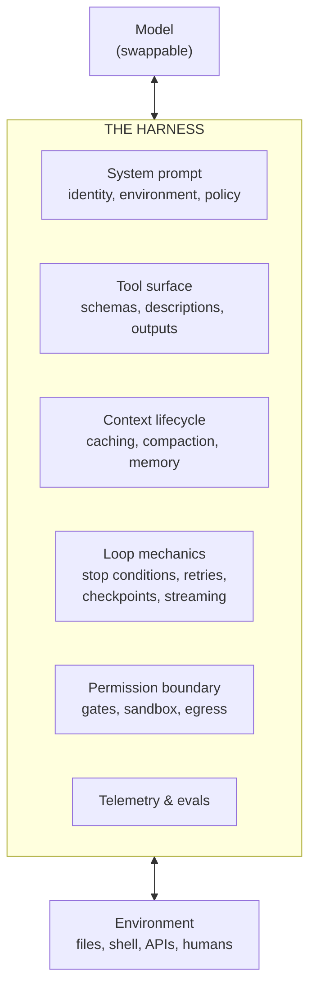
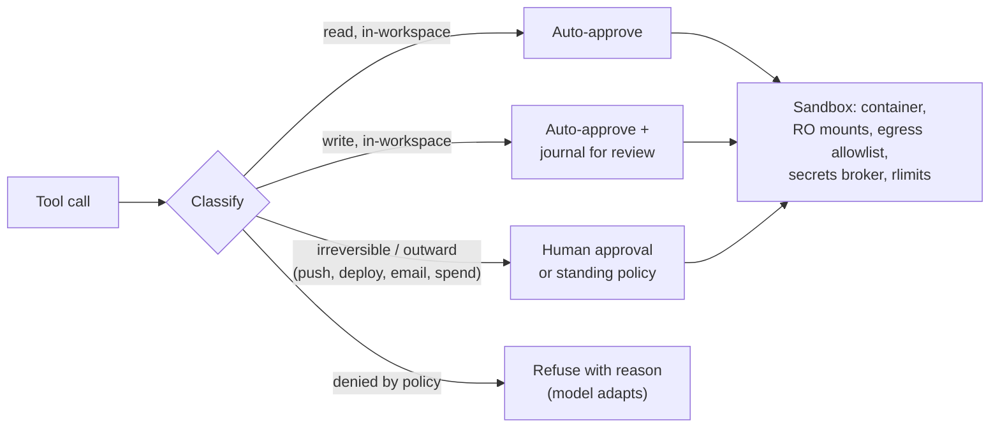

# Harness Engineering

## TL;DR

The harness is everything you build between the model and the world: the loop, the system prompt, the tool surface, the context lifecycle, the permission and sandbox boundary, and the telemetry. The same model in two different harnesses produces wildly different capability — every agent benchmark score is a *model + harness* score. Harness engineering is the discipline of treating that layer as a product: cache-aware context design, token-budgeted tools, ground-truth verification, gated autonomy, and an eval suite that runs on every change. Models improve on the provider's schedule; your harness is the part of agent capability you control.

---

## Why the Harness Is the Product



Three observations drive the discipline:

1. **Capability is co-produced.** A frontier model with a bloated tool catalog, noisy context, and no verification loop performs like a mid-tier model. Conversely, harness improvements routinely move task success more than a model-version bump — and they compound with every future model.
2. **The harness is the durable asset.** Models are swapped every few months; the eval suite, tool surface, and safety boundary persist. Build the harness so a model upgrade is a config change plus an eval run.
3. **The harness is the security boundary.** The model is persuadable by anything it reads; the harness is not. Every guarantee you actually need (no exfiltration, no unapproved spend, no `rm -rf /`) must be enforced in harness code, never in prompt text.

---

## System Prompt Architecture

The system prompt is the harness's configuration file for the model. Structure it in stable-to-volatile order, because prompt caching bills you for every token after the first change:

```
┌──────────────────────────────────────────────┐
│ 1. Identity & objective        (never changes)│
│ 2. Environment description     (per deploy)   │
│ 3. Tool-use guidance & policy  (per deploy)   │
│ 4. Safety rules & escalation   (per deploy)   │
├─────────────── cache breakpoint ──────────────┤
│ 5. Session context (user, workspace state)    │
├─────────────── cache breakpoint ──────────────┤
│ 6. Conversation: task, tool calls, results    │
└──────────────────────────────────────────────┘
```

Principles:

- **Right altitude.** Hardcoded if-else logic in prose is brittle; vague vibes ("be helpful") are useless. Write heuristics with reasons: *"Prefer editing existing files over creating new ones — new files fragment the project structure."* The reason lets the model generalize correctly to cases you didn't anticipate.
- **Per-task data does not belong in the system prompt.** Task specifics go in user messages; reference material goes in files the agent reads; anything that varies per request after a cached prefix destroys your cache hit rate.
- **Policies the model must never violate don't go here at all** — they go in the permission boundary. The prompt says "ask before deploying"; the harness *refuses* to deploy without approval. Defense in depth, with the deterministic layer as the one you trust.
- Keep it shorter than you think. Every instruction competes with every other for attention; instructions the model reliably follows from training ("write idiomatic Python") are wasted tokens.

---

## Tool Surface Design

Tools are the half of the interface you fully control. The craft (full article: [Coding Agent Tool Design](../18-compound-engineering/02-coding-agent-tool-design.md)):

- **Minimal orthogonal set.** Every tool's schema and description occupies context on *every* turn and competes for selection. Ten well-separated tools outperform forty overlapping ones. When two tools overlap, the model splits its behavior between them nondeterministically.
- **Descriptions are load-bearing.** A tool description is a micro-prompt: what it does, when to prefer it over neighbors, what it returns, known failure modes. Test descriptions like prompts — A/B them in evals.
- **Budget every output.** Decide each tool's maximum context footprint (e.g., 25K tokens for file reads, 50KB for command output) and enforce truncation with explicit markers (`[truncated 4,312 lines — use offset/limit to read more]`). Pagination, filtering, and response-format parameters (`concise` vs `detailed`) beat dumping.
- **Errors must teach.** The error string is the model's only debugging signal: say what failed, why, and what to try instead. Silent failure or a bare exception costs extra turns; a misleading error poisons the run.
- **Bash is the universal escape hatch; code execution is the power tool.** A script that loops over 500 API objects costs one tool call and a few hundred tokens of output; the same work as individual tool calls floods the context. Expose heavy integrations as code-callable APIs (the MCP code-execution pattern) and keep typed, structured tools for actions where validation and gating matter — payments, deploys, anything irreversible.
- **Scale the catalog with deferred loading.** Beyond a few dozen tools, don't preload every schema: expose a `search_tools` capability that returns full definitions on demand. Hundreds of MCP-sourced tool descriptions in a static prompt is a context tax and an attack surface.

---

## Context Lifecycle Engineering

Context is the binding constraint and the dominant cost driver. The harness owns four mechanisms:

### 1. Cache discipline

Inference providers price cached input tokens at ~10% of fresh ones, and agents resend their entire history every turn — so cache hit rate is the single largest cost lever in agentic systems. Rules that follow:

- **Append-only conversation.** Never rewrite or reorder earlier messages mid-session; any mutation invalidates the cache for everything after it.
- **Stable prefix.** System prompt and tool schemas change only at deploy time. Timestamps, request IDs, and "current date" go at the *end* of context or in tool results, never the beginning.
- Place cache breakpoints at the prompt/session/conversation boundaries; monitor cache-hit rate as a first-class production metric — a regression usually means someone "improved" the prompt builder.

### 2. Budget accounting and compaction

Track tokens per turn. At a threshold (~70–80% of the window, or earlier if cost demands), compact: a model call summarizes the transcript into decisions made, constraints discovered, file paths touched, current plan state, and open items — then the loop restarts with system prompt + summary + the most recent turns. Tool *outputs* are the first thing to drop (they're re-derivable: the agent can re-read a file; it cannot re-derive *why* it chose approach B). Test compaction explicitly in evals: a bad summarizer turns a 4-hour task into amnesia at hour two.

### 3. Filesystem as memory

Give the agent durable scratch space and teach it (via system prompt) to use it: `plan.md` for the task plan, `notes.md` for learnings, artifacts written to disk instead of held in context. File-based state survives compaction, crashes, and handoffs to other agents — and humans can inspect it. Cross-session memory (project conventions, user preferences) belongs in curated instruction files loaded at session start, not in an embedding store the model can't audit. See [Agent Context Engineering](../18-compound-engineering/03-agent-context-engineering.md).

### 4. Subagent fan-out

A subagent is a context firewall: it spends its own window on exploration and returns a distilled result. The harness provides the spawn primitive, caps concurrency and per-subagent budgets, and defines the result contract (e.g., "≤2K tokens, conclusions plus file references — not transcripts"). Use it for read-heavy work (search, audit, summarize); avoid it for tightly-coupled writes, where partial views produce incoherent output.

---

## The Loop: Mechanics That Separate Demos from Products

```python
async def run(session: Session) -> Outcome:
    while True:
        budget.check(session)                      # turns, tokens, wall-clock, spend

        response = await model.call(
            system=PROMPT, tools=session.tools,
            messages=session.messages, stream=True,  # stream for UX + early interrupt
        )
        await session.checkpoint(response)          # durable: resume from any turn

        if response.stop_reason == "end_turn":
            return await verify_and_close(session)  # never trust "done" unverified

        calls = response.tool_calls
        decisions = await asyncio.gather(*[gate(c, session.policy) for c in calls])
        results = await asyncio.gather(*[
            execute_in_sandbox(c) if d.approved else denial_result(c, d.reason)
            for c, d in zip(calls, decisions)
        ])                                           # parallel calls run in parallel
        session.append(response, normalize(results))  # uniform shape, budget-truncated

        if loop_detector.repeating(session):         # same call-signature N times
            session.inject_steering("This approach is repeating. Re-read the plan "
                                    "and choose a different strategy, or escalate.")
```

The details that matter:

- **Stop conditions are a contract.** `end_turn` means the model *claims* completion — run the verifier before reporting success. Distinguish max-tokens truncation (continue), refusal (surface to human), and tool-use (loop).
- **Checkpoint every turn.** Serialized messages + workspace snapshot = resumable runs, replayable bugs, and the substrate for durable-execution engines. "The pod restarted" should cost one turn, not the task.
- **Interruptibility is a feature, not an edge case.** Humans steer mid-run; injected user messages must land between turns without corrupting tool-call/result pairing.
- **Normalize tool results.** One envelope (status, content, truncation marker, timing) regardless of source — models handle uniform structure measurably better than ad-hoc strings.
- **Detect loops in the harness.** Hash recent tool-call signatures; on repetition, inject steering or escalate. Models repeat failing actions with cosmetic variations; the harness sees the pattern before the model admits it.

### Verification layer

Wire ground truth into the loop, because agents are only reliable on tasks where checking is cheaper than doing: run tests/typecheck/lint after edits and feed failures back as tool results; screenshot UIs; diff review before commit. Prefer exit codes over self-assessment — a model grading its own work without an oracle inflates success. Where no programmatic verifier exists, rubric-based LLM-as-judge is a *triage* signal routing work to humans, not an acceptance gate.

---

## Permission Boundary and Sandbox

Design for a persuadable model operating on untrusted input:



- **Action classification over tool allowlists.** `bash` is neither safe nor unsafe — `cat` and `git push --force` differ. Classify the *effect* (read / reversible write / irreversible / outward-facing) and gate by class.
- **Sandbox as default substrate.** Ephemeral container or microVM per session: workspace mounted read-write, host invisible, network egress through an allowlist proxy, CPU/memory/disk limits. Secrets live in a broker that injects them into tool *execution*, never into model-visible context.
- **Prompt injection is unsolved; architect around it.** Anything the agent reads — web pages, issues, READMEs, tool output — may carry instructions. Tag tool results as data-not-directives, and structurally avoid the lethal trifecta: untrusted input + private data + an outward channel in one agent. If the product requires all three, the outward channel gets a human gate, always.
- **Approval fatigue is a security bug.** If users see ten prompts per task, they will click "always allow" on the eleventh. Auto-approve the provably safe, batch the reviewable, and reserve interruptions for the handful of actions that are genuinely irreversible.

---

## Eval-Driven Harness Development

The harness changes weekly; vibes don't scale. The development loop is: **build the eval before the feature, ship nothing that regresses it.**

- **Task suite.** 50–200 real tasks from your domain with programmatic graders (tests pass, artifact matches spec, API state correct). Include adversarial cases: injection attempts in tool outputs, tasks that *should* be refused or escalated, tasks requiring compaction to finish.
- **Metrics that reflect the product.** Task success (pass^k for reliability claims, not just pass@1), cost per solved task, turns and wall-clock, tool-error rate, cache hit rate, unsafe-action attempts caught, human interventions per task.
- **Ablate harness changes like model changes.** New tool description, new compaction prompt, new gate policy — each gets an A/B over the suite. Harness regressions are silent: nothing crashes; success just drifts from 78% to 71%.
- **Calibrate with public benchmarks** (SWE-bench Verified, Terminal-Bench, τ-bench, OSWorld) but don't optimize for them — they tell you whether your harness is leaving model capability on the table, not whether your product works.
- **Trace everything.** One trace per session, one span per turn/tool-call, following the OpenTelemetry GenAI semantic conventions: model, tokens in/out/cached, tool, latency, gate decisions. Production traces are tomorrow's eval cases — build the "promote this failed session to the suite" button early.

---

## Cost and Latency Engineering

| Lever | Mechanism | Typical impact |
|---|---|---|
| Prompt cache hit rate | Stable prefix, append-only history | Largest single cost lever in agents |
| Model tiering inside the harness | Small model for compaction, routing, summaries; frontier for the main loop | 2–5× cost reduction on the periphery |
| Tool-output budgets | Truncation, pagination, code-exec batching | Smaller contexts → cheaper *and* more accurate |
| Thinking budget policy | High for irreversible decisions, low for tight tool loops | Latency control without quality loss where feedback is cheap |
| Parallel tool execution | `gather` independent calls | Wall-clock, not tokens |
| Subagent fan-out | Parallel exploration, compressed returns | Latency down, tokens up — measure both |

Token spend is the unit economics of the product: instrument cost per *solved* task, not per request. An agent that's 30% cheaper per turn but takes 60% more turns is a regression.

---

## Failure Taxonomy

| Failure | Symptom | Harness countermeasure |
|---|---|---|
| Context rot | Quality degrades late in long sessions | Earlier compaction; tool-output budgets; file-based plan |
| Goal drift | Output solves an adjacent task | Plan artifact + re-read after compaction; verify against original spec |
| Loop divergence | Same failing call, cosmetic variations | Signature detection → steering injection → escalation |
| Tool-selection confusion | Wrong tool among overlapping ones | Consolidate tools; sharpen descriptions; eval per-tool precision |
| Context flooding | One tool call fills the window | Hard output caps with informative truncation |
| Cache collapse | Cost spikes, latency up | Prefix-stability test in CI; cache-hit-rate alerting |
| Injection compliance | Agent follows instructions from data | Provenance tagging; trifecta decomposition; outward-action gates |
| Unverified success | "Done!" but tests fail | Verifier between `end_turn` and user-visible success |
| Lost runs | Crash/timeout loses hours of work | Per-turn checkpointing; durable execution; resumability tests |

---

## Key Takeaways

1. Benchmark scores belong to model+harness pairs; the harness is the half you own, and it compounds across model generations.
2. Order context stable-to-volatile and never mutate history — cache hit rate is the agent cost metric.
3. Tools: few, orthogonal, token-budgeted, with errors that teach and code execution as the escape hatch.
4. The model claims; the harness verifies. Ground truth in the loop or a human at the gate.
5. Security lives in the permission boundary and sandbox — prompt text is advice, harness code is policy.
6. Build the eval suite before the harness feature; harness regressions are silent.

---

## References

- [Building Effective Agents](https://www.anthropic.com/research/building-effective-agents) — Anthropic
- [Effective Context Engineering for AI Agents](https://www.anthropic.com/engineering/effective-context-engineering-for-ai-agents) — Anthropic
- [Writing Effective Tools for Agents](https://www.anthropic.com/engineering/writing-tools-for-agents) — Anthropic
- [Code Execution with MCP](https://www.anthropic.com/engineering/code-execution-with-mcp) — scripts over chained tool calls
- [Claude Code Best Practices](https://www.anthropic.com/engineering/claude-code-best-practices) — a production harness, documented
- [Model Context Protocol](https://modelcontextprotocol.io/) — tool/context integration standard
- [The Lethal Trifecta for AI Agents](https://simonwillison.net/2025/Jun/16/the-lethal-trifecta/) — Simon Willison
- [Context Rot](https://research.trychroma.com/context-rot) — Chroma research on long-context degradation
- [SWE-bench Verified](https://www.swebench.com/), [Terminal-Bench](https://www.tbench.ai/), [τ-bench](https://arxiv.org/abs/2406.12045), [OSWorld](https://os-world.github.io/) — harness-sensitive benchmarks
- [OpenTelemetry GenAI Semantic Conventions](https://opentelemetry.io/docs/specs/semconv/gen-ai/) — tracing standard for LLM systems
- [Temporal](https://temporal.io/) — durable execution
