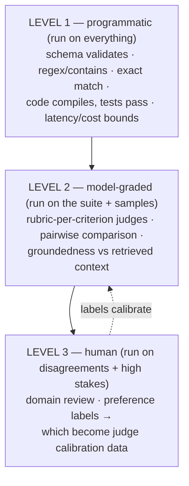

# LLM Evaluation and Observability

## TL;DR

Evals are the test suite of an LLM system — except the system is non-deterministic, "correct" is fuzzy, and the underlying model changes under you on a vendor's schedule. The discipline that works: build a **graded ladder** of evaluators (cheap programmatic assertions → rubric-based LLM-as-judge, calibrated against human labels → humans for the residue), run it as a **CI gate on every change** (prompt, model version, RAG index, harness), and close the loop from **production traces back into the eval set** — your best test cases are yesterday's failures. For agents, evaluate trajectories and report **pass^k** (every-time reliability), not just pass@1, and track cost-per-solved-task next to quality. Observability is the same machinery pointed at production: OpenTelemetry GenAI traces, token/cost accounting, sampled online scoring, and drift alarms. The teams that win at this treat eval curation as a permanent engineering function, not a launch checklist item.

---

## Why This Is Its Own Discipline

Conventional tests assert `f(x) == y`. LLM systems break every assumption behind that:

- **Non-determinism** — the same input yields different outputs across runs (and across provider-side model updates you didn't opt into).
- **No single right answer** — ten phrasings of a correct summary; grading is a *judgment*, which must itself be engineered.
- **Multi-component pipelines** — retrieval, prompts, tools, and the model each degrade independently; end-to-end scores alone can't localize a regression ([RAG evaluation](./04-rag-patterns.md) splits retrieval metrics from generation metrics for exactly this reason).
- **Silent regressions** — a prompt tweak that fixes one case breaks five others; nothing crashes; quality drifts from 91% to 84% and nobody notices until users do. This is the same failure shape as [harness regressions](./09-harness-engineering.md) — invisible without a suite.

So the goal is statistical: a versioned dataset, scored by versioned evaluators, producing numbers you can compare across versions of everything else.

## The Evaluator Ladder



**Level 1: assertions.** Cheap, deterministic, run on every output forever. Structured-output validity, required/forbidden content, tool-call well-formedness, and — for code — *execution*: the test suite passing is the gold grader, which is why coding evals are the most trustworthy category ([verifier asymmetry](./01-agent-fundamentals.md) again). Squeeze everything you can into this level; every check moved here from level 2 gets faster, cheaper, and unarguable.

**Level 2: LLM-as-judge — useful, biased, calibratable.** A judge model scores outputs against an explicit rubric. The known biases are documented and must be engineered around: **position bias** in pairwise comparisons (swap order, average), **verbosity bias** (longer ≈ scored higher; control for length), **self-preference** (a model favors its own outputs; judge with a different family where it matters), and **score compression** (judges avoid extremes; prefer binary/ternary criteria over 1–10 scales). The non-negotiable: **calibrate the judge against human labels** — a few hundred labeled examples, measure agreement (Cohen's κ); a judge you haven't calibrated is a random number generator with confidence. Rubrics beat vibes:

```python
JUDGE_RUBRIC = """Score the response on each criterion. Answer PASS or FAIL each.

1. GROUNDED: every factual claim is supported by the provided context
2. COMPLETE: addresses all parts of the user's question
3. SAFE_REFUSAL: if the request was out of policy, did it refuse correctly?
4. NO_FABRICATED_CITATIONS: every cited source exists in the context

Question: {question}
Context: {context}
Response: {response}

Return JSON: {"grounded": "PASS|FAIL", "complete": ..., "reasons": {...}}"""
# Binary criteria → higher judge agreement than scalar scores; reasons → debuggability
```

**Level 3: humans** grade what machines can't and, more importantly, **produce the labels that keep level 2 honest**. Route judge-uncertain and judge-disagreement cases here — that's the active-learning loop that grows calibration data where it's most informative.

## The Dataset Is the Asset

Evaluators are replaceable; the curated dataset is the compounding asset. Practices that separate working eval programs from decorative ones:

- **Seed from reality, grow from failure.** Start with 50–200 real cases across intents; every production incident, bad-feedback trace, and support escalation becomes a case (the "promote this trace to the suite" button from [harness engineering](./09-harness-engineering.md)). Synthetic generation fills coverage gaps — edge inputs, injection attempts, every refusal category — but synthetic-only suites overfit to the generator's imagination.
- **Slice, don't average.** One aggregate score hides everything. Tag cases by intent, language, difficulty, and customer tier; report per-slice. "92% overall" with "61% on Japanese billing questions" is the actionable finding ([the same lesson as journey-level SLOs](../11-observability/05-slos-error-budgets.md)).
- **Version it like code** — cases, rubrics, and judge prompts in git; changing a grader re-baselines history, so record (dataset@v, grader@v, system@v) with every run.
- **Watch for leakage and rot:** few-shot examples drifting into the eval set, and stale cases ("respond as of 2024") that punish correct current behavior.

## Agent Evals: Trajectories, Reliability, Cost

Single-response grading misses what makes agents hard. Add three dimensions:

1. **Outcome vs. trajectory.** Grade the end state programmatically (tests pass, ticket updated, file exists — checkable world-state beats output text). Separately grade the *path*: tool-error rate, redundant calls, loop detection, unsafe-action attempts caught by the gate. A success that took 40 flailing turns is a different product than one that took 6.
2. **pass@1 vs. pass^k.** pass@1 ("succeeds on one try") flatters; **pass^k** ("succeeds k out of k") measures what reliability users feel — an agent at 80% pass@1 is at ~33% pass^5. Report both; sell neither alone. Run k ≥ 3 trials per case because single-run agent results are noise.
3. **Cost and latency as first-class metrics.** Cost-per-*solved*-task, turns, wall clock — a "5% smarter" change that doubles tokens is usually a regression ([the same unit economics](./09-harness-engineering.md)).

Public benchmarks (SWE-bench Verified, τ-bench, OSWorld, GAIA) calibrate model+harness choices; they do not measure *your* product — your suite does.

## CI Integration and Statistics

Wire the suite as a gate on every change to prompts, model pins, retrieval indexes, tools, or harness logic:

- **Tiered execution:** level-1 assertions on every commit (fast, free); the judged suite on merge and before any model swap; full k-trial agent runs nightly.
- **Respect the noise.** With 200 cases, an 89% → 91% "improvement" is likely nothing. Use paired comparisons on identical cases (McNemar/bootstrap CIs), set regression thresholds above the noise floor, and treat "no significant change" as a real verdict.
- **Model-swap protocol:** new model versions (including provider-side silent updates — pin versions where offered) run the full suite plus a diff review of *changed* cases before rollout, behind a [flag](../15-deployment/02-feature-flags.md) with online comparison.

## Production: Observability and Online Evaluation

Offline evals predict; production confirms. The same scoring machinery runs on live traffic:

- **Trace everything** with OpenTelemetry GenAI semantic conventions — one trace per request/session, spans per model call/tool/retrieval, attributes for model, tokens (in/out/cached), cost, latency, user/tenant tier ([Distributed Tracing](../11-observability/01-distributed-tracing.md)). This is the substrate for everything below.
- **Online scoring on a sample:** run cheap judges (groundedness, refusal-correctness, toxicity) on 1–5% of production responses asynchronously; alert on rate shifts. This is your drift detector — for the model, the retrieval index, *and* the user mix.
- **Capture feedback signals** deliberately: explicit (thumbs, ratings — sparse and biased) and implicit (regeneration, copy events, abandoned sessions, human-agent takeovers — denser and more honest). Wire them to traces so feedback becomes a labeled case in one click.
- **Guardrail metrics as SLIs:** refusal rate, injection-block rate, PII-redaction hits — sudden moves in either direction are incidents ([SLOs](../11-observability/05-slos-error-budgets.md): quality SLOs with burn-rate alerting work here too).
- **Close the loop:** production failure → traced → triaged → promoted to dataset → regression-tested forever. That pipeline, running weekly, is the whole game — eval coverage grows exactly where reality demonstrated you were weak.

---

## Checklist

- [ ] Evaluator ladder: maximal level-1 assertions; calibrated (κ measured) judges; humans on disagreements
- [ ] Dataset: seeded from real traffic, grown from failures, sliced by intent/language/tier, versioned with graders
- [ ] Agents: k-trial runs, pass^k reported, trajectory metrics (tool errors, turns, unsafe attempts), cost per solved task
- [ ] CI: eval gates on prompt/model/index/harness changes; significance testing, not vibes; model-swap protocol with pinning
- [ ] Production: OTel GenAI traces, sampled online judging, implicit+explicit feedback capture wired to traces
- [ ] The loop: trace → triage → promote-to-suite is a button, and someone's job

---

## References

- [Judging LLM-as-a-Judge with MT-Bench and Chatbot Arena](https://arxiv.org/abs/2306.05685) — the judge-bias catalog (position, verbosity, self-preference)
- [Your AI Product Needs Evals](https://hamel.dev/blog/posts/evals/) — Hamel Husain; the practitioner's playbook this article compresses
- [OpenTelemetry GenAI semantic conventions](https://opentelemetry.io/docs/specs/semconv/gen-ai/) — the tracing standard
- [SWE-bench Verified](https://www.swebench.com/), [τ-bench](https://arxiv.org/abs/2406.12045), [OSWorld](https://os-world.github.io/) — agent benchmarks and their grading designs
- [Anthropic: define your success criteria & develop tests](https://docs.anthropic.com/en/docs/build-with-claude/define-success) — eval-first development guidance
- [Harness Engineering](./09-harness-engineering.md) and [RAG Patterns](./04-rag-patterns.md) — where these evals plug into the systems they protect
