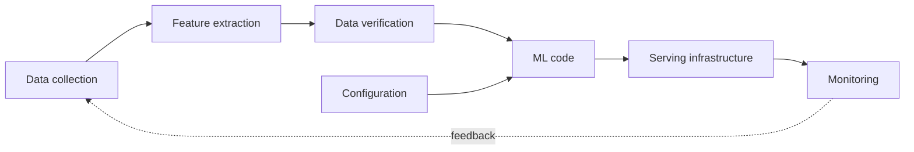
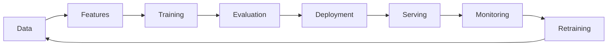
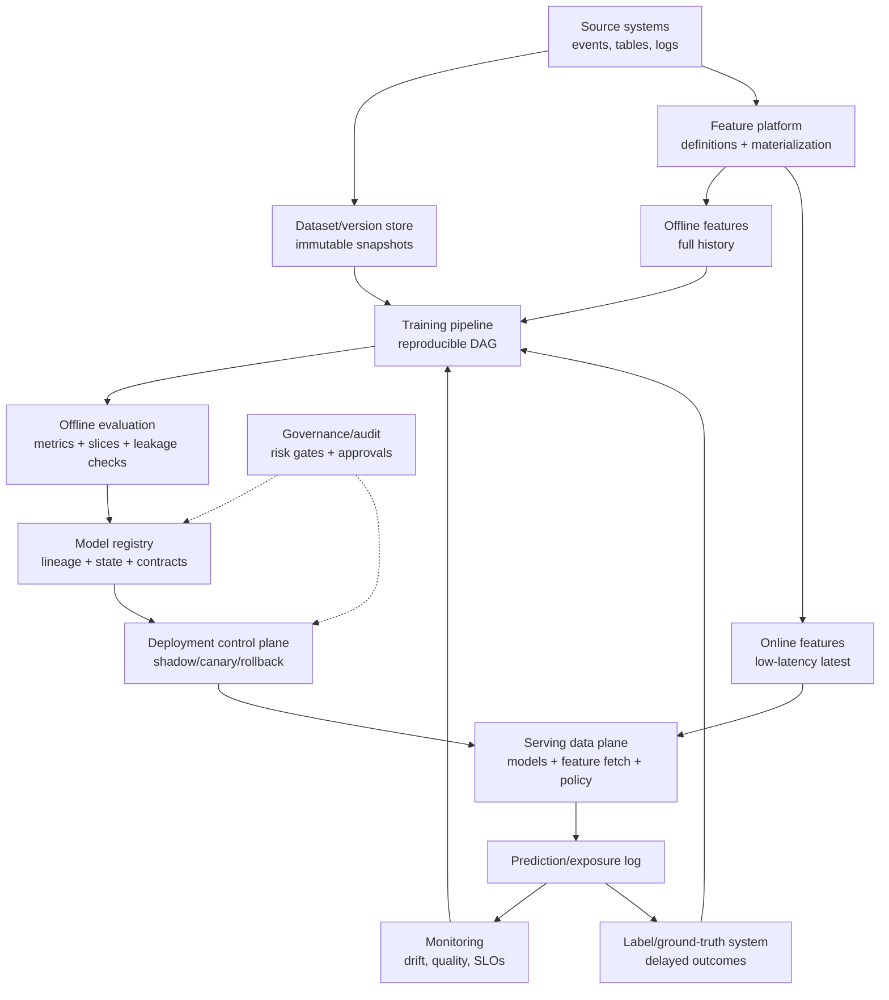

# ML System Fundamentals

## TL;DR

A machine learning system is unlike traditional software in one decisive way: its behavior is defined by *data*, not just code. The model itself is a small box; almost all the operational risk lives in the system around it — data collection, feature extraction, configuration, serving infrastructure, monitoring, and the feedback loops that quietly reshape future training data. This is the central thesis of Sculley et al.'s *Hidden Technical Debt in Machine Learning Systems* (2015), and it reframes the whole discipline: you are not building a model, you are building a system whose correctness is statistical, whose specification is implicit in a dataset, and whose dependencies change underneath you without warning. Everything in this section — feature stores, dataset versioning, offline evaluation, serving, monitoring, training pipelines, label systems, registries, capacity planning, experimentation, and governance — exists to manage that fundamental difference.

---

## An ML System Is Defined by Data, Not Just Code

In traditional software, behavior is fully determined by code. A function that returns `a + b` will return the sum forever; you can read it, test it exhaustively against a specification, and reason about it in isolation. The code *is* the behavior, and the behavior is deterministic, inspectable, and stable until someone edits the source.

An ML system breaks every part of that contract. The behavior of a fraud classifier is not written in its code — the code is a generic training procedure that could just as easily produce a recommender or an image classifier. The behavior is *learned* from data, which means the dataset is the real specification, and that specification is implicit, enormous, and constantly shifting. Two teams can run identical code on different data and ship systems that behave nothing alike. The same team can run identical code on *the same source* a month later and ship a meaningfully different system, because the world the data describes has moved.

This is why Sculley's diagram is the foundational mental model for the entire field: the box labeled "ML code" is tiny, surrounded by far larger boxes for data collection, feature extraction, data verification, configuration, process management, analysis tooling, serving infrastructure, and monitoring. The engineering implication is blunt — if you budget your attention proportional to the code, you will spend ninety percent of your effort on the box that holds five percent of the risk.



The model is the smallest box in the picture. Treating it as the whole system is the original sin of production ML.

---

## Why ML Systems Are Harder to Operate

Four properties make ML systems structurally harder to operate than the services around them, and each one defeats a tool that traditional engineering relies on.

**Correctness is statistical, not deterministic.** A traditional service is either correct or it has a bug. An ML system is *correct on average* and wrong on some fraction of inputs by design — a 95%-accurate model is wrong one time in twenty, and that is the intended behavior, not a defect. This dissolves the binary notion of "working." You cannot ask "is the model right?"; you can only ask "is its error rate, on this slice, within tolerance right now?" — and the answer changes as the input distribution changes.

**There is no clean specification.** The spec for a sorting function is a sentence. The spec for "detect fraudulent transactions" is a moving, contested, partly-unknowable target encoded in millions of historical examples that were themselves labeled by imperfect processes. Because the spec lives in the data, you cannot review it, version it as prose, or reason about it the way you reason about an interface. When the data is wrong, the spec is wrong, and nothing in the code will tell you.

**Tests cannot fully capture behavior.** Unit tests pin down deterministic logic, but no finite test suite captures a model's behavior across an unbounded, drifting input space. You can test that the serving code loads an artifact and returns a number in range; you cannot unit-test that the model is *good*, because goodness is a statistical property of live data you have not seen yet. Validation in ML is therefore continuous and distributional — comparing live behavior to a baseline — rather than a gate you pass once at build time. (See [Model Monitoring](./04-model-monitoring.md).)

**Failure is silent.** When a traditional service breaks, it throws errors, latency spikes, dashboards turn red. When an ML system degrades, the service stays up, latency is fine, error rate is zero, and the predictions quietly get worse because the world changed. Silent degradation is the signature failure of ML systems, and it is invisible to every reliability tool built for deterministic software. The whole apparatus of model monitoring exists because uptime monitoring cannot see this class of failure at all.

The engineering takeaway is that the operational playbook from traditional services — tests, type checks, error budgets on uptime and latency — remains necessary but is no longer sufficient. It covers the box labeled "code" and is blind to the data that actually drives behavior.

---

## The Training/Serving Divide

Every ML system has two halves that must agree but rarely share an implementation. The *offline* half trains models over large historical datasets, optimizing for quality with hours of latency budget and no real-time constraints. The *online* half serves predictions under live traffic, optimizing for latency and reliability with milliseconds to spare. These halves are usually written by different people, in different languages, against different data stores, on different schedules.

The defining hazard of this divide is **training-serving skew**: the two paths compute the *same feature name* to mean *different things*. A feature like `avg_purchase_7d` is computed in offline batch from a warehouse table during training, and recomputed online from a streaming store during serving. If the windowing logic, the timezone handling, the null-filling, or the data freshness differs even slightly between the two implementations, the model is served inputs that do not match what it learned from. Offline evaluation looks excellent — it was computed with the training-side logic — and production quality silently drops, because the model is now answering a subtly different question than the one it was trained to answer.

The failure is easiest to believe when you see how innocent the two implementations look side by side:

```sql
-- Training side (warehouse SQL): event-time window, includes late-arriving events
SELECT user_id,
       AVG(amount) AS avg_purchase_7d
FROM purchases
WHERE event_time >= label_time - INTERVAL '7 days'
  AND event_time <  label_time
GROUP BY user_id;
```

```python
# Serving side (application code): arrival-time window via Redis sorted set + TTL
def avg_purchase_7d(user_id):
    now = time.time()
    redis.zremrangebyscore(f"purch:{user_id}", 0, now - 7*86400)
    amounts = redis.zrange(f"purch:{user_id}", 0, -1, withscores=False)
    return sum(map(float, amounts)) / max(len(amounts), 1)   # ← and this line
```

Both are reasonable code. They disagree in at least four ways: event time versus arrival time (a purchase synced from an offline device lands in one window but not the other), the SQL `AVG` over zero rows returns `NULL` while the Python returns `0.0`, the SQL window is anchored to the label's timestamp while Redis is anchored to *now*, and a Redis eviction silently shrinks the online window. Each discrepancy is a fraction of a percent of traffic; together they mean the model is systematically served a slightly different feature than the one it learned — and the gap concentrates in exactly the unusual users the model most needs to get right.

Skew is insidious because it produces no error and no alert. The feature has the right name, the right type, and a plausible value; it is simply the *wrong* value. The structural defenses are architectural rather than ad hoc: define each feature once and compute it from a single shared definition for both paths (the core promise of a [feature store](./02-feature-stores.md)), log the exact feature values served in production so they can be replayed and compared against an offline recomputation, and treat any divergence between served and recomputed values as a sev-worthy incident rather than a rounding curiosity. The training/serving boundary is the most important reliability boundary in an ML system, and most production quality mysteries trace back to it.

---

## The Data Dependency Problem

A model depends on upstream data it does not own and cannot control, and this is a category of dependency that traditional code-level dependency management never had to handle. A library dependency has a version number, a changelog, and a maintainer who follows semantic versioning; breaking changes announce themselves. A *data* dependency has none of this. An upstream team can change the meaning of a column, the unit of a field, the cardinality of an enum, or the population that a table covers — all without changing a single type signature, all without anyone telling you.

Sculley calls these *unstable data dependencies*, and they are more dangerous than unstable code dependencies precisely because they are invisible to the compiler. Consider a concrete, well-understood pattern: a finance team refactors a revenue table so that `total_spend` switches from gross to net. Every type check passes. Every null check passes. The job runs green. But every model trained after the change learns from systematically smaller numbers, and the model's behavior shifts in a direction no one chose. A silent *semantic* change upstream becomes a silent model *regression* downstream, and the gap between the two can be weeks, with no error connecting cause to effect.

A second, subtler hazard is the *underutilized* data dependency — a feature the model consumes but barely needs. It adds no real predictive value, yet it couples the model to an upstream source that can break, drift, or disappear. Every input is a liability as well as an asset, and a feature carrying its weight in risk but not in signal is pure downside.

The engineering implications follow directly. Data dependencies must be made explicit and versioned the way code dependencies are: a model should record exactly which feature versions it consumed, and a semantic change to a feature should be a *new feature name*, never an in-place edit (see [Training Pipelines](./05-training-pipelines.md) and [Feature Stores](./02-feature-stores.md)). Inputs must be validated against a baseline distribution before they reach training or serving, because distributional checks are the only mechanism that catches a type-compatible, semantically-broken change. And the relationship across the boundary must be a *contract* with an owner, so that a violation fails loudly at the seam instead of being silently absorbed into a worse model.

---

## Feedback Loops: The System Influences Its Own Future Data

Traditional software reads the world; ML systems frequently *change* the world they will later learn from, and this closes a loop that has no analog in deterministic software. A recommender changes what users see, which changes what they click, which becomes the training data for the next recommender. A fraud model blocks transactions it believes are fraudulent, which means the labels for "what those transactions would have done" never exist, biasing the next model's view of fraud. A search ranker concentrates traffic on items it already ranks highly, manufacturing the very engagement signal it then treats as evidence those items are good.

These feedback loops are the source of some of the most confusing pathologies in production ML. A *direct* loop is when a model's own outputs become its future inputs — the system slowly converges on a self-confirming worldview, mistaking the consequences of its past decisions for ground truth about the world. An *indirect* or *hidden* loop is worse: two models influence each other through the shared environment, so that improving one degrades the other through a channel that appears nowhere in either system's design. Sculley flags hidden feedback loops as one of the hardest forms of technical debt precisely because no component owns them and no test reveals them.

The engineering implication is that the data an ML system collects about itself is not a neutral observation of the world — it is contaminated by the system's own past behavior, and naively training on it amplifies whatever bias the previous model had. The defenses are structural: preserve a slice of *exploration* traffic that is not controlled by the current model, so the system keeps seeing outcomes it would not have chosen; log the candidates that were *not* shown, not only the ones that were, so counterfactual analysis is possible at all; and separate observational metrics, which the model can game through the loop, from causal experiments on held-out traffic that the current model does not control (see [Online Experiments](./08-online-experiments.md)). Without an exploration path, an ML system gradually becomes a machine for confirming its own past opinions.

---

## The ML Lifecycle Is a System of Handoffs

It is tempting to draw the ML lifecycle as a linear pipeline — data, features, training, evaluation, deployment, serving, monitoring, retraining — and treat it as a sequence of steps. The more useful framing is that each *arrow* between those stages is a reliability boundary with an ownership contract, and the system fails at the arrows far more often than at the boxes.



Each handoff is owned by a different team and guarantees a different contract. The data platform owes fresh, deduplicated, schema-versioned data to the feature layer. The feature owner owes point-in-time-correct values to training. Training owes a reproducible artifact and honest metrics to evaluation. Evaluation owes a promotion decision against guardrails to deployment. Serving owes runtime compatibility and the feature parity that prevents skew. Monitoring owes early detection of degradation back to the retraining trigger. When any one of these contracts is informal — a handshake instead of a validated interface — the lifecycle decays at exactly that seam, and because the seam spans an org boundary, it becomes nobody's responsibility until an incident forces an owner to claim it.

The lifecycle is also a *loop*, not a line: the last arrow feeds back into the first. Monitoring drives retraining, retraining produces new data dependencies, and the system circles continuously rather than terminating at "deployed." This is why an ML system is never "done" the way a feature ship is done — it has to be operated indefinitely, and the cost of that operation, not the cost of the initial model, dominates the system's total cost of ownership.

---

## Reference Architecture: The ML Platform as a Control System

A mature ML platform is best understood as a control system wrapped around a decision function. The model scores requests, but the platform controls *which* model scores them, *which* features it may read, *which* labels later judge it, *which* metrics can promote it, *which* rollout path exposes it, and *which* rollback path stops it.



The diagram is deliberately not model-centric. The model is one artifact in a larger loop. Distinguished engineering work lives in the edges: whether the dataset snapshot is immutable, whether the online feature is the same semantic feature as the offline one, whether the label joins to the exact prediction, whether the registry can name the rollback target, whether monitoring can distinguish a data incident from a concept-drift incident, and whether the deployment system can stop harm before labels mature.

---

## Control Plane vs Data Plane

ML systems fail when control-plane decisions leak into ad hoc scripts or data-plane code. The split should be explicit.

| Plane | Owns | Correctness requirement | Failure if weak |
|---|---|---|---|
| Data plane | feature reads, model inference, prediction logging, online policy execution | low latency, bounded queues, graceful degradation | user-facing latency/outage or silent wrong decisions |
| Training data plane | batch extraction, feature computation, training jobs, evaluation jobs | reproducible execution, idempotent outputs, efficient I/O | expensive failed jobs, unreproducible artifacts |
| Control plane | model registry, deployment pointers, traffic splits, promotion gates, approvals | strong metadata consistency, auditability, atomic state transitions | wrong model active, unapproved rollout, impossible rollback |
| Observability plane | drift jobs, label joins, slice metrics, alert routing | versioned baselines, delayed-label semantics, actionability | dashboards that are green while quality burns |
| Governance plane | risk tiers, policy-as-code, audit logs, access control | enforceability, separation of duties, retention | governance theater; controls exist but block nothing |

The control plane should decide *what is allowed*; the data plane should execute it quickly. If business logic says `if model_version == v42 then use threshold 0.91` inside an application service, the control plane has leaked into the data plane. That makes rollout, audit, and rollback harder because the decision is now hidden in code rather than represented as registry state.

The strongest platforms make critical state transitions atomic and auditable:

```text
register artifact → attach lineage → attach evaluation → approve → shadow → canary → production
                                      ↑ every arrow is a gate, not a convention
```

A model should not become production by uploading a file. It becomes production when the control plane validates lineage, serving contract, metrics, approvals, rollback target, and traffic policy, then atomically moves the active pointer.

---

## Load-Bearing Invariants

The easiest way to review an ML architecture is to ask which invariants it enforces mechanically. These are the invariants that matter most:

| Invariant | Why it matters | Enforced by |
|---|---|---|
| Every model has complete provenance | rollback, audit, debugging | training pipeline + registry |
| Every training row is point-in-time correct | prevents future leakage | feature store + dataset builder |
| Every label has a definition, maturity state, and source | prevents target drift and premature negatives | label system |
| Every feature semantic change creates a new version | prevents silent train/serve mismatch | feature registry |
| Every prediction logs model, feature, policy, and experiment versions | enables monitoring, labels, audit, experiments | serving gateway |
| Every promotion has an evaluation report and rollback target | prevents unreviewed irreversible releases | model registry + deployment gate |
| Every high-risk decision is reconstructable | governance and contestability | audit log + lineage graph |
| Every automated loop has a kill switch | prevents bad data from self-deploying | deployment control plane |

If an invariant is documented but not enforced, it is not an invariant; it is an aspiration. A distinguished-engineer review should identify which of these are guaranteed by infrastructure and which depend on humans remembering a process under deadline pressure.

The single most load-bearing row in that table is the prediction log, because four other systems (monitoring, labels, experiments, audit) are built on top of it. It deserves a concrete schema rather than a bullet point:

```sql
CREATE TABLE prediction_log (
    prediction_id     UUID PRIMARY KEY,        -- the join anchor for labels, forever
    request_id        UUID NOT NULL,
    entity_id         TEXT NOT NULL,
    surface           TEXT NOT NULL,           -- which product decision consumed this
    predicted_at      TIMESTAMPTZ NOT NULL,
    model_name        TEXT NOT NULL,
    model_version     TEXT NOT NULL,           -- silent-wrong-model detection depends on this
    feature_versions  JSONB NOT NULL,          -- {"user_stats": "v4", "txn_velocity": "v7"}
    features_hash     TEXT NOT NULL,           -- or full values, if storage allows replay
    score             DOUBLE PRECISION NOT NULL,
    threshold_policy  TEXT NOT NULL,           -- score→action mapping is versioned policy
    action_taken      TEXT NOT NULL,           -- what actually happened, post-guardrails
    experiment_bucket TEXT,
    explored          BOOLEAN DEFAULT FALSE    -- exploration traffic must be identifiable
) PARTITION BY RANGE (predicted_at);
```

Every column earns its place in a later chapter: `model_version` powers [monitoring](./04-model-monitoring.md) and rollback attribution, `prediction_id` is the label join key ([label systems](./10-label-ground-truth-systems.md)), `experiment_bucket` and `explored` power [experiments](./08-online-experiments.md) and counterfactual training data, and `feature_versions` plus `features_hash` make skew audits and decision reconstruction possible. Teams that log only `(entity, score)` discover each missing column during a different incident.

---

## Maturity Model

ML maturity is not measured by model sophistication. It is measured by how safely the organization can change the model under uncertainty.

| Level | Operating mode | What exists | Characteristic risk |
|---|---|---|---|
| 0. Notebook | manual artifact handoff | notebook, exported file | cannot reproduce or rollback |
| 1. Scripted | repeatable training command | source control, basic job runner | data and environment still mutable |
| 2. Reproducible | versioned training pipeline | dataset snapshots, lineage, registry | weak monitoring and rollout safety |
| 3. Operated | production ML service | serving SLOs, drift monitoring, canary, rollback | delayed labels hide quality regressions |
| 4. Governed | risk-tiered decision system | audit logs, approvals, policy gates, human override | controls may lag new use cases |
| 5. Adaptive | safe continuous improvement loop | automated retraining, experiments, fast rollback, mature labels | automation can amplify bad signals if gates weaken |

Most teams should not rush to level 5. Continuous retraining before level 3 monitoring and level 4 rollback is not maturity; it is an incident accelerator. The mature path is to earn automation by proving the safety mechanisms around it.

---

## Distinguished-Engineer Design Review Checklist

For any consequential ML system, a senior review should be able to answer the following without relying on tribal memory:

1. **Decision boundary:** What exact action does the model influence, and what deterministic guardrails bound it?
2. **Data contract:** Which upstream sources, features, labels, and snapshots define the model's behavior?
3. **Point-in-time correctness:** Could any feature or label contain information unavailable at prediction time?
4. **Evaluation honesty:** Does the offline split mirror the production question, and are slices and uncertainty reported?
5. **Serving path:** What is the p99 budget, and is the bottleneck model compute, feature fetch, queueing, or cold start?
6. **Version contract:** Are model, features, preprocessing, runtime, thresholds, and fallback versioned as one release unit?
7. **Monitoring:** What can fail silently, how soon is it detectable, and which signal triggers rollback versus investigation?
8. **Feedback loop:** What data does the model create or suppress by acting, and how is exploration or auditing preserved?
9. **Rollback:** What is the exact rollback target, is it warm/loadable, and what user harms are irreversible?
10. **Governance:** Who owns the model, what risk tier is it, what approvals are enforced, and can a decision be reconstructed?
11. **Cost:** What is cost per prediction/training run, what utilization assumption drives it, and what quota prevents runaway spend?
12. **Retirement:** When does the model become stale, who is paged, and how is it removed safely?

A design that cannot answer these is not ready for production, regardless of its AUC. A design that answers them with queryable platform state — not screenshots, Slack messages, or notebook cells — is approaching production maturity.

---

## CACE: Changing Anything Changes Everything

The single most counterintuitive property of ML systems is entanglement, which Sculley captures in the CACE principle: **Changing Anything Changes Everything.** In modular software, you can reason about a component in isolation behind a stable interface. In an ML model, there is no such isolation. The model mixes all of its input features into a single learned function, so changing the distribution of *one* feature, adding a new feature, removing a stale one, or even re-ordering how features are computed can shift the learned weights on *every other* feature and change the model's behavior in ways no local analysis predicts.

The practical consequence is that there is no such thing as a small, local change to a model. Adding a seemingly harmless input feature is not additive — it re-balances the entire model. Dropping a feature that "wasn't doing much" can degrade an unrelated slice of predictions, because the model had been quietly using that feature to compensate for a weakness elsewhere. This is why ML changes cannot be reasoned about purely by inspection and must be *measured*: the only reliable way to know what a change did is to evaluate the whole model against a baseline, because the blast radius of any change is the entire model.

CACE is also the deep reason why training-serving skew, data dependencies, and feedback loops are so dangerous in combination: entanglement means a small perturbation in any one of them propagates everywhere. A system where everything affects everything cannot be made safe through modularity; it can only be made safe through *measurement and monitoring* of the whole. That is the engineering rationale for treating reproducibility, lineage, and monitoring as first-class concerns rather than nice-to-haves.

---

## Why Reproducibility, Lineage, and Monitoring Are First-Class

Because behavior lives in data, because failure is silent, and because everything is entangled, three properties that are optional conveniences in traditional software become load-bearing reliability features in ML systems.

**Reproducibility** is the ability to rebuild the exact same model from recorded metadata — code commit, data snapshot, feature versions, parameters, and environment digest. It is foundational because every other guarantee depends on it: you cannot roll back to a model you cannot rebuild, cannot audit a decision whose inputs you cannot reconstruct, and cannot debug a regression whose training conditions you cannot recreate. A model without a reproducibility contract is not a release; it is a liability with no maintainer. ([Training Pipelines](./05-training-pipelines.md) treats this as its central property.)

**Lineage** is the queryable record of what produced what — which dataset and code produced which model, and conversely, which models depend on a given dataset. It answers the question that arrives during every data incident: a source table double-counted events for a week, so *which production models trained on that window and must be retrained?* Without forward lineage the only honest answer is "we don't know, retrain everything," which is both expensive and an admission that the system is not auditable.

**Monitoring** in ML is not uptime and latency — those are necessary but blind to the failure that matters. ML monitoring watches the *data and the predictions*: input distribution drift, prediction distribution shift, feature freshness, and, where labels eventually arrive, realized quality against a baseline. It exists because silent degradation produces no error to alert on, so the only way to detect it is to measure the statistical behavior of the system continuously and compare it to what "healthy" looked like (see [Model Monitoring](./04-model-monitoring.md)). The realized-quality layer depends on trustworthy labels, which are themselves a production system with delay, bias, and correction semantics (see [Label and Ground-Truth Systems](./10-label-ground-truth-systems.md)).

These three are not separate hygiene tasks. They are the minimum machinery required to operate a system whose behavior is defined by changing data — reproducibility to recover, lineage to trace, monitoring to detect. A team that ships a model without them has shipped something it cannot roll back, cannot trace, and cannot tell is broken.

---

## How the Real Platforms Are Built

The reference architecture above is not speculative; it is the shape that several independently-built platforms converged on, and the convergence is the evidence.

**Uber's Michelangelo** (2017) is the most completely described end-to-end platform: a shared feature store (Palette) with dual offline/online paths, managed training over Spark/MLlib and deep-learning backends, a model registry holding lineage and evaluation reports, and one-click deployment to containers with traffic splitting. Michelangelo's stated origin story is the pre-platform pathology this chapter describes — every team hand-rolling its own pipelines, nothing reproducible, months from prototype to production — and its core bet was that the *lifecycle* (not the models) was the reusable asset.

**Google's TFX** (2017 paper; open-sourced components) decomposes the lifecycle into typed components — ExampleGen, StatisticsGen, SchemaGen, ExampleValidator, Transform, Trainer, Evaluator, Pusher — connected by a metadata store (MLMD) that records every artifact and execution. Two TFX design choices became industry defaults: *data validation as a pipeline stage with a schema* (the Breck et al. work in the references), and *Transform's guarantee* that the exact preprocessing graph used in training is exported inside the serving artifact — skew eliminated by construction for the preprocessing layer.

**Meta's FBLearner Flow** (2016) emphasized workflow reuse and scale (thousands of experiments daily); **Netflix's Metaflow** (open-sourced 2019) took the opposite tack — a human-centric library where the versioning, snapshotting, and resume machinery hides behind ordinary Python; **Spotify, LinkedIn, and Airbnb** each published variations on the same skeleton. Read together, the convergent lesson is that every mature platform independently invented the same five organs: a feature system, a metadata/lineage store, a managed training pipeline, a registry with promotion gates, and monitored serving. When five organizations that could build anything all build the same shape, the shape is the requirement, not the fashion.

The companion artifact worth knowing is Google's **ML Test Score** rubric (Breck et al., 2017): 28 concrete, testable claims across data, model development, infrastructure, and monitoring — "features are validated against a schema," "the model can be rolled back," "training is reproducible," "canary serving exists." Scoring a system against it takes an afternoon and reliably locates the gap between "we have ML in production" and "we operate ML in production."

---

## Failure Modes

The characteristic failures of ML systems recur across organizations, and naming them is half of preventing them. They share a family resemblance: each is invisible to the tools built for deterministic software.

**Training-serving skew** is the same feature name computed differently in the offline and online paths. Offline metrics look great because they used the training-side logic; production quality drops because the model is served inputs it never learned from. The defense is a single shared feature definition for both paths, plus logging served values for replay and comparison.

**Silent data-dependency regression** is a semantic change to an upstream source — a unit, a definition, a covered population — that passes every type and null check while quietly corrupting every model downstream of it. The defense is distributional validation against a baseline before data reaches training, and explicit versioned data contracts with an owner who is paged when the contract breaks.

**Silent model degradation** is the slow drift of the world away from the model's training distribution: the service stays up, errors stay at zero, and predictions get worse with no signal in any uptime dashboard. The defense is monitoring input and prediction distributions, tracking delayed labels when they arrive, and keeping a rollback path ready.

**Feedback-loop contamination** is the system learning from data its own past decisions shaped, slowly converging on a self-confirming worldview. The defense is preserving exploration traffic, logging unshown candidates, and validating on causal experiments rather than observational metrics the loop can game.

**Proxy objective mismatch** is optimizing a metric that is easy to label but not the outcome the system needs — click-through that rewards clickbait, fraud recall that blocks legitimate users, watch time that erodes long-term satisfaction. The defense is a metric hierarchy with explicit guardrails, review of the worst false positives and negatives rather than only aggregates, and keeping contested product policy *outside* the model where it can be reviewed.

**Entanglement surprise** is the CACE failure: a "small" change — one added feature, one dropped input — shifts behavior on an unrelated slice because the model had been silently using that input to compensate elsewhere. The defense is to never trust local reasoning about a model change and always measure the whole model against a baseline.

---

## Decision Framework: Do You Actually Need ML?

The most consequential ML system decision is whether to build one at all. ML introduces every cost in this document — data dependencies, skew, silent failure, feedback loops, entanglement, and a permanent operational burden — and a large fraction of "ML problems" are better solved by deterministic logic that has none of those costs. The framework is a sequence of honest questions.

*Can the decision be expressed as explicit rules that a person can read and a reviewer can audit?* If yes, write the rules. Deterministic logic is inspectable, testable, instantly explainable, and free of drift. ML is justified only when the decision boundary is genuinely too complex or too fluid to enumerate — recognizing objects in images, ranking among millions of items, detecting novel fraud patterns — not merely because rules feel tedious to write.

*Does enough labeled or behavioral data exist, and will it keep arriving?* A model is only as good as its training data, and a model with no plan for fresh labels will drift into irrelevance the moment the world moves. If the data is sparse, stale, or unrepresentative, ML will underperform a thoughtful heuristic while costing far more to operate.

*Are individual errors tolerable or reviewable?* Because ML is statistically correct and wrong by design on some inputs, it fits decisions where a wrong answer is recoverable — a mediocre recommendation, a flagged transaction sent to human review. It is a poor fit for decisions where a single wrong answer is catastrophic and unreviewable, unless a human or a deterministic guardrail sits between the model and the irreversible action.

*Can the organization own the lifecycle after launch?* An ML system is not a feature you ship; it is a system you operate indefinitely — monitoring, retraining, investigating drift, maintaining data contracts. A team that can build a model but cannot staff its operation should not deploy it, because an unmonitored model is a silent-failure incident waiting for the data to change.

The strongest architectures are usually *hybrids*: deterministic rules define the hard safety boundaries and the non-negotiable policy, and ML ranks or scores *inside* those boundaries where its statistical strengths pay off and its failures are bounded. The anti-pattern to avoid is using ML to paper over an undefined product policy — when the action, the fallback, and the acceptable failure mode have not been decided, no model can decide them for you.

---

## Key Takeaways

1. An ML system's behavior is defined by data, not just code; the model is the smallest box, and almost all operational risk lives in the system around it.
2. ML correctness is statistical, has no clean specification, cannot be fully unit-tested, and fails silently — so traditional reliability tooling is necessary but not sufficient.
3. The training/serving divide is the most important reliability boundary; skew between the two paths is the defining hazard and the most common source of quality mysteries.
4. Data dependencies are unstable and invisible to the compiler; a silent semantic change upstream becomes a silent model regression downstream.
5. ML systems influence the data they later train on, so feedback loops can make a system converge on a self-confirming worldview unless exploration is preserved.
6. The lifecycle is a loop of handoffs, and each arrow is a reliability boundary with an ownership contract that fails loudly or decays quietly.
7. CACE — Changing Anything Changes Everything — means there are no local changes to a model; the blast radius of any change is the whole model, so changes must be measured, not reasoned about.
8. Reproducibility, lineage, and monitoring are first-class reliability features, not hygiene: recover, trace, detect.
9. Use ML only when rules cannot express the decision, enough fresh data exists, errors are tolerable or reviewable, and the org can own the lifecycle; otherwise prefer deterministic logic, and prefer hybrids that bound ML inside rules.

---

## References

1. [Hidden Technical Debt in Machine Learning Systems](https://proceedings.neurips.cc/paper_files/paper/2015/file/86df7dcfd896fcaf2674f757a2463eba-Paper.pdf) — Sculley et al., 2015
2. [Rules of Machine Learning: Best Practices for ML Engineering](https://developers.google.com/machine-learning/guides/rules-of-ml) — Zinkevich
3. [TFX: A TensorFlow-Based Production-Scale Machine Learning Platform](https://dl.acm.org/doi/10.1145/3097983.3098021) — Baylor et al., 2017
4. [Data Validation for Machine Learning](https://mlsys.org/Conferences/2019/doc/2019/167.pdf) — Breck et al., 2019
5. [The ML Test Score: A Rubric for ML Production Readiness](https://research.google/pubs/pub46555/) — Breck et al., 2017
6. [Machine Learning: The High-Interest Credit Card of Technical Debt](https://research.google/pubs/pub43146/) — Sculley et al., 2014
