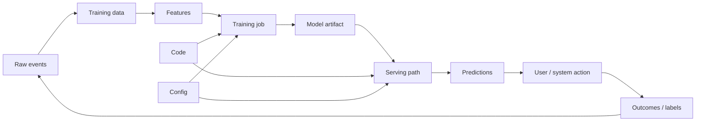
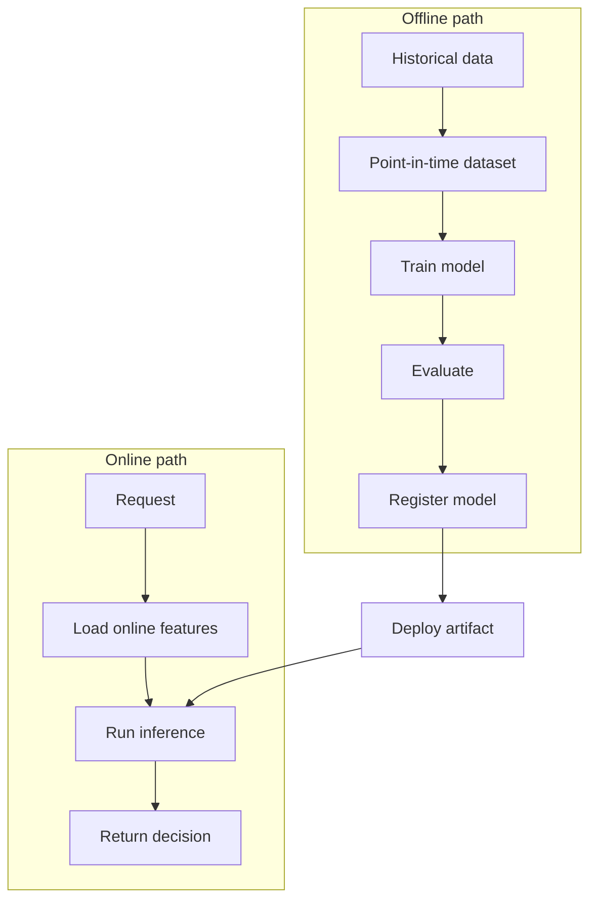

# ML System Fundamentals

## TL;DR

Machine learning systems are software systems whose behavior depends on code, data, features, labels, model artifacts, and feedback loops. The core design problem is not "train a model"; it is keeping training, serving, monitoring, and retraining aligned as the world changes. Treat data and model artifacts as versioned production dependencies with the same rigor as code.

---

## The ML System Boundary

Traditional services usually ship code and configuration. ML systems ship a decision function produced by a pipeline.

The feedback loop is the difference. A recommender changes what users see, which changes what they click, which changes future training data. A fraud model blocks transactions, which changes the observed label distribution. A ranking model shifts traffic toward items it already believes are good.

> This section covers classic predictive ML (tabular, ranking, vision, fraud). For LLM-based systems — agents, RAG, inference serving, evaluation — see [LLM Systems](../17-llm-systems/01-agent-fundamentals.md); the lifecycle discipline here (versioning, monitoring, rollback) applies to both, while the serving economics diverge sharply ([LLM Infrastructure](../17-llm-systems/05-llm-infrastructure.md)).

---

## Production ML Components

| Component | Owns | Common failure |
|---|---|---|
| Data ingestion | Raw events and source freshness | Missing partitions, duplicate events, schema drift |
| Feature pipeline | Transformations used by training and serving | Training-serving skew, stale features |
| Training pipeline | Dataset, algorithm, hyperparameters, evaluation | Non-reproducible model, leakage |
| Model registry | Artifact versions and promotion state | Wrong model deployed, missing lineage |
| Serving layer | Online or batch prediction | Latency spike, resource exhaustion |
| Monitoring | Data, prediction, quality, and business signals | Silent degradation |
| Human review | Approval for risky model changes | Optimizing proxy metrics that hurt users |

---

## ML System Control Planes

Production ML systems have several control planes. Treating all of them as "the model" hides the actual blast radius.

| Plane | Controls | Example incident when weak |
|---|---|---|
| Data plane | Ingestion, labels, joins, backfills, retention | Model learns from duplicated events or leaked future labels |
| Feature plane | Feature definitions, online/offline parity, freshness | Online model sees stale or semantically changed features |
| Model plane | Artifacts, registry state, runtime, rollback | Wrong artifact or incompatible runtime reaches production |
| Decision plane | Thresholds, policies, fallbacks, human review | Better AUC creates worse user actions because policy stayed old |
| Experiment plane | Assignment, exposure logging, metrics, guardrails | Team ships a model because of biased or broken experiment data |
| Governance plane | Risk tier, ownership, audit, approval, retirement | High-impact model runs with no owner or appeal path |

If a design review cannot say which plane owns a change, the system is not ready for production.

---

## Training vs Serving

Training optimizes quality over large historical datasets. Serving optimizes latency and reliability under live traffic. The hard part is making sure both paths compute the same meaning for the same feature names.

---

## Problem-to-Architecture Matrix

Different ML problems need different system shapes.

| Problem | Typical architecture | Latency pressure | Main risk |
|---|---|---:|---|
| Fraud / abuse decision | Online model + feature store + rules fallback + review queue | High | False positives and delayed labels |
| Recommendation feed | Candidate generation + ranker + re-ranker + exploration logs | High | Feedback loops and objective mismatch |
| Search ranking | Retrieval + ranking + interleaving/A-B tests | High | Position bias and stale indexes |
| Churn / lifecycle prediction | Batch scoring + campaign system | Low | Stale segments and weak causal attribution |
| Forecasting | Batch/streaming pipeline + planning workflow | Medium | Backtest leakage and seasonality shifts |
| Content moderation | Multi-stage classifier + policy thresholds + human review | Medium | Irreversible action and policy drift |
| Anomaly detection | Streaming features + online scoring + alert routing | Medium | Alert fatigue and baseline drift |

The architecture should follow the decision loop. A fraud system needs fast features and review controls; a churn model needs reproducible batch scoring and causal measurement; a recommender needs exposure logs and exploration.

---

## Core Design Decisions

### Batch, Online, or Streaming Prediction

| Mode | Use when | Avoid when |
|---|---|---|
| Batch prediction | Results can be precomputed, latency budget is hours | Decisions depend on fresh request context |
| Online prediction | User-facing decision must be made now | Model is too slow or too costly per request |
| Streaming prediction | Continuous event decisions or near-real-time scoring | State handling and exactly-once guarantees are immature |
| Hybrid | Candidate generation can be offline, final ranking online | Ownership between offline and online teams is unclear |

### Model as Library vs Service

| Deployment | Strength | Weakness |
|---|---|---|
| Embedded library | Lowest latency, simple local call | Harder to update independently |
| Shared model service | Centralized rollout and observability | Adds network hop and service dependency |
| Batch scoring job | Cheap and controllable | Stale predictions |
| Edge model | Works near device/user | Hard model update and observability problem |

### Rules, ML, or LLM

| Approach | Use when | Watch out for |
|---|---|---|
| Rules | Logic is explicit, stable, and explainable | Rule explosion and hidden ordering bugs |
| Classic ML | Many examples exist and prediction target is measurable | Data drift, leakage, and proxy metrics |
| LLM | Task needs language reasoning or flexible generation | Cost, nondeterminism, prompt injection, evaluation difficulty |
| Hybrid | Rules define safety boundaries; ML ranks or scores inside them | Ownership between policy and model can blur |

Do not use ML to hide unclear product policy. First define the action, fallback, and acceptable failure mode.

---

## Failure Modes

### Training-Serving Skew

Training uses one transformation and serving uses another. Offline evaluation looks good, but production quality drops.

Mitigations:

- Use shared feature definitions.
- Test training and serving feature parity.
- Log serving features for replay.
- Compare online feature values against offline recomputation.

### Data Leakage

Training data includes information unavailable at prediction time. This often appears through timestamps, joins, or labels written back into source tables.

Mitigations:

- Build point-in-time correct datasets.
- Separate event time from processing time.
- Review every feature for availability at decision time.
- Run leakage tests against suspicious high-performing features.

### Silent Model Degradation

The service stays up, latency is fine, and errors are low, but predictions become worse because the world changed.

Mitigations:

- Monitor input distributions and prediction distributions.
- Track delayed labels when available.
- Tie model metrics to business and user impact metrics.
- Keep rollback and champion/challenger paths available.

### Feedback Loops

The model influences future training data. Recommenders, ads, search, abuse detection, and marketplace systems are especially exposed.

Mitigations:

- Preserve exploration traffic.
- Log candidates that were not shown.
- Separate observational metrics from causal experiments.
- Evaluate on holdout traffic not fully controlled by the current model.

### Proxy Objective Mismatch

The model optimizes a metric that is easy to label but not the outcome the system actually needs.

Examples:

- Optimizing click-through rate increases low-quality clickbait.
- Optimizing fraud recall blocks too many legitimate users.
- Optimizing watch time reduces long-term satisfaction.

Mitigations:

- Define a metric hierarchy: primary, guardrail, diagnostic, slice.
- Review top false positives and false negatives, not just aggregate metrics.
- Promote models through online experiments when user impact matters.
- Keep business policy outside the model when it must be reviewed explicitly.

---

## Operational Metrics

| Layer | Metrics |
|---|---|
| Data | Freshness, completeness, null rate, duplicate rate, schema changes |
| Features | Online/offline skew, feature freshness, value distribution drift |
| Training | Pipeline duration, failure rate, data version, artifact hash, reproducibility |
| Evaluation | Precision/recall, calibration, loss, fairness slices, business metric deltas |
| Serving | p50/p95/p99 latency, error rate, timeout rate, CPU/GPU utilization, queue depth |
| Model behavior | Prediction distribution, confidence distribution, drift score, rejection rate |
| Business | Conversion, fraud loss, retention, revenue, user complaints, manual review load |

---

## Architecture Review Checklist

- Is every training dataset reproducible from versioned code and data snapshots?
- Are features point-in-time correct?
- Are online and offline features defined from the same contract?
- Can a model be rolled back without rolling back application code?
- Can production predictions be traced to model version, feature values, and request context?
- Are quality metrics monitored after deployment, not only before deployment?
- Is there a plan for delayed labels and missing labels?
- Does the system have a safe exploration path to avoid self-confirming feedback loops?

---

## Maturity Model

| Level | Characteristics | Risk |
|---|---|---|
| 0. Notebook model | Manual data pulls, ad hoc evaluation, manual deploy | Not reproducible |
| 1. Scheduled training | Pipeline exists, but weak lineage and manual promotion | Bad data can train quietly |
| 2. Registered models | Artifacts, metrics, and owners in a registry | Serving and feature parity may still drift |
| 3. Controlled rollout | Shadow/canary, rollback, monitoring, feature contracts | Delayed labels still require process |
| 4. Governed decision system | Risk tiering, audit logs, human controls, retirement | Higher process cost |

Most teams should not jump from Level 0 to Level 4. Move one risk boundary at a time: reproducibility, then registry, then controlled rollout, then governance.

---

## When to Use ML

Use ML when the decision boundary is hard to express as rules, enough labeled or behavioral data exists, and small errors are acceptable or reviewable.

Do not use ML when deterministic rules are sufficient, the cost of wrong decisions is unacceptable without human review, the data distribution is unstable with no monitoring plan, or the organization cannot own the lifecycle after launch.

---

## Key Takeaways

1. The model is only one artifact in an ML system.
2. Data, features, labels, and feedback loops are production dependencies.
3. Training and serving must be designed together.
4. Offline evaluation is necessary but not sufficient.
5. Monitoring model behavior matters as much as monitoring service uptime.
6. Rollback, lineage, and reproducibility are core reliability features.

---

## References

1. [Hidden Technical Debt in Machine Learning Systems](https://proceedings.neurips.cc/paper_files/paper/2015/file/86df7dcfd896fcaf2674f757a2463eba-Paper.pdf)
2. [TFX: A TensorFlow-Based Production-Scale Machine Learning Platform](https://dl.acm.org/doi/10.1145/3097983.3098021)
3. [Data Validation for Machine Learning](https://mlsys.org/Conferences/2019/doc/2019/167.pdf)
4. [TensorFlow Serving: Flexible, High-Performance ML Serving](https://arxiv.org/abs/1712.06139)
5. [Rules of Machine Learning](https://developers.google.com/machine-learning/guides/rules-of-ml)
