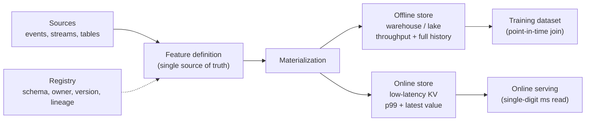

# Feature Stores

## TL;DR

A feature store is not a database for machine-learning features; it is a *consistency system* that bridges two storage engines with opposite optimization targets. An offline store optimizes throughput and completeness so that training can scan years of history; an online store optimizes p99 latency so that serving can read a feature in single-digit milliseconds. The feature store's reason to exist is to guarantee that a feature computed for training and the same feature computed for serving are *the same value* — one definition, two access paths. Everything else it does — point-in-time-correct joins, materialization, freshness SLOs, versioning, a registry — exists to protect that single guarantee against the fact that the two stores are physically separate systems that drift apart by default.

---

## The Problem a Feature Store Solves: Training/Serving Skew

The failure that justifies the entire category is *training/serving skew*, and it is worth stating precisely because it is so easy to underestimate. A team defines a feature — say, "number of failed logins in the last ten minutes." For training, an analyst writes it as a windowed SQL aggregation over a warehouse table of login events. For serving, an application engineer writes it as a counter incremented in Redis on each login attempt. These two implementations *look* equivalent. They are not. The SQL version counts events by their event timestamp; the Redis counter counts by arrival and expires on a sliding TTL. One includes late-arriving events, the other does not. One resets at midnight UTC, the other rolls continuously. The model trains on one distribution and serves on another, and because nothing crashes, the degradation is silent — the model simply makes worse decisions than its offline metrics promised.

The engineering implication is that *two implementations of one feature is a bug, not a convenience*. The same logic written twice will diverge, and the divergence will be invisible until it shows up as unexplained production loss. A feature store attacks this by making the feature *definition* the single source of truth and deriving both the offline and online values from it — or, at minimum, by logging served values so the offline pipeline can be replayed against them and the skew measured. The deeper principle echoes the leakage discipline of [training pipelines](./05-training-pipelines.md): the offline world and the online world must agree, or the model is trained on a fiction.

Without a feature store, this skew is structural. Every model team builds its own feature pipeline, "user purchase count in last 7 days" means three different things across three teams, and the same logic is debugged independently in six places. The feature store is the system that collapses those duplicated, drifting definitions into one contract with two materialization paths.

---

## The Online/Offline Duality Is a CAP-Flavored Trade-off

The defining structural fact about a feature store is that it is a *dual-store* system, and the two stores cannot be the same engine because they are optimized for contradictory access patterns.

The **offline store** lives in a warehouse or lake — BigQuery, Snowflake, Redshift, or Parquet/Delta on object storage queried by Spark. It is optimized for *throughput and completeness*: it must hold the full history of every feature value so that a training job can reconstruct what any feature looked like at any past moment, and it must support large columnar scans and joins over billions of rows. Latency is irrelevant here; a training read that takes ten minutes is fine. Cost-per-byte and scan throughput dominate.

The **online store** is a low-latency key-value system — Redis, DynamoDB, Cassandra, or an embedded store like RocksDB — keyed by the entity being scored. It is optimized for *p99 latency*: a serving request that needs twenty features for a `user_id` must fetch them in single-digit milliseconds, because the feature lookup sits on the critical path of a prediction that itself has a tight latency budget. It typically stores only the *latest* value per entity, not history, because serving only ever asks "what is this feature right now?"

These two stores hold the same logical features but make opposite trade-offs, and keeping them consistent is the central engineering challenge. This is a [CAP-flavored](../01-foundations/03-cap-theorem.md) tension wearing ML clothing. The online store is, architecturally, a read-optimized [cache](../04-caching/01-cache-strategies.md) of values whose system of record is the offline store and the upstream event streams. Like any cache, it can be stale, it can miss, and hot entities create [hot-key](../02-distributed-databases/05-partitioning-strategies.md) pressure exactly as they would in any read-heavy KV store. The feature store does not escape these distributed-systems problems; it *inherits* them, and a large part of operating one is managing the consistency gap between a complete-but-slow store and a fast-but-approximate one.



---

## Point-in-Time Correctness: The Defining Correctness Property

If consistency between the two stores is the central engineering challenge, *point-in-time correctness* is the central correctness property — the one whose violation silently destroys a model while every offline metric looks excellent. It is the same leakage concern that governs [training pipelines](./05-training-pipelines.md), surfaced here as a join problem.

The rule is simple to state and easy to violate: a training row labeled at time *T* must see only feature values that were *knowable at T*. A training set is built by joining a table of labeled events (each with an entity and a timestamp) against the history of feature values. The naive implementation joins each entity to its *current* or *latest* feature value — and that join *leaks the future*. Consider a fraud label generated for a transaction at 10:05. The feature "account risk score" was recomputed at 10:40 after the fraud was discovered and the account flagged. A latest-value join hands the model the 10:40 value as if it were available at 10:05. The model learns to read the answer off a feature that, in production, will not yet contain it. Offline AUC soars; production performance collapses.

A correct point-in-time join is an *as-of* join: for each labeled row at time *T*, take the most recent feature value whose availability time is ≤ *T*. Getting this right depends on distinguishing three timestamps that are easy to conflate:

- **Event time** — when the fact actually happened in the world (the login occurred at 10:00).
- **Ingestion time** — when the system received and recorded the event (the log landed at 10:03).
- **Availability time** — when the computed feature value became readable from the online store (materialized and queryable at 10:10).

The correct join key is *availability time*, because that is what a real serving request at *T* could actually have read. A feature whose underlying event happened at 10:00 but which did not become servable until 10:10 was *not available* to a decision made at 10:05, and using it leaks. This is why a feature store must store *feature history*, not just the latest value, in the offline store: without the time series of values and their availability timestamps, an honest as-of join is impossible to reconstruct, and backtests quietly diverge from production. The discipline mirrors the time-based-split rule for training: the offline world must only ever see what the online world knew at the moment of the decision.

Mechanically, point-in-time retrieval is a nearest-preceding-version query:

```sql
-- For each training example, find the latest feature value available at decision time.
SELECT e.example_id,
       e.entity_id,
       e.decision_time,
       f.value AS account_risk
FROM training_examples e
LEFT JOIN LATERAL (
  SELECT value
  FROM feature_history f
  WHERE f.entity_id = e.entity_id
    AND f.feature_name = 'account_risk'
    AND f.availability_time <= e.decision_time
  ORDER BY f.availability_time DESC
  LIMIT 1
) f ON true;
```

At scale this is not executed as one nested lookup per row; the implementation is a sorted merge over `(entity_id, availability_time)`:

```text
training examples:  (entity_id, decision_time) sorted ascending
feature history:    (entity_id, availability_time) sorted ascending

for each entity:
  advance feature cursor while availability_time <= decision_time
  emit current feature value for that decision_time
```

That merge is why feature-history layout matters. Partition by date alone and every entity lookup scans too much. Partition by entity hash alone and time-window backfills become expensive. Most systems choose a hybrid: date partitions for batch pruning, clustered or sorted by entity and availability time inside each partition.

---

## Materialization: Getting Features From Definition to the Online Store

Materialization is the process that turns a feature definition into actual values sitting in the online store, ready to serve. It is where the freshness-versus-cost trade-off is made concrete, and the choice of materialization pattern is the most consequential design decision in a feature store.

**Batch (precompute) materialization** runs a scheduled job that computes feature values over a window and writes the latest result to the online store. It is cheap and simple, reuses the offline pipeline, and is correct for features that tolerate hours of staleness — a user's 30-day average order value does not change minute to minute. Its failure mode is bounded by its cadence: if the job runs hourly, the online value is up to an hour stale, and if the job is late or fails, the online store silently serves yesterday's value.

**Streaming materialization** consumes an event stream (often a [change-data-capture](../13-data-pipelines/04-change-data-capture.md) feed off the source tables, or a Kafka topic of domain events) and updates online values within seconds. It is the answer for features that must be fresh — failed-login counts, current session activity, real-time velocity features. The cost is operational complexity: streaming aggregation must be *idempotent*, because a replayed or duplicated event must not double-count a windowed counter, and out-of-order events must be handled or the window is wrong. Streaming materialization is where most feature-store production incidents originate.

**On-demand (request-time) computation** computes a feature at serving time from data in the request itself — the value of the current shopping cart, a distance between the request's location and a stored home address. These features cannot be precomputed because they depend on inputs that do not exist until the request arrives. The trade-off is latency and the new requirement that the *same* on-demand transformation be available in the offline pipeline for training, or skew returns through the back door.

The unifying trade-off is freshness versus cost. Fresher features require more frequent or continuous computation, which costs more compute and more operational surface area. The right pattern is chosen per feature, by asking how stale the value is allowed to be — which turns freshness from an implementation detail into a declared, monitored property.

| Pattern | Freshness | Cost / complexity | Correct when |
|---|---|---|---|
| Batch precompute | Hours | Low | Slowly changing aggregates (30-day spend) |
| Streaming | Seconds | High (idempotency, ordering) | Real-time signals (velocity, live counts) |
| On-demand | Request-time | Medium (parity risk) | Depends on request-only inputs (cart value) |

---

## Feature Freshness as an Online-Serving SLO

Once materialization is in place, *freshness* — how old the value in the online store is allowed to be — becomes a service-level objective, not a vague aspiration. It belongs in the same operational vocabulary as latency and error rate, monitored with [SLOs and error budgets](../11-observability/05-slos-error-budgets.md).

The reason freshness must be an explicit SLO is that staleness is invisible from inside the serving path. The online store returns a value with the same latency whether that value was updated three seconds ago or three days ago; nothing about a successful read reveals that the materialization job died last night. The only way to detect staleness is to measure the *age of the latest update* per feature group and compare it to a declared budget. A fraud feature might carry a 60-second freshness SLO; a churn feature might tolerate 24 hours. When the measured age exceeds the budget, the system should react — page the owner, fail closed, or route to a fallback model that does not depend on the stale feature — rather than continuing to serve confidently wrong predictions.

The design rule that follows is that *freshness is a declared property of every feature*, recorded in the registry and enforced in production. A feature whose freshness is not stated has no definition of "broken," and a materialization pipeline that is not watched for staleness is a silent failure waiting to happen.

A feature contract should make this operational, not implicit:

```yaml
feature: failed_login_count_10m
version: v4
entity: user_id
owner: identity-risk-platform
source: login_events:v12
semantics: "count failed login attempts by event_time over trailing 10 minutes"
materialization: streaming
freshness_slo: { p99_age_seconds: 60 }
online_store: redis_cluster_identity_features
offline_store: iceberg.identity_features.failed_login_count_10m
join_time: availability_time
backfill_policy: append_correction_not_overwrite
allowed_default: 0
consumers:
  - fraud_classifier:v42
  - account_takeover_model:v17
```

The `consumers` field is not bookkeeping; it powers impact analysis. If `login_events:v12` had a parsing bug from 10:00 to 11:00, the registry should answer which feature versions, models, and production decisions were affected.

---

## Feature Versioning: A Semantic Change Is a New Feature

Features are an API that models depend on, and the cardinal rule of that API is that *a semantic change is a new feature name, never an in-place edit.* This rule exists because a model's offline behavior is pinned to the exact meaning a feature had when it was trained, and changing that meaning underneath a deployed model is indistinguishable from a silent regression.

The subtlety is that *type compatibility does not imply semantic compatibility*. If "session length" silently changes from counting seconds to counting milliseconds, every type check passes, every null check passes, and every model consuming it is now wrong by three orders of magnitude. If "active user" is redefined from "logged in this week" to "logged in this month," the column type never changes, but the feature now means something else, and the model trained on the old meaning degrades. Editing a feature's logic in place corrupts both the offline history (backfilled values overwrite what production actually served) and the online behavior (deployed models suddenly read a different signal).

The discipline is therefore to treat features as immutable, versioned objects. A change in meaning produces `session_length_ms:v3` alongside the still-live `session_length_sec:v2`; old models keep reading v2 until they are retrained and re-validated against v3. Models pin the exact *feature view versions* they consumed — the same pinning that the [training pipeline's](./05-training-pipelines.md) reproducibility contract records — so that a model can always be rebuilt against the precise feature semantics it was trained on. Backfills, when they correct genuinely wrong history, must be versioned too, so that "the value production actually served" is never overwritten by "the value we later decided was correct."

---

## The Registry: Discovery, Reuse, and Governance

The third store in a feature store — after offline and online — is the *registry*, the metadata catalog that records every feature's definition, owner, schema, version, freshness SLO, source, and lineage. It is the component most often underbuilt and the one that determines whether a feature store delivers its central promise of *reuse*.

The economic argument for a feature store is that features are expensive to build correctly and should be built once and shared. That promise is only real if an engineer on a new model can *discover* that `user_failed_login_count_10m` already exists, see who owns it, confirm its freshness and semantics, and consume it without rebuilding it. Without a searchable registry, teams re-derive the same features in slightly different ways, and the skew the feature store was meant to eliminate creeps back in as duplication. The registry is what turns a pile of materialized tables into a shared, governed asset.

The governance angle matters because shared features create shared dependencies and therefore shared failure surfaces. A feature consumed by twelve models whose upstream team has quietly stopped maintaining its source semantics is a latent incident across all twelve. The registry is where ownership is assigned, usage is tracked (so unused features can be deprecated and heavily-used ones treated as production-critical), and changes are reviewed. For regulated decisions — credit, insurance, hiring — the registry's lineage is also the audit trail: it answers "what feature values, computed how, fed this decision?" A feature store without an owned, enforced registry is, in the end, just another database; the metadata layer is what makes it a platform.

---

## How the Real Systems Are Built

The category was defined in production before it was named. **Uber's Michelangelo Palette** (introduced around 2017) is the canonical dual-store design: a Hive/Spark-based offline store for training and a Cassandra-plus-Redis online store for serving, with a shared DSL so that a feature defined once is materialized to both paths — the explicit architectural answer to training/serving skew. **Airbnb's Zipline** (described publicly from 2018) focused hard on point-in-time correctness, generating training data with as-of joins that respect each label's timestamp, precisely to prevent the future-leakage failure, and unifying batch and streaming feature computation behind one definition.

**Feast** (open-sourced by Gojek in 2019, later a Linux Foundation / Tecton-stewarded project) is the widely-used open implementation of the pattern: feature definitions in code, a pluggable offline store (BigQuery, Snowflake, Redshift, file-based) and a pluggable online store (Redis, DynamoDB, Datastore), with point-in-time-correct `get_historical_features` for training and low-latency `get_online_features` for serving. **Tecton** (founded 2019 by the Michelangelo team) is the commercial managed feature platform built around the same dual-store-plus-streaming model, emphasizing managed materialization and freshness SLOs. Across all of them the architecture rhymes: one definition, an offline store for complete history, an online store for fast reads, a registry for discovery, and a materialization layer whose job is to keep the two stores honest.

---

## Failure Modes

The characteristic failures of a feature store are direct consequences of its dual-store structure, and naming them is most of preventing them.

**Training/serving skew** is the defining failure: the offline and online values for the "same" feature diverge because they were computed by two code paths. The defense is to derive both from one definition where possible, and otherwise to log served feature values and replay them through the offline pipeline to measure the delta — skew you do not measure is skew you are shipping.

**Stale online features** occur when the online store is healthy and fast but the materialization that feeds it has silently stopped. Reads succeed; the values are old. The defense is a freshness SLO with per-feature-group age monitoring that fails closed or falls back when the budget is exceeded.

**Point-in-time leakage** is the offline-side mirror of skew: a training join that uses feature values not knowable at the label's timestamp. It inflates offline metrics and collapses in production. The defense is as-of joins keyed on availability time, plus stored feature history to make those joins reconstructible.

**Hot-key load** appears when a few entities — a celebrity user, a viral item, a high-volume merchant — concentrate read traffic on a handful of online-store keys, creating tail-latency spikes exactly as they would in any [partitioned KV store](../02-distributed-databases/05-partitioning-strategies.md). The defense is the usual cache toolkit: replicate hot keys, add a local read cache in front of the online store, or precompute and pin aggregates for known-hot entities.

A production incident runbook should be pre-written because feature incidents are silent from the model's perspective:

```text
Alert: failed_login_count_10m freshness p99_age_seconds > 60 for 5 minutes
1. Stop the bleeding: serving gateway marks feature group stale.
2. Degrade safely: route dependent models to fallback model/rules that do not consume it.
3. Identify scope: registry query consumers(feature=failed_login_count_10m:v4).
4. Inspect materialization: stream lag, dead-letter rate, source schema changes.
5. Backfill/correct: append corrected feature values with observed_at and correction reason.
6. Re-evaluate: rerun affected offline metrics and monitor prediction distribution.
7. Decide retrain: if production decisions consumed stale values long enough to affect labels,
   trigger lineage-based retraining after labels mature.
```

The key is step 2: a model should not continue serving confident predictions on known-stale features just because Redis still returns a value.

---

## Decision Framework: Do You Even Need One?

A feature store is significant infrastructure, and the most important design decision is whether the problem actually calls for one. The honest default for many teams is *no*.

The questions that decide it are about *sharing* and *serving*. Do multiple models consume the same features, such that building them once and reusing them pays off? Does the model serve online, so that the same feature must be computed both for batch training and for low-latency inference — the condition that creates skew risk in the first place? Do features need to be fresh within seconds, making materialization a real engineering problem? Do regulated decisions require lineage and an audit trail? When several of these are true, the consistency, discovery, and freshness machinery of a feature store earns its keep.

When they are not, simpler tools are not just acceptable but correct. A single offline-only model that scores a batch nightly needs no online store at all — a versioned, immutable training table built with a careful point-in-time query is sufficient, and it is the [training pipeline's](./05-training-pipelines.md) snapshot discipline doing the work. A single online feature that is read but never used in training is just a [cache](../04-caching/01-cache-strategies.md); reach for Redis, not a feature platform. The trap is adopting a feature store for the *resume* rather than the requirement: an unowned feature store with no registry governance and one consumer is strictly worse than the precomputed table it replaced, because it adds operational surface without delivering reuse or consistency. Build the feature store when you have the skew problem it solves — not before.

The monitoring that confirms a feature store is healthy is itself a small SLO suite, and it connects directly to [model monitoring](./04-model-monitoring.md): freshness lag (is materialization alive?), online read p99 (does the feature read fit the prediction's latency budget?), online miss rate (are keying or backfill gaps starving the model?), null/default rate (did a source regress?), and offline/online parity delta (is skew creeping in?). A feature store whose own health is unmonitored cannot guarantee the consistency that is its only reason to exist.

---

## Key Takeaways

1. A feature store is a consistency system, not a database: its job is to guarantee that a feature computed for training and for serving is the same value — one definition, two access paths.
2. Training/serving skew is the problem it solves; two implementations of one feature will silently diverge and degrade the model while offline metrics look fine.
3. The online/offline duality is a CAP-flavored trade-off: the offline store optimizes throughput and full history, the online store optimizes single-digit-millisecond p99, and keeping them consistent is the core challenge.
4. Point-in-time correctness is the defining correctness property: train only on values knowable at each row's timestamp, joining on availability time, or the future leaks in.
5. Distinguish event time, ingestion time, and availability time; the online store can only ever have read what was available, so availability time is the honest join key.
6. Materialization (batch, streaming, on-demand) is a freshness-versus-cost decision made per feature; streaming demands idempotency and ordering discipline.
7. Feature freshness is an online-serving SLO — measured as the age of the latest update and enforced by fail-closed or fallback, because staleness is invisible from a successful read.
8. A semantic change is a new feature name, never an in-place edit; models pin immutable feature view versions, because type compatibility is not semantic compatibility.
9. The registry delivers the reuse and governance that justify the platform; without owned, discoverable metadata a feature store is just another database.
10. Most single-model, offline-only, or single-cache use cases do not need a feature store; adopt one when sharing, online serving, freshness, or lineage make the consistency machinery pay for itself.

---

## References

1. [Feast Documentation](https://docs.feast.dev/) — open-source feature store, offline/online stores and point-in-time joins
2. [Uber Michelangelo: Machine Learning Platform](https://www.uber.com/blog/michelangelo-machine-learning-platform/) — Palette feature store, dual-store architecture
3. [Zipline: Airbnb's Machine Learning Data Management Platform](https://www.youtube.com/watch?v=Ad-PNQghJg8) — point-in-time-correct training data generation
4. [Tecton: What Is a Feature Store?](https://www.tecton.ai/blog/what-is-a-feature-store/) — managed feature platform and materialization model
5. [Hidden Technical Debt in Machine Learning Systems](https://proceedings.neurips.cc/paper_files/paper/2015/file/86df7dcfd896fcaf2674f757a2463eba-Paper.pdf) — Sculley et al., 2015
6. [Data Validation for Machine Learning](https://mlsys.org/Conferences/2019/doc/2019/167.pdf) — Breck et al., 2019
7. [Spanner: Google's Globally-Distributed Database](https://research.google/pubs/pub39966/) — Corbett et al., OSDI 2012 (consistency-vs-latency framing)
