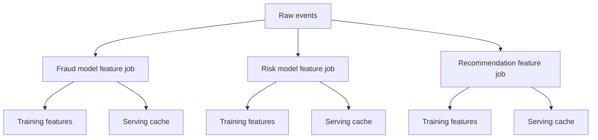
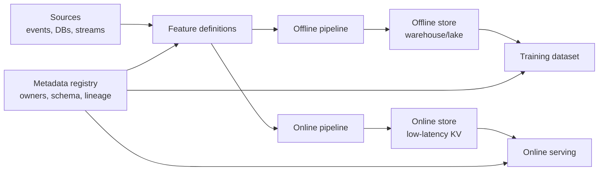
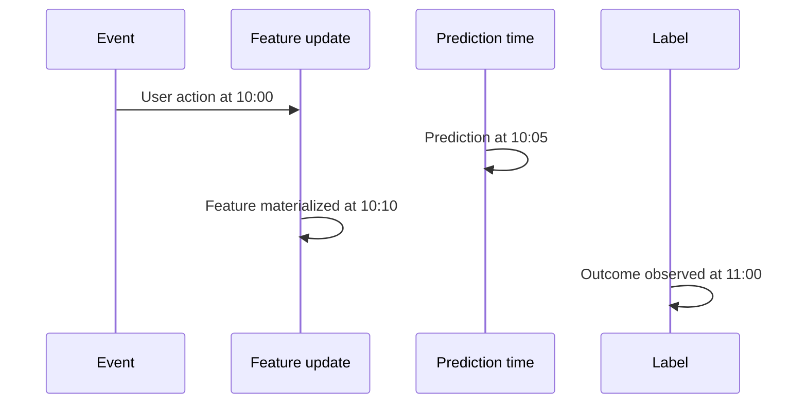

# Feature Stores

## TL;DR

A feature store manages reusable ML features across offline training and online serving. Its job is not only storage; it is consistency. The hard requirements are point-in-time correctness, feature freshness, schema/version control, discoverability, ownership, and parity between training and serving.

---

## The Problem

Without a feature store, every model team builds its own feature pipeline.



This creates duplicated logic, inconsistent definitions, and hard-to-debug production behavior. "User purchase count in last 7 days" might mean three different things across teams.

---

## Feature Store Architecture



The same feature contract should drive both materialization paths. The storage engines can differ; the semantics should not.

---

## Feature View Design

A feature view is the unit of ownership and materialization. Design it around entity, time, freshness, and use case.

| Dimension | Design question | Example |
|---|---|---|
| Entity | What key is scored? | `user_id`, `merchant_id`, `item_id`, `device_id` |
| Time window | What history is summarized? | 10 minutes, 7 days, lifetime |
| Freshness | How old can the value be? | 30 seconds for fraud, 24 hours for churn |
| Source of truth | Which event/table owns the fact? | Payment events, login stream, item catalog |
| Materialization | How does it reach offline/online stores? | Batch, streaming, request-time |
| Default behavior | What happens on miss/null? | `0`, unknown bucket, fail closed |

Bad feature views usually mix too many entities or hide time semantics in the name. `risk_score` is vague; `user_failed_login_count_10m` is reviewable.

---

## Offline vs Online Store

| Store | Optimized for | Typical systems | Main risk |
|---|---|---|---|
| Offline store | Historical joins, scans, backfills | BigQuery, Snowflake, Spark, Delta, Hive | Point-in-time bugs |
| Online store | Low-latency lookups | Redis, DynamoDB, Cassandra, RocksDB | Staleness, hot keys |
| Metadata store | Discovery and lineage | Catalog DB, registry service | Undocumented ownership |

The online store is a [low-latency cache](../04-caching/01-cache-strategies.md) keyed by entity; hot entities create the same [hot-key/partitioning](../02-distributed-databases/05-partitioning-strategies.md) problems as any read-heavy store, and the materialization path that keeps it fresh is typically a [change-data-capture](../13-data-pipelines/04-change-data-capture.md) stream off the source events.

---

## Materialization Patterns

| Pattern | Use when | Failure mode |
|---|---|---|
| Batch materialization | Features tolerate hours of staleness | Late jobs create stale online values |
| Streaming materialization | Features need seconds/minutes freshness | Duplicates, out-of-order events, replay bugs |
| Request-time features | Feature depends on current request | Latency spikes and dependency fanout |
| Hybrid | Historical aggregates plus request context | Online/offline parity is harder |
| On-demand backfill | Recover after bug or add new feature | Expensive recomputation and version confusion |

Streaming materialization still needs idempotency. If the same event is replayed, counters and windows must not double count.

---

## Point-in-Time Correctness

Training must only use feature values that were available at the prediction time.



At prediction time 10:05, the 10:10 feature value was not available. A training join that uses it leaks future information.

Correct dataset construction needs:

- Event timestamp: when the fact happened.
- Ingestion timestamp: when the system received it.
- Availability timestamp: when the feature could be served.
- Entity key: the user, account, item, device, or session being scored.

### Point-in-Time Join Rules

| Rule | Why |
|---|---|
| Join features using availability time, not processing completion time | Prevents future leakage |
| Store feature history, not only latest values | Enables training snapshots and replay |
| Include late-arriving events policy | Makes backtests match production |
| Version backfills | Distinguishes original production value from corrected historical value |
| Log online feature values | Allows parity checks and incident reconstruction |

---

## Feature Freshness

Feature freshness is a service-level objective ([SLOs & Error Budgets](../11-observability/05-slos-error-budgets.md)). A fraud model might need second-level freshness; a churn model might tolerate daily updates.

| Feature type | Freshness need | Example |
|---|---|---|
| Static | Rarely changes | User country, signup channel |
| Slowly changing | Hours to days | Account age bucket, historical spend |
| Near-real-time | Seconds to minutes | Failed login count, active session count |
| Request-time | Computed per request | Cart value, device fingerprint |

Freshness should be declared in metadata and monitored in production.

---

## Schema Evolution

Feature changes are API changes for models.

| Change | Compatibility | Rollout |
|---|---|---|
| Add optional feature | Usually compatible | Backfill offline, then expose online |
| Add required feature | Breaking for old serving path | Deploy feature before model uses it |
| Rename feature | Breaking | Dual-write old and new names during migration |
| Change type | Breaking | New versioned feature name |
| Change semantics | Breaking even if type matches | New version and owner approval |
| Change default | Risky | Evaluate slices where missingness is common |

If a feature's meaning changes, prefer a new feature name. Type compatibility does not imply semantic compatibility.

---

## Feature Contracts

A feature contract should define:

- Name and description.
- Entity keys.
- Value type and allowed range.
- Owner and on-call contact.
- Freshness SLO.
- Offline source and online source.
- Backfill behavior.
- Null/default behavior.
- Deprecation plan.

Example:

```yaml
name: user_failed_login_count_10m
entity: user_id
type: int64
freshness_slo: 120s
default: 0
owner: identity-risk
offline_source: warehouse.login_events
online_source: redis:user-risk
availability_timestamp: materialized_at
```

---

## Failure Modes

### Training-Serving Skew

The offline query and online transformation drift apart.

Mitigation: generate both paths from one feature definition or run parity tests that replay logged online requests through the offline pipeline.

### Stale Online Features

The online store is available but no longer receiving updates.

Mitigation: monitor age of latest feature update per feature group and fail closed or route to a fallback model when freshness exceeds the budget.

### Hot Entities

Popular users, items, or merchants create hot keys in the online store.

Mitigation: cache local reads, split keys by time window, shard large entities, or precompute aggregate features for hot entities.

### Unowned Features

Models depend on features whose upstream team no longer maintains the source semantics.

Mitigation: require owner metadata, usage tracking, deprecation notices, and feature-level change review.

---

## Build vs Buy Decision Matrix

| Situation | Prefer simple pipeline | Prefer feature store |
|---|---|---|
| One offline model | Yes | Usually no |
| Many models share the same features | No | Yes |
| Online inference needs low-latency features | Maybe | Yes |
| Regulated decisions need lineage | No | Yes |
| Team lacks platform ownership | Yes | Only with managed service |
| Features change weekly across teams | No | Yes |

A feature store without ownership becomes another database. The platform must own contracts, metadata, freshness monitoring, and deprecation.

---

## Operational Metrics

| Metric | Why it matters |
|---|---|
| Feature freshness lag | Detects broken materialization |
| Online lookup latency | Affects prediction p99 |
| Online lookup miss rate | Reveals keying or backfill gaps |
| Null/default rate | Detects source regressions |
| Offline/online parity delta | Detects skew |
| Feature usage count | Supports cleanup and ownership |
| Backfill duration | Determines recovery time after pipeline bugs |

---

## When to Use a Feature Store

Use a feature store when multiple models share features, online/offline consistency matters, feature freshness is operationally important, or regulated decisions require lineage.

Avoid a full feature store for a single offline model with no serving path. A versioned dataset and clear pipeline may be enough.

---

## Key Takeaways

1. A feature store is a consistency system, not just a database.
2. Point-in-time correctness prevents future data leakage.
3. Feature freshness must be monitored like an SLO.
4. Offline and online storage can differ, but semantics must match.
5. Feature ownership and deprecation are production reliability concerns.

---

## References

1. [Feast Documentation](https://docs.feast.dev/)
2. [Data Validation for Machine Learning](https://mlsys.org/Conferences/2019/doc/2019/167.pdf)
3. [Hidden Technical Debt in Machine Learning Systems](https://proceedings.neurips.cc/paper_files/paper/2015/file/86df7dcfd896fcaf2674f757a2463eba-Paper.pdf)
4. [Uber Michelangelo: Machine Learning Platform](https://www.uber.com/blog/michelangelo-machine-learning-platform/)
