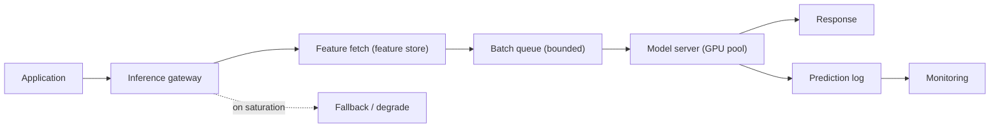

# Model Serving

## TL;DR

Model serving is the discipline of running a trained model as a production service whose request handler is unusually expensive: a single prediction may consume orders of magnitude more compute than an ordinary web request, often on hardware that costs dollars per hour, and the model must be *loaded* into accelerator memory before it can serve anything at all. This reframes serving away from data science and toward systems design. The defining tension is **latency versus throughput**: the techniques that keep expensive accelerators busy — batching, queueing — are the same techniques that inflate the tail of the latency distribution. A good serving system is one that navigates that tension deliberately: it chooses a serving topology, batches on a controlled wait, autoscales on the signal that actually predicts saturation, keeps replicas warm because cold starts are slow, and degrades gracefully instead of timing out. Everything below is a consequence of treating inference as a latency-bounded, throughput-constrained, hardware-bound service rather than a function call.

Serving is a production service first, so the general patterns apply directly: [capacity planning](../01-foundations/10-capacity-planning.md) for the latency budget, [retries, timeouts, and hedging](../06-scaling/10-retries-timeouts-hedging.md) for tail control, [deployment strategies](../15-deployment/01-deployment-strategies.md) for canary and blue-green rollouts, and [autoscaling](../06-scaling/08-auto-scaling.md) for capacity. The LLM regime — continuous batching, KV caches, the prefill/decode split — is its own world, covered in depth in [LLM Infrastructure](../17-llm-systems/05-llm-infrastructure.md).

---

## The Central Tension: Latency Versus Throughput

Almost every interesting decision in model serving is a point on a single trade-off curve between latency and throughput, and understanding why this trade-off is *fundamental* — not an implementation detail — is the key to the whole topic.

The reason it is fundamental is that modern inference hardware is built for parallelism, not for serial speed. A GPU running a single request leaves most of its arithmetic units idle; the same GPU running thirty-two requests at once does roughly thirty-two times the useful work in barely more wall-clock time, because the dominant cost is moving the model's weights from memory into the compute units, and that cost is paid once per batch regardless of batch size. So there are two completely different numbers a serving system can optimize. **Latency** is how long one request waits. **Throughput** is how many requests the system finishes per second. On a GPU these are not merely different — they are in *tension*, because the cheapest way to raise throughput is to make each request wait a little so it can ride along with others.

The engineering implication is that you cannot tune a serving system without first deciding which number the product actually cares about. A fraud-authorization call that blocks a checkout cares about p99 latency and will pay for idle hardware to get it. An overnight batch that scores every user's churn risk cares only about total cost and will happily run enormous batches at terrible per-request latency. Most real systems sit between these poles, and the entire job of serving infrastructure is to give an operator a *knob* on that curve rather than an accident.

---

## The Serving Regimes

Before any topology or hardware decision, a model belongs to one of a few serving *regimes*, and the regime is fixed by how soon the prediction is needed relative to when its input arrives. Choosing the regime correctly is the highest-leverage decision in the whole design, because it determines which constraints even apply.

**Batch (offline) scoring** runs predictions on a schedule over a large, already-collected dataset — every user's daily churn score, an overnight recommendation refresh. It has no latency budget in the user-facing sense, so it sits at the throughput extreme: maximize batch size, saturate the hardware, minimize cost-per-prediction. The catch is *staleness* — the score reflects the world as of the last run — and *invalidation*, the question of when a precomputed prediction is too old to trust. Batch is the cheapest regime by a wide margin, and a surprising number of "real-time" requirements dissolve under the question "how fresh does this actually need to be?"

**Online synchronous** serving answers a request in the request's own latency budget — fraud authorization, search ranking, personalization on page load. This is the regime where every constraint in this document bites: tail latency, cold start, batching trade-offs, autoscaling on the right signal. It is also the most expensive, because it forces the hardware to be ready *now* rather than whenever convenient.

**Online asynchronous and streaming** serving decouples the prediction from a blocking call. An async scoring queue lets enrichment or review-routing happen within seconds-to-minutes without holding a user request open; streaming inference scores events as they flow through a pipeline (abuse detection, anomaly detection) at high throughput with per-event latency in the tens of milliseconds. These regimes relax the tail-latency constraint in exchange for queue semantics and delayed decisions.

The practical rule is to *push work toward the cheapest regime that still meets the freshness requirement*. Serving a daily-stable score through an expensive online endpoint is a common and avoidable waste; the same prediction precomputed in a nightly batch and cached costs a fraction as much. The regimes below — topologies, batching, autoscaling — are all refinements of the online synchronous case, because that is where the systems design is hardest.

---

## Why GPUs Change the Economics

Serving on CPUs and serving on accelerators are different businesses, and the difference is almost entirely about *utilization as the unit of cost*.

A CPU fleet degrades gracefully and is cheap enough that some idle headroom is unremarkable. An accelerator fleet does not work that way. A GPU instance is a large fixed hourly cost whether it is doing useful work or sitting idle, and the expensive part — the accelerator — is indivisible: you cannot buy "thirty percent of an H100." This turns utilization from a nice-to-have efficiency metric into *the* metric. A GPU at twenty percent utilization is not eighty percent fine; it is a machine where eighty percent of a very large bill is being set on fire. This is the same economics that dominates [training pipelines](./05-training-pipelines.md), where an A100 starved of input data idles at premium rates — except in serving the starvation comes from a thin, bursty request stream rather than slow data I/O.

This is the real reason batching exists. Batching is not primarily a latency feature or a throughput feature; it is the mechanism that keeps an expensive, indivisible accelerator busy enough to justify its price. Once you see utilization as the cost driver, a cascade of serving decisions follows: you consolidate many models onto shared accelerators (multi-model serving, as in NVIDIA Triton) rather than dedicating a GPU per model, you batch aggressively to fill the silicon, and you scale on queue depth rather than CPU because CPU tells you almost nothing about whether the GPU is saturated. The accelerator is the constraint, and a well-designed serving system organizes everything else around keeping it fed.

---

## Dynamic Batching Is a Queueing Decision

The cleanest way to understand batching is as a small, deliberate piece of queueing theory embedded in the request path.

Static batching — wait until exactly N requests have arrived, then run them together — is simple but wrong for online traffic, because under low load the Nth request may never arrive and early requests wait indefinitely. **Dynamic batching** fixes this with a bounded wait: the server holds incoming requests in a queue for at most a few milliseconds (TensorFlow Serving exposes this as `batch_timeout_micros`; NVIDIA Triton as a `max_queue_delay`), and it dispatches whichever requests have accumulated when either the batch fills or the timer expires. The wait is the price you pay to assemble a batch, and it is a knob directly on the latency/throughput curve: a longer wait builds bigger batches and higher throughput at the cost of added latency for every request, even the ones that arrive when the queue is empty.

The subtlety that catches teams is that this is a *queueing* decision, not a constant. Under heavy load, batches fill before the timer fires, so the wait adds little and throughput is high. Under light load, the timer dominates and adds its full delay to requests that did not need to wait at all. The worst regime is moderate, bursty load, where the queue oscillates and the added latency becomes unpredictable — which is exactly where the tail blows up. The right batch-wait is therefore a function of the traffic shape, and the honest way to set it is to measure p99 latency at the actual peak burst size rather than reasoning about averages. A serving system that batches without measuring its tail under burst has chosen a throughput it cannot describe and a latency it cannot promise.

---

## Tail Latency Is the Real Budget

Online serving is governed by a *latency budget*, and the number that matters in that budget is almost never the mean.

The reason is that an inference call is rarely the whole story. A user-facing prediction typically fans out: the request must be authenticated and routed, features must be fetched (often from a [feature store](./02-feature-stores.md) over the network), the model must run, and the result must be post-processed and logged. Each stage consumes part of a fixed end-to-end budget, and a useful design discipline is to write that budget down explicitly before choosing hardware — because if feature lookup is eating most of a 100 ms budget, a faster GPU will not fix the user experience.

```text
End-to-end p99 budget: 120 ms
  ingress + auth/routing      15 ms
  feature fetch               40 ms   <- often the real bottleneck
  model inference             45 ms
  post-processing + logging   20 ms
```

The deeper point is *which percentile* the budget applies to. A model whose mean latency is 20 ms but whose p99 is 300 ms will, in any request that fans out to several models or several features, produce a slow user experience surprisingly often — because a request that touches ten backends inherits roughly the p99 of the *slowest* of the ten. This is the tail-at-scale problem, and serving makes it worse in two specific ways. First, batching couples requests: one slow or oversized request in a batch delays every other request in that batch, so a single pathological input raises the tail for its innocent batchmates. Second, queueing under burst inflates the tail nonlinearly — when arrivals briefly exceed service rate, the queue grows faster than it drains and wait time spikes for everyone behind the burst. The defenses are the standard tail-control toolkit applied to inference: strict per-request timeouts, bounded queues with [load shedding](../06-scaling/07-backpressure.md), separate pools so an expensive model cannot starve a cheap one, and occasionally request hedging for read-only predictions. The governing rule is that **p99, not mean, is the contract**, because users experience the tail.

---

## Cold Start: Why Scale-to-Zero Is Dangerous

The single most important way model serving differs from ordinary stateless web serving is that a serving replica is *not* ready the instant it starts. It must first load the model into accelerator memory, and that load is slow.

The mechanism is unavoidable: model weights are large and must be copied from storage into device memory before a single prediction can run. A modest model loads in a second or two; a multi-gigabyte model loads in tens of seconds; a large language model with tens or hundreds of gigabytes of weights, streamed from object storage onto a GPU, can take *minutes* to become ready. During that entire window the replica is consuming an expensive instance and serving nothing. This is the cold-start problem, and it inverts a common piece of cloud wisdom. Scale-to-zero — letting a service drop to no replicas when idle and spin one up on the next request — is an elegant cost optimization for cheap, fast-starting services. For a large model it is a trap: the first request after scale-to-zero pays the entire load time as latency, which can mean a multi-minute response or, far more likely, a timeout.

The engineering implications follow directly. Latency-critical models should keep a *warm pool* of provisioned replicas rather than scaling from zero, accepting the cost of idle capacity as the price of a predictable tail. Autoscaling must be *predictive* enough — scaling up on early saturation signals — that new replicas finish loading *before* the existing ones are overwhelmed, because reacting only when the queue is already full means the new capacity arrives minutes too late. Where idle cost genuinely must be minimized (rarely-used models, large model catalogs), the realistic options are keeping a single warm replica as a floor, accepting cold-start latency only for explicitly non-interactive paths, or caching loaded models on local NVMe so reload skips the slow object-storage hop. Platforms like KServe expose scale-to-zero precisely because it is attractive — but it belongs to small models and tolerant clients, never to a latency-bound large-model endpoint.

---

## Serving Topologies

Where the model runs relative to the application is an architectural decision with consequences for latency, isolation, scaling, and language choice. There are three canonical topologies, and the right one depends on model size, update cadence, and how many services need predictions.

| Topology | Latency | Isolation & scaling | Best when |
|---|---|---|---|
| **Embedded (in-process)** | Lowest — no network hop | None; model scales with the app, same language runtime | Small, fast models; ultra-tight budgets; few callers |
| **Dedicated model server** | One local/network hop | Model scales and deploys independently; polyglot | Shared model, GPU consolidation, frequent model updates |
| **Managed inference endpoint** | Network hop + provider overhead | Fully external; provider owns capacity and scaling | Want to avoid running accelerators; bursty or experimental load |

**Embedded serving** links the model directly into the application process. It is the fastest possible path — no serialization, no network — and the simplest to reason about, but it couples the model's lifecycle to the application's: every model update is an application redeploy, the model competes for the app's memory and CPU, and the app is locked into whatever runtime the model needs. This is the right answer for a small gradient-boosted model behind a tight latency budget, and the wrong answer for anything that needs a GPU or independent rollout.

**A dedicated model server** — TensorFlow Serving, Triton, TorchServe, or a custom service — runs the model as its own deployable, reached over a local socket or the network. This is the workhorse topology for serious systems because it buys *independence*: models roll out separately from application code (essential for safe canary and rollback), multiple applications share one model and one set of accelerators, and the model can run in whatever language and runtime it wants while callers stay polyglot. The cost is a network hop and a new dependency in the request path, which means the model server now needs its own SLO, timeout, and fallback like any other downstream.

**A managed inference endpoint** — SageMaker, Vertex AI, or a hosted inference provider — pushes the whole problem to a vendor. It removes the burden of running and scaling accelerators, which is genuinely valuable for teams without ML-infra depth or for spiky, experimental workloads. The trade-offs are the usual ones of managed services: less control over batching and cold-start behavior, provider-imposed latency overhead, per-call cost that can exceed self-hosting at steady high volume, and the data-governance questions of sending features to a third party.

A useful diagram of the dedicated-server topology, which most production systems converge on:



The prediction log on that diagram is not optional. Capturing request metadata, model version, feature references, the prediction, and latency is what makes the system debuggable and is the raw material for [model monitoring](./04-model-monitoring.md) and later label joins.

---

## Autoscaling on the Right Signal

Autoscaling a model service on CPU utilization is a common and expensive mistake, because for a GPU-bound model CPU is nearly uncorrelated with whether the service is saturated.

The reason is that the bottleneck resource is the accelerator and the queue in front of it, neither of which shows up as CPU pressure. A GPU server can be at the edge of collapse — its batch queue growing, p99 climbing — while its CPU sits at thirty percent, because the work is happening on silicon the CPU metric does not see. Scaling on CPU therefore adds replicas too late, after latency has already broken, or never. The signals that actually predict saturation are **queue depth and batch wait time** (requests are piling up faster than the GPU drains them), **GPU utilization and memory** (the accelerator is the constraint, so measure it directly), and **inference latency and timeout rate** (the symptom the user feels). Scaling on queue depth is usually the best single choice because it is a *leading* indicator: the queue grows before latency breaks, giving the slow new replicas time to load.

The cold-start problem sharpens all of this. Because a new large-model replica takes tens of seconds to minutes to become ready, autoscaling must trigger well before the existing fleet is saturated — the scale-up signal has to lead demand by at least the replica warm-up time, or the new capacity arrives after the incident is over. This is why latency-critical large models combine conservative scale-*down* (keep warm capacity longer than seems necessary) with aggressive, predictive scale-*up*, and never scale to zero. The autoscaler's job is to have warm hardware ready *before* it is needed, which is only possible if it watches a signal that moves first.

---

## Caching

Caching in model serving operates at several layers, and each one trades a different kind of staleness for a different kind of speed.

**Response caching** stores the prediction for an identical input. It is enormously effective when the input space is small or skewed — the same handful of popular items scored over and over — and useless when every request is unique. The hazard is correctness: a cached prediction is stale the moment the model version changes, so the model version *must* be part of the cache key, or a deployment will silently keep serving the old model's answers. The same thundering-herd dynamics that afflict any cache apply here: when a hot key expires, a burst of concurrent misses can stampede the GPU all at once ([cache stampede](../04-caching/04-cache-stampede.md) defenses — request coalescing, early recomputation — transfer directly).

**Embedding and feature caching** memoizes the expensive intermediate representations rather than the final answer. Many recommendation and ranking systems compute a user embedding once and reuse it across many candidate scorings within a request; caching it cuts redundant model passes dramatically. This caches a *component* of the computation, which is often safer than caching the final prediction because embeddings change less frequently than scores.

**KV caching** is specific to autoregressive LLMs and is less an optimization than a structural necessity. Generating each new token requires attending to all previous tokens; without caching the key/value tensors of prior tokens, the model would recompute the entire prefix for every single token, making generation quadratic. The KV cache makes decoding linear, but it does so by consuming large amounts of accelerator memory that grows with sequence length and concurrency — which turns KV-cache *memory management* into the central serving problem for LLMs, discussed below.

---

## Hardware Heterogeneity as a Cost Decision

Choosing what hardware to serve a model on is a latency-versus-cost decision, not a default, and treating every model as a GPU model overspends badly.

The spectrum runs from CPUs through GPUs to specialized accelerators. **CPUs** are cheap, abundant, divisible, and have no cold-start weight-load drama; for small models, low query rates, or latency budgets that a quantized CPU model comfortably meets, they are frequently the correct and dramatically cheaper choice. **GPUs** win when the model is large enough that CPU inference blows the latency budget, or when request volume is high enough that batching on a GPU beats a much larger CPU fleet on total cost — the crossover is a throughput calculation, not an article of faith. **Specialized accelerators** — TPUs, AWS Inferentia, and the like — can offer better price-per-inference for models that map well onto them, at the cost of a narrower software ecosystem and portability friction.

The engineering implication is to *measure the crossover* rather than reach for the GPU reflexively. A model serving ten queries per second within a 50 ms budget after quantization may be far cheaper on CPUs than on a barely-utilized GPU, and the utilization economics from earlier make a lightly-loaded GPU one of the worst cost outcomes available. Techniques that move the crossover — quantization to int8, distillation to a smaller model, compilation with TensorRT or ONNX Runtime — often let a model meet its budget on cheaper hardware, and are worth exhausting before paying for the next accelerator tier. Hardware choice is a per-model decision driven by the model's size, its latency budget, and its actual traffic, and the right fleet is usually heterogeneous.

---

## LLM Serving as a System Problem

Large language models are the same serving problem turned up to a point where its constraints become qualitatively different, and a brief look at *why* is instructive even outside the LLM world.

The first difference is that LLM inference is **memory-bandwidth-bound during decode**, not compute-bound. Generating tokens one at a time means repeatedly streaming the model's weights and the growing KV cache through the accelerator to produce a single token's worth of work, so the limiting resource is how fast memory can feed the compute units, not the compute units themselves. This inverts the usual intuition: throughput per GPU, which dominates LLM serving cost, is gated by memory traffic and memory capacity rather than raw FLOPs.

The second difference is that requests have **wildly variable, unbounded length**. A static batch is hopeless when one request generates ten tokens and another generates two thousand: the whole batch is held hostage by its longest member, and finished requests cannot leave until the batch completes. The answer, introduced by Orca (Yu et al., OSDI 2022) and popularized by vLLM, is **continuous batching** (also called iteration-level scheduling): the scheduler operates at the granularity of a single decoding step, evicting finished sequences and admitting new ones *between* token steps, so the GPU never idles waiting for the slowest request and new arrivals do not wait for a batch boundary. This is dynamic batching's idea taken to its logical extreme, and it is the single largest throughput lever in LLM serving.

The third difference is that the **KV cache is the scarce resource**, and managing it is where the systems work lives. vLLM's PagedAttention (Kwon et al., SOSP 2023) treated KV-cache memory like virtual memory — allocating it in fixed-size pages rather than one contiguous block per request — which eliminated the fragmentation and over-reservation that previously wasted most of the cache, and reported up to an order-of-magnitude throughput improvement over naive serving as a result. The lesson generalizes beyond LLMs: when a resource is both scarce and the throughput bottleneck, the highest-leverage engineering is in *how that resource is allocated*, not in how fast each operation runs. LLM-specific serving is covered in full in [LLM Infrastructure](../17-llm-systems/05-llm-infrastructure.md).

---

## Failure Modes

The characteristic failures of model serving recur across organizations, and most of them are direct consequences of the constraints above.

**Cold-start latency spikes** appear when a scaling event or deploy brings up a replica that must load a large model before serving. The first requests routed to it stall for the entire load time and frequently time out. The defense is warm pools, predictive scale-up that leads demand by the warm-up time, and never scaling latency-critical large models to zero.

**Batch-induced tail latency** is the quiet cost of throughput optimization: mean latency looks fine, but p99 climbs because a too-long batch wait, or one oversized request poisoning its batch, delays everyone. The defense is to measure p99 under realistic burst load, cap batch wait and batch size, and isolate expensive models in their own pools.

**OOM from large batches** kills a replica when batch size times sequence length times activation memory exceeds device memory — often triggered by a traffic burst that builds an unusually large batch, or an unusually long input. Because accelerator memory is hard-limited and fragmentable, this is a crash, not a slowdown. The defense is to bound maximum batch size and input length explicitly, and to size capacity against *concurrent* batch memory rather than steady-state.

**Version-load failures** occur when a new artifact cannot be loaded — incompatible runtime, missing dependency, wrong tensor shape, corrupt file. The defense is to validate artifacts before promotion, roll out in stages, and keep the previous model loaded and serving until the new one passes health checks, so a bad load never takes down the endpoint.

**Silent wrong model** is the most dangerous: a valid artifact loads successfully but belongs to the wrong dataset, segment, or feature schema, so the service serves confident, wrong predictions with no error at all. The defense is metadata and schema-compatibility gates, artifact hashes, and stamping the model version onto every logged prediction so monitoring can catch the divergence.

**Thundering herd** strikes when many cache entries expire at once, a popular replica restarts, or a dependency recovers and a backlog floods in — a synchronized surge that overwhelms the GPU pool. The defense is request coalescing, jittered cache expiry, bounded queues with [load shedding](../06-scaling/07-backpressure.md), and [circuit breakers](../06-scaling/06-circuit-breakers.md) on downstream feature fetches.

A degradation ladder — defined *before* an incident — turns these from outages into graceful falls: full model → cached prediction → smaller/cheaper model → rules fallback → safe default. Each rung should name its user impact explicitly, because the right "safe default" for fraud (manual review) is very different from the right one for recommendations (popular content).

---

## Decision Framework

When designing or reviewing a model serving system, a few questions separate a service that holds its SLO from one that surprises its operators.

*Which number does the product actually care about — p99 latency or cost-per-prediction?* The answer determines where you sit on the batching curve and is the first thing to decide, because it dictates every tuning choice downstream.

*Is the model embedded, on a dedicated server, or on a managed endpoint, and does that match its size and update cadence?* Embed small fast models with few callers; run a dedicated server when a GPU, independent rollout, or shared access is needed; reach for a managed endpoint to avoid running accelerators for bursty or experimental load.

*If batching, has p99 been measured at the real peak burst size — not the mean?* Batching that is not characterized under burst has chosen a tail latency nobody can describe.

*Does the autoscaler watch queue depth or GPU saturation, and does it lead demand by the replica warm-up time?* Scaling on CPU, or reacting only when the queue is already full, guarantees that slow-loading replicas arrive too late.

*Is scale-to-zero off for every latency-critical large model, with a warm pool sized for the burst?* Cold-start latency is the failure that most reliably violates a serving SLO.

*Does every prediction log carry its model version, and does a degradation ladder exist before the next incident?* Without version stamping you cannot detect a silent wrong model; without a defined ladder, saturation becomes an outage instead of a graceful fall.

A serving system that answers these well is one whose latency, cost, and failure behavior are *chosen* rather than discovered in production.

---

## Key Takeaways

1. Model serving is a latency-bounded, throughput-constrained, hardware-bound service; its defining tension is that the techniques which raise throughput (batching, queueing) inflate the latency tail.
2. On accelerators, utilization is the unit of cost — an idle GPU is wasted money — and batching exists primarily to keep expensive, indivisible hardware busy.
3. Dynamic batching is a queueing decision: a bounded wait trades a few milliseconds of latency for a larger batch, and its tail must be measured under realistic burst, not averaged.
4. p99, not mean, is the contract, because fan-out and batch coupling make tail latency the experience users actually feel.
5. Cold start is the property that separates model serving from stateless web serving: large models take tens of seconds to minutes to load, so scale-to-zero is dangerous and warm pools are the norm.
6. Choose the topology — embedded, dedicated server, or managed endpoint — by model size, update cadence, and how many callers need predictions.
7. Autoscale on queue depth and GPU saturation, not CPU, and lead demand by the replica warm-up time so slow-loading replicas arrive before the incident.
8. Cache at the right layer — response, embedding, or KV — and always include the model version in the cache key.
9. Hardware is a per-model cost/latency decision; measure the CPU-versus-GPU crossover and exhaust quantization and distillation before paying for the next accelerator tier.
10. LLM serving is the same problem at its limit — memory-bound decode, continuous batching, and KV-cache allocation as the dominant throughput lever.

---

## References

1. [TensorFlow Serving: Flexible, High-Performance ML Serving](https://arxiv.org/abs/1712.06139) — Olston et al., 2017
2. [NVIDIA Triton Inference Server Documentation](https://docs.nvidia.com/deeplearning/triton-inference-server/user-guide/docs/) — dynamic batching, concurrent model execution
3. [Clipper: A Low-Latency Online Prediction Serving System](https://www.usenix.org/conference/nsdi17/technical-sessions/presentation/crankshaw) — Crankshaw et al., NSDI 2017
4. [Orca: A Distributed Serving System for Transformer-Based Generative Models](https://www.usenix.org/conference/osdi22/presentation/yu) — Yu et al., OSDI 2022 (continuous batching)
5. [Efficient Memory Management for Large Language Model Serving with PagedAttention](https://arxiv.org/abs/2309.06180) — Kwon et al., SOSP 2023 (vLLM)
6. [The Tail at Scale](https://research.google/pubs/pub40801/) — Dean & Barroso, 2013
7. [KServe Documentation](https://kserve.github.io/website/) — scale-to-zero and serverless inference
8. [Hidden Technical Debt in Machine Learning Systems](https://proceedings.neurips.cc/paper_files/paper/2015/file/86df7dcfd896fcaf2674f757a2463eba-Paper.pdf) — Sculley et al., 2015
