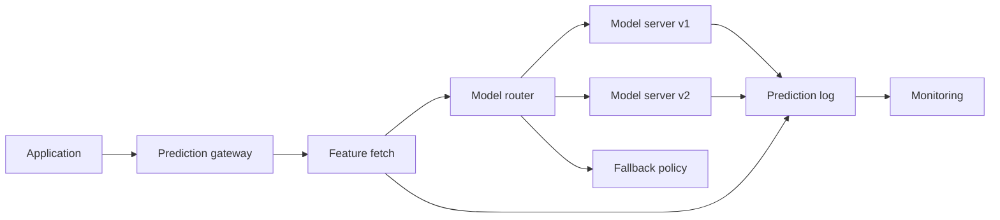
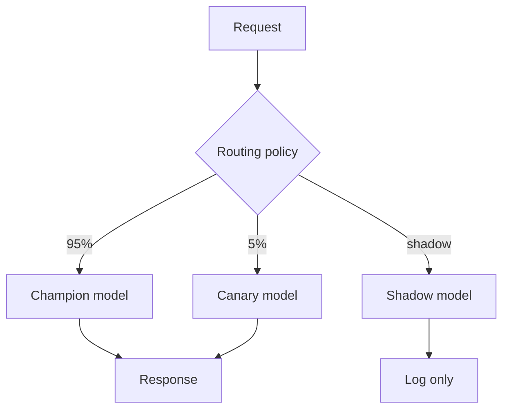
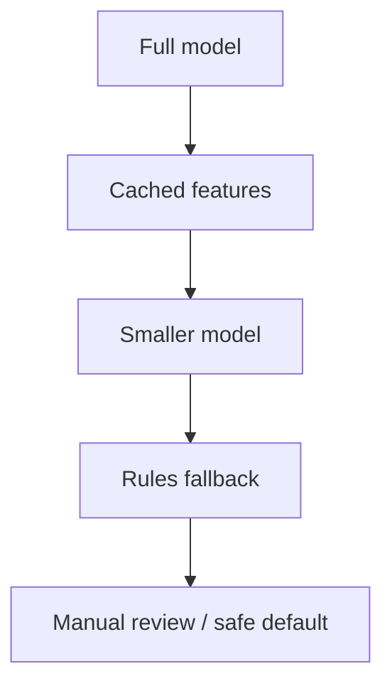

# Model Serving

## TL;DR

Model serving turns trained artifacts into production predictions. The design space is shaped by latency, throughput, model size, hardware, feature freshness, rollout safety, and observability. A good serving system can load model versions, route traffic, batch requests, enforce timeouts, explain failures, and roll back independently from application code.

> Serving is a production service, so the general patterns apply directly: [capacity planning](../01-foundations/10-capacity-planning.md) for the latency budget below, [retries, timeouts, and hedging](../06-scaling/10-retries-timeouts-hedging.md) for tail control, [deployment strategies](../15-deployment/01-deployment-strategies.md) for canary/blue-green, and [autoscaling](../06-scaling/08-auto-scaling.md) for capacity. LLM serving adds its own regime — continuous batching, KV caches, prefill/decode split — covered in [LLM Infrastructure](../17-llm-systems/05-llm-infrastructure.md).

---

## Serving Modes

| Mode | Latency | Throughput | Use case |
|---|---:|---:|---|
| Batch scoring | Minutes to hours | Very high | Daily recommendations, churn scores |
| Online synchronous | Milliseconds to seconds | Medium | Fraud, ranking, personalization |
| Online asynchronous | Seconds to minutes | High | Enrichment, review queues |
| Streaming inference | Milliseconds to seconds per event | High | Abuse detection, anomaly detection |
| Edge inference | Local | Device-bound | Offline apps, privacy-sensitive features |

---

## Serving Topologies

| Topology | Best for | Trade-off |
|---|---|---|
| Embedded model library | Ultra-low latency, simple models | Hard to update and observe centrally |
| Sidecar predictor | Service-local latency with separate model process | More deployment complexity |
| Central prediction service | Shared rollout, logging, governance | Network hop and shared dependency |
| Model mesh / multi-model server | Many models with common runtime | Noisy neighbors and routing complexity |
| Async scoring queue | Non-blocking enrichment | Delayed decisions and queue semantics |
| Batch scoring | Cheap high-throughput predictions | Staleness and invalidation |

The topology should follow the decision criticality. Fraud authorization usually needs online synchronous serving with strict fallback; daily marketing scores usually belong in batch.

---

## Online Serving Architecture



The prediction log is essential. It should capture request metadata, model version, feature values or references, prediction, latency, and later label joins.

---

## Prediction API Contract

The model server interface should be stable even as artifacts change.

```yaml
request:
  request_id: string
  entity_id: string
  model_name: string
  feature_refs: object
  context: object
response:
  model_version: string
  policy_version: string
  score: number
  decision: string
  confidence: number
  explanations_ref: string
  fallback_used: boolean
```

The response should include the model and policy version so downstream logs can reconstruct the decision. Returning only a score makes incident analysis painful.

---

## Latency Budget

```text
Total p99 budget: 100 ms

Network ingress       10 ms
Auth/routing           5 ms
Feature lookup        25 ms
Model inference       40 ms
Post-processing       10 ms
Logging/egress        10 ms
```

If feature lookup consumes the whole budget, optimizing the model will not fix the user experience. Budget each step before choosing serving hardware.

---

## Feature Fetch Patterns

| Pattern | Use when | Risk |
|---|---|---|
| Gateway fetches features | Need central logging and fallback | Gateway becomes a bottleneck |
| Model server fetches features | Model owns feature set | Hidden dependency fanout |
| Caller provides features | Caller already has context | Training-serving skew across callers |
| Precomputed feature vector | Tight p99 budget | Stale values |
| Two-pass fetch | Cheap features first, expensive only for likely positives | Complex logic and biased logs |

Feature fetch is often more fragile than inference. Treat the feature store as a dependency with its own SLO, timeout, and fallback.

---

## Model Versioning and Routing



Common routing policies:

- Champion/challenger: compare production model against candidate.
- Canary: send small live traffic to candidate and watch guardrails.
- Shadow: run candidate without affecting response.
- Segment routing: send a model to a region, tenant, device class, or risk tier.
- Fallback: route to simpler model or rules when the primary path fails.

---

## Batching

Batching improves throughput but can increase tail latency.

| Strategy | Strength | Risk |
|---|---|---|
| No batching | Predictable latency | Low hardware utilization |
| Fixed batch | Simple capacity planning | Waits for batch to fill |
| Dynamic batching | Better utilization under variable load | More complex p99 behavior |
| Continuous batching | High GPU utilization for large models | Scheduler complexity |

Use batching when the model is compute-heavy and requests can wait briefly. Avoid it for extremely tight latency budgets unless the serving framework gives strong p99 controls.

---

## Capacity Planning

Start with a simple estimate:

```text
required_workers =
  peak_qps * p99_inference_seconds / target_utilization
```

Then add headroom for:

- Feature-store latency spikes.
- Model load time and rolling deploy capacity.
- Canary/shadow traffic.
- Batch size variance.
- Accelerator memory fragmentation.
- Regional failover.

For GPU-backed serving, memory often limits capacity before raw compute does. Track maximum resident model memory, activation memory, and concurrent batch memory separately.

---

## Autoscaling

Autoscale on serving-specific signals, not only CPU:

- Request rate.
- Queue depth.
- Inference latency.
- GPU utilization and memory.
- Model load time.
- Feature lookup latency.
- Timeout rate.

Large models make scale-from-zero risky because cold start can take minutes. Keep warm capacity for latency-critical models.

---

## Degradation Ladder

Define fallback behavior before incidents.



Each step should be explicit about user impact. A "safe default" for fraud may be manual review; a "safe default" for recommendations may be popular content.

---

## Failure Modes

### Model Load Failure

A new artifact cannot be loaded because of incompatible runtime, missing dependency, wrong tensor shape, or corrupt artifact.

Mitigation: validate artifacts before promotion, use staged rollout, keep previous model loaded until the new model passes health checks.

### Feature Fetch Timeout

The model server is healthy but upstream feature retrieval fails.

Mitigation: enforce strict timeouts, define fallback features, use cached features when safe, and measure feature-store availability separately.

### Tail Latency Collapse

Average latency is fine, but p99 rises during bursts because queues grow faster than workers drain them.

Mitigation: queue limits, load shedding, admission control ([Backpressure](../06-scaling/07-backpressure.md)), separate pools for expensive models, and capacity tests at expected burst size.

### Silent Wrong Model

The service deploys a valid model artifact that belongs to the wrong dataset, segment, or feature schema.

Mitigation: require model cards or metadata checks, schema compatibility gates, artifact hashes, and model-version logging on every prediction.

---

## Deployment Patterns

| Pattern | Use when | Watch out for |
|---|---|---|
| Blue-green | Need fast rollback of whole model service | Double capacity |
| Canary | Want gradual live validation | Weak signal at low traffic |
| Shadow | Need compare without user impact | Shadow feature load can still affect dependencies |
| Multi-armed bandit | Optimization objective is measurable quickly | Can exploit short-term proxy metrics |
| Rules fallback | Model can fail open or fail closed safely | Rule path may drift from model path |

---

## Operational Metrics

| Layer | Metrics |
|---|---|
| Request | QPS, p50/p95/p99 latency, timeout rate, error rate |
| Queue | Queue depth, wait time, dropped requests |
| Model | Inference time, model load time, version, memory usage |
| Hardware | CPU/GPU utilization, GPU memory, accelerator errors |
| Features | Lookup latency, freshness, miss rate |
| Quality | Online guardrails, delayed labels, drift, calibration |

---

## Key Takeaways

1. Model serving is a production service with model-specific failure modes.
2. Roll out model artifacts independently from application code.
3. Prediction logs are required for monitoring, debugging, and retraining.
4. Batching improves throughput but must be managed against p99 latency.
5. Always design fallback behavior before deployment.

---

## References

1. [TensorFlow Serving: Flexible, High-Performance ML Serving](https://arxiv.org/abs/1712.06139)
2. [KServe Documentation](https://kserve.github.io/website/)
3. [MLflow Model Registry](https://mlflow.org/docs/latest/ml/model-registry/)
4. [Hidden Technical Debt in Machine Learning Systems](https://proceedings.neurips.cc/paper_files/paper/2015/file/86df7dcfd896fcaf2674f757a2463eba-Paper.pdf)
