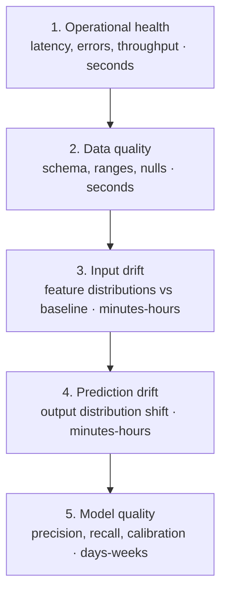
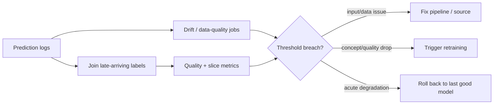

# Model Monitoring

## TL;DR

Model monitoring is observability for a system whose correctness is statistical and whose ground truth arrives late or never. The label pipeline that produces that ground truth is its own system-design problem; this file focuses on monitoring, while [Label and Ground-Truth Systems](./10-label-ground-truth-systems.md) covers label delay, selective labels, human review, and label-store correctness in depth. Unlike an ordinary service that fails by throwing errors, a degraded model fails *silently* — it returns confident, well-formed, wrong answers while every HTTP response is a 200. The job of monitoring is to make statistical degradation observable before it becomes a business incident. Because the only fully truthful signal — actual model quality — depends on labels that lag predictions by hours, days, or weeks, monitoring is structured as a *hierarchy of proxies*, each cheaper and faster but weaker than the next, from operational health down to data quality, input drift, prediction drift, and finally measured quality. The system's value is not the dashboards; it is the action path that turns a proxy signal into a rollback, a retrain, or an investigation.

> This is the model-quality complement to infrastructure observability. Pair it with [Metrics & Monitoring](../11-observability/02-metrics-monitoring.md) and [Alerting](../11-observability/04-alerting.md), express degradation budgets as [SLOs & Error Budgets](../11-observability/05-slos-error-budgets.md), and wire the action path into [Incident Management](../11-observability/07-incident-management.md). For LLM output quality specifically, see [LLM Evaluation](../17-llm-systems/10-llm-evaluation.md).

---

## The Defining Problem: Models Fail Silently

Ordinary software observability rests on a comforting assumption: when the system is wrong, it tends to *say so*. It throws an exception, returns a 500, breaches a latency budget, or fills a log with stack traces. The signal of failure is correlated with the failure itself, which is why a service can be monitored by watching its error rate.

A machine-learning system breaks this assumption at the root. A model that has silently degraded does not throw. It receives a well-formed request, runs the same matrix multiplications it always has, and returns a syntactically perfect prediction within its latency budget. Every operational metric is green. The only thing wrong is that the prediction is *worse than it used to be* — the fraud model now misses a class of attack, the recommender now ranks low-quality items higher, the credit model now systematically misprices a segment. The failure is invisible to any monitor that only watches whether the service is up.

This is the engineering implication that organizes everything else: **monitoring exists to make statistical degradation observable, because the system will not announce it.** A model's correctness lives in the *distribution* of its inputs and outputs and in the *relationship* between them, not in any single response. So the monitors must watch distributions and relationships over time, which is a fundamentally different discipline from counting errors. The hardest part is not computing a statistic; it is that the statistic you most want — "is the model still right?" — is the one you usually cannot compute yet.

---

## The Ground-Truth-Delay Problem

The reason model quality cannot be measured in real time is that the ground truth arrives late. A prediction is made at time T, but the outcome that would confirm or refute it is realized much later — and the gap defines what monitoring can and cannot see.

Consider the spread. A click-through model learns whether it was right within seconds; the user clicks or does not. A fraud model that approves a transaction may not learn it was wrong until a chargeback posts thirty to ninety days later. A credit-underwriting model may wait months or years for a loan to default. A content-recommendation model that optimizes long-term retention may *never* get a clean label at all, only noisy proxies. In each case the prediction is actionable immediately, but the truth that grades it is not.

The engineering consequence is severe: **you cannot alert on accuracy you do not yet have.** If a fraud model degrades today and the labels that would reveal it arrive in sixty days, then alerting on measured precision means discovering the problem two months and millions of dollars too late. A monitoring system that relies solely on ground-truth quality is, for any label-delayed domain, a system that detects fires by waiting for the insurance claim.

This forces the central architectural move of model monitoring: rely on **proxy signals that are available immediately** as early-warning surrogates for the quality you cannot yet measure. The prediction's *inputs* are available now. The prediction's *output distribution* is available now. Data quality is available now. None of these tells you directly that the model is wrong — but each is correlated with future quality, and each can fire in seconds instead of weeks. Monitoring is the art of assembling these surrogates into a ladder that gives you the earliest possible warning at the cost of certainty.

---

## The Monitoring Hierarchy: Layers of Proxies

The most useful way to think about a model-monitoring system is as a stack of five layers, ordered from cheapest-and-fastest to most-truthful-and-slowest. Each upper layer is a *weaker but earlier proxy* for the layer below it. The discipline is to instrument from the top down, because the top layers cost almost nothing and catch the most common failures, while the bottom layer is the only one that tells the whole truth — and arrives last.



**Layer 1 — Operational health.** Latency, error rate, throughput, fallback rate, feature-lookup miss rate. This is ordinary service observability, and it catches the failures that *do* announce themselves: a crashed feature store, a timed-out model server, a deployment that won't load. It says nothing about prediction quality, but it is free, instant, and the right first thing to wire up. A model that cannot respond cannot be wrong correctly.

**Layer 2 — Data quality at serving time.** Schema conformance, value ranges, null rates, enum validity on the *features as the model actually receives them*. This is the highest-leverage layer in practice, because the most common cause of sudden model degradation is not the model at all — it is an upstream pipeline that started sending nulls, changed a unit, or dropped a join. A feature that silently becomes 90% null will quietly destroy a model's predictions while every distribution looks superficially plausible. Validating inputs at the serving boundary catches these before they reach the model.

**Layer 3 — Input (feature) drift.** The features are individually valid, but their *distribution* has shifted relative to the data the current model was trained on. A new market launches, a marketing campaign changes the traffic mix, a sensor recalibrates. The model is now extrapolating into a region of input space it saw little of during training, which is where models silently lose skill. Input drift cannot prove the model is wrong, but it flags the conditions under which it is most likely to be.

**Layer 4 — Prediction (output) drift.** The distribution of the model's *outputs* has shifted — the average score rose, the class mix tilted, the confidence distribution narrowed. This is a strictly cheaper proxy than measured quality because it needs no labels, only the predictions you already log. Its ambiguity is its weakness: a prediction shift can mean the world changed (legitimate), the input changed (drift), or the model broke (degradation), and output drift alone cannot distinguish them.

**Layer 5 — Model quality.** Precision, recall, AUC, calibration, loss — computed once labels arrive and are joined back to the predictions that earned them. This is the only layer that tells the truth, and it is always the slowest. Everything above it exists to buy time against this layer's latency. The phrase "once labels arrive" hides a full subsystem: label maturity windows, unknown-vs-negative state, correction history, and joins back to prediction IDs. Those mechanics are covered in [Label and Ground-Truth Systems](./10-label-ground-truth-systems.md).

The engineering implication of the hierarchy is a budgeting rule: **instrument top-down, and never let a fast proxy permanently substitute for the slow truth.** Layers 1–2 should exist on day one for any model in production. Layers 3–4 are the early-warning system that justifies a monitoring platform. Layer 5 is the ground truth that, when it finally arrives, either vindicates or indicts everything the proxies guessed.

---

## The Drift Taxonomy and Why It Dictates the Response

"Drift" is used loosely, but the distinctions matter because each kind of drift demands a different engineering response. The cleanest framing decomposes the joint distribution of inputs `X` and labels `Y` and asks which part moved.

**Covariate drift (feature drift)** is a change in `P(X)` — the distribution of inputs shifts while the underlying input-to-label relationship `P(Y|X)` holds. The classic example is a model trained on one geography now serving traffic from another, or a seasonal shift in user behavior. The model is not *wrong* about the relationship; it is operating where it has thin evidence. The engineering implication is that covariate drift is detectable *immediately and without labels*, by comparing live feature distributions against the training baseline — which makes it the workhorse early-warning signal.

**Concept drift** is a change in `P(Y|X)` — the very relationship the model encodes has changed, even if the inputs look identical. Fraud is the canonical case: attackers adapt to the deployed model, so the same features that meant "legitimate" last month mean "fraud" this month. Concept drift is the most dangerous kind because it is *invisible to input monitoring* — the features can look perfectly stable while the model becomes systematically wrong. The engineering implication is sobering: concept drift can only be confirmed once labels arrive, which means for label-delayed domains it is detected last and hurts most. Prediction drift is the only pre-label hint, and a weak one.

**Label drift (prior probability shift)** is a change in `P(Y)` — the base rate of the target moved. A spam campaign spikes the fraction of spam; an economic downturn raises the default rate. Label drift breaks any model or threshold calibrated to the old base rate, and it interacts viciously with decision thresholds tuned for a prior that no longer holds. It is partly observable through prediction drift and fully observable once labels accrue.

| Drift type | What moved | Visible without labels? | Typical response |
|---|---|---|---|
| Covariate / feature | `P(X)` | Yes — compare features to baseline | Investigate traffic source; consider retrain on new region |
| Concept | `P(Y\|X)` | No — only weak prediction-drift hints | Retrain on fresh labels; tighten label collection |
| Label / prior | `P(Y)` | Partially via prediction drift | Recalibrate thresholds; reweight; retrain |

The practical lesson is that drift detection is not one monitor but a *triage vocabulary*. When an alert fires, the first useful question is "which distribution moved?" — because the answer points to a different fix: covariate drift points upstream to data and traffic, concept drift points to the labels and a retrain, label drift points to recalibration.

A production triage table should distinguish drift from ordinary pipeline breakage:

| Symptom | Likely class | Fastest confirming evidence | Typical first action |
|---|---|---|---|
| Null rate jumps from 1% to 80% on one feature | Pipeline break | Serving-time schema/null monitor | Fail over feature, rollback upstream change |
| Country mix changes after new market launch | Covariate drift | Traffic/source distribution, feature PSI by country | Add slice guardrail; retrain when labels mature |
| Score distribution rises but inputs look stable | Concept or label drift | Delayed labels, adversary/product change timeline | Tighten review, collect labels, retrain/recalibrate |
| Base positive rate doubles with similar ranking quality | Label/prior drift | Mature labels by time window | Recalibrate threshold, update cost policy |
| Offline metrics good, online quality bad immediately | Training/serving skew | Served feature vector replay against training path | Block rollout; fix feature parity |

---

## Drift Detection as Comparison Against a Versioned Baseline

A drift monitor is, mechanically, a comparison: it measures the distance between a *current window* of production data and a *reference baseline*, and alarms when the distance grows too large. Almost every subtle failure in drift detection traces back to a bad choice of baseline rather than a bad choice of statistic.

The baseline must be the distribution the **currently deployed model was trained on** — not last week's production traffic, not a rolling recent window. This is the critical tie to the rest of the ML platform: the training pipeline must *persist the statistical fingerprint of its training data as a versioned artifact*, and the monitoring system must compare against the fingerprint belonging to the model version actually serving traffic. When the model is retrained and redeployed, the baseline must roll forward with it. (This is the same versioning discipline that makes [feature stores](./02-feature-stores.md) treat a semantic change as a new feature name, and that makes [training pipelines](./05-training-pipelines.md) pin an immutable data snapshot.) A monitor that compares production against a stale or unversioned baseline produces the worst failure in the discipline — *baseline drift* — where the reference itself slowly tracks the degradation, so the distance never grows and the alarm never fires while the model rots.

The choice of statistic is secondary and well-trodden: population stability index and KL/Jensen-Shannon divergence for binned distributions, Kolmogorov-Smirnov for continuous features, simple category-share deltas for enums, and centroid or distance shifts for embeddings where per-dimension comparison is meaningless. Each has a known weakness, and the table below is a triage aid, not a recipe — the point of system design here is the plumbing (windowing, baselining, alerting), not the choice of test.

| Signal | Catches | Weakness |
|---|---|---|
| Null / default rate | Broken pipelines, dropped joins | Blind to semantic drift |
| PSI / JS divergence | Tabular distribution shift | Sensitive to binning choices |
| KS test | Continuous feature shifts | High traffic makes trivial shifts "significant" |
| Category-share delta | Enum / categorical shifts | Long tail is noisy |
| Embedding centroid shift | Representation drift for text/image | Hard to interpret or explain |
| Prediction distribution | Output behavior change | Cannot say whether input or model caused it |

Tooling has consolidated around exactly this comparison pattern: open-source **Evidently** and Google's **TensorFlow Data Validation** compute distribution distances against a reference schema, and managed platforms such as **Arize**, **Fiddler**, and **WhyLabs** productize baseline storage, windowed comparison, and slice-aware alerting. They differ in packaging, not in principle. The principle is always: *version the baseline, window the present, measure the distance, and make the alert actionable.*

A monitoring baseline should be a registry object, not an implicit dashboard setting:

```yaml
monitoring_baseline:
  baseline_id: fraud_classifier:v42.training_fingerprint
  model_version: fraud_classifier:v42
  dataset_snapshot: fraud_train:2026-05-31.7
  created_by_run: train_run_01J2...
  feature_fingerprints:
    amount_usd:
      type: continuous
      bins: [0, 10, 25, 50, 100, 250, 1000]
      histogram: [0.18, 0.22, 0.20, 0.16, 0.14, 0.10]
      null_rate: 0.001
    country:
      type: categorical
      top_values: { US: 0.62, JP: 0.11, GB: 0.08 }
      other_rate: 0.19
  prediction_fingerprint:
    score_bins: [0, 0.1, 0.2, 0.5, 0.8, 1.0]
    histogram: [0.52, 0.22, 0.18, 0.06, 0.02]
  slice_keys:
    - country
    - payment_method
    - new_customer
  valid_until_model_changes: true
```

This object lets monitoring answer "what should this model's inputs look like?" by following the active model pointer. A dashboard-configured baseline will eventually drift from reality because deploys move faster than dashboards.

---

## Training/Serving Skew as a First-Class Monitor

Drift is a change over *time*; skew is a discrepancy at a *single moment* between what the model trained on and what it serves on. Training/serving skew deserves its own monitor because it is both common and devastating, and because it masquerades as model failure when it is really a plumbing failure.

Skew arises when the feature a model receives in production differs from the feature it would have received during training, for the *same entity at the same time*. The usual culprit is a split implementation: training features computed by a batch job in SQL, serving features computed by a separate online path in application code, and the two drift apart in a unit, a default value, a rounding rule, or a timezone. The model is then asked to reason about inputs it never actually saw, and its production quality collapses even though offline evaluation looked excellent.

The strongest detection is direct: **log the exact feature vector served at decision time, and compare a sample of those served vectors against the values the training path would have produced for the same entities.** A nonzero skew rate on any feature is a defect, full stop. This is why the prediction log is the backbone of the entire monitoring system — it is the join key that lets every later analysis (drift, skew, quality, slices) reconstruct what the model actually saw. The architectural antidote, where affordable, is to compute training and serving features from a *single shared definition* so skew is structurally impossible; the monitor exists to catch the cases where that ideal is not yet reached.

---

## Why Alerting on Statistical Signals Is Hard

Operational alerting has it easy: error rate crosses 1%, page someone. Statistical alerting is harder in a way that determines whether the monitoring system gets used or ignored, and the difficulty is intrinsic, not a tooling gap.

The first problem is **noise**. Distribution distances jitter constantly from sampling variation alone. A KS test on a high-traffic model will flag a "statistically significant" shift from a difference so small it has no effect on predictions, because with millions of samples *everything* is significant. Statistical significance is not engineering significance, and a monitor that pages on every significant shift pages constantly.

The second problem is **seasonality**. Real input distributions breathe with the day, the week, and the holiday calendar. Traffic at 3 a.m. genuinely differs from traffic at noon; December genuinely differs from July. A naive monitor reads these legitimate rhythms as drift and cries wolf on schedule, training the on-call to ignore it.

The third problem is **alert fatigue**, which is the consequence of the first two and the death of the whole system. A drift dashboard that fires a dozen low-confidence alerts a day is a dashboard no one reads, and a monitor that is ignored is worse than no monitor because it created the illusion of coverage.

The engineering response is to make alerts *actionable rather than merely true*. Three disciplines do most of the work. First, **tie severity to impact, not to statistics** — page only when a signal is both significant *and* plausibly consequential, and route everything else to a review queue instead of a pager. Second, **borrow burn-rate alerting from SLO practice** ([SLOs & Error Budgets](../11-observability/05-slos-error-budgets.md)): alert on the *rate and persistence* of degradation against a budget, so a brief blip is tolerated and a sustained slide pages fast. Third, **compare against seasonal baselines** — same-hour-last-week rather than a flat reference — so the monitor stops mistaking the daily rhythm for a problem. The table below sketches a severity model; the organizing idea is that most statistical signals should *inform*, and only a few should *page*.

| Signal | Page? | Response |
|---|---|---|
| Serving error rate high | Yes | Restore availability |
| Critical feature freshness SLO missed | Yes | Fail over or disable the model |
| Sharp prediction-distribution shift | Usually no | Investigate in business hours unless tied to impact |
| Sustained quality metric below guardrail | Sometimes | Roll back or reduce traffic |
| Business KPI regression in a canary | Yes for critical flows | Stop the rollout |

A concrete routing matrix prevents every statistical anomaly from becoming a pager:

| Alert | Severity | Route | Auto-action |
|---|---|---|---|
| Model endpoint p99 or error SLO burn | Sev2/Sev3 | Serving on-call | Scale, shed, or rollback deployment |
| Required feature freshness breached | Sev2 for high-risk, ticket for low-risk | Feature owner + model owner | Use fallback feature/model if configured |
| Data contract violation at serving boundary | Sev2 | Upstream data owner + model owner | Block requests or fail closed depending on risk |
| Input drift high, no quality labels yet | Ticket / review queue | Model owner | Freeze rollout; start investigation |
| Guardrail slice quality below threshold | Sev2 for high-risk | Model owner + risk owner | Roll back or route slice to fallback |
| Canary business KPI regression | Sev2 | Experiment owner + deploy owner | Stop canary ramp |
| Appeal or complaint spike | Sev1/Sev2 depending harm | Risk/governance + model owner | Freeze automated action, route to human review |

The key is that every alert names an owner and a first action. "Drift detected" without owner, model version, baseline, affected slices, and suggested action is not an alert; it is a chart annotation.

---

## Slice-Based Monitoring: Aggregates Hide Regressions

An aggregate metric is an average, and averages conceal exactly the failures that matter most. A model can hold its overall precision flat while a specific segment — a country, a device type, a language, a tenant, a new-user cohort — degrades badly, because the healthy majority masks the suffering minority. This is Simpson's paradox as an operational hazard: the top-line number says "fine" while the system is actively failing the users you can least afford to fail.

The engineering implication is that monitoring must be **sliced along the dimensions where regressions are both likely and costly**, and those slices must be chosen deliberately rather than discovered after an incident. The standard cuts are geography, device and platform, language, customer tenant, traffic source, and — where legally and ethically appropriate — protected classes, because a model that degrades on a protected segment is not merely a quality bug but a fairness and compliance failure. Slice monitoring is more expensive than aggregate monitoring: each slice needs enough traffic to compute a stable metric, and naively slicing every dimension explodes combinatorially. The discipline is to pre-register the slices that carry real risk, set per-slice guardrails, and accept that the cheapest place to discover a per-segment regression is a dashboard, while the most expensive place is a regulator's letter.

---

## The Feedback Loop: Monitoring Triggers Retraining

Monitoring is not an end in itself; in a mature ML platform it is the *trigger* for the system's corrective action. The clearest version of this is triggered retraining: a drift or quality signal crossing a threshold fires a retrain of the model on fresh data, closing the loop between detection and repair. This is precisely the *triggered retraining* strategy described in [Training Pipelines](./05-training-pipelines.md) — retraining driven by observed change rather than by the calendar.



The critical discipline, carried over from the retraining-automation argument, is that **the loop must be only as automatic as its safety nets are trustworthy.** A monitoring signal wired directly to an unsupervised retrain-and-deploy loop is a mechanism for converting a noisy alert or a corrupted data partition into a fast, automated production incident. The strength of the trigger should match the maturity of the validation, canary, and rollback machinery downstream of it. For most systems the right wiring is: monitoring detects, a human confirms, the pipeline retrains under promotion gates, and an automatic rollback stands ready if the new model regresses. Monitoring earns the right to trigger fully-automated action only after it has demonstrated that its signals are clean and its rollback is fast.

---

## Label-Delay Monitoring Contract

Because quality metrics depend on late labels, the label pipeline itself must be monitored. Otherwise the dashboard can confuse "model quality is stable" with "labels stopped arriving."

```yaml
label_monitoring_contract:
  prediction_stream: fraud_predictions:v4
  label_stream: chargeback_labels:v6
  join_key: prediction_id
  maturity_windows:
    early_proxy: 1d
    primary_label: 60d
    final_label: 120d
  expected_label_coverage:
    1d: 0.15
    60d: 0.92
    120d: 0.98
  unknown_state: label_pending       # not negative
  correction_policy:
    allow_label_updates_until: 120d
    preserve_history: true
  quality_metrics:
    - precision_at_review_capacity
    - recall_at_fixed_fpr
    - calibration_by_score_decile
  alerting:
    coverage_drop_threshold: 5pp
    join_failure_threshold: 0.5pp
    delayed_label_backlog_threshold: 24h
```

The `unknown_state` field is load-bearing. Treating missing labels as negatives is a silent metric corruption that makes a model appear better or worse depending on the domain. A mature monitoring platform tracks label coverage, label age, join failures, corrections, and labeler/system outages alongside model quality.

A useful label-delay dashboard separates three curves:

```text
predictions made      ─── how much volume needs labels
labels matured        ─── how much truth has arrived
metric computed on    ─── which prediction cohorts are now trustworthy
```

If the first curve grows and the second stalls, the incident is in the label system, not necessarily the model.

---

## Drift Triage Runbook

When a drift or quality alert fires, the first response should be diagnosis, not retraining. Retraining on corrupted or unexplained data often bakes the incident into the next model.

1. **Identify the exact model and baseline.** Confirm active model version, baseline fingerprint, window, slices, and alert statistic. If the baseline is not tied to the active model, fix observability before acting on the alert.
2. **Check serving and feature health.** Look for deploys, feature freshness misses, schema violations, null/default spikes, cache regressions, and feature-store latency.
3. **Localize the shift.** Determine whether the alert is global or isolated to a slice such as country, tenant, device, traffic source, or new users.
4. **Separate data movement from model degradation.** Compare input drift, prediction drift, and any matured labels. Stable inputs with falling quality points toward concept drift or label changes; broken inputs point upstream.
5. **Check experiment and rollout context.** A canary, marketing campaign, new market launch, or policy change may legitimately move distributions. Legitimate does not mean safe; it changes the response.
6. **Choose containment.** Options include freezing rollout, routing a slice to fallback, lowering automation, increasing human review, rolling back model/policy, or disabling a broken feature.
7. **Decide whether retraining is valid.** Retrain only if the new data is correct, labels are sufficiently mature, and the promotion gate can evaluate the candidate honestly.
8. **Write back the lesson.** Add or tune a data contract, baseline, slice monitor, label monitor, or promotion gate so the next occurrence is caught earlier.

This runbook turns monitoring from "dashboard says drift" into an operational decision tree with owners and safe actions.

---

## A Cautionary Case: Zillow Offers

The starkest illustration of unmonitored model degradation meeting business reality is Zillow's iBuying business, Zillow Offers, shut down in **November 2021**. Zillow used pricing models to make automated cash offers on homes, buy them, and resell at a margin. When the housing market's dynamics shifted, the models' price forecasts drifted away from realized sale prices — a textbook collision of covariate drift (a changing market) and concept drift (the input-to-price relationship moving) in a domain where the ground-truth label, the actual resale price, arrives months after the buy decision.

The result was that Zillow systematically overpaid for homes faster than any feedback could correct it. The company wrote down roughly **$304 million** in inventory, announced it would wind down the unit, and cut about **2,000 jobs — a quarter of its workforce**. The engineering lesson is not that the model was poorly built; it is that a confident model operating in a shifted regime, with a long ground-truth delay and an automated action loop spending real money on every prediction, is exactly the configuration this entire document is about. The failure was silent in the only way that matters: every prediction was a well-formed number, and the numbers were wrong in the same direction for long enough to threaten the business. Proxy monitoring — watching input drift and prediction drift against a versioned baseline, and throttling the automated action when they diverged — exists precisely to catch this class of failure before the labels arrive to confirm it.

---

## Failure Modes

The characteristic failures of model monitoring recur across organizations, and naming them is most of preventing them.

**Silent degradation** is the root failure the whole discipline addresses: the model gets worse while every operational metric stays green, because a degraded model returns confident, well-formed, wrong answers. The defense is the proxy hierarchy — input and prediction drift give a pre-label warning that operational monitoring never will.

**Label-delay masking** is silent degradation's accomplice: because the truthful quality metric lags, a model can fail for weeks before measured accuracy reflects it. The defense is to never rely on quality alone — treat proxies as the early-warning system and reserve measured quality for confirmation, not first detection.

**Baseline drift** is the monitor that defeats itself: when the reference distribution is a rolling recent window instead of a versioned training fingerprint, the baseline tracks the degradation and the distance never grows. The defense is to version the baseline to the deployed model and roll it forward only on retrain.

**Alert fatigue** is the social failure mode: noisy, seasonal, statistically-significant-but-meaningless alerts train the on-call to ignore the dashboard, so the one real alert is missed in the flood. The defense is impact-based severity, seasonal baselines, burn-rate alerting, and routing low-confidence signals to a review queue instead of a pager.

**Slice masking (Simpson's paradox)** is the aggregate that lies: top-line quality holds while a critical segment fails underneath it. The defense is pre-registered slice monitoring with per-segment guardrails.

**Training/serving skew** is the plumbing failure that imitates a model failure: the served feature differs from the trained feature, so a model that evaluated perfectly offline collapses online. The defense is to log served feature vectors and compare them against the training path, or better, to compute both from one shared definition.

---

## Decision Framework

When monitoring budget is limited — and it always is — the order of instrumentation should follow the proxy hierarchy, because that order maximizes failures-caught-per-dollar.

Start with **operational health and serving-time data quality.** These are cheap, instant, and catch the single most common cause of sudden degradation: an upstream pipeline that broke. A model with no monitoring at all should get layers 1 and 2 first, before any drift statistic.

Add **prediction-drift and input-drift monitors against a versioned training baseline** next. These are the early-warning system that justifies a monitoring platform, and they are the only signals available before labels arrive in a label-delayed domain. Get the baseline versioning right or the monitors are theater.

Add **training/serving skew detection** as soon as features are computed by separate training and serving paths, because skew is common, devastating, and invisible to every other monitor.

Add **slice-based quality monitoring** for the segments that carry real business or fairness risk, accepting the extra cost because aggregate metrics will hide exactly these regressions.

Finally, **close the loop to retraining and rollback** — but only as automatically as your validation, canary, and rollback can keep safe. Monitoring that produces a beautiful dashboard and no action path has solved the easy half of the problem and skipped the half that matters.

A monitoring system that answers these in order is observable where it counts, warned early where ground truth is slow, and wired to act. One that watches only whether the service is up is watching the wrong thing entirely.

---

## Key Takeaways

1. A degraded model fails silently — confident, well-formed, wrong answers while every operational metric is green. Monitoring exists to make that statistical degradation observable.
2. Ground truth arrives late or never, so monitoring must lean on immediate proxy signals rather than waiting for measured accuracy.
3. Structure monitoring as a hierarchy: operational health, data quality, input drift, prediction drift, then model quality — each a cheaper, faster, weaker proxy for the next. Instrument top-down.
4. The drift taxonomy dictates the response: covariate drift points upstream, concept drift points to retraining and is invisible without labels, label drift points to recalibration.
5. Drift detection is a comparison against a *versioned training baseline*; an unversioned or rolling baseline silently tracks the degradation and never fires.
6. Training/serving skew is a first-class monitor — log served feature vectors and compare them to the training path, or compute both from one definition.
7. Alerting on statistical signals is hard because of noise, seasonality, and fatigue; make alerts actionable by tying severity to impact and using burn-rate and seasonal baselines.
8. Label coverage and maturity must be monitored separately; missing labels are not negative labels.
9. Aggregate metrics hide per-segment regressions; pre-register and monitor the slices that carry real business and fairness risk.
10. Monitoring is the trigger for retraining and rollback, but the loop must be only as automatic as its safety nets are trustworthy.
11. A drift runbook should diagnose baseline, feature health, slices, labels, and rollout context before retraining.
12. Zillow Offers (Nov 2021, ~$304M write-down) shows the cost of an automated, label-delayed model degrading silently in a shifted regime — exactly what proxy monitoring is meant to catch.

---

## References

1. [Hidden Technical Debt in Machine Learning Systems](https://proceedings.neurips.cc/paper_files/paper/2015/file/86df7dcfd896fcaf2674f757a2463eba-Paper.pdf) — Sculley et al., 2015
2. [Data Validation for Machine Learning](https://mlsys.org/Conferences/2019/doc/2019/167.pdf) — Breck et al., 2019
3. [TFX: A TensorFlow-Based Production-Scale Machine Learning Platform](https://dl.acm.org/doi/10.1145/3097983.3098021) — Baylor et al., 2017
4. [Rules of Machine Learning: Best Practices for ML Engineering](https://developers.google.com/machine-learning/guides/rules-of-ml) — Zinkevich
5. [Evidently: Open-Source ML Monitoring Documentation](https://docs.evidentlyai.com/)
6. [Arize AI: ML Observability Concepts](https://arize.com/ml-observability/)
7. [Zillow to wind down Zillow Offers (Q3 2021 shareholder letter)](https://www.zillowgroup.com/news/zillow-to-wind-down-zillow-offers-operations/) — November 2021
