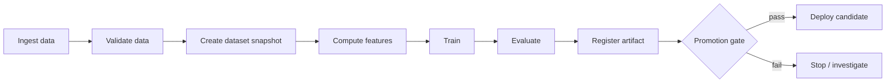
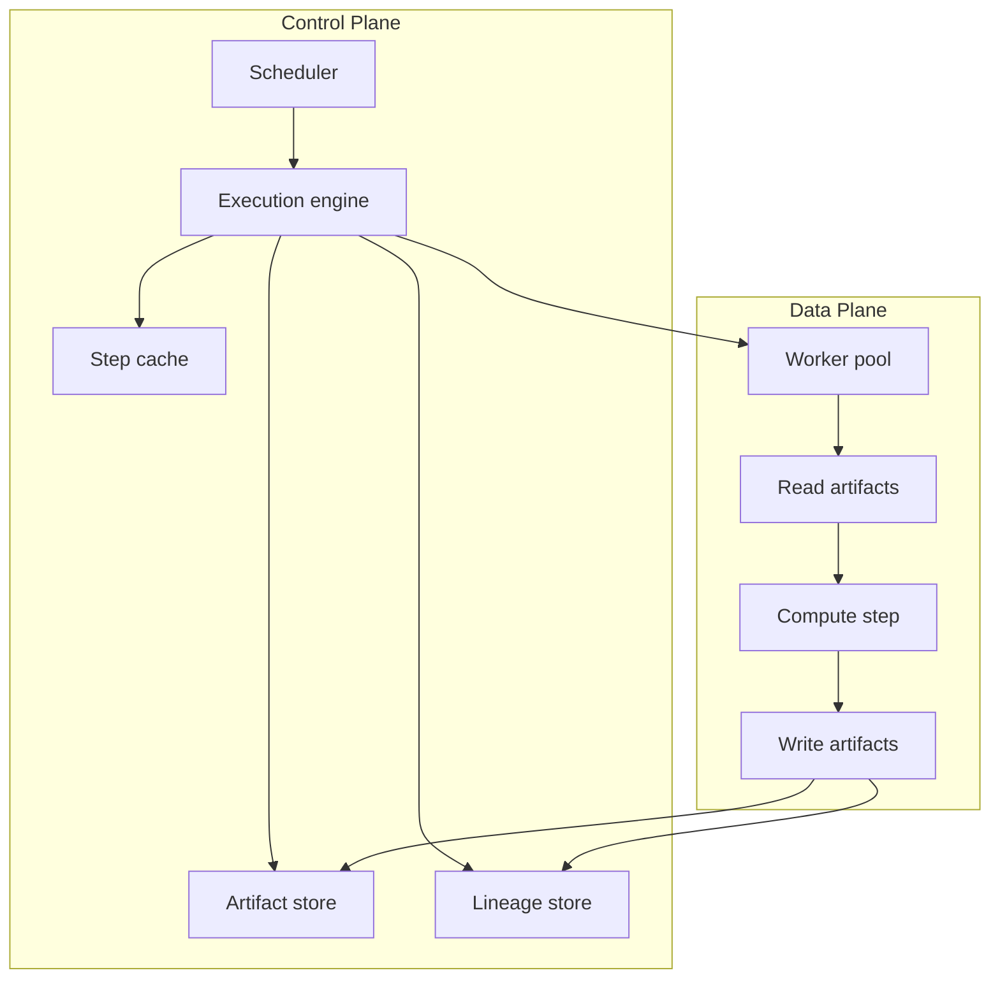
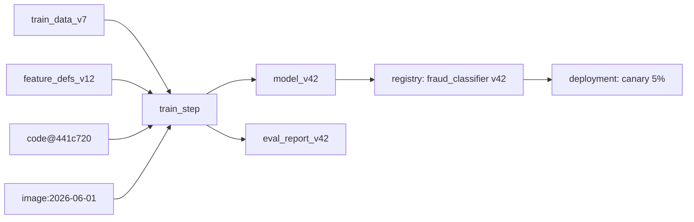
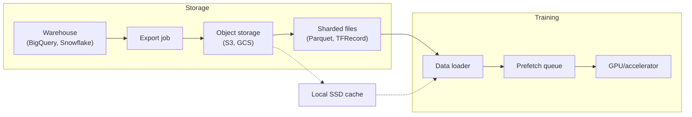
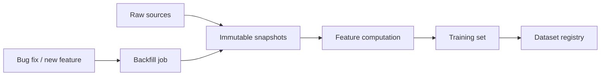
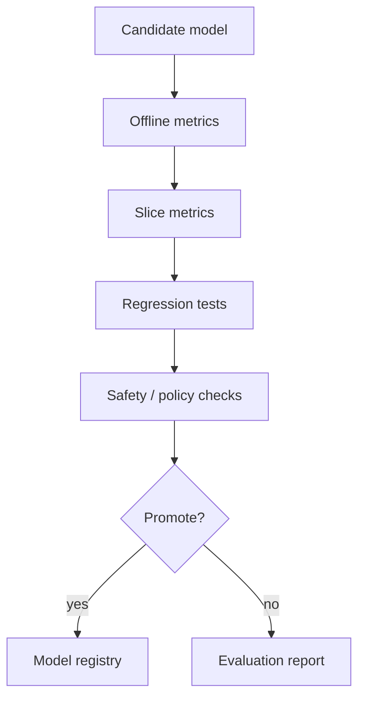
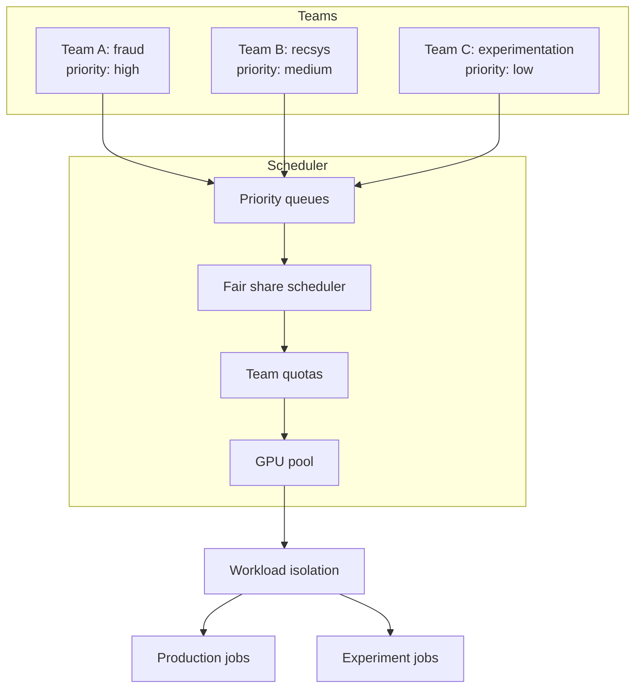
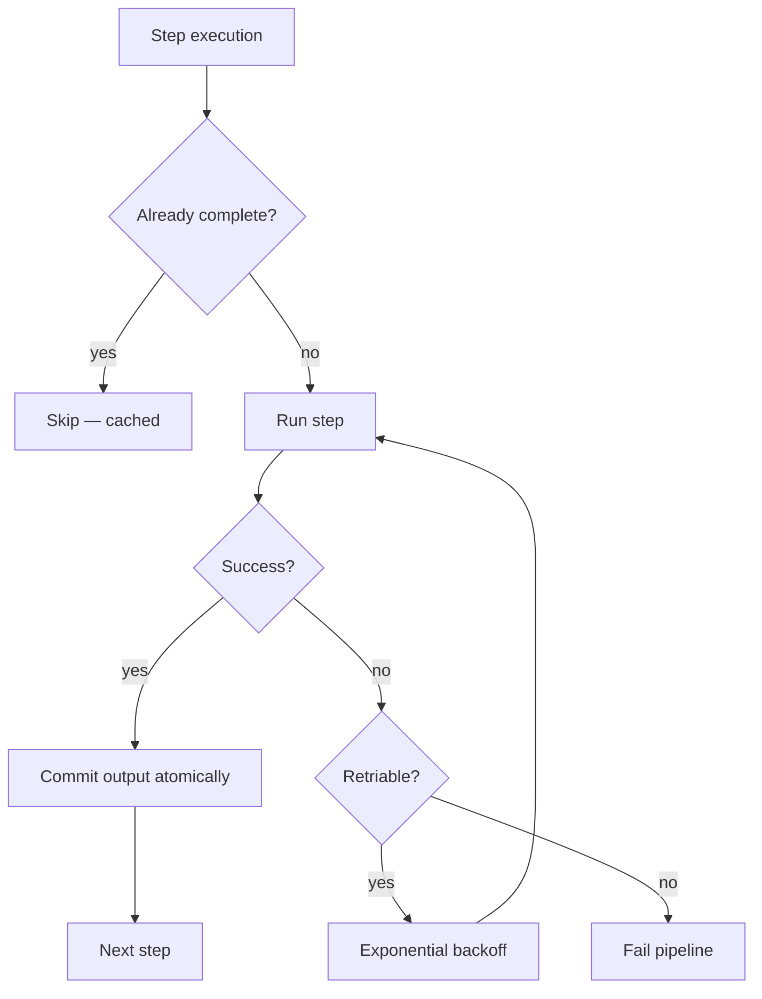

# Training Pipelines

## TL;DR

Training pipelines turn raw data into reproducible model artifacts. A production pipeline must version inputs, validate data, build point-in-time datasets, train, evaluate, register artifacts, and gate promotion. Reproducibility is the central reliability requirement: a team should be able to explain what data, code, features, parameters, and environment produced a model.

---

## Pipeline Shape



Each edge should carry metadata: dataset version, code version, feature definitions, parameters, artifact hash, and evaluation report.

A training pipeline is a [batch data pipeline](../13-data-pipelines/01-batch-processing.md) with a model at the end: it wants the same [workflow orchestration](../17-llm-systems/02-orchestration-patterns.md) discipline, [idempotent](../01-foundations/08-idempotency.md) re-runnable steps, and snapshot-based reproducibility that any derived-data system needs.

### Pipeline DSLs: TFX vs Kubeflow vs Airflow

Training pipelines are defined declaratively using a domain-specific language (DSL) that compiles to an orchestrator's execution graph. The DSL enforces pipeline structure, artifact lineage, and step caching — the orchestrator handles scheduling, retries, and resource allocation.

```python
# ── TFX DSL (TensorFlow Extended) ──────────────────────────
# Each component is a reusable, type-checked pipeline stage.
# Artifacts are typed and lineage is tracked automatically.
from tfx import components
from tfx.orchestration import pipeline
from tfx.orchestration.kubeflow import kubeflow_dag_runner

def create_pipeline(pipeline_name: str, pipeline_root: str, data_root: str,
                    module_file: str, serving_model_dir: str) -> pipeline.Pipeline:
    """Define a TFX pipeline declaratively."""

    # ExampleGen: ingest and split data
    example_gen = components.CsvExampleGen(input_base=data_root)

    # StatisticsGen: compute summary statistics for validation
    statistics_gen = components.StatisticsGen(examples=example_gen.outputs["examples"])

    # SchemaGen: infer schema from statistics
    schema_gen = components.SchemaGen(statistics=statistics_gen.outputs["statistics"])

    # ExampleValidator: check for anomalies against schema
    example_validator = components.ExampleValidator(
        statistics=statistics_gen.outputs["statistics"],
        schema=schema_gen.outputs["schema"],
    )

    # Transform: feature engineering (shared between training and serving)
    transform = components.Transform(
        examples=example_gen.outputs["examples"],
        schema=schema_gen.outputs["schema"],
        module_file=module_file,  # user-defined preprocessing_fn
    )

    # Trainer: train the model
    trainer = components.Trainer(
        module_file=module_file,  # user-defined run_fn
        examples=transform.outputs["transformed_examples"],
        transform_graph=transform.outputs["transform_graph"],
        schema=schema_gen.outputs["schema"],
        train_args=components.TrainArgs(num_steps=10000),
        eval_args=components.EvalArgs(num_steps=5000),
    )

    # Evaluator: validate model quality and blessing
    evaluator = components.Evaluator(
        examples=example_gen.outputs["examples"],
        model=trainer.outputs["model"],
        baseline_model=None,  # or previous champion for regression check
        eval_config=components.EvalConfig(
            model_specs=[components.ModelSpec(label_key="label")],
            metrics_specs=components.MetricsSpecs(
                metrics=[
                    components.MetricConfig(class_name="AUC"),
                    components.MetricConfig(class_name="FalsePositiveRate"),
                ],
                thresholds={
                    "AUC": components.MetricThreshold(
                        value_threshold=components.GenericValueThreshold(
                            lower_bound={"value": 0.75}
                        )
                    ),
                },
            ),
        ),
    )

    # Pusher: if blessed, push to serving
    pusher = components.Pusher(
        model=trainer.outputs["model"],
        model_blessing=evaluator.outputs["blessing"],
        push_destination=components.PushDestination(
            filesystem=components.FilesystemDestination(
                base_directory=serving_model_dir
            )
        ),
    )

    return pipeline.Pipeline(
        pipeline_name=pipeline_name,
        pipeline_root=pipeline_root,
        components=[
            example_gen, statistics_gen, schema_gen, example_validator,
            transform, trainer, evaluator, pusher,
        ],
    )
```

```python
# ── Kubeflow Pipelines DSL (KFP v2) ────────────────────────
# Decorator-based: mark Python functions as pipeline steps.
# The KFP compiler turns the decorated graph into an Argo workflow.
from kfp import dsl, compiler
from kfp.dsl import Input, Output, Dataset, Model, Metrics, Artifact

@dsl.component(
    base_image="python:3.11",
    packages_to_install=["pandas", "pyarrow", "scikit-learn"],
)
def validate_data(dataset: Input[Dataset], report: Output[Artifact]) -> bool:
    """Validate schema, distributions, and freshness."""
    import pandas as pd
    df = pd.read_parquet(dataset.path)
    # ... validation logic ...
    report.metadata["rows_checked"] = len(df)
    report.metadata["passed"] = True
    return True

@dsl.component(
    base_image="python:3.11",
    packages_to_install=["xgboost", "scikit-learn", "pandas"],
)
def train_model(
    train_data: Input[Dataset],
    model: Output[Model],
    metrics: Output[Metrics],
    max_depth: int = 6,
    learning_rate: float = 0.05,
    n_estimators: int = 500,
):
    """Train an XGBoost model and output metrics."""
    import xgboost as xgb
    import pandas as pd
    from sklearn.metrics import roc_auc_score

    df = pd.read_parquet(train_data.path)
    X, y = df.drop("label", axis=1), df["label"]

    clf = xgb.XGBClassifier(
        max_depth=max_depth, learning_rate=learning_rate,
        n_estimators=n_estimators, random_state=42,
    )
    clf.fit(X, y)

    metrics.log_metric("auc", roc_auc_score(y, clf.predict_proba(X)[:, 1]))
    metrics.log_metric("n_features", X.shape[1])

    import joblib
    joblib.dump(clf, model.path)

@dsl.pipeline(
    name="fraud-training-pipeline",
    description="Daily fraud model training with validation and promotion gates",
)
def fraud_training_pipeline(
    snapshot_date: str = "2026-06-10",
    label_window_days: int = 30,
    max_depth: int = 6,
    learning_rate: float = 0.05,
    n_estimators: int = 500,
):
    # Step 1: Ingest snapshot
    ingest_op = dsl.importer(
        artifact_uri=f"gs://ml-data/fraud/snapshots/{snapshot_date}/",
        artifact_class=Dataset,
    )

    # Step 2: Validate
    validation_op = validate_data(dataset=ingest_op.output)

    # Step 3: Train (only if validation passes)
    train_op = train_model(
        train_data=ingest_op.output,
        max_depth=max_depth,
        learning_rate=learning_rate,
        n_estimators=n_estimators,
    )
    train_op.after(validation_op)

    # Step 4: Evaluate (slices, guardrails, regression vs baseline)
    evaluate_op = evaluate_model(
        test_data=ingest_op.output,
        model=train_op.outputs["model"],
        baseline_model_version="v41",
    )

    # Step 5: Promotion gate — automated, with optional manual approval
    promote_op = promotion_gate(
        evaluation=evaluate_op.outputs["report"],
        guardrails={
            "auc_roc_min": 0.90,
            "false_positive_rate_max": 0.02,
            "slice_regression_max": 0,  # no slice can degrade
        },
        risk_tier="high",  # fraud = requires human approval
    )

    # Step 6: Register (only if promotion gate passes)
    register_op = register_model(
        model=train_op.outputs["model"],
        metrics=train_op.outputs["metrics"],
        evaluation=evaluate_op.outputs["report"],
    )
    register_op.after(promote_op)


# Compile to Argo workflow YAML for execution on Kubernetes
compiler.Compiler().compile(fraud_training_pipeline, "fraud_training_pipeline.yaml")
```

```python
# ── Airflow DAG ─────────────────────────────────────────────
# More imperative, but widely adopted and well-integrated with
# the rest of the data platform (Spark, dbt, Fivetran, etc.)

from airflow import DAG
from airflow.operators.python import PythonOperator
from airflow.operators.empty import EmptyOperator
from airflow.utils.dates import days_ago
from datetime import timedelta

default_args = {
    "owner": "ml-fraud",
    "retries": 1,
    "retry_delay": timedelta(minutes=5),
    "email_on_failure": True,
}

with DAG(
    dag_id="fraud_model_training",
    default_args=default_args,
    schedule_interval="0 6 * * *",  # daily at 6am
    start_date=days_ago(30),
    catchup=False,
    tags=["ml", "fraud", "critical"],
) as dag:

    start = EmptyOperator(task_id="start")

    ingest = PythonOperator(
        task_id="ingest_data",
        python_callable=ingest_data,
        op_kwargs={"snapshot_date": "{{ ds }}", "label_window_days": 30},
    )

    validate = PythonOperator(
        task_id="validate_data",
        python_callable=validate_dataset,
        op_kwargs={"expectations_suite": "fraud_training"},
    )

    train = PythonOperator(
        task_id="train_model",
        python_callable=train_model,
        op_kwargs={"model_type": "xgboost", "hyperparameters": {"max_depth": 6}},
    )

    evaluate = PythonOperator(
        task_id="evaluate_model",
        python_callable=evaluate_model,
        op_kwargs={"baseline_version": "v41", "slices": ["geography", "device"]},
    )

    promote = PythonOperator(
        task_id="promotion_gate",
        python_callable=promotion_gate,
        op_kwargs={"risk_tier": "high", "requires_approval": True},
    )

    register = PythonOperator(
        task_id="register_artifact",
        python_callable=register_model,
    )

    start >> ingest >> validate >> train >> evaluate >> promote >> register
```

### DSL Trade-offs

| DSL | Strength | Weakness |
|---|---|---|
| TFX | Strong typing for ML artifacts; built-in data validation, schema inference, and evaluation gates; transform graph shared between training and serving | TensorFlow-centric (though extensible); steeper learning curve; heavier deployment |
| Kubeflow Pipelines v2 | Kubernetes-native; decorator-based; any Python library; artifact passing and caching built in; good UI for DAG visualization and lineage | Requires K8s cluster; component I/O can be slow for large artifacts; version drift between SDK and platform |
| Airflow | Mature ecosystem; integrates with the rest of the data stack (dbt, Spark, Fivetran); rich scheduling and retry semantics | DAGs are Python, not declarative ML; no built-in ML artifact typing or lineage; PythonOperator means you bring your own version of everything |
| Metaflow (Netflix) | Designed for ML workflows; first-class step caching, artifact tracking, and resume; local-to-cloud portability | Less adoption outside Netflix; smaller community; opinionated data flow model |

The common thread: all of them compile a DAG of idempotent steps, each producing versioned artifacts, with the orchestrator handling scheduling, retries, and dependency resolution. The choice between them is usually driven by infrastructure (are you on K8s already?), existing orchestration (does the data team use Airflow?), and ML framework coupling (are you in the TFX ecosystem?).

### Execution Engine Architecture

The DSL compiles to an execution graph, but the execution engine is what actually runs it. This is where the system design lives.



| Component | Responsibility | Failure mode when weak |
|---|---|---|
| Scheduler | Decide when steps run, resolve dependencies | Starvation, deadlock, missed SLAs |
| Execution engine | Dispatch steps to workers, collect results | Lost work, zombie steps, double execution |
| Step cache | Skip recomputation when inputs unchanged | Cache invalidation bugs, stale results |
| Artifact store | Persist step outputs with content addressing | Lost artifacts, corruption, no lineage |
| Lineage store | Record which inputs produced which outputs | Untraceable models, no rollback path |
| Worker pool | Run the actual compute | Noisy neighbors, resource exhaustion |

### Step Caching and Content Addressing

The single biggest efficiency lever in a training pipeline is skipping work that's already been done. A step's output is reusable only if its inputs are identical.

```python
import hashlib
import json
import os

def step_cache_key(step_name, inputs, code_version, environment, parameters):
    """
    Content-addressed cache key for a pipeline step.
    Same inputs + code + env + params → same key → cache hit.
    """
    # Hash inputs by content, not by path — paths can change
    input_hashes = {}
    for name, artifact in inputs.items():
        input_hashes[name] = artifact.content_hash  # SHA256 of bytes

    key_material = {
        "step": step_name,
        "inputs": input_hashes,
        "code": code_version,        # git commit
        "env": environment,           # container image digest
        "params": parameters,
    }
    return hashlib.sha256(
        json.dumps(key_material, sort_keys=True).encode()
    ).hexdigest()

def run_step_with_cache(step_fn, step_name, inputs, code_version,
                         environment, parameters, cache_dir):
    """Run a step, or return cached output if inputs are unchanged."""
    key = step_cache_key(step_name, inputs, code_version, environment, parameters)
    cache_path = os.path.join(cache_dir, f"{key}.tar")

    if os.path.exists(cache_path):
        print(f"CACHE HIT: {step_name} ({key[:8]})")
        return load_artifact(cache_path)

    print(f"CACHE MISS: {step_name} ({key[:8]}) — executing")
    output = step_fn(**inputs, **parameters)
    save_artifact(cache_path, output)
    return output
```

Cache invalidation is the hard part. Common bugs:

- **Path-based keys** instead of content-based: renaming a file invalidates nothing but breaks reproducibility.
- **Missing code version**: a function change isn't picked up because the cache key didn't include the commit.
- **Missing environment**: a numpy upgrade changes floating-point behavior, but the cache returns the old result.
- **Non-deterministic steps**: a step that reads "latest" data or uses wall-clock time can never be cached.

### Lineage Store Design

The lineage store answers: "given this model artifact, what produced it?" It's a DAG of artifacts and steps, queryable backwards (provenance) and forwards (impact analysis).

```python
# Lineage record for a single step execution
lineage_record = {
    "execution_id": "exec_abc123",
    "step_name": "train_model",
    "started_at": "2026-06-10T06:15:00Z",
    "finished_at": "2026-06-10T08:30:00Z",
    "status": "succeeded",

    # Inputs: artifacts consumed by this step
    "inputs": [
        {"artifact_id": "art_train_data_v7", "version": "sha256:abc..."},
        {"artifact_id": "art_feature_defs_v12", "version": "sha256:def..."},
    ],

    # Outputs: artifacts produced by this step
    "outputs": [
        {"artifact_id": "art_model_v42", "version": "sha256:ghi..."},
        {"artifact_id": "art_eval_report_v42", "version": "sha256:jkl..."},
    ],

    # Execution context
    "code_version": "441c720",
    "environment": "registry.example.com/ml-train:2026-06-01",
    "parameters": {"max_depth": 6, "learning_rate": 0.05},
    "worker": "worker-pool-3",
}
```



Query patterns the lineage store must support:

- **Provenance**: given `model_v42`, return all inputs and steps that produced it.
- **Impact**: given `train_data_v7`, return all models that used it (for "this dataset had a bug, what models need retraining?").
- **Diff**: given two model versions, return which inputs changed.
- **Replay**: given a model version, return enough to re-execute the same step.

Implementation choices:

| Store | Fit | Trade-off |
|---|---|---|
| Relational DB (Postgres) | Simple queries, joins, indexes | Schema migrations as lineage model evolves |
| Graph DB (Neo4j, Dgraph) | Natural fit for DAG traversal | Less familiar ops, harder to operate |
| Document store (DynamoDB, Mongo) | Flexible schema for evolving records | Multi-hop queries are expensive |
| Append-only log + index (Kafka + Elasticsearch) | Audit-grade, replayable | Eventually consistent; harder ad-hoc queries |

Most platforms start with a relational DB and move to a graph backend only when impact analysis across thousands of models becomes slow.

---

## Pipeline DAG Ownership

| Stage | Owner | Contract |
|---|---|---|
| Source ingestion | Data/platform team | Fresh, deduplicated, schema-versioned data |
| Label generation | Product/domain team | Label definition and delay window |
| Feature computation | Feature owner | Point-in-time correct feature values |
| Training | ML team | Reproducible artifact and metrics |
| Evaluation | ML + product + risk owners | Promotion decision and guardrails |
| Registry | Platform team | Artifact state, lineage, rollback target |
| Deployment | Serving/platform team | Runtime compatibility and rollout controls |

Ambiguous ownership is a common reason ML pipelines decay. Every stage should have an owner and a failure policy.

---

## Reproducibility Contract

A model version should answer:

- Which code commit trained it?
- Which dataset snapshot and label window were used?
- Which feature definitions and backfills were used?
- Which hyperparameters were used?
- Which container image or environment ran training?
- Which metrics and slices passed evaluation?
- Which human or automation approved promotion?

If the team cannot answer these, rollback and incident analysis become guesswork.

### Reproducibility Contract (Metadata Attached to Every Artifact)

```python
# Every model artifact carries this metadata when registered
reproducibility_contract = {
    "model_version": "fraud_classifier_v42",
    "code": {
        "repository": "github.com/org/ml-models",
        "commit": "441c720a3b9f1e2d6c8a5f7e0b3d9c1a2e4f5a6b",
        "pipeline_definition": "pipelines/fraud/pipeline.py",
    },
    "data": {
        "source_table": "warehouse.ml.fraud_training_examples",
        "snapshot_time": "2026-06-10T00:00:00Z",
        "label_window_days": 30,
        "train_examples": 12_345_678,
        "test_examples": 3_086_419,
        "positive_rate": 0.023,
        "split_method": "time_based",
        "train_cutoff": "2026-05-25T00:00:00Z",
    },
    "features": {
        "feature_views": [
            {"name": "account_risk", "version": "v12"},
            {"name": "device_velocity", "version": "v7"},
        ],
        "point_in_time_correct": True,
        "feature_count": 342,
    },
    "training": {
        "model_class": "XGBoostClassifier",
        "hyperparameters": {
            "max_depth": 6, "learning_rate": 0.05,
            "n_estimators": 500, "subsample": 0.8,
        },
        "random_seed": 42,
        "framework_version": "2.0.3",
    },
    "environment": {
        "image": "registry.example.com/ml-train:2026-06-01",
        "accelerator": "NVIDIA-A100-40GB",
        "accelerator_count": 4,
    },
    "evaluation": {
        "auc_roc": 0.942,
        "precision_at_recall_80": 0.31,
        "false_positive_rate_at_recall_80": 0.018,
        "slices_passing": 12,
        "slices_total": 13,
        "calibration_error": 0.012,
        "guardrails_passing": True,
    },
    "promotion": {
        "approved_by": "fraud-model-review",
        "approved_at": "2026-06-10T14:30:00Z",
        "risk_tier": "high",
        "rollback_target": "fraud_classifier_v41",
    },
}
```

The registry is the source of truth, not a Slack thread or spreadsheet. Every artifact carries this record or a pointer to it. If you can't reconstruct why a model shipped, you can't safely roll it back.

---

## Data Validation

Validate before training, not after a bad model reaches production.

| Check | Example |
|---|---|
| Schema | Required column missing |
| Type | String appears where numeric feature is expected |
| Range | Age is negative, probability above 1 |
| Distribution | Mean transaction amount changed 5x |
| Completeness | 40% of labels missing |
| Uniqueness | Duplicate entity-event pairs |
| Freshness | Latest partition is older than expected |

### Validation with Great Expectations / TFDV

```python
# Data validation checks run before training — fail fast, fail loud
import great_expectations as gx
from datetime import datetime, timedelta

def validate_dataset(df, expectations_suite="fraud_training_v2"):
    """Validate a dataset against a versioned expectations suite."""
    context = gx.get_context()
    validator = context.sources.pandas_default.read_dataframe(df)

    # Schema checks
    validator.expect_column_to_exist("transaction_amount")
    validator.expect_column_values_to_be_of_type("transaction_amount", "float64")
    validator.expect_column_values_to_not_be_null("user_id")

    # Range checks
    validator.expect_column_values_to_be_between(
        "transaction_amount", min_value=0, max_value=1_000_000
    )
    validator.expect_column_values_to_be_in_set(
        "event_type", ["purchase", "refund", "transfer", "login"]
    )

    # Distribution drift check — compare to training baseline
    validator.expect_column_kl_divergence_to_be_less_than(
        "event_type",
        partition_object=baseline_distribution["event_type"],
        threshold=0.1,    # KL divergence over 0.1 triggers investigation
    )

    # Completeness: less than 0.5% null labels
    validator.expect_column_values_to_not_be_null("label", mostly=0.995)

    # Uniqueness: zero duplicate entity-event pairs
    validator.expect_column_pair_values_to_be_equal("dedup_key", "dedup_key", or_equal=0)

    # Freshness: latest event must be within the last 26 hours
    validator.expect_column_max_to_be_between(
        "event_timestamp",
        min_value=datetime.now() - timedelta(hours=26),
        max_value=datetime.now(),
    )

    validation_result = validator.validate()
    if not validation_result.success:
        # Log all failures, then fail the pipeline
        for result in validation_result.results:
            if not result.success:
                print(f"FAIL: {result.expectation_config.expectation_type}")
                print(f"  Column: {result.expectation_config.kwargs.get('column', 'N/A')}")
                print(f"  Details: {result.result}")
        raise DataValidationError(
            f"Validation failed: {len(validation_result.results)} checks failed"
        )
    return validation_result
```

Validation rules should be versioned with the pipeline and reviewed when source semantics change. A change to the `event_type` enum of the upstream source is a breaking change for the pipeline — the validation suite should catch it before training wastes 4 GPU-hours.

---

## Train/Test Split Strategy

The split must match the production question.

| Split | Use when | Failure mode |
|---|---|---|
| Random row split | IID examples and no entity leakage | Overestimates quality for users/items seen in train |
| Time-based split | Future performance matters | Sensitive to seasonality and one-off events |
| Entity split | Need generalize to new users/items/accounts | Harder task; may understate warm-start quality |
| Group split | Households, teams, merchants, creators | Requires correct group identity |
| Geographic/market split | Launching into new region | Confounds region differences with time |
| Interleaved online test | Ranking system comparison | Needs exposure logging and traffic |

If production predicts the future, random splits are usually too optimistic.

### Split Implementation

```python
import pandas as pd
from datetime import datetime, timedelta

def time_based_split(df, timestamp_col, train_cutoff, test_start, test_end):
    """
    Time-based split: train on past, evaluate on future.
    The most common and honest split for production ML.
    """
    train = df[df[timestamp_col] < train_cutoff]
    test = df[(df[timestamp_col] >= test_start) & (df[timestamp_col] < test_end)]

    # Sanity checks
    assert len(train) > 0, "Train set is empty — cutoff may be too recent"
    assert len(test) > 0, "Test set is empty — date range may be wrong"
    assert train[timestamp_col].max() < test[timestamp_col].min(), \
        "Leakage: train and test time ranges overlap"

    # Check entity leakage
    train_entities = set(train["user_id"])
    test_entities = set(test["user_id"])
    overlap = train_entities & test_entities
    overlap_rate = len(overlap) / len(test_entities) if test_entities else 0
    print(f"Entity overlap between train and test: {overlap_rate:.2%}")
    # Overlap is expected for time-based splits — you're testing the same
    # users in a future time window. If overlap is near 0%, something is wrong
    # with the data pipeline (possibly different user ID spaces).

    return train, test

def entity_split(df, entity_col, test_frac=0.2, seed=42):
    """
    Entity split: ensure no entity appears in both train and test.
    Use when you need to generalize to entirely new entities.
    """
    entities = df[entity_col].unique()
    test_entities = set(
        pd.Series(entities).sample(frac=test_frac, random_state=seed)
    )
    train = df[~df[entity_col].isin(test_entities)]
    test = df[df[entity_col].isin(test_entities)]
    return train, test
```

### Leakage Detection Checklist

Before accepting a split as valid:

1. **No time travel.** Any feature that uses data after the prediction timestamp is leakage.
2. **No label leakage.** Labels must not be derived from features available at prediction time (e.g., `has_chargeback` computed from a column that includes future chargebacks).
3. **No entity crossover in entity splits.** Train entities must be disjoint from test entities.
4. **Point-in-time features.** Features must use `as_of` timestamps, not current values (covered in [Feature Stores](./02-feature-stores.md)).
5. **Suspicious features.** If a single feature gives AUC > 0.99, it's probably leakage (e.g., `response_received` predicting `responded`).

---

## Dataset Versioning

Training data is usually too large to commit to Git, but the pipeline can version references:

```yaml
dataset:
  source: warehouse.ml.fraud_training_examples
  snapshot_date: 2026-06-10
  entity_time_column: decision_at
  label_window: 30d
  feature_view_versions:
    - account_risk:v12
    - device_velocity:v7
code:
  commit: 441c720
environment:
  image: registry.example.com/ml-train:2026-06-01
```

The goal is deterministic reconstruction, not storing everything in the model registry.

### Training Data I/O Architecture

Training pipelines are usually I/O-bound, not compute-bound. The way training data is stored, sharded, and read dominates end-to-end latency — especially for deep learning where the GPU starves if the data pipeline can't keep up.



| Format | Strength | Weakness | Use when |
|---|---|---|---|
| Parquet | Columnar, compressed, schema evolution, ecosystem support | Row-group granularity; not ideal for streaming | Tabular data, feature joins, batch training |
| TFRecord | Sequential read, protobuf schema, designed for TF data pipeline | TF-specific; opaque outside TF | Large-scale deep learning on TF |
| WebDataset / shards | POSIX-friendly streaming, S3-native, resumable | Requires sharding discipline | Large-scale training on cloud object storage |
| In-warehouse SQL | No export step; always fresh | Warehouse is the bottleneck; expensive compute | Small datasets, experimentation |
| In-memory (Arrow) | Zero-copy reads, fast | Memory-bound; doesn't scale to TB | Small/medium datasets, interactive iteration |

#### Sharding Strategy

```python
# Sharding for parallel training workers
# Each worker reads a disjoint subset of shards

def shard_for_worker(num_shards: int, world_size: int, rank: int) -> list[int]:
    """Return shard indices for this worker. Disjoint across ranks."""
    return list(range(rank, num_shards, world_size))

# Example: 100 shards, 4 workers
# worker 0 → [0, 4, 8, ..., 96]
# worker 1 → [1, 5, 9, ..., 97]
# worker 2 → [2, 6, 10, ..., 98]
# worker 3 → [3, 7, 11, ..., 99]
```

Shard sizing rule of thumb: each shard should hold 100MB–1GB compressed. Too small → metadata overhead dominates. Too large → stragglers and poor load balancing across workers.

#### Prefetch and Pipeline Parallelism

```python
# PyTorch data loader with prefetching — overlaps I/O with compute
from torch.utils.data import DataLoader

dataloader = DataLoader(
    dataset,
    batch_size=1024,
    num_workers=8,        # parallel I/O workers
    pin_memory=True,      # speed up host→GPU transfer
    prefetch_factor=4,    # each worker prefetches 4 batches
    persistent_workers=True,  # reuse workers across epochs
)

# Goal: GPU never waits for data. Measure with:
#   - GPU utilization (should be > 80%)
#   - Data loader queue depth (should rarely hit 0)
#   - Time per batch vs time per step
```

If GPU utilization is below 70%, the bottleneck is almost always I/O — not the model. Fixes, in order of impact:

1. Increase `num_workers` until CPU saturates.
2. Cache shards on local SSD (NVMe) instead of reading from object storage every epoch.
3. Increase `prefetch_factor` to hide I/O latency behind compute.
4. Use a faster format (Parquet → TFRecord or WebDataset for sequential reads).
5. Co-locate workers with storage (same AZ, or on-cluster cache like Alluxio).

---

## Snapshot and Backfill Architecture



Backfills are dangerous because they rewrite the apparent past. Keep the original production values when you need to debug historical decisions; use corrected backfills for future training only after validation.

### Backfill Safety Rules

```python
# Backfill safety: version everything, never mutate production data
def safe_backfill(feature_view, new_version, backfill_start, backfill_end):
    """
    Backfill a feature view for a date range.
    - Write to a new version, never overwrite the old.
    - Validate before switching training to use the new version.
    - Keep old version for incident reconstruction.
    """
    # 1. Compute features for the backfill range into a staging location
    staging_table = f"features_staging.{feature_view}_v{new_version}"

    # 2. Validate: compare a sample against the old version
    old_version = new_version - 1
    comparison = compare_feature_versions(
        feature_view=feature_view,
        version_a=old_version,
        version_b=new_version,
        sample_dates=[backfill_start, backfill_end],
    )
    if comparison.has_breaking_changes:
        raise BackfillValidationError(comparison.summary())

    # 3. Promote: update the feature view registry to point training at v{new_version}
    #    The old version remains queryable for incident analysis
    register_feature_view_version(feature_view, new_version, staging_table)

    # 4. Retain: keep the old feature values for at least N months
    #    for auditing and debugging past model decisions
```

---

## Evaluation Gates



### Promotion Gate Implementation

```python
@dataclass
class PromotionGate:
    """Automated gate that decides whether a model can be promoted."""

    primary_metric: str          # e.g., "auc_roc"
    primary_min: float           # e.g., 0.90
    guardrails: dict[str, tuple[float, float]]  # metric -> (min, max)
    slice_metrics: list[str]     # metrics to check per slice
    slice_min_relative: float    # minimum relative performance vs baseline per slice
    baseline_version: str
    risk_tier: str               # "low", "medium", "high", "critical"

    def evaluate(self, candidate, baseline, slices) -> GateResult:
        failures = []

        # 1. Primary metric
        if candidate.metrics[self.primary_metric] < self.primary_min:
            failures.append(
                f"Primary metric {self.primary_metric}: "
                f"{candidate.metrics[self.primary_metric]:.3f} < {self.primary_min}"
            )

        # 2. Guardrails: must stay within bounds
        for metric, (lo, hi) in self.guardrails.items():
            val = candidate.metrics[metric]
            if val < lo or val > hi:
                failures.append(f"Guardrail {metric}: {val:.3f} not in [{lo}, {hi}]")

        # 3. Slice regression: no slice can degrade below relative threshold
        for slice_name, slice_eval in slices.items():
            baseline_val = baseline.slice_metrics[slice_name][self.primary_metric]
            candidate_val = slice_eval[self.primary_metric]
            relative = candidate_val / baseline_val if baseline_val > 0 else 1.0
            if relative < self.slice_min_relative:
                failures.append(
                    f"Slice {slice_name}: {candidate_val:.3f} / {baseline_val:.3f} "
                    f"= {relative:.2%} < {self.slice_min_relative:.0%}"
                )

        # 4. Calibration check (for probability models)
        if hasattr(candidate, "calibration_error"):
            if candidate.calibration_error > 0.05:
                failures.append(
                    f"Calibration error {candidate.calibration_error:.3f} > 0.05"
                )

        # 5. Latency and size check
        if hasattr(candidate, "inference_latency_p99_ms"):
            if candidate.inference_latency_p99_ms > 50:
                failures.append(
                    f"Inference p99 {candidate.inference_latency_p99_ms}ms > 50ms"
                )

        passed = len(failures) == 0
        requires_approval = self.risk_tier in ("high", "critical")

        return GateResult(
            passed=passed,
            failures=failures,
            requires_human_approval=requires_approval,
            summary={
                "candidate_version": candidate.version,
                "baseline_version": self.baseline_version,
                "primary_delta": (
                    candidate.metrics[self.primary_metric]
                    - baseline.metrics[self.primary_metric]
                ),
                "slices_checked": len(slices),
                "slices_failing": len(failures),
            },
        )
```

A promotion gate should include:

- Primary quality metric.
- Guardrail metrics.
- Slice-level checks.
- Calibration checks when probabilities matter.
- Latency/throughput checks for serving compatibility.
- Feature compatibility checks.
- Human approval for high-risk decisions.

---

## Experiment Tracking

Track experiments as immutable runs, not notebook names.

| Artifact | Why it matters |
|---|---|
| Code commit | Rebuild the trainer |
| Dataset snapshot | Rebuild the examples |
| Feature versions | Explain score differences |
| Hyperparameters | Compare runs honestly |
| Metrics and slices | Decide promotion |
| Random seeds | Debug variance |
| Runtime image | Reproduce dependencies |
| Cost and duration | Manage training economics |

### MLflow Tracking Example

```python
import mlflow
import mlflow.xgboost

mlflow.set_experiment("fraud-detection")

with mlflow.start_run(run_name=f"xgb_v42_{datetime.now():%Y%m%d_%H%M}") as run:
    # Log parameters
    mlflow.log_params({
        "max_depth": 6,
        "learning_rate": 0.05,
        "n_estimators": 500,
        "subsample": 0.8,
        "colsample_bytree": 0.8,
        "random_seed": 42,
    })

    # Log dataset metadata (pointer, not the data itself)
    mlflow.log_dict({
        "source": "warehouse.ml.fraud_training_examples",
        "snapshot_date": "2026-06-10",
        "label_window_days": 30,
        "train_examples": 12_345_678,
        "test_examples": 3_086_419,
    }, "dataset_metadata.json")

    # Log code snapshot
    mlflow.log_artifact("pipelines/fraud/train.py")

    # Train
    model = xgb.XGBClassifier(max_depth=6, learning_rate=0.05, n_estimators=500)
    model.fit(X_train, y_train)

    # Log metrics
    y_pred = model.predict_proba(X_test)[:, 1]
    mlflow.log_metrics({
        "auc_roc": roc_auc_score(y_test, y_pred),
        "log_loss": log_loss(y_test, y_pred),
        "training_duration_seconds": training_duration,
    })

    # Log the model artifact
    mlflow.xgboost.log_model(model, "model")

    # Register the model (if promotion gate passes)
    mlflow.register_model(f"runs:/{run.info.run_id}/model", "fraud_classifier")
```

The model registry should point to the winning run, but the run record should remain queryable after the model is retired.

---

## Distributed Training

Distributed training adds coordination, storage, and hardware scheduling complexity.

### Distributed Training Topologies

```mermaid
flowchart TD
    subgraph Data Parallel
        DP1["GPU 0: shard 0"] --> SYNC1["All-reduce gradients"]
        DP2["GPU 1: shard 1"] --> SYNC1
        DP3["GPU N: shard N"] --> SYNC1
        SYNC1 --> UPDATE["Update weights"]
    end

    subgraph Model Parallel
        L1["GPU 0: layers 0-3"] --> L2["GPU 1: layers 4-7"]
        L2 --> L3["GPU 2: layers 8-11"]
    end

    subgraph Hybrid "Hybrid (FSDP / ZeRO)"
        FSDP["Shard parameters + data parallel<br/>Each GPU holds 1/N of parameters<br/>All-gathers weights when needed"]
    end
```

| Strategy | Use when | Pitfall |
|---|---|---|
| Data parallel | Model fits on one GPU; dataset doesn't | Gradient sync overhead grows with GPU count |
| Model parallel | Model is too large for one GPU | Pipeline bubbles, idle time between stages |
| FSDP / ZeRO | Large model, want efficient memory usage | Communication overhead; harder to debug |
| Parameter server | Asynchronous updates acceptable | Stale gradients, harder convergence tuning |

### Checkpoint and Resume

Distributed training jobs run for hours or days on spot/preemptible instances. Checkpointing is mandatory:

```python
import os
import torch

def save_checkpoint(model, optimizer, epoch, step, loss, checkpoint_dir, rank):
    """Save a distributed training checkpoint. Only rank 0 writes metadata."""
    # Each rank saves its own shard
    rank_ckpt = {
        "model_state_dict": model.state_dict(),
        "optimizer_state_dict": optimizer.state_dict(),
        "epoch": epoch,
        "step": step,
        "loss": loss,
    }
    path = os.path.join(checkpoint_dir, f"checkpoint_rank{rank}_step{step}.pt")
    torch.save(rank_ckpt, path)

    # Rank 0 writes the checkpoint manifest
    if rank == 0:
        manifest = {
            "step": step,
            "epoch": epoch,
            "world_size": torch.distributed.get_world_size(),
            "files": [
                f"checkpoint_rank{r}_step{step}.pt"
                for r in range(torch.distributed.get_world_size())
            ],
        }
        torch.save(manifest, os.path.join(checkpoint_dir, "latest_manifest.pt"))

def load_checkpoint(model, optimizer, checkpoint_dir, rank):
    """Resume from the latest checkpoint."""
    manifest = torch.load(os.path.join(checkpoint_dir, "latest_manifest.pt"))
    ckpt = torch.load(
        os.path.join(checkpoint_dir, f"checkpoint_rank{rank}_step{manifest['step']}.pt")
    )
    model.load_state_dict(ckpt["model_state_dict"])
    optimizer.load_state_dict(ckpt["optimizer_state_dict"])
    return ckpt["epoch"], ckpt["step"], ckpt["loss"]
```

### Spot Instance Resilience

```text
Training cost optimization pattern:

1. On-demand instances: 100% of training duration
2. Spot instances: 60-90% discount, but can be reclaimed with 2-min notice

Strategy:
- Primary workers: spot instances (cheap, replaceable)
- Checkpoint writer: on-demand instance (reliable)
- Checkpoint every N steps (e.g., every 1000 steps)
- On preemption signal (SIGTERM), save checkpoint and exit gracefully
- Orchestrator relaunches with same checkpoint_dir, training resumes

Expected savings: 50-70% with < 5% training time overhead from preemptions
```

Use distributed training when:

- Single-machine training exceeds acceptable duration.
- Model size or dataset size requires multiple accelerators.
- Iteration speed is blocking model quality work.

Avoid it when:

- Data pipeline is the bottleneck (faster I/O helps more than more GPUs).
- Hyperparameter search is more valuable than one huge run.
- Reproducibility and debugging are already weak (adds non-determinism).

### Resource Management and Multi-Tenancy

A training platform serves multiple teams with different priorities, budgets, and hardware needs. Without resource isolation, one team's runaway job starves everyone else.



| Concern | Mechanism | Failure mode when missing |
|---|---|---|
| Fair share | Per-team scheduler weights | One team monopolizes the cluster |
| Quotas | Hard limits on GPU-hours, memory, concurrent jobs | Budget overruns, no backpressure |
| Preemption | Low-priority jobs evicted for high-priority | Production blocked by experiments |
| Isolation | Separate pools or cgroups for prod vs experiment | Noisy neighbor degrades prod training |
| Bin packing | Pack small jobs onto shared GPUs (MIG, time-slicing) | Wasted idle capacity |
| Gang scheduling | All workers of a distributed job start together | Deadlock when only some workers get resources |

#### Gang Scheduling

Distributed training jobs need all workers to start together. If only 3 of 4 workers get scheduled, the job hangs waiting for the 4th — while holding 3 GPUs hostage.

```text
Gang scheduling: schedule all-or-nothing.

Without gang scheduling:
  - Job A requests 4 GPUs, gets 3 → hangs holding 3 GPUs
  - Job B requests 2 GPUs, can't get them (A holds 3)
  - Job C requests 4 GPUs, gets 1 → also hangs
  - Cluster is 100% allocated but 0% useful

With gang scheduling:
  - Job A requests 4 GPUs, gets 3 → waits, releases the 3
  - Job B requests 2 GPUs, gets 2 → runs
  - Job A retries when 4 are available together

K8s implementation: PodGroups (Volcano) or kube-scheduler plugins.
```

#### Priority and Preemption

```python
# Priority classes for training jobs
priority_classes = {
    "prod-critical": {
        "priority": 1_000_000,
        "preemption_policy": "Never",  # never preempted
        "quota": {"gpu_hours_per_day": 200},
    },
    "prod-standard": {
        "priority": 100_000,
        "preemption_policy": "LowerPriority",  # can preempt experiment jobs
        "quota": {"gpu_hours_per_day": 100},
    },
    "experiment": {
        "priority": 10_000,
        "preemption_policy": "Never",  # can be preempted by prod
        "quota": {"gpu_hours_per_day": 50},
        "max_duration_hours": 4,  # experiments can't hold GPUs forever
    },
}

# When a prod-standard job needs GPUs and the pool is full:
# 1. Scheduler finds the lowest-priority running jobs (experiment)
# 2. Sends SIGTERM to experiment jobs
# 3. Experiment jobs checkpoint and exit
# 4. Prod job starts on the freed GPUs
# 5. Experiment jobs re-queue and resume from checkpoint
```

---

## Retraining Patterns

| Pattern | Use when | Risk |
|---|---|---|
| Manual retraining | Low-change model or high-risk domain | Slow response to drift |
| Scheduled retraining | Predictable data arrival | Retrains when not needed |
| Triggered retraining | Drift or quality metric crosses threshold | Noisy triggers |
| Continuous training | Fast-changing domain with strong automation | Bad data can quickly propagate |

### Retraining Automation Ladder

```text
Level 0: Manual. Data scientist runs notebook, exports model, files ticket to deploy.
Level 1: Scheduled. Daily/weekly cron triggers pipeline. Human reviews before promotion.
Level 2: Triggered. Drift monitor fires retraining when PSI > 0.2. Human approves promotion.
Level 3: Auto-promotion (low-risk). Model passes all gates → auto-deploy canary. Human reviews dashboard.
Level 4: Continuous (high-risk domains only). Model trains and deploys continuously. Requires:
  - Real-time monitoring with < 5 min detection
  - Automatic rollback with < 1 min MTTR
  - Human-in-the-loop for anomalies
  - Full lineage and reproducibility for every deployed artifact
```

Most teams should start at Level 1 or 2, then automate only after validation, monitoring, and rollback paths are mature.

---

## Cost Estimation

Training cost should be estimated before the pipeline runs, not discovered on the cloud bill after.

```text
Training cost estimator:

Single-GPU training:
  cost = (training_hours) × (GPU_cost_per_hour + CPU/memory_cost_per_hour)

  Example: XGBoost on 1× A100 (40 GB)
    - 100M rows, 350 features
    - Training time: ~2 hours
    - GPU cost: $3.06/hr × 2 = $6.12
    - Total: ~$10 (with attached compute/storage)

Distributed training:
  cost = (training_hours) × (num_gpus) × (GPU_cost_per_hour)

  Example: Two-tower model on 4× A100
    - 500M rows, 256-dim embeddings
    - Training time: ~6 hours
    - GPU cost: $3.06/hr × 4 × 6 = $73.44
    - Total: ~$100 (with compute, networking, storage)

Hyperparameter search:
  cost = (base_training_cost) × (num_trials) × (trial_reduction_factor)

  Example: 50 trials with early stopping (avg 40% of full training)
    - Base cost: $100 × 50 × 0.4 = $2,000
    - Add 20% overhead for orchestration: ~$2,400

Pipeline costs per year:
  - Daily retrain (scheduled): 365 × $10 = $3,650
  - Weekly retrain + monthly hyperparameter search: 52 × $10 + 12 × $2,400 = $29,320
```

Cost should be a logged metric on every run. A sudden cost increase is an early signal that data volume grew, hyperparameter space expanded, or a configuration drifted.

---

## Pipeline Reliability: Retries, Idempotency, and Partial Progress

Training pipelines fail partway through. A 6-hour distributed job that dies at hour 5 must not restart from zero. The orchestration layer must make steps retriable, idempotent, and resumable.



### Step Idempotency

A step is idempotent if running it twice with the same inputs produces the same output and has no side effects beyond its declared outputs.

```python
import os
import tempfile
import shutil

def idempotent_step(step_fn, output_path, *args, **kwargs):
    """
    Run a step idempotently. If output_path exists and is valid, skip.
    Otherwise, run in a temp dir and atomically rename on success.
    """
    # Fast path: output already exists and is valid
    if os.path.exists(output_path) and is_valid_artifact(output_path):
        print(f"SKIP: {output_path} already exists")
        return load_artifact(output_path)

    # Slow path: run step in a temp directory, then atomic rename
    tmp_dir = tempfile.mkdtemp(dir=os.path.dirname(output_path))
    try:
        tmp_output = os.path.join(tmp_dir, os.path.basename(output_path))
        result = step_fn(tmp_output, *args, **kwargs)

        # Atomic commit: rename is atomic on POSIX within same filesystem
        os.rename(tmp_output, output_path)
        return result
    except Exception:
        shutil.rmtree(tmp_dir)  # clean up partial output
        raise
    finally:
        if os.path.exists(tmp_dir):
            shutil.rmtree(tmp_dir)

# Why atomic commit matters:
# If a step writes directly to output_path and crashes midway,
# the next run sees a partial file and either:
#   - fails confusingly (corrupt data)
#   - skips the step (thinks it's done)
# Atomic rename ensures the output is either complete or absent.
```

### Retry Classification

Not all failures should be retried. Retrying a schema validation failure 3 times wastes time and hides a real bug.

| Failure type | Example | Retry? | Action |
|---|---|---|---|
| Transient infrastructure | Network timeout, 503, pod evicted | Yes, with backoff | Exponential backoff, max 3 attempts |
| Transient data | Source table temporarily unavailable | Yes, with longer backoff | Wait for source SLO, then retry |
| Deterministic data | Schema mismatch, validation failure | No | Fail fast, alert |
| Deterministic code | Exception in training logic | No | Fail fast, alert |
| Resource exhaustion | OOM, GPU error | Maybe | Retry once with more resources |
| Preemption | Spot instance reclaimed | Yes, resume from checkpoint | Reload checkpoint, continue |

### Checkpoint-as-You-Go for Long Steps

For steps that take hours (training, large feature computation), checkpoint intermediate progress so retries resume instead of restart.

```python
def train_with_checkpoints(train_fn, checkpoint_dir, total_steps, checkpoint_every=1000):
    """
    Training step that checkpoints every N steps.
    On retry, resumes from the latest checkpoint.
    """
    # Find latest checkpoint
    latest_step = find_latest_checkpoint(checkpoint_dir)
    start_step = latest_step + checkpoint_every if latest_step else 0

    if start_step > 0:
        print(f"RESUMING from step {start_step}")
        model, optimizer = load_checkpoint(checkpoint_dir, latest_step)
    else:
        print("STARTING from scratch")
        model, optimizer = init_model_and_optimizer()

    for step in range(start_step, total_steps):
        loss = train_step(model, optimizer, step)

        if step % checkpoint_every == 0:
            save_checkpoint(model, optimizer, step, loss, checkpoint_dir)
            # Checkpoint is the commit point. If the job dies after this,
            # it resumes from here. If it dies before, it resumes from the
            # previous checkpoint — losing at most checkpoint_every steps.

    return model
```

### Pipeline-Level Recovery

```python
# Pipeline orchestrator recovery logic
def recover_pipeline(pipeline_run_id, execution_store):
    """
    After a pipeline crash, determine which steps completed
    and resume from the first incomplete step.
    """
    steps = execution_store.get_steps(pipeline_run_id)
    for step in steps:
        if step.status == "succeeded":
            continue  # skip, output is cached
        elif step.status == "running":
            # Worker may have died. Mark as failed and retry.
            execution_store.mark_failed(step.id, reason="worker_lost")
            retry_step(step)
        elif step.status == "failed":
            if step.retry_count < step.max_retries:
                retry_step(step)
            else:
                raise PipelineFailedError(f"Step {step.name} exhausted retries")
        elif step.status == "pending":
            run_step(step)
```

The key invariant: **a step's output is either fully present or fully absent.** Partial outputs corrupt the cache and cause silent bugs on retry. Atomic commits (write to temp, rename on success) enforce this invariant.

---

## Failure Modes

### Non-Reproducible Model

A model performs well, but nobody can rebuild it. The code commit was lost, the dataset snapshot expired, the feature definition changed, or the training image was garbage-collected.

Mitigation: make lineage metadata mandatory before registry promotion. Don't accept artifacts without a reproducibility contract.

### Bad Backfill

A backfill changes historical feature values and silently alters future training datasets. The model "improves" in evaluation but the improvement is an artifact of corrected data, not a better model.

Mitigation: version feature definitions, record backfill ranges, compare old and new feature values on a sample, and rerun validation after every backfill.

### Evaluation Leakage

Training and evaluation sets are not properly separated by time, user, or entity. The model memorizes user-specific patterns and looks great in evaluation but fails on real future traffic.

Mitigation: split based on the real prediction setting. For time-series problems, always use time-based splits. Review any feature with AUC > 0.98 for leakage.

### Automation Amplifies Bad Data

Continuous retraining quickly promotes a model trained on broken or adversarial data. A single bad data partition becomes a bad model, which becomes a bad deployment, all without human review.

Mitigation: validation gates, canary rollout, human approval for severe distribution shifts, and automatic rollback when guardrails break.

### Pipeline Drift

The pipeline works but produces subtly different artifacts over time. A dependency upgrades, a feature's default value changes, a data source adds a new partition format. The pipeline doesn't fail — it just drifts.

Mitigation: pin all dependencies (container image, library versions, feature view versions). Run a weekly "reproducibility audit": pick a random past artifact and rebuild it from the lineage metadata. If the bits don't match, investigate.

---

## Operational Metrics

| Layer | Metrics |
|---|---|
| Pipeline | Success rate, duration, queue time, retry count, cache hit rate |
| Data | Freshness, validation failures, rejected rows, snapshot size, I/O throughput |
| Training | Cost, GPU utilization, convergence, reproducibility check pass rate |
| Evaluation | Metric deltas, slice regressions, calibration, guardrail pass rate |
| Registry | Promotion rate, rollback rate, stale model age, artifact count |
| Delivery | Time from data availability to deployable model |
| Cost | Training cost per run, per month, per model family |
| Resources | GPU utilization, queue depth, preemption rate, fair-share variance |
| Lineage | Lineage completeness, impact analysis query latency |

---

## Key Takeaways

1. Training pipelines are production systems, not notebooks with schedulers.
2. Reproducibility is the foundation of ML reliability — pin everything.
3. Data validation prevents bad models before training consumes expensive GPU time.
4. Promotion gates should combine quality, safety, latency, and compatibility checks.
5. Automate retraining only after validation, monitoring, and rollback paths are mature.
6. Pipeline DSLs (TFX, Kubeflow, Airflow) turn pipeline logic into versioned, replayable artifacts.
7. Distributed training is a cost optimization problem with reproducibility trade-offs.
8. If you can't answer "what produced this model?", you can't safely change it.
9. The execution engine — caching, lineage, scheduling — is where pipeline system design lives.
10. Training pipelines are I/O-bound before they're compute-bound; shard, prefetch, and cache.
11. Multi-tenant GPU clusters need fair share, quotas, preemption, and gang scheduling.
12. Step outputs must be atomic: either fully present or fully absent, or retries corrupt the cache.

---

## References

1. [TFX: A TensorFlow-Based Production-Scale Machine Learning Platform](https://dl.acm.org/doi/10.1145/3097983.3098021)
2. [Data Validation for Machine Learning](https://mlsys.org/Conferences/2019/doc/2019/167.pdf)
3. [MLflow Tracking](https://mlflow.org/docs/latest/ml/tracking/)
4. [Hidden Technical Debt in Machine Learning Systems](https://proceedings.neurips.cc/paper_files/paper/2015/file/86df7dcfd896fcaf2674f757a2463eba-Paper.pdf)
5. [Kubeflow Pipelines v2 Documentation](https://www.kubeflow.org/docs/components/pipelines/v2/)
6. [ZeRO: Memory Optimizations Toward Training Trillion Parameter Models](https://arxiv.org/abs/1910.02054)
7. [Metaflow: A Human-Centric Framework for Data Science](https://netflixtechblog.com/open-sourcing-metaflow-a-human-centric-framework-for-data-science-fa72e04a5d9)
8. [Borg: Large-scale cluster management at Google](https://research.google/pubs/pub43438/)
9. [Volcano: Kubernetes Native Batch Scheduler](https://volcano.sh/en/docs/)
10. [WebDataset: Efficient Dataset Storage and Streaming](https://github.com/webdataset/webdataset)
11. [ML Metadata: A Standard for ML Artifact Lineage](https://www.tensorflow.org/tfx/guide/mlmd)
