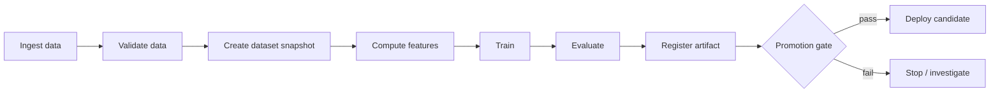

# Training Pipelines

## TL;DR

A training pipeline is the system that turns raw data into a model artifact you can trust enough to deploy. The notebook that produces a good model is not a training pipeline; the pipeline is everything that makes that result *reproducible, validated, governed, and re-runnable* months later by someone who has never met the original author. The central reliability property is reproducibility: a team must be able to explain exactly what data, code, features, parameters, and environment produced any model in production. Everything else — validation, lineage, promotion gates, scheduling — exists to protect that property as the world changes underneath the system.

---

## The Training Pipeline Is a System, Not a Script

The defining mistake in production ML is treating training as a step rather than a system. A data scientist pulls a dataset, trains a model in a notebook, exports a file, and hands it to engineering. It works once. The trouble is that the model is now a *dependency* with no maintainer, no provenance, and no way to rebuild it.

The reason this matters is that a model is the product of a long chain of decisions, most of them invisible in the artifact itself. The same model file can be produced by two different datasets, two different feature definitions, or two different library versions, and behave completely differently in production. Unlike a compiled binary — which is a deterministic function of its source — a model is a function of source *plus* data *plus* environment *plus* a dozen implicit choices. If any link in that chain is unrecorded, the model is unreproducible, and an unreproducible model is unrollbackable, unauditable, and undebuggable.

The failure trajectory is concrete. Watch what a "notebook model" costs three months after it ships:

```text
Day 0    Notebook trains model, exports fraud_model.pkl, hands to eng.
         Recorded: nothing. Lives in: someone's laptop + S3 bucket.
Day 30   Model quality drops 8%. Question: "what changed?"
         - Which data did it train on?      → "last quarter's, I think"
         - Which commit produced it?         → notebook was edited in place
         - Which feature definitions?        → feature SQL changed since
         - Which library versions?           → laptop was reimaged
Day 31   Try to retrain to compare → numbers don't match → can't isolate
         whether the regression is data, code, or environment.
Day 32   Try to roll back to "the good model" → the previous .pkl was
         overwritten → no known-good version exists.
Result   A production model that cannot be explained, compared, or reverted.
```

Every one of those dead ends is a missing record, and each is cheap to capture at training time and impossible to reconstruct afterward. The pipeline is the machinery that captures them automatically, so that "what changed?" is a query, not an archaeology project.

This is the core insight from Sculley et al.'s *Hidden Technical Debt in Machine Learning Systems* (2015): the model code is a small box in the middle of a large diagram, and almost all the operational risk lives in the boxes around it — data collection, feature extraction, configuration, data verification, process management, serving infrastructure. The training pipeline is the discipline that turns those surrounding boxes from informal scripts into versioned, owned, monitored components.

A useful test: if the person who built a model left the company tomorrow, could someone else rebuild the exact same model from what is recorded in the system? If the answer is no, you have a notebook, not a pipeline.

---

## Why Pipelines Decay

Training pipelines rot in characteristic ways, and understanding the failure trajectory is more useful than any single best practice.

The first decay is **silent input drift**. The pipeline keeps running and keeps producing models, but the upstream data changed meaning. A column that used to mean "gross revenue" now means "net revenue" after a finance team refactor. Nothing in the pipeline fails — the types still match, the job still succeeds — but every model trained after the change learns from subtly wrong data. This is why data validation must be part of the pipeline, not an afterthought: the pipeline cannot detect semantic change unless it is explicitly checking for it.

The second decay is **lineage rot**. Early on, the team remembers which dataset and which commit produced the current model. After a few months and a few personnel changes, that memory is gone. The model in production becomes a black box that no one dares to touch, because no one knows how to reproduce it. Rollback becomes impossible because the "known good" previous version cannot be rebuilt either.

The third decay is **ownership diffusion**. A training pipeline spans many teams — data platform owns ingestion, a domain team owns labels, a feature team owns transformations, the ML team owns training, a risk team owns approval. When any handoff is informal, the pipeline becomes nobody's responsibility at exactly the points where it is most fragile. The most common root cause of a decayed ML pipeline is not a technical flaw; it is an ambiguous ownership boundary that let a contract erode unnoticed.

The discipline of a training pipeline is, in large part, the discipline of refusing to let these three decays happen: validate inputs, record lineage, and assign ownership to every stage.

---

## Anatomy of a Training Pipeline

A production pipeline is a directed acyclic graph of idempotent steps, each consuming versioned inputs and producing versioned outputs. The shape is consistent across nearly every mature ML platform.



What makes this a *system* rather than a flowchart is that every edge carries metadata — dataset version, code version, feature definitions, parameters, artifact hash, evaluation report — and every node is owned, monitored, and re-runnable. Dataset snapshots and split assignments are covered in [Dataset Management and Versioning](./11-dataset-management-versioning.md); metric design and leakage checks are covered in [Offline Evaluation and Metric Design](./12-offline-evaluation-metrics.md). A training pipeline is structurally a [batch data pipeline](../13-data-pipelines/01-batch-processing.md) with a model at the end; it inherits the same demands for [idempotent](../01-foundations/08-idempotency.md) steps, snapshot-based reproducibility, and [workflow orchestration](../18-workflow-job-systems/05-dag-orchestration.md) discipline that any derived-data system needs.

### Stage Ownership

Ambiguous ownership is the single most common reason pipelines decay, so the ownership table is not bureaucratic overhead — it is the contract that prevents silent erosion.

| Stage | Owner | Contract it guarantees |
|---|---|---|
| Source ingestion | Data/platform team | Fresh, deduplicated, schema-versioned data |
| Label generation | Product/domain team | Stable label definition and known delay window |
| Feature computation | Feature owner | Point-in-time correct feature values |
| Training | ML team | Reproducible artifact and metrics |
| Evaluation | ML + product + risk | Promotion decision against guardrails |
| Registry | Platform team | Artifact state, lineage, rollback target |
| Deployment | Serving/platform team | Runtime compatibility and rollout controls |

The contract column matters more than the owner column. When a contract is violated — labels arrive later than the promised window, a feature silently changes meaning — the pipeline should fail loudly at the boundary, not absorb the violation and pass a corrupted dataset downstream.

---

## The Reproducibility Problem

Reproducibility is the foundation property because every other reliability guarantee depends on it. You cannot roll back to a model you cannot rebuild. You cannot audit a decision whose inputs you cannot reconstruct. You cannot debug a regression whose training conditions you cannot recreate.

A model is reproducible only if five distinct axes are pinned, and most reproducibility failures come from forgetting one of them.

**Code** is the most obvious axis and the one teams handle best, because Git already solves it. The model version must record the exact commit that trained it, including the pipeline definition, not just the model class.

**Data** is the axis teams handle worst, because data is large, mutable, and lives outside version control. The pipeline must pin an immutable snapshot — a specific partition, a specific timestamp, a specific label window — such that the exact training set can be reconstructed. "I trained on last month's data" is not reproducible; "I trained on the snapshot at `2026-06-10T00:00:00Z` with a 30-day label window" is. The label window is not a detail: it is part of the target definition, and premature or selectively missing labels corrupt the training set before the model sees it (see [Label and Ground-Truth Systems](./10-label-ground-truth-systems.md)).

**Features** are a subtle axis because feature definitions evolve independently of model code. A feature named `account_risk` might mean three different things across three versions. The model must pin the feature *view versions* it consumed, and the meaning of those versions must be immutable. (This is why feature stores treat a semantic change as a new feature name, not an in-place edit — see [Feature Stores](./02-feature-stores.md).)

**Parameters** include hyperparameters and random seeds. Without the seed, a model trained twice on identical data can differ, which makes debugging variance from genuine regression impossible. The seed alone is not enough on GPUs: several standard kernels are nondeterministic by default because atomic floating-point adds race in hardware, so bit-identical retraining requires opting in explicitly:

```python
# PyTorch 2.x — the full determinism checklist, not just the seed
import torch, numpy as np, random, os

seed = 42
random.seed(seed); np.random.seed(seed); torch.manual_seed(seed)
torch.cuda.manual_seed_all(seed)

torch.use_deterministic_algorithms(True)        # error on nondeterministic kernels
torch.backends.cudnn.benchmark = False           # autotuner picks kernels by timing → varies
os.environ["CUBLAS_WORKSPACE_CONFIG"] = ":4096:8"  # required for deterministic cuBLAS

loader = DataLoader(ds, num_workers=8, shuffle=True,
                    generator=torch.Generator().manual_seed(seed),
                    worker_init_fn=lambda w: np.random.seed(seed + w))
```

Determinism costs 10–20% throughput on some models, which is why many teams reserve bit-exactness for debugging and audit builds and accept *statistical* reproducibility (same data, same code, metrics within noise) for routine runs. Either policy is defensible; the failure is not choosing one, so that "the retrain came out different" cannot be classified as variance or regression.

**Environment** is the axis that produces the most baffling incidents, because it is invisible. A NumPy upgrade changes floating-point accumulation order. A CUDA version changes kernel behavior. The model trained yesterday cannot be reproduced today because the container image was rebuilt. The pipeline must pin the container image *by digest*, not by tag — `ml-train:latest` is the enemy of reproducibility.

The practical encoding of all five axes is a *reproducibility contract*: a metadata record attached to every registered model that answers, programmatically, "what produced this?" The registry — not a Slack thread, not a wiki, not someone's memory — is the source of truth. The registry control-plane design is covered in [Model Registry and ML Metadata](./13-model-registry-metadata.md).

```yaml
# The reproducibility contract: the minimum required to rebuild a model
model_version: fraud_classifier_v42
code:        { repo: org/ml-models, commit: 441c720, pipeline: pipelines/fraud/pipeline.py }
data:        { snapshot: "2026-06-10T00:00:00Z", label_window_days: 30, split: time_based }
features:    [ account_risk:v12, device_velocity:v7 ]
parameters:  { max_depth: 6, learning_rate: 0.05, seed: 42 }
environment: { image_digest: "sha256:9f86d08...", accelerator: A100-40GB }
```

The rule that makes this work: **no artifact enters the registry without a complete contract.** A model without provenance is not a release candidate; it is a liability.

---

## The Validation Problem: Catching Bad Data Before It Becomes a Bad Model

The most expensive way to discover a data problem is in production, weeks after a model trained on corrupted data started making decisions. The second most expensive is after a four-hour GPU training run completes. The cheapest is before training starts. Data validation exists to move detection as early as possible.

The categories of data failure are well understood. **Schema failures** — a column disappears, a type changes — are the easiest to catch and the most common after an upstream refactor. **Range failures** — a negative age, a probability above one, a transaction amount of ten billion dollars — catch corruption that schema checks miss. **Distribution failures** are subtler and more dangerous: the schema is intact, the values are in range, but the *shape* of the data shifted, because a new market launched, a logging bug halved the event volume, or an upstream join started dropping rows. **Completeness failures** — forty percent of labels suddenly missing — silently bias the model toward whatever subpopulation still has labels. **Uniqueness failures** — duplicated events — inflate the apparent frequency of whatever the duplicates represent.

| Failure class | Example | Cheapest check | Misses what |
|---|---|---|---|
| Schema | `amount` column dropped or retyped | type + presence assertion | values that are valid but wrong |
| Range | `age = -3`, `prob = 1.4` | min/max + domain bounds | in-range corruption |
| Distribution | mean order value halves overnight | divergence vs baseline (PSI/KS) | per-slice shifts hidden in aggregate |
| Completeness | 40% of labels missing | null-rate + row-count delta | nulls concentrated in one segment |
| Uniqueness | events double-counted | primary-key dedup + count | near-duplicates that aren't exact |

The validation suite is itself a versioned artifact, declared next to the pipeline and enforced as a gate. A practical encoding looks like an explicit contract rather than scattered `assert` statements:

```yaml
# data_contract: fraud_training_inputs·v7  (evaluated before training starts)
transactions:
  schema:
    transaction_id: { type: string, unique: true, required: true }
    amount_usd:     { type: float,  min: 0, max: 1_000_000, required: true }
    event_type:     { type: enum,   allowed: [purchase, refund, auth] }   # new value = fail
  freshness:
    max_lag_minutes: 90              # else: stale upstream, fail closed
  volume:
    expected_rows_per_day: 50_000_000
    tolerance: 0.20                  # ±20% day-over-day, else page data owner
  distribution:
    amount_usd: { baseline: model_v41_train_fingerprint, max_psi: 0.2 }
labels:
  completeness:
    min_label_rate: 0.95            # <95% labeled → biased training set, fail
  delay:
    max_observed_delay_days: 30     # contract from Label & Ground-Truth Systems
```

The `baseline` reference is the load-bearing part: distribution checks compare against the *statistical fingerprint of the data the current production model was trained on*, persisted as a versioned artifact, not against a rolling recent window (which would silently track the very drift it is meant to catch — the same baseline-drift trap that defeats [model monitoring](./04-model-monitoring.md)).

The deeper principle is that *type compatibility does not imply semantic compatibility*. The `event_type` enum gaining a new value, or `total_spend` switching from gross to net, will pass every type check and every null check while quietly poisoning the model. This is why mature validation compares against a *baseline distribution* — the statistical fingerprint of the data the current production model was trained on — and flags divergence even when every value is individually valid. Google's TensorFlow Data Validation and tools like Great Expectations exist precisely to make these distributional contracts explicit, versioned, and enforced before training consumes a single GPU-hour.

The operational rule is *fail fast, fail loud*. A validation failure should stop the pipeline and page the data owner, not log a warning that scrolls past. A change to an upstream enum is a breaking change to every model downstream of it, and the validation suite is the only place that breaking change can be caught cheaply.

---

## The Leakage Problem: When Good Offline Metrics Lie

Data leakage is the most insidious failure in training pipelines because it makes a broken model look excellent. Leakage occurs when the training data contains information that would not be available at prediction time. The model learns to exploit that information, posts spectacular offline metrics, and then collapses in production where the leaked signal is absent.

The reason leakage is so hard to eliminate is that it hides inside joins and timestamps that look perfectly reasonable. Consider a fraud model that joins each transaction to an `account_status` table. If `account_status` was updated to "closed_for_fraud" *after* the fraud was discovered, then training on the current value of that table tells the model the answer. The join looks innocent; the leak is in the *time dimension*, invisible unless you ask "was this value knowable at the moment of the decision?"

This is why the central defense against leakage is *point-in-time correctness*: every feature value in the training set must reflect what was actually knowable at the prediction timestamp, not the value the table holds today. Building a point-in-time-correct dataset requires distinguishing three timestamps that are easy to conflate — when the event happened (event time), when the system recorded it (ingestion time), and when the value became available to serve (availability time). A feature materialized at 10:10 was not available for a decision made at 10:05, and a training join that uses it leaks the future.

The difference between a leaky join and a correct one is one predicate, and it is worth seeing side by side:

```sql
-- LEAKY: joins the label row to the feature value the table holds *today*.
-- The account was flagged at 10:40, after the 10:05 decision — the model
-- is handed the answer.
SELECT t.txn_id, t.label, f.account_risk
FROM   labeled_txns t
JOIN   account_features f USING (account_id);          -- no time bound = time travel

-- CORRECT: as-of join. Take the latest feature value whose availability_time
-- is <= the decision time. The 10:40 value is invisible to a 10:05 decision.
SELECT t.txn_id, t.label, f.account_risk
FROM   labeled_txns t
LEFT JOIN LATERAL (
  SELECT account_risk
  FROM   account_features f
  WHERE  f.account_id = t.account_id
    AND  f.availability_time <= t.decision_time      -- the one predicate that matters
  ORDER BY f.availability_time DESC
  LIMIT 1
) f ON true;
```

The timeline the correct query enforces:

```text
        event_time      decision_time     availability_time
          10:00             10:05              10:40
            |-----------------|------------------|
  feature value computed AFTER the decision  ▲
  → a real serving request at 10:05 could NOT have read it
  → so the training join must not read it either
```

The split strategy is the second leakage defense, and it must mirror the production question. If the model predicts the future, a random row split is dishonest: it lets the model train on Tuesday and test on Monday, learning patterns that include foreknowledge. A time-based split — train on the past, evaluate on a held-out future window — is the only honest choice for any system that makes forward-looking predictions. When the goal is to generalize to *new* entities (users, merchants, items the model has never seen), an entity split is required, ensuring no entity appears in both train and test; otherwise the model's apparent skill is partly memorization.

The split must match the question the production system actually asks:

| Split | Mirrors the question | Leak it prevents | Honest for |
|---|---|---|---|
| Random row | "predict a random held-out row" | none — allows train-on-future | IID data with no time/entity structure |
| Time-based | "predict next week from this week" | training on the future | any forward-looking prediction |
| Entity-disjoint | "score a user/merchant never seen" | memorizing entity history | cold-start / new-entity generalization |
| Group / session | "generalize across correlated groups" | within-group contamination | clustered or repeated-measure data |

The two failure modes are mirror images: a random split on time-series data trains on the future and overstates skill; a time split on data that has no temporal structure needlessly throws away data. The split is part of the *measurement instrument*, so it must be materialized and versioned with the dataset, not recomputed ad hoc with a fresh random seed each run (see [Offline Evaluation and Metric Design](./12-offline-evaluation-metrics.md)).

A pragmatic heuristic catches a large fraction of leaks: *any single feature that pushes AUC above 0.98 is guilty until proven innocent.* Real-world prediction is hard; a feature that makes it trivial is almost always a leak — a label encoded in disguise, a future value joined by mistake, an identifier that proxies the target. The leakage detection checklist is short but non-negotiable: no feature may use post-decision data, no label may be derivable from the features, entity splits must be disjoint, and every suspiciously powerful feature must be audited for time-travel.

The cost of getting this wrong is not just a bad model; it is a bad model that *passed every gate*, because the gates were measuring a leaked metric. Leakage defeats the entire promotion process from the inside, which is why it deserves more scrutiny than any other data property.

---

## The Execution Engine: Where Pipeline System Design Lives

The pipeline DSL — whether TFX, Kubeflow Pipelines, Airflow, or Metaflow — describes *what* should run. The execution engine decides *how* and *when* it actually runs, and this is where the genuinely interesting systems problems live: caching, lineage, scheduling, and fault recovery.

The orchestrators differ less in syntax than in *which of these systems problems they solve for you*:

| Orchestrator | Unit of execution | Artifact/lineage tracking | Step caching | Its actual specialty |
|---|---|---|---|---|
| Airflow (2.x) | task in a scheduler-managed DAG | none native (XCom is a mailbox, not a store) | none native | scheduling and backfills for general ETL |
| Kubeflow Pipelines (2.x) | container pod per step | MLMD-backed artifact store | content-key caching built in | K8s-native ML DAGs with lineage |
| Metaflow | Python step, local or batch | automatic artifact snapshots per step | `resume` from any step | human ergonomics; versioning invisible |
| Dagster | software-defined asset | assets are first-class, typed | asset memoization | data-aware orchestration, freshness policies |
| TFX | typed component | ML Metadata (MLMD) | input-hash caching | schema/validation-centric TF pipelines |

The practical consequence: teams that pick Airflow because it already runs their ETL end up hand-building the artifact store, the content-addressed cache, and the lineage recording that Kubeflow/Metaflow/TFX ship natively — the three subsystems the rest of this section describes. That can be the right call (one orchestrator to operate instead of two), but it should be a conscious buy-versus-build decision, not a default inherited from the data platform.

The architecture separates a control plane from a data plane. The control plane — scheduler, step cache, artifact store, lineage store — decides what to run and records what happened. The data plane — worker pools reading inputs, computing, and writing outputs — does the heavy lifting. The separation matters because the two planes have completely different reliability requirements: the control plane must be durable and consistent (losing lineage is catastrophic), while the data plane must be elastic and cheap (workers are disposable).

### Caching as the Primary Efficiency Lever

The single largest efficiency gain in a mature pipeline comes from *not recomputing work that has already been done*. If the inputs to a feature-computation step are unchanged, there is no reason to recompute the features. But "unchanged" is a deceptively hard predicate.

The correct foundation is *content addressing*: a step's cache key is a hash of its inputs' *content* (not their paths), plus the code version, plus the environment digest, plus the parameters. Two runs with identical content-keys are guaranteed to produce identical outputs, so the second can reuse the first's result.

```text
cache_key(step) = H(
    H(input_artifact_contents),   # WHAT went in (content hash, not path)
    code_version,                 # the transformation logic
    environment_digest,           # libraries, CUDA, base image by digest
    step_parameters               # window sizes, thresholds, seeds
)
# identical key  ⇒  identical output  ⇒  safe to reuse
```

The failures here are instructive because they all stem from an incomplete key:

| What the key omits | Silent bug it causes |
|---|---|
| input *content* (keys on path instead) | renamed-but-identical file invalidates nothing; moved file recomputes everything |
| code version | a changed transform returns the *old* cached result |
| environment digest | a NumPy/CUDA upgrade that shifts numerics is masked by a stale cache |
| parameters | a new window size or seed reuses results computed under the old one |

And a step that reads "latest" data or consults the wall clock is *fundamentally uncacheable*, because its output is not a pure function of its declared inputs — non-determinism and caching are mutually exclusive. The fix is to make the nondeterministic input explicit: pin "latest" to a snapshot id and pass the clock in as a parameter, turning an impure step into a pure one of its declared inputs.

### Lineage as the Foundation of Trust

The lineage store answers two questions that every other reliability property depends on. *Provenance*: given this model, what produced it? *Impact*: given this dataset had a bug, which models must be retrained? It is a queryable DAG of artifacts and step executions, where each execution records its inputs (by content hash), its outputs, and its full execution context.

The impact query is the one teams underinvest in until they desperately need it. When a data engineer discovers that a source table double-counted events for a week, the only question that matters is "which production models trained on that window?" Without forward lineage, the answer is "we don't know, retrain everything," which is both expensive and an admission that the system is not auditable. Google's ML Metadata and the lineage subsystems of every serious ML platform exist to make this query a lookup rather than an investigation.

The storage choice follows the query pattern. A relational database handles provenance and impact well at modest scale and is where most platforms start. A graph database becomes worthwhile only when impact analysis must traverse many hops across thousands of models. An append-only log gives audit-grade immutability at the cost of harder ad-hoc querying. The right answer is almost always "start relational, migrate only when traversal latency hurts."

---

## Training Data I/O: The Bottleneck Is Usually Not Compute

A counterintuitive truth dominates the economics of deep-learning pipelines: the GPU is rarely the bottleneck. Data delivery is. An A100 can consume training examples faster than most storage systems can supply them, so the accelerator sits idle waiting for the next batch — paying premium hourly rates to do nothing. When GPU utilization sits below seventy percent, the cause is almost always I/O, not the model.

This reframes a large part of pipeline design as a *data delivery* problem. The storage format matters: columnar formats like Parquet excel at feature joins and selective reads; sequential formats like TFRecord and WebDataset excel at the streaming, full-scan reads that training demands; reading directly from the warehouse keeps data fresh but makes the warehouse the bottleneck and the bill. The sharding matters: data must be split into chunks that parallel workers can read disjointly, and the shard size is a genuine tuning parameter — shards too small drown in metadata overhead, shards too large create stragglers that idle every other worker while one finishes.

The decisive technique is *overlapping I/O with compute through prefetching*. While the GPU processes batch N, the data loader should already be fetching batches N+1 through N+4 on separate worker threads, so the accelerator never waits.

The cost of getting this wrong is a direct multiplier on the bill, and the arithmetic is worth doing explicitly:

```text
GPU step compute time:                    80 ms
Data fetch+decode time (cold, serial):   120 ms   ← slower than compute

Without overlap:  step = max-bound by I/O ≈ 120 ms  → GPU util ≈ 80/120 = 67%
With overlap:     step = max(80,120 hidden) but prefetched → GPU util → ~95%+

On an 8×A100 job at ~$33/hr, running at 67% util instead of 95% wastes
~30% of every hour — about $7/hr, ~$170 over a 24h run — to do nothing but
wait on bytes.
```

When prefetching alone is insufficient, the fix ladder runs from cheap to expensive:

```text
1. add data-loader workers        until CPU decode saturates
2. cache shards on local NVMe      so epoch 2+ doesn't re-read object storage
3. increase prefetch depth         deeper queue absorbs fetch-time variance
4. switch to a sequential format   TFRecord/WebDataset for full-scan reads
5. co-locate compute with storage  cut the network RTT on every batch
```

The principle underneath all of these is the same one that governs any pipeline — *the slowest stage sets the throughput* (the same bottleneck law that governs [batch processing](../13-data-pipelines/01-batch-processing.md) and shows up as Little's law in [capacity planning](../01-foundations/10-capacity-planning.md)) — and in training that stage is usually the one moving bytes, not the one doing matrix multiplication.

---

## Distributed Training: A Cost and Coordination Problem

Distributed training is best understood not as a machine-learning technique but as a distributed-systems problem with machine-learning constraints. The moment training spans more than one accelerator, the pipeline inherits coordination, fault tolerance, and communication-overhead concerns that single-machine training never faced.

The topologies map to distinct constraints. *Data parallelism* — every worker holds a full copy of the model and processes a different data shard, synchronizing gradients each step — is the default when the model fits on one device but the dataset does not. Its limit is communication: as worker count grows, the gradient all-reduce after every step becomes the bottleneck, and beyond some scale adding GPUs *slows* training. *Model parallelism* — splitting the model itself across devices — is the answer when the model is too large for any single device, at the cost of "pipeline bubbles" where devices idle waiting for the previous stage. *Sharded approaches* like FSDP and ZeRO partition the model parameters, gradients, and optimizer state across workers, gathering what each needs on demand; this is how trillion-parameter models train at all, and the trade-off is more communication and harder debugging.

| Topology | Use when | Splits across devices | Dominant cost |
|---|---|---|---|
| Data parallel | model fits on one device, dataset does not | the data | gradient all-reduce per step |
| Model parallel | model too large for one device | the model layers | pipeline bubbles (idle stages) |
| Sharded (FSDP/ZeRO) | model + optimizer state too large | params, grads, optimizer state | gather/scatter communication |

The scaling intuition is that more workers do not buy linear speedup: each added worker adds communication, and past a domain-specific point the all-reduce dominates and throughput-per-GPU *falls*. The number to watch is scaling efficiency — `speedup_N / N` — and the right cluster size is the one where it is still acceptable, not the largest one the quota allows. This section is deliberately a survey: the mechanics underneath — collective-communication costs, ZeRO/FSDP sharding math, tensor/pipeline parallelism composition, MFU accounting, and failure math at cluster scale — get their own chapter in [Distributed Training Internals](./15-distributed-training-internals.md).

The reason this belongs in a discussion of pipelines, rather than of model architecture, is that distributed training reshapes the *operational* requirements. Long multi-device jobs run for hours or days, which makes them statistically certain to encounter hardware failures and spot-instance preemptions. A six-hour job that cannot resume from an interruption will, in expectation, never finish on cheap preemptible hardware. This makes *checkpointing* not an optimization but a correctness requirement: the job must periodically persist enough state — model weights, optimizer state, step counter — that a relaunched job resumes from the last checkpoint rather than from zero. The economic payoff is large: running primary workers on spot instances with disciplined checkpointing typically cuts training cost by half to two-thirds, at the price of a few percent overhead from occasional preemption recovery. Distributed training, in other words, is mostly a story about making expensive hardware fail gracefully and cheaply.

---

## Resource Management: The Multi-Tenant Cluster

A training platform is a shared resource, and shared resources fail in the ways all shared resources fail: one tenant's greed starves the others. A GPU cluster serving a fraud team, a recommendations team, and a swarm of experimenters is a scheduling problem before it is an ML problem.

The mechanisms are the classic ones from cluster management, adapted to the peculiarities of GPU workloads. *Fair-share scheduling* with per-team weights prevents any single team from monopolizing the cluster. *Quotas* on GPU-hours impose backpressure and keep budgets bounded. *Preemption* lets a high-priority production retraining job evict low-priority experiments — which is safe precisely because the experiments checkpoint and resume. *Isolation* between production and experimental pools keeps a researcher's runaway job from degrading a production training run.

The subtlest requirement is *gang scheduling*, and it is unique to distributed jobs. A four-worker training job needs all four workers to start together; if the scheduler grants three GPUs and makes the job wait for the fourth, the job hangs while holding three GPUs hostage. Stack a few such jobs and the cluster reaches one hundred percent allocation with zero percent useful work — every job waiting for one more worker that no one will release. Gang scheduling solves this by making allocation all-or-nothing: a distributed job either gets all its workers at once or none of them, releasing what it holds so another job can proceed. This is the same insight that drives Google's Borg and Kubernetes batch schedulers like Volcano — that partial allocation of an indivisible job is worse than no allocation at all.

---

## Pipeline Reliability: Surviving Partial Failure

Training pipelines fail partway through. A job dies at hour five of six; a worker is preempted; a transient network blip kills a step. The pipeline's job is to make these partial failures recoverable rather than catastrophic, and the discipline is the same idempotency-and-atomicity discipline that governs any [durable workflow system](../18-workflow-job-systems/06-retry-idempotency-compensation.md).

The foundational invariant is that *a step's output is either fully present or fully absent — never partial*. A step that writes directly to its output location and crashes midway leaves a corrupt half-file, and the next run either fails confusingly or, worse, mistakes the partial output for a completed one and skips the step. The fix is *atomic commit*: the step writes to a temporary location and atomically renames to the final location only on success. This is the same write-temp-then-rename discipline that gives filesystems and [write-ahead logs](../03-storage-engines/04-write-ahead-logging.md) their crash-atomicity.

```text
# WRONG: write in place → crash leaves a corrupt half-file the next run trusts
write(features, "s3://bucket/features/v7/part-0001.parquet")

# RIGHT: stage then atomic rename → final path appears only on success
tmp = "s3://bucket/features/v7/_staging/run=8821/part-0001.parquet"
write(features, tmp)
atomic_rename(tmp, "s3://bucket/features/v7/part-0001.parquet")   # commit point
```

A relaunched pipeline then sees a clean binary state at every step — done or not done — and can safely skip completed work and resume incomplete work.

Not every failure should be retried, and conflating retriable and non-retriable failures is its own bug. The retry policy is a classification problem, and getting the classification wrong turns a clear bug into an intermittent mystery:

| Failure | Class | Correct response |
|---|---|---|
| Network timeout, throttled read | transient | retry with exponential backoff + jitter |
| Spot-instance preemption, evicted pod | interruption | resume from last checkpoint |
| Schema mismatch, NaN loss, code exception | deterministic | fail fast, page a human — retrying wastes hours |
| OOM at a given batch size | deterministic-ish | fail fast; retrying unchanged repeats the crash |

The trap is retrying a deterministic failure: three automatic retries of a schema mismatch burn time, bury the real error in noise, and turn a clear defect into a flaky-looking one. Retry the failures that are genuinely caused by the environment; surface the ones caused by the data or the code.

For steps long enough to span failures — training itself, large feature computations — checkpoint-as-you-go extends the same logic inside the step. By persisting progress every N steps, a failed job resumes from the last checkpoint and loses at most N steps of work rather than the entire run. The checkpoint is the commit point; everything between checkpoints is work the system is willing to redo.

```text
step   1000 ── checkpoint {weights, optimizer_state, step=1000, rng_state}
step   2000 ── checkpoint ...
step   2730 ── ⚡ spot preemption
             ↓
 relaunch → load checkpoint@2000 → resume at 2001
            lost work = 730 steps (not 2730)
```

The checkpoint interval is a tunable cost trade-off, not a constant: checkpoint too rarely and a preemption near the end discards hours; checkpoint too often and the serialization overhead taxes every run. A useful rule is to size the interval so that *expected re-done work ≈ checkpoint write cost* — if a checkpoint costs 30 seconds to write and preemptions arrive roughly hourly, checkpointing every few minutes keeps both terms small. Crucially, the checkpoint must capture *all* state needed to resume bit-identically — weights, optimizer moments, the step counter, the data-loader position, and the RNG state — or the "resumed" run silently diverges from the one that would have completed uninterrupted.

---

## Retraining: How Often, and How Automatically

Deciding when to retrain is a risk-management question disguised as a scheduling question. Retrain too rarely and the model drifts away from a changing world; retrain too eagerly and you spend money relearning a world that has not changed, while exposing yourself to the risk that bad data quietly becomes a bad model.

The strategies form a clear progression of automation and risk. *Manual retraining* suits low-change or high-stakes models where a human should be in the loop for every release. *Scheduled retraining* — daily or weekly — fits domains with predictable data arrival, accepting that some runs retrain on data that has not meaningfully changed. *Triggered retraining* fires when a drift or quality metric crosses a threshold, responding to change rather than the calendar, at the cost of noisy triggers. *Continuous training* retrains and redeploys on a tight loop and belongs only to fast-moving domains with mature automation around it.

| Strategy | Trigger | Fits | Prerequisite safety nets |
|---|---|---|---|
| Manual | human decision | high-stakes, slow-changing | review + reproducibility |
| Scheduled | calendar (daily/weekly) | predictable data arrival | validation gates |
| Triggered | drift/quality threshold | non-stationary domains | drift monitoring + baselines |
| Continuous | every new data batch | fast-moving (ads, feeds) | fast monitoring + auto-rollback + full lineage |

Each row down the table buys faster adaptation and adds a faster path for bad data to reach production.

The critical discipline is that automation must *follow* trust, not precede it. The progression from manual to continuous retraining is not a ladder to climb as fast as possible; each rung adds a way for bad data to reach production faster. Continuous training is only safe atop real-time monitoring that detects degradation within minutes, automatic rollback that recovers within minutes, and complete lineage for every deployed artifact. A team that automates retraining before it has validation, monitoring, and rollback has not built a self-improving system; it has built a machine for amplifying its next data bug into a production incident at full speed. Most teams should sit at scheduled or triggered retraining with human-approved promotion, and earn each further step of automation by demonstrating the safety nets that justify it.

---

## The Economics: Estimate Before You Spend

Training cost should be a number the team predicts before a run, not a surprise on the monthly cloud bill. The estimate is not complicated, but making it explicit changes behavior.

For a single-accelerator job, cost is simply training hours times the hourly accelerator rate plus attached compute and storage. A gradient-boosted model on a hundred million rows might train in two hours on one A100 for roughly ten dollars all-in. A distributed job multiplies by device count: a two-tower retrieval model on four A100s for six hours is closer to a hundred dollars. The expense that surprises teams is *hyperparameter search*, because it multiplies the base cost by the number of trials.

```text
base single run:      4 × A100 × 6 h × ~$4/h        ≈   $96
HPO search (50 trials, early-stop to 40% avg):
     50 × 0.40 × $96                              ≈ $1,920   ← 20× the base run

annualized:
     daily scheduled retrain:   365 × $96          ≈ $35K/yr
     + monthly HPO search:       12 × $1,920       ≈ $23K/yr
```

A single training run looks cheap; the search around it and the cadence on top of it are where the budget actually goes. Annualized, a daily scheduled retrain is tens of thousands of dollars; add a regular hyperparameter search and the number jumps again.

The operational payoff of estimating cost is not just budgeting; it is *anomaly detection*. When cost is a logged metric on every run, a sudden increase becomes an early warning — data volume grew unexpectedly, the search space expanded, a configuration drifted, a job stopped using spot instances. Cost is a proxy for "something about this pipeline changed," and a pipeline that does not watch its own cost is blind to a whole class of regressions.

---

## Failure Modes

The characteristic failures of training pipelines recur across organizations, and naming them is half of preventing them.

**The non-reproducible model** performs well but cannot be rebuilt — the commit was lost, the snapshot expired, the image was garbage-collected. It is the failure that makes every other failure worse, because it removes the ability to roll back or audit. The defense is mandatory lineage before promotion: no contract, no registry entry.

**The bad backfill** rewrites the apparent past. A correction to historical feature values silently changes future training sets, and the model "improves" — but the improvement is an artifact of corrected data, not a better model. The defense is to version feature definitions, record backfill ranges, compare old and new values on a sample, and never overwrite production data in place.

**Evaluation leakage** is the bad model that passed every gate, because the gates measured a metric corrupted by leakage. It is the most dangerous failure because the entire promotion process certified it. The defense is honest splits, point-in-time features, and ruthless suspicion of any too-good metric.

**Automation amplifying bad data** is the failure mode of premature continuous training: a single corrupted partition becomes a bad model becomes a bad deployment, all without a human in the loop. The defense is validation gates, canary rollout, and human approval for severe distribution shifts.

**Pipeline drift** is the quietest failure: the pipeline keeps working but produces subtly different artifacts over time as dependencies upgrade and defaults change. Nothing breaks; the system simply stops being the system it was. The defense is pinning everything and running periodic reproducibility audits — rebuild a random past artifact from its lineage and check that the bits match.

---

## Decision Framework

When designing or reviewing a training pipeline, a small set of questions separates a system from a script:

Can every model in production be rebuilt from recorded metadata alone? If not, the pipeline has no rollback and no audit, and that is the first thing to fix.

Does validation run *before* training, comparing against a baseline distribution rather than just checking types? If not, the pipeline cannot detect the semantic drift that causes silent degradation.

Is the train/test split honest about the production question — time-based for forward prediction, entity-based for new-entity generalization? If not, the offline metrics are optimistic fiction.

Is every stage owned, with a contract that fails loudly when violated? If not, the pipeline will decay at its handoff boundaries.

Is automation matched to the maturity of the safety nets — validation, monitoring, rollback — that make it safe? If not, the pipeline is a fast path from data bug to production incident.

A pipeline that answers these well is reproducible, validated, owned, and recoverable. A pipeline that does not is a model-shaped liability waiting for the data to change.

---

## Key Takeaways

1. The training pipeline is the system that makes a model reproducible, validated, owned, and re-runnable — the notebook that produces the model is not the pipeline.
2. Reproducibility is the foundation property: pin code, data, features, parameters, and environment, because every rollback and audit depends on it.
3. Validate inputs against a baseline distribution before training, because type-compatible data can still be semantically corrupt.
4. Leakage is the failure that makes bad models look excellent and defeats every promotion gate from the inside; point-in-time correctness and honest splits are the only defense.
5. The execution engine — caching, lineage, scheduling — is where the genuine systems design of a pipeline lives.
6. Training is usually I/O-bound before it is compute-bound; the data-delivery path, not the model, sets throughput.
7. Distributed training is a cost-and-coordination problem; checkpointing makes cheap, failure-prone hardware economically usable.
8. Multi-tenant clusters need fair share, quotas, preemption, and gang scheduling, or one tenant starves the rest.
9. Step outputs must be atomic — fully present or fully absent — or retries corrupt the system.
10. Automate retraining only as fast as your validation, monitoring, and rollback can keep it safe.

---

## References

1. [Hidden Technical Debt in Machine Learning Systems](https://proceedings.neurips.cc/paper_files/paper/2015/file/86df7dcfd896fcaf2674f757a2463eba-Paper.pdf) — Sculley et al., 2015
2. [TFX: A TensorFlow-Based Production-Scale Machine Learning Platform](https://dl.acm.org/doi/10.1145/3097983.3098021) — Baylor et al., 2017
3. [Data Validation for Machine Learning](https://mlsys.org/Conferences/2019/doc/2019/167.pdf) — Breck et al., 2019
4. [Rules of Machine Learning: Best Practices for ML Engineering](https://developers.google.com/machine-learning/guides/rules-of-ml) — Zinkevich
5. [ZeRO: Memory Optimizations Toward Training Trillion Parameter Models](https://arxiv.org/abs/1910.02054) — Rajbhandari et al., 2019
6. [Large-scale cluster management at Google with Borg](https://research.google/pubs/pub43438/) — Verma et al., 2015
7. [Metaflow: A Human-Centric Framework for Data Science](https://netflixtechblog.com/open-sourcing-metaflow-a-human-centric-framework-for-data-science-fa72e04a5d9) — Netflix, 2019
8. [ML Metadata: A Standard for ML Artifact Lineage](https://www.tensorflow.org/tfx/guide/mlmd)
9. [Kubeflow Pipelines v2 Documentation](https://www.kubeflow.org/docs/components/pipelines/v2/)
