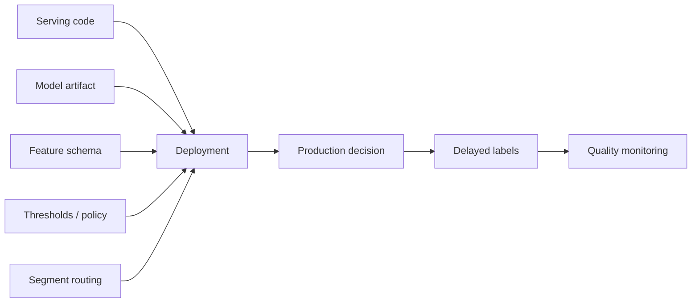
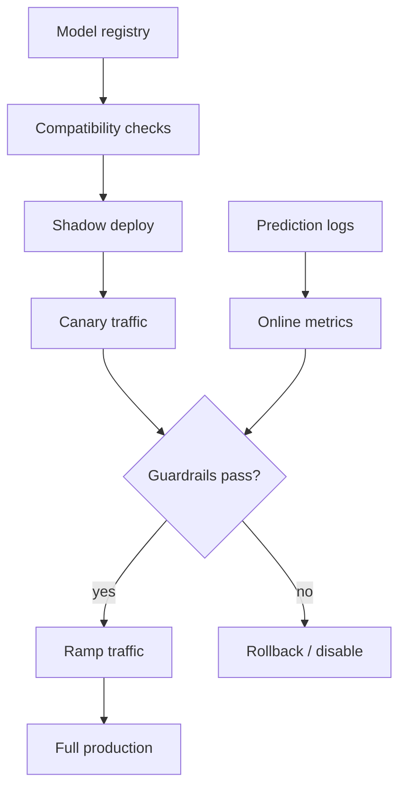
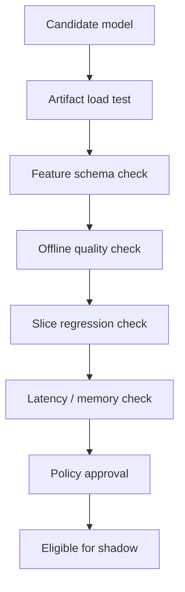

# Model Deployment and Rollouts

## TL;DR

Model deployment is not just pushing a binary. A model release changes a decision policy that depends on feature contracts, thresholds, calibration, segment routing, and delayed labels. Safe rollouts need artifact compatibility checks, shadow traffic, canaries, guardrail metrics, rollback paths, and post-deploy quality monitoring.

---

## Why Model Deployment Is Different

Application deployment usually asks: does the new code run and satisfy tests?

Model deployment also asks:

- Does the artifact expect the same feature schema the serving path provides?
- Does its score distribution match the thresholds and downstream policy?
- Does it behave safely on critical slices?
- Can quality be measured before delayed labels arrive?
- Can the old model be restored without replaying data migrations?



The release unit is the decision system, not the model file.

---

## Release Artifact Contract

Every deployable model should carry metadata that the platform can validate before promotion.

| Field | Purpose |
|---|---|
| Model name and version | Human and programmatic identity |
| Training data snapshot | Reproducibility and auditability |
| Feature schema version | Compatibility with online feature retrieval |
| Output contract | Score range, class labels, embeddings, calibrated probability |
| Runtime image | Dependency and hardware compatibility |
| Evaluation report | Offline metrics, slices, guardrails |
| Serving limits | Expected latency, memory, accelerator need |
| Rollback target | Known-good previous version |
| Owner | On-call and approval accountability |

Do not promote an artifact that cannot explain what produced it.

---

## Deployment Control Plane



The control plane should own traffic percentages, segment routing, model version pinning, rollback, and audit logs. Individual model teams should not hand-code these controls inside business logic.

---

## Rollout Patterns

| Pattern | What it validates | Strength | Blind spot |
|---|---|---|---|
| Offline evaluation | Historical quality | Fast and cheap | Cannot see live feedback loops |
| Shadow deployment | Runtime behavior under real traffic | No user impact | Does not validate decisions that affect users |
| Canary | Small live traffic | Validates end-to-end decision path | Delayed labels may hide quality regressions |
| Champion/challenger | Candidate against current model | Clear comparison | Needs stable assignment and enough traffic |
| A/B experiment | User or entity-level causal impact | Best for product outcomes | Slower and statistically heavier |
| Kill switch | Stop a bad model quickly | Limits blast radius | Requires a safe fallback |

Canary answers "is this safe enough to continue?" A/B testing answers "is this better?" Do not confuse them.

---

## Pre-Deploy Gates



Recommended gates:

- Artifact can load in the target runtime.
- Required features exist and have compatible types.
- Score distribution does not have unexpected collapse or explosion.
- Primary metric improves or stays within accepted bounds.
- Guardrail metrics do not regress.
- Critical slices pass minimum quality.
- Serving p99 and memory fit capacity.
- Owner approves high-risk decisioning changes.

---

## Threshold and Policy Coupling

Many production models output a score, not a final action. The threshold or policy layer decides what happens.

```text
score >= 0.95  -> block
score >= 0.70  -> manual review
otherwise      -> allow
```

If the new model is better calibrated but has a different score distribution, reusing old thresholds can cause a production incident. Treat thresholds as versioned policy artifacts and roll them out with the model.

---

## Rollback Design

Rollback must be designed before rollout.

| Dependency | Rollback question |
|---|---|
| Model artifact | Is the previous artifact still loaded or quickly loadable? |
| Feature schema | Did the new model require new features that old code ignores safely? |
| Thresholds | Can policy be reverted independently? |
| Prediction logs | Can labels still join after rollback? |
| Batch outputs | Can stale precomputed scores be invalidated? |
| Downstream decisions | Are irreversible actions isolated behind review or compensation? |

For high-risk systems, prefer "disable candidate" over "redeploy old service." Traffic routers and model registries should make rollback a metadata operation.

---

## Failure Modes

### Schema-Compatible but Semantically Wrong

The feature exists and has the right type, but its meaning changed. Example: `total_spend_30d` changes from gross to net revenue.

Mitigation: feature contracts with owners, semantic versioning, validation distributions, and feature change review.

### Canary Looks Good Because Labels Are Delayed

Short-term proxy metrics pass, but true labels arrive days later and reveal regression.

Mitigation: use conservative ramp rates for delayed-label domains, monitor proxy and delayed metrics separately, and keep champion/challenger comparison windows.

### Shadow Traffic Overloads Dependencies

Shadow models do not affect responses, but they still fetch features and run inference.

Mitigation: sample shadow traffic, isolate resource pools, and include dependency load in the shadow plan.

### Irreversible Decision Blast Radius

A bad model blocks payments, deletes content, bans users, or changes prices.

Mitigation: review queues, reversible first actions, kill switches, and staged authority. Let new models recommend before they decide.

---

## Operational Metrics

| Category | Metrics |
|---|---|
| Release | Promotion rate, rollback rate, time to rollback, failed gates |
| Runtime | p99 latency, timeout rate, feature miss rate, model load failures |
| Traffic | Assignment ratio, sample ratio mismatch, segment coverage |
| Model behavior | Score distribution, class mix, fallback rate |
| Quality | Proxy metrics, delayed labels, slice regressions, calibration |
| Business guardrails | Revenue, fraud loss, user complaints, manual review volume |

---

## Architecture Review Checklist

- Is model promotion separate from service deployment?
- Are feature schemas validated before rollout?
- Are thresholds and policy versioned with the model?
- Does shadow traffic have resource isolation?
- Are canary guardrails defined before launch?
- Can rollback happen without a code deploy?
- Are delayed labels handled in the launch plan?
- Are irreversible actions protected by human review or safer fallback policy?

---

## Key Takeaways

1. Deploy the decision system, not just the model file.
2. Shadow validates runtime; canary validates safety; experiments validate improvement.
3. Feature schema, thresholds, and segment routing are part of the model release.
4. Rollback should be a platform operation, not an emergency rebuild.
5. Delayed labels make conservative ramping essential.

---

## References

1. [Hidden Technical Debt in Machine Learning Systems](https://proceedings.neurips.cc/paper_files/paper/2015/file/86df7dcfd896fcaf2674f757a2463eba-Paper.pdf)
2. [TensorFlow Serving: Flexible, High-Performance ML Serving](https://arxiv.org/abs/1712.06139)
3. [MLflow Model Registry](https://mlflow.org/docs/latest/ml/model-registry/)
4. [KServe Documentation](https://kserve.github.io/website/)
