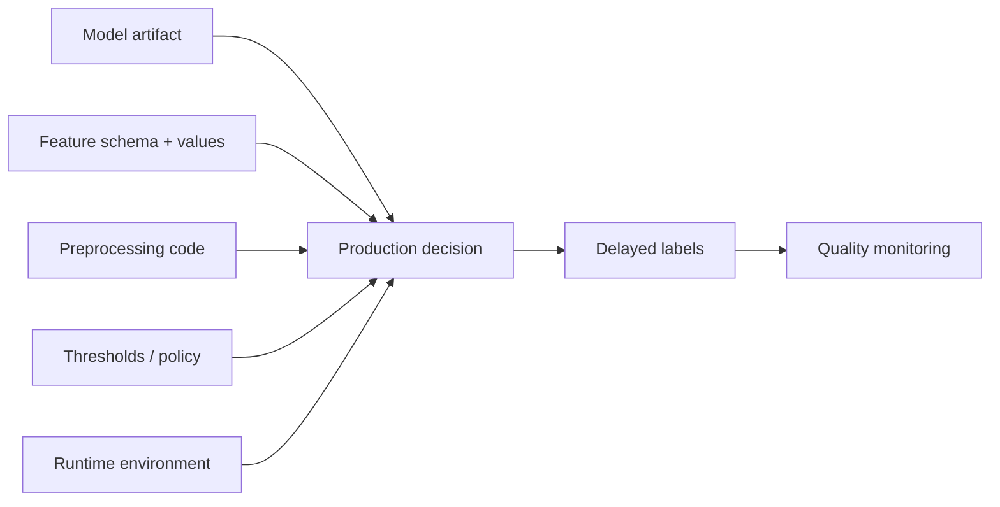
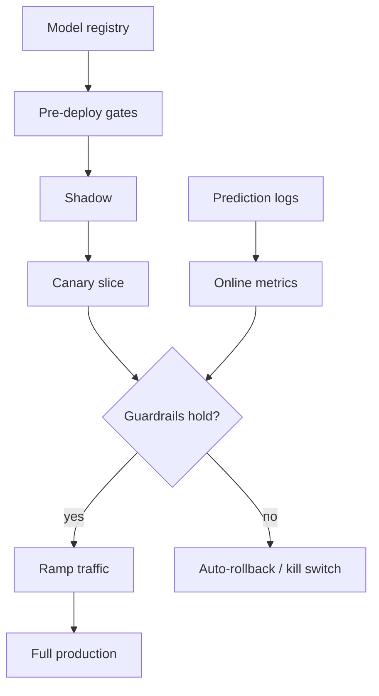

# Model Deployment and Rollouts

## TL;DR

Deploying a model is riskier than deploying code because you cannot fully test a model offline — its real behavior only appears on live traffic, against data the test set never contained. The consequence is that the *deploy strategy*, not the test suite, is the primary safety mechanism. Progressive delivery — shadow, then canary, then a measured ramp, with an always-ready rollback — is therefore non-negotiable for ML. The unit you are releasing is not a model file but a decision system: an artifact bound to feature contracts, preprocessing, thresholds, and an environment that must ship atomically and be reversible together. A model you cannot roll back to is a model you should never have rolled forward from.

---

## The Untestable Artifact

Ordinary software has a comforting property: its correct behavior is, in principle, knowable before deployment. You can enumerate inputs, write assertions, and reach high confidence that the code does what the tests say. A model breaks this contract. Its behavior is learned from data, and the only honest test of that behavior is the live distribution it will actually see — which by definition you do not have until you serve it. Offline evaluation measures performance on a held-out slice of the *past*; production runs on the *present*, where the input distribution has shifted, new segments have appeared, an upstream feature has changed meaning, and adversaries are probing for weakness.

This gap is not a testing-discipline problem you can close with more unit tests. It is structural. A model can pass every offline gate with excellent metrics and still fail catastrophically the moment it meets real traffic, because the failure lives in the difference between the data it was evaluated on and the data it now scores. Microsoft's Tay chatbot illustrated the extreme version: released to live Twitter traffic in March 2016, it learned from adversarial users and produced toxic output within 24 hours, forcing a shutdown. No offline suite would have caught that, because the failure mode *was* the live interaction.

A subtler version of the same problem is the *feedback loop*: a deployed model changes the very data it will later be judged on. A recommender that promotes an item makes that item more clicked, which then looks like evidence the recommendation was good; a fraud model that blocks a transaction prevents the chargeback that would have labeled it, erasing its own ground truth. Offline evaluation, frozen in the past, cannot see these loops at all — they exist only once the model is acting on live traffic and shaping the future. Zillow's iBuying program is the cautionary tale at business scale: in November 2021 the company shut down Zillow Offers after its pricing models systematically overpaid for homes, taking inventory write-downs of more than $500 million and cutting roughly a quarter of its workforce. The models had been validated; what they could not be validated against was the live market they were now moving.

The engineering implication is the thesis of this entire document: **because you cannot certify a model offline, you must certify it in production, incrementally, on real traffic, with a fast path back.** The deploy strategy carries the safety guarantee that the test suite cannot. This inverts the usual priority order — for application code, the test suite is the primary gate and the rollout is a convenience; for models, the rollout *is* the gate.

---

## Deploying a Model Is Deploying a Decision System

The second reason model deployment is hard is that the model file is the smallest part of what you are shipping. A serving model is the end of a dependency chain: it runs inside a [model serving](./03-model-serving.md) layer, consumes features computed by a [feature store](./02-feature-stores.md), expects a specific input schema and preprocessing, emits a score, and that score is turned into an action by a threshold or policy layer.

The most dangerous form of this coupling is **train/serve skew at deploy time**. The model learned a feature's distribution during training; if the online serving path computes that feature even slightly differently — a different default for a missing value, a different time window, a unit mismatch — the model sees inputs it was never trained on and degrades silently. This is the same point-in-time-correctness discipline that governs [training pipelines](./05-training-pipelines.md), now enforced at the deployment boundary: the features must be computed the same way in production as they were in training, and the deploy must guarantee it.

Because the model and its dependencies are one system, they must deploy **atomically**. Shipping a new model that expects feature `device_velocity:v7` while the serving path still provides `v6` is not a degraded deploy — it is a broken one. The release unit is the tuple of model artifact, feature schema version, preprocessing code, threshold policy, and runtime environment. The flowchart below shows why: every one of these inputs feeds the production decision, and a mismatch anywhere corrupts the output.



A useful test mirrors the one for training pipelines: if you promote this artifact, can the platform *validate* — not assume — that the feature schema it requires is the schema being served, that the threshold policy matches its score distribution, and that the runtime image can load it? If any of these is a hope rather than a check, you are deploying a decision system you do not understand.

The pre-deploy compatibility matrix should be mechanical:

| Contract field | Example | Gate check | Failure action |
|---|---|---|---|
| Artifact hash | `sha256:9f86...` | artifact exists and hash matches registry | block promotion |
| Runtime image | `serving@sha256:44aa...` | model loads in declared image | block promotion |
| Feature schema | `device_velocity:v7` | online feature registry serves exact version | block promotion |
| Preprocessing | `fraud_preprocess:v5` | same transform available in training and serving | block promotion |
| Output semantics | calibrated probability `[0,1]` | score distribution and calibration report attached | block or require review |
| Threshold policy | `fraud_policy:v9` | decision-rate migration checked vs baseline | block if action rate violates bounds |
| Rollback target | `fraud_classifier:v41` | target artifact, image, features, policy load successfully | block promotion |

A deployment system that validates only "can the file load?" is validating the smallest and least interesting part of the release.

---

## The Rollout Ladder

Progressive delivery for models is a ladder of rungs, each trading a different amount of risk for a different quality of feedback. The skill is knowing which rung answers which question, and never confusing them.

**Shadow (dark launch)** runs the new model on real production traffic but discards its outputs — users still see the live model's decisions. The candidate scores the same requests, and the platform compares the two streams. Shadow is the only rung with *zero user risk*, which makes it the right first step for any model whose failure could hurt users or revenue. It catches the operational failures that offline testing cannot: the artifact that won't load under the production runtime, the feature that is missing online, latency that blows the budget, gross score divergence from the incumbent. Its blind spot is fundamental — because the candidate's decisions never reach a user, shadow can never measure *business impact*. A model can shadow flawlessly and still be a worse model; you simply cannot know yet. Shadow also has a cost: it doubles inference and feature-fetch load, so it must be sampled and resource-isolated, or it becomes its own incident (see Failure Modes).

**Canary** is the workhorse. It serves the candidate to a small slice of real traffic — often 1 to 5 percent — watches guardrail metrics, and ramps the slice up in steps only while the guardrails hold. Canary is the first rung where the candidate's decisions actually affect users, so it is the first that can detect end-to-end problems in the live decision path. Its central limitation in ML is *delayed labels*: for a fraud model whose ground truth (a chargeback) arrives 7 to 30 days later, a canary running for two hours validates operational safety — latency, errors, score distribution, fallback rate — but says almost nothing about decision quality. Canary answers "is this safe enough to keep ramping?" It does not answer "is this better?"

**A/B / online experiment** is the rung that measures *causal business impact* by holding a fraction of users on the incumbent as a control and comparing outcomes with statistical rigor. This is the only rung that answers "is the new model actually better for the product?" — and it is slower and statistically heavier than a canary precisely because it is measuring a real causal effect rather than an operational sanity check. The mechanics of assignment, sample-ratio integrity, and significance belong to [online experiments](./08-online-experiments.md); the deployment system's job is to hand off cleanly to it once a candidate has survived the safety rungs.

**Blue-green** keeps the previous version fully provisioned and warm alongside the new one so that traffic can be flipped between them — and, critically, flipped *back* — instantly. For models, blue-green is less a primary rollout pattern than a property you want underneath the others: it is what makes rollback a one-second metadata operation instead of a redeploy.

| Rung | Question it answers | User risk | Blind spot |
|---|---|---|---|
| Offline eval | Was it good on past data? | None | Cannot see live distribution or feedback loops |
| Shadow | Does it run correctly on live traffic? | None | Cannot measure business impact |
| Canary | Is the live decision path safe? | Small, bounded | Delayed labels hide quality regressions |
| A/B experiment | Is it actually better? | Controlled | Slow; statistically heavy |
| Blue-green | Can I revert instantly? | None | Doubles standing capacity |

The progression is deliberately ordered by risk: each rung admits a little more reality and a little more user exposure, in exchange for feedback the previous rung could not give. Skipping rungs — going straight to a full deploy because offline metrics looked good — is the big-bang anti-pattern, and it discards exactly the live signal that offline testing structurally cannot provide.

---

## Rollback Is the Foundational Capability — and It Is Harder for Models

Every progressive rollout rests on one assumption: that if the candidate misbehaves, you can return to the previous state quickly and safely. Rollback is therefore not a feature of the deployment system; it is its foundation. Without a credible rollback, ramping traffic is gambling, because the only response to a bad canary is a slow, panicked redeploy while users absorb damage.

Rollback is harder for models than for code for one decisive reason: **rolling back means the previous artifact must still be reproducible and loadable.** Rolling back code is `git revert` plus a redeploy of an artifact your CI already built and stored. Rolling back a model assumes the previous model still exists as a loadable artifact *and* that everything it depends on — its feature schema version, its preprocessing, its runtime image, its threshold policy — still exists too. This ties rollback directly to the reproducibility contract from [training pipelines](./05-training-pipelines.md): **you cannot roll back to a model you cannot rebuild or reload.**

The characteristic failure is *rollback amnesia*. During the development of `v42`, the team deprecated a feature that `v41` depended on, or garbage-collected `v41`'s container image, or migrated the feature schema forward. When `v42` goes bad and the on-call reaches for `v41`, it will not load — the rollback target rotted while no one was watching. The defenses are unglamorous and absolute: never delete previous artifacts from the registry, keep the previous N versions on warm standby, and *validate the rollback path as a pre-deploy gate* rather than discovering at 3 a.m. that it was never possible.

For high-risk systems, prefer "disable the candidate" over "redeploy the old service." A traffic router that can shift the split back to 100 percent incumbent, or a kill switch that routes all traffic to a known-safe fallback, recovers in seconds without a build, a restart, or a data migration. The fastest rollback is the one that touches no code at all:

```text
Rollback by registry (preferred):  registry.set_active("fraud_model", "v41")   # no deploy
Rollback by kill switch (fastest):  config.set("kill_switch.fraud_model", true)  # < 1s to fallback
```

Some decisions, though, cannot be rolled back at all. A model that blocked a legitimate payment, banned a user, deleted content, or repriced inventory has produced an *irreversible action*, and reverting the model does not revert the harm. The architectural answer is to keep irreversible actions behind reversible first steps: let a new model *recommend* before it is allowed to *decide*, route its most consequential outputs through a human review queue, and design compensating actions — the same [idempotency and compensation](../01-foundations/08-idempotency.md) discipline that protects any system from un-undoable side effects — for the cases where review is impractical. This is the staged-authority principle — earn the right to act irreversibly by first proving safe on reversible actions.

---

## Versioning the Model and Its Contract Together

Because a model is a decision system, versioning the model file alone is insufficient. The platform must version the model *and its contract* as one unit: the input schema and feature versions it consumes, the output contract (score range, calibration, class labels) it promises, the runtime image it needs, and the rollback target it depends on. This is the deployment-time face of the same lineage discipline that governs training; the registry, not a wiki or a memory, is the source of truth. The registry's artifact identity, lifecycle states, promotion gates, and rollback metadata are covered in [Model Registry and ML Metadata](./13-model-registry-metadata.md).

A minimal release contract makes the dependencies explicit so the platform can *validate* compatibility before promotion rather than discovering a mismatch in production:

```yaml
model: fraud_classifier
version: v42
feature_schema: { account_risk: v12, device_velocity: v7 }   # must match online serving
output_contract: { type: calibrated_probability, range: [0,1] }
threshold_policy: fraud_policy_v9                              # ships with the model
runtime_image: "sha256:9f86d08..."                            # by digest, not tag
rollback_target: v41                                          # must be loadable
owner: fraud-ml-oncall
```

The rule mirrors the registry rule for training: **no artifact is promotable unless it can explain, programmatically, what it depends on and what it falls back to.** The most overlooked field is `threshold_policy`. Many production models emit a score, not an action; a policy layer maps that score to block/review/allow. If a new model is better calibrated but has a different score distribution, reusing the old thresholds silently changes the decision *rate* — a model that is genuinely better can cause an incident simply because the old `0.95` cutoff now corresponds to a different fraction of traffic. Thresholds must be versioned and rolled out *with* the model, and migrated by matching decision rates rather than raw score values.

---

## Automated Rollback Triggers Wired to Monitoring

Manual rollback is necessary but too slow to be the only line of defense; by the time a human reads a dashboard, a fast-moving regression has already done its damage. Mature deployment systems wire rollback triggers directly to [model monitoring](./04-model-monitoring.md), so a guardrail breach auto-reverts without waiting for a page to be acknowledged.

The discipline is choosing *which* breach should auto-roll-back versus merely alert, and that choice follows label latency. **Operational guardrails** — error rate, p99 latency, timeout rate, model-load failures, feature-miss rate, a collapsed or near-constant score distribution — are observable in seconds to minutes and are safe to wire to *automatic* rollback, because a breach is unambiguous and reverting is the correct response. **Quality guardrails** — false-positive rate on mature labels, calibration drift, business metrics like revenue or fraud loss — arrive late and noisily, so they should *page and investigate* rather than auto-revert, lest a noisy delayed metric trigger a flapping rollback loop. The control plane below owns the percentages, the guardrail evaluation, and the revert path so that individual model teams never hand-code these mechanics into business logic:



Sizing the canary is where the delayed-label problem bites hardest. Detecting a regression of size δ in a metric with baseline rate p requires on the order of `(z_α + z_β)² · p(1−p) / δ²` decisions before the canary has statistical power to see it. A fraud model with a 2 percent baseline false-positive rate needs roughly ten thousand decisions to detect a 20 percent relative increase — about 10 hours at full traffic, or 100 hours at a 10 percent slice. Since the true labels take weeks regardless, the resolution is to stop pretending the canary measures quality: let the canary certify *operational* safety on fast proxy metrics, and hand quality measurement to a champion/challenger comparison or an A/B test that runs over the label-maturation window. Shipping on canary proxy metrics alone is one of the most common ways a launch that "looked fine" turns out to have been wrong all along.

---

## Champion-Challenger and Traffic-Splitting Mechanics

Serving more than one model at once is the substrate that makes every rung of the ladder possible. The **champion** is the model currently serving production; one or more **challengers** are candidates being evaluated against it. A traffic router sits in front and decides, per request, which model scores it — sending a small slice to a challenger for a canary, or a deterministic hash-bucketed fraction for an A/B test. Uber's Michelangelo and most mature ML platforms make champion/challenger a first-class serving primitive precisely because it lets the same fleet shadow, canary, and experiment without redeploying anything.

The mechanics that matter are stable assignment and clean isolation. Assignment must be **deterministic per entity** — the same user must consistently hit the same model — or an A/B comparison is corrupted by users flipping between variants, and a sample-ratio mismatch quietly invalidates the result. Shadow traffic must run on an **isolated resource pool**: a shadow model still fetches features and runs inference, so a 50 percent shadow on a 4-GPU champion conjures two extra GPUs of load, and sharing the feature-store connection pool lets shadow latency leak into the champion's path. The router, not the model code, owns traffic percentages, segment routing, version pinning, and the revert switch — keeping these controls in the control plane is what makes rollback a metadata operation instead of a code change.

Multi-model serving also forces a capacity decision that single-model deploys avoid: for a blue-green-style instant rollback, both versions must be loaded and warm simultaneously, which doubles the memory and accelerator footprint for the duration of the rollout. Large models — where a single replica can occupy most of a GPU's memory — make this expensive enough that teams sometimes trade instant rollback for a slower one, keeping the previous version on cold standby and accepting a minutes-long reload. That trade is legitimate, but it must be made deliberately and written into the rollback playbook, not discovered during an incident when the on-call learns that the "rollback target" needs ten minutes to load.

---

## The Promotion Gate

Between each rung of the ladder sits a promotion gate: the explicit decision, by a person or an automated policy, that a candidate has earned the right to the next level of exposure. The gate is where deployment meets [risk governance](./09-ml-risk-governance.md). A low-stakes ranking model might promote automatically when offline metrics and shadow divergence clear thresholds. A high-stakes model — credit decisions, content moderation, anything touching safety or regulation — should require a named human approver, a recorded justification, and a reviewed evaluation report before it advances, mirroring the staged authority used for [deployment strategies](../15-deployment/01-deployment-strategies.md) in ordinary software, with [feature flags](../15-deployment/02-feature-flags.md) as the runtime kill switch.

The pre-deploy gate is the cheapest place to catch the most expensive mistakes, so it should mechanically verify the contract before a single user is exposed: the artifact loads under its declared runtime, every required feature exists online with the right type, the score distribution is not collapsed to a near-constant, critical slices have not regressed below threshold, the fleet has capacity for the serving limits, and — the gate teams forget — the rollback target actually exists and loads. A model that fails any of these is not a release candidate; it is a liability that has not yet detonated.

A distinguished-engineer version of the gate is policy-as-code over registry metadata:

```yaml
promote_to_canary:
  require:
    lineage: complete
    artifact_load_test: pass
    serving_contract: compatible
    offline_primary_metric: non_regressing
    guardrail_slices: pass
    score_distribution: not_collapsed
    capacity_plan: approved
    rollback_target: load_tested
  risk_overrides:
    high:
      require_human_approval_from: risk-review
      max_initial_traffic_percent: 1
      require_kill_switch: true
    critical:
      require_human_review_mode_first: true
      prohibit_auto_full_ramp: true
```

The point is not the YAML; it is that the deploy path reads enforceable state. If a reviewer can bypass the gate by running a one-off script, the gate is advisory, not architectural.

---

## Failure Modes

The recurring failures of model deployment are specific enough to name, and naming them is most of preventing them.

**Schema-compatible but semantically wrong.** A feature exists online with the right type, so every compatibility check passes, but its *meaning* changed — `total_spend_30d` switched from gross to net revenue. The model now scores on inputs that silently mismatch its training, and nothing fails loudly. The defense is semantic feature contracts with owners, validation against baseline distributions, and treating any meaning change as a new feature version, not an in-place edit.

**Silent canary.** The canary's short-term proxy metrics look fine, traffic ramps to 100 percent, and weeks later the mature labels reveal a regression that was present the whole time. The canary was measuring operational health and being read as if it measured quality. The defense is conservative ramps in delayed-label domains, separate tracking of proxy versus delayed metrics, and a champion/challenger window that outlives label maturation.

**Shadow overloads dependencies.** Shadow traffic does not reach users but still fetches features and runs inference; an unsampled, un-isolated shadow can double feature-store and GPU load and degrade the very champion it was meant to protect. The defense is to sample shadow at 1 to 5 percent and isolate its resource pools.

**Big-bang deploy.** Pushing the new model to all traffic at once discards every rung of the ladder and the live signal it provides. Knight Capital's August 2012 collapse — roughly $440 million lost in 45 minutes after a flawed full deployment activated dormant behavior — is the canonical software cautionary tale; for models the analog is shipping a candidate straight to 100 percent because the offline numbers looked good, only to discover the live distribution disagreed. The defense is that progressive rollout is mandatory, not optional.

**Irreproducible rollback target.** The team rolls back to `v41` and it will not load, because a feature it needed was deprecated or its image was garbage-collected during `v42`'s development. The rollback that the whole strategy depended on does not exist. The defense is to never delete previous artifacts, keep the previous N on warm standby, and validate the rollback path as a pre-deploy gate.

**Feature/version mismatch at the boundary.** The model expects feature schema `v7`; the serving path provides `v6`. Because the model and its contract were not versioned and deployed atomically, the system is broken in production while every individual component reports healthy. The defense is atomic deployment of the model-plus-contract tuple and programmatic schema validation at the gate.

---

## Decision Framework

The right rung of the ladder is a function of risk and reversibility, not of how confident the team feels about the model.

For a **low-risk, reversible** model — a ranking tweak whose worst case is a slightly worse ordering — shadow to confirm it runs, then canary with automatic operational guardrails, then ramp; an A/B test is worth running only if you need to prove the improvement. For a **high-risk but reversible** model — fraud scoring, pricing — extend every rung: longer shadow, a slow canary sized for the regression you need to detect, a champion/challenger comparison held open across the label-maturation window, and a wired-up automatic rollback on operational guardrails. For a model whose actions are **irreversible** — blocking payments, banning users, deleting content — no rung of the ladder is sufficient on its own, because rolling back the model does not undo the harm; the model must first run in recommend-only mode behind a human review queue and earn the authority to act, with kill switches and staged authority as standing controls.

Three questions decide whether a rollout plan is sound. Can the model and *all* its dependencies — features, preprocessing, thresholds, runtime — deploy and roll back atomically? Is there a rung of the ladder that exposes the candidate to live traffic *before* it can hurt anyone, and a guardrail wired to revert when it does? And is the rollback target proven loadable, today, as a gate rather than a hope? A plan that answers these is progressive delivery; a plan that does not is a big-bang deploy wearing a canary's clothing.

Rollback playbook for a high-risk model:

```text
Trigger: operational guardrail breach, score collapse, feature contract violation, or Sev2+ harm
1. Freeze ramp: deployment control plane sets candidate traffic to 0%.
2. Flip active pointer: route 100% to last known-good warm model.
3. Enable kill switch if model action is unsafe; route to deterministic fallback/manual review.
4. Stamp incident window: record affected model version, policy, traffic %, and time range.
5. Preserve evidence: pin prediction logs, feature values, labels, and audit events for window.
6. Run impact query: affected decisions, slices, users, downstream actions, irreversible harms.
7. Decide remediation: replay, compensate, retrain, threshold patch, or feature rollback.
8. Block re-promotion until post-incident gate adds the missing check.
```

The final step is what distinguishes engineering maturity from heroics: every rollback should leave behind a stronger gate, not just a reverted pointer.

---

## Key Takeaways

1. You cannot fully test a model offline — its real behavior only appears on live traffic — so the deploy strategy, not the test suite, is the primary safety mechanism.
2. Progressive delivery is non-negotiable for ML: shadow proves it runs, canary proves the live path is safe, A/B proves it is better, blue-green makes revert instant. Never confuse "safe" with "better."
3. The release unit is the decision system — model, feature schema, preprocessing, thresholds, runtime — and it must deploy atomically; a mismatch anywhere corrupts the output.
4. Rollback is the foundational capability, and it is harder for models because the previous artifact must still be reproducible and loadable. You cannot roll back to a model you cannot rebuild.
5. Never delete old artifacts; keep previous versions on warm standby and validate the rollback path as a pre-deploy gate to avoid rollback amnesia.
6. Wire operational guardrails (latency, errors, score collapse) to automatic rollback; let delayed quality metrics page and investigate rather than auto-revert.
7. Version the model together with its contract and threshold policy, and migrate thresholds by matching decision rates, not raw score values.
8. Shadow and challenger traffic still consume features and compute — sample it and isolate its resources, or it becomes its own incident.
9. The promotion gate is where deployment meets governance: match the required approval to the risk and reversibility of the model's actions.
10. Irreversible actions cannot be rolled back by reverting the model; keep them behind reversible first steps, review queues, and staged authority.

---

## References

1. [Hidden Technical Debt in Machine Learning Systems](https://proceedings.neurips.cc/paper_files/paper/2015/file/86df7dcfd896fcaf2674f757a2463eba-Paper.pdf) — Sculley et al., 2015
2. [Meet Michelangelo: Uber's Machine Learning Platform](https://www.uber.com/blog/michelangelo-machine-learning-platform/) — Uber Engineering, 2017
3. [TensorFlow Serving: Flexible, High-Performance ML Serving](https://arxiv.org/abs/1712.06139) — Olston et al., 2017
4. [MLflow Model Registry](https://mlflow.org/docs/latest/ml/model-registry/)
5. [KServe Documentation](https://kserve.github.io/website/) — canary, traffic splitting, and rollout for model serving
6. [SEC Order: Knight Capital Americas LLC (Aug 1, 2012 deployment incident)](https://www.sec.gov/litigation/admin/2013/34-70694.pdf)
7. [The Practical Guide to Shadow Deployments and Canary Releases for ML](https://mlops.community/canary-deployments-for-machine-learning/)
