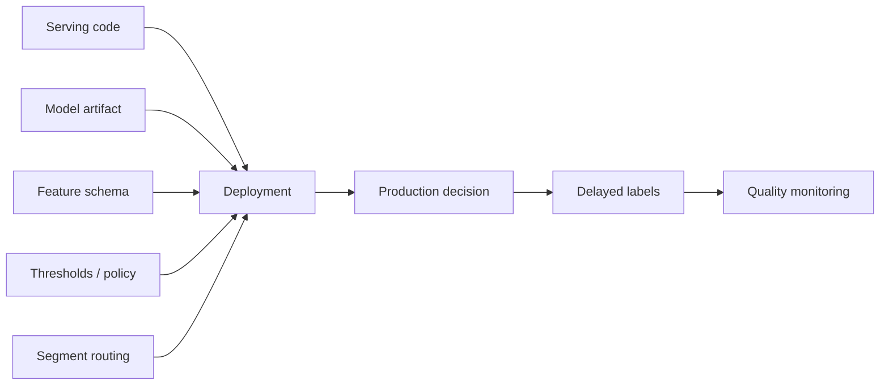
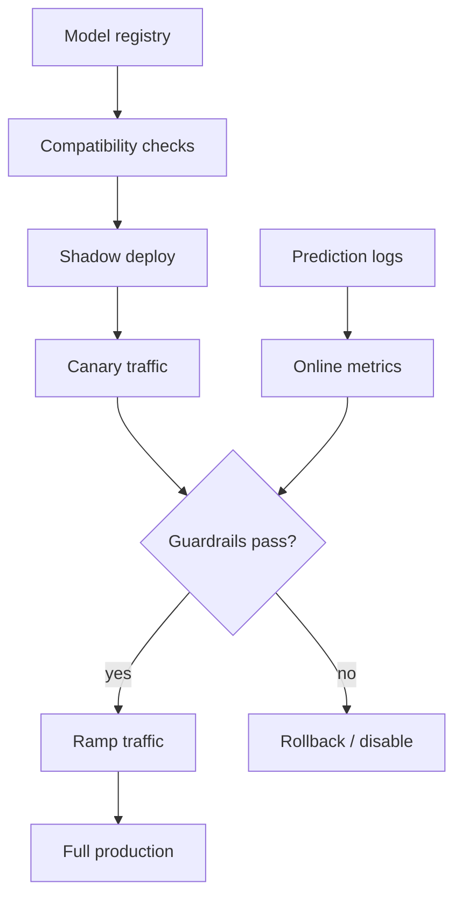
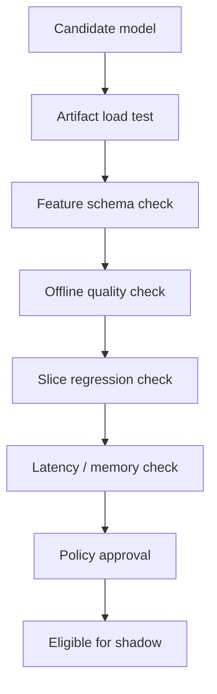

# Model Deployment and Rollouts

## TL;DR

Model deployment is not just pushing a binary. A model release changes a decision policy that depends on feature contracts, thresholds, calibration, segment routing, and delayed labels. Safe rollouts need artifact compatibility checks, shadow traffic, canaries, guardrail metrics, rollback paths, and post-deploy quality monitoring.

---

## Why Model Deployment Is Different

Application deployment usually asks: does the new code run and satisfy tests?

Model deployment also asks:

- Does the artifact expect the same feature schema the serving path provides?
- Does its score distribution match the thresholds and downstream policy?
- Does it behave safely on critical slices?
- Can quality be measured before delayed labels arrive?
- Can the old model be restored without replaying data migrations?



The release unit is the decision system, not the model file.

---

## Release Artifact Contract

Every deployable model should carry metadata that the platform can validate before promotion.

| Field | Purpose |
|---|---|
| Model name and version | Human and programmatic identity |
| Training data snapshot | Reproducibility and auditability |
| Feature schema version | Compatibility with online feature retrieval |
| Output contract | Score range, class labels, embeddings, calibrated probability |
| Runtime image | Dependency and hardware compatibility |
| Evaluation report | Offline metrics, slices, guardrails |
| Serving limits | Expected latency, memory, accelerator need |
| Rollback target | Known-good previous version |
| Owner | On-call and accountability |

Do not promote an artifact that cannot explain what produced it.

---

## Deployment Control Plane



The control plane should own traffic percentages, segment routing, model version pinning, rollback, and audit logs. Individual model teams should not hand-code these controls inside business logic.

### Canary with Automated Guardrails

```python
import time
from dataclasses import dataclass, field

@dataclass
class CanaryConfig:
    model_name: str
    candidate_version: str
    baseline_version: str
    initial_traffic_pct: float = 1.0
    max_traffic_pct: float = 100.0
    ramp_step_pct: float = 5.0
    step_duration_minutes: int = 30
    guardrails: dict = field(default_factory=dict)
    # metric -> (min, max), e.g., {"error_rate": (0, 0.01), "p99_latency_ms": (0, 100)}

def canary_rollout(config, metrics_client, traffic_router):
    """Gradual rollout with automated guardrail checks."""
    current_pct = config.initial_traffic_pct

    while current_pct <= config.max_traffic_pct:
        traffic_router.set_split(
            model_name=config.model_name,
            champion=config.baseline_version,
            challenger=config.candidate_version,
            challenger_pct=current_pct,
        )
        time.sleep(config.step_duration_minutes * 60)

        for metric_name, (lo, hi) in config.guardrails.items():
            val = metrics_client.get(config.candidate_version, metric_name,
                                     window_minutes=config.step_duration_minutes)
            if val < lo or val > hi:
                print(f"ABORT: {metric_name}={val} outside [{lo}, {hi}]")
                traffic_router.set_split(config.model_name, config.baseline_version, 100)
                return

        # Relative check: candidate shouldn't be >2x worse than baseline
        for metric_name, (lo, hi) in config.guardrails.items():
            candidate_val = metrics_client.get(config.candidate_version, metric_name)
            baseline_val = metrics_client.get(config.baseline_version, metric_name)
            if baseline_val > 0 and candidate_val / baseline_val > 2.0:
                print(f"ABORT: {metric_name} {candidate_val/baseline_val:.2f}x vs baseline")
                traffic_router.set_split(config.model_name, config.baseline_version, 100)
                return

        print(f"Guardrails OK at {current_pct}% — stepping up")
        current_pct += config.ramp_step_pct

    print(f"Canary complete: {config.candidate_version} at 100%")
```

### Canary Sizing: How Much Traffic?

```text
For detecting a regression of size δ in a metric with baseline rate p:

  Required samples ≈ (z_α + z_β)² × p(1-p) / δ²

Where z_α = 1.96 (α=0.05), z_β = 0.84 (80% power)

Example: fraud model, baseline FPR p=0.02
  Detect 20% increase in FPR → δ = 0.004
  n ≈ (1.96 + 0.84)² × 0.02 × 0.98 / 0.000016 ≈ 9,604 decisions

  At 1,000 decisions/hour:
    → ~10 hours of canary at 100% traffic
    → ~100 hours at 10% traffic
    → Need faster proxy metrics or larger canary %

For delayed labels (fraud chargebacks: 7-30 days):
  → Canary validates operational safety (latency, errors, score distribution)
  → Champion/challenger validates quality over weeks
  → Never ship on canary proxy metrics alone
```

---

## Rollout Patterns

| Pattern | What it validates | Strength | Blind spot |
|---|---|---|---|
| Offline evaluation | Historical quality | Fast and cheap | Cannot see live feedback loops |
| Shadow deployment | Runtime behavior under real traffic | No user impact | Does not validate decisions that affect users |
| Canary | Small live traffic | Validates end-to-end decision path | Delayed labels may hide quality regressions |
| Champion/challenger | Candidate against current model | Clear comparison | Needs stable assignment and enough traffic |
| A/B experiment | User or entity-level causal impact | Best for product outcomes | Slower and statistically heavier |
| Kill switch | Stop a bad model quickly | Limits blast radius | Requires a safe fallback |

Canary answers "is this safe enough to continue?" A/B testing answers "is this better?" Do not confuse them.

### Shadow Deployment with Resource Isolation

```python
def shadow_deploy(candidate_model, shadow_pct=10):
    """
    Run candidate on sampled traffic. Log predictions for comparison.
    Critical: isolate shadow resources from the production path.
    """
    def handle_request(request):
        # Champion path: always returns to user
        champion_response = champion_model.predict(request)

        # Shadow path: sampled, fire-and-forget, isolated pool
        if hash(request.user_id) % 100 < shadow_pct:
            shadow_pool.submit(
                shadow_predict_and_log,
                candidate_model, request, champion_response,
                timeout_ms=200,
            )

        return champion_response

    # NEVER: shadow_model.predict(request)  — blocks the champion path
    # NEVER: same feature-store pool for shadow and champion
```

### Kill Switch Pattern

```python
class KillSwitch:
    """Circuit breaker that disables a model with one config change."""
    def __init__(self, config_client, fallback_model):
        self.config = config_client
        self.fallback = fallback_model

    def predict(self, request):
        if self.config.get(f"kill_switch.{request.model_name}", False):
            return self.fallback.predict(request)
        return self.primary_model.predict(request)

# Operational flow:
# 1. Alert fires → on-call checks dashboard
# 2. On-call: config.set("kill_switch.fraud_v42", True)
# 3. All traffic instantly routes to fallback. No deploy. No restart.
# 4. Investigation happens without production pressure
```

---

## Pre-Deploy Gates



### Pre-Deploy Gate Implementation

```python
def pre_deploy_gates(artifact, registry, feature_store, capacity_planner) -> GateResult:
    failures = []

    # 1. Artifact load test
    try:
        model = artifact.load(runtime=artifact.runtime_image)
    except Exception as e:
        failures.append(f"Artifact load failed: {e}")

    # 2. Feature schema compatibility
    required_features = artifact.metadata["feature_schema"]
    available_features = feature_store.list_features()
    for feat_name, feat_type in required_features.items():
        if feat_name not in available_features:
            failures.append(f"Missing feature: {feat_name}")
        elif available_features[feat_name]["type"] != feat_type:
            failures.append(f"Type mismatch on {feat_name}")

    # 3. Score distribution sanity
    score_dist = artifact.metadata["evaluation"].get("score_distribution", {})
    if score_dist.get("std", 0) < 0.001:
        failures.append("Score distribution collapsed — near-constant output")

    # 4. Slice regression
    for slice_name, metrics in artifact.metadata["evaluation"].get("slices", {}).items():
        if slice_name in CRITICAL_SLICES and metrics.get("auc_roc", 0) < MIN_SLICE_AUC:
            failures.append(f"Critical slice {slice_name} below threshold")

    # 5. Capacity check
    if not capacity_planner.can_fit(artifact.metadata["serving_limits"]):
        failures.append("Insufficient capacity")

    # 6. Rollback target exists
    rollback_target = artifact.metadata.get("rollback_target")
    if rollback_target and not registry.has_version(artifact.name, rollback_target):
        failures.append(f"Rollback target {rollback_target} not in registry")

    return GateResult(passed=len(failures) == 0, failures=failures)
```

---

## Threshold and Policy Coupling

Many production models output a score, not a final action. The threshold or policy layer decides what happens.

```text
score >= 0.95  -> block
score >= 0.70  -> manual review
otherwise      -> allow
```

If the new model is better calibrated but has a different score distribution, reusing old thresholds can cause a production incident. Treat thresholds as versioned policy artifacts and roll them out with the model.

### Calibration-Aware Threshold Migration

```python
import numpy as np

def migrate_thresholds(old_model, new_model, calibration_set, old_thresholds):
    """Map old thresholds to new by matching decision rate, not score value."""
    old_scores = old_model.predict_proba(calibration_set)[:, 1]
    old_rates = {t: (old_scores >= t).mean() for t in old_thresholds.values()}

    new_scores = new_model.predict_proba(calibration_set)[:, 1]
    new_thresholds = {}
    for action, old_rate in old_rates.items():
        new_thresholds[action] = float(np.percentile(new_scores, 100 * (1 - old_rate)))

    for action in old_thresholds:
        print(f"  {action}: {old_thresholds[action]:.2f} → {new_thresholds[action]:.2f}")
    return new_thresholds
```

---

## Rollback Design

Rollback must be designed before rollout.

| Dependency | Rollback question |
|---|---|
| Model artifact | Is the previous artifact still loaded or quickly loadable? |
| Feature schema | Did the new model require new features that old code ignores safely? |
| Thresholds | Can policy be reverted independently? |
| Prediction logs | Can labels still join after rollback? |
| Batch outputs | Can stale precomputed scores be invalidated? |
| Downstream decisions | Are irreversible actions isolated behind review or compensation? |

For high-risk systems, prefer "disable candidate" over "redeploy old service." Traffic routers and model registries should make rollback a metadata operation.

### Rollback Playbook

```text
Rollback Playbook: fraud_model_v42

Pre-conditions:
  Rollback target: v41 (loaded, verified healthy)
  Kill switch: config key "kill_switch.fraud_model" → rules fallback
  Rollback SLA: < 5 min from decision to traffic shift

Trigger conditions:
  Error rate > 1% → PAGE
  p99 latency > 200ms → PAGE
  FPR > 3% on mature labels → investigate (non-paging)
  Manual review queue > 500 items → investigate (non-paging)

Steps:
  1. On-call acknowledges alert (< 2 min)
  2. Check dashboards: model or upstream dependency?
  3. If model: flip kill switch OR set traffic split to 100% v41
  4. Verify recovery: error rate ↓, latency normalizing
  5. Preserve v42 prediction logs for incident analysis
  6. Incident review within 24 hours

Rollback by registry (preferred):
  registry.set_active("fraud_model", "v41")   → no deploy, no restart

Rollback by kill switch (fastest):
  config.set("kill_switch.fraud_model", True)  → < 1 second
```

---

## Failure Modes

### Schema-Compatible but Semantically Wrong

The feature exists and has the right type, but its meaning changed. Example: `total_spend_30d` changes from gross to net revenue.

Mitigation: feature contracts with owners, semantic versioning, validation distributions, and feature change review.

### Canary Looks Good Because Labels Are Delayed

Short-term proxy metrics pass, but true labels arrive days later and reveal regression.

Mitigation: use conservative ramp rates for delayed-label domains, monitor proxy and delayed metrics separately, and keep champion/challenger comparison windows.

### Shadow Traffic Overloads Dependencies

Shadow models don't affect responses but still fetch features and run inference. A 50% shadow sample on a 4-GPU model means 2 extra GPUs just for shadow.

Mitigation: sample shadow traffic (start at 1-5%), isolate resource pools. Shadow should never degrade champion latency.

### Irreversible Decision Blast Radius

A bad model blocks payments, deletes content, bans users, or changes prices.

Mitigation: review queues, reversible first actions, kill switches, and staged authority. Let new models recommend before they decide.

### Rollback Amnesia

Team rolls back to v41, but v41 expects features deprecated during v42 development. Rollback fails because the old model can't load.

Mitigation: never delete old model artifacts from the registry. Keep previous N versions loaded or on warm standby. Validate rollback path as part of pre-deploy gates.

---

## Operational Metrics

| Category | Metrics |
|---|---|
| Release | Promotion rate, rollback rate, time to rollback, failed gates |
| Runtime | p99 latency, timeout rate, feature miss rate, model load failures |
| Traffic | Assignment ratio, sample ratio mismatch, segment coverage |
| Model behavior | Score distribution, class mix, fallback rate |
| Quality | Proxy metrics, delayed labels, slice regressions, calibration |
| Business guardrails | Revenue, fraud loss, user complaints, manual review volume |

---

## Architecture Review Checklist

- Is model promotion separate from service deployment?
- Are feature schemas validated before rollout?
- Are thresholds and policy versioned with the model?
- Does shadow traffic have resource isolation?
- Are canary guardrails defined before launch?
- Can rollback happen without a code deploy?
- Are delayed labels handled in the launch plan?
- Are irreversible actions protected by human review or safer fallback policy?
- Is the rollback target still loadable and verified healthy?

---

## Key Takeaways

1. Deploy the decision system, not just the model file.
2. Shadow validates runtime; canary validates safety; experiments validate improvement.
3. Feature schema, thresholds, and segment routing are part of the model release.
4. Rollback should be a platform operation, not an emergency rebuild.
5. Delayed labels make conservative ramping essential.
6. Never delete old model artifacts — rollback targets are production dependencies.
7. Calibrate thresholds to decision rates, not score values, when migrating between model versions.

---

## References

1. [Hidden Technical Debt in Machine Learning Systems](https://proceedings.neurips.cc/paper_files/paper/2015/file/86df7dcfd896fcaf2674f757a2463eba-Paper.pdf)
2. [TensorFlow Serving: Flexible, High-Performance ML Serving](https://arxiv.org/abs/1712.06139)
3. [MLflow Model Registry](https://mlflow.org/docs/latest/ml/model-registry/)
4. [KServe Documentation](https://kserve.github.io/website/)
5. [Canary Deployments for ML Models](https://mlops.community/canary-deployments-for-machine-learning/)
