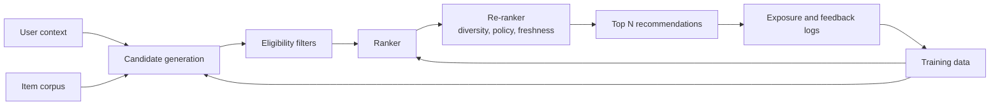
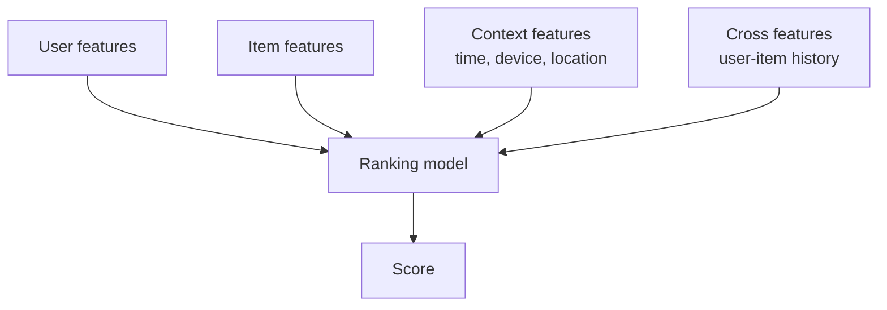

# Recommendation Systems

## TL;DR

Recommendation systems are multi-stage retrieval and ranking systems optimized for relevance, diversity, freshness, and business constraints under tight latency budgets. The core architecture is candidate generation, ranking, re-ranking, exploration, logging, and feedback. The hardest production problems are feedback loops, cold start, stale embeddings, slice regressions, and metric mismatch.

---

## Multi-Stage Architecture



A single global model rarely serves the whole path. Candidate generation optimizes recall across a large corpus. Ranking optimizes precision on a small candidate set. Re-ranking applies constraints that are hard to learn or should remain policy-controlled.

---

## Candidate Generation

Candidate generation reduces millions or billions of items to hundreds or thousands.

| Strategy | Strength | Weakness |
|---|---|---|
| Collaborative filtering | Learns behavior similarity | Cold-start users/items |
| Content-based retrieval | Works for new items with metadata | Can be narrow and repetitive |
| Approximate nearest neighbor | Fast vector retrieval | Embedding freshness and index rebuilds |
| Popular/trending lists | Simple fallback | Popularity bias |
| Graph traversal | Captures social or entity structure | Expensive and can overfit communities |
| Rules/editorial pools | High control | Low personalization |

Most large systems blend multiple candidate sources and record the source for each candidate. Source attribution makes debugging and exploration possible.

---

## Ranking Layer

The ranker scores candidates using user, item, context, and interaction features.



Ranking models often optimize predicted click, watch time, purchase, or retention. The chosen objective shapes user behavior, so the objective is a product and safety decision, not only an ML decision.

---

## Re-Ranking and Policy Layer

The highest-scoring list is not always the best list.

Re-ranking may enforce:

- Diversity across categories, creators, price bands, or topics.
- Freshness for news, feeds, and marketplaces.
- Deduplication and near-duplicate removal.
- Safety or policy suppression.
- Inventory fairness or seller exposure constraints.
- Business constraints such as availability, margin, or campaign rules.
- Exploration slots for learning.

Keep these controls explicit. If every constraint is hidden inside a model objective, rollback and policy review become difficult.

---

## Latency Budget

```text
Total p99 budget: 150 ms

User/context fetch        20 ms
Candidate generation      45 ms
Eligibility filters       15 ms
Feature hydration         25 ms
Ranking                   25 ms
Re-ranking                10 ms
Response/logging          10 ms
```

Feature hydration is often the bottleneck. If the ranker needs hundreds of per-user-per-item features, ranking 1,000 candidates can overwhelm the feature store. Precompute item features, cache hot user features, and reserve request-time features for the highest-value signals.

---

## Feedback Logging

Recommendation systems need more than clicks.

Log:

- Candidate IDs shown and not shown.
- Rank position and page/surface.
- Candidate source.
- Model and policy version.
- User context and eligibility filters.
- Impressions, clicks, dwell time, conversions, hides, reports.
- Timestamp and session context.

Without exposure logs, you cannot distinguish "user did not like it" from "user never saw it."

---

## Exploration

Pure exploitation makes the system self-confirming. The model keeps showing what it already believes is good, so it stops learning about alternatives.

Common exploration strategies:

| Strategy | Use when | Risk |
|---|---|---|
| Epsilon-greedy | Simple exploration slots | Can hurt experience if random pool is weak |
| Thompson sampling | Need adaptive exploration | Harder to explain and debug |
| UCB | Need uncertainty-aware ranking | Requires reliable uncertainty estimates |
| Stratified exploration | Need coverage across item/user slices | More operational setup |
| Editorial exploration pools | Need quality-controlled discovery | Less automated learning |

Exploration should have budgets and guardrails. Randomness without policy is not experimentation.

---

## Cold Start

| Problem | Mitigation |
|---|---|
| New user | Ask preferences, use context, geography, device, referrer, trending fallback |
| New item | Content embeddings, metadata, creator history, controlled exploration |
| New market | Global prior plus local exploration budget |
| Sparse domain | Hybrid rules and content retrieval before collaborative signals mature |

Cold-start fallback quality determines whether the system can bootstrap new inventory and new users.

---

## Failure Modes

### Popularity Bias

Popular items receive more exposure, gather more feedback, and become even more popular.

Mitigation: exploration slots, debiased training data, source quotas, and slice-level exposure monitoring.

### Filter Bubble

The system over-personalizes and narrows the user's experience.

Mitigation: diversity constraints, long-term satisfaction metrics, novelty budgets, and user controls.

### Objective Hacking

The model optimizes a proxy metric like click-through rate while harming retention, trust, or satisfaction.

Mitigation: guardrail metrics, long-term metrics, negative feedback, and human review of top-ranked examples.

### Stale Embeddings

Candidate retrieval uses old embeddings for users or items, so candidates become irrelevant.

Mitigation: embedding freshness SLOs, incremental index updates, fallback retrieval sources, and index rollback.

### Position Bias

Items shown higher get more clicks regardless of relevance.

Mitigation: randomized interleaving, position-aware models, exploration logs, and counterfactual evaluation where appropriate.

---

## Metrics

| Layer | Metrics |
|---|---|
| Retrieval | Recall@K, source contribution, candidate freshness, ANN latency |
| Ranking | NDCG, MAP, AUC, calibration, score distribution |
| Online | CTR, conversion, dwell time, retention, hides/reports |
| Diversity | Category coverage, creator coverage, novelty, repetition rate |
| Fairness/slices | Exposure by segment, quality by segment, cold-start success |
| Operations | p99 latency, cache hit rate, feature-store load, index freshness |

Offline ranking metrics are useful for iteration. Online experiments decide production impact.

---

## When to Use

Use recommendation systems when users face a large item space, relevance varies by user/context, and feedback can be logged safely.

Avoid heavy personalization when inventory is tiny, deterministic rules are more explainable, feedback is too sparse, or the system cannot tolerate feedback loops.

---

## Key Takeaways

1. Recommendations are retrieval plus ranking plus policy, not one model.
2. Exposure logging is required for learning and evaluation.
3. Re-ranking makes product and safety constraints explicit.
4. Exploration prevents the system from becoming self-confirming.
5. Optimize for long-term user and business outcomes, not only immediate clicks.

---

## References

1. [Deep Neural Networks for YouTube Recommendations](https://static.googleusercontent.com/media/research.google.com/en//pubs/archive/45530.pdf)
2. [Wide & Deep Learning for Recommender Systems](https://arxiv.org/abs/1606.07792)
3. [Matrix Factorization Techniques for Recommender Systems](https://datajobs.com/data-science-repo/Recommender-Systems-%5BNetflix%5D.pdf)
4. [The Use of Randomized Experiments in the Evaluation of Recommendation Systems](https://dl.acm.org/doi/10.1145/1864708.1864721)
