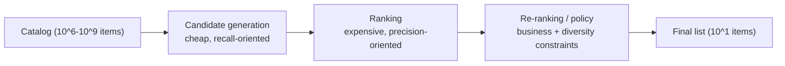

# Recommendation Systems

## TL;DR

A recommendation system is the infrastructure that selects a handful of items from a catalog of millions and presents them in tens of milliseconds, then learns from what the user did next. The hard parts are not the models; they are the *funnel* that makes the latency budget achievable, the *feedback loop* that makes the system improve without poisoning itself, and the *logging discipline* that makes any of it measurable. Treated as a system, a recommender is a latency-bounded, multi-stage retrieval pipeline wrapped around a data-integrity problem: the system trains on data it generated, so every flaw in how it logs, explores, and de-biases that data compounds into the next model.

---

## The Funnel Is the Architecture

The single defining constraint of a recommender is the gap between catalog size and latency budget. A catalog has millions of items. The response must arrive in tens of milliseconds. No model that scores a million items one-by-one can meet that budget, so the entire architecture is organized around *progressive narrowing*: cheap operations reduce millions to thousands, more expensive operations reduce thousands to hundreds, and the most expensive operations touch only the few hundred items that survive.



This is the same principle that governs any system facing an impossible per-item cost at scale: you do not make the expensive operation faster, you make sure it runs on far fewer items. A database does this with an index that turns a full-table scan into a B-tree lookup; a recommender does it with a retrieval stage that turns a full-catalog scan into an approximate-nearest-neighbor lookup. The funnel exists because the cost asymmetry between stages is enormous — retrieval might spend microseconds per item while ranking spends milliseconds — and the only way to afford the precise stage is to feed it a short list.

The canonical published example is YouTube's 2016 architecture (Covington et al.): a candidate-generation network narrows *millions* of videos to *hundreds*, and a separate ranking network scores those hundreds with far richer features. The paper's stated reason is exactly the funnel logic: the candidate model must be evaluable in a few milliseconds over the whole corpus (so it is shaped for ANN retrieval), while the ranker can afford hundreds of features per video because it only sees hundreds of videos. The per-item budget across the funnel spans roughly four orders of magnitude:

```text
Stage                 items in → out       per-item budget      model class
retrieval             10M → 2,000          ~0.1–1 µs            dot product in ANN index
ranking               2,000 → 50           ~10–50 µs            deep model, cross features
re-ranking / policy   50 → 10              ~100 µs+             set-level optimization, rules
```

The consequence that teams underappreciate is that **each stage has a different objective, and conflating them is a design error.** Retrieval optimizes for *recall*: it must not miss the good items, and it tolerates including mediocre ones because a later stage will filter them. Ranking optimizes for *precision*: given a small, already-decent set, it orders them as accurately as possible. Re-ranking optimizes for *constraints* the score ignores: diversity, freshness, business rules, fairness. A team that tries to make retrieval precise pays for ranking-quality computation across the whole catalog and blows the latency budget; a team that relies on ranking to fix retrieval's misses never recovers an item retrieval failed to surface. The stages are specialized on purpose.

---

## Candidate Generation: Recall Under a Microsecond Budget

Candidate generation answers one question — *which few thousand of these millions of items are even worth scoring?* — and it must answer in roughly a millisecond. The dominant pattern is *embedding retrieval*: represent the user and every item as vectors in a shared space, and retrieve the items whose vectors are closest to the user's. The modeling technique that produces those vectors (a two-tower network, matrix factorization, a graph embedding) is interchangeable; the *system* property that matters is that the item vectors can be precomputed and indexed, so serving-time work is reduced to a single vector lookup.

This precomputation is what makes retrieval affordable. Item embeddings change slowly, so they are computed in a batch job and loaded into an index. The user embedding is computed once per request. Retrieval then becomes "find the nearest item vectors to this user vector" — and crucially, that search is *approximate*. Exact nearest-neighbor search over millions of vectors is too slow; approximate-nearest-neighbor (ANN) indexes like HNSW and IVF-PQ trade a small, tunable amount of recall for one to two orders of magnitude in speed. The engineering decision is explicit: how much recall are you willing to lose to hit the latency target? An ANN index that returns 95% of the true top-K in 1ms is almost always a better system than an exact index that returns 100% in 50ms, because the lost 5% are largely re-surfaced by other retrieval sources and the latency saving funds the rest of the funnel.

Mature systems do not retrieve from a single source. They *blend* — an embedding-based source for personalized relevance, a popularity source so new users get something reasonable, a freshness source so recent items get exposure, a graph source for "users like you also engaged with." Each source is a recall strategy with different failure modes, and blending them is a hedge: the embedding source fails for cold users, the popularity source fails to personalize, and the union covers for both. This is a deliberately redundant design, the recommender equivalent of combining multiple indexes because no single access path serves every query.

The ANN index has its own lifecycle and SLOs; it is not a static file:

```text
item catalog changes → embedding job → index build → validation → staged load → active pointer flip
                                      ↘ incremental updates ↗
```

| Stage | Gate | Failure it prevents |
|---|---|---|
| Embedding generation | coverage, NaN rate, vector norm distribution | missing or corrupt item vectors |
| Index build | recall@K against exact search sample | fast but wrong retrieval |
| Staged load | memory footprint and warmup time | serving cold-start or OOM |
| Pointer flip | old index retained and warm | rollback amnesia |
| Incremental update | freshness lag and delete handling | stale or ghost items |

A recommender with no index rollback is a deployment system without rollback: one bad embedding job can make the catalog disappear from retrieval while every application endpoint stays healthy.

### The Two-Tower Model as a Systems Contract

The reason two-tower architectures dominate retrieval is not modeling elegance; it is that the architecture *is* the serving plan. The item tower runs offline over the catalog; the user tower runs once per request; the only serving-time interaction between them is a dot product — which is exactly the operation an ANN index accelerates:

```python
# Two-tower retrieval model (PyTorch), trained with in-batch negatives.
class TwoTower(nn.Module):
    def __init__(self, user_features, item_features, dim=128):
        super().__init__()
        self.user_tower = MLP(user_features, out=dim)   # runs per request
        self.item_tower = MLP(item_features, out=dim)   # runs in the nightly batch job

    def forward(self, user_x, item_x):
        u = F.normalize(self.user_tower(user_x), dim=-1)
        v = F.normalize(self.item_tower(item_x), dim=-1)
        return u @ v.T          # [batch, batch] similarity matrix

# In-batch negatives: each user's positive item serves as every other user's negative.
logits = model(user_x, item_x) / temperature
loss = F.cross_entropy(logits, torch.arange(len(logits)))   # diagonal = positives
```

Two production notes hide in those few lines. First, in-batch negatives are cheap but *popularity-biased* — popular items appear in batches more often, so they are over-penalized as negatives; Google's correction (Yi et al., 2019, the "sampling-bias-corrected" paper in the references) subtracts `log(p(item))` from the logit. Second, the architecture forbids user-item cross features by construction — the towers cannot see each other until the dot product — which is precisely why retrieval needs a ranking stage after it: the cross features that carry the most precision are architecturally impossible here and affordable there.

### Inside the ANN Index

"Approximate nearest neighbor" hides two very different engineering designs, and choosing between them is a memory-versus-recall-versus-build-time decision.

**HNSW (Hierarchical Navigable Small World)** is a multi-layer skip-list-like graph: each item is a node linked to `M` neighbors; upper layers are sparse express lanes, the bottom layer contains everything. A query greedily descends — start at the top layer's entry point, walk toward the query vector, drop a layer, repeat — and at the bottom explores a beam of `efSearch` candidates:

```text
Layer 2:   o ─────────── o                (few nodes, long hops)
Layer 1:   o ──── o ──── o ──── o         (more nodes)
Layer 0:   o─o─o─o─o─o─o─o─o─o─o─o        (all items, short links)
             greedy descent, then beam search at layer 0
```

The knobs map directly to SLOs: `M` (links per node, typically 16–48) trades memory for recall; `efSearch` (beam width) trades query latency for recall at *query* time — the one knob you can turn during an incident without rebuilding anything. HNSW gives excellent recall at ~1 ms for millions of vectors, but it stores the full vectors plus the graph, and it lives in RAM:

```text
10M items × 128-dim fp32:  10M × 512 B            ≈ 5.1 GB vectors
HNSW graph (M=32):         10M × 32 × 2 × 4 B     ≈ 2.6 GB links
Total                                              ≈ 7.7 GB per replica — fine.

500M items × 768-dim fp32: 500M × 3,072 B          ≈ 1.5 TB — does not fit anything.
```

**IVF-PQ (inverted file with product quantization)** is the answer when vectors stop fitting. IVF clusters the space into `nlist` cells (k-means centroids) and searches only the `nprobe` closest cells — an index in the database sense, pruning the scan. PQ then compresses each vector by splitting it into `m` sub-vectors and replacing each with a 1-byte codebook index:

```text
768-dim fp32 vector:                     3,072 bytes
PQ with m=96 subquantizers (8 bits each):   96 bytes   → 32× compression
500M items × 96 B ≈ 48 GB — fits a large box; recall@100 ≈ 0.9 with reranking
```

The standard production pattern is IVF-PQ for the coarse pass plus *exact reranking*: retrieve 1,000 candidates with compressed vectors, then rescore the top 1,000 with full-precision vectors fetched from a flat store. In Faiss (1.8), the whole design is one factory string:

```python
index = faiss.index_factory(768, "IVF65536,PQ96", faiss.METRIC_INNER_PRODUCT)
index.train(sample_vectors)      # k-means for centroids + PQ codebooks
index.add(item_vectors)
index.nprobe = 64                # cells to search: the recall/latency knob
D, I = index.search(user_vecs, k=1000)
```

| | HNSW | IVF-PQ (+ rerank) |
|---|---|---|
| Memory | Full vectors + graph (RAM-heavy) | ~32× compressed |
| Recall@100 | 0.95–0.99 | 0.85–0.95 |
| Query knob | `efSearch` | `nprobe` |
| Incremental adds | Good | Good (but centroids drift; retrain periodically) |
| Deletes | Tombstones, needs rebuild | Tombstones, needs rebuild |
| Best at | ≤ ~100M vectors, latency-critical | ≥ 100M vectors, memory-bound |

The operational trap in both: **deletes are tombstones**, not removals. An item pulled from the catalog keeps winning ANN searches until the next rebuild unless the serving layer filters it — which is one of the concrete jobs of the re-ranking stage's "never show out-of-stock items" rule, and a reason the index lifecycle table above treats delete handling as a first-class gate.

---

## Ranking: Precision on a Short List

Once retrieval has narrowed the catalog to a few hundred or few thousand candidates, ranking can afford to be expensive, because it runs on a short list. This inversion is the whole point of the funnel: the per-item budget grew by orders of magnitude precisely because the item count shrank by orders of magnitude. Ranking can now use rich cross-features between the user and each candidate — features that would have been impossibly expensive to compute across the full catalog.

The system-design substance of ranking is not the model architecture; it is *feature hydration*. To score a candidate, the ranker needs features about the user, the item, and their interaction, and those features live in different stores with different latencies. Fetching them naively — one round trip per candidate per feature — turns a few hundred candidates into thousands of sequential lookups and destroys the latency budget. The fix is the same batching-and-caching discipline that governs any latency-bounded service: fetch user features once per request (not once per candidate), batch all item-feature lookups into a single multi-get, cache hot item features in memory, and compute the model forward pass over the whole batch at once. The ranker's quality is bounded by the model, but its *latency* is bounded by how disciplined the feature hydration is, and hydration is where ranking systems most often miss their budget.

A subtle and important point is that ranking systems increasingly optimize *multiple objectives at once* — not just "will the user click" but "will they engage deeply, will they be satisfied tomorrow, will this harm long-term retention." The reason this is a system concern and not just a modeling one is that each objective needs its own logged signal, its own label-delay window, and its own weight in the final score, and those weights are *policy*, tuned through experimentation, not learned. The decision to weight long-term satisfaction over immediate clicks is a business decision encoded in the serving layer, and keeping it explicit and tunable — rather than buried in a loss function — is what lets a team adjust the system's behavior without retraining.

---

## Re-Ranking: Where Policy Becomes Explicit

The ranker produces a relevance-ordered list. Shipping that list directly is almost always wrong, because pure relevance ignores everything the business and the user care about beyond immediate relevance: diversity, freshness, fairness, de-duplication, and hard rules. Re-ranking is the stage where those constraints become explicit, operating on the final short list where their cost is affordable.

Diversity is the canonical example and reveals why re-ranking is its own stage. A purely relevance-ordered list tends to be monotonous — ten variations of the same item the user clicked once — because each individually scores well. But a list of ten near-identical items is worse for the user than a varied list of slightly-lower-scoring items, and no per-item relevance score captures that, because the badness is a property of the *set*, not of any item. Re-ranking optimizes the set: it balances relevance against the marginal diversity each item adds, whether through a determinantal point process, a greedy diversity penalty, or explicit category quotas. The mechanism matters less than the architectural point — *set-level objectives require a set-level stage*, and that stage must come after per-item ranking because it operates on the chosen few.

Re-ranking is also where hard business rules live, and keeping them here rather than in the model is deliberate. "Never show out-of-stock items," "respect this regulatory restriction," "honor this user's blocklist," "don't repeat what they saw an hour ago" — these are constraints that must be *guaranteed*, not learned as soft tendencies. A model can be coaxed toward a behavior; only an explicit policy filter can promise it. Putting these rules in a transparent, auditable re-ranking layer means they can be reasoned about, changed without retraining, and verified — which is exactly what compliance and product teams need.

---

## The Feedback Loop Is the Real System

Everything above describes serving a single request. The property that makes a recommender a *system* — and the source of its deepest failure modes — is that it trains on data it produced. The model decides what to show; the user reacts only to what was shown; that reaction becomes training data for the next model. This closed loop is what lets a recommender improve continuously, and it is also what lets a recommender quietly destroy itself.

The foundational requirement of the loop is *honest logging of what the user was actually shown*. Most engagement data answers "what did the user click," but the question the model needs is "what did the user click *given the specific set of options presented, in the specific order, by the specific model version*." A click on the top item means something very different from a click on the tenth, and a non-click on an item the user never scrolled to is not a signal of dislike — it is no signal at all. The *exposure log* is therefore the most important data artifact in the entire system: for every request it records what was shown, in what positions, by which model and policy version, under which experiment, and what the user did with each. Without this, the system cannot compute unbiased metrics, cannot train a calibrated model, and cannot attribute a behavior change to a model change.

This logging carries the same lineage burden as any auditable system. The exposure record must pin the model version and policy version that produced it, because months later, debugging a regression requires knowing exactly which model showed what. A recommender without disciplined exposure logging is in the same position as a training pipeline without lineage: it works until something breaks, at which point no one can explain what happened or roll it back.

A minimal exposure log schema looks like this:

```yaml
request_id: req_01J...
user_id: user_42
surface: home_feed
timestamp: 2026-06-24T12:01:08Z
experiment: feed_ranker_2026q2:treatment
retrieval_sources:
  embedding: { index: item_ann:v88, candidates: 1200 }
  popularity: { version: pop_24h:v12, candidates: 300 }
ranker: feed_ranker:v42
rerank_policy: diversity_policy:v9
shown:
  - { item_id: item_7, position: 1, score: 0.91, source: embedding, explored: false }
  - { item_id: item_9, position: 2, score: 0.83, source: freshness, explored: true }
not_shown_sample:
  - { item_id: item_13, rank_before_policy: 11, reason: diversity_filter }
```

The `not_shown_sample` field is not optional for advanced systems. Without some record of candidates that lost, the system cannot debug whether a model failed because retrieval missed an item, ranking buried it, or policy filtered it. It also cannot do serious counterfactual evaluation, because the logs contain only the winners of the old policy.

---

## Why the Loop Poisons Itself, and How to Stop It

A recommender trained naively on its own logs degrades in characteristic, well-documented ways. Understanding these failure trajectories matters more than any single countermeasure, because they all stem from the same root: *the model only sees feedback on items it chose to show, so it cannot learn about the items it didn't.*

**Popularity bias** is the gravitational pull of the loop. Popular items get shown more, so they accumulate more positive feedback, so the model ranks them higher, so they get shown even more. Left unchecked, the system collapses toward a small set of blockbusters and the long tail goes dark — not because users dislike tail items, but because the system stopped giving them a chance to express interest. The defense is to *correct for exposure* in training: down-weight feedback in proportion to how often an item was shown, so an item that earned engagement despite rare exposure is recognized as genuinely good rather than merely lucky to be popular.

**The filter bubble** is the same dynamic applied to a single user. The system learns a user likes one category, shows more of it, gets more confirmation, and narrows relentlessly until the user sees only that category and the system has no idea what else they might enjoy. The defense is the diversity constraint in re-ranking plus deliberate exploration — the system must occasionally show something outside its confident prediction to keep learning.

**Position bias** corrupts the labels themselves. Items at the top of the list get more clicks *because* they are at the top, independent of relevance. A model that treats a top-position click as pure relevance signal learns position, not quality, and the bias compounds. The defense is to model position explicitly — log the position, account for it during training so the model learns relevance net of position, and serve as if every item were in a neutral slot. The two standard mechanisms are worth seeing concretely. *Inverse propensity weighting* divides each click's training weight by the probability the item was examined at its position, so a click earned in position 10 counts for more than one earned in position 1:

```python
# Examination propensities, estimated from randomization or an intervention log
# (e.g., swap positions 1<->2 on 1% of traffic and compare CTRs).
propensity = {1: 1.00, 2: 0.72, 3: 0.55, 5: 0.38, 10: 0.19}

sample_weight = clicked / propensity[position]     # IPS-weighted loss
loss = weighted_bce(model(features), clicked, sample_weight)
```

The *position-as-feature* alternative feeds the logged position into the model during training and a constant neutral position at serving, letting the network absorb the bias into a feature it will never again see vary. IPS is unbiased but high-variance when propensities are small (clip them); position-as-feature is low-variance but only as correct as the model's ability to disentangle position from relevance. Either is enormously better than pretending clicks are relevance.

**Objective hacking** is the failure of optimizing a proxy. A system tuned purely for immediate clicks learns to show clickbait — items that earn the click and betray it. The metric improves while the product degrades, because the metric was never the goal, only a measurable stand-in for it. The defense is guardrail metrics and long-term objectives: optimize for engagement that predicts satisfaction and retention, and block any model that improves clicks while harming the guardrails.

The unifying lesson is that **a recommender cannot be trusted to optimize its own training data without explicit countermeasures**, because the loop rewards every shortcut. Exposure correction, diversity constraints, position de-biasing, and guardrail metrics are not refinements; they are the load-bearing structure that keeps the loop from converging on a degenerate equilibrium.

---

## Exploration: Paying to Stay Informed

The feedback loop has a fundamental blind spot: the system never learns about items or matches it never tries. If the model is uncertain whether a user would like a new category, the safe play is to keep showing what it already knows works — but that certainty is self-fulfilling, because the only way to reduce the uncertainty is to show the thing and observe the reaction. A purely exploitative system optimizes itself into ignorance.

Exploration is the deliberate decision to sometimes show an item the model is *unsure* about rather than the item it is most confident in, accepting a small short-term cost to gather information that improves long-term decisions. The simplest form perturbs a fraction of slots with random or under-explored candidates; more sophisticated forms allocate exploration in proportion to uncertainty, concentrating it where the information payoff is highest. The system-design requirement underneath all exploration strategies is the same: *exploration must be logged as exploration.* When the system shows an item because it was exploring rather than because it scored highest, the resulting feedback has different statistical properties, and using it correctly — for unbiased evaluation, for off-policy learning — requires knowing it was exploratory. Exploration without logging is just noise injected into the metrics.

The economic framing is useful: exploration is the system spending a known, bounded amount of current engagement to buy information that prevents the filter-bubble and popularity-collapse failures. A system that refuses to spend it saves money today and goes blind tomorrow.

---

## Cold Start: The Loop Has No History to Stand On

The feedback loop assumes history, so it breaks precisely where history is absent: new users and new items. This is not an edge case to be patched later; it is a structural gap that every recommender must design around, because new users and items arrive continuously.

A new item has no embedding learned from interactions, so the embedding-retrieval source cannot surface it — and if it is never surfaced, it never earns the interactions that would give it an embedding, a chicken-and-egg deadlock that exploration alone is too slow to break. The system-level fix is to bootstrap the new item from *content* rather than behavior: derive an initial embedding from its metadata, category, and text so it can be retrieved on day one, then let interaction data progressively refine it. New items also need a deliberate exploration budget — a guaranteed slice of exposure — precisely because the loop would otherwise starve them.

A new *user* presents the mirror problem: the system has nothing to personalize on. The honest design acknowledges this and degrades gracefully — lean on popularity and context (location, device, time, referral) rather than fabricating personalization, and treat the first session as an intensive exploration window to learn preferences quickly. The architectural point is that the blended, multi-source retrieval design pays off exactly here: the popularity and content sources carry the experience while the personalized source has nothing to say, and the system stays useful through the gap.

---

## Embedding Freshness: A Cache-Invalidation Problem

Item embeddings are precomputed and indexed, which is what makes retrieval fast — but precomputation means the index is a *cache*, and like every cache it can go stale. An item whose nature changed, a trend that shifted, a new item awaiting its first index build: each is a case where the served vectors no longer reflect reality, and the system silently retrieves on outdated representations.

This reframes embedding freshness as the classic cache-invalidation trade-off. Rebuilding the entire index from scratch is simple and correct but slow and expensive, so it cannot run often, which means it leaves a long staleness window. Incrementally updating only changed and new items keeps the index fresh at much lower cost but adds the complexity of tracking what changed and reconciling incremental updates against periodic full rebuilds. The right design is usually both: frequent incremental updates to keep new and changed items current, plus periodic full rebuilds to correct the drift that incremental updates accumulate. The decision of how fresh the index must be is a domain question — a news recommender measures staleness tolerance in minutes, a movie recommender in days — and it sets the entire freshness architecture.

---

## The Latency Budget Is a System Contract

The funnel exists to meet a latency budget, and that budget is best treated as an explicit contract allocated across stages. A typical end-to-end budget of a few tens of milliseconds must cover candidate generation, feature hydration, ranking inference, and re-ranking, and every stage spends against the same fixed account. When a stage overspends, the system must shed work gracefully rather than blow the budget — return fewer candidates, skip an expensive re-ranking pass, serve a cached result — because a recommendation that arrives too late is worse than a slightly less perfect one that arrives on time.

The dominant cost is usually not model inference; it is feature hydration, the I/O of gathering the features each stage needs. This mirrors the lesson from training pipelines, where I/O dominates compute: the expensive part of a recommender at serving time is moving data — fetching user features, item features, and interaction features from their respective stores — not the matrix multiplications. Consequently the highest-leverage latency optimizations are the data-movement ones: cache hot features in memory, batch all lookups, precompute what can be precomputed, and co-locate features with the serving path. A team that profiles a slow recommender almost always finds the time in the fetches, not the forward pass.

A realistic latency contract makes the funnel operational:

```text
Home feed p99 budget: 80 ms
  user/context features            8 ms
  retrieval: ANN + blend          12 ms
  item feature hydration          20 ms
  rank 500 candidates             22 ms
  re-rank/policy/diversity         8 ms
  logging + response              10 ms
```

If item feature hydration grows to 40 ms, the correct first fix is not a larger ranker GPU; it is fewer candidates, better batch multi-get, hotter item-feature cache, or precomputed feature blocks. A recommender is usually won or lost in data movement.

---

## Failure Modes

The recurring failures of recommender systems are, almost without exception, failures of the feedback loop rather than the model.

**Popularity collapse** is the system converging on a handful of blockbusters as the loop amplifies exposure into engagement into more exposure. The tail goes dark and the catalog effectively shrinks. Defense: exposure-corrected training and a guaranteed exploration budget for the tail.

**The filter bubble** is per-user collapse — the system narrows a user's experience to a single confirmed interest until it knows nothing else about them. Defense: diversity constraints in re-ranking and deliberate per-user exploration.

**Position-bias contamination** is the model learning that top position causes clicks and optimizing for a signal that is mostly an artifact of its own ordering. Defense: log positions and de-bias them in training.

**Objective hacking** is the model maximizing a proxy metric while degrading the real product — clickbait that earns the click and loses the user. Defense: long-term objectives and guardrail metrics that block click-improving, satisfaction-harming models.

**Stale embeddings** are the silent retrieval failure: the index serves vectors that no longer reflect items or trends, and the degradation is invisible because nothing errors. Defense: incremental index updates plus periodic full rebuilds, sized to the domain's freshness tolerance.

Every one of these passes through production unnoticed unless the system is explicitly instrumented to catch it, which is why a recommender's monitoring must track catalog coverage, diversity, and long-term outcomes — not just the click-through rate that all of these failures can improve while the system rots.

---

## Metrics: Why Offline Numbers Mislead

Recommender metrics form a hierarchy, and the danger is mistaking a lower rung for the top one. Offline metrics — does the model rank held-out engaged items highly — are cheap and fast but systematically optimistic, because they are computed on logged data that the *old* model generated, and they cannot observe how users would react to recommendations the old model never made. A model that looks better offline can perform worse online precisely because offline evaluation is blind to the counterfactual.

Online metrics from controlled experiments are the real measure, but even here the hierarchy matters: immediate engagement (clicks) is easy to move and easy to hack, while the metrics that actually matter — long-term satisfaction, retention, diversity of consumption — are slower, noisier, and harder to attribute. The discipline is to treat immediate engagement as a *guarded* primary metric: promote on it only when guardrail metrics confirm the system is not buying short-term clicks with long-term harm. This is the same promotion-gate philosophy that governs any consequential ML rollout (see [Online Experiments](./08-online-experiments.md) and [ML Risk & Governance](./09-ml-risk-governance.md)) — the metric you optimize must be guarded by the metrics you refuse to sacrifice.

---

## When to Use

A recommendation system earns its considerable complexity when users face a large item space, relevance genuinely varies by user and context, and feedback can be logged and acted on safely. The funnel, the feedback loop, and the de-biasing machinery are all justified by scale and personalization need.

Skip heavy personalization when the inventory is small enough to show everything, when deterministic rules are more explainable and sufficient, when feedback is too sparse to learn from, or when the domain cannot tolerate feedback loops — because a recommender's machinery is overhead that only pays off when there is genuinely too much to show and enough signal to learn what to show.

---

## Key Takeaways

1. A recommender is a latency-bounded funnel: cheap recall-oriented retrieval narrows millions to thousands, expensive precision-oriented ranking orders the survivors, and policy-oriented re-ranking applies set-level constraints.
2. Each stage has a distinct objective; conflating recall, precision, and constraints is a design error that either blows the latency budget or degrades quality.
3. Retrieval is fast because item embeddings are precomputed and served from an approximate-nearest-neighbor index — an explicit recall-for-latency trade.
4. The feedback loop is the real system: the model trains on data it generated, so logging, exploration, and de-biasing determine whether it improves or self-destructs.
5. The exposure log — what was shown, where, by which version — is the most important data artifact; without it the system is unmeasurable and unrollbackable.
6. Popularity bias, filter bubbles, position bias, and objective hacking are all loop failures requiring explicit countermeasures, not modeling refinements.
7. Cold start is a structural gap, not an edge case; bootstrap new items from content and reserve exploration budget for them.
8. At serving time, feature hydration (I/O) dominates inference (compute); the latency budget is won in the data-movement path.

---

## References

1. [Deep Neural Networks for YouTube Recommendations](https://static.googleusercontent.com/media/research.google.com/en//pubs/archive/45530.pdf)
2. [Wide & Deep Learning for Recommender Systems](https://arxiv.org/abs/1606.07792)
3. [Matrix Factorization Techniques for Recommender Systems](https://datajobs.com/data-science-repo/Recommender-Systems-%5BNetflix%5D.pdf)
4. [The Use of Randomized Experiments in the Evaluation of Recommendation Systems](https://dl.acm.org/doi/10.1145/1864708.1864721)
5. [Sampling-Bias-Corrected Neural Modeling for Large Corpus Item Recommendations](https://research.google/pubs/sampling-bias-corrected-neural-modeling-for-large-corpus-item-recommendations/)
6. [FAISS: A Library for Efficient Similarity Search](https://github.com/facebookresearch/faiss)
7. [Diversity-Promoting Recommendation with Determinantal Point Processes](https://arxiv.org/abs/1603.07645)
