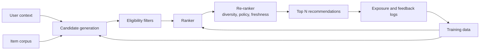
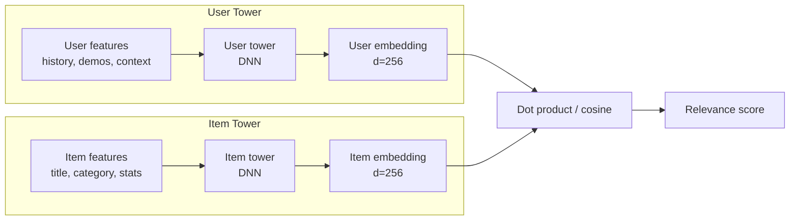
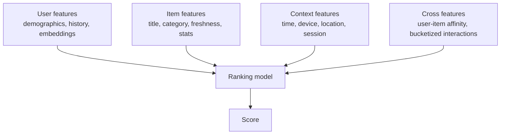

# Recommendation Systems

## TL;DR

Recommendation systems are multi-stage retrieval and ranking pipelines optimized for relevance, diversity, freshness, and business constraints under tight latency budgets. The core architecture is candidate generation, ranking, re-ranking, exploration, logging, and feedback. The hardest production problems are feedback loops, cold start, stale embeddings, slice regressions, and metric mismatch.

---

## Multi-Stage Architecture

A single global model rarely serves the whole path. Candidate generation optimizes recall across a large corpus. Ranking optimizes precision on a small candidate set. Re-ranking applies constraints that are hard to learn or should remain policy-controlled.



### Why Multi-Stage?

A single model scoring millions of items per request is impossible at production latency. The stages solve different problems:

| Stage | Problem | Input size | Output size | Metric |
|---|---|---|---|---|
| Candidate generation | Recall | Millions | Hundreds | Recall@K |
| Ranking | Precision | Hundreds | Tens | NDCG, AUC |
| Re-ranking | Constraints | Tens | Tens | Business metrics |

---

## Candidate Generation

Candidate generation reduces millions or billions of items to hundreds or thousands.

| Strategy | Strength | Weakness |
|---|---|---|
| Collaborative filtering | Learns behavior similarity | Cold-start users/items |
| Content-based retrieval | Works for new items with metadata | Can be narrow and repetitive |
| Approximate nearest neighbor | Fast vector retrieval | Embedding freshness and index rebuilds |
| Popular/trending lists | Simple fallback | Popularity bias |
| Graph traversal | Captures social or entity structure | Expensive and can overfit communities |
| Rules/editorial pools | High control | Low personalization |

Most large systems blend multiple candidate sources and record the source for each candidate. Source attribution makes debugging and exploration possible.

### Two-Tower Retrieval (YouTube DNN Style)

The most common production retrieval architecture today is the two-tower model:



The user tower runs online. The item tower runs offline (or is precomputed) and stored in an ANN index. At serving time, the user embedding is computed once and used to query the index.

```python
# Simplified two-tower training
import torch
import torch.nn as nn

class TwoTower(nn.Module):
    def __init__(self, user_dim, item_dim, emb_dim=256):
        super().__init__()
        self.user_tower = nn.Sequential(
            nn.Linear(user_dim, 512), nn.ReLU(),
            nn.Linear(512, 256),  nn.ReLU(),
            nn.Linear(256, emb_dim)
        )
        self.item_tower = nn.Sequential(
            nn.Linear(item_dim, 512), nn.ReLU(),
            nn.Linear(512, 256),  nn.ReLU(),
            nn.Linear(256, emb_dim)
        )
        self.temperature = nn.Parameter(torch.tensor(0.07))

    def compute_embeddings(self, user_features, item_features):
        user_emb = self.user_tower(user_features)
        item_emb = self.item_tower(item_features)
        # Normalize to unit sphere for cosine similarity
        user_emb = nn.functional.normalize(user_emb, dim=1)
        item_emb = nn.functional.normalize(item_emb, dim=1)
        return user_emb, item_emb

    def forward(self, user_features, item_features):
        user_emb, item_emb = self.compute_embeddings(user_features, item_features)
        # In-batch softmax: positive is diagonal, negatives are other items in batch
        logits = user_emb @ item_emb.T / self.temperature
        labels = torch.arange(len(logits))  # diagonal
        loss = nn.functional.cross_entropy(logits, labels)
        return loss
```

In-batch negatives are the standard training trick: every other item in the batch becomes a negative example for free. This avoids materializing explicit negatives at the cost of popularity bias (popular items appear more often as negatives, pushing them down).

### ANN Index at Serving Time

Once item embeddings are trained, they are indexed for fast approximate nearest neighbor search:

```python
# Indexing item embeddings (simplified)
import faiss
import numpy as np

# item_embeddings: (num_items, emb_dim) precomputed offline
item_embeddings = np.random.randn(10_000_000, 256).astype('float32')

# Build IVF index — clusters embeddings into centroids for fast lookup
nlist = 4096  # number of clusters
quantizer = faiss.IndexFlatIP(256)  # inner product = cosine on normalized vectors
index = faiss.IndexIVFFlat(quantizer, 256, nlist, faiss.METRIC_INNER_PRODUCT)
index.train(item_embeddings)
index.add(item_embeddings)

# At serving time: user_emb is computed online
user_emb = np.random.randn(1, 256).astype('float32')
nprobe = 64  # search this many clusters
index.nprobe = nprobe
distances, item_ids = index.search(user_emb, k=500)

# Expected latency: ~5-15 ms on a single CPU core for 10M items, 256 dims
```

The trade-off: more `nprobe` clusters = higher recall, higher latency. Fewer `nlist` = faster index build, coarser quantization. Most teams tune `nprobe` as a recall-vs-latency dial and monitor recall@K against exact brute-force search.

### Multi-Source Blending

Real systems don't rely on one source. YouTube, Instagram, and Netflix all blend:

```
Final candidates = ANN retrieval (50%) + trending (15%) + social graph (15%) + new items (10%) + editorial (10%)
```

Each source's contribution is logged per candidate. If a slice degrades, source attribution tells you which pipeline broke.

---

## Ranking Layer

The ranker scores candidates using user, item, context, and interaction features.



### Wide & Deep Architecture (Google Play)

The canonical ranking architecture from Google's 2016 paper:

```python
# Wide & Deep ranking model (simplified)
class WideAndDeep(nn.Module):
    def __init__(self, num_categorical, num_continuous, emb_dims, hidden=[1024, 512, 256]):
        super().__init__()
        # Deep part: embeddings + MLP
        self.embeddings = nn.ModuleList([
            nn.Embedding(vocab_size, dim) for vocab_size, dim in emb_dims
        ])
        deep_input_dim = sum(dim for _, dim in emb_dims) + num_continuous
        layers = []
        prev = deep_input_dim
        for h in hidden:
            layers.extend([nn.Linear(prev, h), nn.ReLU(), nn.Dropout(0.2)])
            prev = h
        self.deep = nn.Sequential(*layers)

        # Wide part: linear on raw features + cross-product transformations
        wide_input_dim = num_categorical + num_continuous  # simplified
        self.wide = nn.Linear(wide_input_dim, 1)

        # Final layer
        self.final = nn.Linear(hidden[-1] + 1, 1)

    def forward(self, categorical, continuous, wide_features):
        # Deep path
        embs = [emb(categorical[:, i]) for i, emb in enumerate(self.embeddings)]
        deep_in = torch.cat(embs + [continuous], dim=1)
        deep_out = self.deep(deep_in)

        # Wide path: memorization of feature crosses
        wide_out = self.wide(wide_features)

        # Combine
        combined = torch.cat([deep_out, wide_out], dim=1)
        return torch.sigmoid(self.final(combined))
```

The wide part memorizes specific feature interactions (e.g., "user installed app X AND app Y" → high probability of installing Z). The deep part generalizes to unseen feature combinations. This is the fundamental trade-off: memorization vs. generalization.

### Ranking Objective Design

Ranking models optimize a predicted metric: click, watch time, purchase, retention. The chosen objective shapes user behavior — it is a product and safety decision, not only an ML decision.

```python
# Click-through rate: standard binary cross-entropy
loss_ctr = nn.BCELoss()(pred, click_label)

# Watch time (YouTube): weighted logistic regression
# Weight each positive by watch time, negatives by 1.0
weights = watch_time_label * click_label + 1.0 * (1 - click_label)
loss_watch_time = nn.BCEWithLogitsLoss(weight=weights)(logit, click_label)

# Multi-task: predict click + completion + satisfaction simultaneously
class MultiTaskRanker(nn.Module):
    def __init__(self, shared_dim, task_names):
        super().__init__()
        self.shared = nn.Sequential(
            nn.Linear(shared_dim, 512), nn.ReLU(),
            nn.Linear(512, 256), nn.ReLU()
        )
        self.tasks = nn.ModuleDict({
            name: nn.Linear(256, 1) for name in task_names
        })

    def forward(self, features):
        shared = self.shared(features)
        return {name: head(shared) for name, head in self.tasks.items()}

# Loss: weighted sum of task losses
# Task weights are tuned via grid search or learned (uncertainty weighting)
```

Multi-task learning is the norm in production ranking. A YouTube-style system might jointly predict click, watch time, like, share, and survey satisfaction. The shared bottom layers learn representations useful for all tasks, while task-specific heads specialize.

---

## Re-Ranking and Policy Layer

The highest-scoring list is not always the best list.

Re-ranking may enforce:

- Diversity across categories, creators, price bands, or topics.
- Freshness for news, feeds, and marketplaces.
- Deduplication and near-duplicate removal.
- Safety or policy suppression.
- Inventory fairness or seller exposure constraints.
- Business constraints such as availability, margin, or campaign rules.
- Exploration slots for learning.

Keep these controls explicit. If every constraint is hidden inside a model objective, rollback and policy review become difficult.

### Determinantal Point Processes (DPP) for Diversity

A common approach to diversity re-ranking:

```python
# Simplified greedy DPP for diversity
import numpy as np

def dpp_greedy(item_scores, item_embeddings, k, diversity_weight=0.3):
    """
    Greedy maximum a posteriori (MAP) inference for DPP.
    Balances relevance (score) and diversity (embedding cosine distance).
    """
    n = len(item_scores)
    selected = []
    candidates = list(range(n))

    for _ in range(k):
        best_idx = None
        best_score = -float('inf')

        for i in candidates:
            relevance = item_scores[i]

            # Diversity penalty: max similarity to already-selected items
            if selected:
                selected_embs = item_embeddings[selected]
                similarities = selected_embs @ item_embeddings[i]
                diversity_penalty = diversity_weight * np.max(similarities)
            else:
                diversity_penalty = 0.0

            combined = relevance - diversity_penalty
            if combined > best_score:
                best_score = combined
                best_idx = i

        if best_idx is not None:
            selected.append(best_idx)
            candidates.remove(best_idx)

    return selected
```

In practice, DPP and similar diversity algorithms are applied as a final pass over the top 50-100 candidates, adding ~1-2 ms to the re-ranking budget.

---

## Latency Budget

A concrete budget for a feed recommendation system:

```text
Total p99 budget: 150 ms

User/context fetch        20 ms
Candidate generation      45 ms
Eligibility filters       15 ms
Feature hydration         25 ms
Ranking                   25 ms
Re-ranking                10 ms
Response/logging          10 ms
```

Feature hydration is often the bottleneck. If the ranker needs hundreds of per-user-per-item features, ranking 1,000 candidates can overwhelm the feature store. Precompute item features, cache hot user features, and reserve request-time features for the highest-value signals.

### Feature Hydration Optimization

```python
# DON'T: fetch features for every candidate individually
for candidate in candidates:
    item_features = feature_store.get(candidate.item_id)  # 1000 network calls
    user_features = feature_store.get(user_id)             # redundant

# DO: batch fetch item features, cache user features
item_ids = [c.item_id for c in candidates]
item_features = feature_store.batch_get(item_ids)  # 1 network call
user_features = user_cache.get(user_id)             # local cache

# Feature budget calculation:
# - 1000 candidates × 50 features each = 50,000 feature values
# - If feature store p99 is 5 ms per batch of 100 keys:
#   1000 / 100 = 10 batches × 5 ms = 50 ms — already 1/3 of budget
# Mitigation: precompute item features in the index, only fetch at request time
#   for user features (50 features) + cross features (user × item affinity)
```

---

## Feedback Logging

Recommendation systems need more than clicks.

Log:

- Candidate IDs shown and not shown.
- Rank position and page/surface.
- Candidate source.
- Model and policy version.
- User context and eligibility filters.
- Impressions, clicks, dwell time, conversions, hides, reports.
- Timestamp and session context.

Without exposure logs, you cannot distinguish "user did not like it" from "user never saw it."

### Exposure Log Schema

```yaml
exposure_log:
  request_id: "req_abc123"
  timestamp_ms: 1719705600000
  user_id: "user_456"
  surface: "home_feed"
  experiment_id: "exp_rank_v42"
  model_version: "ranker_v17"
  policy_version: "policy_v9"
  candidates:
    - item_id: "video_789"
      rank: 1
      source: "ann_retrieval"
      score: 0.923
      shown: true
    - item_id: "video_101"
      rank: 2
      source: "trending"
      score: 0.891
      shown: true
    - item_id: "video_202"
      rank: 3
      source: "ann_retrieval"
      score: 0.845
      shown: true
      # filtered by diversity re-ranker, still logged
      # user scrolled past, also logged
  feedback:
    - item_id: "video_789"
      impression: true
      click: true
      dwell_time_ms: 45000
      completed: false
      share: false
    - item_id: "video_101"
      impression: true
      click: false
```

Exposure logs are the foundation for debiasing training data, computing position-adjusted metrics, and debugging regressions. Store them in a columnar format (Parquet, BigQuery) for efficient analysis.

---

## Exploration

Pure exploitation makes the system self-confirming. The model keeps showing what it already believes is good, so it stops learning about alternatives.

Common exploration strategies:

| Strategy | Use when | Risk |
|---|---|---|
| Epsilon-greedy | Simple exploration slots | Can hurt experience if random pool is weak |
| Thompson sampling | Need adaptive exploration | Harder to explain and debug |
| UCB | Need uncertainty-aware ranking | Requires reliable uncertainty estimates |
| Stratified exploration | Need coverage across item/user slices | More operational setup |
| Editorial exploration pools | Need quality-controlled discovery | Less automated learning |

### Epsilon-Greedy with Logging

```python
import random

def rank_with_exploration(candidates, ranker, epsilon=0.02):
    """
    Epsilon-greedy: with probability epsilon, insert a random item
    into the top K positions and log exploration.
    """
    ranked = ranker.score_and_sort(candidates)
    top_k = ranked[:20]

    if random.random() < epsilon:
        # Pick a random slot in top K to replace
        slot = random.randint(0, min(4, len(top_k) - 1))  # explore in top 5
        explore_candidate = random.choice(candidates)
        explore_candidate.exploration = True
        explore_candidate.source = "exploration_epsilon"
        top_k[slot] = explore_candidate

    return top_k
```

Exploration should have budgets and guardrails. Randomness without policy is not experimentation. A reasonable starting point: 1-2% exploration traffic for well-established surfaces, higher (5-10%) for new surfaces building their initial feedback data.

---

## Cold Start

| Problem | Mitigation |
|---|---|
| New user | Ask preferences, use context, geography, device, referrer, trending fallback |
| New item | Content embeddings, metadata, creator history, controlled exploration |
| New market | Global prior plus local exploration budget |
| Sparse domain | Hybrid rules and content retrieval before collaborative signals mature |

### New Item Cold Start Pipeline

```python
def new_item_candidate_generation(new_item, item_corpus, user_context):
    """
    Blend multiple signals for new items with no interaction history.
    """
    candidates = []

    # 1. Content-based: use item metadata embedding
    content_emb = text_encoder.encode(new_item.title + " " + new_item.description)
    similar_items = ann_index.search(content_emb, k=50)
    candidates.extend(similar_items)

    # 2. Creator affinity: users who liked this creator's past items
    creator_items = creator_index.get(new_item.creator_id, top_k=20)
    candidates.extend(creator_items)

    # 3. Freshness boost: all items published in last 24h get a slot
    fresh_items = recent_items_store.get(hours=24, limit=20)
    candidates.extend(fresh_items)

    # 4. Guaranteed exploration: allocate 1 slot in top N for new items
    # This ensures the item gets at least some impressions to gather feedback

    return deduplicate_and_merge(candidates)
```

Cold-start fallback quality determines whether the system can bootstrap new inventory and new users. The exploration budget for new items is a product decision: too aggressive and users see irrelevant content; too conservative and new creators never get distribution.

---

## Embedding Freshness

Candidate retrieval uses precomputed embeddings. Stale embeddings produce irrelevant recommendations.

```text
Embedding freshness lifecycle:

1. Item embedding computed offline: daily batch job
2. User embedding computed online: per request
3. Item index rebuilt: daily (full rebuild) or incremental (streaming)
4. New item embedding: computed on publish, added to index within minutes

Freshness SLOs:
- Item embedding: < 24 hours for stable items, < 5 minutes for new items
- User embedding: computed per request (always fresh)
- Index rebuild: < 2 hours (daily batch), < 1 minute (incremental adds)
```

### Incremental Index Update

```python
# Full rebuild: daily, replaces the entire index
# Incremental: add new items, remove deleted items

def incremental_index_update(index, new_items, deleted_ids):
    """Add new item embeddings to the index without full rebuild."""
    for item in new_items:
        emb = item_embedding_tower.encode(item.features)
        index.add_with_ids(np.array([emb]), np.array([item.id]))
    for item_id in deleted_ids:
        index.remove_ids(np.array([item_id]))
    return index

# Monitoring: if incremental drift exceeds threshold, trigger full rebuild
# Compare recall@K of incremental vs full index on a query sample
```

---

## Failure Modes

### Popularity Bias

Popular items receive more exposure, gather more feedback, and become even more popular.

Mitigation: exploration slots, debiased training data, source quotas, and slice-level exposure monitoring.

The in-batch negative sampling used in two-tower training amplifies this: popular items appear more often as negatives. Mitigation techniques:

```python
# Logit correction for in-batch negative sampling bias
# Each item's logit is adjusted by its estimated sampling probability
import math

def corrected_logits(logits, item_frequencies, batch_items):
    """
    Subtract log(item_frequency) to correct for popularity bias in negatives.
    Items that appear frequently in batches get a penalty.
    """
    freqs = item_frequencies[batch_items]
    correction = torch.log(torch.clamp(freqs, min=1e-8))
    return logits - correction
```

### Filter Bubble

The system over-personalizes and narrows the user's experience.

Mitigation: diversity constraints, long-term satisfaction metrics, novelty budgets, and user controls.

### Objective Hacking

The model optimizes a proxy metric like click-through rate while harming retention, trust, or satisfaction.

Mitigation: guardrail metrics, long-term metrics, negative feedback, and human review of top-ranked examples.

### Stale Embeddings

Candidate retrieval uses old embeddings for users or items, so candidates become irrelevant.

Mitigation: embedding freshness SLOs, incremental index updates, fallback retrieval sources, and index rollback.

### Position Bias

Items shown higher get more clicks regardless of relevance.

Mitigation: randomized interleaving, position-aware models, exploration logs, and counterfactual evaluation where appropriate.

```python
# Position-aware model: add position as a feature during training
# but set it to a constant (e.g., position=1) at inference time
class PositionAwareRanker(nn.Module):
    def __init__(self, feature_dim, max_position=100):
        super().__init__()
        self.position_embedding = nn.Embedding(max_position + 1, 16)
        self.mlp = nn.Sequential(
            nn.Linear(feature_dim + 16, 256), nn.ReLU(),
            nn.Linear(256, 128), nn.ReLU(),
            nn.Linear(128, 1)
        )

    def forward(self, features, position):
        pos_emb = self.position_embedding(position)
        combined = torch.cat([features, pos_emb], dim=1)
        return self.mlp(combined)

    def predict(self, features):
        """At inference, fix position to 1 (top position)."""
        position = torch.ones(len(features), dtype=torch.long)
        return self.forward(features, position)
```

---

## Metrics

| Layer | Metrics |
|---|---|
| Retrieval | Recall@K, source contribution, candidate freshness, ANN latency |
| Ranking | NDCG, MAP, AUC, calibration, score distribution |
| Online | CTR, conversion, dwell time, retention, hides/reports |
| Diversity | Category coverage, creator coverage, novelty, repetition rate |
| Fairness/slices | Exposure by segment, quality by segment, cold-start success |
| Operations | p99 latency, cache hit rate, feature-store load, index freshness |

Offline ranking metrics are useful for iteration. Online experiments decide production impact.

### Metric Hierarchy

```
Primary:    Long-term retention (monthly active users)
Guardrail:  Hides/reports rate < 0.5%, creator coverage > 80%
Diagnostic: CTR, dwell time, diversity score, session length
Slice:      New user retention, new creator exposure, per-language quality
```

If a model improves CTR by 5% but drops retention by 2%, the model does not ship. Guardrail metrics block promotion even when the primary metric looks good.

---

## When to Use

Use recommendation systems when users face a large item space, relevance varies by user/context, and feedback can be logged safely.

Avoid heavy personalization when inventory is tiny, deterministic rules are more explainable, feedback is too sparse, or the system cannot tolerate feedback loops.

---

## Key Takeaways

1. Recommendations are retrieval plus ranking plus policy, not one model.
2. Two-tower models with ANN indexing are the standard retrieval pattern.
3. Exposure logging is required for learning and evaluation.
4. Re-ranking makes product and safety constraints explicit.
5. Exploration prevents the system from becoming self-confirming.
6. Optimize for long-term user and business outcomes, not only immediate clicks.
7. Guardrail metrics block promotion even when primary metrics improve.

---

## References

1. [Deep Neural Networks for YouTube Recommendations](https://static.googleusercontent.com/media/research.google.com/en//pubs/archive/45530.pdf)
2. [Wide & Deep Learning for Recommender Systems](https://arxiv.org/abs/1606.07792)
3. [Matrix Factorization Techniques for Recommender Systems](https://datajobs.com/data-science-repo/Recommender-Systems-%5BNetflix%5D.pdf)
4. [The Use of Randomized Experiments in the Evaluation of Recommendation Systems](https://dl.acm.org/doi/10.1145/1864708.1864721)
5. [Sampling-Bias-Corrected Neural Modeling for Large Corpus Item Recommendations](https://research.google/pubs/sampling-bias-corrected-neural-modeling-for-large-corpus-item-recommendations/)
6. [FAISS: A Library for Efficient Similarity Search](https://github.com/facebookresearch/faiss)
7. [Diversity-Promoting Recommendation with Determinantal Point Processes](https://arxiv.org/abs/1603.07645)